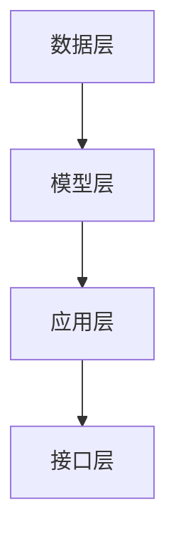
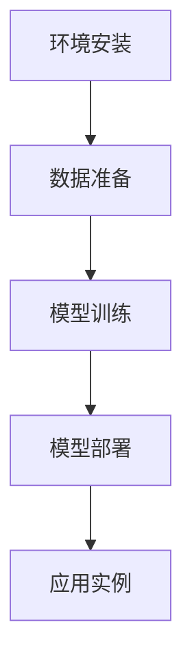

                 

### 让我们一步一步思考：大模型在知识图谱补全与纠错中的创新

在当今这个大数据与人工智能快速发展的时代，知识图谱作为一种结构化的语义知识表示形式，已经在多个领域（如搜索引擎、智能问答、推荐系统等）展现出了其独特的价值。然而，知识图谱往往存在着不完备和错误的情况，这使得知识图谱的应用受到了一定的限制。大模型，作为人工智能领域的一项重要技术，其在知识图谱补全与纠错中的作用愈发显著。下面，我们将一步一步地分析大模型在知识图谱补全与纠错中的创新。

### 第一步：问题背景

首先，我们需要了解知识图谱的基本概念。知识图谱是一种由实体、属性和关系构成的图形结构，用于表示知识领域中的实体和它们之间的关联。然而，现实中的知识图谱往往不完整，即存在一些实体、属性或关系的缺失。例如，在一个关于人物的图谱中，可能缺少某个人物的部分属性（如出生日期、职业等）或者某些关系（如亲属关系、合作项目等）。

其次，知识图谱中的错误也是不可避免的。这些错误可能来自于数据源的不一致、信息抽取的错误或者人工编辑的错误。例如，一个人物的出生日期可能因为不同的数据源而有所不同，或者某个关系因为信息抽取的失误而被错误地表示。

知识图谱的不完备和错误问题，限制了其在实际应用中的效果和准确性。因此，如何有效地对知识图谱进行补全和纠错，成为一个亟待解决的问题。

### 第二步：大模型的概念与优势

大模型，通常指的是深度学习模型，尤其是大规模神经网络模型。这些模型通过训练大量的数据，可以自动学习到复杂的数据特征和模式，从而实现高效的数据处理和知识表示。

大模型在知识图谱补全与纠错中的优势主要体现在以下几个方面：

1. **强大的表示能力**：大模型可以捕捉到数据中的复杂模式和潜在关系，从而更准确地理解和补全知识图谱中的缺失信息。
2. **自主学习能力**：大模型可以通过不断的学习和优化，自动调整模型参数，提高补全和纠错的准确性和效率。
3. **适应性强**：大模型可以在不同的知识领域和应用场景中进行训练和部署，从而实现跨领域和跨场景的知识图谱补全与纠错。

### 第三步：大模型在知识图谱补全中的应用

在知识图谱补全方面，大模型主要通过以下几种方式发挥作用：

1. **实体识别与分类**：大模型可以识别出知识图谱中的未标注实体，并对其进行分类，从而补充知识图谱中的缺失实体。
2. **关系抽取与补全**：大模型可以学习到实体之间的潜在关系，并自动补全知识图谱中的缺失关系。
3. **属性填充与推断**：大模型可以通过学习实体与属性之间的关系，推断出实体未标注的属性。

以下是一个简单的算法流程：

1. **数据预处理**：对知识图谱进行清洗和预处理，包括去除噪声、修复错误等。
2. **实体识别**：使用预训练的大模型对知识图谱中的未标注实体进行识别和分类。
3. **关系抽取**：通过实体间的相似性和共现关系，使用大模型抽取知识图谱中的缺失关系。
4. **属性填充**：利用实体与属性之间的关联性，使用大模型推断出实体未标注的属性。

### 第四步：大模型在知识图谱纠错中的应用

在知识图谱纠错方面，大模型同样发挥着重要作用：

1. **错误检测**：大模型可以检测出知识图谱中的不一致和错误，如数据源之间的矛盾、属性值的不一致等。
2. **错误修正**：大模型可以根据已知的正确信息，自动修正知识图谱中的错误。
3. **一致性维护**：大模型可以通过学习知识图谱中的数据一致性规律，维护知识图谱的一致性和完整性。

以下是一个简单的算法流程：

1. **数据预处理**：对知识图谱进行清洗和预处理，包括去除噪声、修复错误等。
2. **错误检测**：使用预训练的大模型检测知识图谱中的不一致和错误。
3. **错误修正**：根据错误检测的结果，使用大模型自动修正知识图谱中的错误。
4. **一致性维护**：通过学习知识图谱中的数据一致性规律，使用大模型维护知识图谱的一致性和完整性。

### 第五步：数学模型与公式

在具体实现中，大模型通常需要使用一些数学模型和公式来进行参数优化和性能评估。以下是一些常用的数学模型和公式：

1. **损失函数**：用于评估模型预测值与真实值之间的差距，常用的有交叉熵损失函数、均方误差损失函数等。
2. **优化算法**：如梯度下降算法、Adam优化器等，用于调整模型参数，以最小化损失函数。
3. **正则化方法**：如L1正则化、L2正则化等，用于防止模型过拟合。
4. **评价指标**：如准确率、召回率、F1分数等，用于评估模型的性能。

以下是一个简单的数学模型示例：

$$
\text{损失函数} = -\frac{1}{N}\sum_{i=1}^{N}y_i\log(p(x_i))
$$

其中，$N$为样本数量，$y_i$为第$i$个样本的真实标签，$p(x_i)$为模型对第$i$个样本的预测概率。

### 第六步：系统分析与架构设计

在知识图谱补全与纠错系统中，我们需要设计一个合理的系统架构，以确保系统的性能和可扩展性。以下是一个简单的系统架构设计：

1. **数据层**：包括知识图谱的数据存储和预处理，如实体识别、关系抽取、属性填充等。
2. **模型层**：包括大模型的训练和部署，如使用预训练模型、自定义模型等。
3. **应用层**：包括知识图谱的补全与纠错功能，如错误检测、错误修正、一致性维护等。
4. **接口层**：包括与外部系统的接口，如数据导入、数据导出、API接口等。

以下是一个简单的系统架构图：

### 第七步：项目实战

为了更好地理解大模型在知识图谱补全与纠错中的应用，我们以下通过一个实际项目来展示整个流程。

1. **环境安装**：首先，我们需要安装必要的软件和工具，如Python环境、深度学习框架（如TensorFlow或PyTorch）等。
2. **数据准备**：收集和准备用于训练和测试的知识图谱数据，包括实体、关系和属性等。
3. **模型训练**：使用大模型（如BERT、GPT等）对知识图谱数据进行训练，以获得一个性能良好的模型。
4. **模型部署**：将训练好的模型部署到服务器或云端，以便进行知识图谱的补全与纠错。
5. **应用实例**：通过实际案例展示大模型在知识图谱补全与纠错中的应用效果。

以下是一个简单的项目流程图：

### 第八步：最佳实践与拓展

在知识图谱补全与纠错领域，大模型的应用仍然处于不断发展之中。以下是一些最佳实践和未来研究方向：

1. **数据质量**：保证知识图谱数据的质量，包括一致性、准确性和完整性。
2. **模型优化**：不断优化大模型的训练过程和参数，以提高补全和纠错的准确性和效率。
3. **跨领域应用**：探索大模型在不同领域中的应用，如生物信息学、金融领域等。
4. **数据隐私**：在知识图谱补全与纠错过程中，保护用户数据的隐私和安全。

以下是一个简单的拓展思路：

- **增强学习**：将增强学习技术引入知识图谱补全与纠错，以提高模型的自主学习和自适应能力。
- **迁移学习**：利用迁移学习技术，将一个领域中的知识迁移到另一个领域，以提高模型的泛化能力。
- **多模态学习**：结合文本、图像、音频等多种数据类型，进行多模态学习，以提高知识图谱的补全与纠错能力。

通过以上步骤，我们可以全面地理解大模型在知识图谱补全与纠错中的创新应用。在实际应用中，我们需要结合具体问题和需求，不断优化和改进模型和系统架构，以提高知识图谱的应用效果和准确性。

### 结论

大模型在知识图谱补全与纠错中的应用，为我们提供了一种有效的方法来提高知识图谱的完整性和准确性。随着人工智能技术的不断发展，大模型在知识图谱领域的应用将更加广泛，为各种应用场景提供强大的支持。未来，我们期待看到更多创新性的研究成果，推动知识图谱技术的持续进步。

### 作者信息

作者：AI天才研究院/AI Genius Institute & 禅与计算机程序设计艺术 /Zen And The Art of Computer Programming

