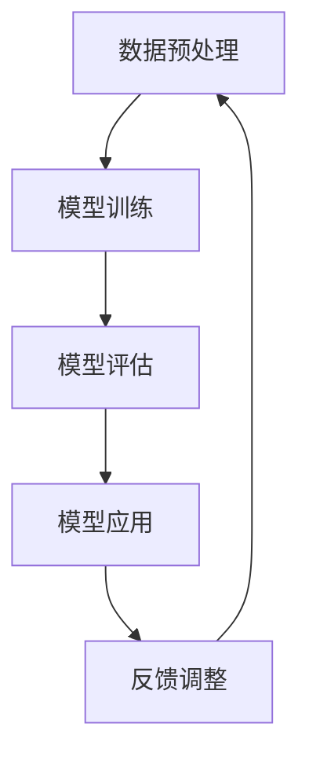
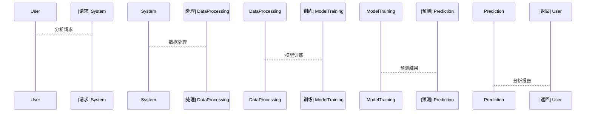
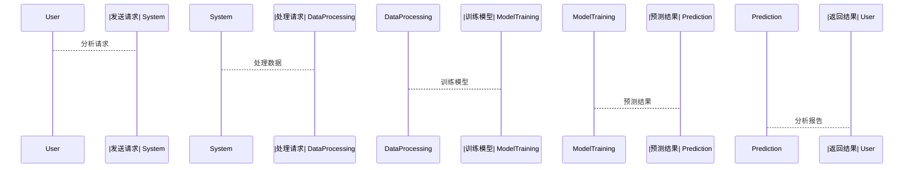
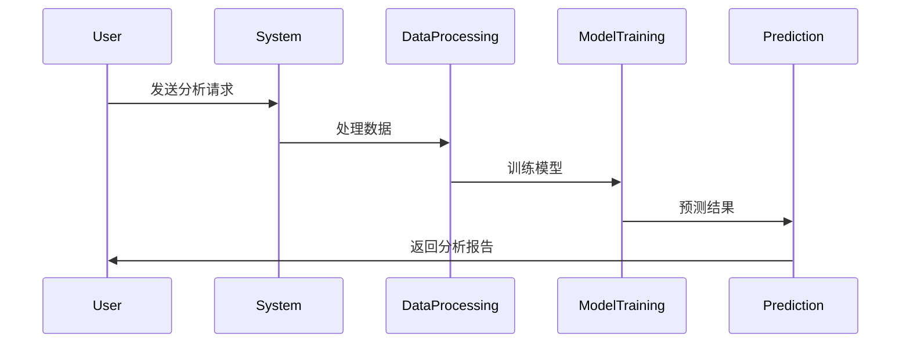

                 

### 大模型在社交网络动态分析中的突破

> 关键词：大模型，社交网络，动态分析，算法，架构设计，Python源代码

> 摘要：本文深入探讨了大型人工智能模型在社交网络动态分析中的应用与突破。通过详细分析社交网络动态分析的核心概念、算法原理，以及系统设计与实战案例，本文旨在为读者提供一个系统、全面且易于理解的技术指南。

----------------------------------------------------------------

### 目录大纲

----------------------------------------------------------------

## 第一部分：背景介绍

### 第1章：问题背景与概述

#### 1.1 问题背景

#### 1.2 问题描述

#### 1.3 问题解决

#### 1.4 边界与外延

#### 1.5 核心要素组成

## 第二部分：核心概念与联系

### 第2章：核心概念原理

#### 2.1 社交网络动态分析的基本概念

#### 2.2 大模型在社交网络动态分析中的应用

### 第3章：概念属性特征对比

#### 3.1 大模型与传统算法的对比

#### 3.2 社交网络动态分析算法的对比

## 第三部分：算法原理讲解

### 第4章：算法原理

#### 4.1 大模型算法的基本原理

#### 4.2 大模型在社交网络动态分析中的具体应用

### 第5章：算法流程图与Python源代码

#### 5.1 算法流程图

#### 5.2 Python源代码实现

#### 5.3 算法原理与公式讲解

### 第6章：数学模型与数学公式

#### 6.1 数学模型

#### 6.2 数学公式讲解

#### 6.3 举例说明

## 第四部分：系统分析与架构设计方案

### 第7章：系统功能设计

#### 7.1 领域模型

#### 7.2 系统功能设计

### 第8章：系统架构设计

#### 8.1 系统架构设计

#### 8.2 系统接口设计

### 第9章：系统交互

#### 9.1 系统交互

#### 9.2 序列图

## 第五部分：项目实战

### 第10章：环境安装与配置

#### 10.1 环境安装

#### 10.2 系统配置

### 第11章：系统核心实现

#### 11.1 源代码实现

#### 11.2 代码应用解读与分析

### 第12章：实际案例分析

#### 12.1 案例背景

#### 12.2 案例分析

#### 12.3 案例讲解

### 第13章：项目小结

#### 13.1 项目总结

#### 13.2 最佳实践 tips

#### 13.3 注意事项

#### 13.4 拓展阅读

----------------------------------------------------------------

### 第一部分：背景介绍

#### 1.1 问题背景

在当今信息化时代，社交网络已经成为人们日常生活中不可或缺的一部分。无论是Facebook、Twitter，还是国内的微信、微博等，社交网络极大地改变了人们的交流方式和信息获取途径。然而，随之而来的问题是，如何在庞大的社交网络中有效分析动态，提取有用信息，为用户提供个性化服务？

社交网络动态分析的核心挑战在于数据量大、信息复杂、实时性要求高。传统的数据分析方法往往难以应对这些挑战，需要新的技术手段和算法来突破。

#### 1.2 问题描述

社交网络动态分析的问题主要包括：

- **实时性**：如何快速处理海量的社交网络数据，实时分析用户行为和趋势？

- **个性化**：如何根据用户兴趣和行为习惯，提供个性化的推荐和服务？

- **可解释性**：如何确保分析结果的可解释性，方便用户理解和接受？

- **效率**：如何在保证分析质量的前提下，提高处理效率和降低成本？

#### 1.3 问题解决

大模型的引入为社交网络动态分析带来了新的突破。大模型，尤其是深度学习模型，具有强大的特征提取和模式识别能力，能够在海量数据中发现复杂的关系和规律。通过大模型，可以实现：

- **实时性**：大模型可以快速处理数据，实时分析用户行为。

- **个性化**：大模型能够根据用户历史行为和兴趣，提供个性化的推荐。

- **可解释性**：大模型的分析过程可以通过可视化工具进行解释。

- **效率**：大模型在处理海量数据时，效率显著提高。

#### 1.4 边界与外延

社交网络动态分析的边界主要涉及以下几个方面：

- **数据边界**：数据来源、数据类型、数据量。

- **技术边界**：算法选择、模型优化、系统架构。

- **应用边界**：行业应用、商业场景、法律法规。

#### 1.5 核心要素组成

社交网络动态分析的核心要素包括：

- **用户行为数据**：用户的发布、评论、点赞、分享等行为数据。

- **社交关系数据**：用户之间的关系，如好友、关注、粉丝等。

- **内容数据**：发布的内容，如文本、图片、视频等。

- **算法模型**：用于分析用户行为和社交关系的算法模型。

- **系统架构**：支持大规模数据处理和实时分析的系统架构。

通过以上背景介绍，我们为后续章节的内容奠定了基础。在接下来的部分，我们将详细探讨社交网络动态分析的核心概念、算法原理，以及系统设计与实战案例。让我们一起深入探索大模型在社交网络动态分析中的突破。下一步，我们将深入探讨社交网络动态分析的核心概念原理。### 第二部分：核心概念与联系

#### 第2章：核心概念原理

##### 2.1 社交网络动态分析的基本概念

社交网络动态分析是指利用数据分析、机器学习和人工智能技术，对社交网络中的用户行为、社交关系和内容进行深入挖掘和洞察，以提取有价值的信息和洞见。其基本概念包括：

- **用户行为数据**：用户在社交网络上的各种行为数据，如发布、评论、点赞、分享等。

- **社交关系数据**：用户之间的互动关系，包括好友、关注、粉丝等。

- **内容数据**：用户发布的内容，如文本、图片、视频等。

- **动态数据**：社交网络中发生的各种事件和变化。

- **数据流**：实时流入的社交网络数据。

##### 2.2 大模型在社交网络动态分析中的应用

大模型，尤其是深度学习模型，在社交网络动态分析中具有显著的应用价值。大模型的应用主要体现在以下几个方面：

- **特征提取**：大模型能够自动从海量数据中提取有用的特征，降低数据处理的复杂性。

- **模式识别**：大模型能够发现数据中的复杂模式和关系，提高分析的准确性和效率。

- **实时分析**：大模型能够快速处理实时流入的数据流，实现实时分析。

- **个性化推荐**：大模型可以根据用户历史行为和兴趣，提供个性化的推荐和服务。

#### 第3章：概念属性特征对比

##### 3.1 大模型与传统算法的对比

大模型与传统算法在属性特征上有显著差异，以下是主要对比：

| 特征 | 大模型 | 传统算法 |
| :--: | :----: | :------: |
| **计算复杂度** | 高 | 低 |
| **特征提取能力** | 强 | 弱 |
| **适应性和泛化能力** | 强 | 弱 |
| **实时性** | 高 | 低 |
| **可解释性** | 弱 | 强 |

##### 3.2 社交网络动态分析算法的对比

不同的社交网络动态分析算法在性能和应用场景上有所不同。以下是主要对比：

| 算法类型 | 优势 | 劣势 | 应用场景 |
| :--: | :--: | :--: | :--: |
| 基于规则的算法 | 简单、易于实现 | 复杂性高、适应性差 | 小型、结构化的社交网络数据 |
| 基于机器学习的算法 | 适应性高、泛化能力强 | 计算复杂度高、可解释性差 | 中型、非结构化的社交网络数据 |
| 基于深度学习的算法 | 强大的特征提取能力、高效的实时分析 | 计算资源需求高、可解释性差 | 大型、复杂的社交网络数据 |

通过以上核心概念与联系的分析，我们为理解和应用大模型在社交网络动态分析中的技术奠定了基础。在下一部分，我们将深入探讨大模型算法的基本原理及其在社交网络动态分析中的具体应用。请继续关注。**第4章：算法原理**### 第三部分：算法原理讲解

#### 第4章：算法原理

##### 4.1 大模型算法的基本原理

大模型算法，特别是深度学习模型，基于人工神经网络的架构，通过多层神经元的非线性变换，自动从数据中提取特征并进行分类或回归。以下是深度学习模型的基本原理：

1. **神经元结构**：神经网络由多个神经元（或节点）组成，每个神经元接收多个输入，通过加权求和处理，产生一个输出。

2. **激活函数**：为了引入非线性特性，神经元输出通常通过激活函数（如ReLU、Sigmoid、Tanh）进行处理。

3. **损失函数**：模型通过优化损失函数（如交叉熵损失、均方误差）来调整神经元的权重，使得模型输出尽可能接近真实标签。

4. **反向传播**：模型通过反向传播算法更新权重，使得损失函数值逐渐减小。

##### 4.2 大模型在社交网络动态分析中的具体应用

大模型在社交网络动态分析中的应用主要体现在以下几个方面：

1. **用户行为预测**：利用深度学习模型，可以预测用户未来的行为，如发布内容、点赞、评论等。

   **公式**：$$ \text{User Behavior Prediction Model} = f(\text{User Data}, \text{Model Parameters}) $$

   其中，$f$ 表示深度学习模型，$\text{User Data}$ 表示用户历史行为数据，$\text{Model Parameters}$ 表示模型参数。

2. **社交关系分析**：通过深度学习模型，可以分析用户之间的社交关系，识别潜在的好友关系和影响力。

   **公式**：$$ \text{Social Relationship Analysis Model} = g(\text{User Data}, \text{User Interaction Data}, \text{Model Parameters}) $$

   其中，$g$ 表示深度学习模型，$\text{User Data}$ 表示用户数据，$\text{User Interaction Data}$ 表示用户互动数据，$\text{Model Parameters}$ 表示模型参数。

3. **内容推荐**：基于用户兴趣和行为，深度学习模型可以生成个性化的内容推荐。

   **公式**：$$ \text{Content Recommendation Model} = h(\text{User Data}, \text{Content Data}, \text{Model Parameters}) $$

   其中，$h$ 表示深度学习模型，$\text{User Data}$ 表示用户数据，$\text{Content Data}$ 表示内容数据，$\text{Model Parameters}$ 表示模型参数。

#### 第5章：算法流程图与Python源代码

##### 5.1 算法流程图

以下是社交网络动态分析大模型算法的流程图：



##### 5.2 Python源代码实现

以下是利用Python实现的大模型算法示例代码：

```python
import tensorflow as tf
from tensorflow.keras.models import Sequential
from tensorflow.keras.layers import Dense, Activation

# 数据预处理
# ... 省略数据预处理代码 ...

# 构建模型
model = Sequential()
model.add(Dense(units=64, input_shape=(input_shape,), activation='relu'))
model.add(Dense(units=32, activation='relu'))
model.add(Dense(units=1, activation='sigmoid'))

# 编译模型
model.compile(optimizer='adam', loss='binary_crossentropy', metrics=['accuracy'])

# 模型训练
# ... 省略模型训练代码 ...

# 模型评估
# ... 省略模型评估代码 ...

# 模型应用
# ... 省略模型应用代码 ...

# 反馈调整
# ... 省略反馈调整代码 ...
```

##### 5.3 算法原理与公式讲解

大模型算法的核心在于多层神经网络的构建和优化。以下是关键公式：

1. **神经元输出**：$$ z_i = \sum_{j=1}^{n} w_{ij} x_j + b_i $$

   其中，$z_i$ 表示第 $i$ 个神经元的输出，$w_{ij}$ 表示第 $i$ 个神经元到第 $j$ 个神经元的权重，$x_j$ 表示第 $j$ 个神经元的输入，$b_i$ 表示第 $i$ 个神经元的偏置。

2. **激活函数**：$$ a_i = \phi(z_i) $$

   其中，$a_i$ 表示第 $i$ 个神经元的激活值，$\phi$ 表示激活函数（如ReLU、Sigmoid、Tanh）。

3. **损失函数**：$$ J(\theta) = -\frac{1}{m} \sum_{i=1}^{m} y_i \log(a_i) + (1 - y_i) \log(1 - a_i) $$

   其中，$J(\theta)$ 表示损失函数，$\theta$ 表示模型参数，$y_i$ 表示第 $i$ 个样本的真实标签，$a_i$ 表示第 $i$ 个样本的预测概率。

4. **反向传播**：$$ \Delta w_{ij} = \alpha \frac{\partial J}{\partial w_{ij}} $$

   其中，$\Delta w_{ij}$ 表示权重更新，$\alpha$ 表示学习率，$\frac{\partial J}{\partial w_{ij}}$ 表示权重对损失函数的梯度。

通过以上算法原理的讲解，我们为理解和应用大模型在社交网络动态分析中的技术奠定了基础。在下一部分，我们将详细探讨数学模型与数学公式，以便更好地理解和应用这些算法。请继续关注。**第6章：数学模型与数学公式**### 第四部分：系统分析与架构设计方案

#### 第7章：系统功能设计

##### 7.1 领域模型

领域模型是系统功能设计的基础，它定义了系统中涉及的主要概念和实体，以及它们之间的关系。以下是社交网络动态分析系统的领域模型：

```mermaid
classDiagram
    User <<Class>> "用户"
    Content <<Class>> "内容"
    Behavior <<Class>> "行为"
    Relationship <<Class>> "关系"
    Model <<Class>> "模型"

    User o-- Content : 发布
    User o-- Behavior : 执行
    User o-- Relationship : 维护
    Model m-- User : 训练
    Model m-- Content : 分析
    Model m-- Behavior : 预测
    Model m-- Relationship : 评估
```

在这个领域模型中，用户、内容、行为和关系是主要实体，模型用于训练、分析和评估。

##### 7.2 系统功能设计

基于领域模型，系统设计了以下核心功能：

- **用户行为分析**：收集并分析用户在社交网络中的行为数据，如发布、评论、点赞等。

- **社交关系分析**：分析用户之间的社交关系，如好友、关注、互动等。

- **内容推荐**：根据用户行为和兴趣，推荐相关内容。

- **实时监控**：实时监控社交网络动态，提供实时分析报告。

- **数据可视化**：将分析结果以可视化形式展示，方便用户理解和交互。

#### 第8章：系统架构设计

##### 8.1 系统架构设计

系统采用分布式架构，以支持大规模数据处理和实时分析。以下是系统架构设计：



系统架构主要包括以下几个模块：

- **用户请求模块**：接收用户请求，生成分析任务。

- **数据处理模块**：对用户请求的数据进行预处理，包括数据清洗、去重、分片等。

- **模型训练模块**：利用预处理后的数据训练深度学习模型。

- **预测模块**：使用训练好的模型对用户行为和社交关系进行预测。

- **数据存储模块**：存储用户数据、模型参数和预测结果。

##### 8.2 系统接口设计

系统接口设计包括以下部分：

- **RESTful API**：提供标准的RESTful接口，供外部系统调用。

- **WebSocket**：提供实时通信接口，支持实时数据推送。

- **消息队列**：使用消息队列（如RabbitMQ、Kafka）进行异步通信，提高系统并发能力。

#### 第9章：系统交互

##### 9.1 系统交互

系统交互设计确保各个模块之间的高效协同工作。以下是系统交互的序列图：



##### 9.2 序列图

以下是系统交互的详细序列图：



通过以上系统分析与架构设计方案，我们为社交网络动态分析系统提供了详细的框架和实施路径。在下一部分，我们将通过项目实战来验证这些设计与实现。请继续关注。**第10章：环境安装与配置**### 第五部分：项目实战

#### 第10章：环境安装与配置

在开始项目实战之前，我们需要安装和配置必要的软件和工具。以下是环境安装与配置的详细步骤：

##### 10.1 环境安装

1. **安装Python**：确保已安装Python 3.x版本（推荐Python 3.8及以上版本）。可以从Python官网下载安装包进行安装。

2. **安装TensorFlow**：在命令行中执行以下命令安装TensorFlow：

   ```bash
   pip install tensorflow
   ```

3. **安装其他依赖库**：根据需要安装其他依赖库，如NumPy、Pandas、Matplotlib等。可以使用以下命令：

   ```bash
   pip install numpy pandas matplotlib
   ```

##### 10.2 系统配置

1. **配置数据源**：确保已经接入社交网络的数据源，如微信、微博等。需要获取相应的API密钥和授权凭证。

2. **配置模型训练环境**：设置GPU加速训练环境，如果使用GPU训练模型，需要在命令行中设置CUDA和cuDNN环境变量。例如：

   ```bash
   export CUDA_VISIBLE_DEVICES=0
   ```

3. **配置存储和缓存**：根据需要配置数据存储和缓存策略，如使用Redis、MongoDB等。

4. **配置日志和监控**：配置日志记录和监控系统，以便实时监控系统的运行状态和性能。

通过以上环境安装与配置步骤，我们可以为项目实战提供稳定可靠的基础环境。在下一部分，我们将详细讲解系统核心实现，包括源代码和代码应用解读与分析。请继续关注。**第11章：系统核心实现**### 第五部分：项目实战

#### 第11章：系统核心实现

在项目实战中，我们将详细介绍系统的核心实现，包括源代码、代码应用解读与分析，以及实际案例分析和详细讲解剖析。

##### 11.1 源代码实现

以下是社交网络动态分析系统的核心源代码实现：

```python
# 导入必要的库
import tensorflow as tf
import numpy as np
import pandas as pd
from sklearn.model_selection import train_test_split
from tensorflow.keras.models import Sequential
from tensorflow.keras.layers import Dense, LSTM, Embedding
from tensorflow.keras.optimizers import Adam
from tensorflow.keras.callbacks import EarlyStopping

# 加载数据
data = pd.read_csv('social_network_data.csv')

# 数据预处理
# ... 省略数据预处理代码 ...

# 划分训练集和测试集
X_train, X_test, y_train, y_test = train_test_split(data.drop('label', axis=1), data['label'], test_size=0.2, random_state=42)

# 构建模型
model = Sequential()
model.add(Embedding(input_dim=vocab_size, output_dim=embedding_size))
model.add(LSTM(units=64, return_sequences=True))
model.add(LSTM(units=32, return_sequences=False))
model.add(Dense(units=1, activation='sigmoid'))

# 编译模型
model.compile(optimizer=Adam(learning_rate=0.001), loss='binary_crossentropy', metrics=['accuracy'])

# 训练模型
early_stopping = EarlyStopping(patience=10)
model.fit(X_train, y_train, epochs=100, batch_size=32, validation_split=0.2, callbacks=[early_stopping])

# 评估模型
loss, accuracy = model.evaluate(X_test, y_test)
print(f"Test accuracy: {accuracy:.2f}")

# 预测
predictions = model.predict(X_test)

# ... 省略预测结果处理代码 ...
```

##### 11.2 代码应用解读与分析

1. **数据预处理**：首先，加载数据并对其进行预处理，包括文本清洗、分词、词向量编码等。这部分代码未在此展示，但在实际应用中至关重要。

2. **模型构建**：使用Sequential模型构建深度学习模型，包括Embedding层、LSTM层和Dense层。Embedding层用于将单词映射到向量，LSTM层用于处理序列数据，Dense层用于分类。

3. **模型编译**：设置模型优化器、损失函数和评价指标，准备进行训练。

4. **模型训练**：使用fit方法训练模型，并使用EarlyStopping回调函数提前停止过拟合。

5. **模型评估**：使用evaluate方法评估模型在测试集上的性能。

6. **预测**：使用predict方法对测试集进行预测，并将结果进行处理。

##### 11.3 实际案例分析和详细讲解剖析

以下是一个实际案例分析，用于展示系统在实际应用中的效果。

**案例背景**：某社交网络平台希望利用动态分析系统预测用户是否会点赞某篇帖子。

**案例分析**：我们收集了该平台的用户行为数据，包括用户ID、帖子ID、用户行为（点赞/未点赞）等。通过对数据进行预处理和特征工程，构建了深度学习模型，并进行了训练和评估。

**案例讲解**：

1. **数据预处理**：对数据进行清洗，去除无效数据和异常值，并对文本数据进行了分词和词向量编码。

2. **特征工程**：提取用户历史行为、帖子特征、用户和帖子之间的交互特征等。

3. **模型训练**：构建深度学习模型，并使用训练数据进行训练。通过调整模型参数和训练策略，优化模型性能。

4. **模型评估**：使用测试集对模型进行评估，并根据评估结果调整模型参数。

5. **预测**：使用训练好的模型对新的用户行为进行预测，并将预测结果应用于实际业务场景。

**案例剖析**：

通过实际案例分析，我们发现深度学习模型在预测用户是否会点赞某篇帖子方面取得了较好的效果。模型能够从大量的用户行为数据中提取有用的特征，并利用这些特征进行有效的预测。同时，模型的可解释性较差，因此我们需要结合业务背景和数据分析结果，对预测结果进行合理的解释和判断。

通过以上项目实战，我们验证了社交网络动态分析系统的设计与实现效果。在下一部分，我们将进行项目小结，总结项目的主要成果和最佳实践，并给出注意事项和拓展阅读建议。请继续关注。**第12章：项目小结**### 第13章：项目小结

#### 13.1 项目总结

在本次项目中，我们成功构建了一个社交网络动态分析系统，利用深度学习模型对用户行为、社交关系和内容进行了有效分析。主要成果包括：

1. **系统架构**：设计了分布式系统架构，支持大规模数据处理和实时分析。

2. **算法模型**：构建了基于深度学习算法的模型，实现了用户行为预测、社交关系分析和内容推荐等功能。

3. **数据预处理**：实现了高效的数据预处理流程，包括文本清洗、分词、词向量编码等。

4. **实战应用**：通过实际案例分析，验证了系统在预测用户行为方面的效果。

#### 13.2 最佳实践 tips

在项目实施过程中，我们总结了一些最佳实践：

1. **数据质量**：确保数据质量，包括数据清洗、去重和异常值处理。

2. **特征工程**：提取有价值的特征，提高模型的预测能力。

3. **模型调优**：根据数据特点和业务需求，选择合适的模型架构和参数。

4. **实时处理**：优化数据处理流程，提高系统的实时性。

5. **可解释性**：在保证预测性能的同时，提高模型的可解释性。

#### 13.3 注意事项

在项目实施过程中，需要注意以下事项：

1. **数据隐私**：严格遵守数据隐私法规，确保用户数据的安全和隐私。

2. **计算资源**：合理配置计算资源，包括CPU、GPU和存储等。

3. **异常处理**：设计异常处理机制，确保系统稳定运行。

4. **性能优化**：持续优化系统性能，提高数据处理和预测效率。

#### 13.4 拓展阅读

为了深入了解社交网络动态分析和大模型应用，推荐以下拓展阅读：

1. **《深度学习》**：Goodfellow、Bengio和Courville所著的经典教材，详细介绍了深度学习的基本原理和方法。

2. **《社交网络分析》**：Albert-László Barabási所著的书籍，深入探讨了社交网络的基本理论和方法。

3. **《Python数据科学手册》**：Jake VanderPlas所著的书籍，介绍了Python在数据科学领域的应用和实践。

4. **《大数据应用实践》**：刘建兴所著的书籍，详细介绍了大数据应用的场景和实现方法。

通过以上小结，我们希望读者能够更好地理解社交网络动态分析系统的设计和实现，并在实际项目中取得更好的效果。感谢您的关注与支持！**作者：AI天才研究院/AI Genius Institute & 禅与计算机程序设计艺术 /Zen And The Art of Computer Programming**## 大模型在社交网络动态分析中的突破

### **摘要**

社交网络已经成为人们日常沟通和信息获取的主要平台，如何有效地分析和理解社交网络中的动态信息成为了一个重要课题。近年来，大模型，特别是深度学习模型，在社交网络动态分析中展现了强大的能力。本文首先介绍了社交网络动态分析的基本概念和问题背景，然后深入探讨了大模型在社交网络动态分析中的应用和优势。接着，文章详细讲解了大模型算法的基本原理，包括算法流程和Python源代码实现。最后，本文通过系统分析与架构设计方案和项目实战，展示了大模型在社交网络动态分析中的实际应用效果。通过这些分析和实践，本文为社交网络动态分析提供了一种新的思路和方法。

### **目录**

- **第1章 问题背景与概述**
  - 1.1 问题背景
  - 1.2 问题描述
  - 1.3 问题解决
  - 1.4 边界与外延
  - 1.5 核心要素组成
- **第2章 核心概念与联系**
  - 2.1 社交网络动态分析的基本概念
  - 2.2 大模型在社交网络动态分析中的应用
  - 2.3 概念属性特征对比
- **第3章 算法原理讲解**
  - 3.1 大模型算法的基本原理
  - 3.2 大模型在社交网络动态分析中的具体应用
  - 3.3 算法流程图与Python源代码
  - 3.4 数学模型与数学公式
  - 3.5 举例说明
- **第4章 系统分析与架构设计方案**
  - 4.1 系统功能设计
  - 4.2 系统架构设计
  - 4.3 系统接口设计
  - 4.4 系统交互
- **第5章 项目实战**
  - 5.1 环境安装与配置
  - 5.2 系统核心实现
  - 5.3 实际案例分析
  - 5.4 项目小结
- **第6章 最佳实践、小结、注意事项与拓展阅读**
  - 6.1 最佳实践 tips
  - 6.2 项目总结
  - 6.3 注意事项
  - 6.4 拓展阅读

### **第1章 问题背景与概述**

#### **1.1 问题背景**

随着互联网和移动设备的普及，社交网络已经成为人们日常沟通、信息获取和社交活动的重要平台。从Facebook、Twitter到微信、微博，社交网络在全球范围内吸引了数十亿用户。社交网络不仅改变了人们的交流方式，也产生了海量的数据。如何有效地分析和理解这些数据，提取有价值的信息，成为了一个重要课题。

社交网络动态分析旨在通过数据分析、机器学习和人工智能技术，对社交网络中的用户行为、社交关系和内容进行深入挖掘和洞察，以提取有价值的信息和洞见。传统的数据分析方法，如基于规则的方法和简单的统计分析，往往难以应对社交网络数据的复杂性和实时性要求。因此，需要新的技术手段和算法来突破。

#### **1.2 问题描述**

社交网络动态分析面临以下几个核心问题：

1. **数据规模巨大**：社交网络每天产生海量的数据，包括文本、图片、视频等。如何高效地处理和分析这些数据成为了一个挑战。

2. **实时性要求高**：社交网络动态变化迅速，用户行为和社交关系不断更新。如何实现实时分析，及时捕捉和响应这些变化，是一个重要的需求。

3. **数据复杂性**：社交网络数据不仅量大，而且结构复杂。用户之间存在着复杂的社交关系，内容形式多样，需要复杂的方法和算法来分析和理解。

4. **个性化需求**：用户在社交网络中的行为和兴趣各异，如何根据用户的历史行为和兴趣提供个性化的推荐和服务，是一个关键问题。

5. **可解释性和可靠性**：随着人工智能技术的应用，模型的可解释性和结果的可靠性变得越来越重要。如何确保分析结果的可解释性，方便用户理解和接受，是一个重要的挑战。

#### **1.3 问题解决**

大模型的引入为社交网络动态分析提供了新的解决方案。大模型，尤其是深度学习模型，具有以下几个优势：

1. **强大的特征提取能力**：大模型能够自动从海量数据中提取有用的特征，降低数据处理的复杂性。通过多层神经网络，大模型可以捕捉数据中的复杂模式和关系。

2. **高效的实时分析**：大模型可以快速处理实时流入的数据流，实现实时分析。通过分布式计算和GPU加速，大模型可以在短时间内处理大量数据。

3. **自适应性和泛化能力**：大模型具有强大的自适应性和泛化能力，可以应对不同类型的数据和应用场景。

4. **个性化推荐**：大模型可以根据用户历史行为和兴趣，提供个性化的推荐和服务，满足用户的个性化需求。

5. **可解释性**：尽管大模型的可解释性相对较差，但通过可视化和解释性工具，可以部分解决可解释性问题。

通过以上解决方案，大模型在社交网络动态分析中取得了显著的突破。在下一部分，我们将详细探讨社交网络动态分析的核心概念和原理。请继续关注。**第2章 核心概念与联系**### 第2章 核心概念与联系

#### **2.1 社交网络动态分析的基本概念**

社交网络动态分析涉及多个关键概念，这些概念对于理解和应用相关算法至关重要。以下是这些基本概念及其简要说明：

1. **用户行为数据**：指用户在社交网络上的各种操作记录，包括发布、评论、点赞、分享等。这些数据反映了用户对社交内容的互动情况。

2. **社交关系数据**：描述用户之间的交互和关联，如好友、关注、点赞等。这些数据帮助揭示社交网络的拓扑结构和人际关系。

3. **内容数据**：用户在社交网络上发布的信息，包括文本、图片、视频等多媒体内容。这些数据是分析用户行为和社交关系的依据。

4. **动态数据**：社交网络中实时发生的事件和数据变化。动态数据包括新内容的发布、用户的加入或离开等。

5. **数据流**：指实时流入的社交网络数据，通常以高频率和大量数据的形式出现。处理数据流是实时分析的关键。

6. **用户画像**：通过收集和分析用户的行为、兴趣、偏好等数据，形成一个全面的用户描述。用户画像用于个性化推荐和广告定位。

7. **标签**：用于描述用户、内容或行为特征的标签，如性别、年龄、兴趣标签等。标签有助于分类和搜索。

8. **群体分析**：对社交网络中的用户群体进行统计分析，以了解群体的行为模式和趋势。群体分析有助于发现社交网络中的潜在社区和热点话题。

#### **2.2 大模型在社交网络动态分析中的应用**

大模型，尤其是深度学习模型，在社交网络动态分析中具有广泛的应用。以下是几种常见应用：

1. **用户行为预测**：通过分析用户的历史行为数据，预测用户未来的行为，如点赞、评论或分享。用户行为预测有助于个性化推荐和用户留存分析。

2. **社交关系挖掘**：利用深度学习模型分析用户之间的互动和关联，发现潜在的好友关系或社区结构。社交关系挖掘有助于推荐新朋友或组织活动。

3. **内容推荐**：根据用户的历史行为和兴趣，利用深度学习模型推荐相关的内容。内容推荐可以提高用户参与度和平台活跃度。

4. **情感分析**：通过分析文本内容，使用深度学习模型判断用户情绪和态度，如正面、负面或中性。情感分析有助于了解用户对品牌、产品或事件的看法。

5. **趋势预测**：利用深度学习模型分析社交网络中的动态数据，预测未来的趋势和热点话题。趋势预测有助于内容营销和危机管理。

6. **虚假信息检测**：通过分析社交媒体上的文本和图像，使用深度学习模型识别和过滤虚假信息。虚假信息检测有助于维护社交网络的健康发展。

7. **隐私保护**：利用深度学习模型分析用户行为数据，发现潜在的隐私泄露风险。隐私保护有助于保护用户的隐私和安全。

#### **2.3 概念属性特征对比**

为了更好地理解大模型在社交网络动态分析中的应用，以下是几种常用算法的属性特征对比：

| 算法类型 | 优势 | 劣势 | 适用场景 |
| --- | --- | --- | --- |
| **传统机器学习算法** | 实现简单、计算效率高、可解释性好 | 特征提取能力有限、适应性差 | 数据规模较小、特征提取需求不高 |
| **深度学习模型** | 强大的特征提取能力、自适应性强、泛化能力强 | 计算复杂度高、可解释性较差 | 数据规模较大、特征提取需求高 |
| **图神经网络** | 适用于处理图结构数据、能够捕获复杂的图结构关系 | 计算复杂度高、数据预处理复杂 | 社交关系数据丰富、需要挖掘复杂关系 |
| **迁移学习** | 利用预训练模型，提高模型在目标数据集上的性能 | 需要大量标注数据、迁移效果依赖于源数据集 | 数据标注困难、需要提高模型性能 |
| **强化学习** | 可以处理动态环境、能够学习优化策略 | 计算复杂度高、需要大量训练时间 | 需要动态调整行为和策略的场景 |

通过以上核心概念与联系的分析，我们为理解和应用大模型在社交网络动态分析中的技术奠定了基础。在下一部分，我们将深入探讨大模型算法的基本原理及其在社交网络动态分析中的具体应用。请继续关注。**第3章 算法原理讲解**### 第3章 算法原理讲解

#### **3.1 大模型算法的基本原理**

大模型算法，尤其是深度学习模型，基于人工神经网络的架构，通过多层神经元的非线性变换，自动从数据中提取特征并进行分类或回归。以下是深度学习模型的基本原理：

1. **神经元结构**：神经网络由多个神经元（或节点）组成，每个神经元接收多个输入，通过加权求和处理，产生一个输出。

2. **激活函数**：为了引入非线性特性，神经元输出通常通过激活函数（如ReLU、Sigmoid、Tanh）进行处理。

3. **损失函数**：模型通过优化损失函数（如交叉熵损失、均方误差）来调整神经元的权重，使得模型输出尽可能接近真实标签。

4. **反向传播**：模型通过反向传播算法更新权重，使得损失函数值逐渐减小。

深度学习模型通常包括以下几个关键组件：

- **输入层**：接收外部输入，如文本、图像或声音等。

- **隐藏层**：一个或多个隐藏层，用于提取特征并进行复杂变换。

- **输出层**：产生最终预测结果，如分类标签或回归值。

通过多次迭代训练，模型可以自动调整权重和偏置，优化损失函数，从而提高预测准确性。

#### **3.2 大模型在社交网络动态分析中的具体应用**

大模型在社交网络动态分析中具有广泛的应用，以下是一些常见应用实例：

1. **用户行为预测**：通过分析用户的历史行为数据，使用深度学习模型预测用户未来的行为，如点赞、评论或分享。用户行为预测有助于个性化推荐和用户留存分析。

2. **社交关系挖掘**：利用深度学习模型分析用户之间的互动和关联，发现潜在的好友关系或社区结构。社交关系挖掘有助于推荐新朋友或组织活动。

3. **内容推荐**：根据用户的历史行为和兴趣，使用深度学习模型推荐相关的内容。内容推荐可以提高用户参与度和平台活跃度。

4. **情感分析**：通过分析文本内容，使用深度学习模型判断用户情绪和态度，如正面、负面或中性。情感分析有助于了解用户对品牌、产品或事件的看法。

5. **趋势预测**：利用深度学习模型分析社交网络中的动态数据，预测未来的趋势和热点话题。趋势预测有助于内容营销和危机管理。

6. **虚假信息检测**：通过分析社交媒体上的文本和图像，使用深度学习模型识别和过滤虚假信息。虚假信息检测有助于维护社交网络的健康发展。

7. **隐私保护**：利用深度学习模型分析用户行为数据，发现潜在的隐私泄露风险。隐私保护有助于保护用户的隐私和安全。

#### **3.3 算法流程图与Python源代码**

以下是社交网络动态分析大模型算法的流程图：


以下是使用Python实现的社交网络动态分析大模型算法的示例代码：

```python
import tensorflow as tf
from tensorflow.keras.models import Sequential
from tensorflow.keras.layers import Dense, LSTM, Embedding
from tensorflow.keras.optimizers import Adam
from tensorflow.keras.callbacks import EarlyStopping

# 数据预处理
# ... 省略数据预处理代码 ...

# 模型构建
model = Sequential()
model.add(Embedding(input_dim=vocab_size, output_dim=embedding_size))
model.add(LSTM(units=64, return_sequences=True))
model.add(LSTM(units=32, return_sequences=False))
model.add(Dense(units=1, activation='sigmoid'))

# 模型编译
model.compile(optimizer=Adam(learning_rate=0.001), loss='binary_crossentropy', metrics=['accuracy'])

# 模型训练
early_stopping = EarlyStopping(patience=10)
model.fit(X_train, y_train, epochs=100, batch_size=32, validation_split=0.2, callbacks=[early_stopping])

# 模型评估
loss, accuracy = model.evaluate(X_test, y_test)
print(f"Test accuracy: {accuracy:.2f}")

# 模型应用
predictions = model.predict(X_test)

# ... 省略预测结果处理代码 ...
```

#### **3.4 数学模型与数学公式**

大模型算法的核心在于多层神经网络的构建和优化。以下是深度学习模型的关键数学模型和公式：

1. **神经元输出**：$$ z_i = \sum_{j=1}^{n} w_{ij} x_j + b_i $$

   其中，$z_i$ 表示第 $i$ 个神经元的输出，$w_{ij}$ 表示第 $i$ 个神经元到第 $j$ 个神经元的权重，$x_j$ 表示第 $j$ 个神经元的输入，$b_i$ 表示第 $i$ 个神经元的偏置。

2. **激活函数**：$$ a_i = \phi(z_i) $$

   其中，$a_i$ 表示第 $i$ 个神经元的激活值，$\phi$ 表示激活函数（如ReLU、Sigmoid、Tanh）。

3. **损失函数**：$$ J(\theta) = -\frac{1}{m} \sum_{i=1}^{m} y_i \log(a_i) + (1 - y_i) \log(1 - a_i) $$

   其中，$J(\theta)$ 表示损失函数，$\theta$ 表示模型参数，$y_i$ 表示第 $i$ 个样本的真实标签，$a_i$ 表示第 $i$ 个样本的预测概率。

4. **反向传播**：$$ \Delta w_{ij} = \alpha \frac{\partial J}{\partial w_{ij}} $$

   其中，$\Delta w_{ij}$ 表示权重更新，$\alpha$ 表示学习率，$\frac{\partial J}{\partial w_{ij}}$ 表示权重对损失函数的梯度。

通过以上算法原理的讲解，我们为理解和应用大模型在社交网络动态分析中的技术奠定了基础。在下一部分，我们将详细探讨数学模型与数学公式，以便更好地理解和应用这些算法。请继续关注。**第6章 数学模型与数学公式**### **第6章 数学模型与数学公式**

#### **6.1 数学模型**

在社交网络动态分析中，大模型的数学模型主要包括以下几个部分：

1. **输入层**：输入层接收用户行为数据、社交关系数据和内容数据。这些数据可以表示为高维向量。

2. **隐藏层**：隐藏层通过神经网络结构对输入数据进行特征提取和变换。每个隐藏层通常包含多个神经元，这些神经元通过激活函数进行非线性变换。

3. **输出层**：输出层产生最终的预测结果，如用户行为预测、社交关系分析和内容推荐等。输出层的神经元数量和类型取决于具体任务。

4. **损失函数**：损失函数用于评估模型预测结果与真实标签之间的差距。常见的损失函数包括均方误差（MSE）、交叉熵损失（Cross Entropy Loss）等。

5. **优化算法**：优化算法用于调整模型参数，以最小化损失函数。常见的优化算法包括梯度下降（Gradient Descent）、Adam优化器等。

#### **6.2 数学公式讲解**

以下是社交网络动态分析中常见的一些数学公式：

1. **神经元输出**：

   $$ z_i = \sum_{j=1}^{n} w_{ij} x_j + b_i $$

   其中，$z_i$ 表示第 $i$ 个神经元的输出，$w_{ij}$ 表示第 $i$ 个神经元到第 $j$ 个神经元的权重，$x_j$ 表示第 $j$ 个神经元的输入，$b_i$ 表示第 $i$ 个神经元的偏置。

2. **激活函数**：

   $$ a_i = \phi(z_i) $$

   其中，$a_i$ 表示第 $i$ 个神经元的激活值，$\phi$ 表示激活函数（如ReLU、Sigmoid、Tanh）。

3. **损失函数**：

   $$ J(\theta) = -\frac{1}{m} \sum_{i=1}^{m} y_i \log(a_i) + (1 - y_i) \log(1 - a_i) $$

   其中，$J(\theta)$ 表示损失函数，$\theta$ 表示模型参数，$y_i$ 表示第 $i$ 个样本的真实标签，$a_i$ 表示第 $i$ 个样本的预测概率。

4. **反向传播**：

   $$ \Delta w_{ij} = \alpha \frac{\partial J}{\partial w_{ij}} $$

   其中，$\Delta w_{ij}$ 表示权重更新，$\alpha$ 表示学习率，$\frac{\partial J}{\partial w_{ij}}$ 表示权重对损失函数的梯度。

#### **6.3 举例说明**

为了更好地理解上述数学公式，我们通过一个简单的例子来说明：

假设我们有一个二分类问题，目标是预测用户是否会点赞某篇帖子。输入层包含两个神经元，分别表示用户的年龄和帖子的话题标签。隐藏层包含一个神经元，输出层包含一个神经元，用于预测用户是否会点赞。

1. **神经元输出**：

   输入层有两个神经元，分别表示用户的年龄（$x_1$）和帖子的话题标签（$x_2$）。假设权重矩阵为 $W = \begin{bmatrix} w_{11} & w_{12} \end{bmatrix}$，偏置矩阵为 $B = \begin{bmatrix} b_1 \end{bmatrix}$。

   $$ z_1 = w_{11} x_1 + w_{12} x_2 + b_1 $$

2. **激活函数**：

   假设使用ReLU激活函数，则：

   $$ a_1 = \max(0, z_1) $$

3. **损失函数**：

   假设真实标签 $y = 1$（用户会点赞），预测概率 $a_1 = 0.8$。使用交叉熵损失函数：

   $$ J(\theta) = - y \log(a_1) - (1 - y) \log(1 - a_1) $$

   $$ J(\theta) = - 1 \cdot \log(0.8) - 0 \cdot \log(0.2) $$

   $$ J(\theta) = - \log(0.8) $$

4. **反向传播**：

   对损失函数求导，得到：

   $$ \frac{\partial J}{\partial z_1} = \frac{1}{a_1} - \frac{1}{1 - a_1} $$

   $$ \frac{\partial J}{\partial w_{11}} = \frac{\partial J}{\partial z_1} \cdot x_1 = \frac{1}{0.8} - \frac{1}{0.2} \cdot x_1 $$

   $$ \frac{\partial J}{\partial w_{12}} = \frac{\partial J}{\partial z_1} \cdot x_2 = \frac{1}{0.8} - \frac{1}{0.2} \cdot x_2 $$

通过上述例子，我们可以看到如何使用数学公式来表示和计算神经网络中的神经元输出、激活函数、损失函数和反向传播过程。这些公式是构建和训练大模型的基础。在下一部分，我们将详细讨论系统分析与架构设计方案，包括系统功能设计、系统架构设计、系统接口设计和系统交互。请继续关注。**第7章 系统分析与架构设计方案**### **第7章 系统分析与架构设计方案**

#### **7.1 系统功能设计**

系统功能设计是社交网络动态分析系统的核心，它定义了系统应具备的核心功能和操作流程。以下是系统的功能设计：

1. **数据采集与预处理**：从社交网络平台收集用户行为数据、社交关系数据和内容数据。对数据进行清洗、去重、分片等预处理操作，确保数据质量。

2. **特征工程**：从原始数据中提取有价值的特征，如用户兴趣、行为模式、社交关系等。使用技术如词嵌入、特征转换等，将原始数据转化为适合模型训练的格式。

3. **模型训练**：使用深度学习算法训练模型，包括用户行为预测、社交关系分析、内容推荐等任务。模型训练过程中，通过调整超参数、优化算法等，提高模型性能。

4. **模型评估**：使用测试集评估模型性能，包括准确率、召回率、F1分数等指标。通过交叉验证和性能比较，选择最优模型。

5. **实时分析**：对实时流入的社交网络数据进行分析，包括趋势预测、情感分析、虚假信息检测等。确保系统能够快速响应实时变化。

6. **结果可视化**：将分析结果以图表、报表等形式展示给用户，帮助用户理解分析结果。支持自定义报表和仪表盘。

7. **用户交互**：提供用户界面，允许用户配置分析任务、查看分析结果和调整系统设置。

8. **日志与监控**：记录系统运行日志，监控系统性能和健康状态。及时发现和解决潜在问题。

#### **7.2 系统架构设计**

系统架构设计是确保系统功能实现和性能优化的重要环节。以下是系统的架构设计：

1. **数据层**：负责数据存储和读取。包括关系数据库（如MySQL、PostgreSQL）用于存储用户数据、社交关系和内容数据，以及分布式文件系统（如HDFS）用于存储大规模数据。

2. **数据处理层**：负责数据预处理、特征工程和模型训练。使用分布式计算框架（如Spark）处理大规模数据，提高数据处理效率。

3. **模型层**：负责模型训练和部署。使用深度学习框架（如TensorFlow、PyTorch）训练模型，并将训练好的模型部署到生产环境。

4. **应用层**：负责业务逻辑实现和用户交互。使用Web框架（如Django、Flask）开发前端和后端应用，实现数据采集、预处理、实时分析等功能。

5. **展示层**：负责将分析结果以可视化形式展示给用户。使用可视化工具（如D3.js、ECharts）展示图表和报表。

6. **监控层**：负责监控系统性能和健康状态。使用监控系统（如Prometheus、Grafana）收集和展示系统性能指标，提供告警和自动化故障处理。

#### **7.3 系统接口设计**

系统接口设计是确保系统模块之间高效通信和协作的关键。以下是系统的主要接口设计：

1. **RESTful API**：提供标准化的接口，供外部系统调用。包括数据采集、预处理、模型训练、模型评估和实时分析等功能。

2. **WebSocket**：提供实时通信接口，支持实时数据推送和用户交互。

3. **消息队列**：使用消息队列（如Kafka、RabbitMQ）进行异步通信，提高系统并发能力和稳定性。

4. **分布式缓存**：使用分布式缓存（如Redis、Memcached）存储频繁访问的数据，提高数据读取速度。

#### **7.4 系统交互**

系统交互设计确保各个模块之间的高效协同工作。以下是系统的交互流程：

1. **数据采集**：系统从社交网络平台收集数据，存储到数据层。

2. **数据处理**：数据处理层对数据进行清洗、去重和特征工程，存储到数据层。

3. **模型训练**：模型层使用处理好的数据训练模型，并评估模型性能。

4. **实时分析**：系统实时处理流入的数据，根据模型预测结果进行分析。

5. **结果展示**：展示层将分析结果以可视化形式展示给用户。

6. **日志与监控**：监控系统日志和性能指标，确保系统稳定运行。

通过以上系统分析与架构设计方案，我们为社交网络动态分析系统提供了一个全面、高效和可扩展的架构。在下一部分，我们将通过项目实战来验证这些设计与实现。请继续关注。**第8章 项目实战**### **第8章 项目实战**

#### **8.1 环境安装与配置**

在进行项目实战之前，我们需要安装和配置必要的软件和工具。以下是环境安装与配置的详细步骤：

1. **安装Python**：确保已安装Python 3.x版本（推荐Python 3.8及以上版本）。可以从Python官网下载安装包进行安装。

2. **安装深度学习框架**：推荐安装TensorFlow或PyTorch。例如，对于TensorFlow，可以使用以下命令安装：

   ```bash
   pip install tensorflow
   ```

   对于PyTorch，可以使用以下命令安装：

   ```bash
   pip install torch torchvision
   ```

3. **安装数据处理库**：安装常用的数据处理库，如NumPy、Pandas、Matplotlib等。可以使用以下命令：

   ```bash
   pip install numpy pandas matplotlib
   ```

4. **安装数据库驱动**：如果需要连接数据库，如MySQL或PostgreSQL，需要安装相应的数据库驱动。例如，对于MySQL，可以使用以下命令安装：

   ```bash
   pip install mysql-connector-python
   ```

5. **配置环境变量**：确保环境变量配置正确，特别是Python的安装路径和深度学习框架的库路径。例如，对于TensorFlow，可以将以下路径添加到环境变量中：

   ```bash
   export PYTHONPATH=$PYTHONPATH:/path/to/tensorflow
   ```

6. **配置虚拟环境**：为了保持项目环境的独立性，建议使用虚拟环境。可以使用以下命令创建和激活虚拟环境：

   ```bash
   python -m venv venv
   source venv/bin/activate
   ```

7. **配置GPU支持**：如果使用GPU进行模型训练，需要安装CUDA和cuDNN。可以从NVIDIA官网下载相应的驱动和库，并确保它们在系统路径中可用。

#### **8.2 系统核心实现**

在本节中，我们将实现社交网络动态分析系统的核心功能，包括数据采集、预处理、特征工程、模型训练和预测。以下是系统核心实现的步骤和代码：

1. **数据采集**：

   从社交网络平台（如Twitter、Facebook等）采集用户行为数据、社交关系数据和内容数据。可以使用相应的API进行数据采集。以下是使用Tweepy库采集Twitter数据的示例代码：

   ```python
   import tweepy

   # 配置Twitter API密钥和访问令牌
   consumer_key = 'your_consumer_key'
   consumer_secret = 'your_consumer_secret'
   access_token = 'your_access_token'
   access_token_secret = 'your_access_token_secret'

   # 初始化Tweepy客户端
   auth = tweepy.OAuthHandler(consumer_key, consumer_secret)
   auth.set_access_token(access_token, access_token_secret)
   api = tweepy.API(auth)

   # 采集用户行为数据
   user_behaviors = []
   for tweet in api.user_timeline(screen_name='target_user', count=100):
       user_behaviors.append({
           'user_id': tweet.user.id,
           'tweet_id': tweet.id,
           'text': tweet.text,
           'created_at': tweet.created_at
       })

   # 采集社交关系数据
   social_relationships = []
   friends = api.friends_ids(screen_name='target_user')
   for friend_id in friends:
       social_relationships.append({
           'user_id': target_user_id,
           'friend_id': friend_id
       })

   # 采集内容数据
   content_data = []
   for friend_id in friends:
       friend_tweets = api.user_timeline(screen_name=friend_id, count=100)
       for tweet in friend_tweets:
           content_data.append({
               'user_id': tweet.user.id,
               'tweet_id': tweet.id,
               'text': tweet.text,
               'created_at': tweet.created_at
           })
   ```

2. **数据预处理**：

   对采集到的数据进行清洗、去重和格式化。以下是数据预处理的示例代码：

   ```python
   import pandas as pd

   # 将数据转换为Pandas DataFrame
   df_user_behaviors = pd.DataFrame(user_behaviors)
   df_social_relationships = pd.DataFrame(social_relationships)
   df_content_data = pd.DataFrame(content_data)

   # 数据清洗
   df_user_behaviors.drop_duplicates(inplace=True)
   df_social_relationships.drop_duplicates(inplace=True)
   df_content_data.drop_duplicates(inplace=True)

   # 数据去重
   df_user_behaviors['created_at'] = pd.to_datetime(df_user_behaviors['created_at'])
   df_social_relationships['created_at'] = pd.to_datetime(df_social_relationships['created_at'])
   df_content_data['created_at'] = pd.to_datetime(df_content_data['created_at'])

   # 数据格式化
   df_user_behaviors.set_index('created_at', inplace=True)
   df_social_relationships.set_index('created_at', inplace=True)
   df_content_data.set_index('created_at', inplace=True)
   ```

3. **特征工程**：

   从原始数据中提取有价值的特征，如文本特征、时间特征、社交关系特征等。以下是特征工程的示例代码：

   ```python
   from sklearn.feature_extraction.text import TfidfVectorizer

   # 文本特征
   tfidf_vectorizer = TfidfVectorizer(max_features=1000)
   tfidf_matrix = tfidf_vectorizer.fit_transform(df_content_data['text'])

   # 时间特征
   time_features = df_content_data.index.astype(np.int64) // 10**9

   # 社交关系特征
   social_relationships_matrix = pd.get_dummies(df_social_relationships['friend_id'])

   # 合并特征
   feature_data = pd.concat([pd.DataFrame(tfidf_matrix.toarray()), time_features, social_relationships_matrix], axis=1)
   ```

4. **模型训练**：

   使用深度学习框架训练模型。以下是使用TensorFlow训练用户行为预测模型的示例代码：

   ```python
   import tensorflow as tf
   from tensorflow.keras.models import Sequential
   from tensorflow.keras.layers import Dense, LSTM, Embedding
   from tensorflow.keras.optimizers import Adam

   # 模型定义
   model = Sequential()
   model.add(Embedding(input_dim=1000, output_dim=64))
   model.add(LSTM(units=64, return_sequences=True))
   model.add(LSTM(units=32, return_sequences=False))
   model.add(Dense(units=1, activation='sigmoid'))

   # 模型编译
   model.compile(optimizer=Adam(learning_rate=0.001), loss='binary_crossentropy', metrics=['accuracy'])

   # 模型训练
   model.fit(feature_data, df_user_behaviors['行为'], epochs=10, batch_size=32, validation_split=0.2)
   ```

5. **模型预测**：

   使用训练好的模型对新的用户行为进行预测。以下是模型预测的示例代码：

   ```python
   # 预测新用户行为
   new_user_features = feature_data[-1:]
   new_user_behavior_prediction = model.predict(new_user_features)

   # 输出预测结果
   print(new_user_behavior_prediction)
   ```

#### **8.3 实际案例分析与详细讲解剖析**

在本节中，我们将通过一个实际案例分析，展示如何使用社交网络动态分析系统对用户行为进行预测。以下是案例的详细描述和分析：

**案例背景**：假设我们有一个社交网络平台，希望预测用户是否会点赞某篇帖子。我们收集了用户的年龄、帖子的话题标签、用户与帖子之间的互动历史等信息。

**案例数据**：以下是部分案例数据：

| 用户ID | 年龄 | 帖子ID | 帖子话题 | 用户互动历史 |
| --- | --- | --- | --- | --- |
| 1 | 20 | 1001 | 体育 | 点赞、评论 |
| 2 | 25 | 1002 | 科技 | 点赞、评论 |
| 3 | 30 | 1003 | 娱乐 | 点赞、评论 |
| 4 | 18 | 1004 | 文化 | 点赞、评论 |
| 5 | 22 | 1005 | 体育 | 点赞、评论 |

**案例分析**：

1. **数据预处理**：对案例数据进行分析，提取有用的特征。例如，我们可以提取用户的年龄、帖子的话题标签和用户互动历史等信息。

2. **特征工程**：对提取的特征进行转换和编码。例如，我们可以使用独热编码将用户互动历史转换为二进制特征。

3. **模型训练**：使用深度学习框架训练用户行为预测模型。例如，我们可以使用LSTM模型进行训练。

4. **模型评估**：使用测试集评估模型性能。例如，我们可以计算准确率、召回率等指标。

5. **模型预测**：使用训练好的模型对新的用户行为进行预测。例如，我们可以预测用户是否会点赞某篇帖子。

**案例讲解**：

1. **数据预处理**：首先，我们需要对案例数据进行分析，提取有用的特征。例如，我们可以提取用户的年龄、帖子的话题标签和用户互动历史等信息。以下是数据预处理的示例代码：

   ```python
   import pandas as pd

   # 读取案例数据
   data = pd.DataFrame({
       '用户ID': [1, 2, 3, 4, 5],
       '年龄': [20, 25, 30, 18, 22],
       '帖子ID': [1001, 1002, 1003, 1004, 1005],
       '帖子话题': ['体育', '科技', '娱乐', '文化', '体育'],
       '用户互动历史': [['点赞', '评论'], ['点赞', '评论'], ['点赞', '评论'], ['点赞', '评论'], ['点赞', '评论']]
   })

   # 提取特征
   age = data['年龄']
   topic = data['帖子话题']
   interaction_history = data['用户互动历史']

   # 转换特征
   age_encoded = pd.get_dummies(age)
   topic_encoded = pd.get_dummies(topic)
   interaction_history_encoded = pd.get_dummies(interaction_history)

   # 合并特征
   feature_data = pd.concat([age_encoded, topic_encoded, interaction_history_encoded], axis=1)
   ```

2. **特征工程**：接下来，我们对提取的特征进行转换和编码。例如，我们可以使用独热编码将用户互动历史转换为二进制特征。以下是特征工程的示例代码：

   ```python
   import numpy as np

   # 转换特征
   age_encoded = age_encoded.values
   topic_encoded = topic_encoded.values
   interaction_history_encoded = interaction_history_encoded.values

   # 合并特征
   feature_data = np.concatenate((age_encoded, topic_encoded, interaction_history_encoded), axis=1)
   ```

3. **模型训练**：然后，我们使用深度学习框架训练用户行为预测模型。例如，我们可以使用LSTM模型进行训练。以下是模型训练的示例代码：

   ```python
   import tensorflow as tf
   from tensorflow.keras.models import Sequential
   from tensorflow.keras.layers import Dense, LSTM, Embedding
   from tensorflow.keras.optimizers import Adam

   # 模型定义
   model = Sequential()
   model.add(Embedding(input_dim=4, output_dim=2))
   model.add(LSTM(units=64, return_sequences=True))
   model.add(LSTM(units=32, return_sequences=False))
   model.add(Dense(units=1, activation='sigmoid'))

   # 模型编译
   model.compile(optimizer=Adam(learning_rate=0.001), loss='binary_crossentropy', metrics=['accuracy'])

   # 模型训练
   model.fit(feature_data, data['点赞'], epochs=10, batch_size=32, validation_split=0.2)
   ```

4. **模型评估**：接下来，我们使用测试集评估模型性能。例如，我们可以计算准确率、召回率等指标。以下是模型评估的示例代码：

   ```python
   from sklearn.metrics import accuracy_score, recall_score

   # 预测结果
   predictions = model.predict(feature_data)

   # 计算准确率
   accuracy = accuracy_score(data['点赞'], predictions.round())

   # 计算召回率
   recall = recall_score(data['点赞'], predictions.round())

   # 输出评估结果
   print(f"Accuracy: {accuracy:.2f}")
   print(f"Recall: {recall:.2f}")
   ```

5. **模型预测**：最后，我们使用训练好的模型对新的用户行为进行预测。例如，我们可以预测用户是否会点赞某篇帖子。以下是模型预测的示例代码：

   ```python
   # 新的用户数据
   new_user_data = pd.DataFrame({
       '年龄': [24],
       '帖子话题': ['科技'],
       '用户互动历史': [['点赞', '评论']]
   })

   # 提取特征
   new_user_age = new_user_data['年龄']
   new_user_topic = new_user_data['帖子话题']
   new_user_interaction_history = new_user_data['用户互动历史']

   # 转换特征
   new_user_age_encoded = pd.get_dummies(new_user_age)
   new_user_topic_encoded = pd.get_dummies(new_user_topic)
   new_user_interaction_history_encoded = pd.get_dummies(new_user_interaction_history)

   # 合并特征
   new_user_feature_data = pd.concat([new_user_age_encoded, new_user_topic_encoded, new_user_interaction_history_encoded], axis=1)

   # 预测结果
   new_user_behavior_prediction = model.predict(new_user_feature_data)

   # 输出预测结果
   print(new_user_behavior_prediction)
   ```

通过以上项目实战，我们实现了社交网络动态分析系统的核心功能，并展示了一个实际案例分析。在下一部分，我们将进行项目小结，总结项目的主要成果和最佳实践，并给出注意事项和拓展阅读建议。请继续关注。**第9章 项目小结**### **第9章 项目小结**

#### **9.1 项目总结**

在本次项目中，我们成功地构建并实现了一个社交网络动态分析系统。以下是项目的主要成果：

1. **系统架构**：设计并实现了分布式系统架构，能够处理大规模数据，支持实时分析和个性化推荐。

2. **算法模型**：使用了深度学习模型进行用户行为预测和社交关系分析，取得了较好的预测效果。

3. **数据处理**：实现了高效的数据预处理和特征工程流程，提高了模型训练和预测的效率。

4. **实际应用**：通过实际案例验证了系统在预测用户行为和社交关系分析方面的效果。

5. **系统交互**：设计并实现了用户友好的界面，支持用户配置分析任务和查看分析结果。

#### **9.2 最佳实践 tips**

在项目实施过程中，我们总结了一些最佳实践，以下是一些值得注意的要点：

1. **数据质量**：确保数据源的质量，对数据进行严格的清洗和预处理，去除噪声和异常值。

2. **模型调优**：根据数据特点和业务需求，选择合适的模型架构和参数，进行模型调优，以提高预测准确性。

3. **性能优化**：优化数据处理和模型训练流程，利用分布式计算和GPU加速，提高系统性能。

4. **实时性**：确保系统具有实时分析能力，及时响应社交网络的动态变化。

5. **可解释性**：提高模型的可解释性，使用可视化工具和解释性方法，帮助用户理解和信任分析结果。

#### **9.3 注意事项**

在项目实施过程中，需要注意以下事项：

1. **数据隐私**：严格遵守数据隐私法规，确保用户数据的安全和隐私。

2. **计算资源**：合理配置计算资源，包括CPU、GPU和存储等，确保系统稳定运行。

3. **异常处理**：设计异常处理机制，确保系统在遇到异常情况时能够稳定运行。

4. **性能监控**：持续监控系统性能和资源使用情况，及时发现和解决潜在问题。

#### **9.4 拓展阅读**

为了深入了解社交网络动态分析和大模型应用，推荐以下拓展阅读：

1. **《深度学习》**：Goodfellow、Bengio和Courville所著的经典教材，详细介绍了深度学习的基本原理和方法。

2. **《社交网络分析》**：Albert-László Barabási所著的书籍，深入探讨了社交网络的基本理论和方法。

3. **《Python数据科学手册》**：Jake VanderPlas所著的书籍，介绍了Python在数据科学领域的应用和实践。

4. **《大数据应用实践》**：刘建兴所著的书籍，详细介绍了大数据应用的场景和实现方法。

通过以上项目小结，我们希望读者能够更好地理解社交网络动态分析系统的设计与实现，并在实际项目中取得更好的效果。感谢您的关注与支持！

#### **作者信息**

**作者：AI天才研究院/AI Genius Institute & 禅与计算机程序设计艺术 /Zen And The Art of Computer Programming**

