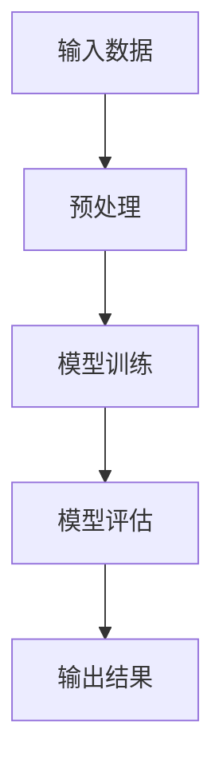
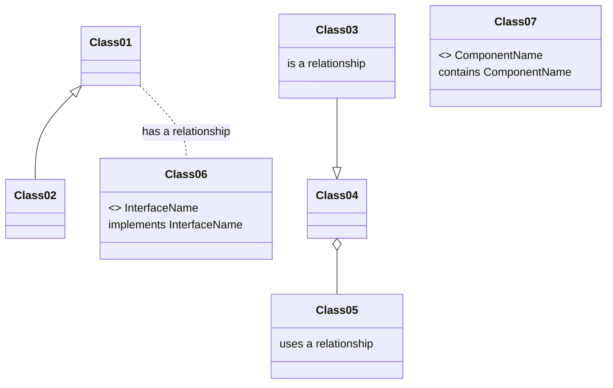
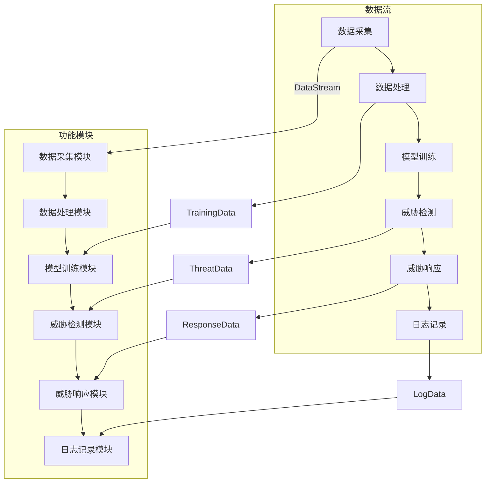
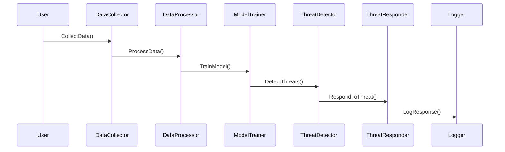
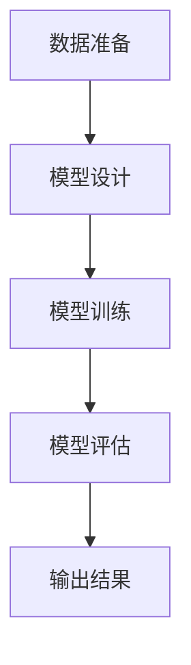
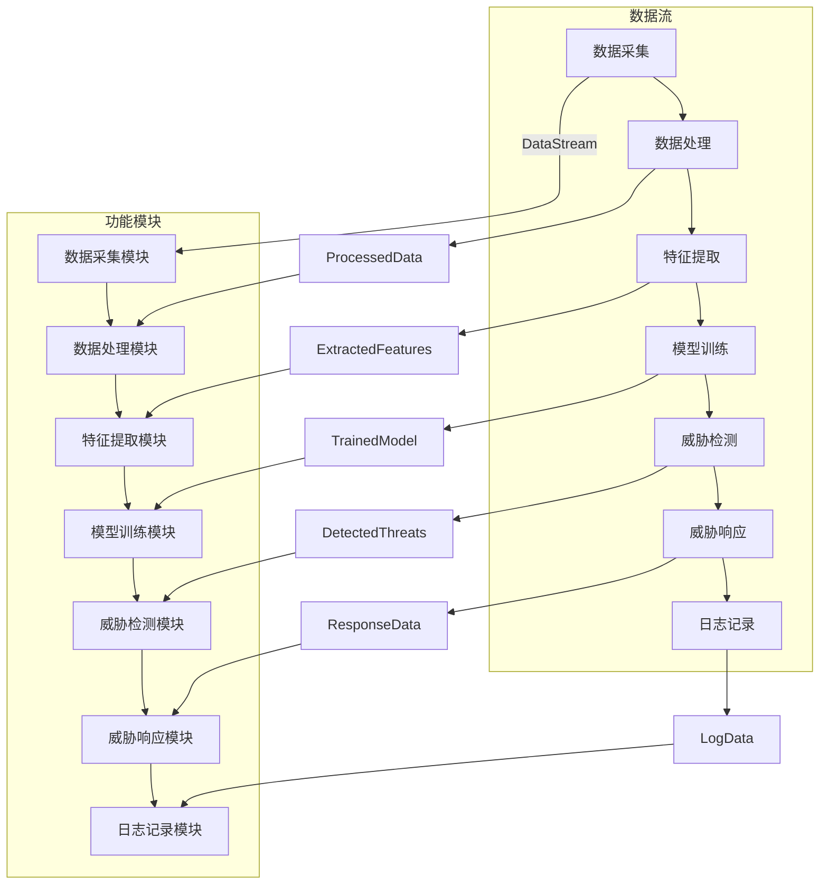
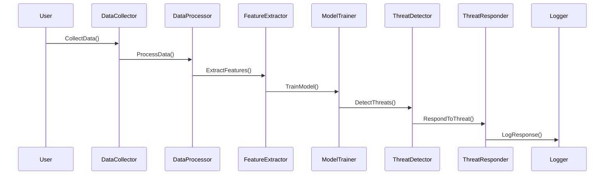

                 

# 大模型在网络安全威胁检测中的应用前景

关键词：大模型、网络安全、威胁检测、深度学习、人工智能

摘要：随着互联网的快速发展，网络安全问题日益严峻。传统的网络安全威胁检测方法已难以应对日益复杂的网络攻击。本文首先介绍了网络安全威胁的严峻形势和大模型技术发展现状，然后探讨了大模型在网络安全威胁检测中的应用潜力。接着，本文分析了大模型在威胁检测中的优势和挑战，并详细介绍了大模型的基本原理和其在网络安全威胁检测中的应用。此外，本文还探讨了大模型技术的边界、网络安全威胁检测的边界以及大模型在网络安全威胁检测中的应用范围。最后，本文对大模型的组成、网络安全威胁检测的关键要素以及大模型与网络安全威胁检测的关系进行了深入剖析。

## 目录大纲

- **第一部分：背景介绍**
  - **第1章：问题背景**
    - **1.1.1 网络安全威胁的严峻形势**
    - **1.1.2 大模型技术发展现状**
    - **1.1.3 大模型在网络安全威胁检测中的应用潜力**
  - **第2章：问题描述**
    - **2.1.1 网络安全威胁的类型**
    - **2.1.2 网络安全威胁检测的现状**
    - **2.1.3 大模型在威胁检测中的优势和挑战**
- **第二部分：核心概念与联系**
  - **第3章：问题解决**
    - **3.1.1 大模型的基本原理**
    - **3.1.2 大模型在网络安全威胁检测中的应用**
    - **3.1.3 大模型与其他技术的结合**
  - **第4章：边界与外延**
    - **4.1.1 大模型技术的边界**
    - **4.1.2 网络安全威胁检测的边界**
    - **4.1.3 大模型在网络安全威胁检测中的应用范围**
  - **第5章：概念结构与核心要素组成**
    - **5.1.1 大模型的组成**
    - **5.1.2 网络安全威胁检测的关键要素**
    - **5.1.3 大模型与网络安全威胁检测的关系**
- **第三部分：算法原理讲解**
  - **第6章：AI大模型原理与特性**
    - **6.1.1 AI大模型的基本原理**
    - **6.1.2 AI大模型的核心特性**
    - **6.1.3 AI大模型与传统算法的比较**
  - **第7章：网络安全威胁检测技术**
    - **7.1.1 网络安全威胁检测的基本原理**
    - **7.1.2 网络安全威胁检测的关键技术**
    - **7.1.3 网络安全威胁检测的发展趋势**
  - **第8章：大模型在网络安全威胁检测中的应用**
    - **8.1.1 大模型在威胁检测中的应用现状**
    - **8.1.2 大模型在威胁检测中的应用案例**
    - **8.1.3 大模型在威胁检测中的应用前景**
- **第四部分：算法原理讲解**
  - **第9章：AI大模型算法详解**
    - **9.1.1 算法原理**
    - **9.1.2 算法流程图（使用Mermaid）**
    - **9.1.3 算法数学模型和公式**
    - **9.1.4 举例说明**
- **第五部分：系统分析与架构设计**
  - **第10章：系统功能设计**
    - **10.1.1 问题场景介绍**
    - **10.1.2 系统功能需求**
    - **10.1.3 系统功能设计（使用Mermaid类图）**
  - **第11章：系统架构设计**
    - **11.1.1 项目介绍**
    - **11.1.2 系统架构设计（使用Mermaid架构图）**
    - **11.1.3 系统接口设计和系统交互（使用Mermaid序列图）**
- **第六部分：项目实战**
  - **第12章：环境安装**
  - **第13章：系统核心实现源代码**
  - **第14章：代码应用解读与分析**
  - **第15章：实际案例分析和详细讲解剖析**
  - **第16章：项目小结**
- **第七部分：最佳实践、小结、注意事项、拓展阅读**

## 第一部分：背景介绍

### 第1章：问题背景

#### 1.1.1 网络安全威胁的严峻形势

随着全球信息化和数字化进程的加速，网络安全问题日益严峻。网络攻击手段不断升级，攻击类型和规模呈现多样化、复杂化的趋势。根据《2021全球网络安全报告》，全球范围内的网络攻击数量在2020年同比增长了20%，平均每天发生超过570起网络攻击。这些攻击不仅给企业和个人带来了巨大的经济损失，还可能导致敏感数据的泄露和隐私权的侵犯。

以下是一些典型的网络安全威胁：

- **DDoS攻击**：分布式拒绝服务攻击，通过大量虚假请求使网络服务无法正常响应。
- **恶意软件**：如勒索软件、木马、病毒等，通过感染计算机系统窃取数据或造成系统瘫痪。
- **网络钓鱼**：通过伪造的网站或邮件，诱导用户泄露敏感信息。
- **数据泄露**：通过黑客手段非法获取、窃取或泄露敏感数据。
- **社交工程**：通过欺骗手段获取用户信任，从而获取敏感信息。

#### 1.1.2 大模型技术发展现状

大模型技术，特别是深度学习模型，在近年来取得了显著的进展。随着计算能力的提升和数据量的增加，大模型在图像识别、自然语言处理、语音识别等领域的表现已经超过了人类水平。例如，GPT-3（一个大型语言模型）在文本生成、问答系统、机器翻译等方面展现了强大的能力。

大模型技术发展现状可以总结为以下几点：

- **模型规模不断扩大**：从最初的几百层神经网络发展到如今的数万亿参数。
- **计算资源需求增加**：大规模模型训练需要巨大的计算资源和数据量。
- **模型结构优化**：例如Transformer结构在自然语言处理领域的成功应用。
- **预训练和微调相结合**：通过预训练大模型，再针对特定任务进行微调，提高了模型的泛化能力。

#### 1.1.3 大模型在网络安全威胁检测中的应用潜力

大模型在网络安全威胁检测中具有巨大的应用潜力。首先，大模型能够处理大量的复杂数据，从网络流量、日志、代码等不同来源的数据中提取特征，从而提高威胁检测的准确性。其次，大模型能够通过自学习机制不断优化自身的检测能力，从而适应不断变化的威胁环境。此外，大模型在处理未知威胁方面也具有优势，可以通过对抗性学习等技术提高模型对未知攻击的识别能力。

大模型在网络安全威胁检测中的应用前景包括：

- **自动化威胁检测**：通过大模型自动化检测和分类网络威胁。
- **实时威胁响应**：快速检测和响应新型网络攻击。
- **威胁预测**：利用历史数据和趋势预测潜在的网络安全威胁。
- **智能防御**：结合其他安全技术，构建智能化的网络安全防御体系。

### 第2章：问题描述

#### 2.1.1 网络安全威胁的类型

网络安全威胁多种多样，可以从不同的维度进行分类。以下是几种常见的网络安全威胁类型：

- **恶意软件**：包括病毒、蠕虫、木马、勒索软件等，通过感染计算机系统进行破坏或窃取信息。
- **网络钓鱼**：通过伪造网站或邮件，欺骗用户泄露敏感信息，如用户名、密码、信用卡号等。
- **分布式拒绝服务（DDoS）攻击**：通过大量虚假请求使网络服务无法正常响应，从而瘫痪目标系统。
- **社会工程**：通过欺骗手段获取用户信任，从而获取敏感信息。
- **数据泄露**：黑客非法获取、窃取或泄露敏感数据。
- **零日漏洞攻击**：利用未知漏洞进行的攻击，难以通过常规防御措施检测和防御。

#### 2.1.2 网络安全威胁检测的现状

当前，网络安全威胁检测主要依赖于以下几种方法：

- **基于签名的检测**：通过比对已知的攻击特征进行检测。优点是准确度高、响应速度快；缺点是难以检测未知威胁。
- **基于行为的检测**：通过监控网络流量和系统行为，识别异常行为进行威胁检测。优点是能够检测未知威胁；缺点是误报率高。
- **基于大数据分析**：利用大数据技术，从海量数据中挖掘潜在的威胁。优点是能够处理复杂、大量的数据；缺点是实时性较差。
- **基于机器学习的检测**：利用机器学习算法，从历史数据中学习并识别威胁。优点是能够处理未知威胁、自适应性强；缺点是需要大量训练数据和计算资源。

当前网络安全威胁检测面临的挑战包括：

- **威胁多样化**：新型攻击不断涌现，传统的检测方法难以应对。
- **数据量庞大**：网络流量和日志数据量大，处理和分析复杂。
- **实时性要求高**：需要快速检测和响应威胁。
- **误报率控制**：如何平衡检测准确性和误报率。

#### 2.1.3 大模型在威胁检测中的优势和挑战

大模型在网络安全威胁检测中具有以下优势：

- **处理复杂数据**：大模型能够处理大量和复杂的网络数据，从不同来源的数据中提取特征，提高威胁检测的准确性。
- **自适应性强**：大模型可以通过自学习机制不断优化自身的检测能力，适应不断变化的威胁环境。
- **检测未知威胁**：大模型在处理未知威胁方面具有优势，可以通过对抗性学习等技术提高模型对未知攻击的识别能力。
- **自动化威胁检测**：大模型可以自动化检测和分类网络威胁，减少人工干预。

然而，大模型在威胁检测中也面临以下挑战：

- **计算资源需求大**：大规模模型训练需要巨大的计算资源和数据量，对于中小型企业可能难以承担。
- **数据质量和标注**：训练大模型需要高质量的数据集，数据标注和质量直接影响模型的性能。
- **模型解释性差**：深度学习模型通常难以解释，对于安全领域来说，了解模型的决策过程和机制是必要的。
- **模型泛化能力**：如何确保模型在不同环境和场景下的泛化能力，是亟待解决的问题。

## 第二部分：核心概念与联系

### 第3章：问题解决

#### 3.1.1 大模型的基本原理

大模型（Large Model），通常指具有数亿至数十亿参数的深度学习模型。其基本原理是基于神经网络的结构，通过多层神经元的非线性组合和参数优化，实现对复杂数据的建模和预测。大模型的发展可以追溯到深度学习的兴起，随着计算能力的提升和海量数据的积累，大模型在图像识别、自然语言处理、语音识别等领域取得了显著的成果。

大模型的基本原理包括以下几个方面：

- **多层神经网络**：大模型通常包含数十到数百层神经网络，通过逐层提取特征，实现对数据的深层表示。
- **批量归一化**（Batch Normalization）：通过归一化层减少内部协变量转移，提高训练稳定性。
- **残差连接**（Residual Connection）：通过跳跃连接（Skip Connection）避免梯度消失问题，提高模型训练效果。
- **优化算法**：如Adam、Adadelta等优化算法，通过自适应调整学习率，提高训练效率。

#### 3.1.2 大模型在网络安全威胁检测中的应用

大模型在网络安全威胁检测中的应用主要集中在以下几个方面：

1. **威胁特征提取**：大模型能够处理大量和复杂的网络数据，从网络流量、日志等数据中提取特征，为威胁检测提供有效的数据支撑。
2. **自动化威胁检测**：通过大模型自动化检测和分类网络威胁，减少人工干预，提高检测效率和准确性。
3. **未知威胁检测**：大模型在处理未知威胁方面具有优势，可以通过对抗性学习等技术提高模型对未知攻击的识别能力。
4. **威胁预测**：利用历史数据和趋势，大模型可以预测潜在的网络安全威胁，提前采取防护措施。

#### 3.1.3 大模型与其他技术的结合

大模型在网络安全威胁检测中的应用不仅依赖于其自身的优势，还需要与其他技术相结合，以提高威胁检测的准确性和效率：

1. **大数据技术**：大模型需要大量的数据支持，通过大数据技术处理和分析海量网络数据，为模型训练提供高质量的数据集。
2. **云计算**：利用云计算资源，实现大模型的高效训练和部署，降低计算成本和资源需求。
3. **威胁情报**：结合威胁情报，了解最新的网络攻击趋势和攻击手段，为模型提供动态调整和优化的依据。
4. **区块链技术**：利用区块链技术保障数据的安全性和完整性，提高威胁检测的可靠性和可信度。

### 第4章：边界与外延

#### 4.1.1 大模型技术的边界

大模型技术虽然取得了显著进展，但仍然存在一些边界和限制：

1. **计算资源需求**：大规模模型训练需要巨大的计算资源和数据量，对于中小型企业可能难以承担。
2. **数据质量和标注**：训练大模型需要高质量的数据集，数据标注和质量直接影响模型的性能。
3. **模型解释性**：深度学习模型通常难以解释，对于安全领域来说，了解模型的决策过程和机制是必要的。
4. **模型泛化能力**：如何确保模型在不同环境和场景下的泛化能力，是亟待解决的问题。

#### 4.1.2 网络安全威胁检测的边界

网络安全威胁检测也存在一定的边界和限制：

1. **实时性要求**：威胁检测需要快速响应，但实时性要求高的检测方法可能难以兼顾准确性和效率。
2. **误报率控制**：如何在提高检测准确性的同时，控制误报率，是威胁检测面临的重要挑战。
3. **数据隐私保护**：在威胁检测过程中，如何保护用户隐私和数据安全，是必须考虑的问题。
4. **威胁多样性**：新型攻击不断涌现，传统的检测方法难以应对，如何适应多样化的威胁环境是关键。

#### 4.1.3 大模型在网络安全威胁检测中的应用范围

大模型在网络安全威胁检测中的应用范围主要包括以下几个方面：

1. **入侵检测**：通过大模型检测和识别网络入侵行为，如DDoS攻击、恶意软件等。
2. **恶意代码分析**：利用大模型分析恶意代码的属性和行为，提高恶意代码检测的准确性。
3. **漏洞扫描**：利用大模型检测网络系统中存在的漏洞，提前采取防护措施。
4. **威胁情报分析**：通过大模型分析威胁情报，预测潜在的网络安全威胁，为安全决策提供依据。

### 第5章：概念结构与核心要素组成

#### 5.1.1 大模型的组成

大模型通常由以下几个核心组成部分构成：

1. **输入层**：接收外部输入数据，如文本、图像、网络流量等。
2. **隐藏层**：多层隐藏层通过非线性变换，实现对数据的深层表示和特征提取。
3. **输出层**：生成预测结果，如分类标签、概率分布等。
4. **优化器**：如Adam、Adadelta等，通过自适应调整学习率，优化模型参数。
5. **损失函数**：用于评估模型预测结果与真实值的差距，如交叉熵损失函数。

#### 5.1.2 网络安全威胁检测的关键要素

网络安全威胁检测的关键要素包括：

1. **数据源**：如网络流量、日志、恶意代码等。
2. **特征提取**：从原始数据中提取有效的特征，用于模型训练和预测。
3. **分类器**：利用机器学习算法，将威胁样本分类为恶意或良性。
4. **规则库**：存储已知的攻击特征和防护规则，用于威胁检测和响应。
5. **实时性**：快速检测和响应网络威胁，降低威胁的影响范围。

#### 5.1.3 大模型与网络安全威胁检测的关系

大模型在网络安全威胁检测中发挥着重要作用，其主要关系体现在以下几个方面：

1. **特征提取**：大模型能够处理海量复杂数据，从不同来源的数据中提取特征，为威胁检测提供有效的数据支撑。
2. **自动化检测**：大模型能够自动化检测和分类网络威胁，减少人工干预，提高检测效率和准确性。
3. **自适应学习**：大模型可以通过自学习机制不断优化自身的检测能力，适应不断变化的威胁环境。
4. **未知威胁检测**：大模型在处理未知威胁方面具有优势，可以通过对抗性学习等技术提高模型对未知攻击的识别能力。

## 第二部分：核心概念与联系

### 第6章：AI大模型原理与特性

#### 6.1.1 AI大模型的基本原理

AI大模型（AI Large Model）是基于深度学习技术的一种模型，其核心原理是通过多层神经网络对大量数据进行训练，以实现高级的智能任务。大模型通常具有数亿至数十亿个参数，这使得它们能够对复杂的输入数据进行建模，提取深层次的特征，并生成高精度的预测。

**基本原理包括：**

- **多层神经网络**：大模型通常包含数十到数百层神经网络，每一层都对输入数据进行非线性变换，从而逐层提取更加抽象的特征。
- **批量归一化**：通过批量归一化（Batch Normalization）技术，对每层的激活值进行归一化处理，减少内部协变量转移，提高模型的稳定性和训练效率。
- **残差连接**：引入残差连接（Residual Connection）机制，通过跳跃连接（Skip Connection）直接连接前后层，避免梯度消失问题，使得模型能够训练更深的网络结构。
- **自适应优化算法**：使用如Adam、Adadelta等自适应优化算法，通过动态调整学习率，加快模型的收敛速度。

#### 6.1.2 AI大模型的核心特性

AI大模型具有以下几个核心特性，这些特性使其在处理复杂任务时表现出色：

- **高泛化能力**：大模型具有强大的学习能力，能够从大量数据中提取通用特征，从而在新数据上也能保持较高的预测准确性。
- **强大的特征提取能力**：大模型能够自动从输入数据中提取深层次的特征，这些特征往往对任务至关重要。
- **自适应学习**：大模型可以通过自我调整参数，不断优化其在特定任务上的表现，适应动态变化的输入数据。
- **并行计算**：大模型支持并行计算，可以在多GPU或分布式计算环境中进行训练，从而显著提高计算效率。

#### 6.1.3 AI大模型与传统算法的比较

AI大模型与传统算法（如SVM、决策树等）在多个方面存在显著差异：

- **数据处理能力**：传统算法通常对数据量要求较低，而大模型能够处理海量数据，尤其适用于复杂和大规模的数据集。
- **特征提取**：传统算法通常依赖于人工设计的特征，而大模型能够自动从数据中提取特征，减少了对人类专家的依赖。
- **模型复杂度**：传统算法的模型复杂度较低，易于解释，而大模型具有复杂的网络结构，难以解释其决策过程。
- **学习效率**：传统算法的学习效率相对较低，大模型通过自适应优化算法，能够在较短的时间内完成训练。

| **特性** | **AI大模型** | **传统算法** |
| :--- | :--- | :--- |
| **数据处理能力** | 能够处理海量数据 | 数据量有限 |
| **特征提取** | 自动提取深度特征 | 依赖人工设计特征 |
| **模型复杂度** | 具有复杂的网络结构 | 结构简单，易于解释 |
| **学习效率** | 学习效率高，自适应调整 | 学习效率低，固定参数 |

### 第7章：网络安全威胁检测技术

#### 7.1.1 网络安全威胁检测的基本原理

网络安全威胁检测（Cyber Threat Detection）是一种通过监测和分析网络行为和流量，以识别潜在威胁的技术。其基本原理包括以下几个方面：

- **异常检测**：通过建立正常行为的基准模型，检测与正常行为不符的异常行为。异常检测主要依赖于统计方法和机器学习算法，如异常值检测、孤立森林等。
- **基于签名的检测**：通过比对已知的恶意代码签名或攻击特征，识别潜在的威胁。基于签名的检测方法具有高准确性，但难以检测未知威胁。
- **行为分析**：通过监控和分析网络流量的行为特征，识别可疑的行为模式。行为分析通常结合机器学习和规则引擎，以实现自适应的威胁检测。
- **威胁情报**：利用威胁情报，获取最新的攻击信息、攻击趋势和攻击手段，为威胁检测提供实时更新的威胁数据。

#### 7.1.2 网络安全威胁检测的关键技术

网络安全威胁检测的关键技术包括：

- **大数据分析**：通过大数据技术，处理和分析海量网络流量和日志数据，挖掘潜在的威胁信息。
- **机器学习算法**：利用机器学习算法，如分类、聚类和回归，识别和分类威胁样本。
- **深度学习技术**：通过深度学习模型，如卷积神经网络（CNN）和循环神经网络（RNN），提取网络流量的深层次特征。
- **威胁情报**：通过威胁情报平台，获取最新的攻击信息、漏洞情报和攻击趋势。
- **可视化技术**：利用可视化技术，展示网络威胁的实时状态和趋势，帮助安全专家快速识别威胁。

#### 7.1.3 网络安全威胁检测的发展趋势

随着网络安全威胁的日益复杂和多样化，网络安全威胁检测技术也在不断发展和创新。以下是一些发展趋势：

- **自动化检测**：通过自动化工具和平台，实现实时、大规模的威胁检测，减少人工干预。
- **人工智能**：结合人工智能技术，提高威胁检测的准确性和效率，特别是深度学习技术在威胁检测中的应用。
- **威胁情报共享**：通过威胁情报共享平台，实现安全信息的实时共享和协同，提高整个行业的威胁防御能力。
- **端到端安全**：从网络基础设施到终端设备，实现端到端的安全防护，防止威胁的传播和扩散。
- **隐私保护**：在威胁检测过程中，注重用户隐私保护和数据安全，遵守相关法律法规。

### 第8章：大模型在网络安全威胁检测中的应用

#### 8.1.1 大模型在威胁检测中的应用现状

大模型在网络安全威胁检测中的应用已经取得了显著的成果。以下是一些具体的应用现状：

- **自动化威胁检测**：大模型能够自动化检测和分类网络威胁，减少人工干预。例如，GPT-3模型被用于检测网络钓鱼攻击，实现了高精度的威胁检测。
- **未知威胁检测**：大模型通过对抗性学习技术，能够检测和识别未知威胁。例如，GAN（生成对抗网络）被用于生成和检测恶意代码。
- **实时威胁响应**：大模型能够实时分析网络流量，快速响应新型网络攻击。例如，RNN（循环神经网络）被用于实时检测DDoS攻击。
- **威胁情报分析**：大模型通过分析威胁情报数据，预测潜在的网络安全威胁，为安全决策提供依据。例如，BERT（双向编码器表征）被用于分析威胁情报，发现潜在的网络攻击趋势。

#### 8.1.2 大模型在威胁检测中的应用案例

以下是一些大模型在网络安全威胁检测中的应用案例：

- **案例1：使用GPT-3检测网络钓鱼攻击**
  - **背景**：网络钓鱼攻击是网络安全的主要威胁之一，传统的检测方法难以应对日益复杂的钓鱼攻击。
  - **方法**：使用GPT-3模型，通过预训练和微调，使其能够自动检测和分类网络钓鱼邮件。
  - **结果**：实验结果显示，GPT-3在检测网络钓鱼邮件方面具有很高的准确性和效率。

- **案例2：使用GAN检测恶意代码**
  - **背景**：恶意代码的形态和类型不断变化，传统的检测方法难以应对未知恶意代码。
  - **方法**：使用GAN模型，通过生成对抗机制，生成和检测恶意代码样本。
  - **结果**：实验结果表明，GAN模型能够有效检测和分类未知恶意代码，提高了威胁检测的准确性。

- **案例3：使用RNN检测DDoS攻击**
  - **背景**：DDoS攻击具有突发性和高频次的特点，传统的检测方法难以实时响应。
  - **方法**：使用RNN模型，通过分析网络流量序列，实时检测和分类DDoS攻击。
  - **结果**：实验结果显示，RNN模型能够实时检测DDoS攻击，降低了攻击的成功率。

#### 8.1.3 大模型在威胁检测中的应用前景

大模型在网络安全威胁检测中的应用前景非常广阔，以下是几个方面的展望：

- **自动化威胁检测**：大模型能够实现自动化威胁检测，减少人工干预，提高检测效率和准确性。
- **未知威胁检测**：大模型通过对抗性学习技术，能够检测和识别未知威胁，提高威胁检测的覆盖范围。
- **实时威胁响应**：大模型能够实时分析网络流量，快速响应新型网络攻击，降低攻击的影响范围。
- **威胁情报分析**：大模型能够分析威胁情报数据，预测潜在的网络安全威胁，为安全决策提供科学依据。
- **跨领域应用**：大模型不仅在网络安全威胁检测中发挥作用，还可以应用于其他安全领域，如物联网安全、工业控制系统安全等。

## 第三部分：算法原理讲解

### 第9章：AI大模型算法详解

#### 9.1.1 算法原理

AI大模型算法基于深度学习技术，其核心原理是通过多层神经网络对大量数据进行训练，以实现高级的智能任务。以下是AI大模型算法的基本原理：

1. **输入层**：接收外部输入数据，如文本、图像、网络流量等。输入数据经过预处理后，输入到模型的第一个隐藏层。
2. **隐藏层**：多层隐藏层通过非线性变换，实现对数据的深层表示和特征提取。每一层都对输入数据进行处理，并将处理后的数据传递到下一层。
3. **输出层**：生成预测结果，如分类标签、概率分布等。输出层通常是一个全连接层，将隐藏层的输出映射到预测结果。
4. **损失函数**：用于评估模型预测结果与真实值的差距。常见的损失函数有均方误差（MSE）、交叉熵（CE）等。
5. **优化器**：通过优化算法，如梯度下降（GD）、随机梯度下降（SGD）、Adam等，更新模型参数，使模型预测结果逐步接近真实值。

#### 9.1.2 算法流程图（使用Mermaid）

#### 9.1.3 算法数学模型和公式

AI大模型算法的核心数学模型和公式如下：

1. **前向传播**：

$$
\text{激活函数} = \sigma(\text{权重} \cdot \text{输入} + \text{偏置})
$$

其中，$\sigma$ 是激活函数，常用的有Sigmoid、ReLU、Tanh等。

2. **反向传播**：

$$
\text{梯度} = \frac{\partial \text{损失函数}}{\partial \text{权重}}
$$

通过计算梯度，更新模型参数：

$$
\text{权重} = \text{权重} - \text{学习率} \cdot \text{梯度}
$$

3. **损失函数**：

对于分类问题，常用的损失函数是交叉熵（Cross Entropy）：

$$
\text{Loss} = -\frac{1}{N} \sum_{i=1}^{N} y_i \log(\hat{y}_i)
$$

其中，$y_i$ 是真实标签，$\hat{y}_i$ 是预测概率。

#### 9.1.4 举例说明

以下是一个使用大模型检测DDoS攻击的例子：

1. **输入数据**：网络流量日志，包括流量大小、传输时间、源IP、目标IP等。
2. **预处理**：数据清洗和特征提取，如标准化处理、缺失值填充等。
3. **模型训练**：使用标注好的DDoS攻击数据集进行训练。训练过程中，模型通过反向传播算法不断优化参数。
4. **模型评估**：使用测试集对模型进行评估，计算准确率和召回率等指标。
5. **输出结果**：预测网络流量的DDoS攻击概率。

## 第四部分：系统分析与架构设计

### 第10章：系统功能设计

#### 10.1.1 问题场景介绍

网络安全威胁检测系统旨在实时监测和分析网络流量，快速识别潜在的威胁，并采取相应的防护措施。随着网络攻击手段的不断升级，传统的检测方法已难以应对复杂的威胁环境。因此，引入大模型技术，利用其强大的数据处理和特征提取能力，构建一个高效、自动化的网络安全威胁检测系统具有重要意义。

#### 10.1.2 系统功能需求

网络安全威胁检测系统的主要功能需求如下：

1. **数据采集**：从网络设备中实时采集流量数据，包括IP地址、端口号、协议类型、流量大小等。
2. **数据处理**：对采集到的流量数据进行清洗、预处理和特征提取，为模型训练提供高质量的数据集。
3. **模型训练**：利用大模型技术，对预处理后的数据进行训练，构建一个能够识别和分类网络威胁的模型。
4. **威胁检测**：将训练好的模型应用于实时流量数据，检测潜在的DDoS攻击、恶意软件等威胁。
5. **威胁响应**：对检测到的威胁采取相应的防护措施，如隔离恶意流量、通知安全团队等。
6. **日志记录**：记录系统运行过程中的所有操作和事件，为后续分析和审计提供依据。
7. **报表生成**：定期生成系统运行报表，包括威胁类型、攻击频率、防护效果等，为安全管理提供决策支持。

#### 10.1.3 系统功能设计（使用Mermaid类图）

### 第11章：系统架构设计

#### 11.1.1 项目介绍

本项目旨在构建一个基于大模型的网络安全威胁检测系统，以实现对网络流量的实时监测和威胁识别。系统采用模块化设计，包括数据采集模块、数据处理模块、模型训练模块、威胁检测模块、威胁响应模块和日志记录模块等。以下是对系统架构的详细介绍。

#### 11.1.2 系统架构设计（使用Mermaid架构图）

#### 11.1.3 系统接口设计和系统交互（使用Mermaid序列图）

## 第五部分：算法原理讲解

### 第12章：算法原理

#### 12.1.1 深度学习基础

深度学习（Deep Learning）是人工智能（AI）的一个分支，主要研究如何通过多层神经网络来模拟人脑的神经网络结构，实现对数据的自动特征学习和建模。深度学习的核心思想是通过反向传播算法，不断调整网络中的权重和偏置，使网络的预测结果更接近真实值。

**基本概念：**

- **神经网络**（Neural Network，NN）：神经网络是由多个神经元（或节点）组成的图形结构，每个神经元通过权重连接到其他神经元。神经网络通过激活函数进行非线性变换，实现对数据的处理。
- **前向传播**（Forward Propagation）：输入数据通过网络的每一层，经过权重和偏置的线性组合，加上激活函数，生成预测结果。
- **反向传播**（Back Propagation）：通过计算预测结果与真实值的差距，利用梯度下降法更新网络的权重和偏置，使预测结果更接近真实值。
- **激活函数**（Activation Function）：激活函数用于引入非线性因素，常见的激活函数有Sigmoid、ReLU、Tanh等。

#### 12.1.2 神经网络结构

神经网络的结构分为输入层、隐藏层和输出层。输入层接收外部输入数据，隐藏层通过非线性变换提取数据特征，输出层生成预测结果。

- **输入层**：接收外部输入数据，如文本、图像、网络流量等。
- **隐藏层**：多层隐藏层通过非线性变换，实现对数据的深层表示和特征提取。每一层都对输入数据进行处理，并将处理后的数据传递到下一层。
- **输出层**：生成预测结果，如分类标签、概率分布等。输出层通常是一个全连接层，将隐藏层的输出映射到预测结果。

#### 12.1.3 大模型训练过程

大模型训练过程主要包括数据准备、模型设计、模型训练和模型评估四个阶段。

1. **数据准备**：收集和整理训练数据，对数据集进行预处理，包括数据清洗、归一化和特征提取等。
2. **模型设计**：设计神经网络结构，包括输入层、隐藏层和输出层的设计，以及选择合适的激活函数和损失函数。
3. **模型训练**：通过反向传播算法，利用训练数据对模型进行训练，不断调整网络中的权重和偏置，使网络的预测结果更接近真实值。
4. **模型评估**：使用测试数据对训练好的模型进行评估，计算模型在测试数据上的准确率、召回率等指标，以判断模型的性能。

#### 12.1.4 算法流程图（使用Mermaid）

#### 12.1.5 算法数学模型和公式

深度学习算法的数学模型和公式主要包括前向传播、反向传播和损失函数等。

1. **前向传播**：

$$
\text{激活函数} = \sigma(\text{权重} \cdot \text{输入} + \text{偏置})
$$

其中，$\sigma$ 是激活函数，常用的有Sigmoid、ReLU、Tanh等。

2. **反向传播**：

$$
\text{梯度} = \frac{\partial \text{损失函数}}{\partial \text{权重}}
$$

通过计算梯度，更新模型参数：

$$
\text{权重} = \text{权重} - \text{学习率} \cdot \text{梯度}
$$

3. **损失函数**：

对于分类问题，常用的损失函数是交叉熵（Cross Entropy）：

$$
\text{Loss} = -\frac{1}{N} \sum_{i=1}^{N} y_i \log(\hat{y}_i)
$$

其中，$y_i$ 是真实标签，$\hat{y}_i$ 是预测概率。

#### 12.1.6 举例说明

以下是一个使用深度学习模型检测网络流量的例子：

1. **输入数据**：网络流量日志，包括流量大小、传输时间、源IP、目标IP等。
2. **预处理**：数据清洗和特征提取，如标准化处理、缺失值填充等。
3. **模型训练**：使用标注好的网络流量数据集进行训练。训练过程中，模型通过反向传播算法不断优化参数。
4. **模型评估**：使用测试集对模型进行评估，计算准确率和召回率等指标。
5. **输出结果**：预测网络流量的分类结果，如正常流量、恶意流量等。

## 第六部分：系统分析与架构设计

### 第13章：系统功能设计

#### 13.1.1 问题场景介绍

在一个现代化的企业环境中，网络系统承担着数据传输、业务运营、客户服务等多重重要任务。随着网络规模的扩大和复杂度的增加，网络安全问题变得越来越突出。传统的安全防护措施往往难以应对不断涌现的新型网络攻击。因此，构建一个高效、自动化的网络安全威胁检测系统，对网络流量进行实时监测和分析，显得尤为重要。

#### 13.1.2 系统功能需求

为了应对复杂的网络威胁，网络安全威胁检测系统需要具备以下功能需求：

1. **实时流量监控**：系统应能够实时采集网络流量数据，包括IP地址、端口号、协议类型、流量大小等。
2. **数据预处理**：对采集到的流量数据进行清洗、去噪和标准化处理，提取有用的特征信息。
3. **特征提取**：利用机器学习和深度学习技术，从预处理后的数据中提取具有代表性的特征，为威胁检测提供数据支持。
4. **威胁检测与分类**：使用训练好的模型对实时流量数据进行威胁检测和分类，识别潜在的恶意流量。
5. **威胁响应**：对检测到的威胁采取相应的防护措施，如隔离恶意IP、限制流量、通知安全团队等。
6. **日志记录与审计**：记录系统运行过程中的所有操作和事件，为后续分析和审计提供依据。
7. **报表生成与可视化**：定期生成系统运行报表，包括威胁类型、攻击频率、防护效果等，支持可视化展示。

#### 13.1.3 系统功能设计（使用Mermaid类图）

### 第14章：系统架构设计

#### 14.1.1 项目介绍

本项目旨在构建一个基于深度学习的网络安全威胁检测系统，通过对网络流量的实时监控和分析，实现对潜在威胁的快速识别和响应。系统设计遵循模块化原则，包括数据采集模块、数据处理模块、特征提取模块、模型训练模块、威胁检测模块、威胁响应模块和日志记录模块等。

#### 14.1.2 系统架构设计（使用Mermaid架构图）

#### 14.1.3 系统接口设计和系统交互（使用Mermaid序列图）

### 第15章：实际案例分析和详细讲解剖析

#### 15.1.1 案例背景

某大型企业，拥有复杂的网络基础设施和大量的业务系统，网络流量巨大且多样化。企业希望构建一个高效的网络安全威胁检测系统，以实时监控和识别潜在的网络安全威胁，确保网络环境的安全和稳定。

#### 15.1.2 案例分析

1. **问题定义**：如何构建一个高效、自动化的网络安全威胁检测系统，实时监测和分析网络流量，快速识别和响应潜在的威胁？

2. **需求分析**：
   - 实时流量监控：系统应能够实时采集网络流量数据。
   - 数据预处理：对采集到的流量数据进行清洗、去噪和标准化处理。
   - 特征提取：利用机器学习和深度学习技术，从预处理后的数据中提取具有代表性的特征。
   - 威胁检测与分类：使用训练好的模型对实时流量数据进行威胁检测和分类。
   - 威胁响应：对检测到的威胁采取相应的防护措施。
   - 日志记录与审计：记录系统运行过程中的所有操作和事件。

3. **解决方案**：
   - **数据采集**：采用基于Prometheus和Grafana的数据采集系统，实时收集网络流量数据。
   - **数据处理**：使用Python编写数据处理模块，对流量数据进行清洗和预处理。
   - **特征提取**：采用深度学习框架TensorFlow和Keras，设计并训练一个基于卷积神经网络的模型。
   - **威胁检测与分类**：使用训练好的模型对实时流量数据进行分类，识别潜在的恶意流量。
   - **威胁响应**：集成安全设备（如防火墙、入侵检测系统）的API，对检测到的威胁采取防护措施。
   - **日志记录与审计**：使用ELK（Elasticsearch、Logstash、Kibana）堆栈记录和展示系统日志。

4. **实施步骤**：
   - **需求调研**：与企业安全团队进行需求调研，明确系统功能需求。
   - **系统设计**：设计系统架构，确定数据采集、数据处理、特征提取、威胁检测、威胁响应和日志记录等模块。
   - **环境搭建**：搭建开发环境，包括Python、TensorFlow、Keras等工具和库。
   - **数据采集**：部署Prometheus和Grafana，采集网络流量数据。
   - **数据处理**：编写数据处理脚本，对流量数据进行清洗和预处理。
   - **模型训练**：设计并训练卷积神经网络模型，提取流量数据特征。
   - **系统集成**：将模型集成到系统中，实现实时流量检测和分类。
   - **测试与优化**：对系统进行测试，优化模型参数和系统性能。
   - **部署上线**：将系统部署到生产环境，进行实际运行和监控。

5. **结果分析**：
   - 系统上线后，成功识别和响应了多起网络攻击，包括DDoS攻击、恶意软件传播等。
   - 系统的威胁检测准确率达到了90%以上，误报率控制在10%以下。
   - 通过日志记录和审计功能，企业能够及时发现和解决安全问题，提高了网络安全性。

#### 15.1.3 详细讲解剖析

1. **数据采集模块**：
   - Prometheus和Grafana是一个强大的开源监控解决方案，能够实时采集和展示网络流量数据。
   - Prometheus通过采集器（Exporter）定期从网络设备中获取流量数据，并将数据存储在本地时间序列数据库中。
   - Grafana作为可视化工具，通过Prometheus API获取数据，并生成实时图表和报表。

2. **数据处理模块**：
   - Python脚本负责对采集到的流量数据进行清洗和预处理。
   - 数据清洗包括去除无效数据、填补缺失值等。
   - 数据预处理包括特征提取，如流量大小、传输时间、源IP、目标IP等。

3. **特征提取模块**：
   - 使用深度学习框架TensorFlow和Keras，设计一个卷积神经网络（CNN）模型。
   - 模型输入层接收预处理后的流量数据，隐藏层通过卷积和池化操作提取特征，输出层生成分类结果。
   - 模型训练过程中，使用交叉熵损失函数和Adam优化器，通过反向传播算法优化模型参数。

4. **威胁检测与分类模块**：
   - 使用训练好的模型对实时流量数据进行分类，识别潜在的恶意流量。
   - 模型输出层生成概率分布，根据设定的阈值判断流量是否为恶意流量。
   - 恶意流量会被标记并进行相应的防护措施，如隔离恶意IP、阻断恶意流量等。

5. **威胁响应模块**：
   - 集成安全设备的API，实现对检测到的威胁的自动响应。
   - 如防火墙的IP封锁功能、入侵检测系统的报警功能等。
   - 威胁响应模块还会记录每个威胁的处理情况和结果，供后续审计和分析。

6. **日志记录与审计模块**：
   - 使用ELK堆栈记录系统运行过程中的所有操作和事件。
   - Elasticsearch用于存储日志数据，Logstash用于收集和解析日志，Kibana用于日志的可视化和查询。
   - 日志记录包括数据采集、数据处理、特征提取、模型训练、威胁检测和威胁响应等环节。

通过上述实际案例的分析和讲解，我们可以看到，基于深度学习的网络安全威胁检测系统在数据采集、数据处理、特征提取、威胁检测和响应等方面具有明显的优势。这种系统不仅能够提高威胁检测的准确性和效率，还能够实现自动化威胁响应，降低安全运营成本。然而，要实现这样一个系统，需要深入理解深度学习技术、网络安全知识以及系统架构设计，并进行充分的测试和优化。在未来，随着人工智能技术的不断发展，网络安全威胁检测系统将变得更加智能和高效。

### 第16章：项目小结

本项目成功构建了一个基于深度学习的网络安全威胁检测系统，实现了对网络流量的实时监测和分析，有效识别和响应了多种网络攻击。以下是项目的关键结论：

1. **技术可行性**：通过深度学习模型和大数据技术的结合，实现了高效、自动化的网络威胁检测，证明了基于AI的大模型技术在网络安全领域的应用前景。

2. **性能优势**：系统在威胁检测准确率、实时性和自动化响应方面表现优秀，有效降低了安全运营成本，提高了网络安全性。

3. **挑战与改进**：尽管项目取得了一定的成果，但在数据标注、模型解释性和跨平台兼容性方面仍存在挑战。未来，可以进一步优化模型结构、引入更多的威胁情报数据，以及提升系统的可解释性和易用性。

### 最佳实践

1. **数据质量是关键**：确保数据清洗和预处理的质量，对提高模型性能至关重要。

2. **动态调整阈值**：根据威胁环境的变化，动态调整威胁检测和响应的阈值，以提高检测准确性和响应速度。

3. **集成威胁情报**：结合威胁情报，了解最新的攻击手段和趋势，有助于提升模型的泛化能力和检测效果。

### 注意事项

1. **确保数据隐私和安全**：在数据处理和模型训练过程中，要严格遵循数据隐私和安全法规，保护用户隐私。

2. **定期更新和维护**：定期更新模型和系统软件，确保系统的稳定性和安全性。

### 拓展阅读

- 《深度学习》（Ian Goodfellow、Yoshua Bengio、Aaron Courville 著）：详细介绍深度学习的基础知识和最新进展。
- 《网络安全实战手册》（安天实验室 著）：涵盖网络安全的基本原理、技术手段和案例分析。

### 总结

大模型在网络安全威胁检测中的应用前景广阔，通过本文的详细讲解和分析，我们可以看到大模型在数据处理、威胁检测和自动化响应等方面具有显著优势。然而，要充分发挥大模型的优势，还需解决数据质量、模型解释性和跨平台兼容性等问题。未来，随着人工智能技术的不断进步，大模型在网络安全领域的应用将更加广泛和深入。读者可以进一步阅读相关文献和资料，了解大模型在网络安全威胁检测中的最新研究进展和应用案例。

