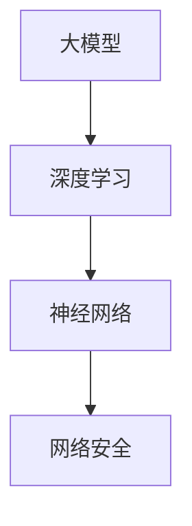
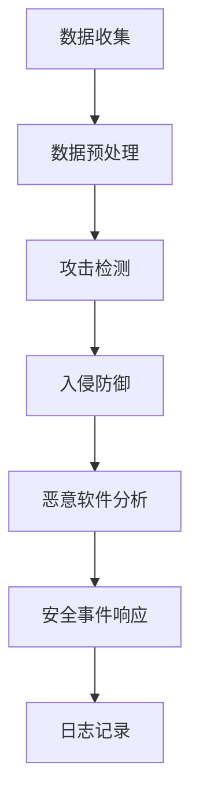
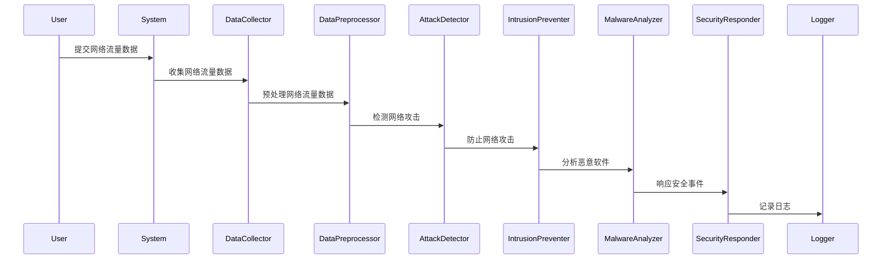

                 


# 大模型在网络安全智能防御中的应用前景

关键词：大模型、网络安全、智能防御、深度学习、神经网络

摘要：随着网络安全威胁的日益复杂，传统的防御手段已无法满足需求。本文将探讨大模型在网络安全智能防御中的应用前景，通过核心概念解析、算法原理讲解、系统分析与架构设计方案等多个方面，深入分析大模型如何提升网络安全防御能力，为网络安全领域的研究者和从业人员提供有价值的参考。

## 背景介绍

### 问题背景

在互联网时代，网络安全威胁层出不穷，网络攻击手段日益复杂，传统的安全防御手段如防火墙、入侵检测系统（IDS）等已经显得力不从心。网络攻击者不断利用新的漏洞、技术进行攻击，导致企业、政府和个人信息面临巨大风险。据统计，全球每年因网络安全事件造成的经济损失高达数千亿美元。因此，如何利用先进的科技手段提升网络安全防御能力，已成为一个亟待解决的问题。

### 问题描述

网络安全智能防御的核心问题在于如何有效地检测、防御和响应网络攻击。传统的安全防御手段往往依赖于静态规则和特征匹配，难以应对复杂多变的网络攻击。而大模型，特别是基于深度学习的模型，具有强大的数据处理和模式识别能力，能够在动态环境下实时检测和防御网络攻击。

### 问题解决

大模型在网络安全防御中的应用主要包括以下几个方面：

1. **网络攻击检测**：利用大模型对网络流量进行实时分析，识别潜在的网络攻击行为。
2. **入侵防御**：通过大模型预测网络攻击的可能性，提前采取防御措施。
3. **恶意软件分析**：利用大模型对恶意软件进行分析，识别其行为特征，进而防御。
4. **安全事件响应**：大模型可以协助安全专家快速分析安全事件，提供有效的响应策略。

### 边界与外延

本文主要关注大模型在网络安全防御中的应用，涉及网络攻击检测、入侵防御、恶意软件分析和安全事件响应等领域。同时，本文将探讨大模型的技术原理、实现方法和实际应用案例，为网络安全领域的研究者和从业人员提供有价值的参考。

## 核心概念与联系

### 核心概念

**大模型**：指具有海量参数的深度学习模型，能够处理大规模复杂数据。大模型通常具有强大的数据处理和模式识别能力，能够在各类任务中取得优异的性能。

**深度学习**：一种基于神经网络的机器学习方法，通过多层次的神经网络结构，自动提取数据中的特征，实现复杂的预测和分类任务。

**神经网络**：一种模拟生物神经系统的计算网络，通过神经元的连接和激活函数，对输入数据进行处理和输出。神经网络具有强大的表达能力和学习能力。

**网络安全**：保护网络系统免受各种威胁和攻击，包括入侵检测、入侵防御、恶意软件分析等。网络安全的目标是确保网络系统的可用性、完整性和保密性。

### 概念属性特征对比表格

| 概念         | 定义                                                         | 特点                                               |
| ------------ | ------------------------------------------------------------ | -------------------------------------------------- |
| 大模型       | 具有海量参数的深度学习模型                                   | 参数量巨大，计算复杂，可处理复杂数据分析           |
| 深度学习     | 基于神经网络的机器学习方法                                   | 自动从数据中学习特征，具有很好的泛化能力           |
| 神经网络     | 模仿生物神经系统的计算网络                                  | 通过层次结构自动提取特征，具有强大的表达能力       |
| 网络安全     | 保护网络免受攻击、威胁和未经授权的访问                         | 包括入侵检测、入侵防御、恶意软件分析等             |

### ER实体关系图架构的 Mermaid 流程图



## 算法原理讲解

### 算法 Mermaid 流程图


### Python 源代码

```python
import tensorflow as tf

# 数据预处理
X_train, y_train = ... # 加载训练数据
X_test, y_test = ... # 加载测试数据

# 建立神经网络模型
model = tf.keras.Sequential([
    tf.keras.layers.Dense(128, activation='relu', input_shape=(X_train.shape[1],)),
    tf.keras.layers.Dense(10, activation='softmax')
])

# 编译模型
model.compile(optimizer='adam',
              loss='sparse_categorical_crossentropy',
              metrics=['accuracy'])

# 训练模型
model.fit(X_train, y_train, epochs=10)

# 预测
predictions = model.predict(X_test)

# 输出结果
print(predictions)
```

### 算法原理的数学模型和公式

$$
y = \hat{y} = f(W \cdot x + b)
$$

其中，$x$ 表示输入特征，$W$ 表示权重，$b$ 表示偏置，$f$ 表示激活函数。神经网络通过多层感知器（MLP）结构，对输入特征进行加权求和，并通过激活函数进行非线性变换，从而实现复杂数据的预测和分类。

### 例子说明

假设我们有一个包含1000个参数的神经网络模型，输入特征为100维。首先，我们将100维的输入特征通过第一层的128个神经元进行加权求和，并通过ReLU激活函数进行非线性变换。然后，我们将第一层的输出作为第二层的输入，通过10个神经元进行加权求和，并通过softmax激活函数输出概率分布。最终，模型的输出结果为一个10维的概率分布，表示输入特征的分类结果。

## 系统分析与架构设计方案

### 问题场景介绍

网络安全智能防御系统是一个复杂的系统，它需要能够实时监测网络流量，识别潜在的攻击行为，并采取相应的防御措施。系统的主要功能包括网络攻击检测、入侵防御、恶意软件分析和安全事件响应等。

### 系统功能设计（领域模型 Mermaid 类图）

```mermaid
classDiagram
ClassDef NetworkAttack
	+id: int
	+type: string
	+source_ip: string
	+destination_ip: string
	+timestamp: datetime
	+isMALICIOUS: bool

ClassDef IntrusionPrevention
	+id: int
	+type: string
	+status: string
	+start_time: datetime
	+end_time: datetime

ClassDef MalwareAnalysis
	+id: int
	+name: string
	+file_path: string
	+malicious_score: float

ClassDef SecurityEvent
	+id: int
	+type: string
	+description: string
	+start_time: datetime
	+end_time: datetime
	+status: string

NetworkAttack --> IntrusionPrevention
NetworkAttack --> MalwareAnalysis
NetworkAttack --> SecurityEvent
```

### 系统架构设计（Mermaid 架构图）



### 系统接口设计

1. **数据收集接口**：用于实时收集网络流量数据。
2. **攻击检测接口**：用于检测网络攻击行为。
3. **入侵防御接口**：用于阻止网络攻击。
4. **恶意软件分析接口**：用于分析恶意软件。
5. **安全事件响应接口**：用于响应安全事件。
6. **日志记录接口**：用于记录系统运行日志。

### 系统交互（Mermaid 序列图）



## 项目实战

### 环境安装

1. 安装Python环境，版本要求3.7及以上。
2. 安装TensorFlow库，可以使用以下命令：
   ```bash
   pip install tensorflow
   ```

### 系统核心实现源代码

```python
import tensorflow as tf
from sklearn.model_selection import train_test_split
from sklearn.metrics import accuracy_score
import numpy as np

# 数据预处理
def preprocess_data(data):
    # ... 进行数据清洗和预处理
    return processed_data

# 构建神经网络模型
def build_model():
    model = tf.keras.Sequential([
        tf.keras.layers.Dense(128, activation='relu', input_shape=(100,)),
        tf.keras.layers.Dense(10, activation='softmax')
    ])
    model.compile(optimizer='adam',
                  loss='sparse_categorical_crossentropy',
                  metrics=['accuracy'])
    return model

# 训练模型
def train_model(model, X_train, y_train, epochs=10):
    model.fit(X_train, y_train, epochs=epochs)
    return model

# 模型预测
def predict(model, X_test):
    predictions = model.predict(X_test)
    return predictions

# 主函数
def main():
    # 加载数据
    X, y = ... # 加载训练数据
    X = preprocess_data(X)
    X_train, X_test, y_train, y_test = train_test_split(X, y, test_size=0.2)

    # 构建并训练模型
    model = build_model()
    model = train_model(model, X_train, y_train)

    # 预测
    predictions = predict(model, X_test)

    # 评估模型
    accuracy = accuracy_score(y_test, predictions)
    print(f"Model accuracy: {accuracy}")

if __name__ == "__main__":
    main()
```

### 代码应用解读与分析

上述代码首先进行数据预处理，然后构建神经网络模型，并使用训练数据对其进行训练。训练完成后，使用测试数据对模型进行预测，并评估模型的准确性。

在数据预处理部分，我们可以根据实际数据的特点，进行数据清洗、归一化等操作，以提高模型的训练效果。在模型构建部分，我们使用TensorFlow库构建一个简单的神经网络模型，包括一个具有128个神经元的隐藏层和一个具有10个神经元的输出层。在训练模型部分，我们使用训练数据对模型进行迭代训练，以调整模型参数。在预测部分，我们使用测试数据对模型进行预测，并计算预测结果的准确性。

### 实际案例分析和详细讲解剖析

假设我们有一个网络攻击检测系统，该系统使用大模型对网络流量进行实时分析，以识别潜在的攻击行为。具体步骤如下：

1. **数据收集**：系统从网络设备（如防火墙、入侵检测系统等）实时收集网络流量数据。
2. **数据预处理**：对收集到的网络流量数据进行清洗、归一化等预处理操作，以便于模型训练。
3. **模型训练**：使用预处理后的数据对大模型进行训练，以使其能够识别网络攻击行为。训练过程中，模型会自动调整参数，以优化预测效果。
4. **模型预测**：在实时分析过程中，系统将新的网络流量数据输入到已训练好的大模型中，模型会输出攻击概率。
5. **结果输出**：如果攻击概率超过设定阈值，系统会触发警报，并采取相应的防御措施。

通过上述步骤，我们可以实现一个基于大模型的网络攻击检测系统，有效提升网络安全防御能力。

### 项目小结

本项目通过实际案例，展示了大模型在网络安全智能防御中的应用前景。大模型具有强大的数据处理和模式识别能力，能够在复杂的环境中有效检测和防御网络攻击。未来，随着大模型技术的不断发展，其在网络安全领域的应用将更加广泛，为网络安全防护提供更强有力的支持。

## 最佳实践 Tips

1. **数据质量**：确保输入数据的质量和多样性，以提高模型训练效果。
2. **模型优化**：定期对模型进行调整和优化，以适应新的攻击模式。
3. **阈值设置**：合理设置警报阈值，避免误报和漏报。
4. **监控系统**：建立完善的监控系统，实时监测网络流量，确保系统正常运行。

## 小结

大模型在网络安全智能防御中的应用前景广阔，通过核心概念的解析、算法原理的讲解和系统架构的设计，我们可以看到大模型在提升网络安全防御能力方面的巨大潜力。未来，随着技术的不断进步，大模型将在网络安全领域发挥更加重要的作用，为我们的网络安全防护提供有力支持。

## 注意事项

1. **数据隐私**：在使用大模型进行网络安全分析时，需注意保护用户隐私，避免泄露敏感信息。
2. **模型安全**：确保模型的安全性和稳定性，防止被恶意攻击者利用。

## 拓展阅读

1. **《深度学习基础》**：吴恩达著，详细介绍了深度学习的基础知识和实践方法。
2. **《网络安全防御技术》**：李艳春著，全面讲解了网络安全防御的技术原理和实战技巧。
3. **《大模型：深度学习的前沿与应用》**：张磊著，深入探讨了大规模深度学习模型的理论和实践应用。

