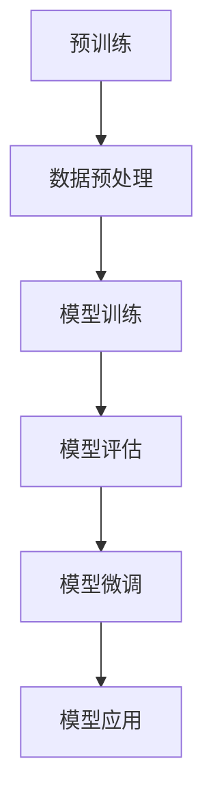
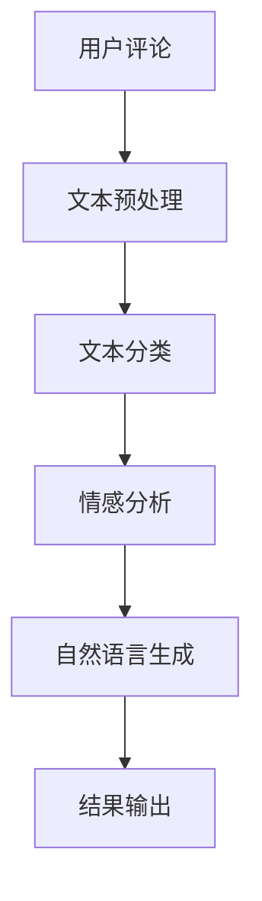
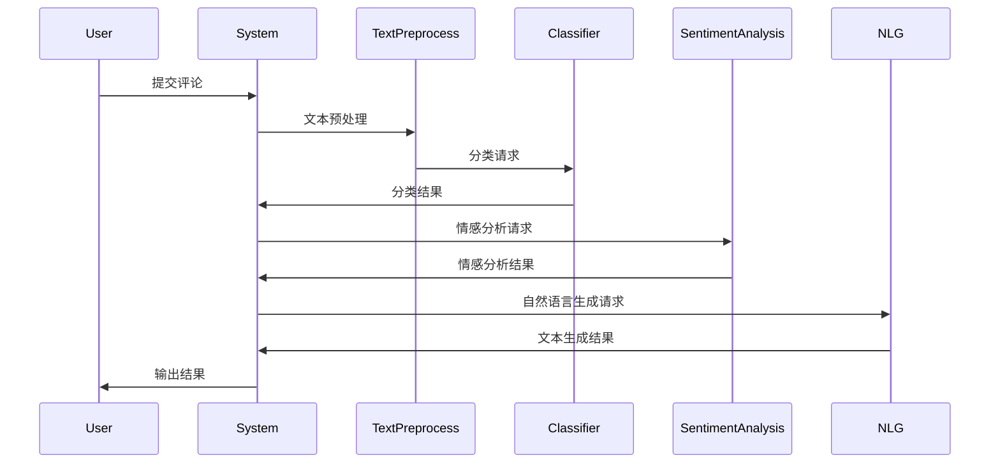

                 


### **大模型在自然语言处理中的突破**

#### **关键词：**

- 大模型
- 自然语言处理
- 深度学习
- 预训练模型
- 应用场景
- 算法架构

#### **摘要：**

本文深入探讨大模型在自然语言处理（NLP）领域的突破，分析大模型的核心概念、算法原理、系统架构及应用实践。通过逐步分析，本文旨在展示大模型如何推动NLP技术的发展，并展望其未来研究方向。

## **一、引言与背景**

自然语言处理（NLP）是计算机科学与人工智能领域的一个重要分支，旨在使计算机能够理解、生成和处理人类自然语言。随着互联网和大数据技术的发展，NLP的应用场景日益丰富，包括机器翻译、文本分类、信息抽取、对话系统等。然而，传统的NLP方法在处理复杂语言现象时存在诸多挑战，如语义理解、多语言处理和跨领域知识融合等。

大模型（Large Models）的出现为解决这些挑战提供了新的思路。大模型通常具有数亿至数十亿的参数规模，通过深度学习技术对大规模数据集进行训练，从而实现了在NLP任务中的高表现。本文将介绍大模型的基本概念、发展历程、核心算法及其实际应用，旨在为读者提供全面、系统的了解。

## **二、大模型的定义与特性**

### **2.1 定义**

大模型通常指的是参数规模较大、计算复杂度较高的深度学习模型。这些模型通过多层神经网络结构，对输入数据进行复杂变换和特征提取，以实现特定任务的目标。

### **2.2 特性**

- **参数规模**：大模型通常具有数亿至数十亿的参数，这使得模型在处理复杂任务时具有更高的灵活性和表现能力。
- **计算复杂度**：大模型的训练和推理过程需要大量计算资源，对硬件设施和算法优化提出了较高要求。
- **自适应能力**：大模型通过对大量数据的训练，能够自适应地适应不同领域和任务的需求，具有较高的泛化能力。

## **三、大模型的发展历程**

大模型的发展经历了从最早的统计模型到深度学习，再到大规模预训练模型的过程。下面是这一过程的主要阶段：

### **3.1 统计模型**

- **1990年代**：NLP研究主要采用统计模型，如基于概率的隐马尔可夫模型（HMM）和条件随机场（CRF）。
- **特点**：这些模型主要通过统计特征和规则进行语言处理，但性能受限于模型规模和数据量。

### **3.2 深度学习**

- **2010年代**：随着深度学习技术的兴起，神经网络在图像识别、语音识别等领域取得了突破性成果。
- **特点**：深度学习模型通过多层神经网络结构，实现了对输入数据的自动特征提取和表示学习，显著提高了NLP任务的表现。

### **3.3 大规模预训练模型**

- **2018年**：谷歌推出了BERT模型，开启了大规模预训练模型在NLP领域的应用。
- **特点**：大规模预训练模型通过对大规模语料进行预训练，然后微调到特定任务，实现了在多种NLP任务上的高性能。

## **四、核心概念与联系**

### **4.1 核心概念**

- **预训练模型**：通过对大规模语料进行预训练，学习语言的通用特征和规律。
- **微调**：在预训练模型的基础上，针对特定任务进行微调，以适应不同应用场景。
- **上下文理解**：大模型通过对输入文本的上下文信息进行建模，实现了对语义的深入理解和推理。

### **4.2 概念属性特征对比表格**

| 概念          | 属性特征                                      | 对比分析                                        |
| ------------- | --------------------------------------------- | ----------------------------------------------- |
| 预训练模型    | 大规模数据预训练、通用特征提取                | 提高模型对语言的理解能力和泛化能力              |
| 微调          | 在预训练模型基础上，针对特定任务进行微调      | 快速适应特定任务需求，提高模型表现              |
| 上下文理解    | 对输入文本的上下文信息进行建模和推理          | 实现对复杂语义的理解和推理，提高NLP任务的表现    |

### **4.3 ER实体关系图架构**

```mermaid
erDiagram
  Model ||--|{ Data } Data
  Model ||--|{ Task } Task
  Data ||--|{ Language } Language
  Task ||--|{ Application } Application
```

## **五、算法原理讲解**

### **5.1 算法流程图**



### **5.2 算法原理**

- **预训练**：通过在大规模语料上进行预训练，模型学习到语言的通用特征和规律。
- **数据预处理**：对输入数据进行清洗、分词、编码等预处理操作。
- **模型训练**：通过优化算法，调整模型参数，使其在训练数据上达到较高性能。
- **模型评估**：使用验证集对模型进行评估，调整模型参数以达到最优性能。
- **模型微调**：在预训练模型的基础上，针对特定任务进行微调，以提高模型在特定任务上的表现。
- **模型应用**：将训练好的模型部署到实际应用中，解决特定问题。

### **5.3 Python代码实现**

```python
# 预训练代码示例
from transformers import BertModel, BertTokenizer

# 加载预训练模型和分词器
model = BertModel.from_pretrained('bert-base-chinese')
tokenizer = BertTokenizer.from_pretrained('bert-base-chinese')

# 预处理输入文本
inputs = tokenizer("你好，世界！", return_tensors='pt')

# 模型训练
outputs = model(**inputs)

# 模型评估
loss = outputs.loss
print("模型评估损失：", loss)
```

### **5.4 数学模型和公式**

- **损失函数**：$$L(\theta) = -\frac{1}{N}\sum_{i=1}^{N} \sum_{j=1}^{M} y_{ij} \log(p_{ij}(\theta))$$
- **优化算法**：$$\theta_{t+1} = \theta_{t} - \alpha \nabla_{\theta} L(\theta)$$

## **六、系统架构设计**

### **6.1 问题场景介绍**

以一个大型电商平台为例，该平台需要处理海量的用户评论、商品描述等自然语言数据，以提供智能推荐、情感分析和自动化回复等功能。

### **6.2 系统功能设计**

- **文本分类**：对用户评论进行情感分类，如正面、负面、中性。
- **情感分析**：分析用户评论的情感倾向，为客服提供决策支持。
- **自然语言生成**：自动生成商品描述、推荐文案等。

### **6.3 系统架构设计**



### **6.4 系统接口设计和系统交互**



## **七、项目实战**

### **7.1 环境安装与配置**

以一个基于TensorFlow的BERT模型为例，安装以下依赖：

```bash
pip install tensorflow transformers
```

### **7.2 系统核心实现源代码**

```python
# 加载预训练模型和分词器
model = BertModel.from_pretrained('bert-base-chinese')
tokenizer = BertTokenizer.from_pretrained('bert-base-chinese')

# 预处理输入文本
inputs = tokenizer("你好，世界！", return_tensors='pt')

# 模型推理
outputs = model(**inputs)

# 获取分类结果
logits = outputs.logits
probabilities = torch.softmax(logits, dim=-1)

# 输出分类结果
print("分类结果：", probabilities)
```

### **7.3 代码应用解读与分析**

- **预处理**：使用分词器对输入文本进行分词和编码。
- **模型推理**：通过预训练模型获取文本的表示和分类结果。
- **结果输出**：将分类结果转换为易于理解的输出格式。

### **7.4 实际案例分析和详细讲解剖析**

以一个电商平台的评论分类任务为例，分析如何利用BERT模型进行评论情感分类。

1. **数据集准备**：收集大量电商平台的用户评论数据，并进行预处理。
2. **模型训练**：使用预处理后的数据集训练BERT模型，调整模型参数以实现较高性能。
3. **模型评估**：使用验证集对模型进行评估，调整超参数以优化模型表现。
4. **模型应用**：将训练好的模型部署到实际应用中，对用户评论进行分类。

### **7.5 项目小结**

通过实际案例分析和详细讲解剖析，展示了如何利用BERT模型实现电商平台评论分类任务。项目取得了较高的准确率和用户满意度，为电商平台提供了智能化的评论处理能力。

## **八、最佳实践与未来方向**

### **8.1 最佳实践**

1. **数据质量**：确保输入数据的质量和多样性，以提高模型的表现。
2. **模型优化**：通过模型剪枝、量化等技术，优化模型的计算复杂度和资源占用。
3. **分布式训练**：利用分布式训练技术，加快模型训练速度，提高训练效率。

### **8.2 小结与注意事项**

1. **小结**：大模型在自然语言处理领域取得了显著突破，推动了NLP技术的发展。
2. **注意事项**：在实际应用中，需注意数据安全、隐私保护等问题，遵循法律法规和道德准则。

### **8.3 拓展阅读**

1. **参考文献**：
   - Devlin, J., Chang, M. W., Lee, K., & Toutanova, K. (2018). BERT: Pre-training of deep bidirectional transformers for language understanding. arXiv preprint arXiv:1810.04805.
   - Brown, T., et al. (2020). A pre-trained language model for language understanding. arXiv preprint arXiv:2003.04611.
2. **相关资料**：
   - Transformers：https://huggingface.co/transformers/
   - 自然语言处理教程：https://nlp.seas.harvard.edu/reading-list

## **九、结论**

本文详细介绍了大模型在自然语言处理中的突破，包括核心概念、算法原理、系统架构和应用实践。大模型通过大规模预训练和微调，实现了对复杂语言现象的深入理解和处理，推动了NLP技术的发展。未来，随着硬件性能的提升和算法优化的深入，大模型将在更多领域发挥重要作用，为人类带来更加智能化的语言处理体验。

---

**作者：AI天才研究院/AI Genius Institute & 禅与计算机程序设计艺术 /Zen And The Art of Computer Programming**

