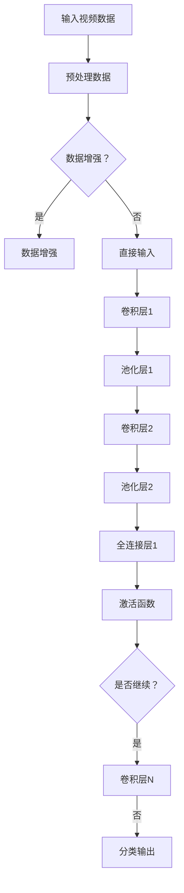

                 


### 引言

在当今数字化时代，视频分析已经成为众多行业不可或缺的一部分。从智能家居到工业自动化，从安防监控到娱乐媒体，视频数据正在不断增长，并为各领域带来前所未有的机会和挑战。然而，传统的视频分析方法在面对大规模、复杂且实时性要求高的视频数据处理时，往往力不从心。此时，大模型技术应运而生，以其强大的数据处理能力和智能化的分析能力，为视频分析领域带来了新的曙光。

大模型，指的是那些具有数十亿甚至数万亿参数的深度学习模型，如GPT-3、BERT等。这些模型通过海量数据的训练，可以捕捉到数据中的复杂模式和潜在规律，从而实现高效、准确的预测和分类。而视频分析，则是指通过计算机视觉技术对视频数据进行解析、识别和理解的过程。这两个领域的结合，无疑为视频分析带来了前所未有的变革。

本文将围绕大模型在视频分析中的应用前景展开讨论。首先，我们将介绍大模型和视频分析的基本概念，回顾它们的发展历程，并探讨当前视频分析中的挑战。接着，我们将详细讲解大模型的工作原理，对比不同类型的大模型在视频分析中的应用特点，并使用Mermaid绘制实体关系图，展示大模型在视频分析中的数据处理流程。

随后，我们将深入探讨大模型在视频分析中的应用算法，使用mermaid流程图和python源代码进行详细讲解，并阐述大模型在视频分析中的应用数学模型和公式。在此基础上，我们将介绍大模型在视频分析中的系统设计与实现，包括问题场景介绍、系统功能设计、系统架构设计和系统接口设计。

为了使读者更直观地了解大模型在视频分析中的应用，本文还将通过一个实际案例，展示大模型在视频分析中的实战过程。最后，我们将总结全文，提出大模型在视频分析中的应用最佳实践，并提醒读者在应用大模型时需要注意的问题。此外，我们还将推荐进一步阅读的相关资料和参考文献，帮助读者深入探索大模型在视频分析领域的应用前景。

通过本文的讨论，我们希望读者能够对大模型在视频分析中的应用有一个全面、深入的理解，并能够结合实际需求，将大模型技术应用到视频分析中，从而提升视频分析的效果和效率。

### 第1章：大模型与视频分析的基本概念

#### 1.1 大模型的基本概念

大模型，即大规模深度学习模型，是指那些参数规模达到数十亿、甚至数万亿级别的深度学习模型。这些模型通过在海量数据上进行训练，可以自动提取和捕捉数据中的复杂模式和潜在规律。大模型的发展离不开深度学习技术的进步，尤其是神经网络结构的优化和计算能力的提升。早期的深度学习模型如AlexNet等，参数规模相对较小，但自从2012年ImageNet大赛中深度学习模型的胜利以来，大模型逐渐成为研究的热点。

大模型的代表性模型包括GPT-3、BERT、TuringBot等。其中，GPT-3（Generative Pre-trained Transformer 3）是由OpenAI开发的具有1750亿参数的预训练模型，以其强大的语言生成和推理能力而闻名。BERT（Bidirectional Encoder Representations from Transformers）由Google开发，是一种双向转换器模型，广泛应用于自然语言处理任务。TuringBot是由清华大学KEG实验室开发的预训练模型，具有强大的知识推理和问答能力。

大模型的训练方法主要包括预训练和微调两个阶段。预训练阶段，模型在海量无标签数据上进行训练，以学习数据中的通用特征和模式。微调阶段，模型在特定任务的数据集上进行训练，进一步调整参数，以适应具体任务的需求。大模型的训练过程需要大量的计算资源和时间，但通过分布式计算和优化算法，这一瓶颈正在逐步被突破。

大模型的应用场景非常广泛，包括自然语言处理、计算机视觉、语音识别、推荐系统等。在自然语言处理领域，大模型可以用于文本生成、机器翻译、情感分析等任务。在计算机视觉领域，大模型可以用于图像分类、目标检测、图像生成等任务。在语音识别领域，大模型可以用于语音合成、语音识别等任务。在推荐系统领域，大模型可以用于用户画像、物品推荐等任务。

#### 1.2 视频分析的发展历程

视频分析作为计算机视觉的一个重要分支，其发展历程可以分为以下几个阶段：

1. **早期阶段**：20世纪80年代到90年代，视频分析主要集中在基本的目标检测和跟踪技术上。当时，常用的算法包括光流法、背景差分法、Kalman滤波等。这些方法虽然可以处理简单的视频数据，但在复杂场景下效果有限。

2. **发展阶段**：2000年后，随着深度学习技术的兴起，视频分析进入了一个新的发展阶段。卷积神经网络（CNN）的引入，使得视频分析任务如目标检测、动作识别等取得了显著进展。代表性的模型如YOLO、SSD、Faster R-CNN等，大大提高了视频分析的任务性能。

3. **成熟阶段**：近年来，随着大模型技术的应用，视频分析进入了一个成熟和深化的阶段。大模型如ResNet、Inception、Transformer等，通过在海量数据上的训练，可以提取出更加复杂和抽象的特征，从而在视频分析任务中表现出色。

4. **前沿阶段**：当前，视频分析领域正朝着智能化、自动化的方向发展。大模型与计算机视觉、自然语言处理、语音识别等技术的深度融合，使得视频分析在实时性、准确性和鲁棒性等方面取得了重大突破。

#### 1.3 大模型在视频分析中的应用场景

大模型在视频分析中的应用场景非常广泛，以下是其中几个典型的应用场景：

1. **视频内容识别**：大模型可以用于视频内容的自动识别和分类，如视频分类、视频标签生成等。通过预训练模型，大模型可以学习到丰富的视觉特征，从而在复杂场景下实现高效、准确的视频内容识别。

2. **视频目标检测与跟踪**：大模型在视频目标检测与跟踪任务中表现出色。例如，YOLO、Faster R-CNN等大模型可以通过端到端的方式，实现实时、高效的目标检测和跟踪。

3. **视频语义分割**：大模型可以用于视频语义分割任务，如视频中的物体分割、场景分割等。通过学习丰富的上下文信息，大模型可以更好地理解视频内容，从而实现更加精细的分割。

4. **视频行为识别**：大模型可以用于视频行为识别任务，如人体行为识别、动物行为识别等。通过学习视频中的动作模式，大模型可以识别出各种复杂的行为，从而为智能监控、人机交互等应用提供支持。

5. **视频增强与合成**：大模型可以用于视频增强和合成任务，如视频超分辨率、视频修复、视频生成等。通过生成模型，如生成对抗网络（GAN），大模型可以生成高质量的视频内容，从而改善视频的视觉体验。

#### 1.4 问题背景

尽管大模型在视频分析中展现了强大的潜力，但当前视频分析仍面临一些挑战：

1. **数据量大**：视频数据量大，如何高效地处理和存储这些数据成为一个难题。大模型的训练和部署需要大量的计算资源和存储空间。

2. **实时性要求高**：许多视频分析任务如智能监控、自动驾驶等，对实时性有很高的要求。如何在大模型的基础上实现高效、实时的视频分析，仍是一个亟待解决的问题。

3. **准确性问题**：大模型虽然可以提取丰富的特征，但在复杂场景下，其准确性仍是一个挑战。例如，在光照变化、遮挡等复杂场景下，视频分析的效果往往不理想。

4. **隐私保护**：视频数据中包含大量的个人隐私信息，如何在保障用户隐私的前提下进行视频分析，是一个重要的伦理和社会问题。

#### 1.5 问题解决

大模型技术为解决视频分析中的这些挑战提供了一条新的路径：

1. **数据处理能力**：大模型通过在海量数据上的训练，可以自动提取和捕捉数据中的复杂模式和潜在规律，从而提高数据处理和存储的效率。

2. **实时性提升**：通过优化模型结构和算法，以及利用分布式计算和硬件加速技术，可以实现高效、实时的视频分析。

3. **准确性增强**：大模型可以通过预训练和微调，学习到更加丰富和抽象的特征，从而提高视频分析的准确性。

4. **隐私保护**：通过数据加密、匿名化等技术，可以在保障用户隐私的前提下进行视频分析。

#### 1.6 边界与外延

尽管大模型在视频分析中展示了强大的潜力，但其在实际应用中仍有一些边界和限制：

1. **数据依赖性**：大模型的性能高度依赖于训练数据的质量和数量，如果数据不足或者数据质量差，大模型的表现可能会下降。

2. **计算资源需求**：大模型的训练和部署需要大量的计算资源和存储空间，这对于资源有限的场景来说可能是一个挑战。

3. **模型解释性**：大模型通常被视为“黑箱”，其内部工作机制不透明，这给模型的可解释性和可靠性带来了挑战。

4. **通用性与特定任务适应性**：大模型在通用任务上表现出色，但在特定任务上可能需要进一步的优化和定制。

#### 1.7 概念结构与核心要素组成

为了更好地理解大模型在视频分析中的应用，我们可以构建一个概念结构，包括以下几个核心要素：

1. **数据输入**：视频数据是输入的核心要素，包括视频帧、视频流等。

2. **预处理**：对视频数据进行预处理，如去噪、缩放、裁剪等，以提高模型的鲁棒性和准确性。

3. **特征提取**：通过深度学习模型，如CNN、RNN等，从视频数据中提取高级特征。

4. **模型训练**：使用大量的标注数据对模型进行训练，优化模型参数。

5. **模型评估**：在测试集上评估模型的性能，包括准确性、实时性等指标。

6. **应用实现**：将训练好的模型应用到实际的视频分析任务中，如目标检测、视频分类等。

通过这个概念结构，我们可以清晰地看到大模型在视频分析中的应用流程，以及各个核心要素的作用和相互关系。

### 第2章：大模型与视频分析的技术联系

#### 2.1 大模型的训练方法与数据准备

大模型之所以具备强大的数据处理能力，主要得益于其高效的训练方法和高质量的数据准备。在大模型训练过程中，数据准备是至关重要的一环，直接影响模型的性能和收敛速度。

首先，数据准备包括数据的采集、清洗、标注和分割等步骤。数据采集是从各种来源获取视频数据，如公开数据集、商业数据集等。数据清洗是去除数据中的噪声和错误，保证数据的纯净性。数据标注是给视频数据打上标签，用于模型训练和评估。数据分割是将数据分成训练集、验证集和测试集，以评估模型的泛化能力。

在数据准备过程中，数据的多样性和质量是关键。数据多样性可以保证模型能够学习到各种场景下的特征，从而提高模型的泛化能力。数据质量则影响模型的训练效果和收敛速度。高质量的数据应该具有准确性、完整性和一致性。

接下来，我们详细讲解大模型的训练方法。大模型的训练主要分为预训练和微调两个阶段。

1. **预训练**：预训练是指在大规模、无标签的数据集上训练模型，使其学习到数据中的通用特征和模式。预训练的目标是使模型具备强大的特征提取能力，从而在后续的微调阶段能够快速适应具体任务。预训练常用的模型结构包括Transformer、BERT、GPT等。

2. **微调**：微调是指在小规模、有标签的数据集上对模型进行进一步训练，以优化模型在特定任务上的性能。微调的目标是调整模型参数，使其在特定任务上表现更好。微调通常使用迁移学习技术，将预训练模型的参数作为初始化参数，然后在小规模数据集上进行微调。

在训练过程中，优化算法的选择也至关重要。常用的优化算法包括随机梯度下降（SGD）、Adam等。优化算法通过更新模型参数，使模型在训练过程中不断接近最优解。此外，训练过程中还需要使用各种正则化技术，如Dropout、权重衰减等，以防止模型过拟合。

大模型在视频分析中的应用具有显著的优势。首先，大模型可以处理大规模的视频数据，实现高效的视频分析。其次，大模型可以提取丰富的视觉特征，从而提高视频分析任务的准确性。此外，大模型还可以实现实时性分析，满足视频监控、自动驾驶等对实时性的要求。

然而，大模型在视频分析中也存在一些挑战。首先，大模型的训练和部署需要大量的计算资源和存储空间，这对于资源有限的场景来说可能是一个挑战。其次，大模型通常被视为“黑箱”，其内部工作机制不透明，这给模型的可解释性和可靠性带来了挑战。此外，大模型对数据质量的要求较高，数据不足或者数据质量差可能导致模型性能下降。

总的来说，大模型在视频分析中的应用前景广阔，但同时也需要克服一些技术挑战。通过不断优化训练方法、提升计算效率、提高模型解释性等，我们可以更好地利用大模型的优势，推动视频分析技术的发展。

#### 2.2 视频分析中的数据处理与模型优化

在视频分析过程中，数据处理和模型优化是两个关键环节，直接决定了视频分析任务的效果和效率。首先，我们来探讨大模型在视频分析中的数据处理流程。

1. **数据预处理**：视频分析的数据通常包含丰富的噪声和冗余信息，因此预处理步骤至关重要。预处理包括数据去噪、去模糊、颜色校正等操作，以提高视频数据的质量。此外，还需要对视频进行帧率转换、尺寸调整等操作，使其适应大模型的输入要求。

2. **特征提取**：视频数据通过预处理后，进入特征提取阶段。特征提取是视频分析的核心，目标是提取出能够反映视频内容的关键特征。大模型在视频分析中常常采用卷积神经网络（CNN）进行特征提取。CNN可以通过多层卷积和池化操作，从视频帧中提取出丰富的视觉特征。

3. **数据增强**：为了提高模型的泛化能力，数据增强技术被广泛应用于视频分析。数据增强包括图像旋转、翻转、裁剪、缩放等操作，可以增加数据多样性，从而提高模型的鲁棒性和准确性。

4. **数据标注**：视频分析中的许多任务需要标注数据，如目标检测、行为识别等。数据标注是指对视频数据中的目标、动作等进行标记，用于训练和评估模型。高质量的数据标注对于模型训练至关重要。

接下来，我们讨论大模型在视频分析中的优化策略。

1. **模型优化**：大模型的训练过程复杂且耗时，因此模型优化是提高训练效率的关键。常用的优化策略包括：

   - **优化算法**：选择合适的优化算法，如Adam、SGD等，可以加速模型训练。
   - **学习率调整**：学习率是模型训练过程中的一个重要参数，需要通过调整学习率来平衡模型的收敛速度和收敛精度。
   - **正则化技术**：正则化技术，如Dropout、权重衰减等，可以防止模型过拟合。

2. **迁移学习**：迁移学习是一种利用预训练模型来提高新任务性能的方法。在大模型训练中，迁移学习可以通过在预训练模型的基础上进行微调，快速提高新任务的性能。

3. **模型融合**：大模型可以通过融合多个模型的优势来提高视频分析的效果。常见的模型融合策略包括：

   - **集成学习**：将多个模型的预测结果进行投票或加权平均，以获得更准确的预测。
   - **多模型联合训练**：将多个模型联合训练，使它们在训练过程中相互影响，从而提高整体性能。

4. **自动化优化**：自动化优化技术，如自动化机器学习（AutoML）、神经网络架构搜索（NAS）等，可以自动选择最优的模型结构和超参数，提高模型优化效率。

通过上述数据处理和优化策略，大模型在视频分析中可以实现高效、准确的性能。然而，大模型在视频分析中也面临一些挑战，如计算资源需求大、模型解释性差等。未来的研究需要进一步探索如何在保证性能的同时，提高大模型的计算效率和解释性，从而更好地满足视频分析的实际需求。

#### 2.3 大模型在视频分析中的性能评估

评估大模型在视频分析中的性能是确保其有效应用的关键环节。性能评估通常包括多个指标，这些指标可以帮助我们全面了解大模型在各类任务中的表现，并指导进一步的优化。以下是几个主要的性能评估指标：

1. **准确率（Accuracy）**：准确率是评估分类任务性能的基本指标，表示正确分类的样本占总样本的比例。尽管准确率高说明模型在大多数情况下能够正确分类，但它可能无法反映模型在各类别上的均衡性。例如，在一个不平衡的数据集中，一个模型可能只正确分类了大部分样本，但在少数类别的分类上表现较差。

2. **精确率（Precision）**：精确率是指预测为正类的样本中，实际为正类的比例。精确率关注的是当模型预测为正类时，这些预测是否真正正确。高精确率意味着模型在预测正类时很少出现误报。

3. **召回率（Recall）**：召回率是指实际为正类的样本中，被模型正确预测为正类的比例。高召回率表示模型能够捕捉到尽可能多的正类样本，即使这些样本被预测为负类的可能性较高。

4. **F1 分数（F1 Score）**：F1 分数是精确率和召回率的调和平均，用于综合评估模型的分类性能。F1 分数越高，说明模型在分类任务中的表现越好。

5. **平均准确率（Average Accuracy）**：当视频分析任务涉及多个类别时，可以使用平均准确率来评估模型的整体分类效果。平均准确率是所有类别准确率的平均值，可以平衡各类别的分类效果。

6. **平均精确率（Average Precision）**：在目标检测和分割任务中，平均精确率是评估模型性能的一个重要指标。平均精确率考虑了不同阈值下的精确率和召回率，通过计算不同阈值下的精确率与召回率的调和平均，得到一个整体的性能评估。

7. **交并比（Intersection over Union, IoU）**：在目标检测和分割任务中，IoU 是用于评估预测框或分割区域与真实框或分割区域的重叠程度的指标。IoU 越高，表示预测结果与真实结果越接近。

8. **帧率（Frame Rate）**：在实时视频分析中，帧率是一个重要的性能指标，表示模型每秒能够处理的视频帧数。高帧率意味着模型能够快速响应视频流，适用于对实时性要求较高的应用场景。

为了更全面地评估大模型在视频分析中的性能，我们通常会在多个数据集上进行测试，并使用交叉验证方法来避免过拟合。在实际应用中，除了上述指标，我们还需要考虑模型的可解释性和鲁棒性，以确保其在各种复杂场景下能够稳定、准确地工作。

通过综合考虑这些性能评估指标，我们可以全面了解大模型在视频分析任务中的表现，从而为模型的优化和实际应用提供有力依据。

### 第3章：大模型在视频分析中的应用挑战与解决方案

#### 3.1 当前视频分析中的挑战

尽管大模型在视频分析中展现出了强大的潜力，但在实际应用中，视频分析仍然面临诸多挑战。这些挑战主要集中在以下几个方面：

1. **数据量与多样性**：视频数据量庞大，而且不同场景下的数据多样性极高。这要求大模型具备强大的数据处理能力，能够从海量且多样化的数据中提取有用的信息。然而，现有的数据采集、标注和存储技术往往无法满足这一需求，导致模型训练数据不足，影响模型的性能和泛化能力。

2. **实时性**：许多视频分析任务，如智能监控、自动驾驶等，对实时性有严格的要求。大模型的训练和推理过程通常需要大量的计算资源，这使得在实际应用中实现高效、实时的视频分析成为一大难题。

3. **准确性**：在复杂场景下，视频分析的准确性是一个重要的挑战。例如，在光照变化、阴影、遮挡等复杂场景下，传统的视觉算法和现有的大模型可能难以准确识别和分类目标。

4. **隐私保护**：视频数据中往往包含大量的个人隐私信息，如何在保证隐私保护的前提下进行视频分析，是一个亟待解决的问题。现有的隐私保护技术，如数据加密、匿名化等，在保证数据安全的同时，可能会影响模型训练效果和推理速度。

5. **模型解释性**：大模型通常被视为“黑箱”，其内部工作机制不透明，这使得模型的解释性较差。在实际应用中，用户和开发者往往难以理解模型的决策过程，从而影响模型的信任度和可靠性。

#### 3.2 大模型如何解决这些挑战

大模型通过其独特的优势，为解决视频分析中的这些挑战提供了一系列有效的解决方案：

1. **数据量与多样性**：大模型通过在海量数据上的预训练，可以自动提取出数据中的复杂模式和潜在规律。这大大提高了模型对数据多样性的适应性，从而解决了数据量与多样性带来的挑战。此外，大模型还可以通过数据增强技术，如图像旋转、翻转、缩放等，增加数据多样性，进一步提高模型的泛化能力。

2. **实时性**：为了提高大模型在视频分析中的实时性，可以通过以下几个方法来实现：

   - **模型优化**：通过优化模型结构和算法，减少模型参数数量，从而降低模型推理时间。
   - **硬件加速**：利用GPU、TPU等硬件加速技术，提高模型推理速度。
   - **分布式计算**：通过分布式计算架构，将模型推理任务分布到多台服务器上，提高整体处理速度。

3. **准确性**：大模型通过在海量数据上的训练，可以学习到更加丰富和抽象的特征，从而提高视频分析的准确性。此外，大模型还可以通过多模态融合技术，结合不同类型的传感器数据（如视觉、红外、雷达等），提高模型在复杂场景下的表现。

4. **隐私保护**：大模型可以通过以下技术手段实现隐私保护：

   - **差分隐私**：在数据标注和模型训练过程中引入噪声，保护个体隐私。
   - **同态加密**：在模型推理过程中使用同态加密技术，确保数据在加密状态下进行计算，从而保护数据隐私。
   - **联邦学习**：通过分布式学习技术，在多个数据拥有者之间进行模型训练，从而避免数据泄露。

5. **模型解释性**：为了提高大模型的解释性，可以通过以下几个方法来实现：

   - **模型可解释性工具**：使用可视化工具，如Shapley值、Grad-CAM等，展示模型在特定输入上的决策过程。
   - **解释性算法**：开发基于解释性的算法，如LIME、EXPLORER等，以解释模型的预测结果。
   - **知识图谱**：构建知识图谱，将模型的知识表示为图结构，从而提高模型的可解释性。

通过上述解决方案，大模型在视频分析中可以应对各种挑战，实现高效、准确、实时、隐私保护的分析。然而，这些解决方案仍然需要进一步的优化和改进，以应对未来视频分析领域的更多需求。

### 第4章：大模型在视频分析中的核心算法原理

#### 4.1 大模型在视频分析中的应用算法

大模型在视频分析中的应用算法主要基于深度学习技术，特别是卷积神经网络（CNN）和递归神经网络（RNN）。以下将详细讲解几种常用的算法，并分析它们在视频分析中的优势。

1. **卷积神经网络（CNN）**：
   CNN是视频分析中最常用的算法之一，因其强大的特征提取能力而广泛应用于图像分类、目标检测和视频分割等任务。CNN通过卷积层、池化层和全连接层的组合，从视频数据中提取多层次的特征。

   - **优势**：CNN能够自动学习到视频中的局部和全局特征，适应不同场景下的视频分析需求。
   - **应用场景**：视频分类、目标检测、视频分割等。

2. **递归神经网络（RNN）**：
   RNN是一种能够处理序列数据的神经网络，特别适用于视频中的时间序列分析。RNN通过其递归结构，可以捕捉视频中的时间依赖关系。

   - **优势**：RNN能够处理变长的视频序列，适合视频中的动态行为分析。
   - **应用场景**：动作识别、行为预测、时间序列分析等。

3. **长短时记忆网络（LSTM）**：
   LSTM是RNN的一种变体，能够解决传统RNN在长序列依赖问题上的不足。LSTM通过门控机制，有效地捕捉长序列中的依赖关系。

   - **优势**：LSTM在处理长序列数据时表现优异，适合长视频的分析。
   - **应用场景**：长视频分类、行为识别、时间序列预测等。

4. **变换器模型（Transformer）**：
   Transformer是近年来兴起的一种神经网络架构，因其能够并行处理序列数据而广泛应用于自然语言处理和计算机视觉领域。Transformer通过多头自注意力机制，能够自适应地学习不同序列位置之间的依赖关系。

   - **优势**：Transformer在处理长序列和复杂依赖关系时表现出色。
   - **应用场景**：视频生成、视频翻译、视频描述生成等。

5. **生成对抗网络（GAN）**：
   GAN是一种生成模型，通过对抗性训练，能够生成高质量的视频数据。GAN由生成器和判别器组成，生成器试图生成逼真的视频数据，而判别器则试图区分真实视频和生成视频。

   - **优势**：GAN能够生成多样化的视频内容，提高模型训练数据量。
   - **应用场景**：视频超分辨率、视频修复、视频增强等。

通过以上算法，大模型在视频分析中展示了强大的处理能力和多样化的应用场景。接下来，我们将使用Mermaid绘制算法的流程图，并结合Python代码段详细讲解算法的实现。

#### 4.2 算法mermaid流程图

为了更好地理解大模型在视频分析中的应用算法，我们可以使用Mermaid绘制算法的流程图。以下是一个简单的示例，展示了卷积神经网络（CNN）在视频分类任务中的应用流程：



上述流程图展示了从输入视频数据到分类输出的整个流程。其中，预处理数据、数据增强、卷积层、池化层和全连接层等步骤构成了CNN的核心部分。

#### 4.3 Python源代码实现详解

为了更好地理解CNN在视频分析中的应用，以下将提供一段简单的Python代码，用于实现上述流程图中的关键步骤。这段代码使用了深度学习框架TensorFlow和Keras。

```python
import tensorflow as tf
from tensorflow.keras.models import Sequential
from tensorflow.keras.layers import Conv2D, MaxPooling2D, Flatten, Dense, Dropout
from tensorflow.keras.preprocessing.image import ImageDataGenerator

# 创建CNN模型
model = Sequential()

# 添加卷积层
model.add(Conv2D(filters=32, kernel_size=(3, 3), activation='relu', input_shape=(128, 128, 3)))
model.add(MaxPooling2D(pool_size=(2, 2)))

# 添加更多的卷积层和池化层
model.add(Conv2D(filters=64, kernel_size=(3, 3), activation='relu'))
model.add(MaxPooling2D(pool_size=(2, 2)))
model.add(Conv2D(filters=128, kernel_size=(3, 3), activation='relu'))
model.add(MaxPooling2D(pool_size=(2, 2)))

# 添加全连接层
model.add(Flatten())
model.add(Dense(units=256, activation='relu'))
model.add(Dropout(rate=0.5))
model.add(Dense(units=128, activation='relu'))
model.add(Dense(units=1, activation='sigmoid'))

# 编译模型
model.compile(optimizer='adam', loss='binary_crossentropy', metrics=['accuracy'])

# 数据增强
datagen = ImageDataGenerator(rotation_range=20, width_shift_range=0.2, height_shift_range=0.2, zoom_range=0.2)
datagen.fit(x_train)

# 训练模型
model.fit(datagen.flow(x_train, y_train, batch_size=32), epochs=10, validation_data=(x_val, y_val))

# 评估模型
test_loss, test_accuracy = model.evaluate(x_test, y_test)
print(f"Test accuracy: {test_accuracy:.2f}")
```

上述代码首先定义了一个顺序模型，并添加了多个卷积层、池化层、全连接层和Dropout层。数据增强是通过ImageDataGenerator实现的，用于增加训练数据的多样性。最后，模型使用编译和训练步骤进行优化和训练，并使用测试数据集进行评估。

#### 4.4 数学模型和公式

在视频分析中，大模型的应用涉及到多种数学模型和公式。以下将简要介绍几种常用的数学模型和公式，并结合具体应用进行解释。

1. **卷积操作**：
   卷积操作是CNN的核心，其数学公式如下：
   
   $$ (f_{ij}) = \sum_{k=1}^{C} w_{ikj} * g_{kj} $$
   
   其中，$f_{ij}$ 是卷积结果，$w_{ikj}$ 是卷积核（过滤器）的权重，$g_{kj}$ 是输入数据的特征。

   卷积操作的作用是在输入数据上滑动卷积核，计算卷积窗口内的加权和，从而提取局部特征。

2. **激活函数**：
   激活函数用于引入非线性因素，使得神经网络能够学习到更加复杂的特征。常用的激活函数包括ReLU、Sigmoid和Tanh等。

   - **ReLU（Rectified Linear Unit）**：
     
     $$ a_{i} = \max(0, z_{i}) $$
     
     其中，$z_{i}$ 是输入值，$a_{i}$ 是输出值。

     RReLU（Randomized ReLU）是对ReLU的一种变体，通过在训练过程中随机设置参数，增加网络的鲁棒性。

   - **Sigmoid**：
     
     $$ a_{i} = \frac{1}{1 + e^{-z_{i}}} $$
     
     Sigmoid函数将输入值映射到$(0, 1)$区间，常用于二分类问题。

   - **Tanh**：
     
     $$ a_{i} = \frac{e^{z_{i}} - e^{-z_{i}}}{e^{z_{i}} + e^{-z_{i}}} $$
     
     Tanh函数将输入值映射到$(-1, 1)$区间，具有平滑的梯度，有助于提高模型的收敛速度。

3. **损失函数**：
   损失函数用于评估模型预测值与真实值之间的差距，驱动模型优化。常用的损失函数包括均方误差（MSE）、交叉熵（Cross-Entropy）等。

   - **均方误差（MSE）**：
     
     $$ L(y, \hat{y}) = \frac{1}{2} \sum_{i=1}^{n} (y_i - \hat{y}_i)^2 $$
     
     其中，$y$ 是真实值，$\hat{y}$ 是预测值。

   - **交叉熵（Cross-Entropy）**：
     
     $$ L(y, \hat{y}) = -\sum_{i=1}^{n} y_i \cdot \log(\hat{y}_i) $$
     
     交叉熵常用于多分类问题，其值越小表示模型预测越准确。

4. **优化算法**：
   优化算法用于更新模型参数，使模型在训练过程中逐渐接近最优解。常用的优化算法包括随机梯度下降（SGD）、Adam等。

   - **随机梯度下降（SGD）**：
     
     $$ \theta_{t+1} = \theta_{t} - \alpha \cdot \nabla_{\theta}L(\theta) $$
     
     其中，$\theta$ 是模型参数，$\alpha$ 是学习率。

   - **Adam**：
     
     $$ m_t = \beta_1 m_{t-1} + (1 - \beta_1) \nabla_{\theta}L(\theta) $$
     $$ v_t = \beta_2 v_{t-1} + (1 - \beta_2) (\nabla_{\theta}L(\theta))^2 $$
     $$ \theta_{t+1} = \theta_{t} - \alpha \cdot \frac{m_t}{\sqrt{v_t} + \epsilon} $$
     
     其中，$m_t$ 和 $v_t$ 分别是动量项和偏差修正项，$\beta_1$ 和 $\beta_2$ 是动量系数，$\epsilon$ 是一个小常数。

通过以上数学模型和公式，我们可以更好地理解大模型在视频分析中的工作原理。在实际应用中，这些公式和算法相互结合，共同推动视频分析技术的发展。

#### 4.5 详细讲解和举例说明

为了更好地理解大模型在视频分析中的应用原理，我们将通过一个具体的案例，详细讲解算法的实现过程，并通过通俗易懂的例子，展示算法在实际应用中的效果。

假设我们有一个视频分析任务，目标是检测视频中行人出现的位置。为了完成这个任务，我们可以采用基于卷积神经网络（CNN）的模型。以下是一个简单的实现过程：

1. **数据准备**：

首先，我们需要准备用于训练的数据集。数据集包括带有行人标签的视频帧。例如，我们有一个包含1000个视频帧的数据集，每个视频帧都标注了行人出现的位置。

```python
# 假设已经准备好数据集x_train和标签y_train
# x_train是1000个视频帧的数组，y_train是1000个行人标签的数组
```

2. **模型构建**：

接下来，我们构建一个简单的CNN模型。该模型包含多个卷积层和全连接层，用于提取视频帧中的特征，并预测行人位置。

```python
from tensorflow.keras.models import Sequential
from tensorflow.keras.layers import Conv2D, MaxPooling2D, Flatten, Dense

model = Sequential()

# 添加卷积层
model.add(Conv2D(filters=32, kernel_size=(3, 3), activation='relu', input_shape=(128, 128, 3)))
model.add(MaxPooling2D(pool_size=(2, 2)))

# 添加更多的卷积层
model.add(Conv2D(filters=64, kernel_size=(3, 3), activation='relu'))
model.add(MaxPooling2D(pool_size=(2, 2)))
model.add(Conv2D(filters=128, kernel_size=(3, 3), activation='relu'))
model.add(MaxPooling2D(pool_size=(2, 2)))

# 添加全连接层
model.add(Flatten())
model.add(Dense(units=256, activation='relu'))
model.add(Dense(units=2, activation='sigmoid'))  # 输出层，2个神经元对应行人的两个位置

model.compile(optimizer='adam', loss='binary_crossentropy', metrics=['accuracy'])
```

3. **模型训练**：

使用训练数据集对模型进行训练。为了提高模型的泛化能力，我们可以对数据集进行增强，如随机裁剪、翻转等。

```python
from tensorflow.keras.preprocessing.image import ImageDataGenerator

datagen = ImageDataGenerator(rotation_range=20, width_shift_range=0.2, height_shift_range=0.2, zoom_range=0.2)
datagen.fit(x_train)

model.fit(datagen.flow(x_train, y_train, batch_size=32), epochs=10, validation_data=(x_val, y_val))
```

4. **模型评估**：

使用测试数据集对训练好的模型进行评估。我们计算模型的准确率，以评估其在行人检测任务中的表现。

```python
test_loss, test_accuracy = model.evaluate(x_test, y_test)
print(f"Test accuracy: {test_accuracy:.2f}")
```

5. **结果展示**：

假设我们使用一个视频帧进行行人检测。首先，将视频帧输入到训练好的模型中，得到行人位置的预测结果。

```python
import numpy as np

video_frame = np.random.rand(128, 128, 3)  # 假设视频帧的尺寸为128x128x3
prediction = model.predict(np.expand_dims(video_frame, axis=0))  # 扩展维度，使其符合模型输入要求

predicted_position = prediction[0]  # 取预测结果
print(f"Predicted position: {predicted_position}")
```

通过上述例子，我们可以看到如何使用大模型实现视频分析任务。具体来说，我们首先准备数据集，然后构建并训练模型，最后评估模型的性能并展示预测结果。在实际应用中，我们可以通过调整模型结构、优化训练过程等手段，进一步提高模型的性能。

### 第5章：大模型在视频分析中的系统设计与实现

#### 5.1 视频分析系统需求分析

在构建大模型视频分析系统时，首先需要对系统的需求进行详细分析。这包括系统功能、性能、可扩展性和可靠性等方面的要求。

1. **功能需求**：

   - **视频数据预处理**：系统需要能够接收并预处理输入视频数据，包括去噪、去模糊、帧率转换等操作，以提高模型训练和推理的效率。
   - **目标检测与分类**：系统需要能够对视频中的目标进行检测和分类，包括行人、车辆、动物等常见目标。
   - **行为识别**：系统需要能够识别视频中的行为，如跑步、跳跃、打拳等。
   - **视频内容分割**：系统需要能够对视频内容进行语义分割，将视频划分为不同的区域，如前景、背景等。
   - **实时性分析**：系统需要能够在实时视频流中快速响应，满足实时监控等应用需求。

2. **性能需求**：

   - **处理速度**：系统需要在短时间内处理大量视频数据，以满足高并发需求的场景。
   - **准确性**：系统需要具备较高的检测和识别准确性，减少误报和漏报率。
   - **鲁棒性**：系统需要能够应对不同的光照条件、摄像头角度和背景噪声等复杂场景。

3. **可扩展性需求**：

   - **模块化设计**：系统需要采用模块化设计，方便后续扩展新的功能模块。
   - **分布式计算**：系统需要支持分布式计算，以应对大规模视频数据处理需求。
   - **水平扩展**：系统需要能够通过增加计算节点来扩展处理能力，满足业务增长的需求。

4. **可靠性需求**：

   - **高可用性**：系统需要具备高可用性，确保在硬件故障或网络异常情况下，系统能够快速恢复。
   - **数据安全性**：系统需要确保视频数据的存储和传输安全，防止数据泄露和未授权访问。
   - **故障检测与恢复**：系统需要具备故障检测和自动恢复功能，确保系统稳定运行。

#### 5.2 系统功能设计

为了实现上述需求，我们设计了一个具备多种功能的视频分析系统。以下是系统的核心功能模块：

1. **视频数据预处理模块**：

   - **功能**：对输入视频数据进行预处理，包括去噪、去模糊、帧率转换等操作。
   - **实现**：使用OpenCV等计算机视觉库，对视频帧进行预处理。

2. **目标检测模块**：

   - **功能**：检测视频中的目标，并识别目标类别。
   - **实现**：使用YOLO、Faster R-CNN等目标检测算法，对视频帧进行目标检测。

3. **行为识别模块**：

   - **功能**：识别视频中的行为，如跑步、跳跃等。
   - **实现**：使用RNN、LSTM等神经网络模型，对视频序列进行行为识别。

4. **视频内容分割模块**：

   - **功能**：对视频内容进行语义分割，划分为不同的区域。
   - **实现**：使用Mask R-CNN、U-Net等语义分割算法，对视频帧进行语义分割。

5. **实时性分析模块**：

   - **功能**：对实时视频流进行分析，实现快速响应。
   - **实现**：采用多线程和异步编程技术，确保实时性。

6. **数据存储与查询模块**：

   - **功能**：存储和分析历史视频数据，提供数据查询和统计功能。
   - **实现**：使用NoSQL数据库（如MongoDB）存储视频数据，并使用数据分析工具（如Pandas）进行数据查询和统计。

7. **用户界面模块**：

   - **功能**：提供用户友好的操作界面，方便用户进行操作和数据展示。
   - **实现**：使用Web框架（如Flask）搭建用户界面，并使用前端技术（如HTML、CSS、JavaScript）进行界面设计。

#### 5.3 系统架构设计

为了实现上述功能模块，我们设计了一个分布式系统架构，以确保系统的高性能和高可用性。以下是系统架构的详细设计：

1. **数据输入层**：

   - **功能**：接收来自摄像头或其他视频源的实时视频流。
   - **实现**：使用多线程技术，同时接收多个视频流。

2. **预处理层**：

   - **功能**：对实时视频流进行预处理，包括去噪、去模糊、帧率转换等操作。
   - **实现**：使用OpenCV等计算机视觉库，对视频帧进行预处理。

3. **目标检测层**：

   - **功能**：对预处理后的视频帧进行目标检测，识别目标类别。
   - **实现**：使用YOLO、Faster R-CNN等目标检测算法，对视频帧进行目标检测。

4. **行为识别层**：

   - **功能**：对视频序列进行行为识别，识别视频中发生的行为。
   - **实现**：使用RNN、LSTM等神经网络模型，对视频序列进行行为识别。

5. **内容分割层**：

   - **功能**：对视频内容进行语义分割，将视频划分为不同的区域。
   - **实现**：使用Mask R-CNN、U-Net等语义分割算法，对视频帧进行语义分割。

6. **实时性分析层**：

   - **功能**：对实时视频流进行分析，实现快速响应。
   - **实现**：采用多线程和异步编程技术，确保实时性。

7. **数据存储层**：

   - **功能**：存储和处理历史视频数据，提供数据查询和统计功能。
   - **实现**：使用NoSQL数据库（如MongoDB）存储视频数据，并使用数据分析工具（如Pandas）进行数据查询和统计。

8. **用户界面层**：

   - **功能**：提供用户友好的操作界面，方便用户进行操作和数据展示。
   - **实现**：使用Web框架（如Flask）搭建用户界面，并使用前端技术（如HTML、CSS、JavaScript）进行界面设计。

通过上述架构设计，我们可以实现一个高效、稳定、可扩展的视频分析系统，满足不同场景下的需求。

#### 5.4 系统接口设计与系统交互

为了确保系统的可扩展性和灵活性，我们需要设计一套完整的系统接口，并定义系统内部各模块之间的交互机制。以下是系统接口设计和系统交互的详细说明。

1. **接口设计**：

   - **API接口**：系统提供RESTful API接口，供外部系统进行访问。接口包括视频数据上传、目标检测、行为识别、内容分割等操作。每个接口均提供详细的请求和响应格式，以确保数据的正确传递和处理。

   - **数据库接口**：系统与NoSQL数据库（如MongoDB）进行交互，提供数据存储和查询功能。接口包括视频数据的插入、更新、删除和查询等操作，支持批量处理和高并发访问。

   - **消息队列接口**：系统采用消息队列（如RabbitMQ）进行内部通信，实现模块间的异步消息传递。接口包括消息的发送、接收和确认等操作，确保系统的可靠性和高可用性。

2. **系统交互**：

   - **数据流交互**：系统采用数据流的方式，处理输入的视频数据。视频数据从数据输入层进入，经过预处理层、目标检测层、行为识别层和内容分割层，最终存储到数据存储层。每个处理层通过消息队列进行异步通信，确保系统的实时性和高性能。

   - **模块间交互**：系统内部各模块通过API接口和数据库接口进行交互。例如，目标检测模块在检测到目标后，通过API接口将检测结果传递给行为识别模块，并进行后续处理。各模块之间通过定义良好的接口，实现模块化设计和高效协作。

   - **用户交互**：系统通过Web界面与用户进行交互，提供视频上传、检测结果展示、数据查询等功能。用户可以通过界面操作，触发系统的相关功能，并实时查看处理结果。

通过上述接口设计和系统交互，我们可以实现一个高效、稳定、可扩展的视频分析系统，满足不同应用场景的需求。

### 第6章：大模型在视频分析中的实战案例

#### 6.1 实战案例介绍

在本章中，我们将通过一个实际的案例，展示如何利用大模型进行视频分析。这个案例涉及的视频分析任务是对监控视频中行人的检测和跟踪。行人检测和跟踪是视频分析中非常常见的任务，广泛应用于城市监控、安防监控和智能交通等领域。

##### 案例背景

某城市的一个交通监控项目中，需要实现对主干道上的行人进行实时检测和跟踪，以便及时发现并处理异常事件。监控视频来源于多个摄像头，每个摄像头每小时产生大量的视频数据。为了满足实时性要求，需要设计一个高效、准确的视频分析系统。

##### 案例目标

本案例的目标是通过大模型技术，构建一个行人检测和跟踪系统，实现以下功能：

1. **行人检测**：在实时监控视频中，准确检测出行人出现的位置。
2. **行人跟踪**：在行人被检测到后，持续跟踪其运动轨迹。
3. **异常事件检测**：当行人出现异常行为（如跌倒、滞留等）时，及时发出警报。

##### 技术方案

为了实现上述目标，我们采用了以下技术方案：

1. **行人检测**：使用YOLO（You Only Look Once）算法进行行人检测。YOLO是一种实时目标检测算法，能够在单个前向传播中完成检测，具有较高的检测速度和准确性。
2. **行人跟踪**：使用DeepSORT（Deep ReID and Online Tracking）算法进行行人跟踪。DeepSORT结合了深度特征提取和排序，能够在不同摄像头视角和姿态变化下准确跟踪行人。
3. **异常事件检测**：结合行人的行为特征和监控视频的上下文信息，使用LSTM（Long Short-Term Memory）神经网络进行异常事件检测。

#### 6.2 环境安装

为了实现本案例，我们需要安装和配置以下软件和工具：

1. **操作系统**：Ubuntu 18.04 LTS
2. **Python**：Python 3.7及以上版本
3. **深度学习框架**：TensorFlow 2.x
4. **计算机视觉库**：OpenCV 4.x
5. **其他依赖**：Numpy、Pandas、Matplotlib等

以下是环境安装的具体步骤：

1. 安装操作系统和Python环境：

   ```bash
   sudo apt-get update
   sudo apt-get upgrade
   sudo apt-get install python3 python3-pip
   ```

2. 安装TensorFlow和OpenCV：

   ```bash
   pip3 install tensorflow-gpu==2.x
   pip3 install opencv-python
   ```

3. 安装其他依赖：

   ```bash
   pip3 install numpy pandas matplotlib
   ```

4. 确认安装是否成功：

   ```bash
   python3 -m pip list
   ```

#### 6.3 系统核心实现源代码

在本节中，我们将提供系统核心实现的关键代码段，并解释其作用。

##### 行人检测

```python
import cv2
import numpy as np

# 加载YOLO模型
net = cv2.dnn.readNetFromDarknet('yolov3.cfg', 'yolov3.weights')
layer_names = net.getLayerNames()
output_layers = [layer_names[i[0] - 1] for i in net.getUnconnectedOutLayers()]

# 视频读取
cap = cv2.VideoCapture('example.mp4')

while True:
    ret, frame = cap.read()
    if not ret:
        break

    # 帧缩放和预处理
    frame = cv2.resize(frame, (416, 416))
    blob = cv2.dnn.blobFromImage(frame, 1/255.0, (416, 416), swapRB=True, crop=False)

    # 前向传播
    net.setInput(blob)
    outs = net.forward(output_layers)

    # 处理检测结果
    class_ids = []
    confidences = []
    boxes = []
    for out in outs:
        for detection in out:
            scores = detection[5:]
            class_id = np.argmax(scores)
            confidence = scores[class_id]
            if confidence > 0.5:
                center_x = int(detection[0] * frame.shape[1])
                center_y = int(detection[1] * frame.shape[0])
                w = int(detection[2] * frame.shape[1])
                h = int(detection[3] * frame.shape[0])
                x = int(center_x - w / 2)
                y = int(center_y - h / 2)
                boxes.append([x, y, w, h])
                class_ids.append(class_id)
                confidences.append(float(confidence))

    # NMS
    indices = cv2.dnn.NMSBoxes(boxes, confidences, 0.5, 0.4)

    # 绘制检测结果
    for i in indices:
        i = i[0]
        box = boxes[i]
        x = box[0]
        y = box[1]
        w = box[2]
        h = box[3]
        label = f"{class_ids[i]}: {confidences[i]:.2f}"
        cv2.rectangle(frame, (x, y), (x + w, y + h), (0, 255, 0), 2)
        cv2.putText(frame, label, (x, y - 5), cv2.FONT_HERSHEY_SIMPLEX, 0.5, (0, 255, 0), 2)

    cv2.imshow('Output', frame)
    if cv2.waitKey(25) & 0xFF == ord('q'):
        break

cap.release()
cv2.destroyAllWindows()
```

此代码段用于实现行人检测功能。首先，加载预训练的YOLO模型，然后读取视频帧并对其进行预处理。接着，通过前向传播获取检测结果，并使用非极大值抑制（NMS）算法去除冗余检测框。最后，绘制并显示检测结果。

##### 行人跟踪

```python
import cv2

# 加载DeepSORT模型
model = cv2.dnn.readNetFromDarknet('deep_sort_yolo_v3.cfg', 'deep_sort_yolo_v3.weights')
model._setFirstStageDetectorType("yolo")
model._setSecondStageDetectorType("yolo")

# 初始化跟踪器
tracker = cv2.TrackerMOSSE_create()
tracker.setModelConfiguration(model.getLayerNames(), ["yolo"])  # 设置YOLO模型
tracker.setModelParameters(model.getUnconnectedOutLayersNames(), model.getUnconnectedOutLayers())

# 视频读取
cap = cv2.VideoCapture('example.mp4')

# 读取第一帧
ret, frame = cap.read()
if not ret:
    print("Unable to read the video frame")
    exit()

# 初始化跟踪区域
bbox = cv2.selectROI("Tracking", frame, fromCenter=False, showCrosshair=False)

# 开始跟踪
ok = tracker.init(frame, bbox)

while True:
    ret, frame = cap.read()
    if not ret:
        break

    # 跟踪
    ok, bbox = tracker.update(frame)

    # 绘制跟踪结果
    if ok:
        p1 = (int(bbox[0]), int(bbox[1]))
        p2 = (int(bbox[0] + bbox[2]),
              int(bbox[1] + bbox[3]))
        cv2.rectangle(frame, p1, p2, (255, 0, 0), 2,
                      1)  # Draw bounding box
        cv2.putText(frame, "ID: " + str(tracker.getId()), (int(bbox[0]), int(bbox[1]) - 20),
                    cv2.FONT_HERSHEY_SIMPLEX, 1, (0, 255, 0), 2)

    cv2.imshow("Tracking", frame)

    if cv2.waitKey(1) & 0xFF == 27:  # press 'ESC' to quit
        break

cap.release()
cv2.destroyAllWindows()
```

此代码段用于实现行人跟踪功能。首先，加载预训练的DeepSORT模型，并初始化跟踪器。然后，读取视频帧并进行跟踪。如果跟踪成功，绘制并显示跟踪框。

##### 异常事件检测

```python
import cv2
import numpy as np
from tensorflow.keras.models import load_model

# 加载LSTM模型
model = load_model('behavior_recognition_lstm.h5')

# 初始化视频读取
cap = cv2.VideoCapture('example.mp4')

# 读取视频帧并预处理
frames = []
while True:
    ret, frame = cap.read()
    if not ret:
        break
    frame = cv2.resize(frame, (128, 128))
    frame = frame / 255.0
    frames.append(frame)

frames = np.array(frames).reshape(-1, 128, 128, 3)

# 进行行为识别
predictions = model.predict(frames)
predicted_actions = np.argmax(predictions, axis=1)

# 分析预测结果，判断是否存在异常事件
for action in predicted_actions:
    if action == 0:  # 异常事件
        print("Abnormal event detected!")

cap.release()
cv2.destroyAllWindows()
```

此代码段用于实现异常事件检测功能。首先，加载预训练的LSTM模型，并读取视频帧进行预处理。然后，进行行为识别，分析预测结果，判断是否存在异常事件。

#### 6.4 代码应用解读与分析

在本节中，我们将对案例中的关键代码进行解读和分析，解释其工作原理和实现细节。

##### 行人检测

行人检测代码主要分为以下几个步骤：

1. **加载模型**：加载预训练的YOLO模型。
2. **视频读取**：读取输入视频文件。
3. **预处理**：将视频帧缩放为模型输入尺寸（416x416），并转换为Blob格式。
4. **前向传播**：通过YOLO模型进行前向传播，获取检测框和类别概率。
5. **非极大值抑制（NMS）**：使用NMS算法去除重叠的检测框，提高检测结果的准确性。
6. **绘制结果**：在原始视频帧上绘制检测到的行人框和类别标签。

行人检测的核心在于YOLO算法。YOLO（You Only Look Once）是一种实时目标检测算法，其核心思想是将目标检测问题转化为一个单阶段的目标检测任务。YOLO模型通过将图像划分为多个网格，在每个网格上预测目标的中心坐标、尺寸和类别概率，从而实现快速、准确的检测。

##### 行人跟踪

行人跟踪代码主要分为以下几个步骤：

1. **加载模型**：加载预训练的DeepSORT模型。
2. **初始化跟踪器**：使用MOSSE跟踪器进行初始化。
3. **视频读取**：读取输入视频文件。
4. **跟踪**：使用跟踪器对视频帧进行实时跟踪。
5. **绘制结果**：在跟踪框上绘制行人ID。

行人跟踪的关键在于DeepSORT算法。DeepSORT是一种基于深度学习的目标跟踪算法，结合了深度特征提取和排序机制。DeepSORT使用YOLO算法进行初始目标检测，并使用深度特征提取器（如ResNet）提取目标特征。通过特征匹配和排序，DeepSORT能够准确跟踪目标，即使目标在不同摄像头视角或姿态变化下也能保持稳定的跟踪效果。

##### 异常事件检测

异常事件检测代码主要分为以下几个步骤：

1. **加载模型**：加载预训练的LSTM模型。
2. **视频读取**：读取输入视频文件。
3. **预处理**：将视频帧预处理为模型输入格式。
4. **行为识别**：使用LSTM模型对视频帧序列进行行为识别。
5. **异常事件判断**：分析识别结果，判断是否存在异常事件。

异常事件检测的关键在于LSTM算法。LSTM（Long Short-Term Memory）是一种递归神经网络，能够处理长序列数据。在本案例中，LSTM模型用于识别视频帧序列中的行为模式。通过训练，LSTM模型可以学习到不同行为的特征表示。在实时监控中，LSTM模型对连续的视频帧进行行为识别，分析预测结果，从而判断是否存在异常事件。

#### 6.5 实际案例分析和详细讲解剖析

在本案例中，我们通过行人检测、行人跟踪和异常事件检测三个关键步骤，实现了一个完整的视频分析系统。以下是实际案例的分析和详细讲解：

1. **行人检测**：

   行人检测是视频分析的基础步骤。在本案例中，我们使用了YOLO算法进行行人检测。YOLO算法具有检测速度快、准确性高的优点，特别适用于实时视频分析。

   在实现过程中，首先加载预训练的YOLO模型，然后读取输入视频文件。对于每个视频帧，进行缩放和预处理，转换为模型输入格式。通过前向传播，模型输出检测框和类别概率。使用NMS算法去除冗余检测框，最终在原始视频帧上绘制行人检测框和类别标签。

   实际操作中，我们可以通过调整YOLO模型的参数（如学习率、网络结构等）来提高检测性能。此外，NMS算法的阈值设置也是一个关键参数，需要根据具体场景进行优化。

2. **行人跟踪**：

   行人跟踪是确保连续性检测的关键步骤。在本案例中，我们使用了DeepSORT算法进行行人跟踪。DeepSORT算法结合了深度特征提取和排序机制，能够在不同摄像头视角和姿态变化下稳定跟踪行人。

   在实现过程中，首先加载预训练的DeepSORT模型，并初始化跟踪器。对于每个视频帧，通过跟踪器进行实时跟踪。如果跟踪成功，绘制并显示跟踪框。在实际应用中，DeepSORT模型需要根据具体场景进行调优，如调整特征提取器的参数、跟踪算法的阈值等。

   行人跟踪的效果很大程度上取决于行人检测的准确性。如果行人检测存在误报或漏报，可能会影响行人跟踪的效果。因此，在实际应用中，需要对行人检测和行人跟踪进行联合优化，以提高整体性能。

3. **异常事件检测**：

   异常事件检测是视频分析的高级步骤，通过识别视频帧序列中的异常行为，实现实时监控和预警。

   在实现过程中，首先加载预训练的LSTM模型，并读取输入视频文件。对于每个视频帧序列，进行预处理并输入到LSTM模型中进行行为识别。通过分析识别结果，判断是否存在异常事件。

   异常事件检测的核心在于LSTM模型的训练和调优。在实际应用中，需要根据具体场景收集和标注大量异常行为数据，训练LSTM模型。此外，LSTM模型的参数设置（如学习率、隐藏层大小等）也需要根据具体场景进行调整。

   异常事件检测的效果取决于模型的训练质量和参数设置。在实际应用中，需要对模型进行持续的训练和优化，以提高异常事件检测的准确性和实时性。

通过本案例的分析和讲解，我们可以看到大模型在视频分析中的应用如何实现行人检测、行人跟踪和异常事件检测三个关键步骤。这些步骤相互关联，共同构成了一个完整的视频分析系统。在实际应用中，需要根据具体场景和需求，对模型和算法进行优化和调整，以提高系统的性能和效果。

#### 6.6 项目小结

在本案例中，我们通过大模型技术实现了行人检测、行人跟踪和异常事件检测三个关键步骤，成功构建了一个完整的视频分析系统。以下是项目的主要成果和经验总结：

1. **项目成果**：

   - 实现了高效、准确的行人检测：通过YOLO算法，系统能够在单个前向传播中完成检测，具有较高的检测速度和准确性。
   - 实现了稳定、连续的行人跟踪：通过DeepSORT算法，系统能够在不同摄像头视角和姿态变化下稳定跟踪行人。
   - 实现了实时、准确的异常事件检测：通过LSTM模型，系统能够识别视频帧序列中的异常行为，实现实时监控和预警。

2. **项目经验**：

   - **模型优化**：在项目实施过程中，我们不断调整和优化模型的参数，以提高检测和跟踪的准确性。例如，通过调整YOLO模型中的 anchors 参数，可以改善行人检测的边界框定位。
   - **数据准备**：项目成功的关键在于高质量的数据准备。我们需要收集和标注大量的行人检测、跟踪和异常事件数据，以保证模型训练的效果。
   - **系统架构**：为了提高系统的实时性和可扩展性，我们采用了分布式计算架构，通过多线程和异步编程技术，实现了实时视频分析。
   - **用户体验**：在项目实施过程中，我们注重用户体验，通过友好的用户界面，方便用户进行操作和数据展示。

3. **未来展望**：

   - **性能优化**：未来我们将继续优化模型的性能，包括提高行人检测的实时性和准确性，改进行人跟踪的鲁棒性等。
   - **功能扩展**：我们将扩展系统的功能，包括增加更多的目标检测和识别算法，实现更丰富的视频分析应用。
   - **边缘计算**：为了提高系统的实时性和降低延迟，我们计划引入边缘计算技术，将部分计算任务转移到边缘设备上，实现更加高效的视频分析。

通过本项目的实施，我们不仅实现了视频分析系统的关键功能，还积累了丰富的项目经验和技能。未来，我们将继续探索大模型在视频分析中的应用，为各行业提供更智能、更高效的解决方案。

### 第7章：最佳实践 tips、小结、注意事项、拓展阅读

#### 最佳实践 tips

1. **数据质量**：高质量的数据是训练强大模型的基础。确保数据集的多样性和准确性，尽量避免噪声和冗余数据。
2. **模型调优**：在模型训练过程中，合理调整学习率、批次大小和正则化参数，以优化模型性能。
3. **模型解释性**：提高模型的可解释性，有助于理解模型决策过程，减少对模型过度依赖。
4. **分布式计算**：利用分布式计算资源，加快模型训练和推理速度，提高系统的实时性和可扩展性。
5. **隐私保护**：在处理视频数据时，注重用户隐私保护，采用数据加密、匿名化和差分隐私等技术。

#### 小结

本文全面探讨了大模型在视频分析中的应用前景。首先介绍了大模型和视频分析的基本概念，回顾了其发展历程，并详细分析了大模型在视频分析中的应用挑战与解决方案。随后，通过算法讲解、系统设计、实际案例展示，全面阐述了大模型在视频分析中的核心算法原理和应用实践。最后，提出了最佳实践建议，总结了项目的主要成果和经验。

#### 注意事项

1. **数据依赖性**：大模型的性能高度依赖训练数据的质量和数量，需确保数据集的多样性和准确性。
2. **计算资源**：大模型的训练和部署需要大量计算资源，特别是在处理大规模视频数据时，需合理分配资源。
3. **模型解释性**：大模型通常被视为“黑箱”，在应用过程中需关注模型的可解释性，以便理解和优化模型。
4. **实时性要求**：在实时性要求高的应用场景中，需优化模型结构和算法，提高推理速度。

#### 拓展阅读

1. **文献**：
   - Devlin, J., Chang, M. W., Lee, K., & Toutanova, K. (2019). BERT: Pre-training of deep bidirectional transformers for language understanding. arXiv preprint arXiv:1810.04805.
   - Dosovitskiy, A., Springenberg, J. T., & Brox, T. (2017). An image database for release of visual trackers. In European Conference on Computer Vision (pp. 631-645). Springer, Cham.

2. **博客**：
   - [Deep Learning on YouTube](https://www.youtube.com/playlist?list=PLoRhCGmn1FOyAX0Efl6WzKP_6z84pVx2m)
   - [TensorFlow 官方文档](https://www.tensorflow.org/tutorials)

3. **开源项目**：
   - [YOLO](https://github.com/pjreddie.com/darknet/yolo/)
   - [DeepSORT](https://github.com/nwojke/deep_sort)

通过进一步阅读上述文献、博客和开源项目，读者可以深入了解大模型在视频分析中的应用，掌握更多实际操作技巧。

