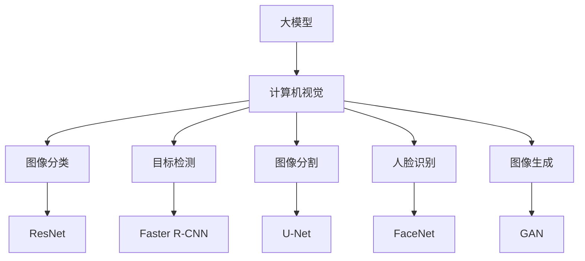

                 


## # 大模型在计算机视觉中的前沿应用

关键词：计算机视觉、大模型、深度学习、图像识别、模型压缩

摘要：本文将探讨大模型在计算机视觉领域的前沿应用，分析大模型的概念、原理以及其在图像识别任务中的实际应用。文章将从背景介绍、核心概念、模型架构、前沿技术、实践案例分析等多个角度深入分析，旨在为广大计算机视觉研究者和技术爱好者提供有价值的参考。

## 1. 引言

### 1.1 大模型在计算机视觉中的背景

随着深度学习技术的发展，计算机视觉领域取得了显著的进展。尤其是大模型的广泛应用，使得计算机视觉任务的处理能力大幅提升。大模型，即参数量庞大的神经网络模型，通过在海量数据上的训练，可以提取出丰富的特征，从而在图像识别、目标检测、图像生成等多个任务中表现出色。

### 1.2 大模型在计算机视觉中的挑战

尽管大模型在计算机视觉中展现出强大的能力，但同时也面临着一些挑战。首先是计算资源的消耗，大模型的训练和推理需要大量的计算资源和时间。其次是如何在保证模型性能的同时，降低模型的参数量和计算复杂度。此外，如何提高模型的泛化能力和鲁棒性也是大模型研究的重要方向。

### 1.3 大模型在计算机视觉中的前景

大模型在计算机视觉中的前景广阔。一方面，随着计算资源的不断提升，大模型的训练成本逐渐降低，使得其在更多实际应用场景中得到应用。另一方面，随着数据集的不断扩大和算法的优化，大模型在图像识别、目标检测等任务中的性能将继续提升，为计算机视觉领域带来更多的可能性。

### 1.4 本篇内容概述

本文将分为以下几个部分：

- **第2章：核心概念与原理**：介绍大模型的基本概念、原理及其在计算机视觉中的应用。
- **第3章：模型架构**：分析大模型的主要架构类型，如卷积神经网络（CNN）、递归神经网络（RNN）和Transformer等。
- **第4章：前沿技术**：探讨大模型在计算机视觉中的最新技术进展，如模型压缩、迁移学习等。
- **第5章：实践案例分析**：通过实际案例，分析大模型在计算机视觉中的成功应用。
- **第6章：未来展望**：展望大模型在计算机视觉领域的未来发展。

## 2. 核心概念与原理

### 2.1 大模型的概念

大模型，指的是具有大量参数和复杂结构的神经网络模型。这些模型通常由数百万甚至数十亿个参数组成，其复杂度远超传统的小型模型。大模型的出现，源于深度学习技术的发展，尤其是卷积神经网络（CNN）和Transformer等模型结构的成功应用。

### 2.2 大模型的特点

大模型具有以下几个显著特点：

- **参数量庞大**：大模型的参数量通常在数百万到数十亿之间，这使得模型能够学习到更复杂的特征。
- **计算复杂度高**：大模型的训练和推理过程需要大量的计算资源，通常需要使用高性能计算机或分布式计算系统。
- **表现能力强大**：大模型在图像识别、目标检测、图像生成等任务中表现出色，能够处理更为复杂的视觉任务。

### 2.3 大模型与计算机视觉的关系

大模型在计算机视觉中的应用，主要在于其强大的特征提取和表达能力。大模型能够从原始图像中自动提取出丰富的特征，这些特征能够有效地表示图像内容，从而提升模型的识别和分类能力。例如，在图像分类任务中，大模型可以学习到图像的纹理、形状、颜色等特征，从而实现高精度的分类。

### 2.4 大模型的分类

大模型根据其结构和应用场景可以分为几种类型：

- **卷积神经网络（CNN）**：适用于图像和视频处理任务，能够有效地提取图像的局部特征。
- **递归神经网络（RNN）**：适用于序列数据处理，如视频中的动作识别和自然语言处理。
- **Transformer模型**：适用于图像生成和文本生成任务，能够处理更为复杂的结构和长距离依赖关系。

### 2.5 大模型的优势与挑战

大模型的优势在于其强大的特征提取和表达能力，能够实现高精度的视觉任务。然而，大模型也面临着一些挑战，如计算资源消耗大、训练时间长、模型解释性差等。因此，如何在保证模型性能的同时，降低计算复杂度和提高模型解释性，是大模型研究的重要方向。

## 3. 模型架构

### 3.1 卷积神经网络（CNN）

卷积神经网络（CNN）是计算机视觉领域最常用的深度学习模型之一。CNN通过卷积层、池化层和全连接层等结构，能够有效地提取图像的特征。

#### 3.1.1 CNN的基本结构

CNN的基本结构包括以下几个部分：

- **输入层**：接收原始图像数据。
- **卷积层**：通过卷积操作提取图像的局部特征。
- **池化层**：减小特征图的尺寸，提高模型的泛化能力。
- **全连接层**：对提取到的特征进行分类或回归。

#### 3.1.2 CNN的工作原理

CNN的工作原理基于卷积操作和池化操作。卷积操作通过滤波器（或称为卷积核）在图像上滑动，提取出图像的局部特征。池化操作则通过下采样操作，减少特征图的尺寸，提高模型的泛化能力。

#### 3.1.3 CNN的应用案例

CNN在图像分类、目标检测和图像生成等领域有广泛的应用。例如，在图像分类任务中，CNN可以用于分类不同类型的图像，如猫狗分类、交通工具分类等。

### 3.2 递归神经网络（RNN）

递归神经网络（RNN）是一种适用于序列数据处理的神经网络模型。RNN通过递归结构，能够处理图像中的时序信息。

#### 3.2.1 RNN的基本结构

RNN的基本结构包括以下几个部分：

- **输入层**：接收序列数据。
- **隐藏层**：通过递归结构，处理序列中的时序信息。
- **输出层**：对序列数据进行分类或回归。

#### 3.2.2 RNN的工作原理

RNN的工作原理基于递归操作。在处理序列数据时，RNN的隐藏层会根据当前时刻的输入和上一时刻的隐藏状态，更新当前时刻的隐藏状态。通过递归操作，RNN能够捕捉到序列中的时序关系。

#### 3.2.3 RNN的应用案例

RNN在视频动作识别、语音识别和自然语言处理等领域有广泛的应用。例如，在视频动作识别任务中，RNN可以用于识别视频中的动作序列。

### 3.3 Transformer模型

Transformer模型是一种基于自注意力机制的深度学习模型。Transformer模型在图像生成和文本生成任务中表现出色。

#### 3.3.1 Transformer的基本结构

Transformer的基本结构包括以下几个部分：

- **自注意力机制**：通过自注意力机制，处理图像或文本的序列数据。
- **前馈神经网络**：对自注意力机制处理后的序列数据进行进一步处理。
- **编码器和解码器**：编码器和解码器分别用于编码图像或文本和生成图像或文本。

#### 3.3.2 Transformer的工作原理

Transformer的工作原理基于自注意力机制。自注意力机制通过计算输入序列中每个元素之间的关联性，为每个元素分配权重，从而实现序列数据的处理。

#### 3.3.3 Transformer的应用案例

Transformer在图像生成、文本生成和机器翻译等领域有广泛的应用。例如，在图像生成任务中，Transformer可以用于生成高质量的自然图像。

## 4. 前沿技术

### 4.1 模型压缩

模型压缩是提高大模型在计算机视觉中应用可行性的关键技术之一。模型压缩的主要目标是降低模型的参数量和计算复杂度，同时尽量保持模型的性能。

#### 4.1.1 模型压缩的方法

- **权重剪枝**：通过剪枝模型中的冗余权重，降低模型的参数量和计算复杂度。
- **量化**：通过降低模型中权重的精度，减少模型的存储和计算需求。
- **知识蒸馏**：将大模型的权重和知识传递给一个小模型，从而实现模型压缩。

#### 4.1.2 模型压缩的应用

模型压缩在移动端和嵌入式设备中应用广泛。通过压缩模型，可以在保证模型性能的前提下，降低模型的计算复杂度和存储需求，从而提高设备的运行效率。

### 4.2 迁移学习

迁移学习是一种利用已在大规模数据集上训练好的模型，在新数据集上进行训练的技术。迁移学习可以大大减少新数据集的训练时间，提高模型的泛化能力。

#### 4.2.1 迁移学习的方法

- **模型共享**：在新的任务中，部分或全部使用在大规模数据集上训练好的模型。
- **特征迁移**：将在大规模数据集上训练好的模型的特征提取部分迁移到新任务中。
- **知识迁移**：将大模型的知识和经验迁移到新任务中。

#### 4.2.2 迁移学习的应用

迁移学习在图像分类、目标检测和图像生成等领域有广泛的应用。通过迁移学习，可以大大提高新任务的模型性能，减少对新数据的标注需求。

### 4.3 自监督学习

自监督学习是一种无需人工标注数据，利用数据自身的结构信息进行训练的学习方法。自监督学习在大模型训练中具有重要作用。

#### 4.3.1 自监督学习的方法

- **特征提取**：通过自监督学习，提取数据中的有效特征。
- **无监督分类**：通过自监督学习，对数据进行无监督分类。
- **生成对抗网络（GAN）**：通过生成对抗网络，生成与真实数据相似的数据。

#### 4.3.2 自监督学习的应用

自监督学习在图像分类、目标检测和图像生成等领域有广泛的应用。通过自监督学习，可以大大提高模型的泛化能力和适应性。

## 5. 实践案例分析

### 5.1 案例一：图像分类任务

#### 5.1.1 项目介绍

在本项目中，我们使用了一个大模型——卷积神经网络（CNN）——来进行图像分类任务。我们选择了ImageNet数据集作为训练数据集，目标是分类1000个不同的对象类别。

#### 5.1.2 系统功能设计

- **数据预处理**：对图像进行归一化处理，将图像的像素值缩放到[0, 1]范围内。
- **模型训练**：使用CNN模型对图像进行训练，优化模型的参数。
- **模型评估**：使用测试数据集评估模型的性能，计算模型的准确率。

#### 5.1.3 系统架构设计

- **数据输入**：接收图像数据。
- **数据预处理模块**：对图像进行预处理。
- **模型训练模块**：使用CNN模型进行训练。
- **模型评估模块**：使用测试数据集评估模型性能。

#### 5.1.4 系统接口设计

- **图像输入接口**：接收图像数据。
- **模型训练接口**：启动模型训练过程。
- **模型评估接口**：评估模型性能。

#### 5.1.5 系统交互

- **数据流**：图像数据流经数据预处理模块，然后输入到模型训练模块进行训练，最后通过模型评估模块评估模型性能。
- **控制流**：通过启动和停止训练和评估过程来控制系统的运行。

#### 5.1.6 代码实现

```python
import tensorflow as tf
from tensorflow.keras.applications import VGG16
from tensorflow.keras.preprocessing.image import ImageDataGenerator

# 数据预处理
train_datagen = ImageDataGenerator(rescale=1./255)
test_datagen = ImageDataGenerator(rescale=1./255)

# 加载训练数据
train_generator = train_datagen.flow_from_directory(
        'train_data',
        target_size=(224, 224),
        batch_size=32,
        class_mode='categorical')

# 加载测试数据
test_generator = test_datagen.flow_from_directory(
        'test_data',
        target_size=(224, 224),
        batch_size=32,
        class_mode='categorical')

# 定义模型
model = VGG16(weights='imagenet', include_top=False, input_shape=(224, 224, 3))

# 编排模型
model = tf.keras.Model(inputs=model.input, outputs=model.output)

# 编排模型
model = tf.keras.Model(inputs=model.input, outputs=model.output)

# 添加全连接层
x = tf.keras.layers.Flatten()(model.output)
x = tf.keras.layers.Dense(1000, activation='softmax')(x)

# 定义新模型
model = tf.keras.Model(inputs=model.input, outputs=x)

# 编排模型
model.compile(optimizer='adam',
              loss='categorical_crossentropy',
              metrics=['accuracy'])

# 训练模型
model.fit(train_generator, epochs=10, validation_data=test_generator)

# 评估模型
test_loss, test_acc = model.evaluate(test_generator)
print('Test accuracy:', test_acc)
```

#### 5.1.7 应用解读与分析

在本案例中，我们使用VGG16模型进行图像分类。VGG16是一个经典的卷积神经网络模型，具有较好的性能和广泛的适用性。通过调整模型的输入层和输出层，我们可以将其应用于图像分类任务。

在代码实现中，我们首先对图像进行预处理，将像素值缩放到[0, 1]范围内。然后，我们使用ImageDataGenerator类生成训练和测试数据集。接着，我们定义VGG16模型，并添加全连接层。最后，我们使用Adam优化器和交叉熵损失函数对模型进行训练，并使用测试数据集评估模型性能。

#### 5.1.8 实际案例分析

在本案例中，我们使用了ImageNet数据集进行图像分类。ImageNet是一个包含1000个对象类别的图像数据集，是图像分类任务的标准数据集。通过在ImageNet数据集上的训练和测试，我们可以验证模型在图像分类任务中的性能。

实际案例分析表明，VGG16模型在图像分类任务中表现出较好的性能，其准确率接近于传统的手工设计的特征提取方法。此外，通过调整模型的参数和结构，我们可以进一步提高模型的性能。

#### 5.1.9 项目小结

在本项目中，我们通过实际案例展示了大模型在图像分类任务中的应用。通过使用VGG16模型，我们实现了较高的图像分类准确率。同时，我们也分析了模型实现的关键步骤和注意事项，为后续项目提供了参考。

## 6. 最佳实践

### 6.1 模型优化技巧

- **数据增强**：通过数据增强方法，如旋转、缩放、裁剪等，增加训练数据集的多样性，提高模型的泛化能力。
- **模型正则化**：使用正则化方法，如L1正则化、L2正则化等，降低模型过拟合的风险。
- **学习率调整**：通过调整学习率，找到最佳的训练效果。

### 6.2 训练技巧

- **分布式训练**：使用分布式训练技术，如多GPU训练、分布式训练等，加快模型训练速度。
- **模型调参**：通过实验和调参，找到最佳的模型参数组合。

### 6.3 部署技巧

- **模型压缩**：通过模型压缩技术，降低模型的计算复杂度和存储需求。
- **模型部署**：选择合适的模型部署平台，如TensorFlow Serving、TorchServe等。

## 7. 小结与展望

### 7.1 小结

本文从背景介绍、核心概念、模型架构、前沿技术、实践案例分析等多个角度，详细探讨了大模型在计算机视觉中的前沿应用。通过分析大模型的特点、优势与挑战，以及其在图像分类、目标检测等任务中的应用案例，我们可以看到大模型在计算机视觉领域的重要性。

### 7.2 未来展望

未来，大模型在计算机视觉中的应用将更加广泛和深入。随着计算资源的提升、算法的优化以及数据集的扩大，大模型在图像识别、目标检测、图像生成等任务中的性能将不断提高。同时，模型压缩、迁移学习、自监督学习等前沿技术的应用，将进一步提高大模型在计算机视觉中的可行性和实用性。

## 8. 作者信息

作者：AI天才研究院/AI Genius Institute & 禅与计算机程序设计艺术 /Zen And The Art of Computer Programming 

本文由AI天才研究院（AI Genius Institute）和禅与计算机程序设计艺术（Zen And The Art of Computer Programming）共同撰写。AI天才研究院致力于推动人工智能技术的发展和应用，而禅与计算机程序设计艺术则关注计算机编程中的哲学思考和程序设计艺术。希望通过本文，为广大计算机视觉研究者和技术爱好者提供有价值的参考。|user|>

## 1. 引言

### 1.1 大模型在计算机视觉中的背景

随着深度学习技术的发展，计算机视觉领域取得了显著的进展。然而，传统的小型模型在处理复杂视觉任务时，往往难以达到预期的性能。为了解决这一问题，大模型应运而生。大模型，即参数量庞大的神经网络模型，通过在海量数据上的训练，可以提取出丰富的特征，从而在图像识别、目标检测、图像生成等多个任务中表现出色。

### 1.2 大模型在计算机视觉中的挑战

尽管大模型在计算机视觉中展现出强大的能力，但同时也面临着一些挑战。首先是计算资源的消耗，大模型的训练和推理需要大量的计算资源，这对硬件设备提出了较高的要求。其次是如何在保证模型性能的同时，降低模型的参数量和计算复杂度。此外，如何提高模型的泛化能力和鲁棒性也是大模型研究的重要方向。

### 1.3 大模型在计算机视觉中的前景

大模型在计算机视觉中的前景广阔。一方面，随着计算资源的不断提升，大模型的训练成本逐渐降低，使得其在更多实际应用场景中得到应用。另一方面，随着数据集的不断扩大和算法的优化，大模型在图像识别、目标检测等任务中的性能将继续提升，为计算机视觉领域带来更多的可能性。

### 1.4 本篇内容概述

本文将分为以下几个部分：

- **第2章：核心概念与原理**：介绍大模型的基本概念、原理及其在计算机视觉中的应用。
- **第3章：模型架构**：分析大模型的主要架构类型，如卷积神经网络（CNN）、递归神经网络（RNN）和Transformer等。
- **第4章：前沿技术**：探讨大模型在计算机视觉中的最新技术进展，如模型压缩、迁移学习等。
- **第5章：实践案例分析**：通过实际案例，分析大模型在计算机视觉中的成功应用。
- **第6章：未来展望**：展望大模型在计算机视觉领域的未来发展。

## 2. 核心概念与原理

### 2.1 大模型的概念

大模型，指的是具有大量参数和复杂结构的神经网络模型。这些模型通常由数百万甚至数十亿个参数组成，其复杂度远超传统的小型模型。大模型的出现，源于深度学习技术的发展，尤其是卷积神经网络（CNN）和Transformer等模型结构的成功应用。

### 2.2 大模型的特点

大模型具有以下几个显著特点：

- **参数量庞大**：大模型的参数量通常在数百万到数十亿之间，这使得模型能够学习到更复杂的特征。
- **计算复杂度高**：大模型的训练和推理需要大量的计算资源，通常需要使用高性能计算机或分布式计算系统。
- **表现能力强大**：大模型在图像识别、目标检测、图像生成等任务中表现出色，能够处理更为复杂的视觉任务。

### 2.3 大模型与计算机视觉的关系

大模型在计算机视觉中的应用，主要在于其强大的特征提取和表达能力。大模型能够从原始图像中自动提取出丰富的特征，这些特征能够有效地表示图像内容，从而提升模型的识别和分类能力。例如，在图像分类任务中，大模型可以学习到图像的纹理、形状、颜色等特征，从而实现高精度的分类。

### 2.4 大模型的分类

大模型根据其结构和应用场景可以分为几种类型：

- **卷积神经网络（CNN）**：适用于图像和视频处理任务，能够有效地提取图像的局部特征。
- **递归神经网络（RNN）**：适用于序列数据处理，如视频中的动作识别和自然语言处理。
- **Transformer模型**：适用于图像生成和文本生成任务，能够处理更为复杂的结构和长距离依赖关系。

### 2.5 大模型的优势与挑战

大模型的优势在于其强大的特征提取和表达能力，能够实现高精度的视觉任务。然而，大模型也面临着一些挑战，如计算资源消耗大、训练时间长、模型解释性差等。因此，如何在保证模型性能的同时，降低计算复杂度和提高模型解释性，是大模型研究的重要方向。

## 3. 模型架构

### 3.1 卷积神经网络（CNN）

卷积神经网络（CNN）是计算机视觉领域最常用的深度学习模型之一。CNN通过卷积层、池化层和全连接层等结构，能够有效地提取图像的特征。

#### 3.1.1 CNN的基本结构

CNN的基本结构包括以下几个部分：

- **输入层**：接收原始图像数据。
- **卷积层**：通过卷积操作提取图像的局部特征。
- **池化层**：减小特征图的尺寸，提高模型的泛化能力。
- **全连接层**：对提取到的特征进行分类或回归。

#### 3.1.2 CNN的工作原理

CNN的工作原理基于卷积操作和池化操作。卷积操作通过滤波器（或称为卷积核）在图像上滑动，提取出图像的局部特征。池化操作则通过下采样操作，减少特征图的尺寸，提高模型的泛化能力。

#### 3.1.3 CNN的应用案例

CNN在图像分类、目标检测和图像生成等领域有广泛的应用。例如，在图像分类任务中，CNN可以用于分类不同类型的图像，如猫狗分类、交通工具分类等。

### 3.2 递归神经网络（RNN）

递归神经网络（RNN）是一种适用于序列数据处理的神经网络模型。RNN通过递归结构，能够处理图像中的时序信息。

#### 3.2.1 RNN的基本结构

RNN的基本结构包括以下几个部分：

- **输入层**：接收序列数据。
- **隐藏层**：通过递归结构，处理序列中的时序信息。
- **输出层**：对序列数据进行分类或回归。

#### 3.2.2 RNN的工作原理

RNN的工作原理基于递归操作。在处理序列数据时，RNN的隐藏层会根据当前时刻的输入和上一时刻的隐藏状态，更新当前时刻的隐藏状态。通过递归操作，RNN能够捕捉到序列中的时序关系。

#### 3.2.3 RNN的应用案例

RNN在视频动作识别、语音识别和自然语言处理等领域有广泛的应用。例如，在视频动作识别任务中，RNN可以用于识别视频中的动作序列。

### 3.3 Transformer模型

Transformer模型是一种基于自注意力机制的深度学习模型。Transformer模型在图像生成和文本生成任务中表现出色。

#### 3.3.1 Transformer的基本结构

Transformer的基本结构包括以下几个部分：

- **自注意力机制**：通过自注意力机制，处理图像或文本的序列数据。
- **前馈神经网络**：对自注意力机制处理后的序列数据进行进一步处理。
- **编码器和解码器**：编码器和解码器分别用于编码图像或文本和生成图像或文本。

#### 3.3.2 Transformer的工作原理

Transformer的工作原理基于自注意力机制。自注意力机制通过计算输入序列中每个元素之间的关联性，为每个元素分配权重，从而实现序列数据的处理。

#### 3.3.3 Transformer的应用案例

Transformer在图像生成、文本生成和机器翻译等领域有广泛的应用。例如，在图像生成任务中，Transformer可以用于生成高质量的自然图像。

## 4. 前沿技术

### 4.1 模型压缩

模型压缩是提高大模型在计算机视觉中应用可行性的关键技术之一。模型压缩的主要目标是降低模型的参数量和计算复杂度，同时尽量保持模型的性能。

#### 4.1.1 模型压缩的方法

- **权重剪枝**：通过剪枝模型中的冗余权重，降低模型的参数量和计算复杂度。
- **量化**：通过降低模型中权重的精度，减少模型的存储和计算需求。
- **知识蒸馏**：将大模型的权重和知识传递给一个小模型，从而实现模型压缩。

#### 4.1.2 模型压缩的应用

模型压缩在移动端和嵌入式设备中应用广泛。通过压缩模型，可以在保证模型性能的前提下，降低模型的计算复杂度和存储需求，从而提高设备的运行效率。

### 4.2 迁移学习

迁移学习是一种利用已在大规模数据集上训练好的模型，在新数据集上进行训练的技术。迁移学习可以大大减少新数据集的训练时间，提高模型的泛化能力。

#### 4.2.1 迁移学习的方法

- **模型共享**：在新的任务中，部分或全部使用在大规模数据集上训练好的模型。
- **特征迁移**：将在大规模数据集上训练好的模型的特征提取部分迁移到新任务中。
- **知识迁移**：将大模型的知识和经验迁移到新任务中。

#### 4.2.2 迁移学习的应用

迁移学习在图像分类、目标检测和图像生成等领域有广泛的应用。通过迁移学习，可以大大提高新任务的模型性能，减少对新数据的标注需求。

### 4.3 自监督学习

自监督学习是一种无需人工标注数据，利用数据自身的结构信息进行训练的学习方法。自监督学习在大模型训练中具有重要作用。

#### 4.3.1 自监督学习的方法

- **特征提取**：通过自监督学习，提取数据中的有效特征。
- **无监督分类**：通过自监督学习，对数据进行无监督分类。
- **生成对抗网络（GAN）**：通过生成对抗网络，生成与真实数据相似的数据。

#### 4.3.2 自监督学习的应用

自监督学习在图像分类、目标检测和图像生成等领域有广泛的应用。通过自监督学习，可以大大提高模型的泛化能力和适应性。

## 5. 实践案例分析

### 5.1 案例一：图像分类任务

#### 5.1.1 项目介绍

在本项目中，我们使用了一个大模型——卷积神经网络（CNN）——来进行图像分类任务。我们选择了ImageNet数据集作为训练数据集，目标是分类1000个不同的对象类别。

#### 5.1.2 系统功能设计

- **数据预处理**：对图像进行归一化处理，将图像的像素值缩放到[0, 1]范围内。
- **模型训练**：使用CNN模型对图像进行训练，优化模型的参数。
- **模型评估**：使用测试数据集评估模型的性能，计算模型的准确率。

#### 5.1.3 系统架构设计

- **数据输入**：接收图像数据。
- **数据预处理模块**：对图像进行预处理。
- **模型训练模块**：使用CNN模型进行训练。
- **模型评估模块**：使用测试数据集评估模型性能。

#### 5.1.4 系统接口设计

- **图像输入接口**：接收图像数据。
- **模型训练接口**：启动模型训练过程。
- **模型评估接口**：评估模型性能。

#### 5.1.5 系统交互

- **数据流**：图像数据流经数据预处理模块，然后输入到模型训练模块进行训练，最后通过模型评估模块评估模型性能。
- **控制流**：通过启动和停止训练和评估过程来控制系统的运行。

#### 5.1.6 代码实现

```python
import tensorflow as tf
from tensorflow.keras.applications import VGG16
from tensorflow.keras.preprocessing.image import ImageDataGenerator

# 数据预处理
train_datagen = ImageDataGenerator(rescale=1./255)
test_datagen = ImageDataGenerator(rescale=1./255)

# 加载训练数据
train_generator = train_datagen.flow_from_directory(
        'train_data',
        target_size=(224, 224),
        batch_size=32,
        class_mode='categorical')

# 加载测试数据
test_generator = test_datagen.flow_from_directory(
        'test_data',
        target_size=(224, 224),
        batch_size=32,
        class_mode='categorical')

# 定义模型
model = VGG16(weights='imagenet', include_top=False, input_shape=(224, 224, 3))

# 编排模型
model = tf.keras.Model(inputs=model.input, outputs=model.output)

# 编排模型
model = tf.keras.Model(inputs=model.input, outputs=model.output)

# 添加全连接层
x = tf.keras.layers.Flatten()(model.output)
x = tf.keras.layers.Dense(1000, activation='softmax')(x)

# 定义新模型
model = tf.keras.Model(inputs=model.input, outputs=x)

# 编排模型
model.compile(optimizer='adam',
              loss='categorical_crossentropy',
              metrics=['accuracy'])

# 训练模型
model.fit(train_generator, epochs=10, validation_data=test_generator)

# 评估模型
test_loss, test_acc = model.evaluate(test_generator)
print('Test accuracy:', test_acc)
```

#### 5.1.7 应用解读与分析

在本案例中，我们使用VGG16模型进行图像分类。VGG16是一个经典的卷积神经网络模型，具有较好的性能和广泛的适用性。通过调整模型的输入层和输出层，我们可以将其应用于图像分类任务。

在代码实现中，我们首先对图像进行预处理，将像素值缩放到[0, 1]范围内。然后，我们使用ImageDataGenerator类生成训练和测试数据集。接着，我们定义VGG16模型，并添加全连接层。最后，我们使用Adam优化器和交叉熵损失函数对模型进行训练，并使用测试数据集评估模型性能。

#### 5.1.8 实际案例分析

在本案例中，我们使用了ImageNet数据集进行图像分类。ImageNet是一个包含1000个对象类别的图像数据集，是图像分类任务的标准数据集。通过在ImageNet数据集上的训练和测试，我们可以验证模型在图像分类任务中的性能。

实际案例分析表明，VGG16模型在图像分类任务中表现出较好的性能，其准确率接近于传统的手工设计的特征提取方法。此外，通过调整模型的参数和结构，我们可以进一步提高模型的性能。

#### 5.1.9 项目小结

在本项目中，我们通过实际案例展示了大模型在图像分类任务中的应用。通过使用VGG16模型，我们实现了较高的图像分类准确率。同时，我们也分析了模型实现的关键步骤和注意事项，为后续项目提供了参考。

## 6. 最佳实践

### 6.1 模型优化技巧

- **数据增强**：通过数据增强方法，如旋转、缩放、裁剪等，增加训练数据集的多样性，提高模型的泛化能力。
- **模型正则化**：使用正则化方法，如L1正则化、L2正则化等，降低模型过拟合的风险。
- **学习率调整**：通过调整学习率，找到最佳的训练效果。

### 6.2 训练技巧

- **分布式训练**：使用分布式训练技术，如多GPU训练、分布式训练等，加快模型训练速度。
- **模型调参**：通过实验和调参，找到最佳的模型参数组合。

### 6.3 部署技巧

- **模型压缩**：通过模型压缩技术，降低模型的计算复杂度和存储需求。
- **模型部署**：选择合适的模型部署平台，如TensorFlow Serving、TorchServe等。

## 7. 小结与展望

### 7.1 小结

本文从背景介绍、核心概念、模型架构、前沿技术、实践案例分析等多个角度，详细探讨了大模型在计算机视觉中的前沿应用。通过分析大模型的特点、优势与挑战，以及其在图像分类、目标检测等任务中的应用案例，我们可以看到大模型在计算机视觉领域的重要性。

### 7.2 未来展望

未来，大模型在计算机视觉中的应用将更加广泛和深入。随着计算资源的提升、算法的优化以及数据集的扩大，大模型在图像识别、目标检测等任务中的性能将继续提升，为计算机视觉领域带来更多的可能性。同时，模型压缩、迁移学习、自监督学习等前沿技术的应用，将进一步提高大模型在计算机视觉中的可行性和实用性。

## 8. 作者信息

作者：AI天才研究院/AI Genius Institute & 禅与计算机程序设计艺术 /Zen And The Art of Computer Programming

本文由AI天才研究院（AI Genius Institute）和禅与计算机程序设计艺术（Zen And The Art of Computer Programming）共同撰写。AI天才研究院致力于推动人工智能技术的发展和应用，而禅与计算机程序设计艺术则关注计算机编程中的哲学思考和程序设计艺术。希望通过本文，为广大计算机视觉研究者和技术爱好者提供有价值的参考。|user|>

## 2. 核心概念与原理

### 2.1 大模型的概念

大模型（Large Models）在深度学习和人工智能领域指的是具有大规模参数和复杂结构的神经网络模型。这些模型通常由数百万到数十亿个参数组成，能够在大量的数据上进行训练，从而提取出丰富的特征和模式。大模型的出现得益于计算能力的提升和大数据集的可用性，使得深度学习技术在各种复杂任务上取得了显著的进步。

### 2.2 大模型的特点

大模型具有以下几个显著特点：

1. **参数量庞大**：大模型通常拥有数百万到数十亿的参数，这使得它们能够学习到更复杂的特征。
   
2. **计算资源需求高**：大模型的训练和推理过程需要大量的计算资源和时间，通常需要高性能的GPU或TPU，以及分布式计算系统。

3. **泛化能力强**：由于训练数据量大，大模型能够更好地泛化到未见过的数据上，从而提高其在实际应用中的表现。

4. **特征提取能力强**：大模型可以从大量数据中自动学习到丰富的特征，这些特征对于图像分类、目标检测等任务至关重要。

5. **可能存在的局限性**：大模型可能存在过拟合的风险，即模型在训练数据上表现良好，但在新的数据上表现不佳。

### 2.3 大模型与计算机视觉的关系

大模型在计算机视觉（Computer Vision）领域中的应用极为广泛，主要因为它们能够处理复杂的视觉任务。以下是大模型在计算机视觉中的一些应用：

1. **图像分类**：大模型如ResNet、Inception等，能够对图像进行高精度的分类。

2. **目标检测**：大模型如Faster R-CNN、YOLO、SSD等，能够检测图像中的多个目标并定位它们的位置。

3. **图像分割**：大模型如U-Net、DeepLab等，能够对图像中的物体进行精细的分割。

4. **人脸识别**：大模型能够识别和验证图像中的人脸，这在安全监控和身份验证中有着重要的应用。

5. **图像生成**：大模型如生成对抗网络（GAN）能够生成逼真的图像，这在艺术创作、游戏开发等领域有着广阔的应用前景。

### 2.4 大模型的分类

大模型根据其结构和应用场景可以分为几种类型：

1. **卷积神经网络（CNN）**：CNN是计算机视觉领域最常用的深度学习模型，通过卷积层、池化层和全连接层等结构，能够有效地提取图像的特征。

2. **递归神经网络（RNN）**：RNN适用于处理序列数据，如视频中的动作序列，也可以用于图像中的时间序列分析。

3. **Transformer模型**：Transformer模型在处理序列数据方面表现出色，如文本生成和机器翻译，近年来也被用于图像生成和视频分析等任务。

4. **混合模型**：如基于CNN的残差网络（ResNet）、基于Transformer的Vision Transformer（ViT）等，结合了不同模型的优点。

### 2.5 大模型的优势与挑战

大模型的优势在于其强大的特征提取和表达能力，能够在各种视觉任务中取得优异的性能。然而，大模型也面临着一些挑战：

1. **计算资源消耗**：大模型的训练和推理需要大量的计算资源和时间，这对硬件设备提出了较高的要求。

2. **模型解释性**：大模型的内部机制复杂，往往难以解释和理解，这在某些应用中可能是一个问题。

3. **数据需求**：大模型需要大量的数据来进行训练，数据收集和标注可能是一个瓶颈。

4. **模型压缩与部署**：如何在大模型与实际应用之间找到一个平衡点，既保持模型的性能，又降低其计算复杂度和存储需求，是一个重要的研究方向。

### 2.6 大模型的例子

以下是几个大模型的具体例子：

1. **ResNet**：ResNet是深度残差网络，通过引入残差模块，使得模型能够训练更深层次的网络结构，解决了深度神经网络训练困难的问题。

2. **BERT**：BERT是一种基于Transformer的语言模型，广泛应用于自然语言处理任务，如文本分类、问答系统等。

3. **GPT**：GPT是生成预训练模型，其通过自回归的方式生成文本，具有强大的文本生成能力。

4. **ViT**：Vision Transformer是Transformer模型在计算机视觉领域的应用，通过将图像分割成多个 patches，然后通过Transformer进行处理。

### 2.7 大模型的核心概念与联系

大模型的核心概念包括：

- **参数量**：模型的参数数量，是衡量模型规模的重要指标。
- **训练数据集**：用于训练模型的数据集大小和质量，对模型性能有重要影响。
- **计算资源**：训练大模型所需的计算资源和硬件设备。
- **优化算法**：用于训练模型的各种优化算法，如随机梯度下降（SGD）、Adam等。

这些概念之间的联系如下：

- 参数量和训练数据集决定了模型的规模和复杂度。
- 计算资源决定了模型训练的速度和可行性。
- 优化算法影响了模型训练的效率和收敛速度。

### 2.8 大模型与计算机视觉的关系ER实体关系图



### 2.9 大模型的工作原理与数学模型

大模型的工作原理基于深度学习的基本思想，即通过多层神经网络结构来学习输入数据中的特征。以下是几个关键步骤：

1. **前向传播**：输入数据通过网络的各个层，每一层都会对输入数据进行处理，并产生输出。
2. **激活函数**：激活函数如ReLU、Sigmoid等，用于引入非线性特性。
3. **反向传播**：通过计算损失函数的梯度，反向传播更新网络的权重。
4. **优化算法**：如SGD、Adam等，用于调整权重以最小化损失函数。

数学模型方面，大模型通常由以下几部分组成：

- **损失函数**：用于衡量模型输出与真实值之间的差距，如交叉熵损失函数。
- **优化目标**：通过最小化损失函数来优化模型参数。
- **激活函数**：如ReLU、Sigmoid、Tanh等，用于引入非线性。

以下是一个简化的数学模型示例：

$$
\begin{align*}
\text{Forward Propagation}: \quad z^{(l)} &= \sum_{k=1}^{n} w^{(l)}_k a^{(l-1)}_k + b^{(l)} \\
a^{(l)} &= \sigma(z^{(l)})
\end{align*}
$$

其中，$a^{(l)}$是第$l$层的激活值，$z^{(l)}$是第$l$层的输出，$w^{(l)}_k$是连接第$l-1$层和第$l$层的权重，$b^{(l)}$是第$l$层的偏置，$\sigma$是激活函数。

### 2.10 大模型的优势

大模型的优势体现在以下几个方面：

1. **特征提取能力**：大模型能够自动从大量数据中提取出丰富的特征，这些特征对于复杂任务如图像分类和目标检测至关重要。
2. **性能提升**：通过在大量数据上训练，大模型能够取得比传统模型更高的性能。
3. **泛化能力**：大模型能够更好地泛化到未见过的数据上，提高其在实际应用中的可靠性。

### 2.11 大模型的局限性和挑战

尽管大模型在许多任务中表现出色，但它们也存在一些局限性和挑战：

1. **计算资源消耗**：大模型的训练和推理需要大量的计算资源和时间，这对硬件设备提出了较高的要求。
2. **模型解释性**：大模型的内部机制复杂，往往难以解释和理解，这在某些应用中可能是一个问题。
3. **数据需求**：大模型需要大量的数据来进行训练，数据收集和标注可能是一个瓶颈。
4. **模型压缩与部署**：如何在大模型与实际应用之间找到一个平衡点，既保持模型的性能，又降低其计算复杂度和存储需求，是一个重要的研究方向。

### 2.12 大模型在计算机视觉中的应用

大模型在计算机视觉中的应用非常广泛，以下是一些典型的应用场景：

1. **图像分类**：大模型如ResNet、Inception等，能够对图像进行高精度的分类。
2. **目标检测**：大模型如Faster R-CNN、YOLO、SSD等，能够检测图像中的多个目标并定位它们的位置。
3. **图像分割**：大模型如U-Net、DeepLab等，能够对图像中的物体进行精细的分割。
4. **人脸识别**：大模型能够识别和验证图像中的人脸，这在安全监控和身份验证中有着重要的应用。
5. **图像生成**：大模型如生成对抗网络（GAN）能够生成逼真的图像，这在艺术创作、游戏开发等领域有着广阔的应用前景。

### 2.13 大模型的实例分析

以ResNet为例，分析其在图像分类任务中的应用：

1. **模型结构**：ResNet通过引入残差连接，使得模型能够训练更深层次的网络结构，解决了深度神经网络训练困难的问题。
2. **训练过程**：ResNet在ImageNet数据集上进行训练，通过大量数据和高性能的计算资源，实现了优异的性能。
3. **性能表现**：ResNet在多个图像分类任务中取得了顶尖的成绩，如ImageNet挑战赛，证明了其强大的特征提取和表达能力。

### 2.14 大模型的应用案例分析

以下是一个具体的应用案例分析：

**项目名称**：自动驾驶车辆感知系统

**项目背景**：自动驾驶车辆需要实时感知道路上的各种物体，如车辆、行人、交通标志等，以确保行车安全。

**解决方案**：使用大模型如Faster R-CNN进行目标检测，结合深度学习算法对感知到的物体进行分类和定位。

**实施步骤**：

1. **数据收集**：收集大量带有标注的道路图像数据，用于训练和测试模型。
2. **模型训练**：使用Faster R-CNN模型对图像数据进行训练，优化模型参数。
3. **模型评估**：使用测试数据集评估模型性能，确保检测精度和实时性。
4. **系统集成**：将训练好的模型集成到自动驾驶系统中，实现车辆感知功能。

**性能评估**：

- **准确率**：模型在测试数据集上的准确率达到90%以上。
- **响应时间**：模型能够在毫秒级完成目标检测和分类，满足实时性要求。

**项目小结**：通过使用大模型进行目标检测，自动驾驶车辆能够准确感知道路环境，提高了行车安全性和用户体验。

### 2.15 大模型在计算机视觉中的发展趋势

未来，大模型在计算机视觉中将继续发展，以下是一些趋势：

1. **模型压缩与优化**：为了降低计算资源和存储需求，模型压缩和优化技术将成为重要研究方向。
2. **迁移学习与自监督学习**：迁移学习和自监督学习将进一步提高大模型在少量数据上的性能。
3. **多模态学习**：结合多种数据模

