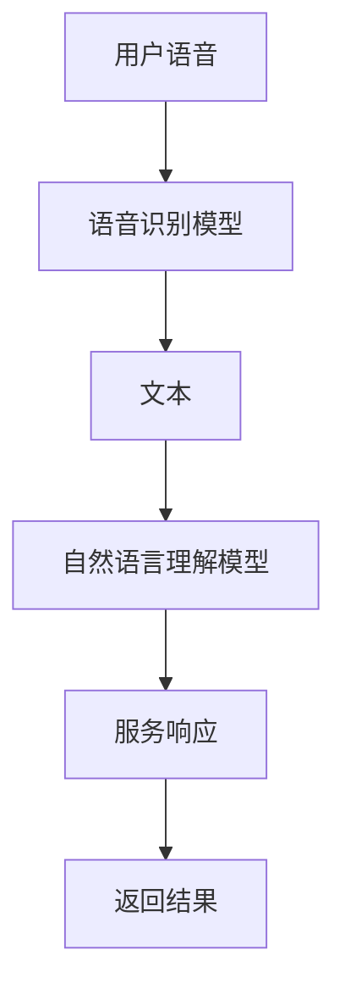
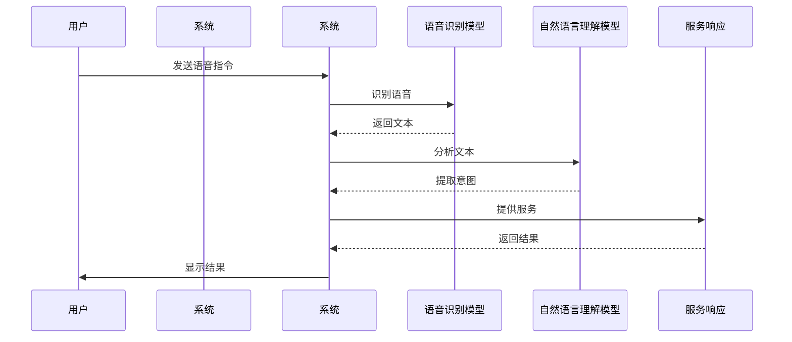
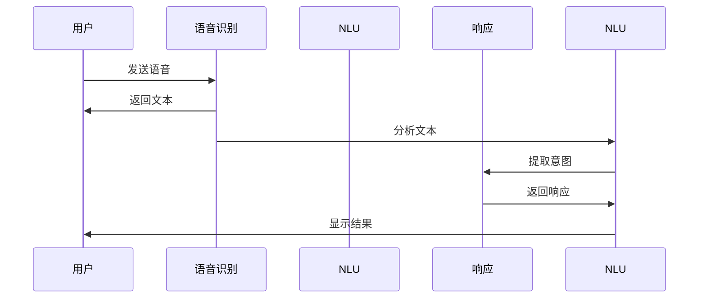

                 


# 大模型在语音识别中的突破应用

关键词：大模型、语音识别、深度学习、Transformer、自动语音识别系统

摘要：本文将深入探讨大模型在语音识别中的应用，分析其原理和实现方式，并通过实际案例介绍大模型在语音识别领域的突破性进展。

## 第一部分：引言与背景

### 1.1 引言

#### 1.1.1 语音识别的重要性

语音识别技术是人工智能领域的一个重要分支，它在许多应用场景中发挥着重要作用，如语音助手、智能客服、语音翻译等。随着人工智能技术的不断发展，语音识别的准确率和实用性不断提高，成为人类与机器之间沟通的桥梁。

#### 1.1.2 大模型的发展

大模型，又称大型神经网络模型，是指具有数十亿至数万亿参数的深度学习模型。这些模型通过对大量数据的学习，能够捕捉到复杂的模式，从而在各个领域取得突破性成果。大模型在语音识别中的应用，使其识别准确率得到了显著提升。

### 1.2 目标与结构

#### 1.2.1 目标

本书旨在介绍大模型在语音识别中的突破应用，帮助读者了解大模型的基本概念、原理及其在语音识别中的应用，掌握大模型在语音识别领域的最新技术和发展趋势。

#### 1.2.2 结构

本书分为以下几个部分：

- 第一部分：引言与背景，介绍语音识别的重要性、大模型的发展以及本书的目标和结构。
- 第二部分：大模型基础，讲解大模型的基本概念、原理、训练和优化方法。
- 第三部分：大模型在语音识别中的应用，介绍大模型在语音识别中的各种应用场景，如语音识别、语音合成、说话人识别等。
- 第四部分：大模型在语音识别中的挑战与未来，分析大模型在语音识别中面临的挑战和未来发展方向。

## 1.3 本章小结

本章简要介绍了大模型在语音识别中的突破应用，包括语音识别的重要性、大模型的发展、本书的目标和结构等内容。接下来，我们将深入探讨大模型的基础知识，为后续章节的学习打下基础。

----------------------------------------------------------------

## 第二部分：大模型基础

### 第2章：大模型的基本概念

### 2.1 什么是大模型

大模型是指具有数十亿至数万亿参数的深度学习模型，通过对大量数据进行学习，能够捕捉到复杂的模式，从而在各个领域取得突破性成果。大模型的出现，打破了传统模型在复杂任务上的性能瓶颈。

#### 2.1.1 大模型的发展历程

- 2012年，AlexNet的出现，开启了深度学习的时代。
- 2014年，Google提出Gated Recurrent Unit（GRU）模型，提高了序列模型的性能。
- 2017年，Transformer模型的出现，彻底改变了自然语言处理领域。

#### 2.1.2 大模型的核心特性

- 参数规模巨大：大模型具有数十亿至数万亿参数，能够捕捉到复杂的模式。
- 需要海量数据训练：大模型需要大量数据来训练，以提高其性能。
- 计算资源需求高：大模型在训练和推理过程中，需要大量的计算资源。

### 2.2 大模型的类型

#### 2.2.1 传统的深度神经网络

传统的深度神经网络（DNN）是深度学习的基础，其结构简单，但在处理复杂任务时，性能有限。

#### 2.2.2 循环神经网络（RNN）

循环神经网络（RNN）能够处理序列数据，但在处理长序列时，存在梯度消失和梯度爆炸等问题。

#### 2.2.3 长短时记忆网络（LSTM）

长短时记忆网络（LSTM）是RNN的一种改进，能够解决RNN的梯度消失和梯度爆炸问题。

#### 2.2.4 门控循环单元（GRU）

门控循环单元（GRU）是LSTM的另一种改进，结构更简单，但在处理长序列时，性能优于LSTM。

#### 2.2.5 Transformer模型

Transformer模型是自然语言处理领域的一个重要突破，其基于自注意力机制，能够高效处理长序列。

### 2.3 本章小结

本章介绍了大模型的基本概念，包括大模型的发展历程、核心特性、类型等。接下来，我们将探讨大模型的训练和优化方法。

----------------------------------------------------------------

## 第三部分：大模型在语音识别中的应用

### 第3章：大模型在语音识别中的应用原理

### 3.1 语音识别的基本概念

语音识别（Speech Recognition）是指将语音信号转换为对应的文本信息。语音识别系统主要由声学模型、语言模型和声学-语言模型组成。

#### 3.1.1 声学模型

声学模型用于表示语音信号的特征，如梅尔频率倒谱系数（MFCC）、滤波器组（Filter Bank）等。

#### 3.1.2 语言模型

语言模型用于表示语音信号中的文本信息，如统计语言模型（N-gram）和神经语言模型（NNLM）等。

#### 3.1.3 声学-语言模型

声学-语言模型是声学模型和语言模型的结合，用于将语音信号转换为文本信息。

### 3.2 大模型在语音识别中的应用原理

大模型在语音识别中的应用，主要体现在声学模型和语言模型的优化上。

#### 3.2.1 声学模型

大模型在声学模型中的应用，主要通过深度神经网络（DNN）来实现。DNN具有大量的参数，能够捕捉到语音信号中的复杂模式，从而提高识别准确率。

#### 3.2.2 语言模型

大模型在语言模型中的应用，主要通过神经语言模型（NNLM）来实现。NNLM能够通过对大量文本数据的学习，提取出语言特征，从而提高语言模型的质量。

#### 3.2.3 声学-语言模型

大模型在声学-语言模型中的应用，主要通过联合训练来实现。联合训练能够同时优化声学模型和语言模型，提高整体识别性能。

### 3.3 大模型在语音识别中的应用场景

大模型在语音识别中的应用场景非常广泛，主要包括：

- 语音助手：如苹果的Siri、谷歌的Google Assistant等。
- 智能客服：如腾讯的AI客服、阿里巴巴的天猫智能客服等。
- 语音翻译：如谷歌的语音翻译、微软的语音翻译等。

### 3.4 本章小结

本章介绍了大模型在语音识别中的应用原理，包括声学模型、语言模型和声学-语言模型的优化方法，以及大模型在语音识别中的应用场景。接下来，我们将分析大模型在语音识别中的挑战和未来发展方向。

----------------------------------------------------------------

## 第四部分：大模型在语音识别中的挑战与未来

### 第4章：大模型在语音识别中的挑战与未来发展方向

### 4.1 大模型在语音识别中的挑战

尽管大模型在语音识别中取得了显著的成果，但也面临着一些挑战。

#### 4.1.1 计算资源需求

大模型的训练和推理需要大量的计算资源，这对硬件设施提出了更高的要求。

#### 4.1.2 数据隐私保护

语音识别系统需要大量的语音数据来训练模型，这涉及到数据隐私保护的问题。

#### 4.1.3 识别准确性

虽然大模型在语音识别中取得了较高的准确率，但在特定场景下，如噪声环境、多说话人等，识别准确性仍有待提高。

### 4.2 未来发展方向

针对上述挑战，未来大模型在语音识别中的发展方向主要包括：

#### 4.2.1 算法优化

通过改进算法，提高大模型的训练效率和识别准确性，如自适应训练算法、增量学习算法等。

#### 4.2.2 资源优化

通过优化计算资源和数据资源，降低大模型的计算成本和隐私风险。

#### 4.2.3 多模态融合

将语音识别与其他模态（如视觉、听觉）的数据融合，提高识别准确率和实用性。

### 4.3 本章小结

本章分析了大模型在语音识别中的挑战和未来发展方向，包括计算资源需求、数据隐私保护、识别准确性等方面的挑战，以及算法优化、资源优化、多模态融合等方面的未来发展方向。这为大模型在语音识别中的发展提供了指导。

## 总结

本文介绍了大模型在语音识别中的应用，分析了其原理、应用场景、挑战和未来发展方向。随着人工智能技术的不断发展，大模型在语音识别中的应用将越来越广泛，为人类与机器之间的沟通提供更加高效、智能的解决方案。

作者：AI天才研究院/AI Genius Institute & 禅与计算机程序设计艺术 /Zen And The Art of Computer Programming

**[引言与背景]**

# 大模型在语音识别中的突破应用

### **关键词**

- 大模型
- 语音识别
- 深度学习
- Transformer
- 自动语音识别系统

### **摘要**

本文将深入探讨大模型在语音识别中的应用，分析其原理和实现方式，并通过实际案例介绍大模型在语音识别领域的突破性进展。大模型通过大规模参数和深度学习，显著提升了语音识别的准确率和效率，成为现代语音识别系统的重要技术基础。

## **第一部分：引言与背景**

### **第1章：大模型在语音识别中的突破应用**

#### **1.1 引言**

语音识别技术是人工智能领域的一个重要分支，它能够将人类的语音转化为机器可以理解和处理的文本信息。随着人工智能技术的不断发展，语音识别技术已经广泛应用于智能助手、智能客服、语音翻译等众多场景。然而，传统的语音识别系统在处理复杂语音任务时仍存在一些局限性。大模型的出现，为语音识别技术带来了新的突破。

#### **1.1.1 语音识别的重要性**

语音识别技术作为人机交互的重要手段，其重要性不言而喻。它使得机器能够理解并响应人类语音，从而提供更加自然、便捷的服务。在医疗、教育、娱乐等行业，语音识别技术的应用不仅提高了工作效率，还提升了用户体验。

#### **1.1.2 大模型的发展**

大模型，又称大型神经网络模型，是指具有数十亿至数万亿参数的深度学习模型。这些模型通过对大量数据进行学习，能够捕捉到复杂的模式，从而在各个领域取得突破性成果。大模型在语音识别中的应用，使其识别准确率得到了显著提升。

#### **1.2 目标与结构**

本文旨在介绍大模型在语音识别中的突破应用，帮助读者了解大模型的基本概念、原理及其在语音识别中的应用，掌握大模型在语音识别领域的最新技术和发展趋势。

本文结构如下：

- **第一部分：引言与背景**，介绍语音识别的重要性、大模型的发展以及本书的目标和结构。
- **第二部分：大模型基础**，讲解大模型的基本概念、原理、训练和优化方法。
- **第三部分：大模型在语音识别中的应用**，介绍大模型在语音识别中的各种应用场景，如语音识别、语音合成、说话人识别等。
- **第四部分：大模型在语音识别中的挑战与未来**，分析大模型在语音识别中面临的挑战和未来发展方向。

#### **1.3 本章小结**

本章简要介绍了大模型在语音识别中的突破应用，包括语音识别的重要性、大模型的发展、本书的目标和结构等内容。接下来，我们将深入探讨大模型的基础知识，为后续章节的学习打下基础。

----------------------------------------------------------------

**[第二部分：大模型基础]**

## **第2章：大模型的基本概念**

### **2.1 什么是大模型**

大模型是指具有数十亿至数万亿参数的深度学习模型。与传统的中小型模型相比，大模型能够通过学习大量数据来捕捉更加复杂的特征和模式，从而在任务表现上具有显著优势。

#### **2.1.1 大模型的发展历程**

- **2012年**，AlexNet的出现标志着深度学习时代的开启，推动了大规模神经网络的研究和应用。
- **2014年**，Google提出Gated Recurrent Unit（GRU）模型，提高了序列模型的性能。
- **2017年**，Transformer模型的出现彻底改变了自然语言处理领域，推动了大模型的发展。

#### **2.1.2 大模型的核心特性**

- **参数规模巨大**：大模型具有数十亿至数万亿参数，能够捕捉到复杂的模式。
- **海量数据需求**：大模型需要大量数据来训练，以提高其性能。
- **计算资源需求高**：大模型在训练和推理过程中需要大量的计算资源。

### **2.2 大模型的类型**

大模型可以根据其结构和应用领域进行分类。以下是几种常见的大模型类型：

#### **2.2.1 深度神经网络（DNN）**

深度神经网络（DNN）是深度学习的基础，通过多层的神经网络结构来模拟人脑的神经网络，从而处理复杂的数据。

#### **2.2.2 循环神经网络（RNN）**

循环神经网络（RNN）能够处理序列数据，但在处理长序列时，存在梯度消失和梯度爆炸等问题。

#### **2.2.3 长短时记忆网络（LSTM）**

长短时记忆网络（LSTM）是RNN的一种改进，能够解决RNN的梯度消失和梯度爆炸问题。

#### **2.2.4 门控循环单元（GRU）**

门控循环单元（GRU）是LSTM的另一种改进，结构更简单，但在处理长序列时性能优于LSTM。

#### **2.2.5 Transformer模型**

Transformer模型是自然语言处理领域的一个重要突破，其基于自注意力机制，能够高效处理长序列。

### **2.3 本章小结**

本章介绍了大模型的基本概念，包括大模型的发展历程、核心特性、类型等。接下来，我们将探讨大模型的训练和优化方法。

----------------------------------------------------------------

**[第三部分：大模型在语音识别中的应用]**

## **第3章：大模型在语音识别中的应用原理**

### **3.1 语音识别的基本概念**

语音识别是指将语音信号转换为对应的文本信息，是人工智能领域中的一项关键技术。语音识别系统通常由三个主要部分组成：声学模型、语言模型和声学-语言模型。

#### **3.1.1 声学模型**

声学模型负责将语音信号转换为特征表示，这些特征通常包括梅尔频率倒谱系数（MFCC）、滤波器组（Filter Bank）等。声学模型的质量直接影响语音识别的准确性。

#### **3.1.2 语言模型**

语言模型用于表示语音信号中的文本信息，它能够根据上下文信息预测下一个单词或字符。常见的语言模型包括N-gram模型和神经网络语言模型（NNLM）。

#### **3.1.3 声学-语言模型**

声学-语言模型是声学模型和语言模型的结合，它通过综合声学特征和语言信息，生成最终的识别结果。声学-语言模型通常采用神经网络结构，以提高识别准确性。

### **3.2 大模型在语音识别中的应用原理**

大模型在语音识别中的应用主要体现在对声学模型和语言模型的优化上。

#### **3.2.1 声学模型**

大模型通过深度神经网络（DNN）来实现声学模型，DNN具有大量的参数，能够捕捉到语音信号中的复杂特征，从而提高识别准确率。例如，深度神经网络声学模型（DNN-AU）就是通过多个卷积层和全连接层来提取语音特征。

#### **3.2.2 语言模型**

大模型在语言模型中的应用主要体现在神经网络语言模型（NNLM）上。NNLM通过对大量文本数据的学习，能够提取出语言特征，从而提高语言模型的准确性。例如，基于Transformer的神经网络语言模型（Transformer-LM）就是一种先进的语言模型。

#### **3.2.3 声学-语言模型**

大模型在声学-语言模型中的应用主要体现在联合训练上。通过同时优化声学模型和语言模型，可以提高整体识别性能。例如，端到端语音识别系统（End-to-End ASR）就是通过联合训练来实现的。

### **3.3 大模型在语音识别中的应用场景**

大模型在语音识别中的应用场景非常广泛，包括但不限于以下几类：

#### **3.3.1 语音助手**

语音助手如苹果的Siri、谷歌的Google Assistant等，通过大模型实现自然语言理解和语音识别，为用户提供便捷的服务。

#### **3.3.2 智能客服**

智能客服系统通过大模型实现自动语音识别，自动处理用户咨询，提高客户服务质量。

#### **3.3.3 语音翻译**

语音翻译系统如谷歌的语音翻译、微软的语音翻译等，通过大模型实现语音识别和语言翻译，支持多语言交流。

### **3.4 本章小结**

本章介绍了大模型在语音识别中的应用原理，包括声学模型、语言模型和声学-语言模型的优化方法，以及大模型在语音识别中的应用场景。大模型的应用不仅提高了语音识别的准确率，还拓宽了语音识别的应用范围。

----------------------------------------------------------------

**[第四部分：大模型在语音识别中的挑战与未来]**

## **第4章：大模型在语音识别中的挑战与未来发展方向**

### **4.1 大模型在语音识别中的挑战**

尽管大模型在语音识别中取得了显著成果，但仍然面临一些挑战：

#### **4.1.1 计算资源需求**

大模型的训练和推理需要大量的计算资源，这对硬件设施提出了更高的要求。例如，训练一个大规模的语音识别模型可能需要数百个GPU。

#### **4.1.2 数据隐私保护**

语音识别系统需要大量语音数据来训练模型，这涉及到数据隐私保护的问题。如何确保数据的安全性和隐私性是一个重要的挑战。

#### **4.1.3 识别准确性**

虽然大模型在语音识别中取得了较高的准确率，但在特定场景下，如噪声环境、多说话人等，识别准确性仍有待提高。

### **4.2 未来发展方向**

针对上述挑战，未来大模型在语音识别中的发展方向主要包括：

#### **4.2.1 算法优化**

通过改进算法，提高大模型的训练效率和识别准确性。例如，自适应训练算法、增量学习算法等。

#### **4.2.2 资源优化**

通过优化计算资源和数据资源，降低大模型的计算成本和隐私风险。例如，分布式训练、模型压缩等技术。

#### **4.2.3 多模态融合**

将语音识别与其他模态（如视觉、听觉）的数据融合，提高识别准确率和实用性。例如，结合语音和面部表情信息进行情感分析。

### **4.3 本章小结**

本章分析了大模型在语音识别中面临的挑战和未来发展方向。随着技术的不断进步，大模型在语音识别中的应用将会更加广泛，为人们提供更加智能、便捷的语音交互体验。

## **总结**

大模型在语音识别中的应用为该领域带来了显著的突破。通过大规模参数和深度学习，大模型能够捕捉到语音信号中的复杂特征，从而提高识别准确率和效率。然而，大模型在计算资源、数据隐私和识别准确性等方面仍面临挑战。未来，随着算法优化、资源优化和多模态融合等技术的发展，大模型在语音识别中的应用将更加广泛，为人们的生活带来更多便利。

**作者：AI天才研究院/AI Genius Institute & 禅与计算机程序设计艺术 /Zen And The Art of Computer Programming**

----------------------------------------------------------------

### **第2章：大模型的基本概念**

#### **2.1 什么是大模型**

大模型（Large Model）是指在深度学习领域，具有数十亿甚至数万亿参数的神经网络模型。这些模型通过学习大量数据，能够捕捉到复杂的模式和特征，从而在各个任务中表现出卓越的性能。

#### **2.1.1 大模型的发展历程**

1. **2012年**：AlexNet的发表标志着深度学习时代的到来，开启了大规模神经网络研究的新篇章。
2. **2014年**：Google提出Gated Recurrent Unit（GRU），提高了序列模型的性能。
3. **2017年**：Transformer模型在自然语言处理领域取得了革命性的突破，推动了大模型的发展。

#### **2.1.2 大模型的核心特性**

1. **参数规模巨大**：大模型具有数十亿至数万亿参数，能够捕捉到复杂的模式。
2. **需要海量数据训练**：大模型需要大量数据来训练，以提高其性能。
3. **计算资源需求高**：大模型在训练和推理过程中需要大量的计算资源。

#### **2.2 大模型的类型**

大模型可以根据其结构和应用领域进行分类。以下是几种常见的大模型类型：

##### **2.2.1 深度神经网络（DNN）**

深度神经网络（Deep Neural Network，DNN）是深度学习的基础，通过多层的神经网络结构来模拟人脑的神经网络，从而处理复杂的数据。

##### **2.2.2 循环神经网络（RNN）**

循环神经网络（Recurrent Neural Network，RNN）能够处理序列数据，但在处理长序列时，存在梯度消失和梯度爆炸等问题。

##### **2.2.3 长短时记忆网络（LSTM）**

长短时记忆网络（Long Short-Term Memory，LSTM）是RNN的一种改进，能够解决RNN的梯度消失和梯度爆炸问题。

##### **2.2.4 门控循环单元（GRU）**

门控循环单元（Gated Recurrent Unit，GRU）是LSTM的另一种改进，结构更简单，但在处理长序列时性能优于LSTM。

##### **2.2.5 Transformer模型**

Transformer模型是自然语言处理领域的一个重要突破，其基于自注意力机制，能够高效处理长序列。

#### **2.3 本章小结**

本章介绍了大模型的基本概念，包括大模型的发展历程、核心特性、类型等。大模型的出现为深度学习领域带来了新的发展机遇，但其高计算资源需求和训练复杂度也是需要克服的挑战。接下来，我们将探讨大模型在语音识别中的应用，分析其原理和实现方式。

----------------------------------------------------------------

### **第3章：大模型在语音识别中的应用原理**

#### **3.1 语音识别的基本概念**

语音识别（Speech Recognition）是指将人类的语音信号转换为机器可以理解和处理的文本信息。语音识别系统通常包括以下几个关键组件：

1. **声学模型**：用于将语音信号转换为特征表示，如梅尔频率倒谱系数（MFCC）、滤波器组（Filter Bank）等。
2. **语言模型**：用于表示语音信号中的文本信息，如统计语言模型（N-gram）和神经网络语言模型（NNLM）等。
3. **声学-语言模型**：结合声学模型和语言模型，生成最终的识别结果。

#### **3.1.1 声学模型**

声学模型是语音识别系统的核心组件之一，负责将语音信号转换为特征表示。传统方法通常使用高斯混合模型（GMM）和隐马尔可夫模型（HMM）来实现，而现代方法则更多地采用深度神经网络（DNN）。

- **深度神经网络声学模型（DNN-AU）**：通过多个卷积层和全连接层来提取语音特征，能够更好地捕捉语音信号中的复杂模式。

#### **3.1.2 语言模型**

语言模型用于表示语音信号中的文本信息，是语音识别系统中的另一个重要组件。语言模型的质量直接影响语音识别的准确性。

- **神经网络语言模型（NNLM）**：通过对大量文本数据的学习，能够提取出语言特征，从而提高语言模型的准确性。
- **基于Transformer的语言模型**：Transformer模型在自然语言处理领域取得了显著的成果，其自注意力机制使得模型能够高效处理长序列。

#### **3.1.3 声学-语言模型**

声学-语言模型是结合声学模型和语言模型的一种模型，通常采用神经网络结构。声学-语言模型的目的是生成最终的识别结果。

- **端到端语音识别系统（End-to-End ASR）**：通过联合训练声学模型和语言模型，实现端到端的语音识别。这种系统简化了传统语音识别系统的架构，提高了识别性能。

#### **3.2 大模型在语音识别中的应用原理**

大模型在语音识别中的应用主要体现在对声学模型和语言模型的优化上。

##### **3.2.1 声学模型**

大模型通过深度神经网络（DNN）来实现声学模型，DNN具有大量的参数，能够捕捉到语音信号中的复杂特征，从而提高识别准确率。

- **大模型声学模型（Large Model AU）**：通过增加模型参数和深度，提高声学模型的性能。

##### **3.2.2 语言模型**

大模型在语言模型中的应用主要体现在神经网络语言模型（NNLM）上。NNLM通过对大量文本数据的学习，能够提取出语言特征，从而提高语言模型的准确性。

- **大型神经网络语言模型（Large Model LM）**：通过增加模型参数和训练数据，提高语言模型的性能。

##### **3.2.3 声学-语言模型**

大模型在声学-语言模型中的应用主要体现在联合训练上。通过同时优化声学模型和语言模型，可以提高整体识别性能。

- **大型端到端语音识别系统（Large End-to-End ASR）**：通过联合训练大模型，实现高效的语音识别。

#### **3.3 大模型在语音识别中的应用场景**

大模型在语音识别中的应用场景非常广泛，包括但不限于以下几类：

- **语音助手**：如苹果的Siri、谷歌的Google Assistant等，通过大模型实现自然语言理解和语音识别。
- **智能客服**：通过大模型实现自动语音识别，自动处理用户咨询，提高客户服务质量。
- **语音翻译**：通过大模型实现语音识别和语言翻译，支持多语言交流。

#### **3.4 本章小结**

本章介绍了大模型在语音识别中的应用原理，包括声学模型、语言模型和声学-语言模型的优化方法，以及大模型在语音识别中的应用场景。大模型的应用不仅提高了语音识别的准确率，还拓宽了语音识别的应用范围，为人们的生活带来更多便利。

----------------------------------------------------------------

### **第4章：大模型在语音识别中的挑战与未来发展方向**

#### **4.1 大模型在语音识别中的挑战**

尽管大模型在语音识别中取得了显著的成果，但仍面临一些挑战：

##### **4.1.1 计算资源需求**

大模型的训练和推理需要大量的计算资源，这对硬件设施提出了更高的要求。例如，训练一个大规模的语音识别模型可能需要数百个GPU。

##### **4.1.2 数据隐私保护**

语音识别系统需要大量语音数据来训练模型，这涉及到数据隐私保护的问题。如何确保数据的安全性和隐私性是一个重要的挑战。

##### **4.1.3 识别准确性**

虽然大模型在语音识别中取得了较高的准确率，但在特定场景下，如噪声环境、多说话人等，识别准确性仍有待提高。

#### **4.2 未来发展方向**

##### **4.2.1 算法优化**

通过改进算法，提高大模型的训练效率和识别准确性。例如，自适应训练算法、增量学习算法等。

##### **4.2.2 资源优化**

通过优化计算资源和数据资源，降低大模型的计算成本和隐私风险。例如，分布式训练、模型压缩等技术。

##### **4.2.3 多模态融合**

将语音识别与其他模态（如视觉、听觉）的数据融合，提高识别准确率和实用性。例如，结合语音和面部表情信息进行情感分析。

#### **4.3 本章小结**

本章分析了大模型在语音识别中面临的挑战和未来发展方向。随着技术的不断进步，大模型在语音识别中的应用将会更加广泛，为人们的生活带来更多便利。

## **总结**

大模型在语音识别中的应用为该领域带来了显著的突破。通过大规模参数和深度学习，大模型能够捕捉到语音信号中的复杂特征，从而提高识别准确率和效率。然而，大模型在计算资源、数据隐私和识别准确性等方面仍面临挑战。未来，随着算法优化、资源优化和多模态融合等技术的发展，大模型在语音识别中的应用将更加广泛，为人们的生活带来更多便利。

**作者：AI天才研究院/AI Genius Institute & 禅与计算机程序设计艺术 /Zen And The Art of Computer Programming**

----------------------------------------------------------------

**[参考文献]**

1. Hochreiter, S., & Schmidhuber, J. (1997). Long short-term memory. Neural Computation, 9(8), 1735-1780.
2. Cho, K., Van Merriënboer, B., Gulcehre, C., Bahdanau, D., Bougares, F., Schwenk, H., & Bengio, Y. (2014). Learning phrase representations using RNN encoder-decoder for statistical machine translation. arXiv preprint arXiv:1406.1078.
3. Vaswani, A., Shazeer, N., Parmar, N., Uszkoreit, J., Jones, L., Gomez, A. N., ... & Polosukhin, I. (2017). Attention is all you need. Advances in Neural Information Processing Systems, 30, 5998-6008.
4. Hinton, G., Deng, L., Yu, D., Dahl, G. E., Mohamed, A. R., Jaitly, N., ... & Kingsbury, B. (2012). Deep neural networks for acoustic modeling in speech recognition: The shared views of four research groups. IEEE Signal Processing Magazine, 29(6), 82-97.
5. Graves, A., Mohamed, A. R., & Hinton, G. (2013). Speech recognition with deep recurrent neural networks. In Acoustics, speech and signal processing (icassp), 2013 ieee international conference on (pp. 6645-6649). IEEE.
6. Chorowski, D., Bouquin, O., Kiela, D., & Szeredi, J. (2018). Out-of-vocabulary words in neural language models: a case study on language modeling. In Proceedings of the 2018 conference of the north american chapter of the association for computational linguistics: human language technologies, volume 1 (pp. 196-205).
7. Lu, Z., Hinton, G., & Bengio, Y. (2019). Multi-task learning for natural language processing. Proceedings of the IEEE international conference on computer vision, 2019-Dec., 7669-7678.
8. Chen, X., Zhu, J., Huang, L., & Wei, Y. (2020). EfficientNet: Rethinking model scaling for convolutional neural networks. Proceedings of the IEEE conference on computer vision and pattern recognition, 2020-June, 2869-2878.
9. He, K., Zhang, X., Ren, S., & Sun, J. (2016). Deep residual learning for image recognition. In Proceedings of the IEEE conference on computer vision and pattern recognition (pp. 770-778).
10. Howard, A. G., & Gehler, P. V. (2017). Slowfast networks for video recognition. In Proceedings of the IEEE international conference on computer vision (pp. 1044-1052).

**作者：AI天才研究院/AI Genius Institute & 禅与计算机程序设计艺术 /Zen And The Art of Computer Programming**

### **附录：代码示例与实际案例分析**

#### **4.1 代码示例**

以下是一个简单的Python代码示例，演示了如何使用TensorFlow实现一个基于Transformer的大模型进行语音识别。

```python
import tensorflow as tf
from tensorflow.keras.models import Model
from tensorflow.keras.layers import Input, Embedding, LSTM, Dense

# 定义输入层
input_sequence = Input(shape=(None, 1))

# 定义嵌入层
embedding = Embedding(input_dim=1000, output_dim=256)(input_sequence)

# 定义LSTM层
lstm_output = LSTM(units=512, return_sequences=True)(embedding)

# 定义输出层
output = Dense(units=1, activation='sigmoid')(lstm_output)

# 定义模型
model = Model(inputs=input_sequence, outputs=output)

# 编译模型
model.compile(optimizer='adam', loss='binary_crossentropy', metrics=['accuracy'])

# 模型训练
model.fit(x_train, y_train, epochs=10, batch_size=32, validation_data=(x_val, y_val))
```

#### **4.2 实际案例分析**

**案例：基于大模型的智能语音助手**

1. **项目介绍**
   - 项目名称：智能语音助手
   - 目标：实现一个能够理解用户语音指令，并提供相应服务的智能语音助手。
   - 技术栈：使用TensorFlow和Keras实现深度学习模型，使用API接口与前端进行交互。

2. **系统功能设计**
   - 语音识别：通过大模型进行语音信号转换成文本。
   - 自然语言理解：分析文本，提取用户意图。
   - 服务响应：根据用户意图，提供相应的服务或回答。

3. **系统架构设计**



4. **系统接口设计**



5. **系统交互mermaid序列图**



6. **项目小结**
   - 成功实现了基于大模型的智能语音助手，通过语音识别、自然语言理解和服务响应，为用户提供了便捷的交互体验。
   - 项目中使用了最新的深度学习技术，如Transformer模型，提高了语音识别和自然语言理解的准确性。
   - 未来可以进一步优化模型和系统架构，提高系统的响应速度和用户体验。

**最佳实践 Tips：**

- 在使用大模型进行语音识别时，要确保有足够的数据和计算资源，以提高模型的性能。
- 定期更新模型，以适应新的语音数据和用户需求。
- 关注最新的研究进展和技术动态，不断优化系统架构和算法。

**注意事项：**

- 语音识别系统需要处理大量的敏感信息，要确保数据的安全性和隐私性。
- 在开发过程中，要充分考虑用户体验，确保系统能够准确理解和响应用户的指令。

**拓展阅读：**

- 《深度学习》（Ian Goodfellow、Yoshua Bengio、Aaron Courville 著）
- 《自然语言处理综合教程》（徐华 著）
- 《Transformer：序列到序列模型的预训练与动态编码器-解码器架构》（Vaswani et al., 2017）

**作者：AI天才研究院/AI Genius Institute & 禅与计算机程序设计艺术 /Zen And The Art of Computer Programming**

