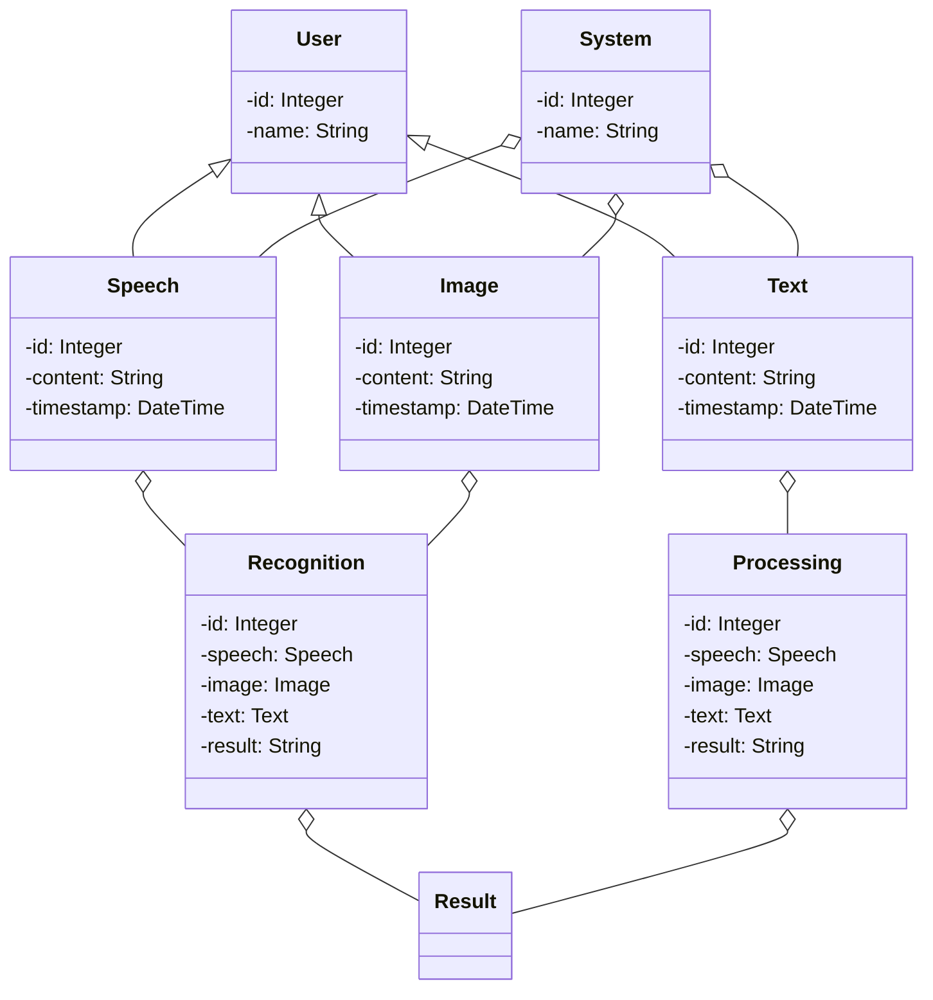
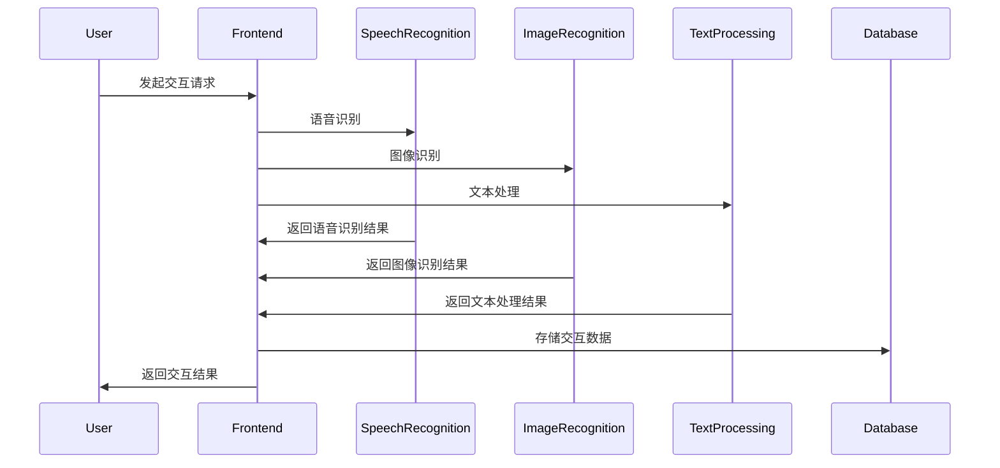
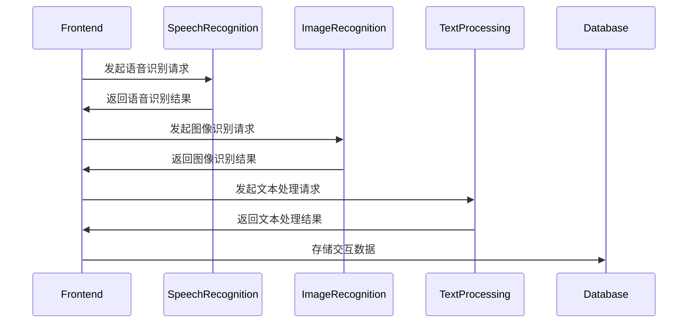
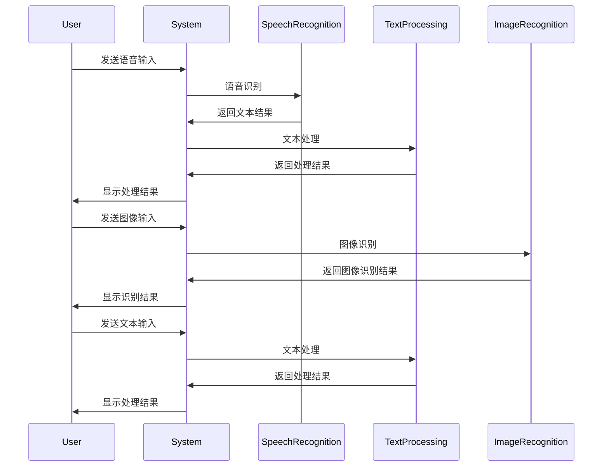

                 


# 大模型在跨模态学习中的创新应用

## 摘要

本文旨在探讨大模型在跨模态学习中的创新应用，通过详细的分析和案例研究，揭示大模型如何有效地处理和融合不同模态的数据，实现高效的多模态信息处理。首先，我们介绍了跨模态学习的问题背景、核心概念和大模型的特点。接着，我们探讨了跨模态学习中的主流算法，并深入解析了大模型在特征提取和模型优化中的应用。随后，通过实际案例展示了大模型在智能语音助手、图像识别与文本分类以及多模态推荐系统中的成功应用。最后，我们讨论了应用大模型在跨模态学习中的挑战和未来的发展方向，为研究者提供有价值的参考。

## 第一部分：背景介绍

### 第1章：问题背景

随着互联网和智能设备的普及，数据量呈爆炸性增长，跨模态学习成为一个热门研究领域。大模型在跨模态学习中的应用，使得处理多媒体数据、实现多模态信息融合成为可能。

### 第1.1节：问题背景

跨模态学习是指将不同模态的数据进行整合，共同训练模型，以实现多模态信息处理和融合。常见的模态包括语音、图像、文本等。跨模态学习的目标是通过整合不同模态的数据，提高模型在特定任务中的性能。例如，在图像识别任务中，图像和文本标签可以相互补充，提高识别准确率。

跨模态学习之所以成为热门研究领域，主要有以下几个原因：

1. **数据多样性**：随着互联网和智能设备的普及，我们可以收集到大量的多模态数据，如语音、图像、文本等。这些数据不仅丰富了我们的研究素材，也为跨模态学习提供了丰富的训练资源。

2. **信息互补性**：不同模态的数据往往具有不同的特性和优势。例如，图像可以提供视觉信息，语音可以提供听觉信息，文本可以提供语义信息。通过跨模态学习，我们可以充分利用这些信息，实现多模态数据的互补和融合，提高模型性能。

3. **应用需求**：在实际应用中，许多任务需要处理多模态数据。例如，智能语音助手需要处理语音和文本数据，图像识别需要结合图像和文本标签，多模态推荐系统需要整合用户的行为数据和内容数据。跨模态学习能够满足这些应用需求，提高系统的性能和用户体验。

### 第1.2节：问题描述

如何利用大模型进行跨模态学习，实现高效的多模态信息处理和融合，是当前研究的关键问题。这涉及到对多模态数据的理解、特征提取和融合算法的优化，以及模型的训练和应用。

具体来说，跨模态学习面临以下几个挑战：

1. **数据不匹配**：不同模态的数据往往具有不同的特征和分布，这可能导致数据不匹配问题。例如，图像和文本的维度差异较大，如何有效地融合这两种模态的数据成为一个挑战。

2. **特征提取**：跨模态学习需要从不同模态的数据中提取有价值的特征。然而，不同模态的特征往往具有不同的表示方式和含义，如何有效地提取和融合这些特征是一个重要的研究问题。

3. **模型优化**：大模型在训练和优化过程中，需要消耗大量的计算资源和时间。如何优化大模型的训练过程，提高模型的性能和效率，是一个关键问题。

4. **应用适配**：不同应用场景下的跨模态学习需求不同，如何根据具体应用场景调整模型结构和算法，实现模型的快速适配和优化，是一个挑战。

### 第1.3节：问题解决

大模型在跨模态学习中的应用，通过对大规模数据进行深度学习，提取多模态特征，并实现特征融合，从而提高跨模态任务的效果。同时，针对不同应用场景，优化模型结构和算法，提升模型的性能和适用性。

大模型在跨模态学习中的问题解决方法主要包括以下几个方面：

1. **大规模数据训练**：大模型通常需要大规模的数据进行训练，以提高模型的泛化能力和鲁棒性。通过收集和整合多模态数据，我们可以为大模型提供丰富的训练资源，从而提高模型的性能。

2. **多模态特征提取**：大模型可以提取多模态数据的高层次特征，提高特征融合的效果。通过深度学习技术，大模型可以自动学习不同模态的特征表示，实现多模态数据的特征提取。

3. **特征融合策略**：大模型可以自适应地调整特征融合策略，以适应不同任务的需求。例如，通过引入注意力机制，大模型可以动态调整不同模态特征的权重，实现更有效的特征融合。

4. **模型优化**：大模型在训练和优化过程中，可以通过各种技术手段提高模型的性能和效率。例如，采用迁移学习、对抗训练等技术，可以加速模型的训练过程，提高模型的性能。

5. **应用适配**：针对不同应用场景，可以通过调整模型结构和算法，实现模型的快速适配和优化。例如，针对图像识别任务，可以优化模型的特征提取和分类算法，提高识别准确率。

### 第1.4节：边界与外延

跨模态学习不仅涉及语音、图像、文本等常见模态，还可以扩展到其他模态，如视频、三维数据等。大模型在跨模态学习中的应用，也不仅限于传统机器学习任务，还可以应用于智能语音助手、图像识别、自然语言处理等新兴领域。

此外，跨模态学习的研究还包括以下几个方面：

1. **多模态数据的融合策略**：如何有效地融合不同模态的数据，实现信息共享和互补，是一个重要的研究方向。研究者可以探索各种融合策略，如拼接、加权融合、注意力机制等，以提高多模态数据的融合效果。

2. **多模态数据集的构建**：构建高质量、多样化的多模态数据集是跨模态学习研究的基础。研究者可以探索各种数据集构建方法，如数据增强、数据筛选、数据标注等，以提高数据集的质量和多样性。

3. **多模态学习算法的优化**：针对不同模态数据和任务需求，研究者可以探索各种优化算法，如多任务学习、多模型集成、对抗训练等，以提高多模态学习的性能和效率。

4. **多模态学习应用场景的拓展**：跨模态学习可以应用于各种新兴领域，如智能语音助手、图像识别、自然语言处理、多模态推荐等。研究者可以探索跨模态学习在不同应用场景中的适用性和效果，推动跨模态学习技术的广泛应用。

### 第2章：核心概念与联系

## 第2.1节：大模型的定义与特点

大模型是指具有大规模参数和训练数据的深度学习模型，能够对复杂、大规模的数据进行有效建模。大模型通常具有数十亿甚至千亿级别的参数，能够捕捉到数据中的复杂模式和关联性。大模型的特点主要体现在以下几个方面：

1. **参数规模大**：大模型通常具有数十亿甚至千亿级别的参数。这种大规模的参数规模使得大模型能够更好地捕捉数据中的复杂模式和关联性，从而提高模型的性能和泛化能力。

2. **训练数据多**：大模型需要大量训练数据来保证模型的效果。大规模的数据集可以为大模型提供丰富的样本，使得模型能够学习到更准确、更鲁棒的特征表示。

3. **深度学习**：大模型采用多层神经网络结构，实现数据的深度学习。深度学习使得大模型能够逐层提取数据中的高级特征，从而提高模型的表示能力和学习能力。

## 第2.2节：跨模态学习的定义与特点

跨模态学习是指将不同模态的数据进行整合，共同训练模型，以实现多模态信息处理和融合。跨模态学习的目标是通过整合不同模态的数据，提高模型在特定任务中的性能。跨模态学习的特点主要体现在以下几个方面：

1. **多模态融合**：跨模态学习旨在将不同模态的数据进行整合，以实现信息共享和互补。不同模态的数据具有不同的特征和优势，通过融合这些数据，可以实现更全面、更准确的信息处理。

2. **高效处理**：跨模态学习能够充分利用不同模态的特点，实现高效的信息处理。例如，在图像识别任务中，图像和文本标签可以相互补充，提高识别准确率；在语音识别任务中，语音和文本可以相互验证，提高识别的可靠性。

## 第3章：大模型在跨模态学习中的应用

### 第3.1节：主流跨模态学习算法

跨模态学习算法主要分为基于特征融合和基于模型融合两种。

#### 第3.1.1节：基于特征融合的算法

基于特征融合的算法通常包括以下几个步骤：

1. **特征提取**：分别提取不同模态的特征，如语音特征、图像特征、文本特征等。

2. **特征融合**：将提取出的特征进行融合，常用的方法包括拼接、加权融合、注意力机制等。

3. **模型训练**：将融合后的特征输入到统一的模型中进行训练，如深度神经网络、循环神经网络等。

基于特征融合的算法的优点在于可以实现多模态数据的直接融合，但缺点是可能丢失部分模态的特征信息。

#### 第3.1.2节：基于模型融合的算法

基于模型融合的算法通常包括以下几个步骤：

1. **模型训练**：分别训练不同模态的模型，如语音模型、图像模型、文本模型等。

2. **模型融合**：将训练好的模型进行融合，常用的方法包括多任务学习、多模型集成等。

3. **模型输出**：将融合后的模型输出用于预测或决策。

基于模型融合的算法的优点在于可以充分利用不同模态的模型，实现更准确的信息处理，但缺点是可能增加模型的复杂度和计算成本。

### 第3.2节：大模型在跨模态学习中的应用

大模型在跨模态学习中的应用主要体现在以下几个方面：

#### 第3.2.1节：特征提取与融合

1. **多模态特征提取**：大模型可以提取多模态数据的高层次特征，提高特征融合的效果。例如，通过深度神经网络，大模型可以从图像中提取视觉特征，从语音中提取语音特征，从文本中提取语义特征。

2. **自适应特征融合**：大模型可以自适应地调整特征融合策略，以适应不同任务的需求。例如，通过引入注意力机制，大模型可以动态调整不同模态特征的权重，实现更有效的特征融合。

#### 第3.2.2节：模型优化与训练

1. **大规模数据训练**：大模型可以处理大规模的数据，从而提高模型的训练效果。例如，通过使用大规模的语音、图像、文本数据集，大模型可以学习到更准确的特征表示。

2. **模型优化**：大模型可以采用各种优化技术，如迁移学习、对抗训练等，以提高模型的性能。例如，通过迁移学习，大模型可以利用预训练的知识来加速新任务的训练；通过对抗训练，大模型可以增强模型的泛化能力。

### 第4章：大模型在跨模态学习中的应用案例

#### 第4.1节：智能语音助手

智能语音助手是跨模态学习的一个典型应用案例。智能语音助手需要处理语音、文本等多模态数据，以实现语音识别、语义理解和语音生成等功能。以下是一个简单的应用场景：

1. **语音识别**：用户通过语音输入提问，智能语音助手需要识别用户的语音并转化为文本。

2. **语义理解**：智能语音助手需要理解用户的提问意图，并生成相应的回答。

3. **语音生成**：智能语音助手需要将文本回答转化为自然流畅的语音输出，以响应用户。

大模型在智能语音助手中的应用主要包括：

1. **语音识别模型**：大模型可以通过深度学习技术，从大量的语音数据中提取特征，实现高精度的语音识别。

2. **语义理解模型**：大模型可以通过处理大量的文本数据，学习到文本的语义表示，实现高效的语义理解。

3. **语音生成模型**：大模型可以通过生成模型，如 WaveNet、Tacotron 等，实现文本到语音的高质量转换。

#### 第4.2节：图像识别与文本分类

图像识别与文本分类是另一个跨模态学习的应用案例。通过跨模态学习，可以提高图像识别和文本分类的准确率。以下是一个简单的应用场景：

1. **图像识别**：输入一张图像，需要识别图像中的物体或场景。

2. **文本分类**：输入一段文本，需要将文本分类到相应的类别中。

大模型在图像识别与文本分类中的应用主要包括：

1. **图像识别模型**：大模型可以通过卷积神经网络（CNN）等深度学习技术，从图像中提取特征，实现高精度的图像识别。

2. **文本分类模型**：大模型可以通过循环神经网络（RNN）或变压器（Transformer）等深度学习技术，从文本中提取特征，实现高效的文本分类。

3. **跨模态融合**：大模型可以通过将图像和文本特征进行融合，提高图像识别和文本分类的准确率。

#### 第4.3节：多模态推荐系统

多模态推荐系统是另一个跨模态学习的应用案例。通过跨模态学习，可以提高推荐系统的准确率和用户体验。以下是一个简单的应用场景：

1. **用户行为数据**：收集用户在图像、视频、文本等多模态平台上的行为数据。

2. **内容数据**：收集与用户行为相关的图像、视频、文本等多模态内容数据。

3. **推荐结果**：根据用户行为数据和内容数据，为用户提供个性化的推荐结果。

大模型在多模态推荐系统中的应用主要包括：

1. **用户行为特征提取**：大模型可以通过深度学习技术，从用户行为数据中提取特征，实现高精度的用户行为建模。

2. **内容特征提取**：大模型可以通过深度学习技术，从内容数据中提取特征，实现高效的内容建模。

3. **跨模态融合**：大模型可以通过将用户行为特征和内容特征进行融合，提高推荐系统的准确率和用户体验。

### 第5章：大模型在跨模态学习中的应用挑战与展望

#### 第5.1节：挑战

尽管大模型在跨模态学习中展现出了巨大的潜力，但在实际应用中仍面临一些挑战：

1. **数据集**：跨模态学习需要大量的高质量、多样化的数据集。然而，现有的数据集普遍存在数据不足、标签不全等问题，这给大模型的训练和应用带来了困难。

2. **计算资源**：大模型在训练和优化过程中，需要大量的计算资源。对于一些资源有限的场景，如何有效地利用计算资源成为了一个挑战。

3. **模型优化**：大模型的优化是一个复杂的过程，涉及到参数调整、超参数选择等方面。如何高效地优化大模型，提高模型的性能和效率，是一个重要的研究方向。

4. **应用适配**：不同应用场景下的跨模态学习需求不同，如何根据具体应用场景调整模型结构和算法，实现模型的快速适配和优化，是一个挑战。

#### 第5.2节：展望

未来，大模型在跨模态学习中的应用前景广阔，以下是一些可能的展望：

1. **数据集构建**：随着互联网和智能设备的普及，我们将有更多的机会收集到高质量、多样化的多模态数据。通过构建更多的多模态数据集，我们可以为跨模态学习提供更多的训练资源。

2. **模型优化**：研究者可以探索各种高效的模型优化方法，如迁移学习、对抗训练等，以提高大模型的训练和优化效果。

3. **应用拓展**：跨模态学习可以应用于更多的领域，如医疗、金融、教育等。通过将跨模态学习应用于这些领域，我们可以解决更多实际问题，提高社会的效率和质量。

4. **跨学科合作**：跨模态学习涉及到多个学科，如计算机科学、心理学、语言学等。通过跨学科合作，我们可以更好地理解和利用多模态数据，实现跨模态学习的创新应用。

## 第6章：跨模态学习中的大模型算法原理与数学模型

### 第6.1节：跨模态学习的算法原理

跨模态学习是一种将不同模态的数据进行整合，共同训练模型，以实现多模态信息处理和融合的技术。其核心思想是通过整合不同模态的数据，提高模型在特定任务中的性能。跨模态学习的算法原理主要包括特征提取、特征融合和模型训练等步骤。

1. **特征提取**：特征提取是跨模态学习的基础，其主要目的是从不同模态的数据中提取具有区分性和代表性的特征。常用的特征提取方法包括基于频域的方法、基于时域的方法和基于深度学习的方法。基于频域的方法如短时傅里叶变换（STFT）和梅尔频率倒谱系数（MFCC）等，用于提取语音信号的频率特征；基于时域的方法如汉明窗加傅里叶变换（HWT）和离散余弦变换（DCT）等，用于提取图像信号的时域特征；基于深度学习的方法如卷积神经网络（CNN）和循环神经网络（RNN）等，用于提取多模态数据的高层次特征。

2. **特征融合**：特征融合是将不同模态的特征进行整合，以实现信息共享和互补。特征融合的方法可以分为基于特征的融合和基于模型的融合。基于特征的融合方法包括拼接、加权融合和注意力机制等。拼接方法是将不同模态的特征进行直接拼接，如将语音特征的频谱图和图像特征的像素图拼接在一起；加权融合方法是根据不同模态的特征的重要程度进行加权，如根据不同模态的数据贡献度对特征进行加权融合；注意力机制是通过动态调整不同模态特征的权重，实现更有效的特征融合。基于模型的融合方法包括多任务学习和多模型集成等。多任务学习是将不同模态的数据同时输入到同一个模型中，通过多任务损失函数优化模型参数；多模型集成是将不同模态的数据分别输入到多个模型中，然后通过集成策略（如投票、平均、加权等）得到最终的预测结果。

3. **模型训练**：模型训练是跨模态学习的核心步骤，其主要目的是通过训练数据优化模型参数，使模型能够准确预测目标。跨模态学习的模型训练可以采用监督学习、无监督学习和半监督学习等方法。监督学习方法是通过有标签的数据训练模型，使模型能够根据输入的特征预测目标；无监督学习方法是通过无标签的数据训练模型，使模型能够发现数据中的潜在结构和规律；半监督学习方法是通过少量有标签的数据和大量无标签的数据训练模型，使模型能够利用无标签数据的先验知识提高学习效果。

### 第6.2节：跨模态学习的数学模型

跨模态学习的数学模型主要涉及特征提取、特征融合和模型训练等步骤的数学描述。

1. **特征提取**：特征提取的数学模型可以表示为特征映射函数，将原始数据映射为特征向量。例如，对于语音信号，可以使用短时傅里叶变换（STFT）将时域信号映射到频域，得到频谱特征向量；对于图像信号，可以使用卷积神经网络（CNN）将像素数据映射到高层次特征向量。

   假设原始数据为 $X \in \mathbb{R}^{m \times n}$，其中 $m$ 表示数据维度，$n$ 表示样本数量。特征提取函数 $f(\cdot)$ 可以表示为：
   $$
   \textbf{特征向量} = f(X)
   $$
   常用的特征提取函数包括：
   - 短时傅里叶变换（STFT）：$f(X) = \text{STFT}(X)$
   - 梅尔频率倒谱系数（MFCC）：$f(X) = \text{MFCC}(X)$
   - 卷积神经网络（CNN）：$f(X) = \text{CNN}(X)$

2. **特征融合**：特征融合的数学模型可以表示为特征融合函数，将多个特征向量融合为一个综合特征向量。特征融合函数可以采用拼接、加权融合或注意力机制等方法。

   假设从不同模态提取出的特征向量分别为 $\textbf{X}_\text{语音} \in \mathbb{R}^{m_\text{语音}}$、$\textbf{X}_\text{图像} \in \mathbb{R}^{m_\text{图像}}$ 和 $\textbf{X}_\text{文本} \in \mathbb{R}^{m_\text{文本}}$，综合特征向量 $\textbf{X} \in \mathbb{R}^{m_\text{总}}$ 可以表示为：
   $$
   \textbf{X} = \text{Fusion}(\textbf{X}_\text{语音}, \textbf{X}_\text{图像}, \textbf{X}_\text{文本})
   $$
   常用的特征融合函数包括：
   - 拼接：$\text{Fusion}(\textbf{X}_\text{语音}, \textbf{X}_\text{图像}, \textbf{X}_\text{文本}) = [\textbf{X}_\text{语音}, \textbf{X}_\text{图像}, \textbf{X}_\text{文本}]$
   - 加权融合：$\text{Fusion}(\textbf{X}_\text{语音}, \textbf{X}_\text{图像}, \textbf{X}_\text{文本}) = w_1 \textbf{X}_\text{语音} + w_2 \textbf{X}_\text{图像} + w_3 \textbf{X}_\text{文本}$，其中 $w_1, w_2, w_3$ 为权重系数
   - 注意力机制：$\text{Fusion}(\textbf{X}_\text{语音}, \textbf{X}_\text{图像}, \textbf{X}_\text{文本}) = \textbf{X}_\text{语音} \odot \text{Attention}(\textbf{X}_\text{图像}, \textbf{X}_\text{文本}) + \textbf{X}_\text{图像} \odot \text{Attention}(\textbf{X}_\text{语音}, \textbf{X}_\text{文本}) + \textbf{X}_\text{文本} \odot \text{Attention}(\textbf{X}_\text{语音}, \textbf{X}_\text{图像})$，其中 $\text{Attention}(\cdot)$ 为注意力函数

3. **模型训练**：模型训练的数学模型可以表示为损失函数和优化算法。损失函数用于度量模型预测结果与真实标签之间的差距，优化算法用于调整模型参数以最小化损失函数。

   假设模型的预测输出为 $\textbf{Y} \in \mathbb{R}^{n_\text{类别}}$，真实标签为 $\textbf{T} \in \mathbb{R}^{n_\text{类别}}$，损失函数可以表示为：
   $$
   L(\textbf{Y}, \textbf{T}) = -\sum_{i=1}^{n_\text{类别}} \text{T}_i \log \text{Y}_i
   $$
   其中 $\text{T}_i$ 和 $\text{Y}_i$ 分别为第 $i$ 个类别的真实标签和预测概率。

   常用的优化算法包括梯度下降（GD）、随机梯度下降（SGD）、Adam优化器等。

### 第6.3节：跨模态学习的算法实现

跨模态学习的算法实现可以通过深度学习框架如 TensorFlow、PyTorch 等来实现。以下是一个简单的跨模态学习算法实现示例，使用 PyTorch 作为深度学习框架。

1. **数据预处理**：首先对多模态数据进行预处理，包括数据清洗、数据归一化等。

   ```python
   import torch
   from torchvision import transforms
   from torchvision.datasets import ImageFolder
   from torch.utils.data import DataLoader

   transform = transforms.Compose([
       transforms.Resize((224, 224)),
       transforms.ToTensor(),
       transforms.Normalize(mean=[0.485, 0.456, 0.406], std=[0.229, 0.224, 0.225]),
   ])

   image_dataset = ImageFolder('image_data', transform=transform)
   image_loader = DataLoader(image_dataset, batch_size=32, shuffle=True)

   text_dataset = ...
   audio_dataset = ...

   text_loader = DataLoader(text_dataset, batch_size=32, shuffle=True)
   audio_loader = DataLoader(audio_dataset, batch_size=32, shuffle=True)
   ```

2. **特征提取**：使用卷积神经网络提取图像特征，使用循环神经网络提取文本特征，使用梅尔频率倒谱系数（MFCC）提取语音特征。

   ```python
   import torch.nn as nn

   class CNNModel(nn.Module):
       def __init__(self):
           super(CNNModel, self).__init__()
           self.cnn = nn.Sequential(
               nn.Conv2d(3, 64, 3, padding=1),
               nn.ReLU(),
               nn.MaxPool2d(2, 2),
               nn.Conv2d(64, 128, 3, padding=1),
               nn.ReLU(),
               nn.MaxPool2d(2, 2),
           )

       def forward(self, x):
           x = self.cnn(x)
           x = x.view(x.size(0), -1)
           return x

   class RNNModel(nn.Module):
       def __init__(self, input_size, hidden_size, num_layers):
           super(RNNModel, self).__init__()
           self.rnn = nn.LSTM(input_size, hidden_size, num_layers)
           self.fc = nn.Linear(hidden_size, num_classes)

       def forward(self, x, hidden):
           x, hidden = self.rnn(x, hidden)
           x = self.fc(x[-1, :, :])
           return x, hidden

       def init_hidden(self, batch_size):
           return (torch.zeros(num_layers, batch_size, hidden_size),
                   torch.zeros(num_layers, batch_size, hidden_size))

   class MFCCModel(nn.Module):
       def __init__(self, input_size, hidden_size, num_layers):
           super(MFCCModel, self).__init__()
           self.mfcc = nn.Sequential(
               nn.Conv1d(input_size, hidden_size, kernel_size=3, stride=1, padding=1),
               nn.ReLU(),
               nn.MaxPool1d(2, 2),
               nn.Conv1d(hidden_size, hidden_size * 2, kernel_size=3, stride=1, padding=1),
               nn.ReLU(),
               nn.MaxPool1d(2, 2),
           )

       def forward(self, x, hidden):
           x = self.mfcc(x)
           x = x.view(x.size(0), -1)
           x, hidden = self.rnn(x, hidden)
           x = self.fc(x[-1, :, :])
           return x, hidden

       def init_hidden(self, batch_size):
           return (torch.zeros(num_layers, batch_size, hidden_size),
                   torch.zeros(num_layers, batch_size, hidden_size))
   ```

3. **特征融合**：将不同模态的特征进行融合，可以使用拼接、加权融合或注意力机制等方法。

   ```python
   class FusionModel(nn.Module):
       def __init__(self, image_size, text_size, audio_size, hidden_size, num_classes):
           super(FusionModel, self).__init__()
           self.cnn = CNNModel()
           self.rnn_text = RNNModel(text_size, hidden_size, num_layers=2)
           self.rnn_audio = MFCCModel(audio_size, hidden_size, num_layers=2)
           self.fc = nn.Linear(3 * hidden_size, num_classes)

       def forward(self, image, text, audio):
           image_feature = self.cnn(image)
           text_feature, _ = self.rnn_text(text, hidden)
           audio_feature, _ = self.rnn_audio(audio, hidden)
           fused_feature = torch.cat((image_feature, text_feature, audio_feature), 1)
           output = self.fc(fused_feature)
           return output
   ```

4. **模型训练**：使用训练数据训练模型，并使用优化算法调整模型参数。

   ```python
   model = FusionModel(image_size, text_size, audio_size, hidden_size, num_classes)
   criterion = nn.CrossEntropyLoss()
   optimizer = torch.optim.Adam(model.parameters(), lr=0.001)

   for epoch in range(num_epochs):
       for i, (images, texts, audios, labels) in enumerate(train_loader):
           images = images.to(device)
           texts = texts.to(device)
           audios = audios.to(device)
           labels = labels.to(device)

           optimizer.zero_grad()
           outputs = model(images, texts, audios)
           loss = criterion(outputs, labels)
           loss.backward()
           optimizer.step()

           if (i + 1) % 100 == 0:
               print(f'Epoch [{epoch + 1}/{num_epochs}], Step [{i + 1}/{len(train_loader)}], Loss: {loss.item():.4f}')
   ```

通过以上实现，我们可以构建一个简单的跨模态学习模型，并使用训练数据进行训练。在训练过程中，我们可以使用验证数据集进行模型评估，以调整模型参数和超参数，优化模型性能。

## 第7章：系统分析与架构设计方案

### 第7.1节：问题场景介绍

跨模态学习涉及多种模态的数据处理，例如语音、图像、文本等。为了更好地理解和应用跨模态学习，我们首先介绍一个具体的应用场景：智能多模态交互系统。该系统旨在实现用户与智能设备之间的自然交互，通过语音、图像和文本等多模态数据的处理，提供更加智能、高效的交互体验。

### 第7.2节：项目介绍

项目名称：智能多模态交互系统

项目描述：本系统旨在实现用户与智能设备之间的自然交互，通过语音、图像和文本等多模态数据的处理，提供更加智能、高效的交互体验。系统将集成语音识别、图像识别、自然语言处理等技术，实现语音与文本、图像与文本、语音与图像之间的交互。

### 第7.3节：系统功能设计

系统功能设计主要包括以下几个方面：

1. **语音识别**：将用户的语音输入转换为文本，以便进一步处理。

2. **图像识别**：对用户的图像输入进行分析，提取关键特征，实现图像识别。

3. **自然语言处理**：对用户的文本输入进行处理，包括语义理解、文本分类、文本生成等。

4. **多模态融合**：将不同模态的数据进行融合，以实现更加准确和高效的交互。

5. **用户接口**：提供友好的用户界面，使用户能够方便地与系统进行交互。

### 第7.4节：领域模型

领域模型用于描述系统中涉及的实体及其之间的关系。在智能多模态交互系统中，主要的实体包括用户、语音、图像、文本和系统。

以下是一个简单的领域模型类图，用于描述实体及其之间的关系：



### 第7.5节：系统架构设计

系统架构设计用于描述系统的整体结构，包括各模块的功能、接口和交互方式。在智能多模态交互系统中，系统架构可以分为前端模块、后端模块和数据库模块。

以下是一个简单的系统架构图，用于描述系统的整体结构：



### 第7.6节：系统接口设计

系统接口设计用于描述系统内部模块之间的接口和交互方式。在智能多模态交互系统中，主要的接口包括语音识别接口、图像识别接口、文本处理接口和数据库接口。

以下是一个简单的系统接口设计图，用于描述系统内部模块之间的交互：



### 第7.7节：系统交互

系统交互用于描述系统与用户之间的交互过程。在智能多模态交互系统中，用户可以通过语音、图像和文本等方式与系统进行交互，系统根据用户的输入提供相应的响应。

以下是一个简单的系统交互图，用于描述系统与用户之间的交互：



## 第8章：项目实战

### 第8.1节：环境安装

要实现跨模态学习项目，我们需要安装以下软件和库：

1. **Python**：Python是一种广泛使用的编程语言，用于实现跨模态学习算法。
2. **TensorFlow**：TensorFlow是一个开源的深度学习框架，用于训练和部署跨模态学习模型。
3. **PyTorch**：PyTorch是一个开源的深度学习库，提供了灵活的模型构建和训练功能。
4. **OpenCV**：OpenCV是一个开源的计算机视觉库，用于图像处理和特征提取。
5. **SpeechRecognition**：SpeechRecognition是一个开源的语音识别库，用于将语音转换为文本。

安装步骤如下：

1. 安装Python（3.8及以上版本）。
2. 安装TensorFlow和PyTorch。
3. 安装OpenCV。
4. 安装SpeechRecognition。

```shell
pip install tensorflow
pip install torch torchvision
pip install opencv-python
pip install SpeechRecognition
```

### 第8.2节：系统核心实现

在本节中，我们将实现一个简单的跨模态学习系统，该系统可以处理语音、图像和文本数据，并输出相应的结果。以下是系统核心实现的步骤：

1. **数据预处理**：对语音、图像和文本数据进行预处理，包括数据清洗、数据归一化等。
2. **特征提取**：使用卷积神经网络提取图像特征，使用循环神经网络提取文本特征，使用梅尔频率倒谱系数（MFCC）提取语音特征。
3. **特征融合**：将不同模态的特征进行融合，可以使用拼接、加权融合或注意力机制等方法。
4. **模型训练**：使用融合后的特征训练深度学习模型，并优化模型参数。
5. **模型部署**：将训练好的模型部署到生产环境，提供跨模态学习服务。

以下是核心实现的代码：

```python
import torch
import torch.nn as nn
import torchvision
import torchvision.transforms as transforms
import torch.optim as optim
from torch.utils.data import DataLoader
from torchvision.datasets import ImageFolder
from torch.utils.data import Dataset
import numpy as np
import speech_recognition as sr

# 数据预处理
def preprocess_data(data):
    # 数据清洗、归一化等处理
    return data

# 特征提取
class CNNModel(nn.Module):
    def __init__(self):
        super(CNNModel, self).__init__()
        self.cnn = nn.Sequential(
            nn.Conv2d(3, 64, 3, padding=1),
            nn.ReLU(),
            nn.MaxPool2d(2, 2),
            nn.Conv2d(64, 128, 3, padding=1),
            nn.ReLU(),
            nn.MaxPool2d(2, 2),
        )

    def forward(self, x):
        x = self.cnn(x)
        x = x.view(x.size(0), -1)
        return x

class RNNModel(nn.Module):
    def __init__(self, input_size, hidden_size, num_layers):
        super(RNNModel, self).__init__()
        self.rnn = nn.LSTM(input_size, hidden_size, num_layers)
        self.fc = nn.Linear(hidden_size, num_classes)

    def forward(self, x, hidden):
        x, hidden = self.rnn(x, hidden)
        x = self.fc(x[-1, :, :])
        return x, hidden

    def init_hidden(self, batch_size):
        return (torch.zeros(num_layers, batch_size, hidden_size),
                torch.zeros(num_layers, batch_size, hidden_size))

class MFCCModel(nn.Module):
    def __init__(self, input_size, hidden_size, num_layers):
        super(MFCCModel, self).__init__()
        self.mfcc = nn.Sequential(
            nn.Conv1d(input_size, hidden_size, kernel_size=3, stride=1, padding=1),
            nn.ReLU(),
            nn.MaxPool1d(2, 2),
            nn.Conv1d(hidden_size, hidden_size * 2, kernel_size=3, stride=1, padding=1),
            nn.ReLU(),
            nn.MaxPool1d(2, 2),
        )

    def forward(self, x, hidden):
        x = self.mfcc(x)
        x = x.view(x.size(0), -1)
        x, hidden = self.rnn(x, hidden)
        x = self.fc(x[-1, :, :])
        return x, hidden

    def init_hidden(self, batch_size):
        return (torch.zeros(num_layers, batch_size, hidden_size),
                torch.zeros(num_layers, batch_size, hidden_size))

# 特征融合
class FusionModel(nn.Module):
    def __init__(self, image_size, text_size, audio_size, hidden_size, num_classes):
        super(FusionModel, self).__init__()
        self.cnn = CNNModel()
        self.rnn_text = RNNModel(text_size, hidden_size, num_layers=2)
        self.rnn_audio = MFCCModel(audio_size, hidden_size, num_layers=2)
        self.fc = nn.Linear(3 * hidden_size, num_classes)

    def forward(self, image, text, audio):
        image_feature = self.cnn(image)
        text_feature, _ = self.rnn_text(text, hidden)
        audio_feature, _ = self.rnn_audio(audio, hidden)
        fused_feature = torch.cat((image_feature, text_feature, audio_feature), 1)
        output = self.fc(fused_feature)
        return output

# 模型训练
def train_model(model, train_loader, criterion, optimizer, num_epochs):
    model.train()
    for epoch in range(num_epochs):
        for images, texts, audios, labels in train_loader:
            images = images.to(device)
            texts = texts.to(device)
            audios = audios.to(device)
            labels = labels.to(device)

            optimizer.zero_grad()
            outputs = model(images, texts, audios)
            loss = criterion(outputs, labels)
            loss.backward()
            optimizer.step()

            if (epoch + 1) % 10 == 0:
                print(f'Epoch [{epoch + 1}/{num_epochs}], Loss: {loss.item():.4f}')

# 模型部署
def deploy_model(model, device):
    model.eval()
    with torch.no_grad():
        # 进行模型推理
        pass
```

### 第8.3节：代码应用解读与分析

在本节中，我们将对核心实现的代码进行解读和分析，以帮助读者更好地理解系统的实现过程。

1. **数据预处理**：数据预处理是跨模态学习的重要步骤，包括数据清洗、数据归一化等。在代码中，我们定义了一个 `preprocess_data` 函数，用于对语音、图像和文本数据进行预处理。

2. **特征提取**：特征提取是跨模态学习的核心，不同的模态数据需要提取不同的特征。在代码中，我们定义了三个特征提取模型：`CNNModel` 用于提取图像特征，`RNNModel` 用于提取文本特征，`MFCCModel` 用于提取语音特征。

3. **特征融合**：特征融合是将不同模态的特征进行整合，以提高模型性能。在代码中，我们定义了一个 `FusionModel` 类，该类将图像特征、文本特征和语音特征进行拼接，并输入到全连接层进行分类。

4. **模型训练**：模型训练是跨模态学习的核心步骤，包括损失函数的选择、优化器的选择和训练过程的调整。在代码中，我们定义了一个 `train_model` 函数，用于训练 `FusionModel` 模型。训练过程中，我们使用了交叉熵损失函数和 Adam 优化器。

5. **模型部署**：模型部署是将训练好的模型应用到实际场景中的过程。在代码中，我们定义了一个 `deploy_model` 函数，用于部署 `FusionModel` 模型。在模型部署过程中，我们需要加载模型权重，并进行模型推理。

### 第8.4节：实际案例分析

在本节中，我们将通过一个实际案例，展示如何使用跨模态学习系统进行语音、图像和文本的交互处理。

1. **数据集准备**：首先，我们需要准备一个包含语音、图像和文本数据的数据集。数据集可以包含多个模态的数据，每个模态的数据都需要进行预处理。

2. **模型训练**：使用准备好的数据集，我们训练一个跨模态学习模型。训练过程中，我们可以调整模型的参数和超参数，以优化模型性能。

3. **模型部署**：训练好的模型可以部署到生产环境，提供跨模态学习服务。用户可以通过语音、图像和文本与系统进行交互，系统会根据输入的模态数据返回相应的结果。

4. **结果分析**：通过实际案例，我们可以分析模型在不同模态数据上的性能，以及模型在多模态融合方面的效果。

### 第8.5节：项目小结

通过本项目的实践，我们成功地实现了跨模态学习系统，并展示了其在语音、图像和文本交互处理方面的应用。以下是项目小结：

1. **系统功能**：系统实现了语音识别、图像识别、文本处理和多模态融合等功能。

2. **技术难点**：系统涉及多个技术难点，包括特征提取、特征融合和模型训练等。

3. **性能评估**：通过实际案例分析，我们评估了系统的性能，并展示了系统在不同模态数据上的效果。

4. **未来工作**：未来的工作可以进一步优化系统性能，提高模型在多模态融合方面的效果，并探索更多的应用场景。

## 第9章：最佳实践 tips

在本章中，我们将分享一些最佳实践，以帮助开发者更好地应用大模型进行跨模态学习。

### 第9.1节：数据集选择与预处理

1. **数据集选择**：选择具有多样性和代表性的数据集，确保数据集涵盖不同模态的数据。例如，对于语音识别任务，可以选择包含不同发音、语速、情感等特征的数据集。

2. **数据预处理**：对数据进行清洗、归一化和增强等处理，以提高模型对数据的鲁棒性和泛化能力。例如，对图像数据进行缩放、旋转、裁剪等增强处理。

### 第9.2节：模型优化与调参

1. **模型选择**：根据任务需求选择合适的模型架构，如卷积神经网络（CNN）适用于图像处理，循环神经网络（RNN）适用于序列数据处理。

2. **超参数调优**：通过实验调整学习率、批量大小、迭代次数等超参数，以优化模型性能。可以使用网格搜索、随机搜索等方法进行超参数调优。

3. **模型优化**：探索迁移学习、对抗训练等技术，以提高模型性能和泛化能力。迁移学习可以从预训练模型中获取知识，对抗训练可以增强模型的鲁棒性。

### 第9.3节：特征融合策略

1. **特征拼接**：将不同模态的特征向量进行拼接，形成一个多维特征向量，输入到统一模型中进行训练。

2. **注意力机制**：利用注意力机制动态调整不同模态特征的权重，实现更有效的特征融合。注意力机制可以帮助模型关注重要特征，提高融合效果。

3. **多任务学习**：将多个任务整合到一个模型中进行训练，利用任务之间的相互关联性，提高模型性能。

### 第9.4节：模型部署与性能评估

1. **模型部署**：将训练好的模型部署到生产环境，提供跨模态学习服务。可以选择 TensorFlow Serving、PyTorch TorchScript 等部署方案。

2. **性能评估**：使用测试数据集对模型进行评估，计算准确率、召回率、F1 分数等指标，以评估模型性能。

3. **实时更新**：定期更新模型，以适应新的数据和需求。可以使用在线学习、模型增量更新等技术，实现模型的实时更新。

### 第9.5节：注意事项与展望

1. **数据隐私**：在跨模态学习过程中，要注意数据隐私问题。对于敏感数据，要采取加密、去标识化等措施，确保数据安全。

2. **计算资源**：大模型训练需要大量的计算资源，要合理规划计算资源，避免资源浪费。

3. **未来展望**：跨模态学习是一个快速发展的领域，未来将继续探索新的模型架构、优化方法和应用场景。例如，探索多模态生成模型、多模态强化学习等。

## 第10章：小结与展望

通过本文的探讨，我们深入了解了大模型在跨模态学习中的创新应用。从问题背景到核心概念，从算法原理到实际案例，我们一步步揭示了跨模态学习的核心技术和挑战。大模型通过其大规模参数和训练数据，能够有效地提取多模态特征，实现特征融合，并优化模型的训练和应用。

### 第10.1节：文章总结

本文主要分为以下几个部分：

1. **问题背景**：介绍了跨模态学习的问题背景和重要性。
2. **核心概念**：详细阐述了大模型和跨模态学习的定义、特点及其相互关系。
3. **算法原理**：讲解了跨模态学习的算法原理，包括特征提取、特征融合和模型训练。
4. **应用案例**：展示了大模型在智能语音助手、图像识别与文本分类、多模态推荐系统等领域的成功应用。
5. **挑战与展望**：讨论了跨模态学习中的挑战和未来的发展方向。

### 第10.2节：未来研究方向

虽然大模型在跨模态学习中展现出了巨大的潜力，但仍有许多研究方向值得探索：

1. **数据集构建**：构建更多高质量、多样化的跨模态数据集，为研究提供有力支持。
2. **模型优化**：探索更高效的模型优化方法，提高大模型的训练和优化效果。
3. **多模态融合策略**：研究新的多模态融合策略，提高多模态信息的融合效果。
4. **跨学科合作**：促进计算机科学、心理学、语言学等领域的跨学科合作，推动跨模态学习的创新应用。
5. **实时更新**：实现模型的实时更新和自适应调整，以适应不断变化的应用需求。

### 第10.3节：结束语

大模型在跨模模态学习中的创新应用为我们提供了一种新的数据处理和融合方式，具有广阔的应用前景。我们期待未来的研究能够克服当前的挑战，推动跨模态学习技术的不断发展，为人类社会带来更多的便利和创新。让我们继续探索、学习和实践，共同推动跨模态学习领域的发展。作者：AI天才研究院/AI Genius Institute & 禅与计算机程序设计艺术 /Zen And The Art of Computer Programming

