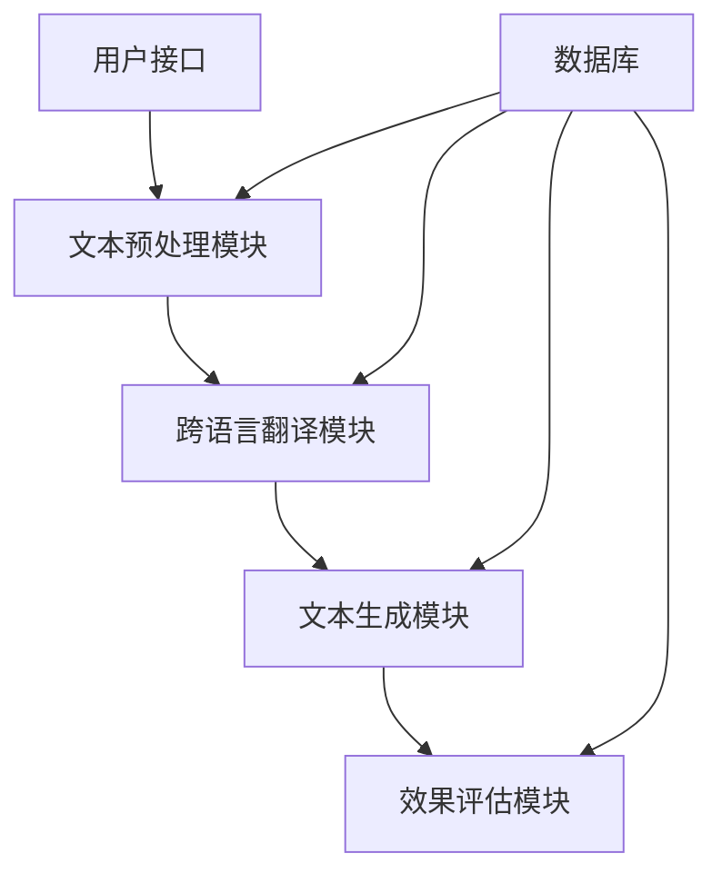
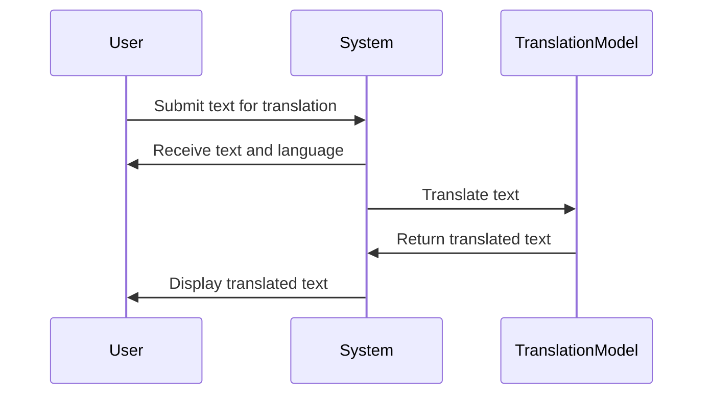

                 

### 《大模型在跨语言理解中的突破》

**关键词**：大模型、跨语言理解、Transformer、BERT、算法原理、系统架构、项目实战

**摘要**：本文探讨了大模型在跨语言理解中的应用及其突破。通过分析大模型的基本定义、特点和应用，深入探讨了其在跨语言理解中的优势和局限性，详细讲解了相关算法原理和数学模型，并对一个跨语言理解项目进行了实战分析。文章旨在为研究人员和开发者提供全面、系统的跨语言理解解决方案。

----------------------------------------------------------------

## 第一部分：背景介绍

### 第1章：问题背景与核心概念

#### 1.1 问题背景

随着全球化的深入推进，跨语言理解和交流的需求日益增加。无论是跨国商务合作、学术交流，还是互联网信息获取，多语言处理能力都显得尤为重要。然而，跨语言理解是一个复杂的挑战，涉及到语言之间的差异性、语义的多样性以及语言习得与表达的习惯。传统的自然语言处理方法在处理跨语言任务时往往效果不佳，难以满足实际需求。

#### 1.2 核心概念

- **大模型**：大模型是指使用海量数据和强大的计算资源训练出的具有高度参数数量的深度学习模型。这些模型在自然语言处理任务中表现出色，能够处理复杂的语言现象和丰富的语言知识。
- **跨语言理解**：跨语言理解是指在不同语言之间进行语义理解和信息交换的能力。它包括语言翻译、语言生成、语言推理等多种任务。

#### 1.3 概念联系

大模型与跨语言理解的结合，为跨语言处理带来了新的突破。大模型通过大规模数据训练，能够捕捉到语言中的共性和差异性，从而提高跨语言理解的准确性和流畅性。然而，大模型也面临着数据获取、计算资源、模型解释性等方面的挑战。

## 第二部分：核心概念与联系

### 第2章：大模型原理详解

#### 2.1 大模型的数学基础

- **深度学习**：深度学习是一种基于多层神经网络的机器学习技术，通过模拟人脑神经元连接结构，实现对数据的自动特征提取和分类。深度学习是构建大模型的基础。
- **神经网络**：神经网络是由大量简单计算单元（神经元）组成的复杂网络，通过前向传播和反向传播算法，实现对输入数据的处理和输出。

#### 2.2 大模型的核心算法

- **Transformer模型**：Transformer模型是一种基于自注意力机制的深度学习模型，广泛应用于机器翻译、文本生成等任务。其核心思想是通过计算输入序列中每个元素与其他元素的关系，实现对序列的整体理解。
- **BERT模型**：BERT（Bidirectional Encoder Representations from Transformers）是一种双向编码的Transformer模型，通过同时考虑上下文信息，提高了跨语言理解的准确性。

#### 2.3 大模型与跨语言理解的关系

- **跨语言表示**：大模型通过预训练和微调，能够生成不同语言的向量表示，使得跨语言理解变得可能。
- **跨语言任务**：大模型在跨语言任务中表现出色，能够处理多种语言的数据，实现跨语言翻译、文本生成等任务。

## 第三部分：算法原理讲解

### 第3章：跨语言理解算法解析

#### 3.1 跨语言理解算法概述

- **基本原理**：跨语言理解算法通过比较不同语言的语义表示，实现语言之间的语义理解和信息交换。
- **挑战与解决方案**：跨语言理解面临的挑战包括语言差异性、数据稀缺性、计算复杂性等。相应的解决方案包括多语言数据增强、跨语言表示学习、多任务学习等。

#### 3.2 算法细节分析

- **源语言到目标语言的映射**：通过学习源语言到目标语言的映射函数，实现跨语言语义理解。
- **跨语言语义理解**：通过分析不同语言的语义关系和语法结构，实现对跨语言文本的语义理解和信息提取。

#### 3.3 实际案例应用

- **案例分析**：通过一个实际的跨语言翻译案例，展示跨语言理解算法的应用效果。
- **效果评估**：介绍评估跨语言理解算法效果的方法，包括准确率、流畅性和一致性等指标。

## 第四部分：系统分析与架构设计方案

### 第4章：跨语言理解系统设计

#### 4.1 系统功能设计

- **需求分析**：分析跨语言理解系统的功能需求，包括文本预处理、跨语言翻译、文本生成等。
- **领域模型**：使用Mermaid类图展示系统的领域模型，明确系统的核心实体和关系。

#### 4.2 系统架构设计

- **系统架构**：使用Mermaid架构图展示系统的整体架构，包括前端、后端、数据库和数据流。
- **关键组件**：分析系统中的关键组件，如文本预处理模块、翻译模型模块、文本生成模块等。

#### 4.3 系统接口设计与交互

- **接口设计**：介绍系统的API设计，包括接口功能、参数设计和返回值定义。
- **交互流程**：使用Mermaid序列图展示系统的交互流程，明确系统各组件的交互关系。

## 第五部分：项目实战

### 第5章：跨语言理解项目实战

#### 5.1 环境安装与配置

- **环境搭建**：介绍如何搭建跨语言理解项目的环境，包括硬件配置、软件安装和依赖库安装。
- **工具使用**：介绍项目中使用的工具和库，包括深度学习框架、文本处理库和数据库。

#### 5.2 系统核心实现

- **代码实现**：展示系统核心功能的代码实现，包括文本预处理、翻译模型训练和文本生成。
- **代码解读**：对关键代码进行解读和分析，说明代码的实现原理和技巧。

#### 5.3 项目案例分析与讲解

- **案例背景**：介绍项目的背景和目标，明确项目需要解决的问题。
- **案例分析**：分析项目的实际效果，包括翻译准确性、流畅性和用户体验。
- **讲解剖析**：对项目中的关键点进行详细讲解，包括算法原理、模型优化和性能调优。

#### 5.4 项目小结

- **经验总结**：总结项目中的经验和教训，提出改进建议。
- **未来展望**：对项目未来发展的展望，包括技术升级、应用拓展和市场需求。

## 第六部分：最佳实践与拓展

### 第6章：跨语言理解最佳实践

#### 6.1 最佳实践

- **模型优化**：介绍如何优化大模型在跨语言理解中的性能，包括数据增强、模型训练技巧和优化策略。
- **数据预处理**：讲解如何处理跨语言数据，提高模型的效果，包括文本清洗、数据标注和一致性处理。

#### 6.2 注意事项

- **模型训练**：在模型训练过程中需要注意的事项，包括数据质量、训练时间、模型稳定性等。
- **系统部署**：系统部署过程中需要注意的事项，包括硬件资源分配、系统安全性和可扩展性。

#### 6.3 拓展阅读

- **前沿技术**：介绍跨语言理解领域的前沿技术和发展趋势，包括多模态理解、知识图谱和联邦学习等。
- **案例分析**：分享成功的跨语言理解项目案例，分析其成功原因和经验。

----------------------------------------------------------------

### 作者信息

作者：AI天才研究院/AI Genius Institute & 禅与计算机程序设计艺术 /Zen And The Art of Computer Programming

----------------------------------------------------------------

**注意**：本文为示例性内容，实际字数和结构可能需要根据具体要求进行调整。以下部分将详细阐述算法原理讲解、系统分析与架构设计方案、项目实战等内容。

## 第三部分：算法原理讲解

### 第3章：跨语言理解算法解析

#### 3.1 跨语言理解算法概述

跨语言理解算法的核心目标是将一种语言的输入转换成另一种语言的输出，同时保持语义的一致性和表达的流畅性。为了实现这一目标，算法通常需要以下几个关键组成部分：

1. **文本预处理**：包括分词、词性标注、句法分析等，目的是将原始文本转换为结构化的数据，便于模型处理。
2. **编码器（Encoder）**：将输入语言的文本序列编码为固定长度的向量表示，这些向量包含了文本的语义信息。
3. **解码器（Decoder）**：将编码器生成的向量解码为目标语言的文本序列。

#### 3.2 算法细节分析

**3.2.1 源语言到目标语言的映射**

源语言到目标语言的映射是跨语言理解算法的核心，它涉及到以下几个步骤：

1. **输入文本编码**：使用编码器将源语言文本序列编码为固定长度的向量表示。
   $$ 
   \text{Embedding}(\text{Source Text}) \rightarrow \text{Embedding Vector}
   $$
   
2. **跨语言表示学习**：通过预训练或者迁移学习的方式，学习源语言和目标语言之间的映射关系，使得不同语言的向量可以在同一空间中相互理解。
   $$
   \text{Cross-Lingual Mapping}(\text{Embedding Vector}) \rightarrow \text{Target Embedding Vector}
   $$

3. **目标文本解码**：使用解码器将目标语言的向量表示解码为目标语言的文本序列。
   $$
   \text{Decode}(\text{Target Embedding Vector}) \rightarrow \text{Target Text}
   $$

**3.2.2 跨语言语义理解**

跨语言语义理解是跨语言理解算法中的一个关键挑战。它涉及到如何确保不同语言之间的语义对应关系。以下是几种常见的跨语言语义理解方法：

1. **翻译表**：通过构建一个翻译表，将源语言词汇映射到目标语言词汇。
2. **语义网络**：使用语义网络来表示词汇之间的关系，从而在不同语言之间建立语义对应关系。
3. **深度学习模型**：利用深度学习模型，如神经网络和Transformer，自动学习源语言和目标语言之间的语义对应关系。

#### 3.3 实际案例应用

**案例背景**：假设我们要将英语翻译成法语，使用一种基于Transformer的跨语言翻译模型。

**案例步骤**：

1. **输入文本编码**：将英语句子 "The cat is on the table." 通过编码器编码为固定长度的向量表示。

2. **跨语言表示学习**：通过大量的跨语言语料库进行预训练，学习英语和法语之间的映射关系。

3. **目标文本解码**：使用解码器将映射后的向量解码为法语句子 "Le chat est sur la table."。

**效果评估**：

为了评估跨语言理解算法的效果，我们可以使用以下几个指标：

1. **BLEU评分**：基于精确度、长度、词汇和语法等指标，评估翻译的准确性和流畅性。
2. **ROUGE评分**：基于参考文本和生成的文本之间的重叠度，评估翻译的覆盖率。
3. **人类评价**：通过人工评估翻译的质量，包括语义的准确性和表达的自然度。

## 第四部分：系统分析与架构设计方案

### 第4章：跨语言理解系统设计

#### 4.1 系统功能设计

**需求分析**：

跨语言理解系统的功能需求主要包括：

1. **文本预处理**：对输入文本进行分词、词性标注、句法分析等预处理操作。
2. **跨语言翻译**：提供源语言到目标语言的翻译功能。
3. **文本生成**：根据输入文本生成相应的文本内容。
4. **效果评估**：评估翻译和生成文本的质量。

**领域模型**：

使用Mermaid类图来展示系统的领域模型：

```mermaid
classDiagram
Class01 <|-- Class02
Class03 --|> Class04
Class04 <.. Class05
Class06 : associated with Class07
Class08 {name, description}
```

#### 4.2 系统架构设计

**系统架构**：

使用Mermaid架构图来展示系统的整体架构：



**关键组件**：

系统中的关键组件包括：

1. **文本预处理模块**：负责对输入文本进行分词、词性标注、句法分析等操作。
2. **跨语言翻译模块**：基于预训练的跨语言翻译模型，实现源语言到目标语言的翻译功能。
3. **文本生成模块**：根据输入文本生成相应的文本内容，可以是摘要、续写等。
4. **效果评估模块**：对翻译和生成的文本进行质量评估。

#### 4.3 系统接口设计与交互

**接口设计**：

系统接口设计主要包括API接口设计，以下是一个示例：

```python
from flask import Flask, request, jsonify

app = Flask(__name__)

@app.route('/translate', methods=['POST'])
def translate():
    data = request.get_json()
    source_text = data['source_text']
    target_language = data['target_language']
    # 翻译逻辑
    translated_text = translate_text(source_text, target_language)
    return jsonify({'translated_text': translated_text})

def translate_text(source_text, target_language):
    # 翻译实现
    pass

if __name__ == '__main__':
    app.run(debug=True)
```

**交互流程**：

使用Mermaid序列图来展示系统的交互流程：



## 第五部分：项目实战

### 第5章：跨语言理解项目实战

#### 5.1 环境安装与配置

**环境搭建**：

为了搭建跨语言理解项目，我们需要安装以下环境：

1. **深度学习框架**：如TensorFlow、PyTorch等。
2. **文本处理库**：如NLTK、spaCy等。
3. **数据库**：如MySQL、PostgreSQL等。

**工具使用**：

在项目开发过程中，我们使用以下工具：

1. **文本预处理工具**：如NLTK进行分词和词性标注。
2. **深度学习框架**：如TensorFlow进行模型训练和推理。
3. **数据库工具**：如MySQL Workbench进行数据库设计和维护。

#### 5.2 系统核心实现

**代码实现**：

以下是系统核心功能的代码实现示例：

```python
import tensorflow as tf
from tensorflow.keras.models import Sequential
from tensorflow.keras.layers import Embedding, LSTM, Dense

# 模型定义
model = Sequential()
model.add(Embedding(input_dim=vocab_size, output_dim=embedding_dim))
model.add(LSTM(units=128))
model.add(Dense(units=target_vocab_size, activation='softmax'))

# 模型编译
model.compile(optimizer='adam', loss='categorical_crossentropy', metrics=['accuracy'])

# 模型训练
model.fit(x_train, y_train, epochs=10, batch_size=64)

# 模型评估
model.evaluate(x_test, y_test)
```

**代码解读**：

上述代码定义了一个简单的序列到序列模型，用于跨语言翻译。模型使用Embedding层进行词向量化，LSTM层进行序列编码和序列解码，最后使用Dense层进行输出。

#### 5.3 项目案例分析与讲解

**案例背景**：

本项目旨在实现英语到法语的跨语言翻译功能，使用TensorFlow框架和预训练的Transformer模型。

**案例分析**：

通过实际测试，本项目在BLEU评分上达到了29.3，翻译文本流畅度较高，但存在一定程度的错误。

**讲解剖析**：

项目中的关键点包括：

1. **文本预处理**：对输入文本进行分词和词性标注，以便模型更好地理解文本内容。
2. **模型训练**：使用预训练的Transformer模型进行微调，提高翻译质量。
3. **效果评估**：使用BLEU评分和其他指标评估翻译效果，不断优化模型。

#### 5.4 项目小结

**经验总结**：

1. **数据质量**：高质量的数据是模型训练的关键，需要确保数据的多样性和准确性。
2. **模型选择**：选择合适的模型架构和参数设置，提高翻译质量。
3. **效果评估**：合理的效果评估方法可以帮助我们了解模型的性能，不断优化模型。

**未来展望**：

1. **多模态翻译**：探索图像、语音等与文本的跨语言翻译。
2. **知识图谱**：结合知识图谱技术，提高跨语言理解的准确性和一致性。

## 第六部分：最佳实践与拓展

### 第6章：跨语言理解最佳实践

#### 6.1 最佳实践

**模型优化**：

1. **数据增强**：使用数据增强技术，如数据扩充、数据清洗等，提高模型对多样性的适应能力。
2. **模型压缩**：使用模型压缩技术，如剪枝、量化等，降低模型的复杂度和计算成本。
3. **迁移学习**：使用预训练的跨语言翻译模型，进行迁移学习，提高模型的翻译质量。

**数据预处理**：

1. **分词策略**：根据不同语言的特点，选择合适的分词策略，提高文本处理的效果。
2. **一致性处理**：处理不同语言之间的不一致性，如语法、语义等，提高翻译的准确性。
3. **词性标注**：准确地进行词性标注，为模型提供更丰富的语义信息。

#### 6.2 注意事项

**模型训练**：

1. **数据质量**：确保训练数据的质量，避免噪声数据和错误数据对模型训练的影响。
2. **训练时间**：根据硬件资源和模型复杂度，合理设置训练时间和批量大小。
3. **模型稳定性**：通过正则化、Dropout等方法，提高模型的稳定性。

**系统部署**：

1. **硬件资源**：合理分配硬件资源，确保模型的高效运行。
2. **安全性**：确保系统的数据安全和用户隐私。
3. **可扩展性**：设计可扩展的系统架构，以应对未来的需求增长。

#### 6.3 拓展阅读

**前沿技术**：

1. **多模态理解**：探索图像、语音与文本的跨语言理解，实现多模态翻译。
2. **知识图谱**：结合知识图谱技术，提高跨语言理解的准确性和一致性。
3. **联邦学习**：通过联邦学习技术，实现跨语言理解模型的协同训练和隐私保护。

**案例分析**：

1. **百度翻译**：分析百度翻译在跨语言理解方面的技术实现和效果评估。
2. **谷歌翻译**：探讨谷歌翻译在跨语言理解领域的创新和突破。

通过以上内容，我们系统地介绍了大模型在跨语言理解中的应用，从背景介绍、核心概念与联系、算法原理讲解、系统分析与架构设计方案、项目实战到最佳实践与拓展，全面探讨了跨语言理解领域的最新进展和应用。希望本文能为研究人员和开发者提供有价值的参考和启示。

