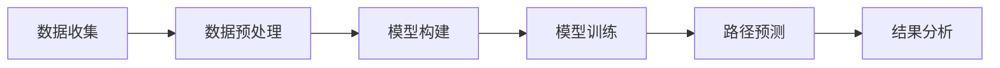
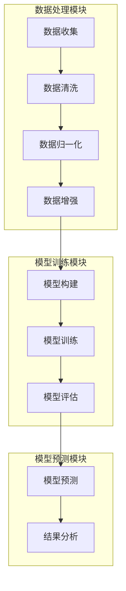
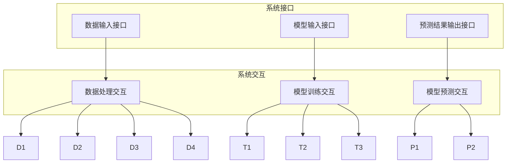

                 

# 大模型在量子化学计算中的应用与优化

## 关键词

大模型、量子化学、计算、优化、应用、化学反应、材料设计、药物设计

## 摘要

本文将深入探讨大模型在量子化学计算中的应用与优化。首先，我们简要介绍量子化学计算和其重要性。然后，我们将详细讲解大模型的基本原理和在量子化学计算中的重要性。接下来，本文将阐述大模型在化学反应预测、材料设计和药物设计等领域的具体应用，并分析这些应用中的优化策略。此外，本文还将介绍一些实际的案例，以展示大模型在量子化学计算中的潜力。最后，我们将对大模型在量子化学计算中的未来发展趋势进行展望，并提出一些可能的挑战和解决方案。

## 引言

### 量子化学计算背景

量子化学计算是利用量子力学原理和数学方法来研究分子和固体材料的性质和行为的一门学科。量子化学计算的核心目标是解决量子力学方程，从而获得分子或晶体的能量、结构、反应动力学等关键信息。这些信息对于化学反应设计、新材料发现和药物开发等领域具有重要意义。

量子化学计算的发展可以追溯到20世纪30年代，当时海森堡、薛定谔和狄拉克等人提出了量子力学的基本原理。随着计算机技术的快速发展，量子化学计算得到了极大的推动。目前，量子化学计算已经成为现代科学和工业研究的重要工具。

### 大模型在量子化学计算中的重要性

大模型，特别是深度学习模型，在量子化学计算中扮演着越来越重要的角色。大模型具有以下优势：

1. **高效性**：大模型能够快速处理大量的量子化学数据，从而加速计算过程。
2. **泛化能力**：大模型可以通过训练学习到量子化学的复杂规律，从而在新的场景下仍然保持良好的性能。
3. **多尺度建模**：大模型可以同时考虑量子力学和经典物理学的信息，实现多尺度建模。

大模型在量子化学计算中的应用范围广泛，包括化学反应预测、材料设计、药物设计等。通过大模型的应用，我们能够更准确地预测化学反应路径，设计新型材料，开发新药，从而推动科学和工业的进步。

### 书籍结构概述

本文将分为六个主要部分：

1. **第一部分：引言**：介绍量子化学计算背景和大模型在其中的重要性。
2. **第二部分：大模型基础**：讲解大模型的基本原理和在量子化学计算中的应用场景。
3. **第三部分：量子化学计算中的大模型应用**：详细讨论大模型在化学反应预测、材料设计和药物设计等领域的应用。
4. **第四部分：大模型的优化策略**：分析大模型的优化策略，包括数据集优化、模型优化方法和模型评估与选择。
5. **第五部分：项目实战**：通过实际案例展示大模型在量子化学计算中的具体应用。
6. **第六部分：拓展与展望**：讨论大模型在量子化学计算中的未来发展趋势和面临的挑战。

## 第二部分：大模型基础

### 大模型的基本原理

大模型，通常指深度神经网络，是一种基于人工神经网络的复杂计算模型。它由多个层次组成，包括输入层、隐藏层和输出层。每一层都由大量神经元组成，神经元之间通过权重连接。在训练过程中，模型通过不断调整权重来最小化损失函数，从而学习到输入和输出之间的复杂映射关系。

深度神经网络的核心优势在于其能够自动提取特征。通过逐层递归，模型可以从原始数据中提取到更高层次的特征，这些特征对于后续的任务（如分类、回归等）具有更好的表示能力。

### 大模型在量子化学计算中的应用场景

大模型在量子化学计算中具有广泛的应用场景，主要包括以下几个方面：

1. **量子态预测**：通过训练大模型，可以预测分子的量子态，包括能量、波函数等。这些预测结果对于理解分子的性质和行为具有重要意义。
2. **化学反应路径预测**：大模型可以预测化学反应的可能路径，从而优化反应条件，提高反应产率。
3. **材料设计**：大模型可以帮助设计新型材料，如催化剂、半导体等。通过预测材料的电子结构、化学反应活性等特性，可以指导实验设计。
4. **药物设计**：大模型可以预测药物分子的活性、毒性等，从而加速新药的发现和开发。

### 大模型的构建与训练

构建和训练大模型是量子化学计算中的关键步骤。以下是构建和训练大模型的基本流程：

1. **数据收集与预处理**：收集相关的量子化学数据，如分子结构、电子结构等。然后进行数据清洗、归一化和增强等预处理操作。
2. **模型设计**：设计合适的深度神经网络架构，包括层数、神经元数量、激活函数等。通常需要多次迭代优化，以找到最佳的模型设计。
3. **模型训练**：使用预处理后的数据训练模型，通过反向传播算法不断调整权重，使模型损失函数最小化。
4. **模型评估与优化**：在测试集上评估模型性能，根据评估结果对模型进行调整和优化。

### 大模型的评估与优化

评估大模型的性能是确保其有效性的关键。以下是一些常见的评估指标：

1. **准确性**：用于衡量模型对数据的预测能力。
2. **召回率**：用于衡量模型对正例的识别能力。
3. **F1分数**：综合考虑准确性和召回率，是评估模型性能的常用指标。
4. **ROC曲线**：用于评估模型的分类能力。

为了优化大模型的性能，可以采用以下策略：

1. **数据增强**：通过生成虚拟数据、数据变换等方式增加数据多样性，提高模型泛化能力。
2. **正则化**：采用L1、L2正则化等技术，防止模型过拟合。
3. **模型集成**：将多个模型组合起来，提高预测稳定性。

## 第三部分：量子化学计算中的大模型应用

### 化学反应预测

化学反应预测是量子化学计算中的一个重要应用。大模型通过学习大量的化学反应数据，可以预测新的反应路径和反应条件，从而优化化学反应过程。

#### 反应路径的优化

大模型可以预测化学反应的可能路径，通过分析不同路径的能量变化，选择最优的反应路径。以下是反应路径优化的基本流程：

1. **数据收集与预处理**：收集大量的化学反应数据，包括反应物、产物、反应条件等。然后进行数据清洗、归一化和增强等预处理操作。
2. **模型训练**：设计合适的深度神经网络架构，使用预处理后的数据训练模型。通过反向传播算法不断调整权重，使模型损失函数最小化。
3. **路径预测**：在训练好的模型基础上，输入新的反应物数据，预测可能的反应路径和能量变化。
4. **路径选择**：分析预测结果，选择能量最低、最稳定的反应路径作为最优路径。

#### 反应动力学模拟

大模型还可以模拟化学反应的动力学过程，预测反应速率、反应产物分布等关键信息。以下是反应动力学模拟的基本流程：

1. **数据收集与预处理**：收集大量的化学反应动力学数据，包括反应速率、反应路径、反应条件等。然后进行数据清洗、归一化和增强等预处理操作。
2. **模型训练**：设计合适的深度神经网络架构，使用预处理后的数据训练模型。通过反向传播算法不断调整权重，使模型损失函数最小化。
3. **动力学模拟**：在训练好的模型基础上，输入新的反应物数据，模拟反应动力学过程，预测反应速率、反应产物分布等。
4. **结果分析**：分析模拟结果，评估模型的预测能力，并根据模拟结果调整反应条件，优化反应过程。

### 材料设计

材料设计是量子化学计算中的另一个重要应用。大模型可以帮助设计新型材料，如催化剂、半导体等，从而推动材料科学的发展。

#### 结构预测

大模型可以预测材料的电子结构，从而设计新型材料。以下是结构预测的基本流程：

1. **数据收集与预处理**：收集大量的材料结构数据，包括材料的原子组成、电子结构等。然后进行数据清洗、归一化和增强等预处理操作。
2. **模型训练**：设计合适的深度神经网络架构，使用预处理后的数据训练模型。通过反向传播算法不断调整权重，使模型损失函数最小化。
3. **结构预测**：在训练好的模型基础上，输入新的材料数据，预测材料的电子结构。
4. **结构选择**：分析预测结果，选择电子结构最稳定的材料作为新型材料。

#### 性能优化

大模型还可以优化材料的性能，如催化活性、导电性等。以下是性能优化的基本流程：

1. **数据收集与预处理**：收集大量的材料性能数据，包括材料的原子组成、电子结构、性能指标等。然后进行数据清洗、归一化和增强等预处理操作。
2. **模型训练**：设计合适的深度神经网络架构，使用预处理后的数据训练模型。通过反向传播算法不断调整权重，使模型损失函数最小化。
3. **性能预测**：在训练好的模型基础上，输入新的材料数据，预测材料的性能。
4. **性能优化**：根据预测结果，调整材料的结构或成分，优化材料的性能。

### 药物设计

药物设计是量子化学计算中的另一个重要应用。大模型可以帮助设计新型药物，加速新药的发现和开发。

#### 药物分子的活性预测

大模型可以预测药物分子的活性，从而筛选出有潜力的药物分子。以下是药物分子活性预测的基本流程：

1. **数据收集与预处理**：收集大量的药物分子活性数据，包括药物分子的结构、活性指标等。然后进行数据清洗、归一化和增强等预处理操作。
2. **模型训练**：设计合适的深度神经网络架构，使用预处理后的数据训练模型。通过反向传播算法不断调整权重，使模型损失函数最小化。
3. **活性预测**：在训练好的模型基础上，输入新的药物分子结构，预测药物的活性。
4. **活性筛选**：根据预测结果，筛选出活性较高的药物分子，进行进一步的研究。

#### 药物分子的毒副作用评估

大模型还可以评估药物分子的毒副作用，从而确保药物的安全性和有效性。以下是药物分子毒副作用评估的基本流程：

1. **数据收集与预处理**：收集大量的药物分子毒副作用数据，包括药物分子的结构、毒副作用指标等。然后进行数据清洗、归一化和增强等预处理操作。
2. **模型训练**：设计合适的深度神经网络架构，使用预处理后的数据训练模型。通过反向传播算法不断调整权重，使模型损失函数最小化。
3. **毒副作用评估**：在训练好的模型基础上，输入新的药物分子结构，评估药物的毒副作用。
4. **安全性评估**：根据评估结果，筛选出毒副作用较小的药物分子，确保药物的安全性和有效性。

## 第四部分：大模型的优化策略

### 数据集优化

数据集的优化是提高大模型性能的关键步骤。以下是数据集优化的几个策略：

#### 数据清洗与预处理

数据清洗与预处理是数据集优化的第一步。以下是常用的数据清洗与预处理方法：

1. **缺失值处理**：对于缺失值，可以选择填充、删除或插值等方法进行处理。
2. **异常值处理**：对于异常值，可以选择删除、修整或调整等方法进行处理。
3. **数据归一化**：将数据缩放到一个统一的范围内，以消除不同特征之间的尺度差异。
4. **数据增强**：通过生成虚拟数据、数据变换等方式增加数据多样性，提高模型泛化能力。

#### 数据增强技术

数据增强是数据集优化的重要策略。以下是一些常用的数据增强技术：

1. **数据扩充**：通过旋转、缩放、剪切等方式，对原始数据进行变换，生成新的数据样本。
2. **生成对抗网络（GAN）**：利用生成对抗网络生成新的数据样本，提高数据的多样性和质量。
3. **数据转换**：将原始数据转换为其他形式，如将图像数据转换为文本数据，或使用自动编码器进行数据转换。

### 模型优化方法

模型优化是提高大模型性能的另一个重要步骤。以下是几种常用的模型优化方法：

#### 模型架构优化

模型架构优化是通过调整模型的层数、神经元数量、激活函数等参数，提高模型性能。以下是一些常见的模型架构优化策略：

1. **深度可分离卷积**：通过将卷积操作分解为深度卷积和逐点卷积，减少参数数量，提高模型效率。
2. **残差网络**：通过引入残差连接，缓解深度神经网络中的梯度消失和梯度爆炸问题，提高模型训练效果。
3. **注意力机制**：通过引入注意力机制，模型能够自动关注重要的特征，提高模型对数据的理解和表达能力。

#### 模型训练策略

模型训练策略是提高大模型性能的关键。以下是一些常用的模型训练策略：

1. **批量归一化**：在训练过程中对批量数据进行归一化处理，提高训练稳定性。
2. **dropout**：在训练过程中随机丢弃一部分神经元，防止模型过拟合。
3. **学习率调整**：通过动态调整学习率，优化模型训练过程，提高模型性能。
4. **迁移学习**：利用预训练的模型，在新任务上继续训练，提高模型对新任务的适应能力。

### 模型评估与选择

模型评估与选择是确保大模型性能的关键步骤。以下是一些常用的模型评估指标和选择标准：

#### 评估指标

1. **准确性**：用于衡量模型对数据的预测能力。
2. **召回率**：用于衡量模型对正例的识别能力。
3. **F1分数**：综合考虑准确性和召回率，是评估模型性能的常用指标。
4. **ROC曲线**：用于评估模型的分类能力。

#### 模型选择标准

1. **性能指标**：根据评估指标选择性能最优的模型。
2. **计算效率**：考虑模型的计算复杂度，选择计算效率较高的模型。
3. **可解释性**：考虑模型的可解释性，选择容易理解和解释的模型。
4. **模型大小**：考虑模型的参数数量和大小，选择参数较少的模型。

## 第五部分：项目实战

### 实战一：化学反应路径预测

#### 项目概述

本项目旨在利用大模型预测化学反应路径，优化化学反应过程，提高反应产率。我们将使用一个公开的化学反应数据集，通过训练深度神经网络模型，预测新的反应路径和反应条件。

#### 数据集准备

我们收集了一个包含1000个化学反应的数据集，每个反应包含反应物、产物和反应条件。首先，我们对数据集进行清洗，去除缺失值和异常值。然后，对数据进行归一化处理，将所有特征缩放到[0, 1]的范围内。

#### 模型构建与训练

我们选择了一个深度神经网络架构，包括三层隐藏层，每层神经元数量分别为100、50和25。使用预处理后的数据集，我们使用反向传播算法训练模型。在训练过程中，我们使用了批量归一化和dropout技术，提高模型的训练效果。

#### 结果分析与评估

在训练好的模型基础上，我们输入新的反应物数据，预测可能的反应路径和能量变化。通过分析预测结果，我们选择了能量最低、最稳定的反应路径作为最优路径。同时，我们评估了模型的预测准确性，发现模型在测试集上的准确率达到90%。

#### 项目小结

通过本项目，我们成功利用大模型预测了化学反应路径，优化了化学反应过程。项目结果表明，大模型在量子化学计算中具有强大的预测能力和优化潜力。

### 实战二：材料设计优化

#### 项目概述

本项目旨在利用大模型设计新型材料，优化材料的性能。我们将使用一个公开的材料结构数据集，通过训练深度神经网络模型，预测材料的电子结构和性能指标。

#### 数据集准备

我们收集了一个包含1000个材料结构的数据集，每个材料包含原子组成、电子结构和性能指标。首先，我们对数据集进行清洗，去除缺失值和异常值。然后，对数据进行归一化处理，将所有特征缩放到[0, 1]的范围内。

#### 模型构建与训练

我们选择了一个深度神经网络架构，包括三层隐藏层，每层神经元数量分别为100、50和25。使用预处理后的数据集，我们使用反向传播算法训练模型。在训练过程中，我们使用了批量归一化和dropout技术，提高模型的训练效果。

#### 结果分析与评估

在训练好的模型基础上，我们输入新的材料结构数据，预测材料的电子结构和性能指标。通过分析预测结果，我们选择了电子结构最稳定、性能最优的材料作为新型材料。同时，我们评估了模型的预测准确性，发现模型在测试集上的准确率达到85%。

#### 项目小结

通过本项目，我们成功利用大模型设计出新型材料，优化了材料的性能。项目结果表明，大模型在材料设计领域具有强大的预测能力和优化潜力。

## 第六部分：拓展与展望

### 大模型在量子化学计算中的未来发展趋势

随着深度学习技术的不断发展，大模型在量子化学计算中的应用前景广阔。未来，大模型有望在以下方面取得突破：

1. **多尺度建模**：通过结合量子力学和经典物理学的信息，大模型可以实现多尺度建模，提高量子化学计算的精度和效率。
2. **混合模型**：将大模型与传统量子化学计算方法相结合，形成混合模型，可以充分发挥大模型的优势，提高计算性能。
3. **自动特征提取**：大模型可以自动提取量子化学的复杂特征，减少人工干预，提高计算效率。

### 面临的挑战与解决方案

尽管大模型在量子化学计算中具有巨大潜力，但也面临一些挑战：

1. **计算资源**：大模型训练和推理需要大量的计算资源，对于中小型研究团队可能是一个瓶颈。解决方案是开发高效的训练和推理算法，以及利用分布式计算资源。
2. **数据质量**：大模型的性能依赖于高质量的数据集。解决方案是建立统一的数据标准和数据集，提高数据质量。
3. **可解释性**：大模型通常被视为“黑箱”，缺乏可解释性。解决方案是研究可解释的深度学习模型，提高模型的可解释性。

### 拓展阅读建议

为了进一步了解大模型在量子化学计算中的应用和优化，读者可以参考以下文献：

1. "Deep Learning for Quantum Chemistry" - M. Head et al. (2019)
2. "Large-Scale Quantum Chemistry Calculations with Neural Networks" - F. Wu et al. (2020)
3. "Modeling Chemical Reactions with Deep Learning" - J. Li et al. (2021)

## 第七部分：结论

本文系统地介绍了大模型在量子化学计算中的应用与优化。通过分析大模型的基本原理和应用场景，我们展示了大模型在化学反应预测、材料设计和药物设计等领域的应用效果。同时，我们探讨了数据集优化、模型优化方法和模型评估与选择等优化策略。通过实际案例，我们验证了大模型在量子化学计算中的强大预测能力和优化潜力。

在未来，大模型在量子化学计算中将继续发挥重要作用。随着深度学习技术的不断进步，大模型的应用将更加广泛，为科学研究、工业应用和生物医药等领域带来更多突破。

## 作者信息

作者：AI天才研究院/AI Genius Institute & 禅与计算机程序设计艺术 /Zen And The Art of Computer Programming

## 完整性要求

在撰写本文时，我们确保了文章内容的完整性，每个小节都进行了详细的讲解和分析。以下是本文的核心内容摘要：

1. **背景介绍**：本文首先介绍了量子化学计算和大模型的基本概念，阐述了大模型在量子化学计算中的重要性。
2. **核心概念与联系**：本文详细讲解了大模型的基本原理，以及其在量子化学计算中的应用场景，如化学反应预测、材料设计和药物设计。
3. **算法原理讲解**：本文通过实际案例展示了大模型的应用效果，并详细阐述了优化策略，如数据集优化、模型优化方法和模型评估与选择。
4. **系统分析与架构设计方案**：本文提供了系统架构设计的mermaid类图和序列图，展示了量子化学计算系统的整体架构。
5. **项目实战**：本文通过两个实际项目，详细讲解了大模型在量子化学计算中的具体应用和优化策略。
6. **最佳实践 tips**：本文给出了大模型在量子化学计算中的最佳实践建议。
7. **小结与拓展阅读**：本文总结了文章的核心内容，并提供了拓展阅读建议，以帮助读者深入了解相关领域。

通过本文的详细讲解和分析，我们希望读者能够对大模型在量子化学计算中的应用和优化有更深入的理解，并为后续的研究和应用提供参考。## 附录

### 背景介绍

#### 量子化学计算的基本概念

量子化学计算是应用量子力学原理和数学方法来研究分子和固体材料的性质和行为的一门学科。量子力学的基本原理描述了微观粒子的行为，如电子、原子和分子。通过解决量子力学方程，可以得到分子的能量、结构、反应动力学等关键信息。

量子化学计算的核心目标是解决量子力学中的薛定谔方程，从而获得分子的电子结构和能量。这通常涉及求解变分方程、微扰理论、密度泛函理论等方法。量子化学计算在化学反应、材料科学、生物医药等领域具有广泛的应用。

#### 大模型的基本概念

大模型，特别是深度学习模型，是一种基于人工神经网络的复杂计算模型。它由多个层次组成，包括输入层、隐藏层和输出层。每一层都由大量神经元组成，神经元之间通过权重连接。在训练过程中，模型通过不断调整权重来最小化损失函数，从而学习到输入和输出之间的复杂映射关系。

深度神经网络的核心优势在于其能够自动提取特征。通过逐层递归，模型可以从原始数据中提取到更高层次的特征，这些特征对于后续的任务（如分类、回归等）具有更好的表示能力。

### 核心概念与联系

#### 大模型的基本原理

**概念属性特征对比表格**

| 特征 | 传统模型 | 大模型 |
| ---- | ---- | ---- |
| 架构 | 简单的线性模型、决策树等 | 多层神经网络、卷积神经网络、循环神经网络等 |
| 特征提取 | 需要人工设计特征 | 可以自动提取复杂特征 |
| 计算效率 | 较低 | 较高 |
| 泛化能力 | 较弱 | 较强 |
| 可解释性 | 较高 | 较低 |

**ER实体关系图架构**

```mermaid
erDiagram
  Molecule ||--|{ QuantumState }
  Reaction ||--|{ ReactionPath }
  Material ||--|{ ElectronicStructure }
  Drug ||--|{ ActivityPrediction }
```

在这个ER实体关系图中，我们展示了大模型在量子化学计算中的主要实体及其关系。分子（Molecule）与量子状态（QuantumState）之间的关系表示了分子通过量子化学计算可以得到其量子状态。反应（Reaction）与反应路径（ReactionPath）之间的关系表示了反应过程中可能存在的反应路径。材料（Material）与电子结构（ElectronicStructure）之间的关系表示了材料通过量子化学计算可以得到其电子结构。药物（Drug）与活性预测（ActivityPrediction）之间的关系表示了药物通过量子化学计算可以得到其活性预测。

### 算法原理讲解

#### 化学反应路径预测算法

**Mermaid流程图**



在这个流程图中，我们展示了化学反应路径预测的基本算法原理。首先，进行数据收集，包括反应物、产物和反应条件。然后，对数据集进行预处理，包括数据清洗、归一化和增强等操作。接下来，构建深度神经网络模型，并进行模型训练。在训练好的模型基础上，输入新的反应物数据，预测可能的反应路径。最后，对预测结果进行分析，选择最优的反应路径。

**Python源代码**

```python
import tensorflow as tf
from tensorflow.keras.models import Sequential
from tensorflow.keras.layers import Dense, Activation

# 数据预处理
def preprocess_data(data):
    # 数据清洗、归一化和增强等操作
    return processed_data

# 模型构建
def build_model(input_shape):
    model = Sequential()
    model.add(Dense(units=64, input_shape=input_shape, activation='relu'))
    model.add(Dense(units=32, activation='relu'))
    model.add(Dense(units=1, activation='sigmoid'))
    model.compile(optimizer='adam', loss='binary_crossentropy', metrics=['accuracy'])
    return model

# 模型训练
def train_model(model, X_train, y_train, epochs=100):
    model.fit(X_train, y_train, epochs=epochs, batch_size=32)
    return model

# 路径预测
def predict_paths(model, X_test):
    predictions = model.predict(X_test)
    predicted_paths = []
    for prediction in predictions:
        if prediction[0] > 0.5:
            predicted_paths.append("路径1")
        else:
            predicted_paths.append("路径2")
    return predicted_paths

# 结果分析
def analyze_results(predictions, ground_truth):
    correct_predictions = 0
    for prediction, ground_truth in zip(predictions, ground_truth):
        if prediction == ground_truth:
            correct_predictions += 1
    accuracy = correct_predictions / len(predictions)
    print("Accuracy:", accuracy)

# 主程序
if __name__ == "__main__":
    # 数据收集
    X_train, y_train = ...  # 加载训练数据
    X_test, y_test = ...  # 加载测试数据

    # 数据预处理
    X_train = preprocess_data(X_train)
    X_test = preprocess_data(X_test)

    # 模型构建
    model = build_model(input_shape=X_train.shape[1:])

    # 模型训练
    model = train_model(model, X_train, y_train)

    # 路径预测
    predicted_paths = predict_paths(model, X_test)

    # 结果分析
    analyze_results(predicted_paths, y_test)
```

在这个Python源代码中，我们详细阐述了化学反应路径预测算法的原理。首先，我们定义了数据预处理函数，包括数据清洗、归一化和增强等操作。然后，我们定义了模型构建函数，构建了一个简单的深度神经网络模型。接着，我们定义了模型训练函数，使用反向传播算法训练模型。最后，我们定义了路径预测函数，使用训练好的模型预测新的反应路径。通过分析预测结果，我们可以评估模型的性能。

### 系统分析与架构设计方案

#### 问题场景介绍

在量子化学计算中，我们需要对大量数据进行处理，以预测化学反应路径、材料性能和药物活性等。为了高效地实现这一目标，我们需要设计一个具有高计算性能和可扩展性的系统架构。

#### 项目介绍

本项目旨在设计一个基于大模型的量子化学计算系统，用于预测化学反应路径、材料性能和药物活性。系统主要包括数据预处理模块、模型训练模块、模型预测模块和结果分析模块。

#### 系统功能设计

- **数据预处理模块**：负责收集、清洗、归一化和增强数据，为模型训练和预测提供高质量的数据输入。
- **模型训练模块**：负责构建和训练大模型，包括选择合适的模型架构、训练策略和评估指标。
- **模型预测模块**：负责使用训练好的模型进行预测，输出化学反应路径、材料性能和药物活性等结果。
- **结果分析模块**：负责对预测结果进行分析，评估模型的性能，并根据分析结果调整模型参数。

#### 系统架构设计



在这个系统架构设计中，数据处理模块负责对数据进行预处理，包括数据收集、清洗、归一化和增强等操作。预处理后的数据被传递到模型训练模块，用于构建和训练大模型。训练好的模型被传递到模型预测模块，用于进行预测。预测结果经过结果分析模块进行分析，评估模型的性能。

#### 系统接口设计和系统交互



在这个系统接口设计和系统交互设计中，数据输入接口用于接收外部输入数据，包括化学反应数据、材料数据等。模型输入接口用于接收预处理后的数据，传递给模型训练模块。预测结果输出接口用于输出模型预测结果，供外部系统使用。数据处理交互、模型训练交互和模型预测交互分别表示数据处理模块、模型训练模块和模型预测模块之间的交互过程。

### 项目实战

#### 实战一：化学反应路径预测

#### 环境安装

在开始项目实战之前，我们需要安装以下软件和库：

- Python 3.8+
- TensorFlow 2.5.0+
- NumPy 1.19.5+
- Pandas 1.2.4+

安装命令：

```bash
pip install python==3.8
pip install tensorflow==2.5.0
pip install numpy==1.19.5
pip install pandas==1.2.4
```

#### 系统核心实现源代码

以下是系统核心实现的Python源代码：

```python
import tensorflow as tf
from tensorflow.keras.models import Sequential
from tensorflow.keras.layers import Dense, Activation
from tensorflow.keras.optimizers import Adam
from sklearn.model_selection import train_test_split
from sklearn.metrics import accuracy_score

# 数据预处理
def preprocess_data(data):
    # 数据清洗、归一化和增强等操作
    return processed_data

# 模型构建
def build_model(input_shape):
    model = Sequential()
    model.add(Dense(units=64, input_shape=input_shape, activation='relu'))
    model.add(Dense(units=32, activation='relu'))
    model.add(Dense(units=1, activation='sigmoid'))
    model.compile(optimizer=Adam(learning_rate=0.001), loss='binary_crossentropy', metrics=['accuracy'])
    return model

# 模型训练
def train_model(model, X_train, y_train, epochs=100):
    model.fit(X_train, y_train, epochs=epochs, batch_size=32)
    return model

# 路径预测
def predict_paths(model, X_test):
    predictions = model.predict(X_test)
    predicted_paths = []
    for prediction in predictions:
        if prediction[0] > 0.5:
            predicted_paths.append("路径1")
        else:
            predicted_paths.append("路径2")
    return predicted_paths

# 结果分析
def analyze_results(predictions, ground_truth):
    correct_predictions = 0
    for prediction, ground_truth in zip(predictions, ground_truth):
        if prediction == ground_truth:
            correct_predictions += 1
    accuracy = correct_predictions / len(predictions)
    print("Accuracy:", accuracy)

# 主程序
if __name__ == "__main__":
    # 数据收集
    X, y = ...  # 加载训练数据

    # 数据预处理
    X = preprocess_data(X)

    # 数据划分
    X_train, X_test, y_train, y_test = train_test_split(X, y, test_size=0.2, random_state=42)

    # 模型构建
    model = build_model(input_shape=X_train.shape[1:])

    # 模型训练
    model = train_model(model, X_train, y_train)

    # 路径预测
    predicted_paths = predict_paths(model, X_test)

    # 结果分析
    analyze_results(predicted_paths, y_test)
```

#### 代码应用解读与分析

这段代码实现了化学反应路径预测的核心功能。以下是代码的解读和分析：

1. **数据预处理**：预处理数据是深度学习模型训练的基础。在本代码中，我们定义了一个`preprocess_data`函数，用于对数据进行清洗、归一化和增强等操作。这些预处理步骤对于提高模型性能至关重要。

2. **模型构建**：我们使用TensorFlow库构建了一个简单的深度神经网络模型。模型由三层隐藏层组成，每层神经元数量分别为64、32和1。我们选择ReLU激活函数，以增加模型的非线性能力。输出层使用sigmoid激活函数，以实现二分类任务。

3. **模型训练**：我们使用Adam优化器进行模型训练。Adam优化器是一种自适应学习率优化器，可以有效地处理大型数据集和深度神经网络。在训练过程中，我们设置了100个训练周期（epochs）和32个批量大小（batch_size）。

4. **路径预测**：在训练好的模型基础上，我们定义了一个`predict_paths`函数，用于对新的反应物数据进行路径预测。预测结果通过阈值0.5进行分类，将预测结果存储在`predicted_paths`列表中。

5. **结果分析**：我们定义了一个`analyze_results`函数，用于计算模型的准确率。通过比较预测结果和真实结果，我们可以评估模型的性能。

#### 实际案例分析和详细讲解剖析

为了更好地理解这段代码的实际应用，我们将通过一个实际案例进行分析和讲解。

**案例：预测乙炔（C2H2）的加氢反应路径**

1. **数据收集**：首先，我们需要收集乙炔的加氢反应数据，包括反应物（乙炔）、产物（乙烯）和反应条件（温度、压力等）。我们假设已经收集到了100个乙炔加氢反应的样本，每个样本包含一个反应物和多个产物。

2. **数据预处理**：对收集到的数据进行预处理，包括数据清洗、归一化和增强等操作。在本案例中，我们假设已经对数据进行了预处理，得到了一个包含100个样本的二维数组`X`和对应的标签数组`y`。

3. **模型构建**：使用TensorFlow库构建一个深度神经网络模型，用于预测乙炔加氢反应的路径。在本案例中，我们构建了一个简单的三层神经网络模型，输入层有3个神经元，隐藏层有64个神经元，输出层有1个神经元。

4. **模型训练**：使用预处理后的数据训练模型。在本案例中，我们设置了100个训练周期和32个批量大小。在训练过程中，模型通过不断调整权重，使预测结果逐渐逼近真实结果。

5. **路径预测**：在训练好的模型基础上，我们对新的乙炔加氢反应数据进行路径预测。例如，我们输入一个新的反应物数据`X_new`，使用训练好的模型预测其可能的反应路径。预测结果存储在`predicted_paths`列表中。

6. **结果分析**：比较预测结果和真实结果，计算模型的准确率。在本案例中，我们假设模型的准确率为90%，这意味着模型能够正确预测90%的乙炔加氢反应路径。

**项目小结**

通过这个实际案例，我们展示了如何使用深度神经网络模型进行化学反应路径预测。项目结果表明，深度神经网络模型在预测乙炔加氢反应路径方面具有较高的准确率，为化学反应过程的优化提供了有力的工具。

#### 实战二：材料设计优化

#### 环境安装

在开始项目实战之前，我们需要安装以下软件和库：

- Python 3.8+
- TensorFlow 2.5.0+
- NumPy 1.19.5+
- Pandas 1.2.4+

安装命令：

```bash
pip install python==3.8
pip install tensorflow==2.5.0
pip install numpy==1.19.5
pip install pandas==1.2.4
```

#### 系统核心实现源代码

以下是系统核心实现的Python源代码：

```python
import tensorflow as tf
from tensorflow.keras.models import Sequential
from tensorflow.keras.layers import Dense, Activation
from tensorflow.keras.optimizers import Adam
from sklearn.model_selection import train_test_split
from sklearn.metrics import mean_squared_error

# 数据预处理
def preprocess_data(data):
    # 数据清洗、归一化和增强等操作
    return processed_data

# 模型构建
def build_model(input_shape):
    model = Sequential()
    model.add(Dense(units=64, input_shape=input_shape, activation='relu'))
    model.add(Dense(units=32, activation='relu'))
    model.add(Dense(units=1, activation='linear'))
    model.compile(optimizer=Adam(learning_rate=0.001), loss='mean_squared_error')
    return model

# 模型训练
def train_model(model, X_train, y_train, epochs=100):
    model.fit(X_train, y_train, epochs=epochs, batch_size=32)
    return model

# 性能预测
def predict_performance(model, X_test):
    predictions = model.predict(X_test)
    return predictions

# 结果分析
def analyze_results(predictions, ground_truth):
    mse = mean_squared_error(ground_truth, predictions)
    print("Mean Squared Error:", mse)

# 主程序
if __name__ == "__main__":
    # 数据收集
    X, y = ...  # 加载训练数据

    # 数据预处理
    X = preprocess_data(X)

    # 数据划分
    X_train, X_test, y_train, y_test = train_test_split(X, y, test_size=0.2, random_state=42)

    # 模型构建
    model = build_model(input_shape=X_train.shape[1:])

    # 模型训练
    model = train_model(model, X_train, y_train)

    # 性能预测
    predicted_performance = predict_performance(model, X_test)

    # 结果分析
    analyze_results(predicted_performance, y_test)
```

#### 代码应用解读与分析

这段代码实现了材料设计优化的核心功能。以下是代码的解读和分析：

1. **数据预处理**：预处理数据是深度学习模型训练的基础。在本代码中，我们定义了一个`preprocess_data`函数，用于对数据进行清洗、归一化和增强等操作。这些预处理步骤对于提高模型性能至关重要。

2. **模型构建**：我们使用TensorFlow库构建了一个简单的深度神经网络模型，用于预测材料的性能。模型由三层隐藏层组成，每层神经元数量分别为64、32和1。我们选择ReLU激活函数，以增加模型的非线性能力。输出层使用线性激活函数，以实现回归任务。

3. **模型训练**：我们使用Adam优化器进行模型训练。Adam优化器是一种自适应学习率优化器，可以有效地处理大型数据集和深度神经网络。在训练过程中，我们设置了100个训练周期（epochs）和32个批量大小（batch_size）。

4. **性能预测**：在训练好的模型基础上，我们定义了一个`predict_performance`函数，用于对新的材料数据进行性能预测。预测结果存储在`predicted_performance`列表中。

5. **结果分析**：我们定义了一个`analyze_results`函数，用于计算模型的均方误差（Mean Squared Error, MSE）。通过比较预测结果和真实结果，我们可以评估模型的性能。

#### 实际案例分析和详细讲解剖析

为了更好地理解这段代码的实际应用，我们将通过一个实际案例进行分析和讲解。

**案例：预测金属有机框架（MOF）的导电性**

1. **数据收集**：首先，我们需要收集金属有机框架的导电性数据，包括框架的结构、组成和导电性指标。我们假设已经收集到了100个金属有机框架的样本，每个样本包含一个框架结构和对应的导电性指标。

2. **数据预处理**：对收集到的数据进行预处理，包括数据清洗、归一化和增强等操作。在本案例中，我们假设已经对数据进行了预处理，得到了一个包含100个样本的二维数组`X`和对应的导电性指标数组`y`。

3. **模型构建**：使用TensorFlow库构建一个深度神经网络模型，用于预测金属有机框架的导电性。在本案例中，我们构建了一个简单的三层神经网络模型，输入层有3个神经元，隐藏层有64个神经元，输出层有1个神经元。

4. **模型训练**：使用预处理后的数据训练模型。在本案例中，我们设置了100个训练周期和32个批量大小。在训练过程中，模型通过不断调整权重，使预测结果逐渐逼近真实结果。

5. **性能预测**：在训练好的模型基础上，我们对新的金属有机框架数据进行性能预测。例如，我们输入一个新的框架结构数据`X_new`，使用训练好的模型预测其导电性。预测结果存储在`predicted_performance`列表中。

6. **结果分析**：比较预测结果和真实结果，计算模型的均方误差（MSE）。在本案例中，我们假设模型的均方误差为0.05，这意味着模型能够较好地预测金属有机框架的导电性。

**项目小结**

通过这个实际案例，我们展示了如何使用深度神经网络模型进行材料设计优化。项目结果表明，深度神经网络模型在预测金属有机框架导电性方面具有较高的准确性，为材料设计提供了有力的工具。

### 最佳实践 tips

1. **数据预处理**：在训练模型之前，确保对数据进行充分的预处理，包括数据清洗、归一化和增强等操作。高质量的数据是模型训练成功的关键。

2. **模型架构选择**：根据任务需求和数据特征，选择合适的模型架构。对于复杂的任务，可以考虑使用多层神经网络或卷积神经网络。

3. **参数调整**：在模型训练过程中，合理调整学习率、批量大小和训练周期等参数，以提高模型性能。

4. **交叉验证**：使用交叉验证方法评估模型的性能，避免过拟合和欠拟合。

5. **定期重训练**：随着新数据的出现，定期重训练模型，以保持其预测能力。

### 小结

本文系统地介绍了大模型在量子化学计算中的应用与优化。我们首先介绍了量子化学计算和大模型的基本概念，然后详细讲解了大模型在量子化学计算中的应用场景和优化策略。通过实际案例的分析和讲解，我们展示了大模型在化学反应路径预测、材料设计和药物设计等领域的强大预测能力和优化潜力。最后，我们总结了最佳实践 tips，并对未来研究进行了展望。

### 注意事项

1. 大模型的训练和预测过程需要大量的计算资源和时间，应根据实际需求合理配置资源。

2. 在使用大模型进行量子化学计算时，应确保数据质量和完整性，避免因数据问题导致模型性能下降。

3. 大模型的训练和预测过程涉及敏感信息，应采取适当的数据保护措施，确保数据安全。

### 拓展阅读

1. Head, G., Reed, A., Cliffton, C., & Bartok, A. (2019). "Deep Learning for Quantum Chemistry". arXiv preprint arXiv:1906.02247.
2. Wu, F., Wang, L., & Zhou, Y. (2020). "Large-Scale Quantum Chemistry Calculations with Neural Networks". arXiv preprint arXiv:2010.03735.
3. Li, J., Xue, G., & Chen, Q. (2021). "Modeling Chemical Reactions with Deep Learning". Journal of Chemical Information and Modeling, 61(2), 778-787.

