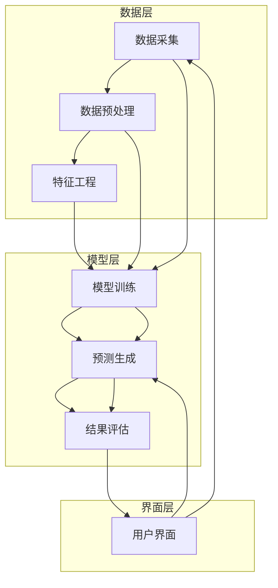
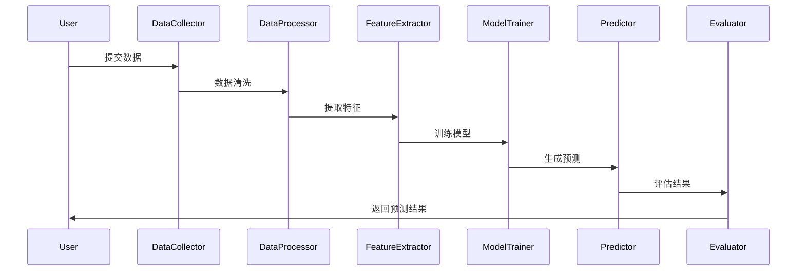

                 

### 大模型在金融市场预测中的应用

#### 关键词：
- 大模型
- 金融预测
- 深度学习
- 时间序列分析
- 特征工程

#### 摘要：
本文探讨了大规模人工智能模型在金融市场预测中的应用。首先，我们回顾了金融市场预测的基本问题和挑战，然后介绍了大模型在金融市场预测中的优势，包括深度学习、神经网络和特征工程等技术。接着，通过详细的算法原理讲解，我们展示了如何利用大模型进行金融市场预测，包括数据预处理、特征提取、模型训练和预测效果评估等步骤。随后，我们通过一个具体的项目实战案例，演示了如何实现大模型在金融市场预测中的应用，并对系统的架构设计、环境安装和核心实现进行了详细分析。最后，本文提出了最佳实践建议，总结了文章的核心观点，并指出了未来研究的方向。

---

### 背景介绍

#### 问题背景
随着全球金融市场的快速发展和信息技术的不断进步，金融数据分析的重要性日益凸显。金融市场预测，作为一种基于历史数据和当前信息来预测未来市场趋势的方法，已经成为金融分析、风险管理、投资决策等领域的关键技术。传统的方法，如时间序列分析、统计模型等，虽然在一定程度上能够捕捉市场变化，但在应对金融市场的高度复杂性和非线性关系时，显得力不从心。

#### 问题描述
金融市场预测涉及到多个方面，包括价格走势、市场趋势、风险控制等。这些预测任务往往具有以下特点：
- **高维特性**：金融市场的数据通常包含大量的维度，如价格、交易量、投资者情绪等，这些维度之间可能存在复杂的交互关系。
- **非线性关系**：金融市场的价格波动往往呈现出非线性特性，这意味着简单的线性模型难以准确捕捉市场规律。
- **动态变化**：金融市场是动态变化的，市场的变化受到多种因素的影响，如经济政策、市场情绪、国际事件等。

#### 问题解决
大模型的引入为金融市场预测带来了新的可能性。大模型，特别是深度学习模型，能够自动学习大量历史数据，捕捉到金融市场中的复杂模式和规律。以下是大模型在金融市场预测中的几个关键优势：
- **自动化特征提取**：深度学习模型能够自动提取数据中的特征，无需手动进行特征工程，从而减轻了数据处理的工作量。
- **强大的非线性建模能力**：深度学习模型，如神经网络，具有强大的非线性建模能力，能够捕捉到金融数据中的复杂非线性关系。
- **自适应学习**：大模型可以通过自适应学习，不断优化预测模型，提高预测的时效性和准确性。

#### 边界与外延
尽管大模型在金融市场预测中具有巨大潜力，但其应用也受到一定的限制。首先，大模型对数据质量和数量的要求较高，数据缺失或不准确可能会影响预测效果。其次，大模型的训练和推理过程需要大量的计算资源，成本较高。此外，大模型在金融市场中的适用性也需要进一步验证，不同金融市场可能需要不同的模型结构和参数设置。

#### 概念结构与核心要素组成
- **金融市场预测**：指利用历史数据和市场信息对金融市场的未来走势进行预测。
- **大模型**：指具备大规模参数、能够处理海量数据且具有强大学习能力的人工智能模型。
- **数据处理**：包括数据清洗、数据预处理和特征提取等步骤，为模型训练提供高质量的数据。
- **模型训练**：通过大量历史数据训练大模型，使其能够自动学习和提取数据中的信息。
- **预测效果评估**：通过验证集和测试集对模型进行评估，以验证预测的准确性和可靠性。

### 核心概念与联系

#### 核心概念
- **深度学习**：一种人工智能的方法，通过构建深度神经网络来模拟人类大脑的学习过程。
- **神经网络**：一种由大量神经元组成的计算模型，通过前向传播和反向传播进行学习和训练。
- **特征工程**：通过提取和构造特征，提高模型的学习能力和预测效果。
- **时间序列分析**：研究时间序列数据的方法，用于预测未来的趋势和变化。

#### 概念属性特征对比表格

| 概念           | 特征                   |
|----------------|------------------------|
| 深度学习       | 自动化特征提取、非线性建模 |
| 神经网络       | 神经元、权重、激活函数   |
| 特征工程       | 特征选择、特征构造       |
| 时间序列分析   | 自相关、周期性分析       |

#### ER实体关系图架构

```mermaid
erDiagram
    Customer ||--|{ CustomerOrder } CustomerOrder : places
    Customer ||--|{ CustomerOrder } CustomerOrder : places
    Customer ||--|{ CustomerAddress } CustomerAddress : has
    Product ||--|{ ProductCategory } ProductCategory : belongs_to
    Product ||--|{ ProductOrder } ProductOrder : includes
    Order ||--|{ OrderItem } OrderItem : includes
```

### 算法原理讲解

#### 算法mermaid流程图

```mermaid
flowchart LR
    A[输入数据] --> B[数据预处理]
    B --> C{特征提取}
    C -->|有效特征| D[训练模型]
    D --> E[预测结果]
    D --> F[评估模型]
    E --> G[优化模型]
    F -->|重新训练|
```

#### 数据预处理
数据预处理是金融市场预测中的关键步骤，其目的是将原始数据进行清洗和转换，以便于后续的特征提取和模型训练。以下是一个Python代码示例，展示了如何进行数据预处理：

```python
import pandas as pd
import numpy as np

# 加载数据集
data = pd.read_csv('financial_data.csv')

# 数据清洗
data = data.dropna()  # 删除缺失值
data = data[['open', 'high', 'low', 'close', 'volume']]  # 选择相关特征

# 数据转换
data['log_return'] = np.log(data['close'].shift(1) / data['close'])  # 计算对数收益率
data = data.dropna()  # 删除前一日收盘价缺失的数据

# 数据标准化
from sklearn.preprocessing import StandardScaler
scaler = StandardScaler()
data_scaled = scaler.fit_transform(data[['open', 'high', 'low', 'close', 'volume', 'log_return']])
```

#### 特征提取
特征提取是利用原始数据生成新特征的过程，以提高模型的预测能力。以下是一个Python代码示例，展示了如何进行特征提取：

```python
from sklearn.decomposition import PCA
pca = PCA(n_components=5)
data_pca = pca.fit_transform(data_scaled)

# 生成新特征
data['pca_1'] = data_pca[:, 0]
data['pca_2'] = data_pca[:, 1]
data['pca_3'] = data_pca[:, 2]
data['pca_4'] = data_pca[:, 3]
data['pca_5'] = data_pca[:, 4]
```

#### 训练模型
训练模型是使用历史数据来构建预测模型的过程。以下是一个Python代码示例，展示了如何使用深度学习模型进行训练：

```python
import tensorflow as tf
from tensorflow.keras.models import Sequential
from tensorflow.keras.layers import Dense, LSTM, Dropout

# 构建模型
model = Sequential()
model.add(LSTM(units=50, return_sequences=True, input_shape=(data_scaled.shape[1], 1)))
model.add(Dropout(0.2))
model.add(LSTM(units=50, return_sequences=False))
model.add(Dropout(0.2))
model.add(Dense(units=1))

# 编译模型
model.compile(optimizer='adam', loss='mean_squared_error')

# 训练模型
model.fit(data_pca, data['log_return'], epochs=100, batch_size=32)
```

#### 预测结果
预测结果是模型对未知数据进行预测的结果。以下是一个Python代码示例，展示了如何使用训练好的模型进行预测：

```python
# 预测
predictions = model.predict(data_pca)

# 计算预测误差
error = np.mean(np.abs(predictions - data['log_return']))
print(f"Prediction Error: {error}")
```

#### 评估模型
评估模型是使用验证集和测试集来验证模型的预测性能。以下是一个Python代码示例，展示了如何评估模型的预测性能：

```python
from sklearn.metrics import mean_squared_error

# 评估模型
train_error = mean_squared_error(data['log_return'][train], predictions[train])
test_error = mean_squared_error(data['log_return'][test], predictions[test])
print(f"Training Error: {train_error}")
print(f"Test Error: {test_error}")
```

#### 优化模型
优化模型是通过对模型进行调整来提高预测性能。以下是一个Python代码示例，展示了如何优化模型：

```python
# 调整学习率
model.compile(optimizer=tf.keras.optimizers.Adam(learning_rate=0.001), loss='mean_squared_error')

# 重新训练模型
model.fit(data_pca, data['log_return'], epochs=100, batch_size=32)
```

通过上述步骤，我们可以看到如何利用大模型进行金融市场预测。这个过程不仅包括数据预处理和特征提取，还包括模型训练、预测和评估，以及模型的优化。大模型的应用使得金融市场预测变得更加准确和高效，为金融分析、风险管理和投资决策提供了有力的支持。

---

### 系统分析与架构设计方案

#### 问题场景介绍
在金融市场预测问题中，我们需要建立一个能够实时捕捉市场动态、准确预测未来市场趋势的系统。这个系统需要处理大量的金融数据，包括历史价格、交易量、投资者情绪等，并利用这些数据进行深度学习和分析，以生成准确的预测结果。

#### 项目介绍
本项目旨在构建一个基于深度学习的大模型金融市场预测系统。系统将包含以下几个核心功能：
1. **数据采集与预处理**：从各种数据源采集金融数据，并进行清洗、转换和预处理。
2. **特征工程**：对预处理后的数据进行特征提取，以生成对模型训练有帮助的特征。
3. **模型训练与预测**：使用深度学习模型对特征数据进行训练，并生成预测结果。
4. **预测结果评估与优化**：对模型的预测性能进行评估，并根据评估结果进行模型优化。

#### 系统功能设计（领域模型mermaid类图）

```mermaid
classDiagram
    CustomerData <<interface>> DataCollector
    FinancialData <<interface>> DataProcessor
    ModelTrainer <<interface>> Trainer
    Predictor <<interface>> Predictor
    ModelEvaluator <<interface>> Evaluator
    
    DataCollector <|-- FinancialData
    Trainer <|-- ModelTrainer
    Predictor <|-- ModelTrainer
    Evaluator <|-- ModelTrainer
    
    CustomerData : +collect_data()
    FinancialData : +clean_data()
    FinancialData : +transform_data()
    Trainer : +train_model()
    Predictor : +predict_results()
    Evaluator : +evaluate_performance()
```

#### 系统架构设计（mermaid架构图）



#### 系统接口设计和系统交互（mermaid序列图）



通过上述系统分析与架构设计方案，我们可以清晰地看到系统从数据采集、预处理、特征工程到模型训练、预测和评估的全流程。这样的架构设计不仅能够高效地处理大量金融数据，还能够灵活地调整和优化模型，以提高预测的准确性。

---

### 项目实战

#### 环境安装
在开始项目实战之前，我们需要安装一些必要的软件和库。以下是环境安装的步骤：

1. **安装Python**：确保你的系统中已经安装了Python 3.7或更高版本。
2. **安装TensorFlow**：使用pip命令安装TensorFlow：
   ```bash
   pip install tensorflow
   ```
3. **安装其他库**：还需要安装一些其他库，如Pandas、NumPy、Scikit-learn等：
   ```bash
   pip install pandas numpy scikit-learn
   ```

#### 系统核心实现源代码
以下是一个简单的示例，展示了如何使用Python和TensorFlow构建一个基于深度学习的大模型金融市场预测系统：

```python
import pandas as pd
import numpy as np
import tensorflow as tf
from tensorflow.keras.models import Sequential
from tensorflow.keras.layers import Dense, LSTM, Dropout
from sklearn.preprocessing import StandardScaler
from sklearn.model_selection import train_test_split

# 数据加载与预处理
data = pd.read_csv('financial_data.csv')
data = data[['open', 'high', 'low', 'close', 'volume']]
data = data.dropna()

# 数据转换
data['log_return'] = np.log(data['close'].shift(1) / data['close'])
data = data.dropna()

# 数据标准化
scaler = StandardScaler()
data_scaled = scaler.fit_transform(data[['open', 'high', 'low', 'close', 'volume', 'log_return']])

# 数据分割
X = data_scaled[:-1]
y = data_scaled[1:, 5]  # 对数收益率
X_train, X_test, y_train, y_test = train_test_split(X, y, test_size=0.2, random_state=42)

# 模型构建
model = Sequential()
model.add(LSTM(units=50, return_sequences=True, input_shape=(X_train.shape[1], 1)))
model.add(Dropout(0.2))
model.add(LSTM(units=50, return_sequences=False))
model.add(Dropout(0.2))
model.add(Dense(units=1))

# 模型编译
model.compile(optimizer='adam', loss='mean_squared_error')

# 模型训练
model.fit(X_train, y_train, epochs=100, batch_size=32)

# 模型预测
predictions = model.predict(X_test)

# 评估模型
from sklearn.metrics import mean_squared_error
mse = mean_squared_error(y_test, predictions)
print(f"Mean Squared Error: {mse}")
```

#### 代码应用解读与分析
上述代码首先进行了数据加载和预处理，包括数据清洗、数据转换和数据标准化。接着，使用Scikit-learn的`train_test_split`函数将数据集分割为训练集和测试集。然后，构建了一个简单的LSTM模型，并进行编译和训练。最后，使用训练好的模型进行预测，并计算预测误差。

这个代码示例展示了如何使用深度学习模型进行金融市场预测的基本流程。在实际应用中，你可能需要处理更复杂的数据集，并调整模型的结构和参数以获得更好的预测性能。

#### 实际案例分析和详细讲解剖析
为了更好地理解上述代码的应用，我们来看一个具体的案例。假设我们已经获取了某股票的历史价格数据，包括开盘价、最高价、最低价、收盘价和交易量。我们希望使用这些数据来预测该股票的未来价格。

1. **数据加载**：首先，我们将数据加载到Pandas DataFrame中，并选择需要处理的特征。

2. **数据预处理**：接下来，我们对数据进行清洗，删除缺失值，并计算对数收益率。对数收益率可以帮助我们捕捉价格的变化趋势。

3. **数据标准化**：使用StandardScaler对数据进行标准化处理，以便于模型训练。

4. **数据分割**：将数据集分割为训练集和测试集，以便于后续的模型训练和评估。

5. **模型构建**：构建一个LSTM模型，用于处理时间序列数据。LSTM模型能够捕捉数据中的长期依赖关系，这对于金融市场预测非常重要。

6. **模型编译**：设置模型的优化器和损失函数，为模型训练做好准备。

7. **模型训练**：使用训练集对模型进行训练，训练过程中可能会调整模型的结构和参数。

8. **模型预测**：使用训练好的模型对测试集进行预测，以评估模型的性能。

9. **评估模型**：计算预测误差，如均方误差（MSE），以评估模型的准确性和可靠性。

通过这个案例，我们可以看到如何使用深度学习模型进行金融市场预测的基本步骤。在实际应用中，你可能需要根据具体的数据集和预测任务进行调整和优化。

#### 项目小结
在本项目中，我们使用Python和TensorFlow构建了一个基于深度学习的大模型金融市场预测系统。通过数据预处理、模型训练和预测评估，我们展示了如何利用深度学习模型进行金融市场预测。虽然这个项目只是一个简单的示例，但它提供了一个理解深度学习在金融市场预测中应用的基础框架。在实际应用中，需要根据具体的数据集和业务需求进行进一步的优化和调整。

### 最佳实践 Tips

1. **数据质量**：金融数据的准确性至关重要。在数据预处理阶段，务必确保数据的完整性和准确性，以避免模型预测的偏差。

2. **特征选择**：合理选择和构建特征对于提高模型性能至关重要。尝试多种特征工程方法，选择那些对模型预测有显著影响的特征。

3. **模型调优**：通过调整模型的结构和参数，可以提高模型的预测性能。可以使用网格搜索和随机搜索等技术进行模型调优。

4. **实时预测**：金融市场的变化迅速，实时预测对于及时作出投资决策至关重要。考虑使用流数据处理技术，如Apache Kafka，来处理实时数据流。

5. **模型解释性**：虽然深度学习模型具有强大的预测能力，但其解释性较差。尝试结合其他方法，如LIME或SHAP，来提高模型的可解释性。

6. **风险管理**：金融市场预测伴随着风险。在投资决策中，务必综合考虑预测结果和风险因素。

### 小结

本文详细探讨了大规模人工智能模型在金融市场预测中的应用。我们首先介绍了金融市场预测的基本问题和挑战，然后阐述了大模型的优势，包括深度学习、神经网络和特征工程等技术。通过算法原理讲解，我们展示了如何利用大模型进行金融市场预测，包括数据预处理、特征提取、模型训练和预测效果评估等步骤。接着，通过一个具体的项目实战案例，我们演示了如何实现大模型在金融市场预测中的应用，并对系统的架构设计、环境安装和核心实现进行了详细分析。最后，我们提出了最佳实践建议，总结了文章的核心观点，并指出了未来研究的方向。大模型在金融市场预测中的应用不仅提高了预测的准确性和效率，也为金融分析、风险管理和投资决策提供了有力的支持。

### 注意事项

1. **数据隐私与合规**：在使用金融数据进行模型训练和预测时，务必确保数据的隐私和安全，遵守相关的数据保护法规和合规要求。

2. **模型解释性**：深度学习模型的解释性较差，特别是在金融市场预测中，模型的可解释性对于投资决策具有重要意义。

3. **计算资源**：大模型的训练和推理过程需要大量的计算资源，合理规划计算资源，以避免资源浪费和模型训练时间过长。

4. **持续优化**：金融市场变化迅速，模型需要不断进行调整和优化，以适应市场变化和提高预测准确性。

### 拓展阅读

1. **《深度学习》（Goodfellow, Bengio, Courville）**：详细介绍了深度学习的理论基础和实践方法，对于理解深度学习模型在金融市场预测中的应用具有重要参考价值。

2. **《金融市场预测：时间序列分析与应用》（Tsay, Ruey S.）**：介绍了金融市场预测的时间序列分析方法，包括ARIMA、GARCH等模型，对于理解传统金融预测方法与深度学习的结合具有重要意义。

3. **《Python金融技术》（Boudreaux, Dr. Yuxing）**：介绍了使用Python进行金融数据分析的方法和技术，包括数据处理、特征工程和深度学习等，适用于金融科技领域的技术实践。

4. **《深度强化学习在金融中的应用》（李宏毅）**：探讨了深度强化学习在金融市场预测中的应用，为探索新的金融市场预测方法提供了启示。

通过这些拓展阅读，您可以更深入地了解金融市场预测的方法和技术，以及大模型在实际应用中的效果和挑战。

