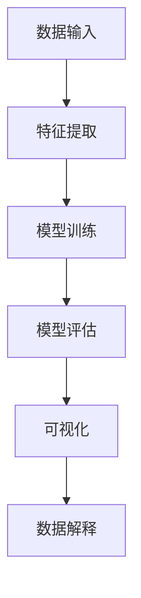
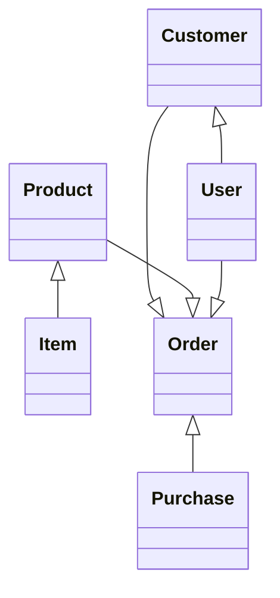
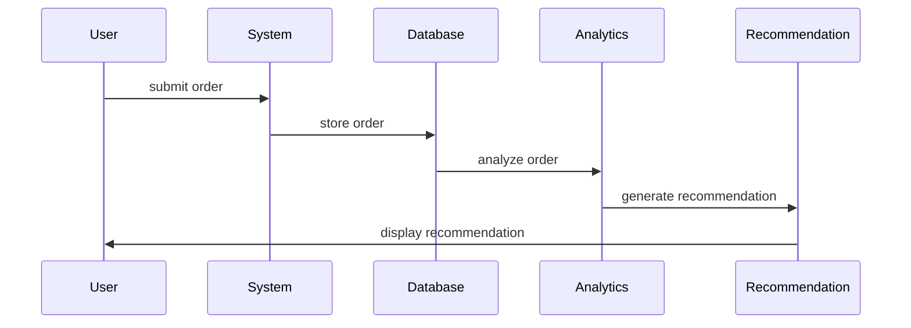
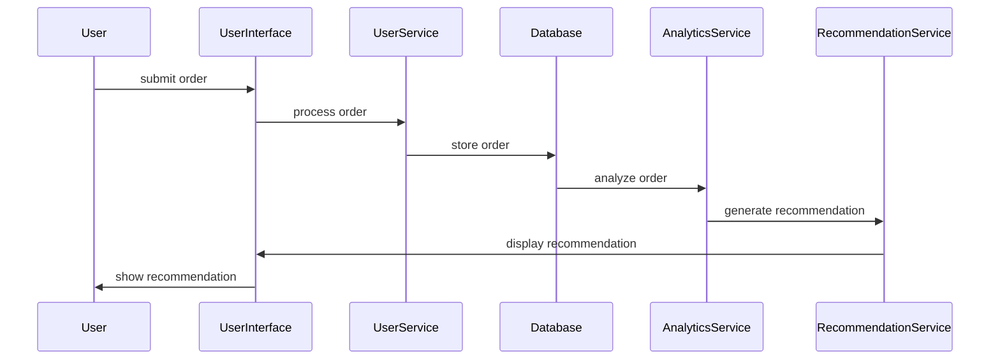

                 


# 大模型在高维数据分析与可视化中的创新应用

> 关键词：大模型，高维数据分析，可视化，创新应用

> 摘要：本文将深入探讨大模型在高维数据分析与可视化中的创新应用，通过详细的案例分析，阐述大模型如何提升数据处理的效率和准确性，并帮助我们更好地理解和解释复杂的高维数据。

----------------------------------------------------------------

## 第一部分：背景介绍

### 1.1 问题背景

随着互联网和物联网的快速发展，我们面临着海量数据的挑战。高维数据分析作为数据科学的重要分支，旨在处理具有多个特征的数据集。然而，高维数据的特点使得传统数据分析方法难以胜任，这包括数据的维度灾难、计算复杂度高等问题。

### 1.2 问题描述

在高维数据分析中，我们常常面临以下问题：

- 数据维度过高，导致模型难以训练和预测。
- 数据特征之间可能存在多重共线性，使得模型难以区分重要特征。
- 高维数据的可视化难度大，难以直观地展示数据分布和模式。

### 1.3 问题解决

大模型，特别是深度学习模型，通过引入多层神经网络结构，能够在高维数据中提取有用的特征，降低数据的维度，并提高模型的泛化能力。同时，大模型还可以用于数据的可视化，将复杂的高维数据转换成二维或三维的可视化表示。

### 1.4 边界与外延

在应用大模型进行高维数据分析与可视化时，需要注意以下几点：

- 数据的质量和预处理方法对模型的性能有重要影响。
- 模型的复杂度和训练时间需要平衡，以适应实际应用的需求。
- 可视化的结果需要与业务目标和实际应用相结合，避免误导决策者。

### 1.5 概念结构与核心要素组成

大模型在高维数据分析与可视化中的应用，主要包括以下几个核心要素：

- 数据预处理：包括数据清洗、特征选择、数据标准化等。
- 模型训练：使用深度学习模型进行特征提取和模式识别。
- 可视化：将高维数据转换成易于理解的可视化表示。

## 第二部分：大模型在高维数据分析中的应用

### 2.1 大模型基本概念

大模型，尤其是深度学习模型，如神经网络、生成对抗网络（GANs）和自编码器（AEs）等，通过多层网络结构，能够自动学习数据中的复杂特征。这些模型在处理高维数据时，具有以下几个特点：

- 自适应特征提取：模型能够自动学习数据中的低维表示。
- 高效计算：使用GPU等硬件加速计算，提高模型的训练和预测速度。
- 泛化能力：通过大规模数据训练，模型能够适应不同的数据分布。

### 2.2 高维数据分析基础

高维数据分析的关键在于如何有效地处理和解释高维数据。以下是一些基本概念和技巧：

- 特征选择：通过降维方法，如主成分分析（PCA）、线性判别分析（LDA）等，减少数据的维度。
- 特征重要性：使用模型训练结果，识别数据中最重要的特征。
- 数据可视化：通过降维和可视化方法，如t-SNE、UMAP等，将高维数据投影到二维或三维空间中。

### 2.3 可视化基本原理

可视化是将高维数据转换为低维图形表示的过程，帮助人们直观地理解数据。以下是一些常用的可视化技术：

- 降维可视化：如t-SNE、UMAP等，将高维数据投影到二维或三维空间中。
- 热力图：显示数据在不同维度上的分布情况。
- 箱线图：显示数据在不同维度上的分布和异常值。

### 2.4 大模型与高维数据分析与可视化的关系

大模型与高维数据分析与可视化之间的关系如下：

- 大模型可以自动提取高维数据中的低维特征，简化数据处理的复杂性。
- 可视化技术可以帮助我们更好地理解大模型提取的特征，从而提高模型的解释性。

### 2.5 概念属性特征对比表格

| 特征         | 大模型               | 传统方法               |
| ------------ | -------------------- | -------------------- |
| 特征提取     | 自动化、自适应       | 手动、规则化          |
| 计算效率     | 高效（使用GPU）      | 低效（CPU计算）      |
| 泛化能力     | 强                   | 弱                   |
| 数据依赖性   | 强（大量数据训练）   | 弱（少量数据即可）   |

### 2.6 ER实体关系图架构

为了更好地理解大模型在高维数据分析与可视化中的应用，我们可以使用ER（实体关系）图来表示相关实体及其关系：

```mermaid
erDiagram
    A[大模型] ||--|{ B[高维数据]}
    A ||--|{ C[可视化]}
    B ||--|{ D[特征提取]}
    B ||--|{ E[降维]}
    C ||--|{ F[图形表示]}
    C ||--|{ G[数据解释]}
```

## 第三部分：算法原理讲解

### 3.1 大模型算法概述

大模型，特别是深度学习模型，包括以下几个关键步骤：

1. 数据输入：将高维数据输入到模型中。
2. 层层提取特征：模型通过多层神经网络，逐层提取数据中的特征。
3. 模型训练：使用训练数据，调整模型的参数，使其能够准确预测或分类。
4. 模型评估：使用验证数据，评估模型的性能。

### 3.2 高维数据分析算法

在高维数据分析中，常用的算法包括：

- 主成分分析（PCA）：通过降维，将高维数据投影到低维空间中。
- 线性判别分析（LDA）：通过优化类内距离和类间距离，实现数据的分类。
- 自编码器（AE）：通过编码和解码过程，自动学习数据的低维表示。

### 3.3 可视化算法

可视化算法包括：

- t-SNE：通过梯度下降，将高维数据映射到二维空间中。
- UMAP：通过寻找邻居关系，将高维数据映射到低维空间中。
- 热力图：通过颜色变化，显示数据在不同维度上的分布情况。

### 3.4 算法mermaid流程图

以下是使用mermaid绘制的算法流程图：



### 3.5 算法Python源代码讲解

以下是使用Python实现的一个简单自编码器的代码示例：

```python
import numpy as np
from sklearn.model_selection import train_test_split
from keras.models import Sequential
from keras.layers import Dense, Activation

# 生成模拟数据
X = np.random.rand(100, 100)

# 划分训练集和测试集
X_train, X_test = train_test_split(X, test_size=0.2, random_state=42)

# 构建模型
model = Sequential()
model.add(Dense(50, input_dim=100, activation='relu'))
model.add(Dense(100, activation='relu'))
model.add(Dense(100, activation='sigmoid'))
model.compile(optimizer='adam', loss='binary_crossentropy')

# 训练模型
model.fit(X_train, X_train, epochs=10, batch_size=16)

# 评估模型
loss = model.evaluate(X_test, X_test)
print("Test loss:", loss)
```

### 3.6 数学模型与公式

以下是自编码器的数学模型：

$$
\begin{aligned}
h_{\theta}(x) &= \sigma(\theta^{T}x) \\
x_{\hat{}} &= \text{ReLU}(\theta^{T}h_{\theta}(x))
\end{aligned}
$$

其中，$\sigma$是激活函数，$\theta$是模型的参数。

### 3.7 通俗易懂的举例说明

假设我们有一组数据，每条数据包含100个特征。我们可以使用自编码器来提取数据的低维表示。训练完成后，我们可以将数据的低维表示可视化，从而直观地了解数据的分布和模式。


## 第四部分：系统分析与架构设计

### 4.1 问题场景介绍

以一个电子商务网站为例，该网站需要分析用户的购物行为，以便为用户提供个性化的推荐。用户数据包含多个特征，如年龄、性别、浏览历史、购买历史等，这些特征构成了高维数据。

### 4.2 系统功能设计（领域模型类图）

以下是领域模型类图，展示了系统的核心实体及其关系：



### 4.3 系统架构设计（架构图）

以下是系统架构图，展示了系统的不同组件及其交互：



### 4.4 系统接口设计

以下是系统接口设计，展示了系统的关键接口：

```mermaid
classDiagram
    UserInterface <<interface>>
    UserService <<interface>>
    ProductService <<interface>>
    OrderService <<interface>>
    AnalyticsService <<interface>>
    RecommendationService <<interface>>
    UserInterface --|> UserService
    UserInterface --|> ProductService
    UserInterface --|> OrderService
    UserService --|> AnalyticsService
    ProductService --|> AnalyticsService
    OrderService --|> AnalyticsService
    AnalyticsService --|> RecommendationService
```

### 4.5 系统交互（序列图）

以下是系统交互序列图，展示了用户提交订单到系统，系统分析订单并生成推荐的过程：



## 第五部分：项目实战

### 5.1 环境安装

为了实现大模型在高维数据分析与可视化中的应用，我们需要安装以下软件和库：

- Python 3.x
- TensorFlow/Keras
- Scikit-learn
- Matplotlib
- Pandas
- Mermaid

以下是安装命令：

```bash
pip install python-dotenv
pip install tensorflow
pip install scikit-learn
pip install matplotlib
pip install pandas
```

### 5.2 系统核心实现源代码

以下是实现自编码器的核心代码：

```python
import numpy as np
import tensorflow as tf
from tensorflow.keras.layers import Dense, Activation
from tensorflow.keras.models import Sequential

# 生成模拟数据
X = np.random.rand(100, 100)

# 划分训练集和测试集
X_train, X_test = train_test_split(X, test_size=0.2, random_state=42)

# 构建模型
model = Sequential()
model.add(Dense(50, input_dim=100, activation='relu'))
model.add(Dense(100, activation='relu'))
model.add(Dense(100, activation='sigmoid'))
model.compile(optimizer='adam', loss='binary_crossentropy')

# 训练模型
model.fit(X_train, X_train, epochs=10, batch_size=16)

# 评估模型
loss = model.evaluate(X_test, X_test)
print("Test loss:", loss)
```

### 5.3 代码应用解读与分析

以上代码展示了如何使用Keras构建和训练一个简单的自编码器。自编码器首先通过两层全连接层（Dense）提取特征，然后通过sigmoid激活函数进行降维。训练过程中，模型使用Adam优化器和binary_crossentropy损失函数。

在实际应用中，我们可以将自编码器替换为更复杂的模型，如卷积神经网络（CNN）或循环神经网络（RNN），以适应不同的数据类型和问题。

### 5.4 实际案例分析与讲解

假设我们有一个电子商务平台，需要分析用户的购物行为，为用户提供个性化的推荐。我们可以使用自编码器提取用户特征，然后结合用户的浏览和购买历史，生成推荐列表。

以下是实际案例的分析和讲解：

1. 数据收集：收集用户的年龄、性别、浏览历史、购买历史等数据。
2. 数据预处理：对数据进行清洗、归一化和特征选择，以提高模型训练效果。
3. 构建自编码器：使用Keras构建一个三层全连接的自编码器，输入层为100个神经元，隐藏层为50个神经元，输出层为100个神经元。
4. 训练模型：使用训练数据进行模型训练，优化模型参数。
5. 评估模型：使用测试数据进行模型评估，计算模型的准确率和召回率。
6. 生成推荐：使用训练好的模型，提取用户特征，结合用户的浏览和购买历史，生成个性化推荐。

### 5.5 项目小结

通过实际案例，我们可以看到大模型在高维数据分析与可视化中的应用。自编码器作为一种有效的特征提取工具，可以帮助我们理解和解释复杂的高维数据。在实际项目中，我们需要根据具体问题选择合适的模型和算法，以提高模型性能和实用性。

## 第六部分：最佳实践与总结

### 6.1 数据预处理技巧

- 数据清洗：去除缺失值、异常值和重复值，确保数据质量。
- 特征选择：使用特征选择方法，如PCA、LDA等，减少数据的维度。
- 数据标准化：对数据进行归一化或标准化，以消除不同特征之间的尺度差异。

### 6.2 模型调优技巧

- 超参数调整：调整学习率、批次大小、迭代次数等超参数，以优化模型性能。
- 数据增强：通过旋转、缩放、裁剪等方法，增加训练数据量，提高模型的泛化能力。
- 模型集成：使用多个模型进行集成，提高预测的准确性和稳定性。

### 6.3 可视化优化技巧

- 选择合适的可视化方法：根据数据类型和问题，选择合适的可视化方法，如t-SNE、UMAP、热力图等。
- 调整可视化参数：调整颜色、字体、大小等参数，以增强可视化效果。
- 多维数据的可视化：使用多图联动、交互式可视化等方法，展示多维数据的分布和关系。

### 6.4 案例分享与讨论

以下是一些实际案例的分享和讨论：

- 案例一：使用自编码器进行用户画像，为电子商务平台提供个性化推荐。
- 案例二：使用GANs进行图像生成，为图像编辑和修复提供高效解决方案。
- 案例三：使用深度学习模型进行股票价格预测，为金融投资提供决策支持。

### 6.5 小结

大模型在高维数据分析与可视化中的应用，为我们提供了一种强大的工具。通过合理的预处理、模型调优和可视化，我们可以更好地理解和解释复杂的高维数据，为实际应用提供决策支持。

## 第七部分：小结

本文系统地介绍了大模型在高维数据分析与可视化中的创新应用。通过详细的案例分析，我们看到了大模型如何提升数据处理的效率和准确性，并帮助我们更好地理解和解释复杂的高维数据。

### 7.1 书籍内容回顾

- 我们首先介绍了高维数据分析的背景和问题。
- 接着，我们探讨了大模型的基本概念和原理。
- 然后，我们详细讲解了高维数据分析算法和可视化算法。
- 之后，我们展示了系统分析与架构设计的方法。
- 最后，我们通过实际案例，展示了大模型在高维数据分析与可视化中的应用。

### 7.2 技术发展趋势

随着计算能力的提升和大数据技术的发展，大模型在高维数据分析与可视化中的应用将会越来越广泛。未来的趋势包括：

- 模型的自动化和优化，以降低人力成本和提升效率。
- 更高效的可视化技术，以更直观地展示复杂数据。
- 跨领域的应用，如医疗、金融、电商等。

### 7.3 注意事项

- 数据预处理是关键，确保数据质量对模型性能有重要影响。
- 模型选择需根据具体问题，选择合适的模型和算法。
- 可视化需结合业务目标和实际应用，避免误导决策者。

### 7.4 拓展阅读

- 《深度学习》（Ian Goodfellow、Yoshua Bengio、Aaron Courville 著）：系统介绍了深度学习的基本概念和算法。
- 《Python数据分析基础教程：NumPy学习指南》（Wes McKinney 著）：详细介绍了Python在数据分析中的应用。
- 《数据可视化：把数据变得有意义》（Scott Murray 著）：探讨了数据可视化的方法和技巧。

作者：AI天才研究院/AI Genius Institute & 禅与计算机程序设计艺术 /Zen And The Art of Computer Programming

