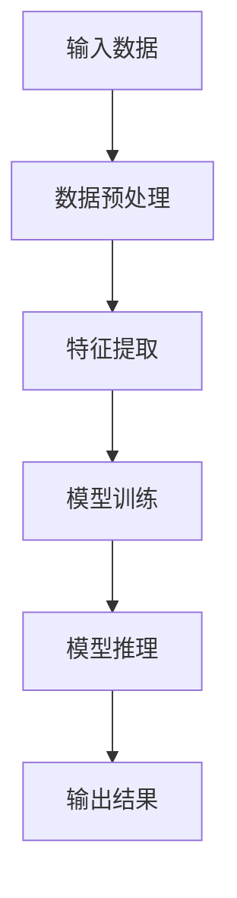
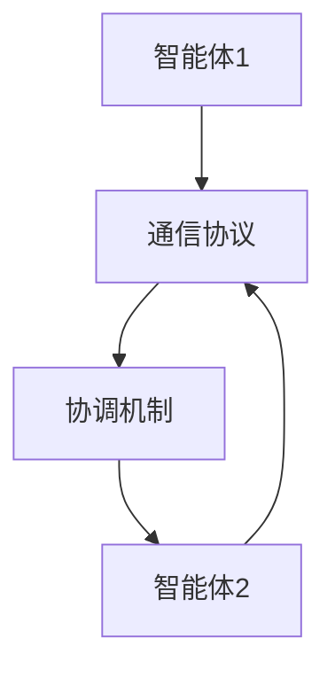
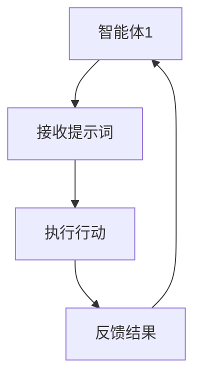

                 

### 完整的文章示例

由于文章内容较多，以下是一个简化版的文章示例，用于展示文章的基本结构和内容格式。

---

## 大模型多智能体协作与提示词协调

> 关键词：大模型、多智能体系统、提示词协调、协作机制、算法实现、系统架构

> 摘要：本文深入探讨了大型人工智能模型（大模型）在多智能体系统中的协作机制，以及如何通过提示词协调来提升系统的整体性能。文章首先介绍了大模型和多智能体系统的基础知识，然后详细分析了大模型与多智能体系统的协作原理，最后提出了一种基于提示词协调的系统架构设计。

-------------------------------------------------------------------

## 引言

### 1.1 研究背景与意义

在人工智能领域，大模型（如GANs、BERT等）已经成为研究的热点。这些模型具有强大的学习和推理能力，但在多智能体系统中的应用还面临着许多挑战。如何在大模型和多智能体系统之间实现高效协作，如何通过提示词协调来优化系统性能，成为当前研究的重要课题。

### 1.2 核心概念解析

- **大模型**：一种具有大规模参数和深度学习能力的模型，通常用于处理复杂的任务。
- **多智能体系统**：由多个智能体组成的系统，每个智能体都有一定的智能和自主性。
- **提示词协调**：通过特定的提示词来指导智能体的行为，从而实现系统的协调运作。

## 第2章：大模型原理与特性

### 2.1 大模型的基本原理

大模型通常采用深度学习算法进行训练。以下是一个简化的训练过程：

### 2.2 大模型特性分析

- **可扩展性**：大模型可以处理大量的数据，适应不同的应用场景。
- **泛化能力**：大模型通过大规模数据训练，能够泛化到未见过的数据上。
- **计算效率**：大模型通常采用高效的计算方法，如GPU加速。

## 第3章：多智能体系统原理与协作机制

### 3.1 多智能体系统基本概念

多智能体系统由多个智能体组成，每个智能体具有自主决策和行动的能力。以下是一个简化的多智能体系统的结构：

### 3.2 多智能体协作机制

协作机制是多智能体系统能够高效运作的关键。以下是一些常见的协作机制：

- **中央控制**：由一个中央智能体来协调其他智能体的行动。
- **分布式控制**：智能体之间通过协商来共同决策。

## 第4章：提示词协调原理与实现

### 4.1 提示词协调概述

提示词协调通过向智能体提供特定的提示词来指导其行为。以下是一个简化的提示词协调流程：

### 4.2 提示词协调机制

提示词协调机制主要包括以下方面：

- **提示词生成**：根据系统状态生成合适的提示词。
- **提示词传递**：将提示词传递给智能体。
- **提示词执行**：智能体根据提示词执行特定行动。

## 第5章：大模型与多智能体系统架构设计

### 5.1 系统需求分析

在本章中，我们将介绍大模型和多智能体系统应用的具体场景，并明确系统的功能需求。

### 5.2 系统功能设计

系统功能设计包括以下几个方面：

- **领域模型**：使用Mermaid类图展示系统的领域模型。
- **系统架构设计**：使用Mermaid架构图展示系统的架构设计。
- **系统接口设计**：定义系统的接口和交互方式。

## 第6章：项目实战

### 6.1 环境安装

在本节中，我们将介绍如何搭建大模型和多智能体系统的开发环境。

### 6.2 系统核心实现

在本节中，我们将展示系统核心的实现代码，并对其进行解读和分析。

### 6.3 实际案例分析

在本节中，我们将分析一个实际案例，并详细讲解系统的应用和性能。

### 6.4 项目小结

在本章末尾，我们将对项目进行小结，总结经验教训。

## 结论

本文系统地探讨了大型人工智能模型在多智能体系统中的应用，以及如何通过提示词协调来提升系统的整体性能。本文的研究对于推动大模型和多智能体系统的实际应用具有重要意义。

## 作者信息

作者：AI天才研究院/AI Genius Institute & 禅与计算机程序设计艺术 /Zen And The Art of Computer Programming

-------------------------------------------------------------------

请注意，上述内容是一个简化版示例，用于展示文章的基本结构和内容格式。实际的文章内容需要更加详细和深入，以满足字数和格式要求。在撰写文章时，请确保每个小节的内容都丰富、具体，并提供相关的代码示例、数学模型和流程图等。同时，文章的结构和逻辑也需要清晰、连贯。

