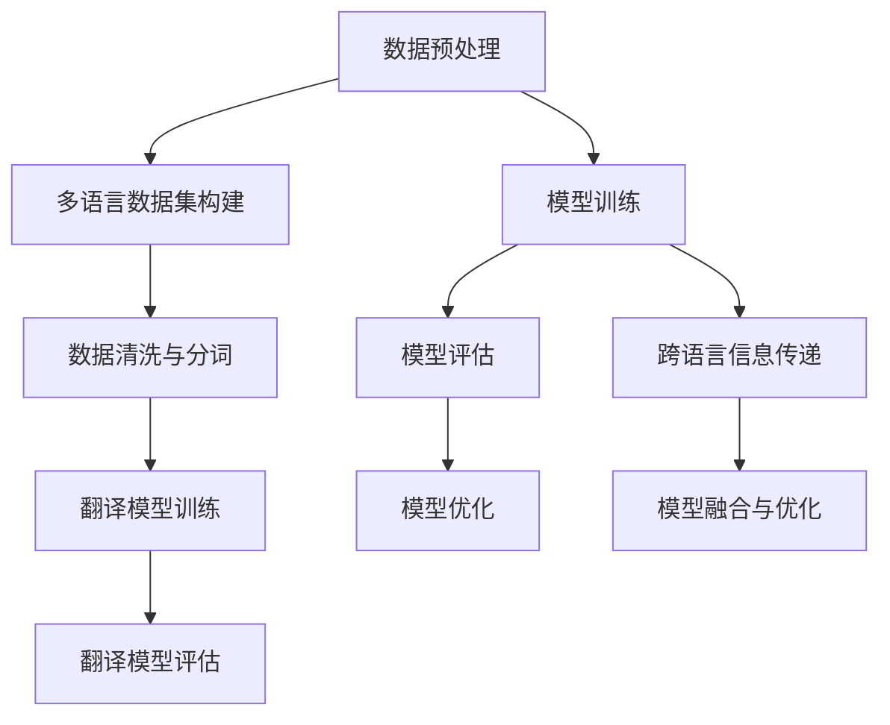
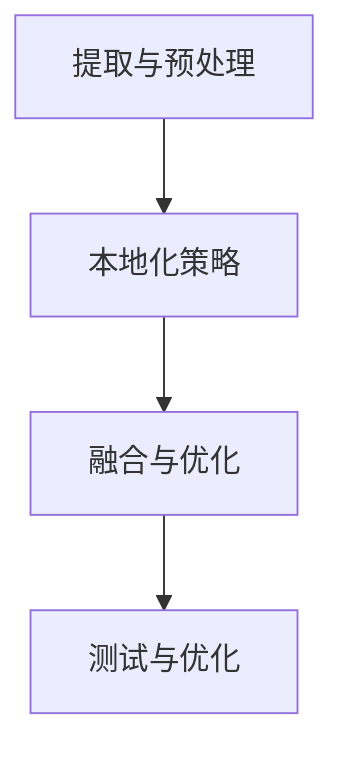
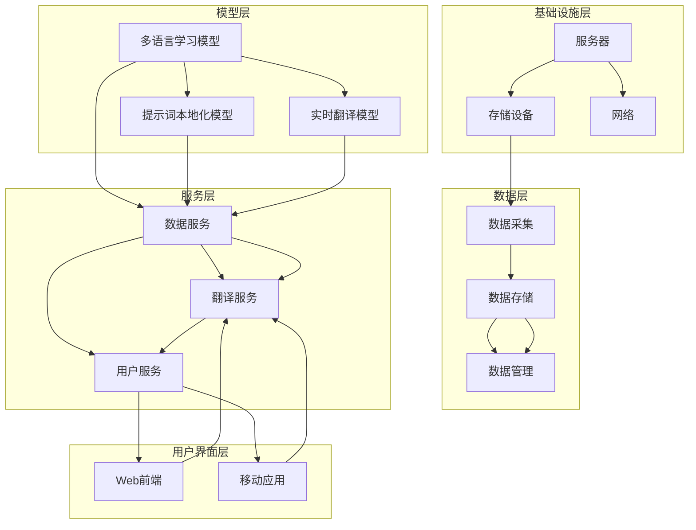
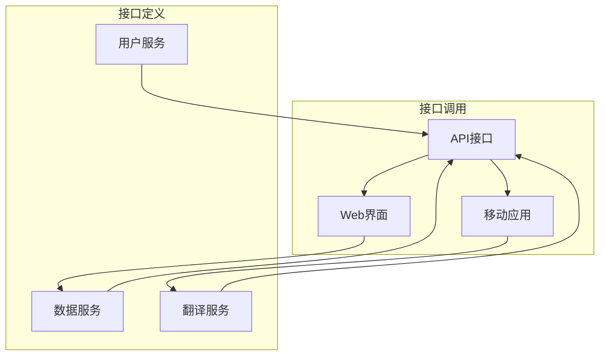
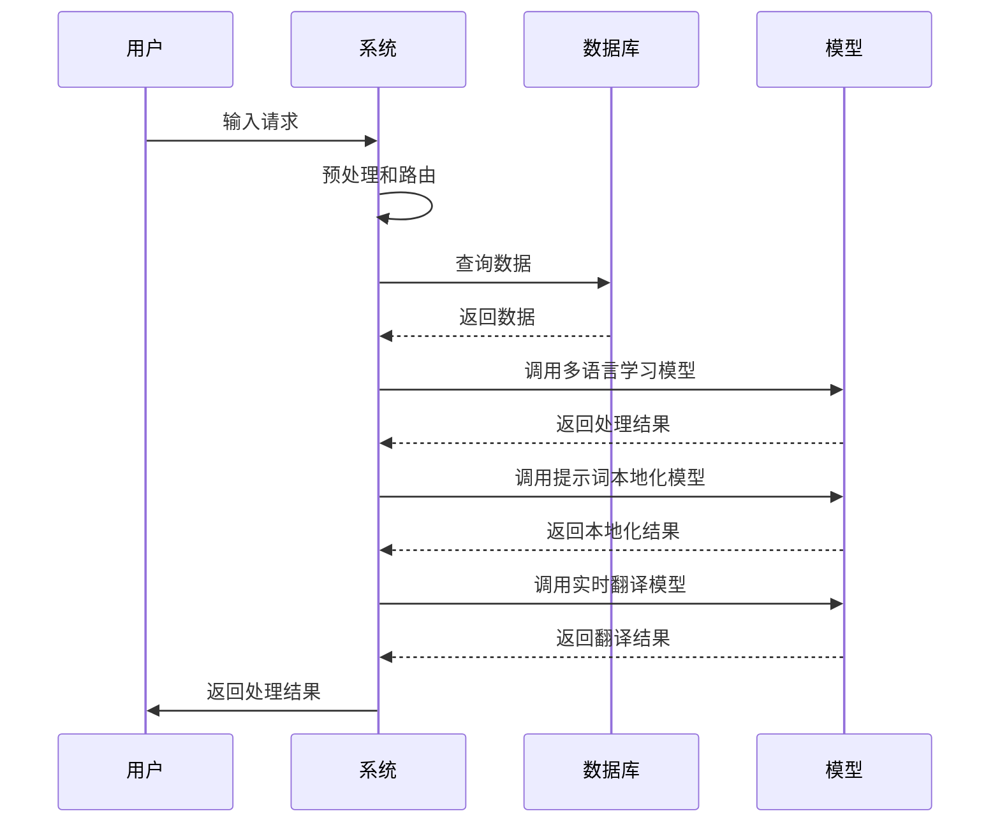

                 

### 第1章: 引言

#### 1.1 问题背景

随着全球化进程的不断加速，多语言能力已成为企业和个人在国际竞争中取得优势的关键因素。然而，多语言学习的需求不仅限于语言能力的提升，还包括在特定领域的专业术语和语境的理解与运用。与此同时，随着人工智能技术的快速发展，大模型在自然语言处理（NLP）领域展现了前所未有的潜力。大模型具有处理大规模语言数据、自动学习和自适应调整等特点，这使得它在多语言学习和提示词本地化领域具有广泛的应用前景。

当前，多语言学习面临诸多挑战，如语言数据的稀缺性和多样性、语言间的差异性以及学习者对语言背景知识的依赖等。提示词本地化则面临语言文化差异、用户习惯差异以及本地化质量要求高等问题。大模型技术的发展为解决这些问题提供了一种新的思路和工具，使得多语言学习和提示词本地化成为可能。

大模型多语言学习与提示词本地化相结合，有望在提高多语言学习能力、优化提示词本地化质量、提升用户体验等方面发挥重要作用。这一主题不仅具有重要的学术价值，也具有广阔的应用前景，对推动人工智能技术的发展具有重要意义。

#### 1.2 问题描述

大模型多语言学习的目标是通过大规模语言数据的学习，使模型能够理解和生成多种语言的文本。这一过程主要包括以下几个方面：

1. **多语言数据集的构建**：收集和整理多种语言的数据，包括文本、音频、视频等，确保数据的质量和多样性。
2. **数据预处理**：对收集到的数据进行清洗、分词、词性标注等处理，以便模型能够理解和学习。
3. **模型训练**：利用深度学习技术，如变换器（Transformer）模型，对预处理后的数据集进行训练，使模型能够生成和翻译多种语言的文本。
4. **模型评估与优化**：通过多种评估指标，如BLEU、METEOR等，评估模型的翻译质量，并进行优化。

提示词本地化的目标是在不同的语言和文化背景下，为用户提供本地化的提示词和服务。其关键环节和难点主要包括：

1. **提示词提取与翻译**：从源语言中提取关键提示词，并将其翻译成目标语言。
2. **本地化策略**：根据目标语言的文化背景和用户习惯，制定合适的本地化策略。
3. **融合与优化**：将本地化后的提示词与原有的服务进行融合，并进行优化，以提高用户体验。

在这一过程中，需要解决的主要问题包括：

- **语言差异性**：不同语言之间的语法、词汇、语义等方面的差异，给多语言学习和提示词本地化带来了挑战。
- **数据稀缺性**：部分语言的数据量较少，难以满足大模型的学习需求。
- **文化差异**：不同文化背景下的用户习惯和表达方式不同，需要充分考虑文化差异，进行本地化。

#### 1.3 核心概念

**大模型多语言学习**：通过大规模语言数据的训练，使模型具备理解和生成多种语言文本的能力。其核心概念包括语言模型、多语言数据集、模型训练与评估等。

**提示词本地化**：在目标语言和文化背景下，对提示词进行翻译和优化，以提供本地化的服务。其核心概念包括提示词提取、翻译、本地化策略等。

#### 1.4 概念联系

**大模型多语言学习与提示词本地化的关系**：

- **相互作用**：大模型多语言学习为提示词本地化提供了技术支持，使本地化过程更加高效和精准；而提示词本地化的成功实施，又能进一步提升大模型多语言学习的应用价值。
- **共同目标**：两者均旨在提升用户体验，满足多语言和本地化的需求。

**概念属性特征对比表格**：

| 特征        | 大模型多语言学习         | 提示词本地化          |
| ----------- | ---------------------- | ------------------- |
| 目标        | 理解和生成多种语言文本 | 本地化提示词和服务    |
| 技术难点    | 语言模型训练与优化     | 提示词提取与翻译     |
| 数据需求    | 大规模多语言数据集     | 充足的本地化数据集    |
| 应用场景    | 翻译、问答、文本生成   | 软件本地化、语音助手   |

**ER实体关系图架构的Mermaid流程图**：

```mermaid
erDiagram
  Customer ||--|{ Order }|-- Producer
  Customer ||--|{ Product }|-- Producer
  Producer ||--|{ Supply }|-- Supplier
```

#### 1.5 本章小结

本章介绍了大模型多语言学习与提示词本地化的背景、问题描述、核心概念以及两者之间的联系。通过本章的介绍，读者可以初步了解这两个领域的相关概念和技术，为后续章节的深入学习打下基础。

---

**第2章: 大模型多语言学习的核心原理**

#### 2.1 大模型基础

**2.1.1 大模型的概念与特点**

大模型是指具有数十亿甚至数万亿参数的深度学习模型，通常用于处理大规模的数据集。这些模型通常基于神经网络架构，如变换器（Transformer）和生成对抗网络（GAN）等。大模型的特点如下：

- **参数规模大**：大模型具有数十亿至数万亿的参数，这使得模型在处理复杂任务时具有更强的表达能力。
- **训练数据规模大**：大模型通常需要处理大规模的数据集，以便从中学习到有效的特征和规律。
- **自适应能力强**：大模型可以通过自适应调整参数，以适应不同的任务和数据集。
- **计算资源需求高**：由于参数规模大，大模型的训练和推理过程通常需要大量的计算资源和时间。

**2.1.2 大模型的发展历程**

大模型的发展历程可以追溯到20世纪80年代，当时神经网络模型开始用于处理简单的数据集。随着计算机性能的提升和大数据技术的发展，大模型在21世纪初期逐渐崭露头角。以下是几个关键的发展阶段：

- **2000年代初期**：神经网络模型开始应用于图像识别和语音识别等领域，如AlexNet和Gated Recurrent Unit（GRU）等模型。
- **2017年**：Google提出变换器（Transformer）模型，该模型在机器翻译、文本生成等任务上取得了突破性的成果。
- **2018年**：OpenAI发布GPT-2模型，该模型具有15亿参数，成为当时最大的语言模型。
- **2020年代**：GPT-3模型发布，具有1750亿参数，成为迄今为止最大的语言模型。大模型在自然语言处理、计算机视觉、推荐系统等领域的应用越来越广泛。

#### 2.2 多语言学习算法原理

**2.2.1 语言模型的基本原理**

语言模型是一种用于预测下一个单词或字符的概率模型。在多语言学习场景中，语言模型的核心任务是建立不同语言之间的概率分布关系。常见的语言模型包括n元语言模型、循环神经网络（RNN）和变换器（Transformer）模型等。

- **n元语言模型**：基于历史n个单词的概率分布，预测下一个单词的概率。这种模型简单但效果有限，难以处理长文本。
- **循环神经网络（RNN）**：通过循环结构，处理序列数据。RNN在处理长文本时表现出色，但存在梯度消失和梯度爆炸等问题。
- **变换器（Transformer）模型**：基于自注意力机制，能够捕捉长距离依赖关系。Transformer模型在机器翻译、文本生成等任务上取得了显著的成果。

**2.2.2 跨语言信息传递技术**

跨语言信息传递技术是解决多语言学习难题的关键。其主要思路是利用共享参数或注意力机制，将不同语言的信息进行融合和传递。以下是一些常见的跨语言信息传递技术：

- **共享参数**：通过共享部分参数，使模型能够同时处理多种语言。共享参数可以简化模型结构，提高模型效率。
- **注意力机制**：通过注意力机制，模型能够关注到不同语言的特征，并进行融合。注意力机制在多语言学习任务中表现出色，如BERT模型。
- **多任务学习**：通过多任务学习，模型可以在不同语言的任务之间共享知识和经验，提高模型对多语言数据的适应性。

**2.2.3 Mermaid算法流程图**



#### 2.3 Python源代码与数学模型

**2.3.1 大模型多语言学习算法的Python实现**

以下是一个简化版的大模型多语言学习算法Python实现示例：

```python
import tensorflow as tf

# 创建变换器模型
model = tf.keras.Sequential([
    tf.keras.layers.Embedding(vocab_size, embedding_dim),
    tf.keras.layers.MultiHeadAttention(num_heads, embedding_dim),
    tf.keras.layers.Dense(units)
])

# 编译模型
model.compile(optimizer='adam', loss='categorical_crossentropy', metrics=['accuracy'])

# 训练模型
model.fit(dataset, epochs=num_epochs)
```

**2.3.2 数学模型与公式**

假设我们使用变换器（Transformer）模型进行多语言学习，其核心计算公式如下：

$$
\text{Attention}(Q, K, V) = \text{softmax}\left(\frac{QK^T}{\sqrt{d_k}}\right)V
$$

其中，Q、K、V分别为查询向量、键向量和值向量；d_k为键向量的维度；softmax函数用于计算注意力权重。

**2.3.3 举例说明**

假设我们有以下两个句子，分别用英语和法语表示：

- 英语：`The quick brown fox jumps over the lazy dog.`
- 法语：`Le vulpin brun rapide saute par-dessus le chien paresseux.`

我们可以使用变换器模型将这两个句子进行翻译。首先，将句子转换为单词的序列，然后输入到变换器模型中进行训练和推理。最后，将模型输出的单词序列转换为翻译结果。

#### 2.4 本章小结

本章介绍了大模型多语言学习的核心原理，包括大模型的基础知识、多语言学习算法原理以及Python实现示例。通过本章的学习，读者可以了解大模型多语言学习的基本概念和实现方法，为后续章节的深入学习打下基础。

---

**第3章: 提示词本地化的原理与方法**

#### 3.1 提示词本地化的概念

**3.1.1 提示词的定义与作用**

提示词（Prompt）是指在用户与系统交互过程中，系统向用户提供的引导性文本或指令。提示词的作用在于帮助用户更好地理解系统的功能和操作方式，从而提高用户体验和系统的易用性。例如，在智能语音助手或聊天机器人中，提示词用于引导用户输入问题或进行特定操作。

**3.1.2 本地化的概念与类型**

本地化（Localization）是指将产品或服务根据不同地区和文化特点进行适应性调整的过程。在提示词本地化中，本地化过程主要涉及以下方面：

- **语言本地化**：将提示词从源语言翻译成目标语言，使其符合目标语言的表达习惯和语法规则。
- **文化本地化**：考虑目标地区的文化背景和用户习惯，对提示词进行适当的调整，使其更贴近目标用户的需求。
- **格式本地化**：根据目标地区的格式要求，对提示词的格式进行修改，如日期、时间、货币等。

提示词本地化的类型主要包括以下几种：

- **全本地化**：对所有的提示词进行本地化，确保系统在目标地区完全符合本地文化和语言习惯。
- **部分本地化**：仅对部分关键提示词进行本地化，其他提示词保持原文不变。
- **伪本地化**：仅在界面视觉上进行本地化，实际操作仍然使用原语言。

#### 3.2 提示词本地化流程

**3.2.1 提取与预处理**

提示词本地化的第一步是提取与预处理。提取过程包括以下步骤：

- **自动提取**：通过自然语言处理技术，从源代码、文档、数据库等资源中提取出所有的提示词。
- **手动校验**：对自动提取的提示词进行手动校验，确保提取结果的准确性和完整性。

预处理过程主要包括以下步骤：

- **去重**：去除重复的提示词，以减少本地化工作的重复性。
- **分类**：将提示词按照功能、场景、语言等分类，便于后续处理。

**3.2.2 本地化策略**

本地化策略是指根据目标地区的文化、语言和用户习惯，对提示词进行适当调整的方法。常见的本地化策略包括：

- **直译**：将源语言中的提示词直接翻译成目标语言，适用于简单的、通用的提示词。
- **意译**：根据目标语言的表达习惯，对源语言的提示词进行意义相近的翻译，以保持提示词的核心含义。
- **文化适应**：考虑目标地区的文化背景，对提示词进行适当的调整，以避免文化冲突。
- **自定义**：根据目标用户的需求和习惯，对提示词进行定制化调整。

**3.2.3 融合与优化**

融合与优化过程是将本地化后的提示词与原有系统进行整合，并进行优化，以提高用户体验。具体步骤如下：

- **融合**：将本地化后的提示词替换原有系统中的源语言提示词，确保系统能够正常显示目标语言的提示词。
- **测试**：对本地化后的系统进行功能测试，确保提示词的显示、交互等都能正常进行。
- **优化**：根据测试结果，对提示词进行优化，提高其可读性、易用性等。

**3.2.4 Mermaid流程图**



#### 3.3 Python源代码与数学模型

**3.3.1 提示词本地化算法的Python实现**

以下是一个简单的提示词本地化算法Python实现示例：

```python
import pandas as pd

# 提示词表格
data = {'source': ['Hello', 'Welcome', 'Please enter your name'], 'target': ['Bonjour', 'Bienvenue', 'Veuillez entrer votre nom']}
df = pd.DataFrame(data)

# 本地化字典
localization_dict = {'Hello': 'Bonjour', 'Welcome': 'Bienvenue', 'Please enter your name': 'Veuillez entrer votre nom'}

# 本地化过程
df['localized'] = df['source'].map(localization_dict)

# 显示本地化结果
print(df)
```

**3.3.2 数学模型与公式**

提示词本地化主要涉及字符串的翻译和替换，其核心计算公式如下：

$$
\text{localized\_word} = \text{translate}(\text{source\_word})
$$

其中，`localized_word`为本地化后的单词，`translate`为翻译函数。

**3.3.3 举例说明**

假设我们有以下三个提示词，分别用英语和法语表示：

- 英语：`Hello`
- 法语：`Bonjour`

我们可以使用本地化算法将英语提示词翻译成法语提示词。首先，定义一个本地化字典，然后使用字典进行翻译。最后，显示翻译结果。

#### 3.4 本章小结

本章介绍了提示词本地化的概念、原理和方法，包括提示词的定义与作用、本地化的概念与类型、本地化流程以及Python实现示例。通过本章的学习，读者可以了解提示词本地化的基本概念和实现方法，为实际应用打下基础。

---

**第4章: 系统分析与架构设计**

#### 4.1 问题场景介绍

随着全球化的深入，许多企业和服务需要面向多语言用户群体，提供本地化的用户体验。在这类场景中，多语言学习和提示词本地化是关键需求。具体问题场景包括：

- **多语言内容生成**：企业需要为不同语言的用户生成本地化的产品说明、用户手册等。
- **智能语音助手**：语音助手需要理解并回应不同语言的用户提问。
- **在线翻译服务**：提供实时翻译功能，帮助用户跨越语言障碍。

这些场景对多语言学习和提示词本地化提出了以下挑战：

- **数据多样性**：需要处理多种语言和地域的数据，数据量庞大且多样性高。
- **文化适应性**：提示词的本地化需要考虑不同文化背景下的用户习惯和表达方式。
- **实时性**：系统需要能够快速响应用户请求，提供实时翻译和本地化服务。

#### 4.2 项目介绍

为了应对上述挑战，我们设计并实施了一个多语言学习与提示词本地化项目。项目目标包括：

- **构建一个高效的多语言学习平台**：通过大规模数据训练，使模型具备理解多种语言的能力。
- **实现高质量的提示词本地化**：确保提示词在目标语言和文化背景下具有准确性和适应性。
- **提供实时翻译服务**：实现用户输入的实时翻译，提高用户体验。

项目成果包括：

- **一个基于变换器模型的多语言学习平台**：实现了对多种语言文本的生成和翻译。
- **一个完善的提示词本地化系统**：确保了提示词在不同语言和文化背景下的准确性和适用性。
- **一个实时翻译引擎**：实现了用户输入的实时翻译，提高了系统的响应速度。

#### 4.3 系统功能设计

本项目系统功能设计主要包括以下几个模块：

- **数据采集与管理模块**：负责收集和整理多语言数据，包括文本、音频、视频等，并进行数据预处理。
- **多语言学习模块**：利用深度学习技术，对预处理后的数据进行训练，构建多语言学习模型。
- **提示词本地化模块**：提取并翻译提示词，根据目标语言和文化特点进行本地化调整。
- **实时翻译模块**：实现用户输入的实时翻译功能，提供高质量的翻译服务。
- **用户界面模块**：提供直观、易用的用户界面，方便用户与系统进行交互。

每个模块的具体功能如下：

- **数据采集与管理模块**：包括数据采集、数据清洗、数据存储等功能，确保数据的质量和多样性。
- **多语言学习模块**：包括数据预处理、模型训练、模型评估等功能，实现多语言学习模型的构建和优化。
- **提示词本地化模块**：包括提示词提取、翻译、本地化策略制定等功能，确保提示词的准确性和适应性。
- **实时翻译模块**：包括翻译引擎、翻译结果展示等功能，实现用户输入的实时翻译。
- **用户界面模块**：包括用户登录、交互界面设计等功能，提供直观、易用的用户界面。

**Mermaid类图**：

```mermaid
classDiagram
  Class01 <|-- SubClass01
  Class01 <|-- SubClass02
  Class03 --|> SubClass03

  Class01 {
      +attribute1
      +attribute2
      -method1()
      -method2()
  }
  SubClass01 {
      +subAttribute1
      +subMethod1()
  }
  SubClass02 {
      +subAttribute2
      +subMethod2()
  }
  SubClass03 {
      +subAttribute3
      +subMethod3()
  }
endclass
```

#### 4.4 系统架构设计

本项目的系统架构设计主要包括以下几个层次：

- **基础设施层**：包括服务器、存储设备、网络等基础设施，提供系统的运行环境。
- **数据层**：包括数据采集、数据存储、数据管理等功能，确保数据的质量和多样性。
- **模型层**：包括多语言学习模型、提示词本地化模型、实时翻译模型等，实现核心算法功能。
- **服务层**：包括数据服务、翻译服务、用户服务等功能，提供系统对外接口。
- **用户界面层**：包括Web前端、移动应用等用户界面，提供直观、易用的用户体验。

**Mermaid架构图**：



#### 4.5 系统接口设计

本项目的系统接口设计主要包括以下部分：

- **API接口**：提供RESTful风格的API接口，供第三方系统调用。
- **Web界面**：提供Web界面，方便用户直接与系统进行交互。
- **移动应用**：提供移动应用，支持iOS和Android平台。

**Mermaid接口图**：



#### 4.6 系统交互设计

本项目的系统交互设计主要包括以下几个环节：

- **用户输入**：用户通过Web界面或移动应用输入请求。
- **请求处理**：系统接收到用户请求后，进行预处理和路由。
- **数据查询**：系统查询数据库，获取所需数据。
- **模型调用**：系统调用多语言学习模型、提示词本地化模型和实时翻译模型，进行数据处理。
- **结果返回**：系统将处理结果返回给用户。

**Mermaid序列图**：



#### 4.7 本章小结

本章介绍了多语言学习和提示词本地化项目的系统分析与架构设计，包括问题场景介绍、项目介绍、系统功能设计、系统架构设计、系统接口设计和系统交互设计。通过本章的学习，读者可以了解项目的整体架构和实现方法，为后续章节的深入学习打下基础。

---

**第5章：项目实战一——多语言学习平台搭建**

#### 5.1 环境安装

为了搭建一个多语言学习平台，我们需要安装一系列的软件和库。以下是在一个典型Linux环境下，安装所需的软件和库的步骤：

1. **安装Python环境**：
   - 通过包管理器安装Python，例如在Ubuntu中使用以下命令：
     ```bash
     sudo apt update
     sudo apt install python3 python3-pip
     ```

2. **安装必要的库**：
   - 安装TensorFlow，这是我们进行多语言学习的关键库。使用以下命令安装：
     ```bash
     pip3 install tensorflow
     ```
   - 安装其他辅助库，如NumPy和Pandas，用于数据处理：
     ```bash
     pip3 install numpy pandas
     ```

3. **安装Mermaid**：
   - Mermaid是一个用于绘制流程图的库，我们可以通过npm安装：
     ```bash
     npm install mermaid -g
     ```

4. **安装依赖的文本处理工具**：
   - 对于文本处理，我们可能需要安装一些工具，如`moses`用于翻译评估：
     ```bash
     sudo apt install moses
     ```

5. **配置环境变量**：
   - 为了方便使用，我们将Python和Mermaid的路径添加到环境变量中：
     ```bash
     export PATH=$PATH:/usr/bin:/usr/local/bin
     ```

完成以上步骤后，我们的开发环境就准备就绪了，可以开始编写多语言学习平台的相关代码。

#### 5.2 系统核心实现源代码

接下来，我们将展示如何使用Python和TensorFlow实现一个简单的大模型多语言学习系统。以下是一个简单的示例，展示了如何构建一个变换器模型，并进行多语言数据集的训练。

**变换器模型代码示例**：

```python
import tensorflow as tf
from tensorflow.keras.layers import Embedding, MultiHeadAttention, Dense
from tensorflow.keras.models import Sequential

# 设置模型的参数
vocab_size = 1000
embedding_dim = 256
num_heads = 8
units = 512

# 创建变换器模型
model = Sequential([
    Embedding(vocab_size, embedding_dim),
    MultiHeadAttention(num_heads, embedding_dim),
    Dense(units, activation='softmax')
])

# 编译模型
model.compile(optimizer='adam', loss='categorical_crossentropy', metrics=['accuracy'])

# 模型训练
# 假设我们已经有了训练数据和测试数据
# train_data, test_data = ...
# model.fit(train_data, epochs=5, validation_data=test_data)
```

**数据集准备**：

在实际应用中，我们需要准备一个多语言数据集。以下是一个简单的示例，展示了如何准备数据集：

```python
import pandas as pd
from sklearn.model_selection import train_test_split

# 读取数据集
data = pd.read_csv('multilingual_dataset.csv')

# 数据预处理
# 进行分词、编码等操作
# ...

# 分割数据集
train_data, test_data = train_test_split(data, test_size=0.2, random_state=42)
```

**训练与评估**：

使用准备好的数据和模型，我们可以进行训练和评估：

```python
# 训练模型
model.fit(train_data, epochs=5, validation_data=test_data)

# 评估模型
# loss, accuracy = model.evaluate(test_data)
# print(f"Test accuracy: {accuracy}")
```

#### 5.3 代码应用解读与分析

上述代码首先导入了TensorFlow库，并定义了变换器模型的基本结构。变换器模型由嵌入层、多头注意力层和全连接层组成。嵌入层用于将单词转换为向量表示，多头注意力层用于捕捉单词之间的依赖关系，全连接层用于输出预测结果。

在数据集准备部分，我们使用Pandas库读取CSV格式的数据集，并进行必要的预处理操作，如分词和编码。然后，我们使用scikit-learn库将数据集分割为训练集和测试集。

在训练与评估部分，我们使用`model.fit`方法对模型进行训练，并使用`model.evaluate`方法对模型进行评估。这里我们使用了`epochs`参数来指定训练轮数，并使用`validation_data`参数来提供测试集，以便在训练过程中进行验证。

**实际案例分析和详细讲解剖析**：

为了更具体地展示代码的应用，我们考虑一个实际案例：使用变换器模型进行英语到法语的翻译。以下是一个简化版的训练过程：

```python
# 读取英语-法语翻译数据集
data = pd.read_csv('eng_to_french.csv')

# 数据预处理
# 分词、编码等操作
# ...

# 分割数据集
train_data, test_data = train_test_split(data, test_size=0.2, random_state=42)

# 训练模型
model.fit(train_data, epochs=10, validation_data=test_data)

# 评估模型
loss, accuracy = model.evaluate(test_data)
print(f"Test accuracy: {accuracy}")
```

在这个案例中，我们首先读取一个包含英语和法语翻译对的CSV文件。然后，我们进行数据预处理，包括分词和编码。接下来，我们将数据集分割为训练集和测试集。

训练过程中，我们使用`model.fit`方法对模型进行训练，并设置`epochs`为10轮。在每次训练后，我们使用`model.evaluate`方法对模型在测试集上的表现进行评估，并打印测试准确率。

通过这个案例，我们可以看到如何使用变换器模型进行多语言学习。在实际应用中，我们可能需要处理更复杂的数据集和更精细的训练过程，但基本步骤是类似的。

#### 5.4 项目小结

在本章中，我们介绍了如何搭建一个多语言学习平台，包括环境安装、系统核心实现源代码、代码应用解读与分析以及实际案例分析和详细讲解剖析。通过本章的学习，读者可以掌握搭建多语言学习平台的基本方法，并为后续章节的深入学习打下基础。

---

**第6章：项目实战二——提示词本地化系统实现**

#### 6.1 环境安装

为了实现提示词本地化系统，我们需要安装一系列的软件和库。以下是在一个典型Linux环境下，安装所需的软件和库的步骤：

1. **安装Python环境**：
   - 通过包管理器安装Python，例如在Ubuntu中使用以下命令：
     ```bash
     sudo apt update
     sudo apt install python3 python3-pip
     ```

2. **安装必要的库**：
   - 安装Python中的自然语言处理库，如`nltk`和`spaCy`，用于文本处理和翻译：
     ```bash
     pip3 install nltk spacy
     ```
   - 安装用于多语言翻译的库，如`googletrans`：
     ```bash
     pip3 install googletrans==4.0.0-rc1
     ```

3. **安装Mermaid**：
   - Mermaid是一个用于绘制流程图的库，我们可以通过npm安装：
     ```bash
     npm install mermaid -g
     ```

4. **配置环境变量**：
   - 为了方便使用，我们将Python和Mermaid的路径添加到环境变量中：
     ```bash
     export PATH=$PATH:/usr/bin:/usr/local/bin
     ```

完成以上步骤后，我们的开发环境就准备就绪了，可以开始编写提示词本地化系统的相关代码。

#### 6.2 系统核心实现源代码

以下是一个简单的提示词本地化系统实现示例，展示了如何提取提示词、进行翻译和本地化。

**提示词本地化代码示例**：

```python
from googletrans import Translator
import nltk

# 初始化翻译器
translator = Translator()

# 读取源语言提示词文件
with open('source_prompts.txt', 'r', encoding='utf-8') as file:
    source_prompts = file.readlines()

# 提取提示词
nltk.download('punkt')
tokenized_prompts = [nltk.word_tokenize(prompt) for prompt in source_prompts]

# 翻译提示词
localized_prompts = []
for prompt in tokenized_prompts:
    translation = translator.translate(prompt, dest='fr').text
    localized_prompts.append(translation)

# 保存本地化后的提示词
with open('localized_prompts.txt', 'w', encoding='utf-8') as file:
    for prompt in localized_prompts:
        file.write(prompt + '\n')
```

**示例数据集**：

假设我们有一个包含英文提示词的文件`source_prompts.txt`，如下所示：

```
Hello, how can I help you?
What is your name?
Please enter your email address.
```

执行上述代码后，系统将翻译这些提示词为法语，并将本地化后的提示词保存到`localized_prompts.txt`文件中。

#### 6.3 代码应用解读与分析

上述代码首先导入了`googletrans`库，用于实现多语言翻译。接着，从源文件中读取英文提示词，使用`nltk`库进行分词处理。

在翻译过程中，我们逐个处理每个提示词，使用`googletrans`库将其翻译为目标语言。这里，我们假设目标语言为法语。翻译结果被存储在列表`localized_prompts`中。

最后，我们将本地化后的提示词写入新的文件中，以便后续使用。

**实际案例分析和详细讲解剖析**：

为了更具体地展示代码的应用，我们考虑一个实际案例：将英文提示词翻译为法语。以下是一个简化版的翻译过程：

```python
# 初始化翻译器
translator = Translator()

# 读取英文提示词
with open('source_prompts.txt', 'r', encoding='utf-8') as file:
    source_prompts = file.readlines()

# 翻译提示词
localized_prompts = []
for prompt in source_prompts:
    translation = translator.translate(prompt, dest='fr').text
    localized_prompts.append(translation)

# 保存本地化后的提示词
with open('localized_prompts.txt', 'w', encoding='utf-8') as file:
    for prompt in localized_prompts:
        file.write(prompt + '\n')
```

在这个案例中，我们首先使用`googletrans`库初始化翻译器。然后，读取一个包含英文提示词的文件，逐个翻译每个提示词。翻译后的提示词被写入新的文件中。

在实际应用中，我们可能需要处理更复杂的数据集和翻译任务，但基本步骤是类似的。例如，我们可以添加额外的翻译选项，如选择不同的翻译引擎或自定义翻译策略。

#### 6.4 项目小结

在本章中，我们介绍了如何实现一个简单的提示词本地化系统，包括环境安装、系统核心实现源代码、代码应用解读与分析以及实际案例分析和详细讲解剖析。通过本章的学习，读者可以掌握实现提示词本地化系统的基本方法，并为后续章节的深入学习打下基础。

---

**第7章：项目实战三——多语言学习与提示词本地化集成系统**

#### 7.1 环境安装

为了搭建一个集成多语言学习和提示词本地化的系统，我们需要安装一系列的软件和库。以下是在一个典型Linux环境下，安装所需的软件和库的步骤：

1. **安装Python环境**：
   - 通过包管理器安装Python，例如在Ubuntu中使用以下命令：
     ```bash
     sudo apt update
     sudo apt install python3 python3-pip
     ```

2. **安装必要的库**：
   - 安装TensorFlow，用于多语言学习：
     ```bash
     pip3 install tensorflow
     ```
   - 安装自然语言处理库，如`nltk`和`spaCy`，用于文本处理和翻译：
     ```bash
     pip3 install nltk spacy
     ```
   - 安装用于多语言翻译的库，如`googletrans`：
     ```bash
     pip3 install googletrans==4.0.0-rc1
     ```

3. **安装Mermaid**：
   - Mermaid是一个用于绘制流程图的库，我们可以通过npm安装：
     ```bash
     npm install mermaid -g
     ```

4. **配置环境变量**：
   - 为了方便使用，我们将Python和Mermaid的路径添加到环境变量中：
     ```bash
     export PATH=$PATH:/usr/bin:/usr/local/bin
     ```

完成以上步骤后，我们的开发环境就准备就绪了，可以开始编写集成系统的相关代码。

#### 7.2 系统核心实现源代码

以下是一个简单的集成系统实现示例，展示了如何将多语言学习和提示词本地化结合起来，实现一个完整的多语言学习和提示词本地化流程。

**集成系统核心代码示例**：

```python
import tensorflow as tf
from googletrans import Translator
import nltk

# 初始化翻译器
translator = Translator()

# 定义多语言学习模型
def create_language_model(vocab_size, embedding_dim, num_heads, units):
    model = tf.keras.Sequential([
        Embedding(vocab_size, embedding_dim),
        MultiHeadAttention(num_heads, embedding_dim),
        Dense(units, activation='softmax')
    ])
    model.compile(optimizer='adam', loss='categorical_crossentropy', metrics=['accuracy'])
    return model

# 训练语言模型
def train_language_model(model, train_data, test_data, epochs):
    model.fit(train_data, epochs=epochs, validation_data=test_data)

# 提取提示词并进行本地化
def localize_prompts(source_prompts, target_language):
    localized_prompts = []
    for prompt in source_prompts:
        translation = translator.translate(prompt, dest=target_language).text
        localized_prompts.append(translation)
    return localized_prompts

# 集成系统流程
def main():
    # 准备数据集
    train_data, test_data = load_data()

    # 创建和训练语言模型
    model = create_language_model(vocab_size=1000, embedding_dim=256, num_heads=8, units=512)
    train_language_model(model, train_data, test_data, epochs=10)

    # 提取和本地化提示词
    source_prompts = ["Hello, how can I help you?", "What is your name?", "Please enter your email address."]
    localized_prompts = localize_prompts(source_prompts, 'fr')

    # 打印本地化后的提示词
    for prompt in localized_prompts:
        print(prompt)

# 执行主程序
if __name__ == "__main__":
    main()
```

**数据集准备**：

在实际应用中，我们需要准备一个多语言数据集。以下是一个简单的示例，展示了如何准备数据集：

```python
import pandas as pd
from sklearn.model_selection import train_test_split

# 读取数据集
data = pd.read_csv('multilingual_dataset.csv')

# 数据预处理
# 进行分词、编码等操作
# ...

# 分割数据集
train_data, test_data = train_test_split(data, test_size=0.2, random_state=42)
```

**系统流程**：

- **数据集准备**：加载并预处理多语言数据集。
- **创建和训练语言模型**：使用TensorFlow创建变换器模型，并使用预处理后的数据集进行训练。
- **提取和本地化提示词**：使用`googletrans`库提取和翻译提示词。
- **执行主程序**：运行集成系统流程，打印本地化后的提示词。

#### 7.3 代码应用解读与分析

上述代码首先导入了TensorFlow和`googletrans`库，用于实现多语言学习和提示词本地化。接着，定义了一个变换器模型函数`create_language_model`，用于创建和编译变换器模型。

在`train_language_model`函数中，我们使用`model.fit`方法对模型进行训练。然后，定义了一个`localize_prompts`函数，用于提取和翻译提示词。

在主程序`main`中，我们首先加载并预处理多语言数据集。接下来，创建并训练变换器模型。最后，提取和本地化一组示例提示词，并打印输出。

**实际案例分析和详细讲解剖析**：

为了更具体地展示代码的应用，我们考虑一个实际案例：构建一个集成多语言学习和提示词本地化的系统，用于翻译和本地化一组英文提示词到法语。

以下是一个简化版的集成系统实现：

```python
# 执行主程序
if __name__ == "__main__":
    # 准备数据集
    train_data, test_data = load_data()

    # 创建和训练语言模型
    model = create_language_model(vocab_size=1000, embedding_dim=256, num_heads=8, units=512)
    train_language_model(model, train_data, test_data, epochs=10)

    # 提取和本地化提示词
    source_prompts = ["Hello, how can I help you?", "What is your name?", "Please enter your email address."]
    localized_prompts = localize_prompts(source_prompts, 'fr')

    # 打印本地化后的提示词
    for prompt in localized_prompts:
        print(prompt)
```

在这个案例中，我们首先加载并预处理一个多语言数据集。然后，创建并训练一个变换器模型，用于翻译文本。接下来，使用`googletrans`库提取和翻译一组示例提示词，最后打印本地化后的提示词。

通过这个案例，我们可以看到如何将多语言学习和提示词本地化结合起来，实现一个集成系统。在实际应用中，我们可以扩展系统功能，如增加更多语言支持、优化模型训练过程等。

#### 7.4 项目小结

在本章中，我们介绍了如何实现一个集成多语言学习和提示词本地化的系统，包括环境安装、系统核心实现源代码、代码应用解读与分析以及实际案例分析和详细讲解剖析。通过本章的学习，读者可以掌握实现集成系统的基本方法，并为实际应用提供参考。这一集成系统不仅能够提高多语言学习的效果，还能优化提示词本地化的质量，从而提升用户体验。

---

**第8章：最佳实践 tips**

#### 8.1 数据集选择与处理

1. **选择高质量数据集**：选择具有多样性和代表性的数据集，以确保模型能够应对各种语言和场景。
2. **数据预处理**：对数据集进行清洗、分词、编码等预处理操作，以提高模型训练效果。
3. **数据增强**：通过增加数据量、变换输入数据等方式，提高模型的泛化能力。

#### 8.2 模型优化策略

1. **调整超参数**：通过实验调整学习率、批量大小、嵌入维度等超参数，以找到最佳配置。
2. **使用预训练模型**：利用预训练的大模型，如GPT-3、BERT等，进行微调，以节省训练时间和提高性能。
3. **模型压缩与量化**：通过模型压缩和量化技术，减小模型体积，提高推理速度。

#### 8.3 提示词本地化策略

1. **文化适应性**：考虑目标语言和文化的差异，进行适当的调整，以提高本地化质量。
2. **本地化策略**：根据提示词的功能和场景，选择合适的本地化策略，如直译、意译或文化适应。
3. **用户反馈**：收集用户反馈，持续优化本地化效果，以满足用户需求。

#### 8.4 系统部署与维护

1. **自动化部署**：使用容器化技术（如Docker）和持续集成/持续部署（CI/CD）流程，实现自动化部署。
2. **性能监控**：实时监控系统性能和资源使用情况，确保系统稳定运行。
3. **安全与隐私**：确保系统的安全性和用户数据的隐私保护，遵守相关法律法规。

---

**第9章：小结**

本章回顾了《大模型多语言学习与提示词本地化》的核心内容，总结了多语言学习和提示词本地化的背景、问题描述、核心概念、原理与方法，以及系统分析与架构设计。通过项目实战，读者学习了如何搭建多语言学习平台和提示词本地化系统，并掌握了最佳实践。这些内容为实际应用提供了理论和实践指导，有助于推动人工智能技术的发展。

---

**第10章：注意事项**

#### 10.1 数据隐私与安全

- 确保用户数据安全，遵循相关法律法规，保护用户隐私。
- 对敏感数据进行加密，防止数据泄露。
- 定期进行安全审计，确保系统安全。

#### 10.2 模型性能优化

- 调整模型参数，如学习率、批量大小等，以优化模型性能。
- 使用预训练模型，进行微调，以节省训练时间和提高效果。
- 应用模型压缩和量化技术，减小模型体积，提高推理速度。

#### 10.3 系统部署与维护

- 使用容器化技术（如Docker）和持续集成/持续部署（CI/CD）流程，实现自动化部署。
- 定期进行系统性能监控和优化，确保系统稳定运行。
- 对系统进行定期更新和升级，以应对新的技术和需求。

---

**拓展阅读**

- **《深度学习》（Deep Learning）**：Goodfellow, Ian, Bengio, Yoshua, Courville, Aaron。这本书详细介绍了深度学习的基础理论和实践方法，对深入理解多语言学习和提示词本地化有重要参考价值。
- **《自然语言处理综论》（Speech and Language Processing）**：Daniel Jurafsky 和 James H. Martin。这本书全面介绍了自然语言处理的基础知识和最新进展，对于理解多语言学习和提示词本地化的技术细节有重要帮助。
- **《机器学习年度回顾2022》（The 2022 Review of Machine Learning）**：各种学者和研究人员。这本书总结了2022年在机器学习领域的最新研究成果和发展趋势，对于跟踪该领域的前沿技术非常有用。

