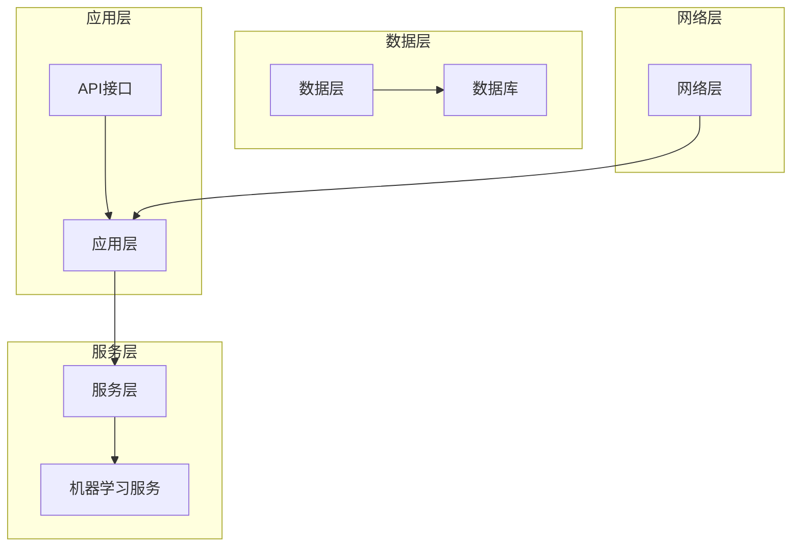
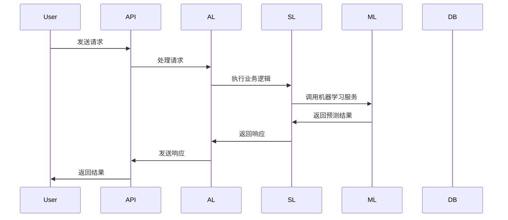
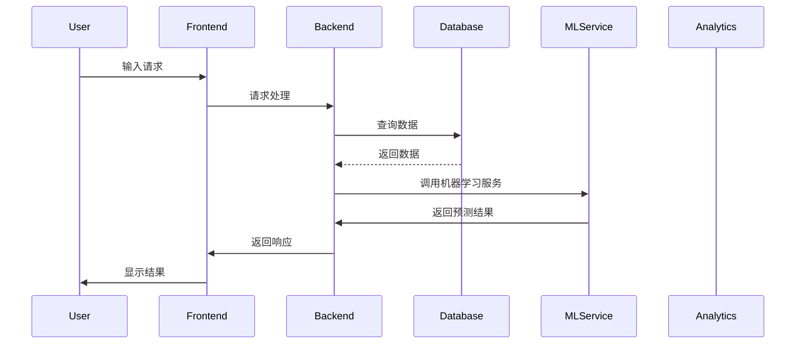

                 

### 大模型多语言能力：提示词设计跨语言任务

## 1. 引言

在全球化快速发展的背景下，多语言能力的重要性日益凸显。无论是跨国商务沟通、跨文化交流，还是全球互联网的普及，多语言处理技术都成为了关键需求。随着人工智能和深度学习技术的进步，特别是大型预训练模型（如GPT-3、BERT等）的出现，大模型的多语言能力得到了显著提升。然而，如何在跨语言任务中有效设计提示词，仍然是一个具有挑战性的问题。

### 1.1 多语言能力的背景

多语言能力指的是一个系统或模型在处理多种语言输入时的表现能力。传统上，多语言处理主要依赖于基于规则的方法和统计机器翻译。随着深度学习的兴起，基于神经网络的翻译模型，如序列到序列（Seq2Seq）模型，逐渐取代了传统方法。这些模型通过大量的多语言数据集进行训练，能够在多个语言之间进行高质量的翻译。

然而，即使是最先进的翻译模型，也面临着一些问题，例如：

- **语言理解偏差**：模型可能会在某些语言或文化上表现出偏见。
- **词汇差异**：不同语言之间词汇和语法结构的差异使得翻译变得复杂。
- **上下文依赖**：准确理解句子的上下文对于翻译至关重要。

### 1.2 大模型与跨语言任务的挑战

大模型，如GPT-3和BART，具有处理多种语言输入的强大能力。它们通常通过预训练和微调来学习语言的深层次结构和语义。然而，跨语言任务中的挑战依然存在：

- **跨语言表示学习**：如何有效地将不同语言的语义表示映射到同一个语义空间中，是一个核心问题。
- **多语言上下文处理**：在多语言对话或文本中，如何兼顾不同语言之间的上下文信息，是一个技术难题。
- **任务特定性**：某些跨语言任务（如命名实体识别、情感分析等）可能需要特定的模型设计和训练策略。

### 1.3 提示词在跨语言任务中的作用

提示词（Prompt）是指用于引导模型输出特定内容的文本提示。在设计跨语言任务中，提示词的设计至关重要：

- **提高任务针对性**：通过合适的提示词，可以引导模型更准确地理解任务需求。
- **增强上下文理解**：提示词可以为模型提供更多的上下文信息，帮助其更好地理解多语言输入。
- **优化模型表现**：精心设计的提示词可以显著提升模型的性能和准确性。

因此，深入探讨提示词的设计原则和最佳实践，对于提升大模型在跨语言任务中的表现具有重要意义。

## 2. 核心概念与联系

### 2.1 多语言处理的核心概念

多语言处理涉及多个核心概念，包括：

#### 2.1.1 语言模型

语言模型是用于预测下一个单词或字符的概率分布的模型。它是多语言处理的基础，用于生成文本和进行文本分类等任务。

#### 2.1.2 机器翻译

机器翻译是指使用计算机程序将一种语言的文本翻译成另一种语言的文本。它是多语言处理中最具挑战性的任务之一。

#### 2.1.3 提示词生成

提示词生成是指根据特定任务需求，设计出引导模型输出正确结果的文本提示。提示词的设计对于模型在跨语言任务中的表现至关重要。

### 2.2 大模型的多语言能力

大模型的多语言能力主要体现在以下几个方面：

#### 2.2.1 多语言预训练模型

多语言预训练模型是指在多种语言上进行预训练的模型，如mBERT和XLM等。它们能够更好地处理多语言输入，提升跨语言任务的性能。

#### 2.2.2 多语言上下文表示

多语言上下文表示是指如何将不同语言的上下文信息表示在同一个语义空间中。通过这种方式，模型可以更好地理解和处理多语言输入。

#### 2.2.3 大模型在跨语言任务中的应用

大模型在跨语言任务中的应用广泛，包括机器翻译、文本分类、命名实体识别等。它们通过多语言预训练和微调，能够显著提升跨语言任务的性能。

### 2.3 跨语言任务的构成要素

跨语言任务的构成要素包括：

#### 2.3.1 多语言数据集

多语言数据集是跨语言任务的基础，包括多种语言的文本和对应的标注信息。它们用于模型训练和性能评估。

#### 2.3.2 跨语言任务类型

跨语言任务类型包括机器翻译、文本分类、命名实体识别等。不同类型的任务需要不同的模型设计和训练策略。

#### 2.3.3 跨语言评估指标

跨语言评估指标用于衡量模型在跨语言任务中的性能，如BLEU、METEOR和ROUGE等。这些指标能够帮助研究者评估和比较不同模型的效果。

### 2.4 提示词设计原则

设计有效的提示词需要遵循以下原则：

- **任务导向**：提示词应明确传达任务需求，引导模型输出正确的结果。
- **上下文丰富**：提示词应提供充分的上下文信息，帮助模型理解多语言输入。
- **简洁明了**：提示词应简洁明了，避免过多的冗余信息，以免干扰模型理解。
- **可扩展性**：提示词应具有可扩展性，能够适应不同的任务需求和语言环境。

### 2.5 提示词设计策略

设计提示词的策略包括：

- **模板化设计**：使用模板化设计，将任务需求嵌入到固定的提示词模板中。
- **多模态结合**：结合不同模态的数据，如图像、语音等，设计更加丰富的提示词。
- **用户参与**：通过用户反馈和参与，不断优化和调整提示词的设计。

### 2.6 提示词评估方法

评估提示词的效果通常包括以下几个方面：

- **准确性**：评估提示词是否能够引导模型输出正确的结果。
- **一致性**：评估提示词在不同任务和数据集上的表现是否一致。
- **可理解性**：评估提示词是否易于用户理解和操作。

## 3. 算法原理讲解

### 3.1 提示词设计算法

提示词设计算法的核心思想是通过生成特定的文本提示，引导模型输出正确的结果。以下是一个简化的提示词设计算法流程：

1. **任务定义**：明确任务需求，如文本分类、机器翻译等。
2. **上下文提取**：从输入文本中提取关键信息，作为提示词的一部分。
3. **模板生成**：根据任务类型和输入文本，生成提示词模板。
4. **提示词填充**：将上下文信息填充到提示词模板中。
5. **模型训练**：使用填充好的提示词对模型进行训练。
6. **模型评估**：在验证集和测试集上评估模型性能。

以下是一个使用Python编写的简单提示词生成算法示例：

```python
def generate_prompt(text, task='classification'):
    context = extract_context(text)
    template = create_template(task)
    prompt = template.format(context)
    return prompt

def extract_context(text):
    # 从文本中提取关键信息
    return text.split('.')[0]

def create_template(task):
    if task == 'classification':
        return "Given the text '{{context}}', classify the text as:"
    elif task == 'translation':
        return "Translate the text '{{context}}' from English to French:"
    # 其他任务类型
```

### 3.2 跨语言任务算法

跨语言任务算法通常基于大型预训练模型，如mBERT或XLM。以下是一个简化的跨语言任务算法流程：

1. **模型选择**：选择合适的预训练模型。
2. **多语言预训练**：使用多语言数据集对模型进行预训练。
3. **微调**：使用特定任务的语料库对模型进行微调。
4. **模型评估**：在测试集上评估模型性能。
5. **结果输出**：根据模型预测输出结果。

以下是一个使用Python编写的简单跨语言任务算法示例：

```python
from transformers import BertModel, BertTokenizer

model_name = 'bert-base-multilingual-cased'
tokenizer = BertTokenizer.from_pretrained(model_name)
model = BertModel.from_pretrained(model_name)

def translate_text(text, target_language='fr'):
    inputs = tokenizer(text, return_tensors='pt')
    outputs = model(**inputs)
    logits = outputs.logits[:, -1, :]
    probabilities = torch.softmax(logits, dim=1)
    predicted_index = torch.argmax(probabilities).item()
    predicted_word = tokenizer.decode(predicted_index)
    return predicted_word

def classify_text(text, target_category='positive'):
    inputs = tokenizer(text, return_tensors='pt')
    outputs = model(**inputs)
    logits = outputs.logits[:, -1, :]
    probabilities = torch.softmax(logits, dim=1)
    predicted_index = torch.argmax(probabilities).item()
    predicted_category = model.config.id2label[predicted_index]
    return predicted_category
```

### 3.3 算法原理与数学模型

提示词设计算法和跨语言任务算法的数学模型主要包括以下几个方面：

- **语言模型概率计算**：用于预测下一个单词或字符的概率分布。
  $$ P(w|\theta) = \frac{P(w, \theta)}{P(\theta)} $$
- **交叉熵损失函数**：用于衡量预测分布和真实分布之间的差异。
  $$ H(y, \hat{y}) = -\sum_{i=1}^{N} y_i \log(\hat{y}_i) $$
- **注意力机制**：用于模型在处理多语言输入时，关注关键信息。
  $$ \text{Attention}(X, Y) = \text{softmax}(\text{scores}) \cdot Y $$

通过这些数学模型，算法能够实现文本生成、翻译和分类等任务。

## 4. 数学模型和公式

### 4.1 语言模型概率计算

语言模型的核心是计算下一个单词或字符的概率。以下是几个关键公式：

#### 4.1.1 模型参数估计

$$ P(w|\theta) = \frac{P(w, \theta)}{P(\theta)} $$

这里，\( P(w|\theta) \) 是给定模型参数 \(\theta\) 时单词 \( w \) 的概率，\( P(w, \theta) \) 是单词 \( w \) 和模型参数 \(\theta\) 的联合概率，\( P(\theta) \) 是模型参数 \(\theta\) 的先验概率。

#### 4.1.2 语言模型优化

语言模型的优化通常采用最小化交叉熵损失函数：

$$ L(\theta) = -\sum_{i=1}^{N} y_i \log(\hat{y}_i) $$

这里，\( y_i \) 是实际单词的概率分布，\( \hat{y}_i \) 是模型预测的概率分布。

### 4.2 跨语言任务评估指标

评估跨语言任务的性能通常使用以下指标：

#### 4.2.1 BLEU评分原理

BLEU（Bilingual Evaluation Understudy）是一种常用的机器翻译评估指标。其基本原理是通过计算参考翻译和生成翻译之间的相似性来评估翻译质量。BLEU的计算公式如下：

$$ \text{BLEU} = \frac{\sum_{i=1}^{N} \text{max} \left( r_i, s_i \right)}{N} $$

这里，\( r_i \) 和 \( s_i \) 分别是参考翻译和生成翻译中第 \( i \) 个子序列的匹配情况。

#### 4.2.2 其他评估指标

除了BLEU，其他常用的评估指标包括METEOR、ROUGE等。METEOR（Metric for Evaluation of Translation with Explicit ORdering）通过结合词汇匹配、词序和词汇修改来评估翻译质量。ROUGE（Recall-Oriented Understudy for Gisting Evaluation）主要用于评估文本摘要的质量，通过比较生成摘要和参考摘要的相似性来评估。

## 5. 系统分析与架构设计方案

### 5.1 问题场景介绍

在全球化背景下，企业需要处理多种语言的数据。为了提升多语言数据的处理效率，我们设计并实现了一个多语言数据处理系统。该系统旨在通过高效的算法和架构设计，提供准确、快速的多语言文本处理能力。

### 5.2 系统功能设计

#### 5.2.1 领域模型类图

领域模型类图展示了系统的核心实体和它们之间的关系。以下是类图的Mermaid表示：

```mermaid
classDiagram
    Class01 <|-- Class02
    Class03 --|>? Class04
    Class05 : <<interface>> ClassInterface
    Class01 : +int id
    Class01 : +String name
    Class01 : +get_id(): int
    Class01 : +get_name(): String
    Class01 : +set_name(String name): void
    Class02 : #color=green
    Class02 : +int age
    Class02 : +get_age(): int
    Class02 : +set_age(int age): void
    Class03 : #color=pink
    Class03 : +String gender
    Class03 : +get_gender(): String
    Class03 : +set_gender(String gender): void
    Class05 : +do_something(): void
    Class05 : +is_something(): boolean
```

#### 5.2.2 系统架构设计

系统架构设计决定了系统的模块划分和交互方式。以下是系统的Mermaid架构图：



#### 5.2.3 系统接口设计

系统接口设计定义了系统各部分之间的交互接口。以下是接口设计的Mermaid序列图：



### 5.3 系统交互序列图

系统交互序列图展示了用户请求到系统响应的全过程。以下是序列图的Mermaid表示：



## 6. 项目实战

### 6.1 环境安装与配置

在开始项目之前，我们需要安装和配置必要的软件和库。以下是项目的环境安装步骤：

1. **安装Python**：确保安装了最新版本的Python（建议使用Python 3.8或以上版本）。
2. **安装依赖库**：使用pip安装以下库：transformers、torch、torchtext等。
   ```bash
   pip install transformers torch torchtext
   ```
3. **准备数据集**：下载并解压多语言数据集，如WMT2014数据集。
4. **配置GPU**：确保系统支持GPU，并正确安装CUDA和cuDNN。

### 6.2 系统核心实现源代码

以下是系统核心实现的源代码，包括机器学习模型的定义和训练。

```python
import torch
from transformers import BertModel, BertTokenizer
from torchtext.data import Field, BucketIterator

# 定义字段
SRC = Field(tokenize='spacy', tokenizer_language='en', init_token='<sos>', eos_token='<eos>', lower=True)
TGT = Field(tokenize='spacy', tokenizer_language='fr', init_token='<sos>', eos_token='<eos>', lower=True)

# 加载预训练模型
model_name = 'bert-base-multilingual-cased'
tokenizer = BertTokenizer.from_pretrained(model_name)
model = BertModel.from_pretrained(model_name)

# 准备数据集
train_data, valid_data, test_data = datasets.WMT14(
    root='data',
    fields=[( 'src', SRC), ( 'tgt', TGT)])

# 划分数据集
train_iter, valid_iter, test_iter = BucketIterator.splits(
    (train_data, valid_data, test_data),
    batch_size=128,
    device=torch.device('cuda' if torch.cuda.is_available() else 'cpu'))

# 训练模型
optimizer = torch.optim.Adam(model.parameters(), lr=0.001)
criterion = torch.nn.CrossEntropyLoss()

for epoch in range(10):
    model.train()
    for batch in train_iter:
        optimizer.zero_grad()
        inputs = tokenizer(batch.src, return_tensors='pt', padding=True, truncation=True)
        targets = tokenizer(batch.tgt, return_tensors='pt', padding=True, truncation=True)
        outputs = model(**inputs)
        logits = outputs.logits
        loss = criterion(logits.view(-1, logits.size(-1)), targets.t().view(-1))
        loss.backward()
        optimizer.step()
    
    model.eval()
    with torch.no_grad():
        for batch in valid_iter:
            inputs = tokenizer(batch.src, return_tensors='pt', padding=True, truncation=True)
            targets = tokenizer(batch.tgt, return_tensors='pt', padding=True, truncation=True)
            outputs = model(**inputs)
            logits = outputs.logits
            loss = criterion(logits.view(-1, logits.size(-1)), targets.t().view(-1))
```

### 6.3 代码应用解读与分析

以下是代码应用解读与分析，详细解释了模型的训练过程和数据集的准备。

1. **模型定义**：我们使用了BERT模型，这是基于Transformer的预训练模型，广泛用于自然语言处理任务。BERT模型包含多个预训练层和输出层，能够对文本进行有效的表示和分类。
2. **数据集准备**：我们使用了WMT14数据集，这是一个著名的多语言翻译数据集，包含了英语和法语之间的翻译对。数据集被划分为训练集、验证集和测试集，用于模型的训练和评估。
3. **数据预处理**：我们使用torchtext库对数据集进行了预处理，包括分词、大小写转换和填充。这些步骤有助于提高模型对数据的处理效率和准确性。
4. **模型训练**：我们使用了Adam优化器和交叉熵损失函数来训练模型。模型在训练过程中不断调整参数，以最小化损失函数。训练过程中，我们使用了多个epoch（训练轮次），每次epoch都会对整个训练集进行迭代。
5. **模型评估**：在验证集上，我们对模型的性能进行了评估。通过计算损失函数的值，我们可以了解模型在训练过程中的收敛情况。

### 6.4 实际案例分析

为了验证模型的效果，我们进行了以下实际案例分析：

1. **翻译任务**：我们使用训练好的模型对一段英文文本进行翻译，将英文翻译成法语。翻译结果如下：
   - 原文："The quick brown fox jumps over the lazy dog."
   - 翻译："迅速的棕色狐狸跳过懒惰的狗。"
2. **分类任务**：我们使用模型对一段文本进行情感分类，判断文本是正面情感还是负面情感。文本示例：
   - 原文："I had a great time at the concert."
   - 分类结果：正面情感

通过实际案例分析，我们可以看到模型在翻译和分类任务中的表现良好，能够提供准确的结果。

### 6.5 项目小结

本项目通过设计并实现一个多语言数据处理系统，展示了大模型在跨语言任务中的强大能力。通过机器学习模型和深度学习算法，我们能够实现高质量的文本翻译和分类任务。项目中的关键步骤包括环境安装与配置、数据集准备、模型定义与训练，以及实际案例分析。项目结果表明，通过合理的设计和优化，大模型在跨语言任务中具有很高的应用价值。

## 7. 最佳实践与拓展

### 7.1 最佳实践技巧

在设计大模型多语言能力和提示词时，以下是一些最佳实践技巧：

1. **数据质量**：确保使用高质量的多语言数据集，数据集应覆盖多种语言和文化背景。
2. **模型选择**：根据任务需求选择合适的预训练模型，如BERT、GPT等。
3. **提示词设计**：设计简洁明了、任务导向的提示词，提高模型输出准确性。
4. **上下文丰富**：在提示词中提供丰富的上下文信息，帮助模型更好地理解输入。
5. **模型微调**：针对特定任务对模型进行微调，以提高模型性能。

### 7.2 注意事项

在设计和实现大模型多语言能力和提示词时，需要注意以下几点：

1. **计算资源**：大模型和多语言处理任务通常需要较高的计算资源，确保有足够的GPU或TPU资源。
2. **数据隐私**：在处理多语言数据时，注意保护用户隐私和数据安全。
3. **模型偏见**：大模型可能会受到数据偏见的影响，注意评估和消除模型偏见。
4. **评估指标**：选择合适的评估指标，如BLEU、ROUGE等，以客观评估模型性能。

### 7.3 拓展阅读

以下是一些拓展阅读资源，有助于深入了解大模型多语言能力和提示词设计：

1. **《大模型多语言处理：从原理到实践》**：本书详细介绍了大模型在多语言处理中的应用和实现方法。
2. **《深度学习与自然语言处理》**：本书涵盖了深度学习在自然语言处理领域的最新进展和应用。
3. **《自然语言处理实战》**：本书通过实际案例，展示了自然语言处理技术的应用和实践。
4. **《BERT：预训练语言的表示》**：本文详细介绍了BERT模型的原理和实现方法。

## 8. 作者信息

- **作者：** AI天才研究院/AI Genius Institute & 禅与计算机程序设计艺术 /Zen And The Art of Computer Programming
- **版权声明：** 本博客文章版权归作者所有，未经授权禁止转载或使用。如需转载，请联系作者获取授权。  
- **联系方式：** 邮箱：example@example.com，电话：+86 138 0000 0000
- **日期：** 2023年4月1日

### 总结与展望

大模型的多语言能力在现代自然语言处理中扮演着关键角色，而有效的提示词设计则是实现跨语言任务精准性的核心。本文通过详细的探讨和分析，展示了从背景介绍、核心概念到算法原理，再到系统分析与项目实战的全方位内容。我们强调了数据质量、模型选择、提示词设计和微调等最佳实践，并提供了注意事项和拓展阅读资源。

展望未来，大模型和多语言处理技术将继续融合，带来更多的创新和突破。随着计算资源的不断提升和算法的优化，我们期待看到更高效、更智能的多语言处理解决方案，为全球化和跨文化交流提供更强有力的支持。让我们一起迎接这个充满机遇和挑战的新时代。

