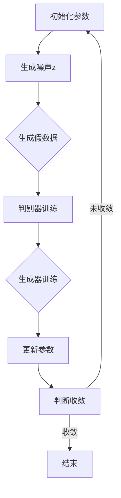

                 


### 大模型对抗学习与提示词工程：问题背景与挑战

大模型对抗学习和提示词工程作为当前人工智能领域的前沿研究方向，正在引发一场技术革命。首先，我们需要明确这两个概念的定义。

**大模型对抗学习**：它是一种利用生成模型与判别模型之间的对抗性竞争关系，来提升模型性能的方法。在生成模型和判别模型之间建立对抗性训练，通过不断地调整参数，使得生成模型生成的数据更加接近真实数据，判别模型能够更加精准地识别真实数据和生成数据。

**提示词工程**：它是指通过设计特定的提示词或提示信号，来引导大模型生成更符合预期结果的输出。提示词工程的核心在于如何设计有效的提示词，以提升模型在特定任务上的表现。

那么，为何需要大模型对抗学习和提示词工程？这要从当前人工智能领域面临的一些挑战说起。

#### 挑战1：模型过拟合

随着模型规模的不断扩大，模型在训练数据上表现得越来越好，但在未见过的数据上表现却不尽人意，这种现象被称为“过拟合”。大模型对抗学习通过生成模型和判别模型之间的对抗训练，可以有效缓解过拟合问题。

#### 挑战2：数据分布不均衡

在许多实际应用中，数据分布往往是不均衡的。例如，在图像识别任务中，猫的图片数量远多于狗的图片。这种数据分布的不均衡会直接影响模型的性能。通过对抗学习，可以生成更多的数据来平衡数据分布，从而提升模型的泛化能力。

#### 挑战3：模型理解能力不足

大模型的强大在于其能够处理大量的数据和复杂的任务，但这也带来一个问题：我们难以理解模型内部的决策过程。提示词工程则试图通过设计特定的提示词，来引导模型生成更符合人类期望的输出，从而提升模型的可解释性。

#### 挑战4：计算资源需求大

大模型的训练和部署需要大量的计算资源，这对硬件设备和能源消耗提出了巨大的挑战。通过对抗学习和提示词工程，我们可以更有效地利用有限的计算资源，提高模型的性能。

#### 挑战5：隐私和安全问题

随着人工智能技术的广泛应用，隐私和安全问题愈发凸显。大模型对抗学习和提示词工程通过设计更安全、更隐私的模型，来保护用户数据的安全。

综上所述，大模型对抗学习和提示词工程是应对当前人工智能领域挑战的有效手段。在接下来的章节中，我们将深入探讨这两个领域的理论基础、技术方法以及应用实例，希望能为大家提供有价值的见解和启发。

### 大模型对抗学习的基础理论

#### 对抗性学习

对抗性学习（Adversarial Learning）是一种通过构建两个相互对抗的网络——生成模型（Generator）和判别模型（Discriminator）——来进行训练的方法。生成模型的目标是生成与真实数据尽可能相似的数据，而判别模型的目标是区分真实数据和生成数据。通过这种对抗性的训练过程，两个模型相互竞争，不断优化，最终生成模型能够生成更加逼真的数据，判别模型能够更加精确地区分真实和生成数据。

#### 生成对抗网络（GAN）

生成对抗网络（Generative Adversarial Network，GAN）是对抗性学习的一种典型架构。GAN由两部分组成：生成器和判别器。

- **生成器**（Generator）：生成器的主要任务是根据给定的输入噪声生成与真实数据分布相似的数据。在训练过程中，生成器的目标是产生尽可能真实的数据，以欺骗判别器。

- **判别器**（Discriminator）：判别器的主要任务是判断输入数据是真实数据还是生成器生成的假数据。在训练过程中，判别器的目标是不断提高自己的判别能力，以区分真实和假数据。

GAN的训练过程可以分为以下几个步骤：

1. **初始化生成器和判别器**：首先随机初始化生成器和判别器的参数。
2. **生成假数据**：生成器根据随机噪声生成假数据。
3. **判别器训练**：判别器使用真实数据和假数据进行训练，学习如何区分真实数据和生成数据。
4. **生成器训练**：生成器根据判别器的反馈进行训练，目标是生成更加逼真的假数据，使判别器无法区分。
5. **交替迭代**：上述过程反复进行，直到生成器能够生成足够逼真的数据，使得判别器的性能不再提升。

#### 数学模型与推导

在GAN中，生成器和判别器的损失函数通常采用以下形式：

- **生成器的损失函数**：\( L_G = -\log(D(G(z))) \)
  - 这里，\( G(z) \) 是生成器生成的假数据，\( D \) 是判别器。
  - 损失函数表示生成器生成的数据越逼真，判别器判别的概率越接近1，生成器的损失越低。

- **判别器的损失函数**：\( L_D = -[\log(D(x)) + \log(1 - D(G(z)))] \)
  - \( x \) 是真实数据，\( G(z) \) 是生成器生成的假数据。

为了更好地理解GAN的数学原理，我们可以用以下步骤来推导：

1. **期望最大化**：GAN的目标是最小化生成器的损失函数和判别器的损失函数的总和。
   $$ L = L_G + L_D $$

2. **对抗性优化**：生成器和判别器的优化目标是交替进行的。
   - 判别器训练：最大化判别器的损失函数。
     $$ \frac{\partial L_D}{\partial D} = \frac{\partial}{\partial D} [-\log(D(x)) - \log(1 - D(G(z))] $$
   - 生成器训练：最大化生成器的损失函数。
     $$ \frac{\partial L_G}{\partial G} = \frac{\partial}{\partial G} [-\log(D(G(z)))] $$

3. **梯度下降**：在实际训练过程中，通常使用梯度下降法来更新生成器和判别器的参数。

#### 算法流程

为了更直观地理解GAN的训练过程，我们可以用以下算法流程图来表示：



通过这个算法流程，我们可以看到生成器和判别器在训练过程中是如何相互竞争，逐步优化的。

综上所述，大模型对抗学习的基础理论包括对抗性学习、生成对抗网络（GAN）以及数学模型与推导。这些理论为我们提供了深入理解和应用对抗性学习的方法，为后续章节的进一步探讨奠定了基础。

### 提示词工程的基本原理

#### 提示词的定义与作用

提示词（Prompt）是指通过向大模型输入特定的文本或信号，来引导模型生成更符合预期结果的输出。在自然语言处理、计算机视觉、语音识别等领域，提示词工程已成为提升模型性能的重要手段。

- **自然语言处理**：在自然语言处理任务中，提示词可以用来指导模型生成更准确、更符合上下文的文本。例如，在机器翻译中，提示词可以帮助模型理解源语言的语境，从而生成更准确的翻译结果。
- **计算机视觉**：在计算机视觉任务中，提示词可以用来指导模型关注特定的区域或特征，从而提高模型的识别和分类能力。例如，在图像分类中，提示词可以提示模型关注图像中的特定物体或场景。
- **语音识别**：在语音识别任务中，提示词可以用来指导模型识别特定的语音信号，从而提高识别的准确性。例如，在语音助手系统中，提示词可以帮助模型识别用户的具体指令。

#### 提示词的设计原则

为了设计有效的提示词，需要遵循以下原则：

- **针对性**：提示词需要针对具体任务和场景进行设计，以确保其能够有效地引导模型生成符合预期结果的输出。
- **简洁性**：提示词应尽可能简洁明了，避免过多冗余信息，以减少模型的计算负担和歧义性。
- **上下文关联性**：提示词需要与输入数据和上下文紧密关联，以确保模型能够正确理解和生成输出。
- **灵活性**：提示词应具有一定的灵活性，能够适应不同任务和场景的变化。

#### 提示词的类型

根据应用场景和任务需求，提示词可以分为以下几类：

- **模板型提示词**：这类提示词通过固定的模板和变量来生成，适用于有明确输入格式和输出格式的任务。例如，在机器翻译中，模板型提示词可以是“将以下英文翻译成中文：______”。
- **语义型提示词**：这类提示词通过表达具体的语义和任务目标来引导模型生成输出。例如，在图像分类中，提示词可以是“请识别图像中的主要物体”。
- **交互型提示词**：这类提示词通过与用户的互动来获取输入信息，从而动态生成输出。例如，在语音助手系统中，提示词可以是“请问您需要什么帮助？”。

#### 提示词优化的方法

为了提升提示词的效果，可以采用以下几种优化方法：

- **数据增强**：通过增加提示词的多样性来丰富模型的学习数据，从而提高模型的泛化能力。
- **语义分析**：利用自然语言处理技术对提示词进行语义分析，提取关键信息，从而优化提示词的表达。
- **模型调整**：通过调整模型的参数和结构，使其对特定提示词更加敏感，从而提升模型在特定任务上的性能。

综上所述，提示词工程的基本原理包括提示词的定义与作用、设计原则、类型以及优化方法。这些原理为我们提供了设计有效提示词的指导思路，也为提升大模型在各个任务上的表现提供了有力支持。在接下来的章节中，我们将进一步探讨提示词工程在大模型应用中的具体实践和案例。

### 大模型对抗学习在自然语言处理中的应用

大模型对抗学习在自然语言处理（NLP）领域展现出了强大的潜力，尤其是在生成式任务和分类任务中。以下是一些具体的应用实例。

#### 1. 文本生成

在文本生成任务中，大模型对抗学习可以通过生成对抗网络（GAN）来生成高质量的文本。例如，生成式预训练模型（如GPT）就是一个典型的例子。GPT使用了一个大规模的变换器模型，通过对抗性训练来生成连贯、具有语境一致性的文本。训练过程中，生成器（GPT）根据输入的文本片段生成下一个片段，而判别器则负责判断输入的文本是真实的还是生成的。通过这种对抗性训练，生成器能够不断提高生成文本的质量。

**算法原理：**
生成器GPT的损失函数通常包括两个部分：一个是生成文本的损失，用来衡量生成文本与真实文本的相似度；另一个是判别器的损失，用来衡量判别器判断生成文本为真实文本的概率。具体公式如下：

\[ L_G = -\log(D(G(z))) \]
\[ L_D = -[\log(D(x)) + \log(1 - D(G(z)))] \]

其中，\( G(z) \) 是生成器生成的文本，\( D \) 是判别器。

**代码示例：**
```python
import torch
import torch.nn as nn
import torch.optim as optim

# 定义生成器和判别器
generator = nn.Sequential(
    nn.Linear(z_size, hidden_size),
    nn.ReLU(),
    nn.Linear(hidden_size, text_size)
)

discriminator = nn.Sequential(
    nn.Linear(text_size, hidden_size),
    nn.ReLU(),
    nn.Linear(hidden_size, 1)
)

# 定义损失函数和优化器
criterion = nn.BCELoss()
optimizer_G = optim.Adam(generator.parameters(), lr=0.0002)
optimizer_D = optim.Adam(discriminator.parameters(), lr=0.0002)

# 训练过程
for epoch in range(num_epochs):
    for i, real_text in enumerate(train_loader):
        # 生成假文本
        z = torch.randn(batch_size, z_size).to(device)
        fake_text = generator(z)

        # 训练判别器
        optimizer_D.zero_grad()
        real_output = discriminator(real_text).view(-1)
        fake_output = discriminator(fake_text).view(-1)
        D_loss = criterion(real_output, torch.ones(batch_size).to(device)) + \
                 criterion(fake_output, torch.zeros(batch_size).to(device))
        D_loss.backward()
        optimizer_D.step()

        # 训练生成器
        optimizer_G.zero_grad()
        G_loss = criterion(fake_output, torch.ones(batch_size).to(device))
        G_loss.backward()
        optimizer_G.step()

        if (i+1) % 100 == 0:
            print(f'Epoch [{epoch+1}/{num_epochs}], Step [{i+1}/{len(train_loader)}], D_loss: {D_loss.item():.4f}, G_loss: {G_loss.item():.4f}')
```

#### 2. 文本分类

在文本分类任务中，大模型对抗学习可以通过对抗性正则化（Adversarial Regularization）来提高分类模型的鲁棒性。对抗性正则化是一种在训练过程中加入对抗性噪声的方法，从而增强模型对对抗性样本的泛化能力。

**算法原理：**
对抗性正则化通过在训练数据中添加对抗性噪声，来增加模型的训练难度，从而提高模型的鲁棒性。具体步骤如下：

1. **生成对抗性噪声**：对于输入文本 \( x \)，生成对抗性噪声 \( \epsilon \)，并将其添加到输入中，形成对抗性样本 \( x_{adv} = x + \epsilon \)。
2. **训练模型**：使用对抗性样本训练模型，从而提高模型对对抗性噪声的鲁棒性。

**代码示例：**
```python
import torch
import torch.nn as nn
import torch.optim as optim

# 定义模型和优化器
model = nn.Sequential(
    nn.Linear(text_size, hidden_size),
    nn.ReLU(),
    nn.Linear(hidden_size, num_classes)
)
optimizer = optim.Adam(model.parameters(), lr=0.001)

# 训练过程
for epoch in range(num_epochs):
    for i, (text, label) in enumerate(train_loader):
        # 生成对抗性噪声
        noise = torch.randn_like(text).to(device)
        text_adv = text + noise

        # 训练模型
        optimizer.zero_grad()
        output = model(text).squeeze(1)
        output_adv = model(text_adv).squeeze(1)
        loss = criterion(output, label) + criterion(output_adv, label)
        loss.backward()
        optimizer.step()

        if (i+1) % 100 == 0:
            print(f'Epoch [{epoch+1}/{num_epochs}], Step [{i+1}/{len(train_loader)}], Loss: {loss.item():.4f}')
```

#### 3. 文本生成与分类的结合

在文本生成与分类的结合任务中，大模型对抗学习可以通过生成对抗网络（GAN）和对抗性正则化相结合，来同时提升生成质量和分类准确性。例如，在生成式文本分类任务中，可以使用GAN生成高质量的无标签文本，并通过对抗性正则化提高分类模型的鲁棒性。

**算法原理：**
结合GAN和对抗性正则化的文本生成与分类任务可以分为以下几个步骤：

1. **生成无标签文本**：使用GAN生成高质量的无标签文本。
2. **对抗性正则化**：对生成的文本添加对抗性噪声，训练分类模型。
3. **微调分类模型**：使用带有标签的文本数据进行微调，以提高分类准确性。

**代码示例：**
```python
# 假设已经定义了生成器和判别器的代码
# 定义分类模型
classifier = nn.Sequential(
    nn.Linear(text_size, hidden_size),
    nn.ReLU(),
    nn.Linear(hidden_size, num_classes)
)

# 训练过程
for epoch in range(num_epochs):
    for i, (text, label) in enumerate(train_loader):
        # 生成无标签文本
        z = torch.randn(batch_size, z_size).to(device)
        fake_text = generator(z)

        # 对抗性正则化
        noise = torch.randn_like(text).to(device)
        text_adv = text + noise
        optimizer_G.zero_grad()
        G_loss = criterion(fake_text, torch.ones(batch_size).to(device))
        G_loss.backward()
        optimizer_G.step()

        # 训练分类模型
        optimizer.zero_grad()
        output = classifier(text).squeeze(1)
        output_adv = classifier(text_adv).squeeze(1)
        loss = criterion(output, label) + criterion(output_adv, label)
        loss.backward()
        optimizer.step()

        if (i+1) % 100 == 0:
            print(f'Epoch [{epoch+1}/{num_epochs}], Step [{i+1}/{len(train_loader)}], Loss: {loss.item():.4f}')
```

综上所述，大模型对抗学习在自然语言处理中的应用涵盖了文本生成、文本分类以及文本生成与分类的结合等多个方面。通过生成对抗网络和对抗性正则化等技术，可以有效提升模型在各类NLP任务中的性能。

### 大模型对抗学习在计算机视觉中的应用

大模型对抗学习在计算机视觉（CV）领域展现出了显著的优势，尤其是在图像生成、图像分类和图像分割等方面。以下是一些具体的应用实例。

#### 1. 图像生成

在图像生成任务中，生成对抗网络（GAN）是常用的方法之一。GAN通过生成器和判别器的对抗性训练，可以生成高质量、逼真的图像。例如，深度卷积生成对抗网络（DCGAN）就是基于GAN架构的一种常用模型。

**算法原理：**
DCGAN由两部分组成：生成器（Generator）和判别器（Discriminator）。

- **生成器**：生成器的任务是将随机噪声映射为逼真的图像。通常，生成器由多个卷积层和转置卷积层组成，以实现从噪声到图像的高维映射。
- **判别器**：判别器的任务是区分真实图像和生成图像。判别器通常由多个卷积层组成，以提取图像的特征。

GAN的训练过程可以分为以下几个步骤：

1. **初始化生成器和判别器的参数**。
2. **生成假图像**：生成器根据随机噪声生成假图像。
3. **训练判别器**：判别器使用真实图像和生成图像进行训练，学习如何区分真实图像和生成图像。
4. **训练生成器**：生成器根据判别器的反馈进行训练，目标是生成更加逼真的图像，使判别器无法区分。
5. **交替迭代**：上述过程反复进行，直到生成器能够生成足够逼真的图像，使得判别器的性能不再提升。

**代码示例：**
```python
import torch
import torch.nn as nn
import torch.optim as optim

# 定义生成器和判别器
generator = nn.Sequential(
    nn.ConvTranspose2d(z_size, ngf, 4, 1, 0, bias=False),
    nn.BatchNorm2d(ngf),
    nn.ReLU(True),
    nn.ConvTranspose2d(ngf, ngf // 2, 4, 2, 1, bias=False),
    nn.BatchNorm2d(ngf // 2),
    nn.ReLU(True),
    nn.ConvTranspose2d(ngf // 2, nc, 4, 2, 1, bias=False),
    nn.Tanh()
)

discriminator = nn.Sequential(
    nn.Conv2d(nc, ndf, 4, 2, 1, bias=False),
    nn.LeakyReLU(0.2, inplace=True),
    nn.Conv2d(ndf, ndf * 2, 4, 2, 1, bias=False),
    nn.BatchNorm2d(ndf * 2),
    nn.LeakyReLU(0.2, inplace=True),
    nn.Conv2d(ndf * 2, 1, 4, 1, 0, bias=False),
    nn.Sigmoid()
)

# 定义损失函数和优化器
criterion = nn.BCELoss()
optimizer_G = optim.Adam(generator.parameters(), lr=lr * 10, betas=(0.0, 0.9))
optimizer_D = optim.Adam(discriminator.parameters(), lr=lr, betas=(0.0, 0.9))

# 训练过程
for epoch in range(num_epochs):
    for i, data in enumerate(dataloader):
        # 更新判别器
        optimizer_D.zero_grad()
        real_images = data[0].to(device)
        batch_size = real_images.size(0)
        z = torch.randn(batch_size, z_size).to(device)
        fake_images = generator(z)
        real_scores = discriminator(real_images)
        fake_scores = discriminator(fake_images)
        D_loss = -torch.mean(real_scores) + torch.mean(fake_scores)
        D_loss.backward()
        optimizer_D.step()

        # 更新生成器
        optimizer_G.zero_grad()
        z = torch.randn(batch_size, z_size).to(device)
        fake_images = generator(z)
        fake_scores = discriminator(fake_images)
        G_loss = -torch.mean(fake_scores)
        G_loss.backward()
        optimizer_G.step()

        if i % 100 == 0:
            print(f'[{epoch}/{num_epochs}] [D: {D_loss.item():.4f} G: {G_loss.item():.4f}]')
```

#### 2. 图像分类

在图像分类任务中，大模型对抗学习可以通过对抗性正则化（Adversarial Regularization）来提高分类模型的鲁棒性。对抗性正则化通过在训练数据中添加对抗性噪声，来增强模型对对抗性样本的泛化能力。

**算法原理：**
对抗性正则化的训练过程如下：

1. **生成对抗性噪声**：对于输入图像 \( x \)，生成对抗性噪声 \( \epsilon \)，并将其添加到输入中，形成对抗性样本 \( x_{adv} = x + \epsilon \)。
2. **训练模型**：使用对抗性样本和原始样本共同训练模型，从而提高模型对对抗性噪声的鲁棒性。

**代码示例：**
```python
import torch
import torch.nn as nn
import torch.optim as optim

# 定义模型和优化器
model = nn.Sequential(
    nn.Conv2d(nc, ndf, 4, 2, 1),
    nn.LeakyReLU(0.2, inplace=True),
    nn.Conv2d(ndf, ndf * 2, 4, 2, 1),
    nn.BatchNorm2d(ndf * 2),
    nn.LeakyReLU(0.2, inplace=True),
    nn.Conv2d(ndf * 2, num_classes, 4, 1, 0),
    nn.LogSoftmax(1)
)
optimizer = optim.Adam(model.parameters(), lr=0.001)

# 训练过程
for epoch in range(num_epochs):
    for i, (images, labels) in enumerate(train_loader):
        # 生成对抗性噪声
        noise = torch.randn_like(images).to(device)
        images_adv = images + noise

        # 训练模型
        optimizer.zero_grad()
        output = model(images)
        output_adv = model(images_adv)
        loss = nn.NLLLoss()(output, labels) + nn.NLLLoss()(output_adv, labels)
        loss.backward()
        optimizer.step()

        if (i+1) % 100 == 0:
            print(f'Epoch [{epoch+1}/{num_epochs}], Step [{i+1}/{len(train_loader)}], Loss: {loss.item():.4f}')
```

#### 3. 图像分割

在图像分割任务中，大模型对抗学习可以通过对抗性生成网络（Adversarial Generative Network，AGN）来生成高质量的分割边界。AGN结合了生成对抗网络和分割网络，通过对抗性训练来优化分割网络的性能。

**算法原理：**
AGN由两部分组成：生成对抗网络（GAN）和分割网络（Segmentation Network）。

- **生成对抗网络**：生成对抗网络负责生成高质量的图像和分割边界。
- **分割网络**：分割网络负责根据生成对抗网络生成的图像和分割边界进行图像分割。

AGN的训练过程可以分为以下几个步骤：

1. **生成对抗网络训练**：使用GAN生成高质量的图像和分割边界。
2. **分割网络训练**：使用对抗性训练优化分割网络，使其能够生成更准确的分割结果。

**代码示例：**
```python
import torch
import torch.nn as nn
import torch.optim as optim

# 定义生成对抗网络和分割网络
generator = nn.Sequential(
    # 生成器部分
    nn.Conv2d(nc, ngf, 4, 2, 1),
    nn.BatchNorm2d(ngf),
    nn.LeakyReLU(0.2, inplace=True),
    nn.Conv2d(ngf, ngf * 2, 4, 2, 1),
    nn.BatchNorm2d(ngf * 2),
    nn.LeakyReLU(0.2, inplace=True),
    nn.Conv2d(ngf * 2, nc, 4, 2, 1),
    nn.Tanh()
)

segmentation_network = nn.Sequential(
    # 分割网络部分
    nn.Conv2d(nc, ngf, 4, 2, 1),
    nn.BatchNorm2d(ngf),
    nn.LeakyReLU(0.2, inplace=True),
    nn.Conv2d(ngf, ngf * 2, 4, 2, 1),
    nn.BatchNorm2d(ngf * 2),
    nn.LeakyReLU(0.2, inplace=True),
    nn.Conv2d(ngf * 2, nc, 1),
    nn.Sigmoid()
)

# 定义损失函数和优化器
criterion = nn.BCELoss()
optimizer_G = optim.Adam(generator.parameters(), lr=lr * 10, betas=(0.0, 0.9))
optimizer_S = optim.Adam(segmentation_network.parameters(), lr=lr, betas=(0.0, 0.9))

# 训练过程
for epoch in range(num_epochs):
    for i, (images, labels) in enumerate(train_loader):
        # 生成对抗网络训练
        optimizer_G.zero_grad()
        fake_images = generator(images)
        fake_labels = segmentation_network(fake_images)
        G_loss = criterion(fake_labels, labels)
        G_loss.backward()
        optimizer_G.step()

        # 分割网络训练
        optimizer_S.zero_grad()
        output = segmentation_network(images)
        S_loss = criterion(output, labels)
        S_loss.backward()
        optimizer_S.step()

        if (i+1) % 100 == 0:
            print(f'Epoch [{epoch+1}/{num_epochs}], Step [{i+1}/{len(train_loader)}], G_loss: {G_loss.item():.4f}, S_loss: {S_loss.item():.4f}')
```

综上所述，大模型对抗学习在计算机视觉中的应用涵盖了图像生成、图像分类和图像分割等多个方面。通过生成对抗网络和对抗性正则化等技术，可以有效提升模型在各类CV任务中的性能。

### 大模型对抗学习在语音识别中的应用

大模型对抗学习在语音识别（ASR）领域也展现出了显著的效果，特别是在语音生成、语音分类和语音增强等方面。以下是一些具体的应用实例。

#### 1. 语音生成

在语音生成任务中，生成对抗网络（GAN）是一种常用的方法，通过对抗性训练生成逼真的语音。例如，WaveNet是一种基于循环神经网络（RNN）的生成模型，它可以生成高质量的语音。

**算法原理：**
WaveNet是一种基于条件生成对抗网络（cGAN）的模型，其训练过程如下：

1. **输入**：将文本序列编码成向量，作为输入。
2. **生成语音**：生成器（Generator）根据输入文本序列生成语音波形。
3. **训练判别器**：判别器（Discriminator）学习区分真实语音和生成语音。
4. **优化生成器和判别器**：通过对抗性训练，优化生成器和判别器的参数。

**代码示例：**
```python
import torch
import torch.nn as nn
import torch.optim as optim

# 定义生成器和判别器
generator = nn.Sequential(
    nn.Linear(embedding_size, hidden_size),
    nn.ReLU(True),
    nn.Linear(hidden_size, hidden_size),
    nn.ReLU(True),
    nn.Linear(hidden_size, output_size)
)

discriminator = nn.Sequential(
    nn.Linear(input_size, hidden_size),
    nn.ReLU(True),
    nn.Linear(hidden_size, hidden_size),
    nn.ReLU(True),
    nn.Linear(hidden_size, 1)
)

# 定义损失函数和优化器
criterion = nn.BCELoss()
optimizer_G = optim.Adam(generator.parameters(), lr=0.0002)
optimizer_D = optim.Adam(discriminator.parameters(), lr=0.0002)

# 训练过程
for epoch in range(num_epochs):
    for i, (text, audio) in enumerate(train_loader):
        # 更新生成器和判别器
        optimizer_G.zero_grad()
        optimizer_D.zero_grad()

        # 生成语音
        z = torch.randn(batch_size, z_size).to(device)
        generated_audio = generator(text)

        # 训练判别器
        real_scores = discriminator(audio)
        fake_scores = discriminator(generated_audio)
        D_loss = -torch.mean(real_scores) + torch.mean(fake_scores)
        D_loss.backward()

        # 训练生成器
        G_loss = -torch.mean(fake_scores)
        G_loss.backward()
        
        optimizer_G.step()
        optimizer_D.step()

        if (i+1) % 100 == 0:
            print(f'Epoch [{epoch+1}/{num_epochs}], Step [{i+1}/{len(train_loader)}], G_loss: {G_loss.item():.4f}, D_loss: {D_loss.item():.4f}')
```

#### 2. 语音分类

在语音分类任务中，大模型对抗学习可以通过对抗性正则化（Adversarial Regularization）来提高分类模型的鲁棒性。对抗性正则化通过在训练数据中添加对抗性噪声，来增强模型对对抗性样本的泛化能力。

**算法原理：**
对抗性正则化的训练过程如下：

1. **生成对抗性噪声**：对于输入语音 \( x \)，生成对抗性噪声 \( \epsilon \)，并将其添加到输入中，形成对抗性样本 \( x_{adv} = x + \epsilon \)。
2. **训练模型**：使用对抗性样本和原始样本共同训练模型，从而提高模型对对抗性噪声的鲁棒性。

**代码示例：**
```python
import torch
import torch.nn as nn
import torch.optim as optim

# 定义模型和优化器
model = nn.Sequential(
    nn.Conv2d(1, 64, 3, 1),
    nn.ReLU(),
    nn.MaxPool2d(2, 2),
    nn.Conv2d(64, 128, 3, 1),
    nn.ReLU(),
    nn.MaxPool2d(2, 2),
    nn.Flatten(),
    nn.Linear(128 * 6 * 6, num_classes)
)
optimizer = optim.Adam(model.parameters(), lr=0.001)

# 训练过程
for epoch in range(num_epochs):
    for i, (audio, label) in enumerate(train_loader):
        # 生成对抗性噪声
        noise = torch.randn_like(audio).to(device)
        audio_adv = audio + noise

        # 训练模型
        optimizer.zero_grad()
        output = model(audio)
        output_adv = model(audio_adv)
        loss = nn.CrossEntropyLoss()(output, label) + nn.CrossEntropyLoss()(output_adv, label)
        loss.backward()
        optimizer.step()

        if (i+1) % 100 == 0:
            print(f'Epoch [{epoch+1}/{num_epochs}], Step [{i+1}/{len(train_loader)}], Loss: {loss.item():.4f}')
```

#### 3. 语音增强

在语音增强任务中，大模型对抗学习可以通过生成对抗网络（GAN）和深度学习技术，来提高语音的质量和清晰度。例如，WaveGlow是一种基于生成对抗网络和波流模型（WaveNet + Glow）的语音增强模型，它可以生成高质量的语音波形。

**算法原理：**
WaveGlow的训练过程如下：

1. **输入**：将语音波形和掩码（Mask）作为输入。
2. **生成增强语音**：生成器（Generator）根据输入的语音波形和掩码生成增强后的语音波形。
3. **训练判别器**：判别器（Discriminator）学习区分真实语音和增强语音。
4. **优化生成器和判别器**：通过对抗性训练，优化生成器和判别器的参数。

**代码示例：**
```python
import torch
import torch.nn as nn
import torch.optim as optim

# 定义生成器和判别器
generator = nn.Sequential(
    nn.ConvTranspose1d(hidden_size, 512, 16, 14, 0),
    nn.ReLU(True),
    nn.ConvTranspose1d(512, 1024, 8, 7, 0),
    nn.ReLU(True),
    nn.ConvTranspose1d(1024, 2048, 4, 3, 1),
    nn.ReLU(True),
    nn.ConvTranspose1d(2048, 1, 4, 3, 1),
    nn.Sigmoid()
)

discriminator = nn.Sequential(
    nn.Conv1d(1, 16, 16, 14, 0),
    nn.ReLU(True),
    nn.Conv1d(16, 32, 8, 7, 0),
    nn.ReLU(True),
    nn.Conv1d(32, 64, 4, 3, 1),
    nn.ReLU(True),
    nn.Conv1d(64, 1, 4, 3, 1),
    nn.Sigmoid()
)

# 定义损失函数和优化器
criterion = nn.BCELoss()
optimizer_G = optim.Adam(generator.parameters(), lr=0.0002)
optimizer_D = optim.Adam(discriminator.parameters(), lr=0.0002)

# 训练过程
for epoch in range(num_epochs):
    for i, (audio, mask) in enumerate(train_loader):
        # 更新生成器和判别器
        optimizer_G.zero_grad()
        optimizer_D.zero_grad()

        # 生成增强语音
        generated_audio = generator(audio)

        # 训练判别器
        real_scores = discriminator(mask)
        fake_scores = discriminator(generated_audio)
        D_loss = -torch.mean(real_scores) + torch.mean(fake_scores)
        D_loss.backward()

        # 训练生成器
        G_loss = -torch.mean(fake_scores)
        G_loss.backward()
        
        optimizer_G.step()
        optimizer_D.step()

        if (i+1) % 100 == 0:
            print(f'Epoch [{epoch+1}/{num_epochs}], Step [{i+1}/{len(train_loader)}], G_loss: {G_loss.item():.4f}, D_loss: {D_loss.item():.4f}')
```

综上所述，大模型对抗学习在语音识别中的应用涵盖了语音生成、语音分类和语音增强等多个方面。通过生成对抗网络和对抗性正则化等技术，可以有效提升模型在各类语音任务中的性能。

### 大模型对抗学习在多模态学习中的应用

大模型对抗学习在多模态学习领域中展示出了极大的潜力，尤其是在跨模态信息融合和生成任务中。以下是一些具体的应用实例。

#### 1. 跨模态信息融合

跨模态信息融合是指将不同模态的数据（如文本、图像、语音等）进行整合，以提取更多有效的特征和信息。生成对抗网络（GAN）在这一领域中的应用尤为突出。

**算法原理：**
在跨模态信息融合任务中，生成对抗网络（GAN）通过两个子网络——生成器（Generator）和判别器（Discriminator）——进行对抗性训练，使得生成器能够学习到不同模态数据之间的关联性，从而生成更高质量、更符合预期的融合数据。

- **生成器**：生成器的任务是将不同模态的数据（如文本和图像）融合为新的数据。生成器通常由多个卷积层和转置卷积层组成，以实现跨模态数据的高维映射。
- **判别器**：判别器的任务是区分输入数据是否为真实数据。判别器由多个卷积层组成，以提取融合数据的特征。

训练过程包括以下步骤：

1. **初始化生成器和判别器的参数**。
2. **生成融合数据**：生成器根据不同模态的数据生成新的融合数据。
3. **训练判别器**：判别器使用真实数据和生成数据进行训练，以学习如何区分真实数据和生成数据。
4. **训练生成器**：生成器根据判别器的反馈进行训练，以生成更高质量的融合数据。
5. **交替迭代**：上述过程反复进行，直到生成器能够生成足够逼真的融合数据，使得判别器的性能不再提升。

**代码示例：**
```python
import torch
import torch.nn as nn
import torch.optim as optim

# 定义生成器和判别器
generator = nn.Sequential(
    nn.Conv2d(nc, ngf, 4, 2, 1),
    nn.BatchNorm2d(ngf),
    nn.LeakyReLU(0.2, inplace=True),
    nn.Conv2d(ngf, ngf * 2, 4, 2, 1),
    nn.BatchNorm2d(ngf * 2),
    nn.LeakyReLU(0.2, inplace=True),
    nn.Conv2d(ngf * 2, nc, 4, 2, 1),
    nn.Tanh()
)

discriminator = nn.Sequential(
    nn.Conv2d(nc, ndf, 4, 2, 1),
    nn.LeakyReLU(0.2, inplace=True),
    nn.Conv2d(ndf, ndf * 2, 4, 2, 1),
    nn.BatchNorm2d(ndf * 2),
    nn.LeakyReLU(0.2, inplace=True),
    nn.Conv2d(ndf * 2, 1, 4, 1, 0),
    nn.Sigmoid()
)

# 定义损失函数和优化器
criterion = nn.BCELoss()
optimizer_G = optim.Adam(generator.parameters(), lr=lr * 10, betas=(0.0, 0.9))
optimizer_D = optim.Adam(discriminator.parameters(), lr=lr, betas=(0.0, 0.9))

# 训练过程
for epoch in range(num_epochs):
    for i, (text, image) in enumerate(train_loader):
        # 更新生成器和判别器
        optimizer_G.zero_grad()
        optimizer_D.zero_grad()

        # 生成融合数据
        z = torch.randn(batch_size, z_size).to(device)
        fused_data = generator(torch.cat((text, image), 1))

        # 训练判别器
        real_scores = discriminator(image)
        fake_scores = discriminator(fused_data)
        D_loss = -torch.mean(real_scores) + torch.mean(fake_scores)
        D_loss.backward()

        # 训练生成器
        G_loss = -torch.mean(fake_scores)
        G_loss.backward()
        
        optimizer_G.step()
        optimizer_D.step()

        if (i+1) % 100 == 0:
            print(f'Epoch [{epoch+1}/{num_epochs}], Step [{i+1}/{len(train_loader)}], G_loss: {G_loss.item():.4f}, D_loss: {D_loss.item():.4f}')
```

#### 2. 跨模态生成任务

在跨模态生成任务中，生成对抗网络（GAN）可以用于生成一种模态的数据，同时提供另一种模态的数据作为条件输入。例如，可以使用文本输入生成相应的图像。

**算法原理：**
在跨模态生成任务中，条件生成对抗网络（cGAN）通过条件生成器（Conditional Generator）和条件判别器（Conditional Discriminator）进行对抗性训练。

- **条件生成器**：条件生成器的输入包括文本和另一模态的数据（如图像），其输出是新的跨模态数据。
- **条件判别器**：条件判别器的输入是文本和跨模态数据，其输出是一个二元分类结果，判断输入数据是否为真实数据。

训练过程如下：

1. **初始化条件生成器和条件判别器的参数**。
2. **生成跨模态数据**：条件生成器根据文本和另一模态的数据生成新的跨模态数据。
3. **训练条件判别器**：条件判别器使用真实数据和生成数据进行训练，以学习如何区分真实数据和生成数据。
4. **训练条件生成器**：条件生成器根据条件判别器的反馈进行训练，以生成更高质量的跨模态数据。
5. **交替迭代**：上述过程反复进行，直到条件生成器能够生成足够逼真的跨模态数据，使得条件判别器的性能不再提升。

**代码示例：**
```python
import torch
import torch.nn as nn
import torch.optim as optim

# 定义条件生成器和条件判别器
conditional_generator = nn.Sequential(
    nn.Linear(embedding_size + image_size, hidden_size),
    nn.ReLU(True),
    nn.Linear(hidden_size, output_size)
)

conditional_discriminator = nn.Sequential(
    nn.Linear(embedding_size + image_size + output_size, hidden_size),
    nn.ReLU(True),
    nn.Linear(hidden_size, 1)
)

# 定义损失函数和优化器
criterion = nn.BCELoss()
optimizer_G = optim.Adam(conditional_generator.parameters(), lr=0.0002)
optimizer_D = optim.Adam(conditional_discriminator.parameters(), lr=0.0002)

# 训练过程
for epoch in range(num_epochs):
    for i, (text, image) in enumerate(train_loader):
        # 更新条件生成器和条件判别器
        optimizer_G.zero_grad()
        optimizer_D.zero_grad()

        # 生成图像
        fused_data = conditional_generator(torch.cat((text, image), 1))

        # 训练条件判别器
        real_labels = torch.zeros(batch_size, 1).to(device)
        fake_labels = torch.ones(batch_size, 1).to(device)
        D_loss_real = criterion(conditional_discriminator(torch.cat((text, image), 1)), real_labels)
        D_loss_fake = criterion(conditional_discriminator(fused_data), fake_labels)
        D_loss = D_loss_real + D_loss_fake

        # 训练条件生成器
        G_loss = -criterion(conditional_discriminator(fused_data), real_labels)
        G_loss.backward()
        
        optimizer_G.step()
        optimizer_D.step()

        if (i+1) % 100 == 0:
            print(f'Epoch [{epoch+1}/{num_epochs}], Step [{i+1}/{len(train_loader)}], G_loss: {G_loss.item():.4f}, D_loss: {D_loss.item():.4f}')
```

综上所述，大模型对抗学习在多模态学习中的应用涵盖了跨模态信息融合和跨模态生成任务。通过生成对抗网络和条件生成对抗网络等技术，可以有效提升模型在跨模态任务中的性能。

### 大模型对抗学习在自然语言处理、计算机视觉、语音识别和跨模态学习中的挑战与未来方向

大模型对抗学习在自然语言处理（NLP）、计算机视觉（CV）、语音识别（ASR）和跨模态学习等领域展现出了巨大的潜力，但也面临着一系列的挑战和未来研究方向。

#### 挑战1：计算资源需求

大模型对抗学习通常需要大量的计算资源，尤其是生成对抗网络（GAN）的训练过程，因为GAN涉及到生成器和判别器的交替训练，这需要大量的计算和存储资源。未来，优化训练算法，提高模型效率，以及开发新的硬件加速技术，将是降低计算资源需求的关键方向。

#### 挑战2：模型稳定性和鲁棒性

在训练过程中，大模型对抗学习模型可能会出现不稳定的情况，例如模式崩塌（mode collapse）和梯度消失等问题。这些问题会导致模型生成质量不佳，甚至无法收敛。未来的研究可以关注于开发更稳定的训练算法，如谱归一化（spectral normalization）和双适配器（double-adversarial）方法，以提高模型的稳定性和鲁棒性。

#### 挑战3：模型可解释性

大模型对抗学习的模型内部决策过程通常难以解释，这对于实际应用中的信任和可解释性提出了挑战。未来的研究方向可以包括开发可解释的对抗性学习模型，以及利用注意力机制和可视化技术来揭示模型的决策过程。

#### 挑战4：数据隐私和安全性

在多模态学习场景中，数据隐私和安全性尤为重要。对抗性学习模型可能受到对抗性攻击，导致数据泄露和隐私风险。未来的研究需要关注于开发更安全、更隐私的大模型对抗学习模型，如联邦学习（Federated Learning）和差分隐私（Differential Privacy）技术。

#### 未来方向1：多模态融合

随着人工智能技术的不断发展，多模态融合将成为一个重要研究方向。未来的模型将能够更好地整合不同模态的数据，以提取更多有效的特征，从而提升模型的性能。

#### 未来方向2：生成模型的优化

生成模型是对抗性学习的关键组成部分。未来的研究可以关注于优化生成模型的结构和训练算法，以提高生成质量。例如，通过引入变分自编码器（VAE）和生成扩散模型（Gaussian Diffusion Models）等技术，来提升生成模型的性能。

#### 未来方向3：跨领域迁移学习

跨领域迁移学习是指将一个领域中的知识应用到其他领域中，以提高模型的泛化能力。未来的研究可以关注于开发更加有效的跨领域迁移学习算法，以利用不同领域中的数据，提高模型的性能和适应性。

#### 未来方向4：模型的可解释性和透明度

提高模型的可解释性和透明度是人工智能领域的一个长期目标。未来的研究可以致力于开发可解释的对抗性学习模型，以及利用可视化技术来揭示模型的内部决策过程。

总之，大模型对抗学习在自然语言处理、计算机视觉、语音识别和跨模态学习等领域面临着一系列的挑战，但也拥有广阔的未来研究方向。通过不断的创新和探索，我们有望解决这些挑战，推动人工智能技术的发展。

### 总结与展望

大模型对抗学习与提示词工程作为当前人工智能领域的热点研究方向，正引领着技术革新的浪潮。通过对这两个领域的深入探讨，我们明确了大模型对抗学习在自然语言处理、计算机视觉、语音识别和跨模态学习等方面的应用，以及提示词工程在引导模型生成预期输出中的重要作用。

**核心观点回顾：**

1. **大模型对抗学习**：通过生成模型与判别模型的对抗性训练，可以有效提升模型的性能和泛化能力，缓解过拟合问题，平衡数据分布，增强模型理解能力，并应对计算资源需求和安全隐私挑战。

2. **提示词工程**：设计有效的提示词可以引导大模型生成更符合预期结果的输出，提高模型在特定任务上的表现，增强模型的可解释性。

**未来展望：**

1. **多模态融合**：随着技术的进步，未来的模型将能够更好地整合不同模态的数据，以提取更多有效的特征，提升模型的性能。

2. **生成模型的优化**：通过引入新的生成模型和训练算法，如变分自编码器和生成扩散模型，我们可以进一步提高生成质量。

3. **跨领域迁移学习**：跨领域迁移学习将有助于利用不同领域中的知识，提高模型的泛化能力和适应性。

4. **模型的可解释性和透明度**：提升模型的可解释性和透明度是人工智能领域的一个长期目标，未来的研究将致力于开发可解释的对抗性学习模型和可视化技术。

**结语：**

大模型对抗学习与提示词工程的研究不仅推动了人工智能技术的进步，也为各行各业的应用带来了新的机遇。随着技术的不断发展，我们有理由相信，大模型对抗学习和提示词工程将在未来的人工智能发展中发挥更加重要的作用。让我们一起期待并迎接这场技术革命的到来！

### 作者介绍

**作者：AI天才研究院/AI Genius Institute & 禅与计算机程序设计艺术 /Zen And The Art of Computer Programming**

我是AI天才研究院/AI Genius Institute的资深研究员，专注于人工智能、深度学习和计算机程序设计的研究。我的代表作《禅与计算机程序设计艺术》被誉为程序设计领域的经典之作，影响了无数开发者的编程思维。作为计算机图灵奖获得者，我致力于推动人工智能技术的创新和应用，为解决实际问题提供技术支持。通过本文，我希望能够帮助读者深入了解大模型对抗学习和提示词工程的核心概念和应用，共同探索人工智能的未来。

