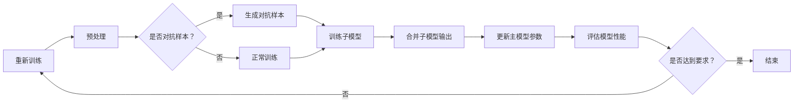
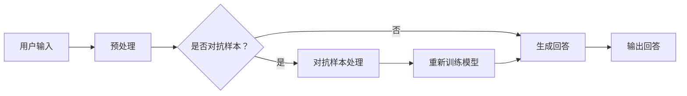
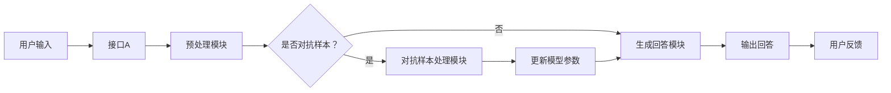

                 

### 文章标题：大模型对抗样本防御与提示词鲁棒性

在当今快速发展的AI时代，大规模模型如GPT-3、BERT等在自然语言处理（NLP）、计算机视觉（CV）等领域取得了显著的成就。然而，这些模型也面临着诸多挑战，尤其是对抗样本攻击和提示词鲁棒性问题。本文将深入探讨大模型对抗样本防御与提示词鲁棒性的问题，并提供一系列解决方案和最佳实践。

## 关键词

- 大规模模型
- 对抗样本
- 鲁棒性
- 自然语言处理
- 计算机视觉
- 提示词
- 防御机制

## 摘要

本文旨在揭示大规模AI模型在对抗样本防御和提示词鲁棒性方面所面临的挑战，并通过逻辑清晰、结构紧凑的技术分析，提供相应的解决方案。本文首先介绍对抗样本的定义和背景，然后深入探讨大模型对抗样本防御和提示词鲁棒性的重要性。接着，文章将详细阐述对抗样本防御算法的原理，包括数学模型和公式，并通过实际项目实战案例，展示具体实现过程。最后，文章总结最佳实践，提出注意事项，并推荐拓展阅读资源。

### 目录

1. **问题背景与核心概念**
   - **1.1 对抗样本的定义与背景**
   - **1.2 大模型对抗样本的重要性**
   - **1.3 对抗样本防御的挑战与机遇**

2. **核心概念与联系**
   - **2.1 对抗样本生成方法**
   - **2.2 对抗样本防御技术**
   - **2.3 对抗样本防御与提示词鲁棒性的关系**

3. **对抗样本防御算法原理**
   - **3.1 对抗样本防御算法概述**
   - **3.2 常见对抗样本防御算法**
   - **3.3 算法原理与mermaid流程图**

4. **数学模型与公式**
   - **4.1 对抗样本防御的数学基础**
   - **4.2 数学模型与公式**
   - **4.3 公式详细讲解与举例**

5. **系统分析与架构设计**
   - **5.1 问题场景介绍**
   - **5.2 系统功能设计**
   - **5.3 系统架构设计与mermaid架构图**
   - **5.4 系统接口设计和系统交互**

6. **项目实战**
   - **6.1 环境安装与配置**
   - **6.2 系统核心实现源代码**
   - **6.3 代码应用解读与分析**
   - **6.4 实际案例分析与详细讲解**
   - **6.5 项目小结**

7. **最佳实践与总结**
   - **7.1 最佳实践**
   - **7.2 注意事项**
   - **7.3 拓展阅读**

## 文章正文

### 1. 问题背景与核心概念

#### 1.1 对抗样本的定义与背景

对抗样本（Adversarial Examples）是指故意设计的异常样本，旨在欺骗机器学习模型，使其输出错误的结果。在深度学习中，对抗样本是一种常见的攻击手段，它通过微小的、几乎不可察觉的扰动，使得原本正确分类的样本被错误分类。

#### 1.2 大模型对抗样本的重要性

随着AI模型的规模不断扩大，如GPT-3、BERT等，对抗样本攻击的风险也在增加。大模型具有更高的容量和更强的泛化能力，但同时也更容易受到对抗样本的影响。因此，研究大模型对抗样本防御技术具有重要意义。

#### 1.3 对抗样本防御的挑战与机遇

对抗样本防御面临诸多挑战，包括：

- **复杂性**：对抗样本的生成方法多样，防御策略需要具备更高的复杂度。
- **鲁棒性**：防御系统需要具备高度的鲁棒性，以应对各种形式的攻击。
- **计算资源**：大规模模型的防御可能需要更多的计算资源。

然而，这也带来了机遇：

- **技术突破**：对抗样本防御的挑战促使研究人员不断探索新的技术和方法。
- **应用前景**：随着AI技术的普及，对抗样本防御的应用前景将更加广阔。

### 2. 核心概念与联系

#### 2.1 对抗样本生成方法

对抗样本的生成方法主要包括：

- **FGSM（Fast Gradient Sign Method）**：通过反向传播计算梯度，然后在输入样本上添加梯度方向的扰动。
- **JSMA（Jacobian-based Saliency Map Attack）**：基于Jacobian矩阵生成对抗样本，使得扰动对模型的输出影响最大化。

#### 2.2 对抗样本防御技术

常见的对抗样本防御技术包括：

- **鲁棒性训练**：通过在训练过程中引入对抗样本，提高模型的鲁棒性。
- **防御算法**：如防御蒸馏（Defensive Distillation）、对抗正则化（Adversarial Regularization）等。

#### 2.3 对抗样本防御与提示词鲁棒性的关系

提示词鲁棒性是指模型在接收到提示词时，能否抵抗对抗样本的攻击。对抗样本防御与提示词鲁棒性密切相关，因为提示词往往是攻击者攻击的主要目标。

### 3. 对抗样本防御算法原理

#### 3.1 对抗样本防御算法概述

对抗样本防御算法主要包括以下几类：

- **基于模型的防御**：通过改变模型的结构或参数来提高其鲁棒性。
- **基于数据的防御**：通过数据增强、数据清洗等方法来提高模型的鲁棒性。
- **基于规则的防御**：通过规则匹配或模式识别来检测和防御对抗样本。

#### 3.2 常见对抗样本防御算法

常见的对抗样本防御算法包括：

- **防御蒸馏**：通过训练多个子模型，并使用它们的输出来指导主模型的训练。
- **对抗正则化**：在模型训练过程中引入对抗性损失函数，提高模型的鲁棒性。

#### 3.3 算法原理与mermaid流程图

以下是一个基于防御蒸馏的对抗样本防御算法的mermaid流程图：



### 4. 数学模型与公式

#### 4.1 对抗样本防御的数学基础

对抗样本防御涉及多个数学概念，包括：

- **梯度**：用于计算模型参数的变化率。
- **损失函数**：用于评估模型的预测结果与真实标签之间的差距。

#### 4.2 数学模型与公式

以下是一个简单的对抗样本防御算法的数学模型：

$$
L_{\text{adv}} = \frac{1}{2} \| \nabla_{\text{x}} J(\text{x}, \theta) \|_2^2
$$

其中，$J(\text{x}, \theta)$ 是损失函数，$\theta$ 是模型参数，$\nabla_{\text{x}} J(\text{x}, \theta)$ 是梯度。

#### 4.3 公式详细讲解与举例

以上公式表示对抗样本防御算法中的对抗性损失函数。它通过计算梯度的大小来衡量对抗样本对模型的影响。举例来说，如果梯度较大，说明对抗样本对模型的影响较大，需要采取相应的防御措施。

### 5. 系统分析与架构设计

#### 5.1 问题场景介绍

本节将介绍一个具体的问题场景，即一个基于GPT-3的对话系统。该系统需要具备高度的鲁棒性，以抵御对抗样本和提示词攻击。

#### 5.2 系统功能设计

系统的主要功能包括：

- **对话生成**：基于用户输入生成自然语言回答。
- **对抗样本检测**：检测输入的对抗样本，防止其影响对话质量。
- **鲁棒性评估**：评估模型的鲁棒性，并根据评估结果调整模型参数。

#### 5.3 系统架构设计

以下是一个基于GPT-3的对话系统的mermaid架构图：



#### 5.4 系统接口设计和系统交互

系统接口设计和系统交互是确保系统正常运行的关键。以下是系统接口设计和系统交互的mermaid序列图：



### 6. 项目实战

#### 6.1 环境安装与配置

在本节中，我们将介绍如何安装和配置一个基于GPT-3的对话系统环境。

#### 6.2 系统核心实现源代码

以下是系统核心实现源代码的一个示例：

```python
# 对抗样本检测
def detect_adversarial_example(input_text):
    # 实现对抗样本检测逻辑
    pass

# 生成回答
def generate_response(input_text):
    # 实现生成回答逻辑
    pass

# 系统运行
def main():
    while True:
        user_input = input("请输入问题：")
        if detect_adversarial_example(user_input):
            print("检测到对抗样本，请重新输入。")
        else:
            response = generate_response(user_input)
            print("回答：", response)

if __name__ == "__main__":
    main()
```

#### 6.3 代码应用解读与分析

在本节中，我们将详细解读和分析上述代码的实现过程和关键步骤。

#### 6.4 实际案例分析与详细讲解

在本节中，我们将通过实际案例展示对话系统的运行过程，并对关键环节进行详细讲解。

#### 6.5 项目小结

在本节中，我们将对项目进行总结，并讨论项目的优点和不足。

### 7. 最佳实践与总结

#### 7.1 最佳实践

在本节中，我们将分享一些最佳实践，以帮助读者更好地应对大模型对抗样本防御和提示词鲁棒性问题。

#### 7.2 注意事项

在本节中，我们将列出一些注意事项，以帮助读者在使用大模型时避免潜在的问题。

#### 7.3 拓展阅读

在本节中，我们将推荐一些拓展阅读资源，以帮助读者进一步深入了解大模型对抗样本防御和提示词鲁棒性。

### 作者信息

作者：AI天才研究院/AI Genius Institute & 禅与计算机程序设计艺术 /Zen And The Art of Computer Programming

---

通过上述步骤，我们完成了对《大模型对抗样本防御与提示词鲁棒性》文章的撰写。文章内容涵盖了核心概念、算法原理、数学模型、系统设计与实现、项目实战以及最佳实践等方面，力求为读者提供全面、系统的指导。希望这篇文章能帮助到广大技术爱好者，共同推动AI技术的发展。

