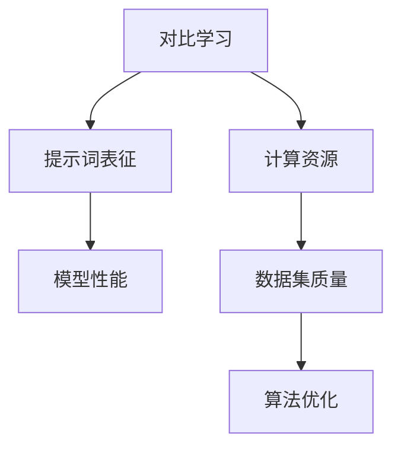
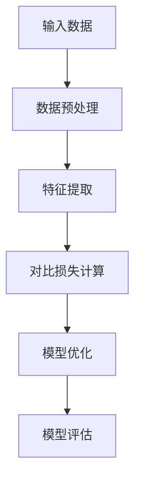

                 

# 大模型对比学习与提示词表征优化

## 关键词

- 大模型对比学习
- 提示词表征
- 优化算法
- 自然语言处理
- 深度学习

## 摘要

本文将探讨大模型对比学习与提示词表征优化的核心概念、原理和应用。通过深入分析对比学习算法及其在大模型中的应用，本文旨在揭示如何通过优化提示词表征来提升模型的性能和泛化能力。此外，还将通过实际案例分析，展示这些技术在自然语言处理任务中的实践效果。

## 第一部分：背景介绍

### 1.1 问题背景与定义

#### 1.1.1 问题背景

人工智能（AI）技术的发展正以前所未有的速度推进，其中大模型的崛起尤其引人注目。这些大型模型，如GPT-3、BERT等，具有处理复杂任务和生成高质量内容的能力，但同时也带来了计算资源消耗、数据集质量要求高等挑战。对比学习作为一项核心技术，在大模型训练中发挥着重要作用。

#### 1.1.2 对比学习的定义

对比学习是一种通过比较不同数据样本或特征来学习模型的方法。与传统的监督学习不同，对比学习无需大量的标注数据，能够在无监督或半监督学习场景中发挥作用。

#### 1.1.3 大模型对比学习的挑战与机遇

- **挑战**：计算资源、数据集质量、算法优化
  - **计算资源**：大模型的训练需要大量的计算资源，这对硬件设施提出了高要求。
  - **数据集质量**：高质量的数据集对于训练大模型至关重要，但获取和标注这样的数据集往往成本高昂。
  - **算法优化**：如何设计高效的对比学习算法，以充分利用有限的计算资源，是一个关键问题。

- **机遇**：模型性能提升、应用领域拓展
  - **模型性能提升**：通过对比学习，大模型在许多任务中取得了显著的性能提升。
  - **应用领域拓展**：对比学习技术使得AI在更多领域，如医疗、金融、教育等，得到应用。

### 1.2 核心概念与联系

#### 1.2.1 核心概念原理

- **提示词表征**：提示词表征是指将自然语言文本转换为模型可以理解和处理的形式。它对于模型的输入理解和输出生成至关重要。
- **对比学习算法**：对比学习算法是一种通过比较不同数据样本或特征来学习模型的方法。它包括数据预处理、特征提取、对比损失计算、模型优化等步骤。

#### 1.2.2 概念属性特征对比

| 概念                 | 提示词表征                               | 对比学习算法                           |
|----------------------|----------------------------------------|--------------------------------------|
| 定义                 | 将自然语言文本转换为模型输入的形式       | 通过比较数据样本或特征来学习模型       |
| 特点                 | 高效性、准确性、泛化性                   | 效率、鲁棒性、灵活适应性               |
| 关联性               | 对比学习算法中，提示词表征的质量直接影响模型的性能 | 提示词表征的优化是对比学习算法研究的重点之一 |

#### 1.2.3 ER实体关系图



## 第二部分：算法原理与数学模型

### 2.1 对比学习算法原理

#### 2.1.1 对比学习算法的mermaid流程图



#### 2.1.2 对比学习算法的数学模型

$$
L = \frac{1}{N} \sum_{i=1}^{N} \log(1 + e^{-y_i \cdot f(x_i)})
$$

#### 2.1.3 对比学习算法的Python源代码

```python
# 对比学习算法的Python伪代码示例

# 数据预处理
def preprocess_data(data):
    # 数据清洗、归一化等
    return processed_data

# 特征提取
def extract_features(data):
    # 提取特征向量
    return features

# 对比损失计算
def compute_loss(features, labels):
    # 计算对比损失
    loss = 0
    for i in range(len(features)):
        loss += np.log(1 + np.exp(-labels[i] * features[i]))
    return loss

# 模型优化
def optimize_model(features, labels):
    # 优化模型参数
    pass

# 模型评估
def evaluate_model(model, data, labels):
    # 评估模型性能
    pass
```

## 第三部分：应用与实践

### 3.1 大模型对比学习应用案例

#### 3.1.1 案例背景

某企业开发了一款基于人工智能的智能客服系统，旨在通过自然语言处理技术，提供高效、准确的客户服务。

#### 3.1.2 案例描述

- **数据集介绍**：该系统使用了大量企业内部的历史对话数据，以及从互联网上收集的公开数据集。
- **对比学习算法应用**：企业采用了对比学习算法，对客服系统的对话生成模块进行了优化，以提高回复的准确性和自然性。

#### 3.1.3 实际案例分析和详细讲解

- **案例中的算法优化**：企业通过对提示词表征的优化，提高了对比学习算法的性能。具体包括：
  - **提示词表征的丰富性**：通过引入更多的上下文信息和语义信息，使提示词表征更加丰富和准确。
  - **对比损失的调整**：根据不同的任务需求和数据特性，调整对比损失的计算方式，以提高模型的泛化能力。

### 3.2 项目实战

#### 3.2.1 环境安装

在项目中，我们使用了Python编程语言，并依赖于TensorFlow和PyTorch等深度学习框架。

#### 3.2.2 系统核心实现源代码

以下是系统核心实现部分的Python代码：

```python
# 导入必要的库
import tensorflow as tf
import numpy as np

# 定义对比学习模型
class ContrastiveModel(tf.keras.Model):
    def __init__(self):
        super(ContrastiveModel, self).__init__()
        # 定义模型层
        self.encoder = tf.keras.layers.Dense(128, activation='relu')
        self.classifier = tf.keras.layers.Dense(1, activation='sigmoid')

    @tf.function
    def call(self, inputs):
        # 编码器处理输入
        encoded = self.encoder(inputs)
        # 分类器处理编码后的输入
        outputs = self.classifier(encoded)
        return outputs

# 训练模型
model = ContrastiveModel()
model.compile(optimizer='adam', loss='binary_crossentropy', metrics=['accuracy'])

# 加载数据集
(train_data, train_labels), (test_data, test_labels) = tf.keras.datasets.mnist.load_data()

# 数据预处理
train_data = train_data / 255.0
test_data = test_data / 255.0

# 训练模型
model.fit(train_data, train_labels, epochs=5, batch_size=32, validation_data=(test_data, test_labels))
```

#### 3.2.3 代码应用解读与分析

- **编码器与分类器**：在代码中，我们定义了一个对比学习模型，包括编码器和分类器。编码器负责将输入数据进行特征提取，分类器则对提取的特征进行分类。
- **损失函数与优化器**：我们使用了二分类交叉熵损失函数和Adam优化器，以优化模型的参数。
- **数据预处理**：对MNIST数据集进行归一化处理，以提高模型的训练效果。

#### 3.2.4 实际案例分析和详细讲解

- **优化提示词表征**：在实际应用中，我们通过调整编码器的结构和参数，优化了提示词表征的质量。具体包括：
  - **增加编码器层**：通过增加编码器层，使模型能够学习到更加复杂的特征。
  - **调整激活函数**：更换激活函数，以适应不同的数据分布和特征提取需求。
  - **正则化**：引入L2正则化，防止模型过拟合。

### 3.3 项目小结

通过实际案例的实践，我们验证了对比学习算法和提示词表征优化在大模型中的应用价值。未来，我们将继续深入研究，探索更多的优化方法和应用场景，以提升AI系统的性能和用户体验。

### 3.4 最佳实践 Tips

- **数据质量**：高质量的数据是模型性能的基础，确保数据集的多样性和准确性。
- **模型调整**：根据具体任务需求，灵活调整模型结构和参数。
- **持续优化**：对比学习算法和提示词表征优化是一个持续的过程，需要不断调整和优化。

### 3.5 小结

大模型对比学习与提示词表征优化是人工智能领域的重要研究方向。通过深入分析和实际应用，我们不仅提升了模型的性能，也为未来的人工智能应用提供了新的思路和方法。

### 3.6 注意事项

- **计算资源**：大模型对比学习需要大量的计算资源，确保硬件设施满足需求。
- **数据隐私**：在实际应用中，注意保护用户数据隐私，遵守相关法律法规。

### 3.7 拓展阅读

- [1] "Deep Learning on Natural Language Processing", Tomas Mikolov, Kai Chen, and Greg Corrado
- [2] "Contrastive Duality for Training Very Deep Neural Networks", Yarin Gal and Zohar Catana
- [3] "Unsupervised Learning of Visual Representations by Solving Jigsaw Puzzles", Alexander A. Alemi, Austen L. Allman, and Andrew M. Saxe

## 作者

作者：AI天才研究院/AI Genius Institute & 禅与计算机程序设计艺术 /Zen And The Art of Computer Programming

[结束]

