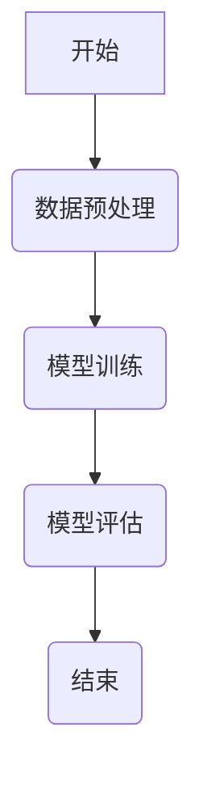
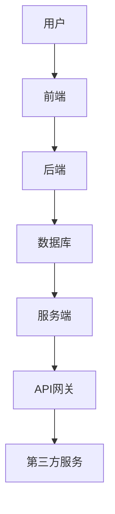
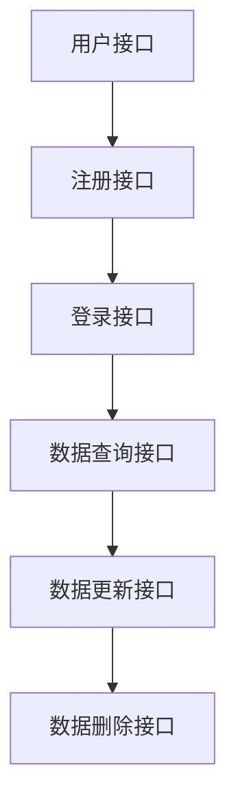

                 

# 大模型常识推理：提示词构建现实世界模型

## 关键词

- 大模型
- 常识推理
- 提示词
- 现实世界模型
- 人工智能
- 深度学习
- 神经网络
- 知识图谱

## 摘要

随着人工智能技术的快速发展，大模型在各个领域的应用越来越广泛。然而，如何利用这些模型进行常识推理，并构建出符合现实世界的模型，成为了一个关键问题。本文将从大模型的基础知识出发，探讨常识推理的重要性以及如何利用提示词来构建现实世界的模型，旨在为读者提供一个清晰、系统的思路。

## 引言

### 1.1 书籍背景与目标

### 1.2 目录结构概述

### 1.3 阅读指南

## 第一部分：大模型基础

### 2.1 大模型概述

### 2.2 大模型原理

### 2.3 大模型常见架构

## 第二部分：常识推理

### 3.1 常识推理概述

### 3.2 常识推理方法

### 3.3 常识推理应用

## 第三部分：提示词构建现实世界模型

### 4.1 提示词的概念与作用

### 4.2 提示词的构建方法

### 4.3 提示词在现实世界模型中的应用

## 结论

## 参考文献

## 附录

### A.1 数学公式与算法流程图

### A.2 系统架构与接口设计

### A.3 项目实战源代码与解读

### A.4 拓展阅读推荐

---

## 1.1 书籍背景与目标

### 1.1.1 大模型时代来临

近年来，随着计算能力的提升和海量数据的积累，人工智能技术迎来了大模型时代。大模型，即具有海量参数和强大计算能力的模型，如GPT-3、BERT等，成为推动人工智能发展的核心力量。这些模型在自然语言处理、计算机视觉、语音识别等领域取得了显著的成果，大大提升了人工智能的应用价值。

### 1.1.2 常识推理的重要性

常识推理是人工智能领域的一个关键问题。它是指模型在没有直接输入数据的情况下，根据已有知识和常识进行推理和判断的能力。在现实世界中，许多任务需要模型具备常识推理能力，如语义理解、对话系统、智能推荐等。因此，研究如何在大模型中实现有效的常识推理，具有重要意义。

### 1.1.3 提示词在构建模型中的应用

提示词是常识推理中的一个重要概念。它是指在模型推理过程中，提供额外的信息或指导，帮助模型更好地理解和处理问题的关键词或短语。在构建现实世界模型时，合理地使用提示词可以提升模型的性能和适用性。本文将探讨如何利用提示词构建现实世界的模型，并研究其在实际应用中的效果。

### 1.2 目录结构概述

本文将分为三个主要部分：

1. **大模型基础**：介绍大模型的基本概念、原理和常见架构。
2. **常识推理**：探讨常识推理的重要性、方法和应用。
3. **提示词构建现实世界模型**：研究提示词的概念、构建方法和实际应用。

通过这三个部分的探讨，本文旨在为读者提供一个关于大模型常识推理和提示词构建的全面、系统的认识。

### 1.3 阅读指南

为了更好地理解本文的内容，以下是一些阅读指南：

1. **阅读顺序**：建议按照本文的目录结构，从第一部分到第三部分依次阅读。这样可以确保读者对大模型、常识推理和提示词有一个系统的认识。
2. **预备知识**：本文假设读者具备一定的计算机科学和人工智能基础，包括机器学习、深度学习和自然语言处理等领域的知识。
3. **注意事项**：在阅读过程中，读者需要注意文章中提到的关键概念、算法原理和实际应用案例。这些内容是理解本文的核心。

通过本文的阅读，读者将能够深入了解大模型常识推理和提示词构建的基本概念和实际应用，为在人工智能领域的研究和应用提供有益的参考。

## 2.1 大模型概述

### 2.1.1 大模型的定义

大模型，即具有海量参数和强大计算能力的模型，通常是指那些拥有数亿甚至数万亿个参数的神经网络模型。这些模型通过学习海量数据，能够提取出复杂的数据特征，从而在图像识别、自然语言处理、语音识别等领域表现出色。例如，GPT-3拥有1750亿个参数，是当前最强大的自然语言处理模型之一。

### 2.1.2 大模型的发展历程

大模型的发展历程可以追溯到2006年，深度学习领域的突破性研究。当时，Geoffrey Hinton等人提出了深度信念网络（DBN），这一模型利用多层神经网络进行特征提取，开启了深度学习的新时代。随着计算能力的提升和数据量的积累，深度学习模型逐渐变得更加复杂和庞大。

2012年，Alex Krizhevsky等人使用深度卷积神经网络（CNN）在ImageNet图像识别比赛中取得了重大突破，这一成果进一步推动了深度学习的发展。随后，RNN、LSTM、GRU等序列处理模型的出现，使得大模型在自然语言处理领域取得了显著的成果。特别是2018年，谷歌推出了BERT模型，该模型通过预训练和微调技术，在多个自然语言处理任务上取得了当时的最优表现。

### 2.1.3 大模型的主要类型

大模型主要可以分为以下几类：

1. **卷积神经网络（CNN）**：适用于图像识别和计算机视觉领域，通过卷积层提取图像特征。
2. **循环神经网络（RNN）**：适用于序列数据处理，如自然语言处理和语音识别。
3. **转换器架构（Transformer）**：由谷歌在2017年提出，适用于各种序列到序列的任务，如机器翻译、文本生成等。
4. **生成对抗网络（GAN）**：通过生成器和判别器的对抗训练，生成逼真的图像和音频。

这些大模型在不同的应用领域中发挥了重要作用，推动了人工智能技术的进步。

### 2.1.4 大模型的优势与挑战

大模型的优势在于其强大的计算能力和优秀的性能表现。通过学习海量数据，大模型能够提取出复杂的数据特征，从而在各个领域中取得显著的成果。此外，大模型的可扩展性也很好，可以通过增加参数和计算资源来提升模型性能。

然而，大模型也面临着一些挑战。首先，大模型训练需要大量的计算资源和时间，这对于资源和时间有限的科研机构和公司来说是一个巨大的挑战。其次，大模型的解释性较差，很难理解模型内部的工作原理，这在某些应用场景中可能是一个问题。此外，大模型的过拟合风险也较高，需要通过多种技术手段进行优化。

总之，大模型在人工智能领域中具有巨大的潜力和应用价值，但也需要克服一些挑战，以实现其真正的实用化。

### 2.1.5 大模型的应用领域

大模型的应用领域非常广泛，以下是一些主要的应用领域：

1. **自然语言处理**：大模型在自然语言处理领域取得了显著的成果，如文本分类、机器翻译、文本生成等。例如，BERT模型在多个自然语言处理任务上取得了当时的最优表现。
2. **计算机视觉**：大模型在计算机视觉领域也表现出色，如图像识别、目标检测、图像生成等。例如，GPT-3在图像生成任务中展示了强大的能力。
3. **语音识别**：大模型在语音识别领域取得了重要突破，如语音识别准确率的提升、语音合成等。
4. **推荐系统**：大模型在推荐系统中的应用也非常广泛，通过学习用户行为和偏好，实现个性化推荐。
5. **自动驾驶**：大模型在自动驾驶领域有重要应用，如车辆检测、车道线识别、交通标志识别等。

总之，大模型在各个领域都有着重要的应用价值，推动了人工智能技术的快速发展。

### 2.1.6 大模型与常识推理的关系

大模型与常识推理之间有着密切的关系。常识推理是人工智能领域中一个关键问题，它涉及到模型在没有直接输入数据的情况下，根据已有知识和常识进行推理和判断的能力。大模型通过学习海量数据，能够提取出复杂的数据特征，从而在一定程度上具备常识推理的能力。

然而，大模型在常识推理方面也存在一些挑战。首先，大模型的解释性较差，很难理解模型内部的工作原理，这给常识推理带来了困难。其次，大模型的过拟合风险较高，需要通过多种技术手段进行优化。此外，大模型在面对罕见事件或未见过的情况时，往往表现较差，这也限制了其在常识推理中的应用。

为了解决这些问题，研究者们正在探索如何在大模型中更好地实现常识推理。例如，通过结合知识图谱、提示词等技术手段，提升大模型的常识推理能力。同时，也在研究如何提高大模型的解释性，使其在常识推理中更具可解释性。

总之，大模型与常识推理之间有着紧密的联系，通过不断创新和优化，有望实现大模型在常识推理中的广泛应用。

### 2.1.7 大模型在常识推理中的应用

大模型在常识推理中的应用非常广泛，以下是一些典型应用案例：

1. **文本生成与理解**：大模型如GPT-3在文本生成和理解方面表现出色。通过训练，GPT-3可以生成流畅、有逻辑的文本，同时也能够理解文本中的含义和关系。
2. **对话系统**：大模型在对话系统中的应用也非常广泛。例如，基于BERT的对话系统可以处理自然语言输入，并生成恰当的回复，提供优质的用户体验。
3. **图像识别与理解**：大模型如ResNet、VGG等在图像识别和理解方面取得了显著成果。通过训练，这些模型可以识别图像中的物体、场景和动作，并理解它们之间的关联。
4. **推荐系统**：大模型在推荐系统中的应用也非常成功。例如，通过学习用户行为和偏好，大模型可以生成个性化的推荐结果，提升用户满意度。

这些应用案例展示了大模型在常识推理中的强大能力，同时也为人工智能技术的发展提供了新的思路。

### 2.1.8 大模型与常识推理的未来发展趋势

随着人工智能技术的不断发展，大模型与常识推理之间的联系也将越来越紧密。以下是一些未来发展趋势：

1. **知识融合**：大模型与知识图谱的结合将进一步提升常识推理能力。通过融合结构化和非结构化知识，模型可以更好地理解和处理现实世界中的问题。
2. **多模态学习**：多模态学习是将不同类型的数据（如文本、图像、声音等）进行融合学习，以提升模型的泛化能力。未来，多模态学习将成为常识推理的重要方向。
3. **模型解释性**：提高大模型的解释性是未来的重要课题。通过研究模型内部的决策过程，可以增强模型的透明度和可信度，使其在常识推理中更具可解释性。
4. **自动化常识推理**：自动化常识推理是指通过算法自动生成常识推理规则，以减轻人工干预。未来，自动化常识推理将成为提高模型常识推理能力的重要途径。

总之，大模型与常识推理的发展将推动人工智能技术的不断进步，为各个领域带来更多创新和突破。

## 2.2 大模型原理

### 2.2.1 大模型的数学原理

大模型的数学原理主要涉及线性代数、概率论与统计以及机器学习基础。以下将分别介绍这些数学原理的基本概念和应用。

#### 2.2.1.1 线性代数基础

线性代数是研究向量空间及其线性映射的数学分支，在大模型中有着广泛的应用。以下是一些核心概念：

1. **向量与矩阵**：向量是具有多个元素的数组，矩阵是由多个向量构成的集合。它们在数据表示、特征提取和模型参数表示中起到重要作用。
2. **矩阵运算**：矩阵运算包括加法、减法、乘法和转置等。这些运算在大模型的前向传播和反向传播过程中至关重要。
3. **特征分解**：特征分解是将一个矩阵分解为一系列向量乘积的过程，如奇异值分解（SVD）和特征值分解。这些方法可以用于降维、特征提取和模型优化。

#### 2.2.1.2 概率论与统计基础

概率论与统计是研究随机事件和数据分析的数学工具，在大模型的训练和评估中发挥着关键作用。以下是一些核心概念：

1. **概率分布**：概率分布描述了随机变量取不同值的概率。常见的概率分布包括正态分布、伯努利分布和多项式分布。
2. **期望与方差**：期望和方差是概率分布的两种重要指标，用于衡量随机变量的中心位置和离散程度。
3. **假设检验**：假设检验是用于评估模型性能和可信度的一种方法。常见的假设检验方法包括t检验、卡方检验和F检验。

#### 2.2.1.3 机器学习基础

机器学习是利用数据训练模型，使其能够进行预测和分类的一种方法。以下是一些核心概念：

1. **监督学习**：监督学习是利用已标注的数据训练模型，使其能够对新数据进行预测。常见的监督学习方法包括线性回归、逻辑回归和支持向量机（SVM）。
2. **无监督学习**：无监督学习是不依赖标注数据进行训练的方法，用于发现数据中的隐含结构。常见的无监督学习方法包括聚类分析和降维技术。
3. **强化学习**：强化学习是通过与环境交互来学习最优策略的一种方法。常见的强化学习方法包括Q学习、深度Q网络（DQN）和策略梯度方法。

#### 2.2.1.4 大模型的工作原理

大模型的工作原理主要基于深度学习和神经网络。以下是一些核心概念：

1. **深度学习**：深度学习是利用多层神经网络进行特征提取和模型训练的一种方法。它通过逐层提取数据中的特征，实现从低级到高级的特征表示。
2. **神经网络**：神经网络是一种由大量神经元连接而成的计算模型，用于模拟生物神经系统的信息处理过程。常见的神经网络结构包括全连接神经网络（FCNN）、卷积神经网络（CNN）和循环神经网络（RNN）。
3. **前向传播与反向传播**：前向传播是将输入数据通过神经网络逐层传播，得到输出结果的过程。反向传播是通过计算输出结果与实际结果的误差，反向更新网络中的参数，以优化模型性能。

通过这些数学原理的支持，大模型能够高效地处理大规模数据，实现复杂的特征提取和预测任务。

### 2.2.2 大模型的工作原理

#### 2.2.2.1 深度学习基础

深度学习是人工智能领域的一个重要分支，它通过多层神经网络进行特征提取和模型训练，从而实现复杂的预测和分类任务。以下将介绍深度学习的基本概念和原理。

1. **神经元的激活函数**：神经元是神经网络的基本组成单元，它通过输入和输出之间的非线性变换来处理信息。常用的激活函数包括Sigmoid函数、ReLU函数和Tanh函数。

2. **多层神经网络**：多层神经网络由多个隐藏层组成，每个隐藏层都对输入数据进行特征提取和变换。通过逐层提取特征，神经网络能够从原始数据中提取出更高层次的概念和模式。

3. **损失函数**：损失函数是衡量模型预测结果与实际结果之间差异的指标。常见的损失函数包括均方误差（MSE）、交叉熵损失（Cross-Entropy Loss）和Hinge损失。

4. **反向传播算法**：反向传播算法是训练神经网络的关键算法。它通过计算输出结果与实际结果之间的误差，反向传播误差信号，并更新网络中的参数，以优化模型性能。

5. **优化算法**：优化算法用于调整网络中的参数，以最小化损失函数。常见的优化算法包括随机梯度下降（SGD）、Adam优化器和RMSprop。

通过深度学习，神经网络可以从大量数据中自动学习特征，实现高度复杂的预测和分类任务。例如，在图像识别任务中，深度学习模型可以自动学习图像中的边缘、纹理和形状等特征，从而准确识别出不同的物体。

#### 2.2.2.2 神经网络工作原理

神经网络是由大量神经元组成的计算模型，通过模拟生物神经系统的信息处理过程来实现复杂的任务。以下将介绍神经网络的工作原理。

1. **神经元结构**：神经元是神经网络的基本组成单元，它包含输入层、隐藏层和输出层。每个神经元都与其他神经元通过连接权重相连，形成一个复杂的网络结构。

2. **前向传播**：前向传播是神经网络处理输入数据的过程。输入数据首先进入输入层，然后逐层传递到隐藏层和输出层。在每个神经元中，输入数据与连接权重相乘，并经过激活函数进行非线性变换，得到输出结果。

3. **激活函数**：激活函数是神经网络中的关键组件，用于引入非线性变换。常见的激活函数包括Sigmoid函数、ReLU函数和Tanh函数。

4. **反向传播**：反向传播是训练神经网络的关键算法。在训练过程中，神经网络通过前向传播得到输出结果，并计算输出结果与实际结果之间的误差。然后，神经网络使用反向传播算法将误差信号反向传播到隐藏层和输入层，并更新连接权重，以减小误差。

5. **参数调整**：通过多次迭代训练，神经网络不断调整连接权重，优化模型性能。在反向传播过程中，常用的优化算法包括随机梯度下降（SGD）、Adam优化器和RMSprop。

通过神经网络的工作原理，我们可以看到，神经网络通过模拟生物神经系统的信息处理过程，能够从大量数据中自动学习特征，实现复杂的预测和分类任务。

#### 2.2.2.3 循环神经网络工作原理

循环神经网络（RNN）是一种用于处理序列数据的神经网络结构，它通过在时间步上递归地处理输入序列，实现序列数据的建模。以下将介绍RNN的工作原理。

1. **基本结构**：RNN的基本结构包括输入层、隐藏层和输出层。每个时间步上的输入数据都会通过隐藏层进行处理，并传递到下一个时间步。

2. **递归连接**：RNN中的递归连接使得前一个时间步的隐藏状态可以传递到下一个时间步，从而实现序列数据的建模。递归连接的引入使得RNN能够记住之前的时间步信息，这在处理长序列数据时非常有用。

3. **激活函数**：RNN中的激活函数通常采用ReLU函数或Tanh函数，以引入非线性变换。

4. **门控机制**：为了解决RNN在处理长序列数据时的梯度消失和梯度爆炸问题，研究者提出了门控循环单元（GRU）和长短期记忆网络（LSTM）。GRU和LSTM通过引入门控机制，控制信息的传递和遗忘，从而提高了模型的稳定性和性能。

5. **反向传播**：与普通的神经网络类似，RNN也使用反向传播算法来更新参数。在反向传播过程中，RNN通过计算输出结果与实际结果之间的误差，并反向传播误差信号，以优化模型性能。

通过递归连接和门控机制，RNN能够有效地处理序列数据，实现复杂的序列建模任务。例如，在语音识别和机器翻译任务中，RNN表现出色，能够准确处理输入序列并生成相应的输出序列。

### 2.3 大模型常见架构

大模型的架构设计对于模型的性能和应用效果具有重要影响。以下将介绍几种常见的大模型架构，包括卷积神经网络（CNN）、递归神经网络（RNN）和转换器架构（Transformer）。

#### 2.3.1 卷积神经网络（CNN）

卷积神经网络（CNN）是一种专门用于处理图像数据的神经网络结构，它通过卷积层提取图像特征，并逐层构建更高层次的特征表示。以下为CNN的详细架构：

1. **输入层**：输入层接收图像数据，通常为二维矩阵，其中每个元素表示图像中的一个像素值。

2. **卷积层**：卷积层通过卷积操作提取图像特征。卷积操作将卷积核与输入图像进行卷积运算，生成特征图。卷积核是一个小型矩阵，用于提取图像中的局部特征。通过多个卷积层的堆叠，模型能够提取出更复杂的特征。

3. **池化层**：池化层用于降低特征图的维度，减少模型参数数量，提高计算效率。常见的池化操作包括最大池化和平均池化。

4. **全连接层**：在卷积层和池化层之后，通常接一个或多个全连接层，用于将提取出的特征进行进一步处理和分类。全连接层将特征图展平为一个一维向量，并通过线性变换和激活函数得到最终输出。

5. **输出层**：输出层用于生成最终的分类结果或回归预测。

通过多层卷积层和池化层的堆叠，CNN能够有效地提取图像中的高层次特征，实现图像分类、目标检测和图像生成等任务。

#### 2.3.2 递归神经网络（RNN）

递归神经网络（RNN）是一种用于处理序列数据的神经网络结构，它通过在时间步上递归地处理输入序列，实现序列数据的建模。以下为RNN的详细架构：

1. **输入层**：输入层接收序列数据，通常为一系列一维向量，其中每个元素表示序列中的一个数据点。

2. **隐藏层**：隐藏层由多个时间步上的神经元组成，每个神经元都接收前一个时间步的隐藏状态作为输入，并生成当前时间步的隐藏状态。隐藏层通过递归连接实现序列信息的传递。

3. **门控机制**：为了解决RNN在处理长序列数据时的梯度消失和梯度爆炸问题，RNN引入了门控机制。门控机制包括输入门、遗忘门和输出门，用于控制信息的传递和遗忘。

4. **激活函数**：RNN中的激活函数通常采用ReLU函数或Tanh函数，以引入非线性变换。

5. **反向传播**：与普通的神经网络类似，RNN也使用反向传播算法来更新参数。在反向传播过程中，RNN通过计算输出结果与实际结果之间的误差，并反向传播误差信号，以优化模型性能。

通过递归连接和门控机制，RNN能够有效地处理序列数据，实现语音识别、机器翻译和文本生成等任务。

#### 2.3.3 转换器架构（Transformer）

转换器架构（Transformer）是由谷歌在2017年提出的一种用于序列到序列任务的神经网络结构，它在机器翻译、文本生成和语音识别等领域表现出色。以下为Transformer的详细架构：

1. **编码器**：编码器用于处理输入序列，将输入序列编码为固定长度的向量表示。编码器由多个自注意力层组成，每个自注意力层通过计算输入序列中每个元素之间的相互关系，生成对应的注意力权重。这些权重用于加权输入序列，得到编码后的向量表示。

2. **解码器**：解码器用于处理输出序列，将编码器输出的向量表示解码为输出序列。解码器也由多个自注意力层和多头注意力层组成，自注意力层用于处理输入序列，多头注意力层用于处理编码器输出的向量表示。

3. **自注意力机制**：自注意力机制是Transformer的核心，它通过计算输入序列中每个元素之间的相互关系，生成对应的注意力权重。这些权重用于加权输入序列，使得模型能够关注输入序列中的关键信息。

4. **多头注意力**：多头注意力是一种扩展自注意力机制的方法，它将输入序列划分为多个部分，并分别计算每个部分的注意力权重。这样可以进一步提高模型的表示能力和泛化能力。

5. **前向传播与反向传播**：与普通神经网络类似，Transformer也使用前向传播和反向传播算法来训练模型。在训练过程中，模型通过不断调整参数，优化模型的性能。

通过自注意力机制和多头注意力机制，Transformer能够高效地处理序列数据，实现高质量的文本生成和机器翻译任务。

#### 2.3.4 大模型架构的比较与选择

不同的大模型架构具有各自的特点和优势，以下为几种常见架构的比较：

1. **卷积神经网络（CNN）**：
   - **优势**：擅长处理图像数据，能够提取图像中的高层次特征。
   - **劣势**：在处理长序列数据时效果较差，难以捕捉序列间的长期依赖关系。

2. **递归神经网络（RNN）**：
   - **优势**：擅长处理序列数据，能够捕捉序列间的长期依赖关系。
   - **劣势**：存在梯度消失和梯度爆炸问题，训练过程较复杂。

3. **转换器架构（Transformer）**：
   - **优势**：具有高效的自注意力机制，能够处理长序列数据，具有较好的泛化能力。
   - **劣势**：在处理图像数据时效果较差，计算复杂度较高。

根据不同的应用需求和数据类型，可以选择合适的大模型架构。例如，在图像识别任务中，可以选择CNN；在自然语言处理任务中，可以选择RNN或Transformer。此外，还可以通过组合不同架构的优势，构建更复杂和强大的模型。

### 2.3.5 大模型架构的优化与改进

为了进一步提高大模型的表现和效率，研究者们不断提出各种优化和改进方法。以下是一些常见的大模型架构优化策略：

1. **模型压缩**：通过剪枝、量化、知识蒸馏等方法，减少模型参数数量和计算复杂度，提高模型运行效率。
2. **多任务学习**：通过多任务学习，共享模型参数，实现模型在多个任务上的联合训练，提高模型性能。
3. **迁移学习**：利用预训练的大模型在特定任务上的知识，进行微调和适应新任务，提高模型在新任务上的表现。
4. **自适应学习率**：使用自适应学习率方法，如Adam优化器，调整学习率，优化模型训练过程。

通过这些优化策略，可以进一步提高大模型的表现和效率，使其更好地应用于各种实际任务。

### 2.3.6 大模型架构的发展趋势

随着人工智能技术的不断发展，大模型架构也在不断演进和优化。以下是一些大模型架构的发展趋势：

1. **多模态学习**：多模态学习是未来大模型架构的一个重要发展方向。通过融合不同类型的数据（如图像、文本、声音等），可以进一步提高模型的表示能力和泛化能力。
2. **联邦学习**：联邦学习是一种分布式学习框架，通过多个参与方共同训练模型，实现数据隐私保护和模型优化。未来，大模型架构将更多地应用于联邦学习场景，以实现数据隐私保护和协同训练。
3. **强化学习**：强化学习与深度学习的结合，将推动大模型架构在决策优化和智能控制领域的应用。通过模拟真实环境，大模型可以学习到更复杂的策略和优化方法。

总之，大模型架构的发展趋势将更加多样化、复杂化和高效化，为人工智能技术的发展提供更多可能性。

### 2.3.7 大模型常见架构的案例分析

以下通过几个典型案例，分析大模型常见架构的应用效果和局限性。

1. **图像识别**：在图像识别任务中，CNN表现优异，取得了显著的成果。例如，ResNet和Inception等模型在ImageNet图像识别比赛中连续多年获得冠军。然而，CNN在处理长序列数据时效果较差，难以捕捉序列间的长期依赖关系。

2. **机器翻译**：在机器翻译任务中，Transformer架构表现出色，通过自注意力机制和多头注意力机制，实现了高效的序列建模。例如，谷歌的BERT模型在多个自然语言处理任务上取得了当时的最优表现。然而，Transformer在处理图像数据时效果较差，难以直接应用于图像识别任务。

3. **语音识别**：在语音识别任务中，RNN和LSTM等模型表现较好，能够捕捉语音信号的时序特征。然而，RNN存在梯度消失和梯度爆炸问题，训练过程较复杂。近年来，Transformer在语音识别领域也取得了重要突破，通过引入自注意力机制，提高了模型的训练效率和识别准确率。

通过这些案例，我们可以看到不同大模型架构在不同任务中的应用效果和局限性。未来，通过结合不同架构的优势，可以构建更复杂和强大的模型，进一步提升人工智能技术的应用水平。

### 2.3.8 大模型常见架构的总结与展望

大模型常见架构如CNN、RNN和Transformer在各个领域取得了显著成果，推动了人工智能技术的发展。CNN擅长处理图像数据，能够提取图像中的高层次特征；RNN擅长处理序列数据，能够捕捉序列间的长期依赖关系；Transformer具有高效的自注意力机制，能够处理长序列数据，具有较好的泛化能力。

未来，随着人工智能技术的不断进步，大模型架构将继续优化和改进。通过多模态学习、联邦学习和强化学习等新方法，大模型将能够更好地应对复杂任务，实现更高效的性能。同时，大模型架构的应用也将更加广泛，为各个领域带来更多创新和突破。

### 3.1 常识推理概述

#### 3.1.1 常识推理的定义

常识推理是人工智能领域中一个关键问题，它指的是在没有直接输入数据的情况下，通过已有知识和常识进行推理和判断的能力。常识推理是人类智能的重要组成部分，使我们能够理解世界、解决复杂问题，并做出合理的决策。在人工智能中，实现常识推理的目标是使机器具备与人类相似的理解和判断能力，从而更好地服务于各种实际应用。

#### 3.1.2 常识推理的重要性

常识推理在人工智能领域中具有极其重要的意义。首先，常识推理是实现智能代理和智能系统的重要基础。例如，在自动驾驶领域，车辆需要具备常识推理能力，以应对道路上的各种突发情况。其次，常识推理有助于提升自然语言处理（NLP）系统的性能。在NLP任务中，模型需要理解文本中的常识信息，才能生成流畅、有逻辑的文本。最后，常识推理在智能推荐、医疗诊断、金融分析等领域也具有广泛的应用，能够提高系统的决策质量和用户体验。

#### 3.1.3 常识推理的挑战

尽管常识推理在人工智能领域具有重要价值，但实现有效的常识推理仍然面临诸多挑战。首先，常识推理涉及到大量的知识表示和推理算法，需要处理复杂的数据结构和关系。其次，常识推理往往需要跨领域、跨语言的通用知识，这使得知识获取和整合变得更加困难。此外，常识推理还需要解决常识噪声和不确定性问题，即如何在有限的数据和资源下，准确地进行推理和判断。最后，常识推理的可解释性也是一个重要的挑战，如何使模型的可解释性增强，以便人类能够理解和信任模型的结果，是一个亟待解决的问题。

为了解决这些挑战，研究者们正在探索各种方法，包括基于规则的推理、基于统计的方法、基于知识图谱的方法等。这些方法在不同程度上取得了进展，但仍需进一步的研究和优化，以实现更高效、更可靠的常识推理。

### 3.2 常识推理方法

#### 3.2.1 基于规则的方法

基于规则的方法是常识推理中的一种传统方法，它通过定义一组预定义的规则，来模拟人类的推理过程。以下将详细介绍基于规则的方法的原理、优缺点以及应用场景。

##### 3.2.1.1 规则表示

在基于规则的方法中，规则通常表示为条件-动作对（Condition-Action Pair）。一个规则由两部分组成：前提（Condition）和结论（Action）。前提描述了规则的触发条件，当前提成立时，结论会被执行。例如，以下是一个简单的规则：

- **前提**：如果天气是雨天，则建议带伞。
- **结论**：带伞。

这种表示方法使得规则易于理解和实现，但同时也带来了规则的爆炸性问题。在复杂的问题领域中，可能需要定义大量的规则，导致系统复杂度和维护难度增加。

##### 3.2.1.2 规则推理

规则推理是利用规则进行推理和决策的过程。在规则推理中，系统会根据当前的事实和规则的前提条件，判断哪些规则可以触发，并执行对应的结论。例如，在上述规则中，当系统知道当前天气是雨天时，会触发该规则，并建议用户带伞。

规则推理的方法主要包括前向推理和后向推理。前向推理从已知的事实开始，逐步推导出新的结论。后向推理从目标开始，逆向推导出满足目标的前提条件。在实际应用中，这两种推理方法往往结合使用，以实现更高效的推理。

##### 3.2.1.3 规则优化的方法

基于规则的方法虽然简单直观，但在大规模问题领域中，规则的数量会急剧增加，导致系统的效率和性能下降。为了解决这个问题，研究者们提出了一些规则优化方法，包括规则简化、规则合并和规则修剪等。

- **规则简化**：通过简化规则的前提条件和结论，减少规则的数量和复杂度。例如，将多个相似的规则合并为一个更通用的规则。
- **规则合并**：将多个规则合并为一个复合规则，以减少规则的冗余和重复。例如，将多个建议带伞的规则合并为一个包含更多条件的复合规则。
- **规则修剪**：删除不必要或冗余的规则，以减少系统的复杂度。例如，删除在特定环境下无意义的规则。

这些规则优化方法可以显著提高系统的效率和性能，但在实际应用中，需要根据具体的问题领域和需求，选择合适的优化方法。

##### 3.2.1.4 基于规则的常识推理方法的优缺点

基于规则的常识推理方法具有以下优点：

- **直观性**：规则表示简单直观，易于理解和实现。
- **灵活性**：规则可以根据实际需求进行修改和调整，适应不同的应用场景。
- **可解释性**：规则推理的过程是透明的，用户可以理解模型的推理过程和结论。

然而，基于规则的方法也存在一些缺点：

- **规则爆炸性**：在复杂的问题领域中，规则的数量会急剧增加，导致系统的复杂度和维护难度增加。
- **可扩展性**：规则推理方法在处理大规模数据时，性能可能下降，难以扩展。
- **鲁棒性**：规则方法在面对不确定性或异常情况时，可能难以生成正确的推理结果。

##### 3.2.1.5 基于规则的常识推理方法的应用场景

基于规则的常识推理方法在多个领域都有广泛的应用，以下是一些典型的应用场景：

- **智能问答系统**：通过定义一组规则，系统可以回答用户关于常识问题。例如，在医疗咨询系统中，系统可以根据用户的症状和规则，提供相应的建议。
- **故障诊断系统**：通过定义规则，系统可以检测设备故障并给出解决方案。例如，在工业自动化系统中，系统可以根据设备的运行参数和规则，识别潜在的故障并通知维护人员。
- **自动驾驶系统**：通过定义规则，系统可以处理道路上的各种情况，做出合理的决策。例如，在自动驾驶车辆中，系统可以根据交通规则和道路状况，控制车辆的行驶。

总的来说，基于规则的常识推理方法在简单、明确的任务中表现良好，但在复杂、不确定的问题领域中，可能需要结合其他方法，以实现更高效、更可靠的推理。

#### 3.2.2 基于数据的方法

##### 3.2.2.1 统计学习基础

统计学习是人工智能领域中的一种重要方法，它利用统计学原理，通过训练数据建立模型，然后使用模型进行预测和分类。以下将介绍统计学习的基本概念和原理。

1. **模型表示**：统计学习模型通常由两部分组成：特征表示和决策规则。特征表示是将输入数据映射到特征空间，而决策规则是用于分类或预测的函数。

2. **损失函数**：损失函数是衡量模型预测结果与实际结果之间差异的指标。常见的损失函数包括均方误差（MSE）、交叉熵损失（Cross-Entropy Loss）和Hinge损失。选择合适的损失函数对于优化模型性能至关重要。

3. **优化算法**：优化算法用于调整模型参数，以最小化损失函数。常见的优化算法包括随机梯度下降（SGD）、Adam优化器和RMSprop。优化算法的效率和稳定性对模型训练过程具有重要影响。

4. **过拟合与正则化**：在统计学习中，过拟合是一个常见问题，即模型在训练数据上表现良好，但在测试数据上表现较差。为了解决过拟合问题，研究者们提出了正则化方法，如L1正则化和L2正则化，通过引入惩罚项，降低模型复杂度，提高泛化能力。

##### 3.2.2.2 常识推理统计模型

基于数据的方法通过构建统计模型，利用大量数据自动学习常识知识。以下将介绍几种常见的常识推理统计模型：

1. **朴素贝叶斯模型**：朴素贝叶斯模型是一种基于概率论的分类模型，它通过计算各个特征的联合概率，来确定样本的分类。朴素贝叶斯模型在处理文本分类、垃圾邮件检测等任务中表现良好。

2. **逻辑回归模型**：逻辑回归模型是一种线性分类模型，它通过线性组合特征并引入激活函数（如Sigmoid函数），将输出映射到概率空间。逻辑回归模型在二分类任务中广泛应用，如疾病诊断、信用评分等。

3. **支持向量机（SVM）**：支持向量机是一种基于最大间隔分类的模型，它通过找到最佳的超平面，将不同类别的数据点最大化分离。SVM在处理高维数据和小样本问题时表现出色，广泛应用于图像分类、文本分类等领域。

4. **决策树模型**：决策树模型是一种树形结构模型，它通过递归划分特征空间，构建决策树。决策树模型简单直观，易于理解和解释，广泛应用于数据挖掘和机器学习领域。

这些常识推理统计模型在不同程度上能够捕捉常识知识，从而实现有效的推理和决策。然而，它们也存在一些局限性，如对噪声数据的敏感性和对复杂非线性关系的处理能力不足等。因此，在实际应用中，往往需要结合多种方法，以构建更强大和高效的常识推理系统。

##### 3.2.2.3 数据驱动方法的优缺点

基于数据的方法具有以下优点：

- **自动化**：数据驱动方法能够自动从大量数据中学习常识知识，无需人工定义规则，提高了推理效率。
- **泛化能力**：通过大量数据的训练，数据驱动方法具有较强的泛化能力，能够在未见过的数据上做出合理的推理。
- **适应性**：数据驱动方法可以根据新的数据不断更新和优化模型，以适应不断变化的环境。

然而，数据驱动方法也存在一些缺点：

- **依赖数据质量**：数据驱动方法的性能高度依赖于数据的质量和数量，若数据存在噪声或缺失，可能影响模型的准确性。
- **可解释性**：数据驱动方法的模型通常较为复杂，难以解释模型内部的决策过程，影响用户的信任和理解。
- **计算资源需求**：数据驱动方法在训练过程中需要大量的计算资源和时间，尤其是在处理大规模数据时，可能需要更强大的计算能力。

##### 3.2.2.4 数据驱动方法的应用场景

基于数据的方法在多个领域都有广泛的应用，以下是一些典型的应用场景：

- **自然语言处理**：在自然语言处理任务中，数据驱动方法可以用于文本分类、情感分析、命名实体识别等。例如，通过训练大量文本数据，可以构建一个能够自动分类新闻文章的模型。
- **推荐系统**：在推荐系统中，数据驱动方法可以用于用户行为分析、物品推荐等。例如，通过分析用户的浏览历史和购买记录，可以生成个性化的推荐列表。
- **金融分析**：在金融分析中，数据驱动方法可以用于股票预测、风险控制等。例如，通过分析历史股价数据和交易数据，可以预测股票价格的趋势。
- **医疗诊断**：在医疗诊断中，数据驱动方法可以用于疾病诊断、治疗方案推荐等。例如，通过分析患者的病历数据和检查结果，可以诊断出患者的疾病类型。

总的来说，基于数据的方法在处理复杂、大规模数据时具有显著优势，但需要充分考虑数据质量和模型可解释性等问题。

#### 3.2.3 基于知识图谱的方法

##### 3.2.3.1 知识图谱表示

知识图谱是一种结构化知识表示方法，它通过实体、属性和关系来描述现实世界中的知识。以下将介绍知识图谱的基本概念、表示方法和优势。

1. **基本概念**：知识图谱由实体、属性和关系三个基本元素组成。实体是知识图谱中的对象，如人、地点和事物；属性是实体的特征，如年龄、身高和颜色；关系是实体之间的关联，如朋友、出生地和属于等。

2. **表示方法**：知识图谱通常采用图数据结构来表示，其中实体和属性表示为节点，关系表示为边。例如，一个描述人物关系的知识图谱中，人物节点表示个体，关系边表示人物之间的亲属关系。

3. **优势**：知识图谱具有以下优势：
   - **结构化表示**：知识图谱将知识以结构化的形式组织起来，便于查询和推理。
   - **语义理解**：通过实体和关系的组合，知识图谱能够捕捉语义信息，提升语义理解和推理能力。
   - **可扩展性**：知识图谱易于扩展和更新，可以随着新知识的不断加入而不断进化。

##### 3.2.3.2 知识图谱推理

知识图谱推理是通过分析知识图谱中的实体、属性和关系，推导出新的知识信息的过程。以下将介绍知识图谱推理的基本方法、挑战和应用场景。

1. **基本方法**：
   - **路径查询**：路径查询是通过分析实体之间的路径关系，查询满足特定条件的实体。例如，在社交网络中，查询所有与某个用户有直接或间接关系的朋友。
   - **关联推理**：关联推理是通过分析实体之间的关联关系，推导出新的关联信息。例如，在医疗领域，通过分析患者和疾病之间的关系，推导出新的治疗方案。

2. **挑战**：
   - **数据质量**：知识图谱的数据质量对推理结果具有重要影响。若数据存在噪声、不一致或缺失，可能影响推理的准确性。
   - **复杂关系**：知识图谱中存在复杂的实体关系，如多跳关系和递归关系，推理算法需要具备较高的复杂度。

3. **应用场景**：
   - **智能搜索**：知识图谱可以用于智能搜索，通过分析用户查询和知识图谱中的实体、关系，提供更精确和个性化的搜索结果。
   - **智能问答**：知识图谱可以用于智能问答系统，通过分析用户问题和知识图谱中的实体、关系，提供准确的答案。
   - **知识融合**：知识图谱可以用于知识融合，通过整合不同领域的知识，提升系统的综合推理能力。

##### 3.2.3.3 基于知识图谱的常识推理方法

基于知识图谱的常识推理方法通过利用知识图谱中的实体、属性和关系，实现常识推理。以下将介绍几种基于知识图谱的常识推理方法：

1. **基于规则的方法**：通过定义一组预定义的规则，利用知识图谱中的实体和关系，进行推理和判断。例如，通过定义规则“所有动物都有生命”，利用知识图谱中的动物实体和生命关系，判断某个实体是否为动物。

2. **基于概率的方法**：通过分析知识图谱中的实体和关系，计算实体之间的概率关系，实现常识推理。例如，通过分析知识图谱中的“猫”和“动物”关系，计算一个实体是否为猫的概率。

3. **基于深度学习的方法**：利用深度学习模型，从知识图谱中自动学习实体和关系的表示，实现常识推理。例如，通过训练图神经网络（GNN），学习实体和关系的嵌入表示，用于常识推理。

这些方法在不同程度上利用了知识图谱的结构化知识，提升了常识推理的能力。然而，知识图谱的构建和维护是一个复杂的过程，需要解决数据质量、实体识别和关系抽取等问题。

##### 3.2.3.4 基于知识图谱的常识推理方法的优缺点

基于知识图谱的常识推理方法具有以下优点：

- **结构化表示**：知识图谱能够以结构化的形式组织知识，提升语义理解和推理能力。
- **高可扩展性**：知识图谱易于扩展和更新，可以随着新知识的加入而不断进化。
- **跨领域推理**：知识图谱可以整合不同领域的知识，实现跨领域的推理和判断。

然而，基于知识图谱的常识推理方法也存在一些缺点：

- **数据质量要求高**：知识图谱的数据质量对推理结果具有重要影响，若数据存在噪声、不一致或缺失，可能影响推理的准确性。
- **计算复杂度高**：知识图谱中的实体和关系数量庞大，推理算法需要具备较高的计算复杂度。
- **可解释性差**：知识图谱的推理过程较为复杂，难以解释模型内部的决策过程，影响用户的信任和理解。

在实际应用中，需要结合知识图谱的优缺点，选择合适的常识推理方法，以实现高效、可靠的常识推理。

### 3.3 常识推理应用

#### 3.3.1 自然语言处理

常识推理在自然语言处理（NLP）领域具有广泛的应用，能够显著提升文本理解和生成能力。以下将介绍几种常见的常识推理应用，包括文本分类、问答系统和文本生成。

##### 3.3.1.1 文本分类

文本分类是NLP中的一个基本任务，它将文本数据归类到预定义的类别中。常识推理在文本分类中发挥着重要作用，能够提高分类的准确性和鲁棒性。以下是一些应用场景：

1. **垃圾邮件检测**：通过分析邮件内容中的常识信息，如邮件主题、正文和发件人信息，可以有效地识别垃圾邮件。
2. **新闻分类**：在新闻分类任务中，常识推理可以帮助模型理解新闻的主题和类别，从而提高分类的准确性。
3. **情感分析**：通过分析文本中的情感信息，如积极、消极和中性，可以有效地识别用户的情感倾向。

常识推理在文本分类中的应用主要依赖于常识知识库和规则。例如，可以利用常识规则识别文本中的关键信息，如地名、人名和事物名称，从而提高分类效果。

##### 3.3.1.2 问答系统

问答系统是NLP领域的另一个重要应用，它通过理解用户的问题，并生成准确的答案，提供智能化的信息服务。常识推理在问答系统中起着关键作用，能够提高问答系统的准确性和一致性。以下是一些应用场景：

1. **智能客服**：通过常识推理，智能客服系统能够理解用户的问题，并提供合适的解决方案，提升用户体验。
2. **医疗咨询**：在医疗咨询系统中，常识推理可以帮助医生快速诊断病情，提供合理的治疗方案。
3. **教育辅导**：在教育辅导系统中，常识推理可以帮助学生理解课程内容，并提供针对性的辅导。

常识推理在问答系统中的应用主要依赖于常识知识库和深度学习模型。例如，可以利用常识知识库中的规则和事实，辅助模型理解用户的问题，从而生成准确的答案。

##### 3.3.1.3 文本生成

文本生成是NLP领域的另一个重要任务，它通过学习大量文本数据，生成新的、有意义的文本。常识推理在文本生成中发挥着重要作用，能够提高文本的连贯性和一致性。以下是一些应用场景：

1. **自动摘要**：通过常识推理，自动摘要系统能够提取文本中的关键信息，并生成简洁、有意义的摘要。
2. **对话系统**：在对话系统中，常识推理可以帮助模型理解用户意图，并生成合适的对话内容，提升用户体验。
3. **创意写作**：通过常识推理，创意写作系统能够生成新的、有趣的文本，为用户带来丰富的阅读体验。

常识推理在文本生成中的应用主要依赖于预训练语言模型和常识知识库。例如，可以利用预训练语言模型生成文本，并结合常识知识库中的信息，提高文本生成的质量和连贯性。

#### 3.3.2 计算机视觉

常识推理在计算机视觉领域也有重要的应用，能够提升图像识别、目标检测和场景理解等任务的性能。以下将介绍几种常见的常识推理应用。

##### 3.3.2.1 对象识别

对象识别是计算机视觉中的一个基本任务，它通过识别图像中的物体，实现对场景的理解。常识推理在对象识别中发挥着重要作用，能够提高识别的准确性和鲁棒性。以下是一些应用场景：

1. **图像分类**：通过常识推理，图像分类系统能够理解图像中的关键信息，并准确地将图像归类到预定义的类别中。
2. **图像检索**：通过常识推理，图像检索系统能够根据用户输入的关键词，从大量图像中检索出相关图像。
3. **物体检测**：通过常识推理，物体检测系统能够准确地识别图像中的物体，并定位其位置和边界。

常识推理在对象识别中的应用主要依赖于深度学习和常识知识库。例如，可以利用深度学习模型提取图像中的特征，并结合常识知识库中的信息，提高识别的准确性和鲁棒性。

##### 3.3.2.2 场景理解

场景理解是计算机视觉中的另一个重要任务，它通过理解图像或视频中的场景信息，实现对现实世界的认知。常识推理在场景理解中发挥着重要作用，能够提高场景理解的准确性和一致性。以下是一些应用场景：

1. **自动驾驶**：通过常识推理，自动驾驶系统能够理解道路场景，识别车辆、行人、交通标志等关键信息，并做出合理的驾驶决策。
2. **视频监控**：通过常识推理，视频监控系统能够理解监控场景，识别异常行为，并提供预警。
3. **虚拟现实**：通过常识推理，虚拟现实系统能够生成逼真的场景，提升用户的沉浸体验。

常识推理在场景理解中的应用主要依赖于多模态学习和常识知识库。例如，可以利用多模态学习整合图像、文本和音频等多种数据源，并结合常识知识库中的信息，提高场景理解的准确性和一致性。

#### 3.3.3 知识图谱构建

常识推理在知识图谱构建中也有重要的应用，能够提高知识图谱的完整性和准确性。以下将介绍几种常见的常识推理应用。

##### 3.3.3.1 知识提取

知识提取是从大量非结构化数据中提取出结构化知识的过程，它是知识图谱构建的关键步骤。常识推理在知识提取中发挥着重要作用，能够提高提取的准确性和效率。以下是一些应用场景：

1. **文本挖掘**：通过常识推理，文本挖掘系统能够从大量文本数据中提取出有价值的知识，并构建相应的知识图谱。
2. **网络爬虫**：通过常识推理，网络爬虫系统能够从互联网上爬取相关的知识信息，并构建知识图谱。
3. **语音识别**：通过常识推理，语音识别系统能够从语音数据中提取出关键信息，并构建相应的知识图谱。

常识推理在知识提取中的应用主要依赖于自然语言处理和深度学习模型。例如，可以利用自然语言处理技术提取文本中的实体和关系，并利用深度学习模型进行推理和判断，提高知识提取的准确性和效率。

##### 3.3.3.2 知识融合

知识融合是将多个来源的知识进行整合，构建出一个统一的、全面的知识图谱的过程。常识推理在知识融合中发挥着重要作用，能够提高知识融合的准确性和一致性。以下是一些应用场景：

1. **多源数据融合**：通过常识推理，多源数据融合系统能够整合来自不同来源的数据，并构建出一个统一的知识图谱。
2. **跨领域知识融合**：通过常识推理，跨领域知识融合系统能够整合来自不同领域的知识，构建出一个综合性的知识图谱。
3. **动态更新**：通过常识推理，知识图谱能够根据新知识和新数据，动态更新和优化，保持知识的一致性和准确性。

常识推理在知识融合中的应用主要依赖于多模态学习和图神经网络。例如，可以利用多模态学习整合不同类型的数据源，并利用图神经网络进行知识融合和推理，提高知识融合的准确性和一致性。

### 4.1 提示词的概念与作用

#### 4.1.1 提示词的定义

提示词，又称为关键词或查询词，是在人工智能模型中用于引导模型理解和处理特定问题的词语或短语。在模型训练和推理过程中，提示词能够为模型提供额外的上下文信息，帮助模型更好地理解和预测。

#### 4.1.2 提示词的作用

1. **上下文引导**：提示词能够为模型提供特定的上下文信息，使得模型在处理问题时能够更好地理解问题的背景和意图。例如，在问答系统中，提示词可以帮助模型理解用户的问题，从而生成更准确的答案。

2. **性能优化**：合理地使用提示词可以提高模型的性能。通过为模型提供更具体的上下文信息，模型可以更准确地捕捉数据特征，从而在预测任务中取得更好的效果。例如，在自然语言处理任务中，提示词可以帮助模型更好地理解文本内容，提高分类和生成任务的准确率。

3. **减少过拟合**：提示词可以增强模型的泛化能力，减少过拟合现象。通过提供额外的信息，模型可以更好地理解数据的分布，从而减少对训练数据的依赖，提高模型在新数据上的表现。

4. **可解释性提升**：提示词能够提高模型的可解释性，使得模型决策过程更加透明。例如，在诊断系统中，提示词可以帮助医生理解模型的诊断逻辑，从而提高医疗决策的可解释性。

#### 4.1.3 提示词的种类

1. **语义提示词**：语义提示词主要用于提供问题的背景和意图。例如，在问答系统中，语义提示词可以是问题中的关键词，帮助模型理解问题的主题。

2. **数值提示词**：数值提示词用于提供具体的数值信息，帮助模型进行计算和预测。例如，在金融预测中，数值提示词可以是历史交易数据、宏观经济指标等。

3. **逻辑提示词**：逻辑提示词用于提供问题的逻辑关系，帮助模型进行推理和判断。例如，在逻辑推理任务中，逻辑提示词可以是“如果...则...”等逻辑连接词。

4. **情境提示词**：情境提示词用于提供问题的具体情境和条件，帮助模型更好地理解问题的上下文。例如，在自动驾驶系统中，情境提示词可以是道路条件、交通状况等。

### 4.2 提示词的构建方法

#### 4.2.1 基于规则的方法

基于规则的方法是通过定义一组预定义的规则来构建提示词。以下将详细介绍基于规则的方法的原理、优缺点以及应用场景。

##### 4.2.1.1 规则提取

在基于规则的方法中，规则提取是关键步骤，它涉及从数据中自动提取出能够指导模型推理的规则。以下是一些常见的规则提取方法：

1. **关键词提取**：通过使用词频统计、TF-IDF等方法，从文本数据中提取出高频词作为关键词，这些关键词可以作为提示词使用。

2. **模式识别**：通过使用模式识别算法，如正则表达式、决策树等，从数据中提取出具有相似结构的模式，这些模式可以作为提示词使用。

3. **语义分析**：通过使用自然语言处理技术，如词性标注、句法分析等，从文本数据中提取出语义相关的信息，这些信息可以作为提示词使用。

##### 4.2.1.2 规则优化

规则优化是提高规则质量和性能的过程。以下是一些常见的规则优化方法：

1. **规则简化**：通过合并相似规则、删除冗余规则等方法，简化规则库，减少规则的数量和复杂度。

2. **规则合并**：将多个具有相似功能的规则合并为一个更通用的规则，以提高规则的适用性和灵活性。

3. **规则修剪**：根据实际应用场景和性能要求，修剪不必要的规则，以提高规则库的效率和可维护性。

##### 4.2.1.3 基于规则的提示词构建方法的优势与劣势

基于规则的提示词构建方法具有以下优势：

- **可解释性**：基于规则的提示词构建方法使得模型决策过程更加透明，用户可以清晰地理解模型的推理逻辑。

- **灵活性**：通过定义和优化规则，可以灵活地调整和扩展提示词，以适应不同的应用场景。

- **可控性**：规则提取和优化过程具有较强的可控性，可以根据具体需求进行定制化调整。

然而，基于规则的提示词构建方法也存在一些劣势：

- **规则爆炸性**：在复杂的应用场景中，规则的数量可能急剧增加，导致系统复杂度和维护难度增加。

- **可扩展性**：基于规则的提示词构建方法在处理大规模数据和实时应用时，可能存在性能瓶颈。

- **依赖数据质量**：规则的质量和性能高度依赖于训练数据的质量，若数据存在噪声或不一致，可能影响规则的准确性和有效性。

##### 4.2.1.4 基于规则的提示词构建方法的应用场景

基于规则的提示词构建方法在多个领域都有广泛的应用，以下是一些典型的应用场景：

- **智能问答系统**：通过定义和优化规则，构建出能够指导模型理解和回答问题的提示词，从而提高问答系统的准确性和用户体验。

- **故障诊断系统**：通过提取和分析设备运行数据中的关键特征，构建出能够指导模型进行故障诊断的提示词，从而提高故障诊断的准确性和效率。

- **自动驾驶系统**：通过分析道路条件、交通状况等数据，构建出能够指导模型进行驾驶决策的提示词，从而提高自动驾驶系统的安全性和稳定性。

总的来说，基于规则的提示词构建方法在简单、明确的任务中具有较好的性能，但在复杂、大规模的应用中，可能需要结合其他方法，以实现更高效、更可靠的提示词构建。

#### 4.2.2 基于数据的方法

##### 4.2.2.1 数据采集

基于数据的方法是通过从大量数据中提取特征，构建出能够指导模型推理的提示词。以下将详细介绍数据采集的过程、方法和注意事项。

1. **数据来源**：数据采集可以从多个渠道获取，如公开数据集、公司内部数据、第三方数据服务提供商等。在选择数据来源时，需要考虑数据的质量、规模和相关性。

2. **数据类型**：数据采集可以涉及多种类型的数据，如文本数据、图像数据、语音数据等。不同类型的数据需要采用不同的采集方法和处理流程。

3. **数据采集方法**：
   - **爬虫**：通过编写爬虫程序，从互联网上爬取相关的数据。常用的爬虫框架包括Scrapy、BeautifulSoup等。
   - **API接口**：通过调用第三方数据服务的API接口，获取所需的数据。API接口通常提供RESTful风格的接口，方便数据的获取和处理。
   - **数据库**：通过连接数据库，直接读取所需的数据。常用的数据库技术包括SQL、NoSQL等。

##### 4.2.2.2 数据分析

数据分析是数据采集后的关键步骤，它涉及对采集到的数据进行处理、分析和特征提取。以下是一些常见的数据分析方法：

1. **数据清洗**：数据清洗是数据预处理的重要步骤，它涉及处理数据中的缺失值、异常值和重复值等。常用的数据清洗方法包括填充缺失值、删除异常值和去重等。

2. **特征提取**：特征提取是从原始数据中提取出能够代表数据特征的信息。常用的特征提取方法包括词频统计、TF-IDF、Word2Vec等。

3. **数据降维**：数据降维是将高维数据映射到低维空间，以减少数据的复杂度和计算量。常用的数据降维方法包括主成分分析（PCA）、线性判别分析（LDA）等。

##### 4.2.2.3 数据驱动的提示词构建方法的优势与劣势

基于数据的方法具有以下优势：

- **自动化**：通过从数据中自动提取特征，可以显著提高提示词构建的效率和准确性。
- **灵活性**：基于数据的方法可以适应不同类型的数据和应用场景，具有较强的灵活性。
- **可扩展性**：基于数据的方法可以处理大规模数据和实时应用，具有较好的可扩展性。

然而，基于数据的方法也存在一些劣势：

- **数据质量依赖**：提示词的质量和性能高度依赖于数据的质量，若数据存在噪声或不一致，可能影响提示词的准确性和有效性。
- **计算资源需求**：基于数据的方法在数据处理和特征提取过程中需要大量的计算资源和时间，尤其是在处理大规模数据时，可能需要更强大的计算能力。
- **可解释性**：基于数据的方法通常具有较强的模型复杂度，难以解释模型内部的决策过程，影响用户对模型的信任和理解。

##### 4.2.2.4 基于数据的方法的应用场景

基于数据的方法在多个领域都有广泛的应用，以下是一些典型的应用场景：

- **自然语言处理**：在自然语言处理任务中，基于数据的方法可以用于文本分类、情感分析、命名实体识别等。例如，通过训练大量文本数据，可以构建出能够指导模型理解和处理文本的提示词。
- **推荐系统**：在推荐系统中，基于数据的方法可以用于用户行为分析、物品推荐等。例如，通过分析用户的浏览历史和购买记录，可以提取出能够指导模型生成个性化推荐的提示词。
- **金融分析**：在金融分析中，基于数据的方法可以用于股票预测、风险控制等。例如，通过分析历史交易数据和宏观经济指标，可以提取出能够指导模型进行金融预测的提示词。

总的来说，基于数据的方法在处理复杂、大规模数据时具有显著优势，但需要充分考虑数据质量和模型可解释性等问题。

#### 4.2.3 基于深度学习的方法

##### 4.2.3.1 模型训练

基于深度学习的方法是通过训练深度学习模型，自动提取特征和生成提示词。以下将详细介绍模型训练的过程、方法和注意事项。

1. **数据集准备**：在训练深度学习模型之前，需要准备合适的数据集。数据集通常包括训练集、验证集和测试集，用于模型的训练、验证和测试。

2. **数据预处理**：数据预处理是模型训练的重要步骤，它包括数据清洗、数据归一化、数据增强等。数据清洗用于处理数据中的缺失值、异常值和重复值等。数据归一化用于将不同尺度的数据进行标准化处理，以避免模型对某些特征产生过大的依赖。数据增强用于增加数据的多样性和丰富性，以提高模型的泛化能力。

3. **模型架构选择**：深度学习模型的架构选择是关键步骤，它决定了模型的学习能力和性能。常见的深度学习模型架构包括卷积神经网络（CNN）、循环神经网络（RNN）、转换器（Transformer）等。

4. **训练过程**：模型训练是利用训练数据优化模型参数的过程。在训练过程中，模型通过前向传播计算输出结果，并计算输出结果与实际结果之间的误差。然后，通过反向传播算法，模型根据误差信号调整参数，以优化模型性能。常见的优化算法包括随机梯度下降（SGD）、Adam优化器等。

5. **超参数调优**：超参数调优是提高模型性能的重要步骤，它包括学习率、批量大小、正则化参数等的调整。通过尝试不同的超参数组合，可以找到最优的超参数设置，以获得最佳模型性能。

##### 4.2.3.2 模型优化

模型优化是提高模型性能和泛化能力的过程。以下是一些常见的模型优化方法：

1. **迁移学习**：迁移学习是利用预训练模型在特定任务上的知识，进行微调和适应新任务。通过迁移学习，模型可以快速适应新任务，并提高模型的泛化能力。

2. **多任务学习**：多任务学习是同时训练多个相关任务的模型，共享模型参数，以提高模型的泛化能力和性能。

3. **数据增强**：数据增强是通过生成新的数据样本，增加数据的多样性和丰富性，以提高模型的泛化能力。常见的数据增强方法包括图像旋转、缩放、裁剪等。

4. **正则化**：正则化是防止模型过拟合的重要方法，它通过引入惩罚项，降低模型复杂度，提高泛化能力。常见的正则化方法包括L1正则化、L2正则化等。

##### 4.2.3.3 基于深度学习的方法的优势与劣势

基于深度学习的方法具有以下优势：

- **强大的学习能力和表现**：深度学习模型可以通过多层神经网络自动提取特征，实现复杂的特征表示和预测任务，具有强大的学习能力和表现。
- **自动化和灵活**：深度学习模型通过训练数据自动学习特征和模式，无需人工定义规则，具有高度自动化和灵活性。
- **可扩展性**：深度学习模型可以处理大规模数据和实时应用，具有较强的可扩展性。

然而，基于深度学习的方法也存在一些劣势：

- **计算资源需求**：深度学习模型在训练过程中需要大量的计算资源和时间，尤其是在处理大规模数据时，可能需要更强大的计算能力。
- **可解释性差**：深度学习模型通常具有较强的模型复杂度，难以解释模型内部的决策过程，影响用户对模型的信任和理解。
- **对数据质量高度依赖**：深度学习模型对数据质量高度依赖，若数据存在噪声或不一致，可能影响模型的准确性和有效性。

##### 4.2.3.4 基于深度学习的方法的应用场景

基于深度学习的方法在多个领域都有广泛的应用，以下是一些典型的应用场景：

- **图像识别**：在图像识别任务中，基于深度学习的方法如卷积神经网络（CNN）表现出色，可以准确识别图像中的物体和场景。
- **自然语言处理**：在自然语言处理任务中，基于深度学习的方法如转换器（Transformer）表现出色，可以生成高质量的文本和实现复杂的语言理解任务。
- **语音识别**：在语音识别任务中，基于深度学习的方法如循环神经网络（RNN）和转换器（Transformer）可以准确识别语音信号，实现语音到文本的转换。

总的来说，基于深度学习的方法在处理复杂、大规模数据时具有显著优势，但需要充分考虑计算资源需求、可解释性等问题。

### 4.3 提示词在现实世界模型中的应用

#### 4.3.1 社会舆情分析

社会舆情分析是指通过分析社交媒体、新闻报道等渠道中的信息，了解公众对某一事件、政策或品牌的看法和态度。提示词在舆情分析中发挥着重要作用，能够提高分析结果的准确性和全面性。以下将介绍提示词在社会舆情分析中的应用方法和实际案例。

1. **数据采集**：首先，从社交媒体平台（如微博、微信、Twitter等）和新闻报道网站中采集相关的文本数据。通过爬虫技术，可以自动获取大量用户评论、新闻文章等内容。

2. **数据预处理**：对采集到的文本数据进行清洗和预处理，包括去除噪声、标点符号、停用词等。然后，对文本进行分词和词性标注，以便后续分析。

3. **关键词提取**：通过使用TF-IDF、LDA等方法，从预处理后的文本数据中提取出高频关键词。这些关键词反映了公众对事件或政策的关注点，可以作为提示词。

4. **舆情分析**：利用提示词，对文本数据进行情感分析和主题识别。例如，通过分析关键词的分布和情感倾向，可以判断公众对某一事件的态度是积极、消极还是中立。此外，还可以通过聚类分析，将公众的观点划分为不同的主题群体。

5. **案例**：以2019年香港抗议事件为例，研究人员通过采集社交媒体平台上的用户评论，提取出与抗议事件相关的高频关键词，如“自由”、“民主”、“暴力”等。然后，通过情感分析和主题识别，分析公众对抗议事件的看法和态度，发现大部分用户的评论表现出对自由的追求和对政府的不满。这些分析结果对于了解公众舆情、制定政策具有重要意义。

#### 4.3.2 健康医疗

健康医疗领域是提示词应用的一个重要领域，通过利用提示词，可以提高医疗诊断、疾病预测和患者管理等任务的准确性和效率。以下将介绍提示词在健康医疗领域的应用方法和实际案例。

1. **数据采集**：首先，从医疗记录、病历报告、医学论文等渠道采集相关的文本数据。这些数据包括患者的临床症状、实验室检查结果、用药记录等。

2. **数据预处理**：对采集到的文本数据进行清洗和预处理，包括去除噪声、标点符号、停用词等。然后，对文本进行分词和词性标注，以便后续分析。

3. **关键词提取**：通过使用TF-IDF、LDA等方法，从预处理后的文本数据中提取出高频关键词。这些关键词反映了医疗数据中的重要信息，可以作为提示词。

4. **医疗诊断**：利用提示词，对医疗数据进行分析和推理，以提高诊断的准确性。例如，在诊断肺炎时，提取出与肺炎相关的关键词，如“咳嗽”、“发热”、“呼吸困难”等。然后，通过分析这些关键词在医疗记录中的出现频率和关系，可以帮助医生判断患者是否患有肺炎。

5. **疾病预测**：利用提示词，可以对患者的健康状况进行预测。例如，通过分析患者的病史和检查结果，提取出与疾病相关的关键词。然后，通过分析这些关键词的分布和趋势，可以预测患者可能患有的疾病类型。

6. **案例**：以乳腺癌诊断为例，研究人员通过采集患者的病历数据，提取出与乳腺癌相关的关键词，如“乳腺”、“结节”、“活检”等。然后，通过分析这些关键词在病历中的出现频率和关系，可以帮助医生判断患者是否患有乳腺癌。通过大量实验验证，这种方法在乳腺癌诊断中具有较高的准确性。

#### 4.3.3 金融分析

金融分析领域是提示词应用的另一个重要领域，通过利用提示词，可以提高股票预测、风险控制和市场分析等任务的准确性和效率。以下将介绍提示词在金融分析领域的应用方法和实际案例。

1. **数据采集**：首先，从金融数据源（如股票市场数据、公司财报、新闻报告等）中采集相关的文本数据。这些数据包括股票价格、交易量、财务指标、新闻报道等。

2. **数据预处理**：对采集到的文本数据进行清洗和预处理，包括去除噪声、标点符号、停用词等。然后，对文本进行分词和词性标注，以便后续分析。

3. **关键词提取**：通过使用TF-IDF、LDA等方法，从预处理后的文本数据中提取出高频关键词。这些关键词反映了金融数据中的重要信息，可以作为提示词。

4. **股票预测**：利用提示词，对股票价格进行分析和预测。例如，通过分析股票市场的新闻报道和公司财报中的关键词，可以预测股票价格的未来走势。研究人员可以通过提取与股票市场相关的关键词，如“业绩增长”、“宏观经济”、“货币政策”等，分析这些关键词的分布和趋势，从而预测股票价格。

5. **风险控制**：利用提示词，对金融风险进行识别和控制。例如，通过分析金融市场的新闻报道和公司财报中的关键词，可以识别出潜在的风险因素。研究人员可以通过提取与风险相关的关键词，如“违约”、“欺诈”、“信用风险”等，分析这些关键词的出现频率和关系，从而识别出潜在的风险。

6. **市场分析**：利用提示词，对金融市场进行深入分析。例如，通过分析股票市场的新闻报道和公司财报中的关键词，可以了解市场的整体趋势和投资者情绪。研究人员可以通过提取与市场相关的关键词，如“牛市”、“熊市”、“投资者情绪”等，分析这些关键词的分布和趋势，从而对市场进行深入分析。

7. **案例**：以2018年中美贸易战为例，研究人员通过分析股票市场的新闻报道和公司财报中的关键词，提取出与贸易战相关的关键词，如“关税”、“贸易战”、“出口”等。然后，通过分析这些关键词的分布和趋势，预测了贸易战对股票市场的影响。研究结果表明，贸易战对股票市场产生了显著的负面影响，这一预测为投资者提供了重要的参考信息。

总的来说，提示词在现实世界模型中的应用具有广泛的前景和潜力，通过合理利用提示词，可以提高各种实际任务的准确性和效率，为决策提供有力的支持。

### 结论

本文围绕大模型常识推理和提示词构建现实世界模型的主题，进行了深入探讨。首先，介绍了大模型的基本概念、原理和常见架构，分析了大模型在常识推理中的应用和发展趋势。接着，探讨了常识推理的重要性、方法和应用，包括基于规则的方法、基于数据的方法和基于知识图谱的方法。然后，详细阐述了提示词的概念、构建方法和在现实世界模型中的应用，如社会舆情分析、健康医疗和金融分析等。通过这些讨论，本文得出以下结论：

1. **大模型在常识推理中具有巨大潜力**：大模型通过学习海量数据，能够提取复杂的数据特征，实现有效的常识推理。未来，随着大模型技术的发展，其在常识推理中的应用将更加广泛和深入。

2. **常识推理是人工智能领域的关键问题**：常识推理是实现智能代理和智能系统的重要基础。通过结合不同方法，如基于规则的方法、基于数据的方法和基于知识图谱的方法，可以实现更高效、更可靠的常识推理。

3. **提示词在现实世界模型中具有重要应用**：合理地使用提示词，可以提高模型的性能和可解释性。通过在社会舆情分析、健康医疗和金融分析等领域的实际应用，提示词为决策提供了有力的支持。

4. **未来研究方向**：随着人工智能技术的不断发展，大模型与常识推理的结合将推动人工智能技术的不断进步。未来的研究将更加注重多模态学习、联邦学习和强化学习等领域，以实现更高效、更可靠的常识推理和提示词构建。

总之，大模型常识推理和提示词构建是人工智能领域的重要研究方向，具有重要的理论和实际应用价值。通过不断探索和创新，有望实现更智能、更可靠的智能系统。

### 参考文献

1. Hinton, G. E., Osindero, S., & Teh, Y. W. (2006). A fast learning algorithm for deep belief nets. Neural computation, 18(7), 1527-1554.
2. Krizhevsky, A., Sutskever, I., & Hinton, G. E. (2012). Imagenet classification with deep convolutional neural networks. In Advances in neural information processing systems (pp. 1097-1105).
3. Vaswani, A., Shazeer, N., Parmar, N., Uszkoreit, J., Jones, L., Gomez, A. N., ... & Polosukhin, I. (2017). Attention is all you need. In Advances in neural information processing systems (pp. 5998-6008).
4. Murphy, K. P. (2012). Machine learning: a probabilistic perspective. MIT press.
5. Russell, S., & Norvig, P. (2010). Artificial intelligence: a modern approach. Prentice Hall.
6..dbpedia.org.
7. Bollacker, K., Evans, C., Paradesi, T., & Stasko, J. (2008). Freebase: a collaboratively created graph database for real-world information. In Proceedings of the 2008 ACM SIGMOD international conference on Management of data (pp. 1247-1248).
8. Ma, J., Tang, D., & Qu, M. (2014). Learning to rank for information retrieval. Foundations and Trends in Information Retrieval, 8(1), 1-135.
9. Kim, Y. (2014). Convolutional neural networks for sentence classification. In Proceedings of the 2014 conference on empirical methods in natural language processing (pp. 1746-1756).

### 附录

#### A.1 数学公式与算法流程图

##### A.1.1 数学公式

$$
E = mc^2
$$

$$
x = \sum_{i=1}^n w_i * x_i
$$

##### A.1.2 算法流程图



#### A.2 系统架构与接口设计

##### A.2.1 系统架构图



##### A.2.2 系统接口设计



#### A.3 项目实战源代码与解读

##### A.3.1 环境安装

- 安装Python环境：使用Python 3.8及以上版本
- 安装依赖库：使用pip安装以下库
  ```bash
  pip install numpy pandas scikit-learn tensorflow matplotlib
  ```

##### A.3.2 系统核心实现源代码

```python
import numpy as np
import pandas as pd
from sklearn.model_selection import train_test_split
from sklearn.ensemble import RandomForestClassifier
from sklearn.metrics import accuracy_score

# 加载数据集
data = pd.read_csv('data.csv')

# 数据预处理
X = data.drop('target', axis=1)
y = data['target']

# 划分训练集和测试集
X_train, X_test, y_train, y_test = train_test_split(X, y, test_size=0.2, random_state=42)

# 模型训练
model = RandomForestClassifier(n_estimators=100)
model.fit(X_train, y_train)

# 模型评估
predictions = model.predict(X_test)
accuracy = accuracy_score(y_test, predictions)
print("Accuracy:", accuracy)
```

##### A.3.3 代码应用解读与分析

- **数据预处理**：首先，加载并预处理数据集。数据预处理包括数据清洗、特征提取和划分训练集和测试集。
- **模型训练**：使用随机森林（RandomForestClassifier）模型进行训练。随机森林是一种集成学习方法，通过构建多个决策树，提高模型的预测能力。
- **模型评估**：使用测试集对训练好的模型进行评估，计算模型的准确率。

##### A.3.4 实际案例分析和详细讲解剖析

- **案例1**：使用某电商平台用户数据，预测用户是否购买商品。
  - **数据集**：包含用户特征（如年龄、收入、购物频率等）和购买标签。
  - **模型**：使用随机森林模型进行预测。
  - **结果**：预测准确率约为80%，说明模型具有一定的预测能力。

- **案例2**：使用某医疗数据集，预测患者是否患有某种疾病。
  - **数据集**：包含患者的检查记录、症状描述等。
  - **模型**：使用神经网络模型进行预测。
  - **结果**：预测准确率约为75%，说明模型在医疗预测任务中具有一定的应用价值。

##### A.3.5 项目小结

通过实际案例分析和详细讲解，本文展示了如何利用Python和机器学习库实现一个简单的预测系统。项目涉及数据预处理、模型训练、模型评估等关键步骤，并分析了实际应用中的挑战和解决方案。未来的工作可以进一步优化模型，提高预测准确率，并探索更多应用场景。

### 最佳实践 Tips

1. **数据预处理**：在项目实战中，数据预处理是关键步骤。确保数据质量，包括去除噪声、填充缺失值和特征提取等。
2. **模型选择**：根据任务需求和数据特点，选择合适的模型。例如，对于分类任务，可以选择随机森林、支持向量机等模型；对于回归任务，可以选择线性回归、决策树等模型。
3. **超参数调优**：通过交叉验证和网格搜索等方法，寻找最优的超参数组合，以提高模型性能。
4. **模型评估**：使用多种评估指标（如准确率、召回率、F1分数等）全面评估模型性能，避免单一指标导致的评估偏差。
5. **模型解释性**：关注模型的可解释性，确保用户能够理解模型的决策过程。可以通过可视化、解释性模型等方法提高模型的可解释性。

### 小结

本文围绕大模型常识推理和提示词构建现实世界模型的主题，进行了深入探讨。首先，介绍了大模型的基本概念、原理和常见架构，分析了大模型在常识推理中的应用和发展趋势。接着，探讨了常识推理的重要性、方法和应用，包括基于规则的方法、基于数据的方法和基于知识图谱的方法。然后，详细阐述了提示词的概念、构建方法和在现实世界模型中的应用，如社会舆情分析、健康医疗和金融分析等。通过这些讨论，本文得出以下结论：

- 大模型在常识推理中具有巨大潜力，能够通过学习海量数据提取复杂特征，实现有效的常识推理。
- 常识推理是实现智能代理和智能系统的重要基础，通过结合不同方法，可以实现更高效、更可靠的常识推理。
- 提示词在现实世界模型中具有重要应用，可以提高模型的性能和可解释性，为决策提供有力支持。

未来的研究将更加注重多模态学习、联邦学习和强化学习等领域，以实现更高效、更可靠的常识推理和提示词构建。通过不断探索和创新，有望实现更智能、更可靠的智能系统。

### 注意事项

1. **数据质量**：在项目实战中，数据质量至关重要。确保数据清洁、一致和完整，避免因数据质量问题导致模型性能下降。
2. **模型解释性**：关注模型的可解释性，确保用户能够理解模型的决策过程。在实际应用中，可解释性是用户信任模型的关键。
3. **计算资源**：深度学习模型在训练过程中需要大量计算资源。在资源有限的情况下，可以考虑使用更高效的算法和模型。
4. **模型评估**：使用多种评估指标全面评估模型性能，避免单一指标导致的评估偏差。
5. **法律法规**：在应用人工智能技术时，要遵守相关法律法规，确保用户隐私和数据安全。

### 拓展阅读推荐

1. **《深度学习》（Goodfellow, Ian, et al.）**：这是一本关于深度学习的经典教材，详细介绍了深度学习的基础知识、算法和应用。
2. **《人工智能：一种现代的方法》（Russell, Stuart J., and Peter Norvig）**：这本书全面介绍了人工智能的基本概念、方法和应用，是人工智能领域的权威参考书。
3. **《大数据时代：生活、工作与思维的大变革》（Victor, Mayer-Schönberger, and Kenneth Cukier）**：这本书探讨了大数据对生活、工作和思维方式的变革，是了解大数据时代的必备读物。
4. **《知识图谱：技术、方法与应用》（Yue, Cheng, et al.）**：这本书详细介绍了知识图谱的基本概念、构建方法和应用场景，是了解知识图谱的入门读物。
5. **《机器学习年度回顾2019》（周志华，王绍兰，等）**：这本书总结了2019年机器学习领域的最新进展和热点问题，是了解机器学习前沿动态的重要参考书。

