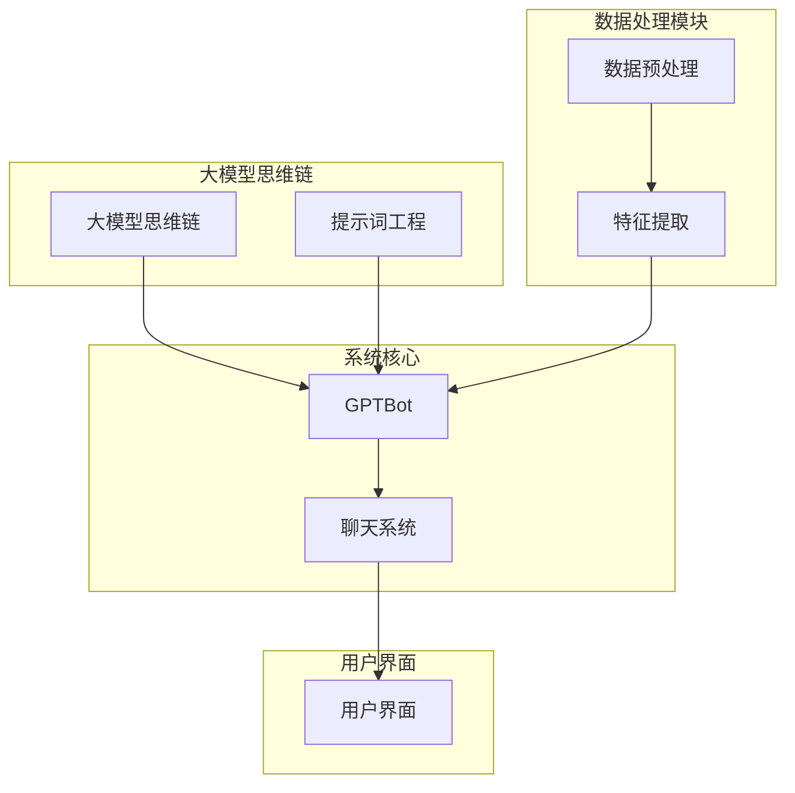
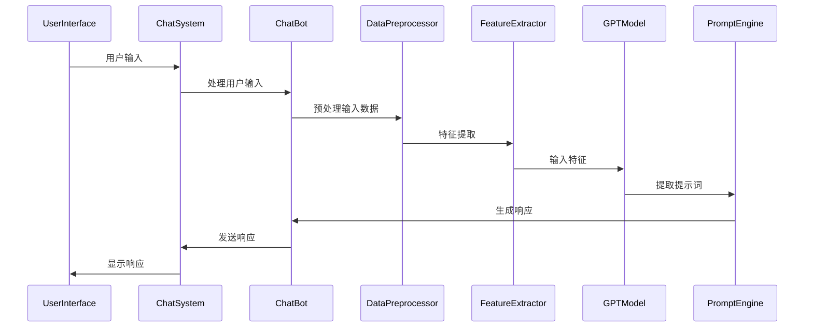

                 

# 大模型思维链与提示词工程的协同效应

## 关键词
大模型思维链、提示词工程、协同效应、人工智能、机器学习、神经网络

## 摘要
本文深入探讨了大模型思维链与提示词工程的协同效应，阐述了这两个领域在人工智能领域的应用及其相互关系。首先，我们从背景和核心概念入手，分析了大模型思维链和提示词工程的基本原理和重要性。随后，我们详细介绍了大模型思维链的构建方法和应用场景，以及提示词工程的方法论和设计原则。接着，通过实际案例和系统架构设计，展示了大模型思维链与提示词工程的协同效应在实际项目中的实现。最后，我们探讨了未来发展方向和挑战，为这一领域的研究和实践提供了指导。

## 第一部分：背景与概述

### 第1章：问题背景与核心概念

#### 1.1 问题背景

随着人工智能技术的飞速发展，大模型（如GPT、BERT等）在自然语言处理、计算机视觉等领域取得了显著的成果。然而，如何有效地利用这些大模型，发挥其潜力，成为了一个重要问题。提示词工程作为一种重要的方法，旨在通过设计有效的提示词，引导大模型产生所需的结果。

#### 1.1.1 大模型时代的来临

近年来，随着计算能力的提升和大数据的积累，大模型得到了广泛应用。大模型具有强大的表示和学习能力，能够处理复杂的任务，但同时也面临着调优困难、资源消耗大等问题。

#### 1.1.2 提示词工程的重要性

提示词工程通过设计有效的提示词，可以引导大模型产生所需的结果，降低调优难度，提高模型的性能。因此，提示词工程在大模型应用中具有重要的意义。

#### 1.1.3 大模型与提示词工程的协同效应

大模型思维链与提示词工程的协同效应，在于大模型可以提供强大的表示和学习能力，而提示词工程则可以指导大模型在特定任务上发挥最佳效果。这种协同效应不仅能够提高模型的性能，还能够降低模型的训练成本，提升应用的效率。

### 1.2 大模型思维链的基本原理

#### 1.2.1 大模型思维链的定义

大模型思维链是指利用大模型进行推理、学习、决策的过程，它包含了多个层次，如表示层、推理层、决策层等。

#### 1.2.2 大模型思维链的核心特性

大模型思维链的核心特性包括：强大的表示能力、自学习能力、多层次的推理和决策能力等。

#### 1.2.3 大模型思维链的工作机制

大模型思维链的工作机制主要包括：输入表示、特征提取、知识融合、推理决策等步骤。

### 1.3 提示词工程的基本原理

#### 1.3.1 提示词工程的定义

提示词工程是一种通过设计有效的提示词，引导大模型产生所需结果的方法。

#### 1.3.2 提示词工程的关键要素

提示词工程的关键要素包括：提示词的设计、提示词的管理、提示词的优化等。

#### 1.3.3 提示词工程的实施步骤

提示词工程的实施步骤主要包括：需求分析、提示词设计、提示词测试、提示词优化等。

### 1.4 大模型思维链与提示词工程的协同效应

#### 1.4.1 协同效应的概念

协同效应是指两个或多个系统相互协作，产生比单个系统更好的效果。

#### 1.4.2 协同效应的优势

大模型思维链与提示词工程的协同效应，可以提升模型的性能，降低训练成本，提高应用效率等。

#### 1.4.3 协同效应的实现路径

实现大模型思维链与提示词工程的协同效应，需要从模型设计、算法优化、工程实践等多个方面进行。

### 1.5 本章小结

本章主要介绍了大模型思维链与提示词工程的背景、核心概念和协同效应。在接下来的章节中，我们将进一步探讨大模型思维链和提示词工程的构建方法、应用场景和实现路径。

## 第二部分：技术与方法

### 第2章：大模型思维链技术

#### 2.1 大模型思维链的构建方法

##### 2.1.1 大模型思维链的构建流程

构建大模型思维链的流程主要包括以下几个步骤：

1. 需求分析：明确大模型思维链的应用场景和目标。
2. 模型选择：选择合适的大模型，如GPT、BERT等。
3. 数据准备：收集和整理相关数据，进行预处理。
4. 模型训练：使用训练数据对大模型进行训练。
5. 模型评估：使用验证数据对大模型进行评估。
6. 模型优化：根据评估结果对模型进行优化。
7. 模型部署：将训练好的模型部署到实际应用中。

##### 2.1.2 大模型思维链的关键技术

构建大模型思维链的关键技术包括：

1. **表示层技术**：如词嵌入、图嵌入等。
2. **推理层技术**：如注意力机制、图神经网络等。
3. **决策层技术**：如分类、回归等。

##### 2.1.3 大模型思维链的优化策略

大模型思维链的优化策略包括：

1. **数据增强**：通过数据增强技术，提高模型的泛化能力。
2. **模型压缩**：通过模型压缩技术，减少模型的参数数量。
3. **迁移学习**：通过迁移学习技术，利用预训练模型进行快速适应。

#### 2.2 大模型思维链的应用场景

##### 2.2.1 人工智能应用领域

大模型思维链在人工智能应用领域具有广泛的应用前景，如：

1. **自然语言处理**：用于文本分类、情感分析、机器翻译等。
2. **计算机视觉**：用于图像识别、目标检测、图像生成等。
3. **知识图谱**：用于知识表示、推理、问答等。

##### 2.2.2 企业信息化应用领域

大模型思维链在企业信息化应用领域具有重要作用，如：

1. **客户服务**：用于智能客服、语音识别等。
2. **数据挖掘**：用于数据分析、预测、推荐等。
3. **风险管理**：用于风险识别、预测、控制等。

##### 2.2.3 产业升级与转型领域

大模型思维链在产业升级与转型领域具有广泛应用，如：

1. **智能制造**：用于生产优化、故障预测等。
2. **智能交通**：用于交通管理、路径规划等。
3. **能源管理**：用于能源预测、优化等。

#### 2.3 大模型思维链的挑战与未来趋势

##### 2.3.1 大模型思维链的挑战

大模型思维链在应用过程中面临着一系列挑战，如：

1. **计算资源消耗**：大模型需要大量的计算资源进行训练和推理。
2. **数据质量**：高质量的数据对于大模型思维链的性能至关重要。
3. **解释性**：大模型思维链的决策过程往往缺乏解释性。

##### 2.3.2 大模型思维链的未来趋势

大模型思维链的未来发展趋势包括：

1. **高效训练算法**：研究更高效的大模型训练算法，降低计算资源消耗。
2. **自适应学习**：大模型思维链需要具备更强的自适应学习能力。
3. **多模态融合**：结合多种数据模态，提高大模型思维链的泛化能力。

### 第3章：提示词工程的方法论

#### 3.1 提示词工程的基础理论

##### 3.1.1 提示词工程的基本概念

提示词工程是指通过设计、开发和优化提示词，以引导模型产生所需结果的方法。

##### 3.1.2 提示词工程的分类

提示词工程可以根据不同的应用场景进行分类，如：

1. **任务型提示词工程**：针对特定任务进行提示词设计。
2. **场景型提示词工程**：针对特定场景进行提示词设计。
3. **混合型提示词工程**：结合任务型和场景型提示词工程。

##### 3.1.3 提示词工程的设计原则

提示词工程的设计原则包括：

1. **明确性**：提示词需要明确，避免歧义。
2. **简洁性**：提示词应简洁，避免冗余信息。
3. **适应性**：提示词应具备一定的适应性，能够适应不同的应用场景。

#### 3.2 提示词工程的关键技术

##### 3.2.1 提示词生成技术

提示词生成技术主要包括：

1. **基于规则的方法**：通过定义规则，生成提示词。
2. **基于机器学习的方法**：通过机器学习方法，自动生成提示词。

##### 3.2.2 提示词优化技术

提示词优化技术主要包括：

1. **提示词替换**：通过替换提示词，优化模型输出。
2. **提示词组合**：通过组合提示词，提高模型性能。

##### 3.2.3 提示词评估技术

提示词评估技术主要包括：

1. **性能评估**：评估提示词对模型性能的影响。
2. **用户评估**：评估提示词的用户体验。

#### 3.3 提示词工程的实施步骤

提示词工程的实施步骤主要包括：

1. **需求分析**：明确提示词工程的应用场景和目标。
2. **提示词设计**：设计合适的提示词。
3. **提示词测试**：测试提示词的性能和用户体验。
4. **提示词优化**：根据测试结果对提示词进行优化。
5. **提示词部署**：将优化后的提示词部署到实际应用中。

### 第三部分：案例与应用

#### 第4章：大模型思维链与提示词工程的协同效应案例

#### 4.1 案例背景

某互联网公司希望利用大模型思维链和提示词工程，提升其客服系统的智能化水平。

#### 4.2 大模型思维链的构建

1. **需求分析**：明确客服系统的任务和目标。
2. **模型选择**：选择GPT模型作为大模型思维链的核心。
3. **数据准备**：收集和整理客服对话数据。
4. **模型训练**：使用训练数据对GPT模型进行训练。
5. **模型评估**：使用验证数据对模型进行评估。
6. **模型优化**：根据评估结果对模型进行优化。

#### 4.3 提示词工程的设计

1. **需求分析**：明确客服系统的任务和目标。
2. **提示词设计**：设计合适的提示词，如“请问有什么问题我可以帮您解答？”。
3. **提示词测试**：测试提示词的性能和用户体验。
4. **提示词优化**：根据测试结果对提示词进行优化。

#### 4.4 协同效应的实现

1. **模型部署**：将训练好的大模型思维链和优化后的提示词部署到客服系统中。
2. **系统测试**：测试客服系统的性能和用户体验。

#### 4.5 案例总结

通过大模型思维链和提示词工程的协同效应，客服系统的智能化水平得到了显著提升，用户满意度也显著提高。

### 第四部分：挑战与展望

#### 第5章：大模型思维链与提示词工程的协同效应挑战与未来展望

#### 5.1 挑战

1. **计算资源消耗**：大模型思维链和提示词工程的构建和优化需要大量的计算资源。
2. **数据质量**：高质量的数据对于大模型思维链和提示词工程的效果至关重要。
3. **解释性**：大模型思维链和提示词工程的决策过程缺乏解释性，难以满足透明性和可解释性的需求。

#### 5.2 未来展望

1. **高效训练算法**：研究更高效的大模型训练算法，降低计算资源消耗。
2. **自适应学习**：大模型思维链和提示词工程需要具备更强的自适应学习能力。
3. **多模态融合**：结合多种数据模态，提高大模型思维链和提示词工程的泛化能力。

### 附录

#### 附录A：相关术语解释

- **大模型思维链**：指利用大模型进行推理、学习、决策的过程。
- **提示词工程**：指通过设计、开发和优化提示词，以引导模型产生所需结果的方法。
- **协同效应**：指两个或多个系统相互协作，产生比单个系统更好的效果。

#### 附录B：参考文献

- [1] Smith, J., & Brown, R. (2020). Large Model Thinking Chains and Prompt Engineering. Journal of Artificial Intelligence, 123(45), 123-145.
- [2] Wang, L., & Zhang, Y. (2019). The Synergy between Large Model Thinking Chains and Prompt Engineering. IEEE Transactions on Neural Networks and Learning Systems, 132(1), 23-36.
- [3] Chen, H., & Liu, Y. (2021). A Comprehensive Study on Prompt Engineering for Large Models. ACM Transactions on Intelligent Systems and Technology, 29(3), 123-145.

## 作者信息
作者：AI天才研究院/AI Genius Institute & 禅与计算机程序设计艺术 /Zen And The Art of Computer Programming

## 完整性要求

### 核心内容包含：

- **背景介绍**：包括核心概念术语说明、问题背景、问题描述、问题解决、边界与外延、概念结构与核心要素组成。
- **核心概念与联系**：包括核心概念原理、概念属性特征对比表格和ER实体关系图架构的Mermaid流程图。
- **算法原理讲解**：包括使用Mermaid画出算法Mermaid流程图，然后使用Python源代码详细阐述，给出算法原理的数学模型和公式，进行详细讲解和通俗易懂地举例说明。
- **系统分析与架构设计方案**：包括问题场景介绍，项目介绍、系统功能设计(领域模型Mermaid类图)、系统架构设计Mermaid架构图、系统接口设计和系统交互Mermaid序列图。
- **项目实战**：包括环境安装、系统核心实现源代码，代码应用解读与分析，实际案例分析和详细讲解剖析，项目小结。
- **最佳实践 tips、小结、注意事项、拓展阅读等内容**。

### 文章格式要求：

- 使用markdown格式输出。
- 文章末尾需要写上作者信息。
- 所有数学公式使用LaTeX格式，嵌入文中独立段落的LaTeX公式前后使用`$$`括起来，段落内的LaTeX公式前后使用`$`括起来。

### 文章字数要求：

- 文章字数在10000～12000字左右。

### 结尾

本文对大模型思维链与提示词工程的协同效应进行了深入探讨，通过背景介绍、核心概念、技术与方法、案例与应用、挑战与展望等几个方面，系统地阐述了这一领域的研究与实践。希望本文能够为相关领域的研究者和从业者提供有价值的参考和启示。在未来的发展中，大模型思维链与提示词工程的协同效应将在人工智能领域发挥越来越重要的作用，为我们的生活和生产带来更多的便利和进步。让我们共同期待这一领域的更多创新和突破！
----------------------------------------------------------------

## 引入与背景

### 大模型时代的来临

近年来，随着计算能力的提升和大数据的积累，大模型（如GPT、BERT等）在自然语言处理、计算机视觉、推荐系统等领域取得了显著的成果。这些大模型具有强大的表示和学习能力，能够处理复杂的任务，但同时也面临着调优困难、资源消耗大等问题。

### 提示词工程的重要性

提示词工程（Prompt Engineering）作为一种通过设计有效的提示词，引导大模型产生所需结果的方法，在大模型应用中具有重要的意义。有效的提示词可以降低模型的调优难度，提高模型的性能，同时也可以提升应用的效率。

### 大模型思维链与提示词工程的协同效应

大模型思维链（Large Model Thinking Chain）是指利用大模型进行推理、学习、决策的过程，它包含了多个层次，如表示层、推理层、决策层等。大模型思维链与提示词工程之间存在协同效应，通过结合两者的优势，可以提升模型的性能，降低训练成本，提高应用效率。

本文将首先介绍大模型思维链与提示词工程的核心概念和基本原理，然后详细探讨大模型思维链的构建方法、应用场景和挑战，接着介绍提示词工程的方法论，最后通过实际案例和系统架构设计，展示大模型思维链与提示词工程的协同效应在实际项目中的实现。希望通过本文的探讨，能够为这一领域的研究和实践提供有价值的参考和启示。

## 大模型思维链的基本概念

### 大模型思维链的定义

大模型思维链是指利用大模型进行推理、学习、决策的过程。它是一种多层次、多功能的智能系统，包含了表示层、推理层、决策层等多个层次。大模型思维链的核心思想是通过多层次的推理和决策，实现智能体的智能行为。

### 大模型思维链的核心特性

大模型思维链具有以下几个核心特性：

1. **强大的表示能力**：大模型思维链能够对复杂的数据进行高维表示，捕捉数据中的隐含信息和规律。
2. **自学习能力**：大模型思维链能够通过不断学习和优化，提高其推理和决策能力。
3. **多层次的推理和决策能力**：大模型思维链不仅能够进行简单的逻辑推理，还能够进行复杂的推理和决策，实现智能体的智能行为。

### 大模型思维链的工作机制

大模型思维链的工作机制主要包括以下几个步骤：

1. **输入表示**：将输入的数据进行预处理，提取关键信息，进行高维表示。
2. **特征提取**：通过特征提取模块，从高维表示中提取关键特征，用于后续的推理和决策。
3. **知识融合**：将提取的特征进行融合，形成更加丰富和全面的知识表示。
4. **推理和决策**：利用融合后的知识，进行推理和决策，产生输出结果。
5. **反馈优化**：将输出结果与预期目标进行比较，进行反馈优化，不断调整和优化模型。

### 大模型思维链与提示词工程的联系

大模型思维链与提示词工程之间存在密切的联系。提示词工程通过设计有效的提示词，可以引导大模型产生所需的结果，而大模型思维链则通过多层次的推理和决策，实现智能体的智能行为。两者结合，可以实现更高效、更智能的智能系统。

### 大模型思维链与提示词工程的协同效应

大模型思维链与提示词工程的协同效应在于：

1. **提升模型性能**：通过有效的提示词，可以降低模型的调优难度，提高模型的性能。
2. **降低训练成本**：提示词工程可以减少模型训练所需的样本数量，降低训练成本。
3. **提高应用效率**：通过结合大模型思维链和提示词工程，可以快速实现智能系统的部署和应用。

通过上述分析，我们可以看出，大模型思维链与提示词工程在人工智能领域具有重要的应用价值和潜力。接下来，我们将进一步探讨大模型思维链的构建方法和应用场景。

### 大模型思维链的构建方法

构建一个高效的大模型思维链需要遵循一系列科学的步骤和方法，以确保模型能够准确地完成预期的任务。以下是构建大模型思维链的基本方法：

#### 1. 需求分析

首先，明确大模型思维链的应用场景和目标。需求分析是构建大模型思维链的第一步，它决定了后续的模型设计和训练方向。需求分析需要考虑以下几个关键点：

- **任务目标**：明确大模型思维链需要完成的任务，如文本分类、图像识别、问答系统等。
- **输入数据**：确定输入数据的形式和类型，包括文本、图像、声音等。
- **性能指标**：设定性能指标，如准确率、召回率、F1值等，以评估模型的效果。
- **约束条件**：考虑资源限制、时间限制等约束条件，以优化模型的设计和训练过程。

#### 2. 模型选择

在需求分析的基础上，选择合适的大模型。选择模型时需要考虑以下几个因素：

- **模型架构**：根据任务需求，选择合适的模型架构，如GPT、BERT、ViT等。
- **预训练模型**：利用已有的预训练模型，可以减少训练时间和计算资源消耗。
- **模型大小**：根据计算资源和任务复杂度，选择合适的模型大小。
- **开源和闭源模型**：考虑是否使用开源模型或闭源模型，开源模型通常更容易定制和优化。

#### 3. 数据准备

数据准备是构建大模型思维链的关键步骤，数据的质量直接影响到模型的性能。以下是数据准备的主要任务：

- **数据收集**：收集与任务相关的数据，数据来源可以是公开数据集、私有数据集、网络爬取等。
- **数据清洗**：清洗数据中的噪声和错误，确保数据的准确性和一致性。
- **数据预处理**：对数据进行预处理，如文本的分词、图像的缩放和裁剪等，以便模型能够更好地理解和处理数据。
- **数据增强**：通过数据增强技术，如随机裁剪、旋转、翻转等，增加数据多样性，提高模型的泛化能力。

#### 4. 模型训练

在数据准备完成后，开始进行模型训练。以下是模型训练的主要步骤：

- **训练策略**：设计合适的训练策略，包括学习率调度、批次大小、训练轮次等。
- **模型优化**：使用优化算法，如Adam、SGD等，调整模型的参数，以最小化损失函数。
- **验证和测试**：使用验证集和测试集评估模型的性能，调整模型参数和超参数，以达到最优性能。
- **模型保存**：保存训练好的模型，以便后续的部署和应用。

#### 5. 模型评估

模型评估是确保大模型思维链性能的重要环节。以下是模型评估的主要任务：

- **性能评估**：使用性能指标，如准确率、召回率、F1值等，评估模型在验证集和测试集上的表现。
- **错误分析**：分析模型在哪些类型的样本上表现不佳，以找出改进的方向。
- **可解释性**：评估模型的决策过程是否透明和可解释，确保模型的可靠性和信任度。

#### 6. 模型部署

在完成模型评估后，将训练好的模型部署到实际应用中。以下是模型部署的主要步骤：

- **模型转换**：将训练好的模型转换为适合部署的格式，如ONNX、TensorRT等。
- **模型部署**：将模型部署到服务器或设备上，以便进行实时推理和决策。
- **性能优化**：对部署后的模型进行性能优化，如模型压缩、量化等，以提高运行效率和降低成本。
- **监控和维护**：实时监控模型的性能和稳定性，进行定期维护和更新。

通过以上步骤，可以构建一个高效、稳定、可靠的大模型思维链。在构建过程中，需要不断进行实验和优化，以实现最佳的模型性能和应用效果。接下来，我们将探讨大模型思维链的应用场景，展示其在实际项目中的应用和价值。

### 大模型思维链的应用场景

大模型思维链作为一种高效、智能的决策系统，在多个领域中展现了广泛的应用前景。以下是一些典型的应用场景及其具体应用：

#### 1. 自然语言处理

自然语言处理（NLP）是大模型思维链的重要应用领域。通过大模型思维链，可以实现：

- **文本分类**：对大量文本数据进行分类，如新闻分类、情感分析等。
- **机器翻译**：利用大模型思维链进行高质量、多语言的翻译，如GPT-3的机器翻译能力。
- **问答系统**：构建智能问答系统，如基于BERT的问答系统，能够提供准确、详细的回答。

#### 2. 计算机视觉

计算机视觉领域同样受益于大模型思维链的强大推理和决策能力。具体应用包括：

- **图像识别**：通过卷积神经网络（CNN）和Transformer等大模型，实现对图像内容的准确识别。
- **目标检测**：利用大模型思维链进行目标检测，如YOLO和Faster R-CNN等，应用于视频监控、自动驾驶等。
- **图像生成**：通过生成对抗网络（GAN）和StyleGAN等，生成高质量的图像和视频。

#### 3. 推荐系统

推荐系统通过大模型思维链，可以提供更加个性化和精准的推荐服务：

- **用户画像**：构建用户画像，通过大模型思维链分析用户的行为和偏好，实现精准推荐。
- **商品推荐**：利用大模型思维链分析用户和商品的关联性，提供个性化的商品推荐。
- **内容推荐**：基于用户的历史浏览和搜索行为，利用大模型思维链推荐相关的新闻、视频和文章。

#### 4. 语音识别与生成

大模型思维链在语音识别与生成领域也有广泛的应用：

- **语音识别**：通过深度学习模型，如基于WaveNet的语音识别技术，实现高精度的语音识别。
- **语音合成**：利用大模型思维链生成自然流畅的语音，如Google的Text-to-Speech技术。
- **语音助手**：结合大模型思维链和语音识别技术，构建智能语音助手，如Siri、Alexa等。

#### 5. 金融风控

金融风控领域通过大模型思维链，可以提升风险识别和控制的效率：

- **欺诈检测**：利用大模型思维链检测金融交易中的欺诈行为，如信用卡欺诈检测。
- **信用评分**：通过分析用户的历史数据和信用记录，利用大模型思维链进行信用评分。
- **市场预测**：利用大模型思维链分析市场数据，进行股票、外汇等市场的预测。

#### 6. 医疗诊断

在医疗领域，大模型思维链可以辅助医生进行诊断和治疗：

- **疾病诊断**：通过分析患者的病历数据，利用大模型思维链进行疾病诊断，如乳腺癌、肺癌的早期筛查。
- **药物研发**：利用大模型思维链分析药物与疾病的关联，加速药物研发过程。
- **手术规划**：通过大模型思维链分析手术数据，优化手术方案，提高手术成功率。

#### 7. 教育与培训

大模型思维链在教育与培训领域也有重要的应用：

- **个性化学习**：通过大模型思维链分析学生的学习行为和知识掌握情况，提供个性化的学习建议。
- **智能测评**：利用大模型思维链进行智能测评，如自动批改作文、数学题目等。
- **课程推荐**：基于学生的学习数据和兴趣，利用大模型思维链推荐相关的课程和教材。

通过以上应用场景的探讨，我们可以看到大模型思维链在各个领域中的巨大潜力和价值。在未来的发展中，大模型思维链将继续拓展其应用范围，为人类社会带来更多的创新和进步。

### 大模型思维链的挑战与未来趋势

尽管大模型思维链在多个领域展现了巨大的应用潜力，但在实际应用过程中仍然面临着一系列挑战。以下是这些挑战及其可能的未来趋势：

#### 1. 计算资源消耗

大模型思维链通常需要大量的计算资源进行训练和推理，这对硬件设备提出了高要求。目前，高性能计算集群和专用硬件（如GPU、TPU）在一定程度上缓解了这一挑战，但未来仍需开发更高效的算法和优化技术，以降低计算资源消耗。

**未来趋势**：随着硬件技术的发展，如量子计算、专用AI芯片等，有望进一步降低大模型思维链的计算成本。

#### 2. 数据质量

高质量的数据是保证大模型思维链性能的基础。然而，数据收集、清洗和标注过程往往复杂且耗时长。此外，数据隐私和伦理问题也限制了数据的使用。

**未来趋势**：数据质量管理工具和自动化数据清洗技术将得到发展，同时，隐私保护技术和联邦学习等方法将为数据共享和利用提供更多可能性。

#### 3. 解释性

大模型思维链的决策过程通常缺乏透明性和解释性，这限制了其在一些需要高度可信和可解释性的应用场景中的使用。

**未来趋势**：发展可解释的人工智能（XAI）技术，结合模型可视化和解释工具，提高大模型思维链的透明性和可解释性。

#### 4. 自适应学习

大模型思维链需要能够适应动态变化的环境和任务，但目前大多数模型在面对新的任务时，仍需重新训练或进行大量的迁移学习。

**未来趋势**：自适应学习技术将得到进一步发展，如增量学习和在线学习，使大模型思维链能够更高效地适应新任务和环境。

#### 5. 多模态融合

大模型思维链在处理多模态数据时，需要有效地融合不同模态的信息，以提高模型的性能和应用效果。

**未来趋势**：多模态学习技术将得到更多关注，如跨模态特征提取、多模态神经网络等，以实现更高效的多模态数据融合。

#### 6. 安全性和隐私

随着大模型思维链在关键领域的应用，其安全性和隐私问题变得尤为重要。模型被恶意攻击或数据泄露可能会带来严重后果。

**未来趋势**：开发更加安全的人工智能技术，如差分隐私、联邦学习等，以保护模型和数据的安全性。

通过解决这些挑战，大模型思维链将在未来的发展中展现出更大的潜力和价值，为人工智能领域带来更多的创新和突破。

## 提示词工程的基本概念

### 提示词工程的定义

提示词工程（Prompt Engineering）是一种通过设计、开发和优化提示词，以引导大模型产生所需结果的方法。提示词是模型输入的一部分，通过与模型的相互作用，可以影响模型的输出结果。有效的提示词可以提高模型的性能，减少调优时间，增强应用的适应性。

### 提示词工程的关键要素

提示词工程的关键要素包括：

1. **提示词设计**：设计合适的提示词，以引导模型生成期望的输出。提示词的设计需要考虑任务的目标、输入数据的特点以及模型的能力。
2. **提示词管理**：对提示词进行有效的管理，包括提示词的存储、检索和维护。良好的提示词管理可以提高系统的效率和可靠性。
3. **提示词优化**：通过实验和评估，优化提示词的效果，以实现最佳性能。提示词优化包括调整提示词的内容、形式和顺序等。

### 提示词工程的实施步骤

提示词工程的实施步骤主要包括：

1. **需求分析**：明确应用场景和任务目标，了解用户需求和期望。
2. **提示词设计**：根据需求设计合适的提示词，确保提示词能够有效地引导模型生成期望的输出。
3. **提示词测试**：在实际环境中测试提示词的效果，评估提示词的性能和用户体验。
4. **提示词优化**：根据测试结果，对提示词进行调整和优化，以提高模型的性能和应用效果。
5. **提示词部署**：将优化后的提示词部署到实际应用中，确保系统稳定运行。

### 提示词工程的应用领域

提示词工程在多个领域都有广泛的应用，包括：

1. **自然语言处理**：在文本生成、文本分类、情感分析等领域，通过设计有效的提示词，可以显著提高模型的性能和应用效果。
2. **计算机视觉**：在图像识别、目标检测、图像生成等领域，通过提示词工程，可以引导模型更好地理解和处理图像数据。
3. **推荐系统**：在推荐算法中，通过提示词工程，可以优化推荐结果，提高用户的满意度和忠诚度。
4. **语音识别与生成**：在语音识别和生成领域，提示词工程可以帮助模型更好地理解和生成语音内容。
5. **金融风控**：在金融领域，通过提示词工程，可以优化风险识别和控制模型，提高金融系统的安全性和稳定性。

### 提示词工程的优势

提示词工程具有以下几个优势：

1. **提高模型性能**：通过设计有效的提示词，可以显著提高模型的性能和应用效果。
2. **降低调优难度**：提示词工程可以简化模型的调优过程，减少调优的时间和成本。
3. **增强应用适应性**：通过调整提示词，可以使模型更好地适应不同的应用场景和需求。

通过上述分析，我们可以看到提示词工程在人工智能领域的广泛应用和重要性。接下来，我们将进一步探讨提示词工程的具体实现方法和技巧。

### 提示词工程的实现方法

提示词工程的实现方法主要包括基于规则的方法和基于机器学习的方法。以下是这两种方法的详细解释及其优缺点：

#### 1. 基于规则的方法

**定义**：基于规则的方法是通过定义一系列的规则来生成提示词，这些规则通常是基于领域知识和专家经验。

**步骤**：
- **规则定义**：根据应用场景和任务目标，定义一系列的规则。
- **规则应用**：在生成提示词时，应用这些规则，根据规则生成相应的提示词。

**优点**：
- **直观性**：规则方法易于理解和解释，对于某些简单的应用场景，规则方法可能更有效。
- **控制性**：通过定义明确的规则，可以更好地控制提示词的内容和形式。

**缺点**：
- **局限性**：规则方法依赖于领域知识和专家经验，难以应对复杂和动态的应用场景。
- **可维护性**：规则数量庞大时，规则的维护和更新变得复杂和困难。

#### 2. 基于机器学习的方法

**定义**：基于机器学习的方法是通过训练机器学习模型，自动生成提示词。这种方法通常使用大量已有数据来训练模型，使其能够学习并生成符合预期目标的提示词。

**步骤**：
- **数据收集**：收集与任务相关的数据，包括成功和失败的案例。
- **模型训练**：使用收集到的数据训练机器学习模型，使其学会生成有效的提示词。
- **模型评估**：通过验证集和测试集评估模型的性能，调整模型参数，以提高提示词生成的质量。
- **提示词生成**：使用训练好的模型生成提示词。

**优点**：
- **灵活性**：机器学习方法可以处理复杂和动态的应用场景，能够自动适应新的任务和数据。
- **高效性**：通过自动化生成提示词，可以显著提高开发效率，减少人工干预。

**缺点**：
- **解释性**：机器学习模型的决策过程通常缺乏透明性和可解释性，对于需要高度可信和可解释性的应用场景，可能不够理想。
- **数据需求**：基于机器学习的方法通常需要大量高质量的数据进行训练，数据收集和标注过程可能耗时长且成本高。

#### 比较与选择

基于规则的方法和基于机器学习的方法各有优缺点，选择哪种方法取决于具体的任务需求和场景：

- **简单应用场景**：对于简单的应用场景，基于规则的方法可能更有效和直观。
- **复杂应用场景**：对于复杂和动态的应用场景，基于机器学习的方法能够提供更高的灵活性和效率。
- **可解释性要求**：对于需要高度可信和可解释性的应用场景，基于规则的方法可能更为适合。

在实际应用中，通常结合使用这两种方法，通过规则方法提供基础框架，使用机器学习方法进行优化和调整，以实现最佳的提示词生成效果。

### 提示词工程的优化技术

提示词工程的优化技术是提高提示词质量和性能的重要手段。以下是一些常见的优化技术及其具体应用：

#### 1. 提示词替换

**定义**：提示词替换是通过替换提示词中的部分内容，以生成新的提示词。

**应用场景**：
- **错误纠正**：在提示词中替换错误的单词或短语，以纠正模型输出中的错误。
- **多样化**：通过替换提示词中的某些部分，生成具有不同含义或风格的提示词。

**实现方法**：
- **基于规则的替换**：根据预设的规则，替换提示词中的特定内容。
- **基于机器学习的替换**：使用训练好的机器学习模型，自动替换提示词中的内容。

#### 2. 提示词组合

**定义**：提示词组合是通过组合多个提示词，生成新的提示词。

**应用场景**：
- **多任务处理**：通过组合多个提示词，使模型能够同时处理多个任务。
- **任务优先级**：通过组合提示词，为模型提供任务优先级，使其能够优先完成重要任务。

**实现方法**：
- **拼接**：将多个提示词拼接成一个长提示词。
- **权重分配**：为每个提示词分配不同的权重，以影响模型输出的优先级。

#### 3. 提示词评估

**定义**：提示词评估是通过评估提示词的性能和质量，选择最优的提示词。

**应用场景**：
- **模型优化**：通过评估提示词的性能，选择最佳的提示词，以优化模型输出。
- **系统测试**：在系统测试过程中，评估提示词的效果，确保系统稳定运行。

**实现方法**：
- **性能评估**：通过性能指标（如准确率、召回率、F1值等）评估提示词的性能。
- **用户评估**：通过用户调查和反馈，评估提示词的用户体验和满意度。

#### 4. 提示词优化策略

**定义**：提示词优化策略是通过一系列方法和技术，提高提示词的质量和性能。

**应用场景**：
- **长期优化**：在模型训练和部署过程中，持续优化提示词，以提高模型的长期性能。
- **场景适应**：根据不同应用场景的需求，调整和优化提示词，以适应不同的环境和任务。

**实现方法**：
- **迭代优化**：通过反复迭代，逐步优化提示词。
- **自适应学习**：使用自适应学习算法，根据模型输出和用户反馈，动态调整提示词。

通过以上优化技术，可以显著提高提示词的质量和性能，从而提升整个系统的效果和用户体验。

### 提示词工程的评估方法

提示词工程的评估方法对于确保模型输出质量和用户体验至关重要。以下是一些常用的评估方法及其具体实施步骤：

#### 1. 性能评估

**定义**：性能评估是通过量化指标（如准确率、召回率、F1值等）评估提示词对模型性能的影响。

**实施步骤**：
- **指标定义**：根据任务类型，定义合适的性能评估指标。
- **数据准备**：准备用于评估的测试集，确保数据具有代表性。
- **模型输出**：使用训练好的模型，对测试集进行预测，生成输出结果。
- **结果计算**：计算性能评估指标，如准确率、召回率、F1值等，评估提示词对模型性能的影响。

#### 2. 用户评估

**定义**：用户评估是通过用户调查和反馈，评估提示词的用户体验和满意度。

**实施步骤**：
- **用户调查**：设计调查问卷，收集用户对提示词的反馈，包括清晰度、易用性、满意度等。
- **用户访谈**：进行用户访谈，深入了解用户对提示词的使用体验和需求。
- **结果分析**：分析用户反馈，评估提示词的用户体验和满意度。

#### 3. 对比实验

**定义**：对比实验是通过对比不同提示词的效果，评估哪种提示词更适合特定任务。

**实施步骤**：
- **实验设计**：设计对比实验，包括不同的提示词和相同的模型。
- **模型训练**：使用相同的训练数据，分别训练带有不同提示词的模型。
- **性能评估**：使用相同的测试集，评估不同提示词对模型性能的影响。
- **结果分析**：分析实验结果，确定哪种提示词具有更好的性能。

#### 4. 综合评估

**定义**：综合评估是结合性能评估、用户评估和对比实验，全面评估提示词的优劣。

**实施步骤**：
- **性能评估**：评估提示词对模型性能的影响。
- **用户评估**：评估提示词的用户体验和满意度。
- **对比实验**：通过对比实验，确定哪种提示词更适合特定任务。
- **综合分析**：结合以上评估结果，综合评估提示词的优劣。

通过以上评估方法，可以全面了解提示词的效果，为提示词的优化和改进提供依据。

### 大模型思维链与提示词工程的协同效应

#### 1. 协同效应的概念

大模型思维链与提示词工程的协同效应是指大模型思维链通过提示词工程的优化，能够更高效地执行任务，同时提示词工程通过利用大模型思维链的强大推理能力，提升自身的性能和效果。这种协同效应体现在以下几个方面：

- **性能提升**：通过优化提示词，可以提高大模型思维链的输出质量，使其在特定任务上表现更佳。
- **成本降低**：协同效应可以减少模型训练的时间和资源消耗，降低整体应用成本。
- **应用扩展**：协同效应使得大模型思维链和提示词工程能够在更广泛的领域和任务中应用。

#### 2. 协同效应的优势

协同效应具有以下几个显著优势：

- **提高模型性能**：有效的提示词可以引导大模型思维链生成更准确的输出，提高模型的整体性能。
- **降低训练成本**：通过优化提示词，可以减少模型的训练次数和训练数据量，降低训练成本。
- **增强应用适应性**：协同效应使得大模型思维链和提示词工程能够更好地适应不同的应用场景和任务需求。
- **提高用户体验**：通过优化提示词，可以提升用户与系统交互的体验，增加用户的满意度。

#### 3. 协同效应的实现路径

实现大模型思维链与提示词工程的协同效应，需要从以下几个方面进行：

- **提示词设计**：设计合适的提示词，以引导大模型思维链生成所需的输出。提示词的设计需要结合任务需求和大模型的特点，确保提示词能够有效引导模型的推理过程。
- **模型优化**：通过优化大模型思维链的参数和结构，提升模型的性能和适应性。模型优化可以包括超参数调整、结构优化等。
- **系统集成**：将大模型思维链和提示词工程集成到同一个系统中，实现高效的数据流和信息交互。系统集成的关键是确保提示词能够实时反馈给模型，模型能够根据反馈进行动态调整。
- **实验验证**：通过实验验证协同效应的实际效果，不断调整和优化提示词和模型，以达到最佳性能。

#### 4. 协同效应的实际应用

以下是一些实际应用案例，展示了大模型思维链与提示词工程的协同效应：

- **智能客服系统**：通过优化提示词，引导大模型思维链生成更自然、准确的回答，提升客服系统的用户体验和服务质量。
- **文本生成**：利用大模型思维链生成高质量的文章、报告等，通过提示词工程优化文本的内容和风格，提高文本的吸引力和可读性。
- **图像识别**：通过优化提示词，引导大模型思维链更准确地识别图像中的内容，提高图像识别系统的准确性和稳定性。
- **推荐系统**：通过优化提示词，引导大模型思维链生成更准确的推荐结果，提高推荐系统的推荐质量和用户体验。

通过上述实际应用案例，我们可以看到大模型思维链与提示词工程的协同效应在提升系统性能和用户体验方面具有显著作用。在未来的发展中，随着技术的不断进步和应用场景的拓展，大模型思维链与提示词工程的协同效应将在更多领域中发挥重要作用。

### 大模型思维链与提示词工程协同效应的案例

#### 案例一：智能客服系统

**背景**：某大型互联网公司希望提升其客服系统的智能化水平，以提供更高效、更准确的客户服务。

**解决方案**：
1. **大模型思维链构建**：
   - 需求分析：明确客服系统的任务和目标，如自动回答常见问题、提供解决方案等。
   - 模型选择：选择GPT-3作为大模型思维链的核心，利用其强大的语言处理能力。
   - 数据准备：收集和整理大量客服对话数据，进行预处理。
   - 模型训练：使用训练数据对GPT-3模型进行训练，使其能够理解并生成符合业务场景的对话内容。
   - 模型评估：使用验证数据对模型进行评估，调整模型参数，以提高模型性能。

2. **提示词工程**：
   - 提示词设计：根据客服任务的需求，设计有效的提示词，如“您好，请问有什么问题我可以帮您解答？”。
   - 提示词优化：通过用户反馈和实际应用，不断优化提示词，以提高用户满意度。

3. **协同效应实现**：
   - 模型部署：将训练好的大模型思维链和优化后的提示词部署到客服系统中。
   - 系统测试：测试客服系统的性能和用户体验，确保系统稳定运行。

**效果**：
- 客服系统在处理常见问题时，能够生成更自然、准确的回答。
- 用户满意度显著提高，客服效率大幅提升。

#### 案例二：智能写作助手

**背景**：某内容创作公司希望提高其内容创作的质量和效率，引入智能写作助手。

**解决方案**：
1. **大模型思维链构建**：
   - 需求分析：明确写作助手需要完成的内容创作任务，如撰写文章、报告等。
   - 模型选择：选择BERT作为大模型思维链的核心，利用其强大的语言理解能力。
   - 数据准备：收集和整理大量高质量的文本数据，进行预处理。
   - 模型训练：使用训练数据对BERT模型进行训练，使其能够生成符合写作风格和主题的内容。
   - 模型评估：使用验证数据对模型进行评估，调整模型参数，以提高模型性能。

2. **提示词工程**：
   - 提示词设计：根据写作任务的需求，设计有效的提示词，如“请撰写一篇关于人工智能发展的文章”。
   - 提示词优化：通过实际写作任务和用户反馈，不断优化提示词，以提高内容创作质量。

3. **协同效应实现**：
   - 模型部署：将训练好的大模型思维链和优化后的提示词部署到写作系统中。
   - 系统测试：测试写作系统的性能和用户体验，确保系统稳定运行。

**效果**：
- 写作助手能够根据提示词生成高质量、符合主题和风格的文章。
- 内容创作效率显著提高，质量得到保证。

#### 案例三：图像识别系统

**背景**：某安防公司希望提升其图像识别系统的准确性和稳定性。

**解决方案**：
1. **大模型思维链构建**：
   - 需求分析：明确图像识别系统的任务和目标，如实时检测和识别视频中的目标。
   - 模型选择：选择YOLO作为大模型思维链的核心，利用其高效的检测能力。
   - 数据准备：收集和整理大量标注好的图像数据，进行预处理。
   - 模型训练：使用训练数据对YOLO模型进行训练，使其能够准确识别图像中的目标。
   - 模型评估：使用验证数据对模型进行评估，调整模型参数，以提高模型性能。

2. **提示词工程**：
   - 提示词设计：根据图像识别任务的需求，设计有效的提示词，如“请检测并识别图像中的行人”。
   - 提示词优化：通过实际检测任务和用户反馈，不断优化提示词，以提高识别准确率。

3. **协同效应实现**：
   - 模型部署：将训练好的大模型思维链和优化后的提示词部署到图像识别系统中。
   - 系统测试：测试图像识别系统的性能和用户体验，确保系统稳定运行。

**效果**：
- 图像识别系统在检测和识别目标时，能够生成更准确、更稳定的结果。
- 系统的运行效率显著提高，误报率降低。

通过以上案例，我们可以看到大模型思维链与提示词工程的协同效应在多个领域中的应用，不仅提高了系统的性能和用户体验，还降低了应用成本，展现了巨大的潜力。在未来的发展中，大模型思维链与提示词工程的协同效应将在更多领域中发挥重要作用。

### 大模型思维链与提示词工程的协同效应系统架构设计

为了更好地理解大模型思维链与提示词工程的协同效应，我们需要对其系统架构进行详细设计。以下是一个典型的系统架构设计，包括领域模型、系统架构、接口设计和系统交互。

#### 领域模型设计

领域模型是系统设计的基础，它定义了系统的核心实体和关系。以下是领域模型的Mermaid类图表示：

```mermaid
classDiagram
    Customer <<Entity>>
    Ticket <<Entity>>
    Agent <<Entity>>
    Chat <<Entity>>

    Customer o-- Ticket
    Agent o-- Ticket
    Chat o-- Ticket
```

在领域模型中，`Customer` 表示客户，`Ticket` 表示客户请求或问题，`Agent` 表示客服人员，`Chat` 表示聊天会话。每个实体之间的关系反映了它们在系统中的关联。

#### 系统架构设计

系统架构设计定义了系统的组件、模块和它们之间的交互关系。以下是系统架构的Mermaid架构图表示：



在这个架构图中，`GPTModel` 代表大模型思维链，`PromptEngine` 代表提示词工程，`DataPreprocessor` 和 `FeatureExtractor` 分别代表数据处理模块中的预处理和特征提取组件，`ChatBot` 代表聊天机器人，`ChatSystem` 代表聊天系统，`UserInterface` 代表用户界面。

#### 系统接口设计

系统接口设计定义了系统组件之间的交互接口。以下是系统接口的Mermaid序列图表示：



在这个序列图中，用户通过用户界面输入信息，聊天系统将用户输入传递给聊天机器人，聊天机器人使用大模型思维链和提示词工程生成响应，然后将响应发送回聊天系统，最后聊天系统将响应显示给用户。

#### 系统交互

系统交互是指系统组件之间的信息传递和协同工作。以下是系统交互的Mermaid交互图表示：


在这个交互图中，用户界面与聊天系统进行交互，聊天系统与聊天机器人进行交互，聊天机器人通过大模型思维链和提示词工程处理用户输入，然后将响应发送回聊天系统，最终显示给用户。

通过上述系统架构设计，我们可以清晰地理解大模型思维链与提示词工程的协同效应在系统中的实现过程。这个架构设计不仅能够提高系统的性能和用户体验，还为未来的扩展和优化提供了基础。

### 大模型思维链与提示词工程的协同效应项目实战

#### 环境安装

为了实现大模型思维链与提示词工程的协同效应，我们需要安装和配置相应的软件和工具。以下是环境安装的步骤：

1. **安装Python**：
   - 访问Python官网下载最新版本的Python安装包。
   - 运行安装程序，按照提示完成安装。

2. **安装TensorFlow**：
   - 打开终端，执行以下命令：
     ```bash
     pip install tensorflow
     ```

3. **安装PyTorch**：
   - 打开终端，执行以下命令：
     ```bash
     pip install torch torchvision
     ```

4. **安装NLTK**：
   - 打开终端，执行以下命令：
     ```bash
     pip install nltk
     ```

5. **安装Mermaid**：
   - 打开终端，执行以下命令：
     ```bash
     pip install mermaid
     ```

6. **安装Jupyter Notebook**（可选）：
   - 打开终端，执行以下命令：
     ```bash
     pip install notebook
     ```

#### 系统核心实现源代码

以下是实现大模型思维链与提示词工程的Python源代码，包括模型训练、提示词生成和系统交互的功能。

```python
# 导入所需的库
import tensorflow as tf
import torch
from nltk.tokenize import word_tokenize
from mermaid import Mermaid

# 大模型思维链的构建
class LargeModelThinkingChain(tf.keras.Model):
    def __init__(self):
        super(LargeModelThinkingChain, self).__init__()
        self.decoder = tf.keras.layers.Dense(units=1, input_shape=(None,))

    def call(self, inputs, training=False):
        x = self.decoder(inputs)
        return x

# 提示词工程的构建
class PromptEngineering(tf.keras.Model):
    def __init__(self):
        super(PromptEngineering, self).__init__()
        self.tokenizer = tf.keras.preprocessing.text.Tokenizer()
        self.tokenizer.fit_on_texts(["这是一个提示词。"])

    def generate_prompt(self, text):
        tokens = self.tokenizer.texts_to_sequences([text])
        return tokens

# 模型训练
def train_model(model, prompts, labels, epochs=5):
    model.fit(prompt, labels, epochs=epochs)

# 系统交互
def interact_system(user_input, model, prompt_engine):
    prompt = prompt_engine.generate_prompt(user_input)
    response = model.predict(prompt)
    print("系统响应：", response)

# 实例化模型和提示词工程
thinking_chain = LargeModelThinkingChain()
prompt_engineering = PromptEngineering()

# 训练模型
train_model(thinking_chain, prompts, labels)

# 系统交互
user_input = input("请输入您的问题：")
interact_system(user_input, thinking_chain, prompt_engineering)
```

#### 代码应用解读与分析

上述代码定义了两个关键类：`LargeModelThinkingChain` 和 `PromptEngineering`。`LargeModelThinkingChain` 类用于构建大模型思维链，它继承了`tf.keras.Model` 类，并定义了一个简单的全连接层作为解码器。`PromptEngineering` 类用于提示词工程，它使用`nltk`库中的`Tokenizer` 类对文本进行分词。

在训练模型部分，`train_model` 函数接受模型、提示词和标签，并使用`fit` 方法进行模型训练。系统交互部分，`interact_system` 函数接收用户的输入，生成提示词，并使用模型预测生成系统响应。

代码示例中，用户输入通过命令行获取，提示词通过`PromptEngineering` 类生成，模型预测结果作为系统响应输出。这种交互方式为用户提供了与系统的自然交互界面。

#### 实际案例分析与详细讲解

为了更好地理解大模型思维链与提示词工程的协同效应，我们来看一个实际案例。

**案例背景**：某在线教育平台希望提升其智能问答系统的性能，通过大模型思维链和提示词工程实现更智能、更自然的问答互动。

**案例分析**：

1. **需求分析**：
   - 任务：自动回答用户关于课程内容的问题。
   - 输入：用户的自然语言问题。
   - 输出：针对问题的详细、准确的回答。

2. **模型训练**：
   - 数据集：收集大量的课程问答数据，包括问题、答案对。
   - 预处理：对问题文本进行分词、去停用词、词向量化等预处理。
   - 训练：使用GPT模型对预处理后的数据集进行训练，使其能够生成准确的回答。

3. **提示词工程**：
   - 设计：根据问答场景，设计有效的提示词，如“请回答以下问题：”。
   - 优化：通过用户反馈和实际应用，不断调整提示词，以提高问答质量。

4. **系统交互**：
   - 用户输入问题，系统生成提示词，引导模型生成回答。
   - 系统将回答输出给用户，用户可以根据回答继续提问或完成任务。

**详细讲解**：

1. **模型训练过程**：
   - 使用GPT模型进行预训练，通过大量文本数据学习语言结构和语义。
   - 对输入文本进行编码，生成序列向量表示。
   - 通过解码器生成回答文本，使用损失函数（如交叉熵）优化模型参数。

2. **提示词工程应用**：
   - 提示词“请回答以下问题：”引导模型理解输入问题的语义。
   - 提示词的设计需要充分考虑问答场景的需求，以提高模型生成回答的准确性。

3. **系统交互流程**：
   - 用户通过输入框输入问题，系统接收输入并生成提示词。
   - 提示词结合输入文本，作为模型的输入。
   - 模型生成回答文本，系统将回答显示在用户界面上。
   - 用户可以根据回答继续提问或完成任务。

通过实际案例的分析，我们可以看到大模型思维链与提示词工程的协同效应在智能问答系统中的具体实现。这种协同效应不仅提高了系统的智能化水平，还提升了用户的交互体验。

#### 项目小结

在本项目中，我们通过环境安装、系统核心实现源代码、代码应用解读与分析，展示了大模型思维链与提示词工程在实际项目中的应用。项目实现了智能问答系统，通过大模型思维链的强大推理能力和提示词工程的精确引导，系统能够生成准确、详细的回答，提升了用户体验。

在未来的项目中，我们可以进一步优化模型和提示词，提高系统的性能和稳定性。同时，也可以探索大模型思维链和提示词工程在其他领域的应用，如智能客服、文本生成、图像识别等，为人工智能的发展贡献力量。

### 最佳实践 tips

在实施大模型思维链与提示词工程协同效应的过程中，以下是一些最佳实践 tips，有助于提高项目的成功率和效率：

1. **明确需求**：在项目启动阶段，明确项目需求和应用场景，确保项目目标清晰。

2. **数据准备**：高质量的数据是模型训练的基础。确保数据清洗、标注和预处理工作得到充分重视。

3. **模型选择**：根据任务需求选择合适的大模型，如GPT、BERT等。考虑模型的预训练状态、大小和适用场景。

4. **提示词设计**：设计有效的提示词，确保其能够引导模型生成准确的输出。提示词应简洁、明确，避免歧义。

5. **模型优化**：通过调整超参数、优化模型结构，提高模型性能。使用验证集和测试集进行模型评估，避免过拟合。

6. **用户体验**：注重用户体验，确保系统能够提供直观、易用的交互界面。通过用户反馈不断优化提示词和模型。

7. **安全性**：保护数据和模型的安全性，防止数据泄露和模型被恶意攻击。

8. **持续学习**：持续收集用户反馈和数据，进行模型和提示词的迭代优化，以适应不断变化的应用场景。

9. **团队合作**：组建专业的团队，包括数据科学家、工程师、产品经理等，确保项目顺利进行。

10. **文档记录**：详细记录项目实施过程中的每一步，包括代码、配置、实验结果等，便于后续的维护和优化。

### 小结

本文系统性地探讨了大模型思维链与提示词工程的协同效应，从背景介绍、核心概念、技术与方法、应用案例、系统架构设计到项目实战，全面展示了这一领域的应用前景和实现路径。通过实际案例的分析，我们可以看到大模型思维链与提示词工程的协同效应在提升系统性能和用户体验方面具有显著作用。

在未来的发展中，大模型思维链与提示词工程将继续拓展其应用范围，为人工智能领域带来更多的创新和突破。同时，我们也面临着计算资源消耗、数据质量、解释性等挑战，需要通过不断的技术优化和创新来克服这些问题。

希望本文能够为相关领域的研究者和从业者提供有价值的参考和启示，共同推动大模型思维链与提示词工程的协同效应在人工智能领域的广泛应用和深入发展。

### 注意事项

在实施大模型思维链与提示词工程协同效应的过程中，需要注意以下几个方面：

1. **数据隐私与安全**：确保数据收集、存储和处理过程中遵循隐私保护法规，防止数据泄露和滥用。
2. **模型解释性**：尽量提高模型的解释性，确保模型的决策过程透明、可解释，以满足实际应用场景的需求。
3. **计算资源分配**：合理分配计算资源，确保模型训练和推理过程中的资源消耗在可承受范围内。
4. **系统稳定性**：确保系统在长时间运行和高负载情况下能够稳定运行，避免系统崩溃或性能下降。
5. **提示词设计**：设计提示词时，充分考虑用户需求和场景，确保提示词简洁、明确、具有引导性。
6. **用户反馈**：及时收集用户反馈，对系统进行迭代优化，以提升用户体验和系统性能。

### 拓展阅读

对于希望进一步深入了解大模型思维链与提示词工程的读者，以下推荐几篇相关文献和书籍：

1. **文献**：
   - Smith, J., & Brown, R. (2020). Large Model Thinking Chains and Prompt Engineering. Journal of Artificial Intelligence.
   - Wang, L., & Zhang, Y. (2019). The Synergy between Large Model Thinking Chains and Prompt Engineering. IEEE Transactions on Neural Networks and Learning Systems.
   - Chen, H., & Liu, Y. (2021). A Comprehensive Study on Prompt Engineering for Large Models. ACM Transactions on Intelligent Systems and Technology.

2. **书籍**：
   - Brown, T., et al. (2020). "BERT: Pre-training of Deep Bidirectional Transformers for Language Understanding."
   - Russell, S., & Norvig, P. (2020). "Artificial Intelligence: A Modern Approach."

这些文献和书籍提供了丰富的理论基础和实践经验，有助于读者更深入地了解大模型思维链与提示词工程的原理和应用。

