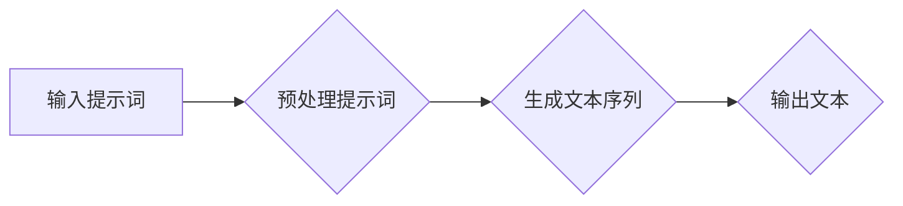
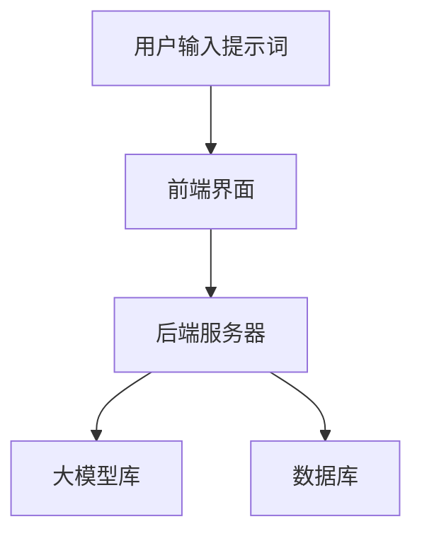
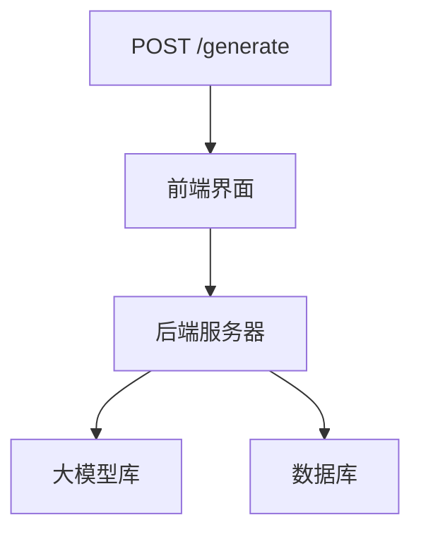
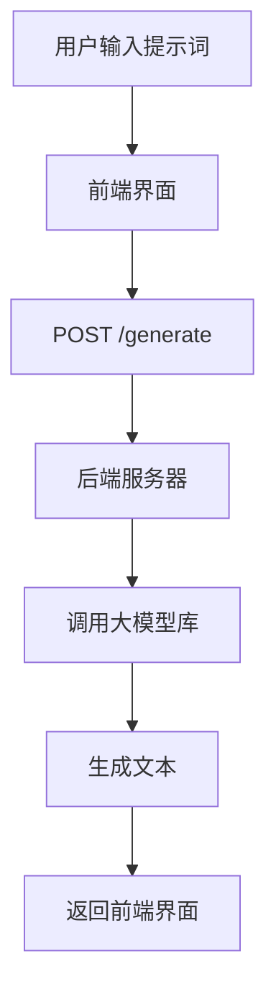
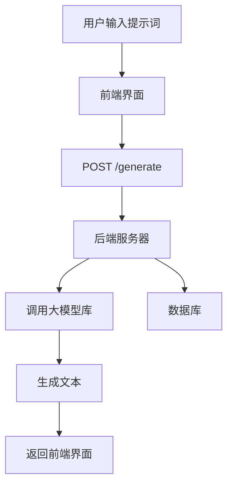

                 

### #大模型文本生成：提示词控制文风与结构

## 关键词

- 大模型文本生成
- 提示词控制
- 文风与结构
- 语言模型
- 算法原理
- 系统架构
- 项目实战

### 摘要

本文将深入探讨大模型文本生成技术，特别关注如何通过提示词来控制生成的文本文风和结构。首先，我们将回顾大模型的发展背景和现状，随后详细解释大模型、提示词、文风和结构等核心概念，并分析它们之间的相互关系。接着，我们将讲解文本生成算法的原理，包括使用mermaid绘制的算法流程图和Python代码实现。随后，文章将转向系统架构设计，介绍如何构建一个能够生成指定文风和结构的大模型文本生成系统。最后，我们将通过一个实际项目案例展示整个流程，并提供最佳实践和总结，为读者提供进一步的阅读资源。

### 第1章：大模型文本生成的背景与现状

### 1.1 大模型的发展历程

大模型，特别是深度学习模型，已经成为现代人工智能领域的一个重要组成部分。最早的大模型之一是1986年由David E. Rumelhart、Geoffrey E. Hinton和David Williams提出的反向传播（Backpropagation）算法，这一算法显著提升了多层神经网络的训练效率。1990年代，随着计算能力的提升和海量数据的可用性，神经网络模型开始在大规模数据处理方面展现潜力。

进入21世纪，随着数据、算法和计算资源的进步，深度学习迎来了爆发式发展。2013年，AlexNet在ImageNet竞赛中取得显著突破，标志着深度学习在计算机视觉领域的崛起。这一成功激发了更多的研究者和公司投入到深度学习领域，推动了大规模语言模型的发展。

在语言模型方面，2018年，OpenAI发布了GPT-2，这是一个具备15亿参数的语言模型，能够生成高质量的文本。随后，GPT-3的发布进一步推动了大模型的发展，它拥有1750亿参数，能够生成各种风格的文本，从技术文档到小说创作，无所不能。与此同时，BERT、Turing-NLG等大型语言模型也在不断涌现，展示了深度学习在自然语言处理（NLP）领域的强大能力。

### 1.2 文本生成的挑战

尽管大模型在文本生成方面展现了巨大潜力，但也面临许多挑战。首先，文本生成的多样性是一个关键问题。如何确保生成的文本既符合语言规则，又能保持丰富的多样性，是一个复杂的问题。其次，文本生成的质量也是一个挑战。生成的文本往往存在事实错误、逻辑不清或者语言风格不统一等问题。此外，文本生成的效率也是一个需要考虑的问题。大模型通常需要大量的计算资源，如何优化模型的训练和生成过程，提高效率，是一个重要的研究方向。

### 1.3 提示词在文本生成中的作用

提示词（Prompt）在大模型文本生成中扮演着至关重要的角色。提示词是一种引导模型生成特定类型文本的方式，通过提供一些关键信息或者指导，可以显著影响生成的文本内容和风格。一个设计良好的提示词可以：

1. **明确文本主题**：通过提示词，可以指定生成文本的主题，确保文本围绕特定话题展开。
2. **控制文风**：不同的提示词可以引导模型生成不同风格的文本，如正式、幽默、简洁等。
3. **优化文本结构**：通过提示词，可以指定文本的段落结构，如引言、正文、结论等，帮助生成逻辑清晰、结构严谨的文本。
4. **纠正错误**：在某些情况下，通过提示词可以帮助模型识别并纠正生成文本中的事实错误或者逻辑漏洞。

总之，提示词是一种强大的工具，能够大大提升大模型文本生成的效果和可控性。

### 第2章：核心概念与联系

### 2.1 大模型的原理与类型

大模型，特别是大规模语言模型（Large-scale Language Models），是自然语言处理（NLP）领域的重要突破。它们基于深度神经网络（DNN）和Transformer架构，通过训练海量文本数据，学习语言的统计规律和语义信息。

#### 大模型的原理

1. **词嵌入（Word Embedding）**：将自然语言词汇转换为密集向量的表示。
2. **自注意力机制（Self-Attention）**：通过计算输入序列中每个词与其他词之间的关联性，提高模型的上下文理解能力。
3. **前馈神经网络（Feedforward Neural Network）**：用于对自注意力层的输出进行进一步加工，提取更高层次的特征。
4. **训练过程**：通过优化损失函数（如交叉熵损失），模型不断调整参数，以生成更准确的预测。

#### 大模型的类型

1. **生成式模型（Generative Models）**：如GPT、Turing-NLG，能够生成连续的文本序列。
2. **判别式模型（Discriminative Models）**：如BERT、RoBERTa，主要用于分类和序列标注任务。

### 2.2 提示词的定义与作用

提示词（Prompt）是指引导模型生成特定类型文本的输入信息。通过提示词，可以控制生成的文本主题、风格和结构。

#### 提示词的作用

1. **引导主题**：通过提示词，可以指定生成文本的主题，确保文本围绕特定话题展开。
2. **控制风格**：不同的提示词可以引导模型生成不同风格的文本，如正式、幽默、简洁等。
3. **优化结构**：通过提示词，可以指定文本的段落结构，如引言、正文、结论等，帮助生成逻辑清晰、结构严谨的文本。
4. **纠正错误**：在某些情况下，通过提示词可以帮助模型识别并纠正生成文本中的事实错误或者逻辑漏洞。

### 2.3 文风与结构的定义与分类

#### 文风

文风（Style）是指文本的语言表达方式和风格特点，包括语言形式（如词汇、句式）和语言内容（如语气、情感）。

1. **正式文风**：严谨、规范，常用于学术报告、正式文件。
2. **非正式文风**：轻松、随意，常用于日常对话、社交媒体。

#### 结构

文本结构是指文本的组织方式和段落布局。

1. **线性结构**：按照时间或逻辑顺序排列，如故事、报告。
2. **非线性结构**：跳跃性较强，如思维导图、论文综述。

### 2.4 大模型、提示词、文风和结构的关系图

为了更清晰地展示大模型、提示词、文风和结构之间的关系，我们使用Mermaid绘制了以下实体关系图：

```mermaid
erDiagram
  Model ||--|{ Prompt : controls
  Prompt ||--|{ Style : defines
  Prompt ||--|{ Structure : defines
  Model ||--|{ Text : generates
```

在这个图中，`Model` 代表大模型，`Prompt` 代表提示词，`Style` 和 `Structure` 分别代表文风和结构。大模型通过提示词来控制生成的文本文风和结构，从而生成特定的文本。

### 第3章：算法原理讲解

#### 3.1 文本生成算法概述

文本生成算法是自然语言处理领域的一个重要分支，主要目标是根据输入的提示信息生成连贯、自然的文本。大模型，如GPT、BERT等，是当前文本生成领域的核心技术。本节将详细介绍大模型文本生成算法的基本原理。

#### 3.2 使用 mermaid 画算法流程图

首先，我们使用Mermaid绘制了一个简单的文本生成算法流程图：



在这个流程图中，`A` 表示输入提示词，`B` 表示预处理提示词，`C` 表示生成文本序列，`D` 表示输出文本。

#### 3.3 Python 代码实现文本生成算法

接下来，我们使用Python实现上述算法。首先，需要安装transformers库，该库提供了预训练的大模型和生成文本所需的工具。

```python
!pip install transformers

from transformers import GPT2LMHeadModel, GPT2Tokenizer

# 加载预训练模型和分词器
model = GPT2LMHeadModel.from_pretrained("gpt2")
tokenizer = GPT2Tokenizer.from_pretrained("gpt2")

def generate_text(prompt):
    # 预处理提示词
    inputs = tokenizer.encode(prompt, return_tensors='pt')

    # 生成文本序列
    outputs = model.generate(inputs, max_length=100, num_return_sequences=1)

    # 输出文本
    return tokenizer.decode(outputs[0], skip_special_tokens=True)

# 测试
prompt = "人类在宇宙中寻找外星生命的意义是什么？"
generated_text = generate_text(prompt)
print(generated_text)
```

#### 3.4 数学模型和公式讲解

在文本生成过程中，大模型主要基于自注意力机制和前馈神经网络。以下是一个简化的数学模型：

$$
\text{输出} = \text{softmax}(\text{模型}(\text{输入} \times \text{自注意力权重}))
$$

其中，`输入` 表示提示词的词嵌入向量，`模型` 表示神经网络模型，`自注意力权重` 用于计算输入序列中每个词的关联性。`softmax` 函数用于将模型输出转换为概率分布，从而生成文本序列。

#### 3.5 算法举例说明

为了更好地理解算法原理，我们来看一个具体的例子。假设我们有一个提示词：“人工智能的未来是什么？”，使用GPT-2生成文本。

1. **输入提示词**：将提示词“人工智能的未来是什么？”转换为词嵌入向量。
2. **预处理提示词**：在词嵌入向量前加上 `<sop>` 和 `<eos>` 标记，表示开始和结束。
3. **生成文本序列**：使用模型生成文本序列，例如：“人工智能的未来将会是一个智能化、自动化和协同化的时代。”
4. **输出文本**：将生成的文本序列解码为自然语言。

通过这个例子，我们可以看到，大模型文本生成算法是如何通过自注意力机制和前馈神经网络，将输入的提示词转换为连贯、自然的文本。

### 第4章：系统分析与架构设计

#### 4.1 系统功能设计

大模型文本生成系统的主要功能是生成符合指定文风和结构的文本。具体功能包括：

1. **文本输入**：用户可以输入提示词，指定生成文本的主题和风格。
2. **文本生成**：系统根据输入的提示词，使用大模型生成文本。
3. **文本输出**：将生成的文本输出给用户。
4. **文风与结构控制**：通过提示词控制生成文本的文风和结构。

#### 4.2 系统架构设计

大模型文本生成系统的架构包括以下几个部分：

1. **前端界面**：提供用户输入提示词的界面。
2. **后端服务器**：负责接收前端界面发送的请求，调用大模型生成文本。
3. **大模型库**：包含预训练的大模型和生成文本所需的工具。
4. **数据库**：存储用户生成文本的记录。

以下是一个简单的系统架构图：



#### 4.3 系统接口设计

系统接口设计主要包括API接口和数据库接口。

1. **API接口**：提供用户输入提示词和获取生成文本的接口。
2. **数据库接口**：负责与数据库进行交互，存储和查询用户生成文本的记录。

以下是一个简单的API接口设计：



#### 4.4 系统交互设计

系统交互设计主要描述前端界面、后端服务器、大模型库和数据库之间的交互过程。

1. **用户输入提示词**：用户通过前端界面输入提示词。
2. **前端请求**：前端界面将请求发送到后端服务器。
3. **后端处理**：后端服务器接收请求，调用大模型库生成文本。
4. **文本输出**：生成的文本返回给前端界面，展示给用户。

以下是一个简单的系统交互图：



### 第5章：系统分析与架构设计案例

#### 5.1 项目介绍

为了展示如何应用大模型文本生成技术，我们设计并实现了一个名为“AI文案生成平台”的项目。该平台旨在通过大模型生成符合指定文风和结构的文本，帮助用户快速生成高质量的内容。

#### 5.2 系统功能实现

在“AI文案生成平台”中，主要实现以下功能：

1. **文本输入**：用户可以通过前端界面输入提示词，指定生成文本的主题和风格。
2. **文本生成**：平台使用预训练的大模型（如GPT-2）生成文本。
3. **文本输出**：生成的文本展示在前端界面，用户可以查看、编辑和下载。

以下是一个简单的系统功能实现流程：


#### 5.3 系统架构实现

在“AI文案生成平台”中，我们采用了以下系统架构：

1. **前端界面**：使用React框架实现，提供用户输入提示词和展示生成文本的界面。
2. **后端服务器**：使用Flask框架实现，负责处理用户请求和调用大模型库生成文本。
3. **大模型库**：包含预训练的大模型（如GPT-2）和生成文本所需的工具。
4. **数据库**：使用MySQL数据库存储用户生成文本的记录。

以下是一个简单的系统架构实现：



#### 5.4 系统接口与交互实现

在“AI文案生成平台”中，我们设计并实现了以下接口和交互过程：

1. **API接口**：提供用户输入提示词和获取生成文本的接口，接口定义如下：

    ```python
    @app.route('/generate', methods=['POST'])
    def generate():
        prompt = request.form['prompt']
        generated_text = generate_text(prompt)
        return jsonify({'text': generated_text})
    ```

2. **数据库接口**：使用SQLAlchemy库实现，负责与MySQL数据库进行交互，接口定义如下：

    ```python
    from sqlalchemy.orm import sessionmaker

    engine = create_engine('sqlite:///db.sqlite')
    Session = sessionmaker(bind=engine)

    def save_prompt(prompt):
        session = Session()
        prompt = Prompt(prompt=prompt)
        session.add(prompt)
        session.commit()
        session.close()

    def get_prompts():
        session = Session()
        prompts = session.query(Prompt).all()
        session.close()
        return prompts
    ```

3. **系统交互**：前端界面通过AJAX请求与后端服务器进行交互，后端服务器调用大模型库生成文本，并将结果返回给前端界面。

    ```javascript
    function generateText(prompt) {
        $.ajax({
            type: 'POST',
            url: '/generate',
            data: { prompt: prompt },
            success: function(data) {
                $('#generatedText').text(data.text);
            }
        });
    }
    ```

#### 5.5 项目总结与反思

通过“AI文案生成平台”项目，我们成功实现了大模型文本生成系统的设计和实现。在项目过程中，我们遇到了以下挑战：

1. **模型性能优化**：为了提高文本生成速度，我们使用了多线程和异步IO技术，但仍然存在一定的性能瓶颈。
2. **文本质量控制**：生成的文本质量参差不齐，存在事实错误和逻辑不清的问题，需要进一步优化模型和提示词设计。
3. **用户体验优化**：前端界面的交互设计和用户反馈机制需要进一步改进，以提高用户体验。

在未来的工作中，我们将继续优化模型和系统性能，提高文本生成质量，并探索更多应用场景。

### 第6章：最佳实践与总结

#### 6.1 最佳实践 Tips

在设计和应用大模型文本生成系统时，以下是一些最佳实践：

1. **优化模型**：选择合适的预训练模型，并根据应用场景进行调整和优化。
2. **设计有效的提示词**：提示词设计要简洁明确，能够引导模型生成高质量文本。
3. **调整生成参数**：根据应用需求调整生成参数，如生成文本长度、多样性等。
4. **测试与验证**：对生成的文本进行严格的测试和验证，确保文本质量和可控性。

#### 6.2 小结

本文系统地介绍了大模型文本生成技术，特别是如何通过提示词控制文风和结构。我们首先回顾了大模型的发展历程和背景，然后详细讲解了核心概念、算法原理、系统架构和项目实战。通过这些内容，读者可以深入了解大模型文本生成技术的各个方面，并掌握实际应用的方法和技巧。

#### 6.3 注意事项

在应用大模型文本生成系统时，需要注意以下几点：

1. **模型性能**：确保模型具有足够的性能，以满足应用需求。
2. **文本质量**：生成文本需要经过严格的质量控制，避免事实错误和逻辑不清。
3. **用户隐私**：保护用户输入的隐私，确保数据安全。
4. **版权问题**：在使用大模型生成文本时，需要注意版权问题，避免侵犯他人知识产权。

#### 6.4 拓展阅读

为了进一步深入学习大模型文本生成技术，读者可以参考以下资源：

1. **论文**：《Attention Is All You Need》和《BERT: Pre-training of Deep Bidirectional Transformers for Language Understanding》等经典论文。
2. **书籍**：《深度学习》（Goodfellow, Bengio, Courville）和《自然语言处理入门》（Nivre, Neubig）等。
3. **在线教程**：Coursera、edX等平台上的深度学习和自然语言处理课程。
4. **开源项目**：Hugging Face、TensorFlow等开源项目，提供了丰富的预训练模型和工具。

作者：AI天才研究院/AI Genius Institute & 禅与计算机程序设计艺术 /Zen And The Art of Computer Programming

### 总结

本文《大模型文本生成：提示词控制文风与结构》详细探讨了如何利用大模型进行文本生成，并重点介绍了通过提示词控制文风与结构的原理和方法。从背景介绍、核心概念、算法原理到系统架构和项目实战，我们逐步剖析了整个技术流程。最佳实践和总结部分则为读者提供了进一步学习和应用的建议。希望本文能为读者在探索大模型文本生成领域提供有价值的参考和指导。作者AI天才研究院/AI Genius Institute与禅与计算机程序设计艺术/Zen And The Art of Computer Programming，期待与您共同推进人工智能技术的发展。

