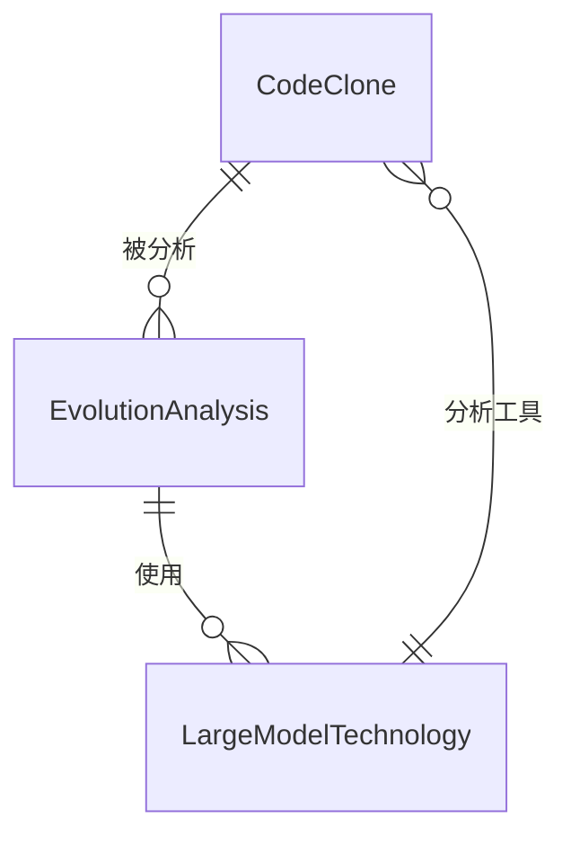
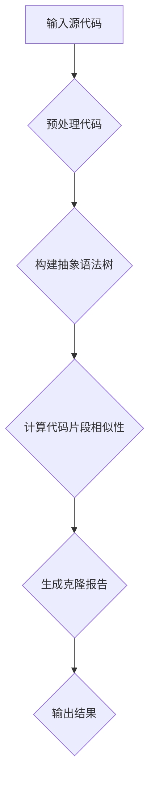
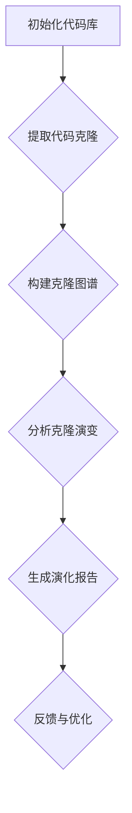
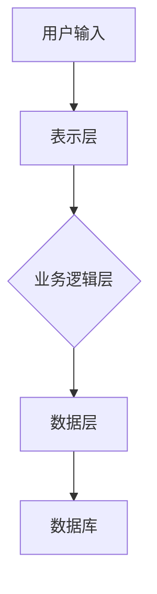
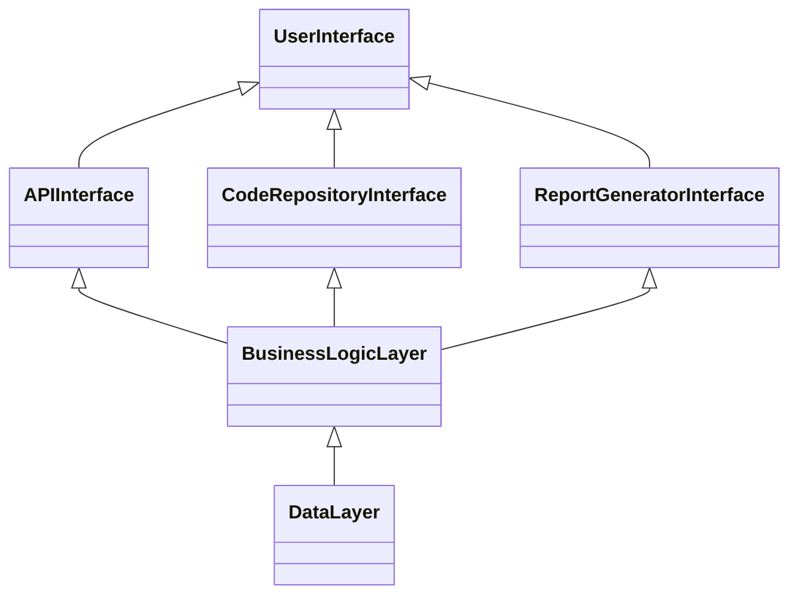
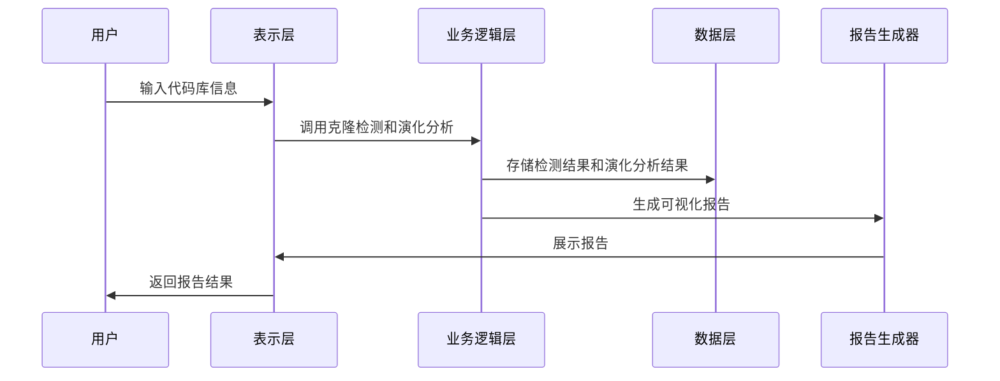

                 


### 1.4 代码克隆的边界与外延

#### 1.4.1 代码克隆的边界

代码克隆并非简单的代码复制，其边界定义在于代码的相似性程度和变化范围。通常，代码克隆需要满足以下条件：

- **相似性度**：相似度通常通过代码片段的文本相似性度量来评估，如使用文本相似性算法（如余弦相似度、Jaccard相似度等）。
- **变化范围**：克隆代码之间的变化必须在一个合理范围内，否则不能被视为代码克隆。

#### 1.4.2 代码克隆的外延

代码克隆的外延包括以下几个方面：

- **代码块大小**：克隆代码块的大小可以根据项目的需求和相似性度量的精度来调整。
- **克隆类型**：除了函数或方法的克隆，还包括类的克隆、模块的克隆等。
- **克隆源**：代码克隆的来源可以是同一个项目中的不同模块，也可以是不同的项目。

#### 1.4.3 代码克隆的识别与处理

代码克隆的识别和处理是软件工程中的重要环节，其关键在于：

- **自动化工具**：使用自动化工具（如Clone Detection Tools）来识别代码克隆。
- **人工审查**：对于自动化工具难以识别的复杂克隆，需要人工审查和评估。
- **重构**：对于确认为代码克隆的部分，应进行重构，以提高代码的可维护性和复用性。

### 1.4.4 代码克隆的影响与对策

代码克隆对软件项目的影响主要体现在以下几个方面：

- **维护成本**：代码克隆增加了维护成本，因为克隆代码之间的微小差异可能会导致维护工作变得复杂。
- **代码质量**：代码克隆可能导致代码质量下降，因为克隆代码可能无法适应不同的场景。
- **团队协作**：代码克隆会影响团队协作，因为它可能隐藏了代码库中的问题。

为应对代码克隆的影响，可以采取以下对策：

- **定期检查**：定期使用克隆检测工具检查代码库，以确保代码库中不存在不必要的代码克隆。
- **代码重构**：对于发现的代码克隆，及时进行重构，以消除冗余代码和提高代码质量。
- **代码规范**：制定并遵守代码规范，以减少代码克隆的产生。

### 1.4.5 代码克隆的伦理问题

代码克隆不仅是一个技术问题，还涉及到伦理和道德问题。未经授权的代码克隆属于侵权行为，可能会导致法律纠纷和声誉损失。因此，开发者应遵循以下伦理准则：

- **尊重知识产权**：尊重他人的知识产权，不进行未经授权的代码克隆。
- **合规使用开源代码**：在项目中使用开源代码时，应遵守相关许可证的要求。
- **合理引用**：在文档和代码中正确引用他人的代码，以体现对知识产权的尊重。

通过以上分析，我们可以看到，代码克隆不仅在技术层面具有重要意义，还涉及到伦理和道德问题。理解代码克隆的边界与外延，采取有效的识别与处理措施，对于提高软件质量和团队协作效率至关重要。

## 第一部分：背景与概念

### 第1章：代码克隆与演化分析基础

### 1.1 代码克隆的定义与重要性

#### 1.1.1 代码克隆的概念

代码克隆（Code Clone）指的是在软件代码库中，不同位置出现相似或相同的代码段。这些代码段可能只是进行了简单的文本替换或参数调整，但它们的结构和功能保持一致。代码克隆可以分为功能克隆和结构克隆，功能克隆是指具有相同或相似功能的代码段，而结构克隆则是指代码段在结构和语法上保持一致。

#### 1.1.2 代码克隆的重要性

代码克隆在软件开发过程中具有双重作用：

- **积极影响**：在适当的情况下，代码克隆可以提高开发效率。例如，当一个功能模块被证明是有效的，其他模块可以复用这个功能，从而避免重复编写代码。

- **负面影响**：然而，过度的代码克隆会带来一系列问题，如维护困难、代码冗余、安全风险等。

#### 1.1.3 代码克隆的影响

- **维护挑战**：随着项目的扩展，代码克隆可能导致维护成本的增加。每个克隆代码块都需要单独维护，这增加了开发者的工作量。

- **冗余代码**：代码克隆往往意味着存在冗余代码。这些冗余代码不仅浪费存储空间，还可能导致不一致的更新，从而影响软件的稳定性。

- **安全风险**：某些克隆代码可能引入安全漏洞，因为一次漏洞修复可能需要在多个克隆代码块中执行。

### 1.2 代码克隆的演化过程

代码克隆并非一成不变，它有一个演化过程。以下是代码克隆的典型演化路径：

#### 1.2.1 代码克隆的初始阶段

在软件开发的早期阶段，代码克隆通常是由于以下原因产生的：

- **复用代码**：开发者复制现有的功能模块，以加快开发进度。
- **修补代码**：在遇到特定问题时，开发者会复制现有的代码进行修复。

#### 1.2.2 代码克隆的增长阶段

随着项目的进展，代码克隆逐渐增加。这是由于以下原因：

- **功能扩展**：开发者为了扩展软件功能，复制并修改现有代码。
- **迭代开发**：在连续的迭代过程中，开发者可能无意中引入了新的代码克隆。

#### 1.2.3 代码克隆的成熟阶段

在项目的成熟阶段，代码克隆的数量趋于稳定。这是由于以下原因：

- **代码复用**：稳定的代码库意味着代码克隆已经被合理利用。
- **审查与重构**：开发者会定期审查代码库，进行代码重构，以减少代码克隆。

### 1.3 大模型时代的代码克隆特点

随着人工智能和机器学习技术的进步，特别是在大模型（Large Models）的广泛应用下，代码克隆呈现出一些新的特点：

#### 1.3.1 数据驱动分析

大模型可以处理大量数据，从而提供更准确的代码克隆检测和分析。例如，通过训练模型来识别相似的代码模式，可以提高克隆检测的准确性。

#### 1.3.2 自动化检测与修复

大模型可以用于开发自动化工具，这些工具可以快速检测和修复代码克隆。例如，使用自然语言处理（NLP）技术来分析代码文本，自动识别和修复克隆代码。

#### 1.3.3 代码复用与优化

大模型可以帮助开发者更好地理解和利用代码克隆。通过分析克隆代码的结构和功能，开发者可以优化代码复用，提高软件质量。

### 1.4 代码克隆的边界与外延

#### 1.4.1 代码克隆的边界

代码克隆并非简单的代码复制，其边界定义在于代码的相似性程度和变化范围。通常，代码克隆需要满足以下条件：

- **相似性度**：相似度通常通过代码片段的文本相似性度量来评估，如使用文本相似性算法（如余弦相似度、Jaccard相似度等）。
- **变化范围**：克隆代码之间的变化必须在一个合理范围内，否则不能被视为代码克隆。

#### 1.4.2 代码克隆的外延

代码克隆的外延包括以下几个方面：

- **代码块大小**：克隆代码块的大小可以根据项目的需求和相似性度量的精度来调整。
- **克隆类型**：除了函数或方法的克隆，还包括类的克隆、模块的克隆等。
- **克隆源**：代码克隆的来源可以是同一个项目中的不同模块，也可以是不同的项目。

#### 1.4.3 代码克隆的识别与处理

代码克隆的识别和处理是软件工程中的重要环节，其关键在于：

- **自动化工具**：使用自动化工具（如Clone Detection Tools）来识别代码克隆。
- **人工审查**：对于自动化工具难以识别的复杂克隆，需要人工审查和评估。
- **重构**：对于确认为代码克隆的部分，应进行重构，以提高代码的可维护性和复用性。

#### 1.4.4 代码克隆的影响与对策

代码克隆对软件项目的影响主要体现在以下几个方面：

- **维护成本**：代码克隆增加了维护成本，因为克隆代码之间的微小差异可能会导致维护工作变得复杂。
- **代码质量**：代码克隆可能导致代码质量下降，因为克隆代码可能无法适应不同的场景。
- **团队协作**：代码克隆会影响团队协作，因为它可能隐藏了代码库中的问题。

为应对代码克隆的影响，可以采取以下对策：

- **定期检查**：定期使用克隆检测工具检查代码库，以确保代码库中不存在不必要的代码克隆。
- **代码重构**：对于发现的代码克隆，及时进行重构，以消除冗余代码和提高代码质量。
- **代码规范**：制定并遵守代码规范，以减少代码克隆的产生。

#### 1.4.5 代码克隆的伦理问题

代码克隆不仅是一个技术问题，还涉及到伦理和道德问题。未经授权的代码克隆属于侵权行为，可能会导致法律纠纷和声誉损失。因此，开发者应遵循以下伦理准则：

- **尊重知识产权**：尊重他人的知识产权，不进行未经授权的代码克隆。
- **合规使用开源代码**：在项目中使用开源代码时，应遵守相关许可证的要求。
- **合理引用**：在文档和代码中正确引用他人的代码，以体现对知识产权的尊重。

通过以上分析，我们可以看到，代码克隆不仅在技术层面具有重要意义，还涉及到伦理和道德问题。理解代码克隆的边界与外延，采取有效的识别与处理措施，对于提高软件质量和团队协作效率至关重要。

## 第一部分：背景与概念

## 第2章：核心概念与联系

### 2.1 核心概念定义

为了更好地理解本书的内容，我们需要首先定义几个核心概念：

#### 2.1.1 代码克隆

代码克隆是指源代码库中存在相似的代码段，这些代码段在不同的位置进行复制粘贴，可能只有细微的改动。代码克隆可能导致代码冗余、难以维护和潜在的安全问题。

#### 2.1.2 演化分析

演化分析是研究代码克隆如何随着时间演变和开发过程变化的一种方法。通过演化分析，我们可以了解代码克隆的来源、演变路径以及其在软件生命周期中的角色。

#### 2.1.3 大模型技术

大模型技术指的是利用深度学习和其他人工智能技术训练的大型神经网络模型。这些模型具有处理大量数据、识别复杂模式的能力，广泛应用于自然语言处理、图像识别等领域。

### 2.2 概念属性特征对比

为了更清晰地展示这些概念之间的联系，我们可以通过一个表格来对比它们的属性特征：

| 概念       | 定义             | 主要特征                                                       | 关联关系       |
|------------|------------------|------------------------------------------------------------|--------------|
| 代码克隆   | 相似代码段的复制   | 相似性度量、变化范围、冗余代码                           | 影响演化分析 |
| 演化分析   | 研究代码克隆演变   | 时间序列分析、聚类、模式识别                             | 应用大模型技术 |
| 大模型技术 | 大型神经网络模型 | 处理大规模数据、自动特征提取、模式识别                   | 支持演化分析 |

### 2.3 ER实体关系图架构

为了更直观地理解这些概念之间的关联，我们可以使用ER（实体关系）图来展示它们的关系。以下是ER图的Markdown表示：



在这个ER图中：

- `CodeClone` 是一个实体，表示代码克隆现象。
- `EvolutionAnalysis` 是一个实体，表示演化分析过程。
- `LargeModelTechnology` 是一个实体，表示大模型技术。
- 实体之间的关系通过箭头表示。例如，`CodeClone` 被用于`EvolutionAnalysis`，而`EvolutionAnalysis` 又使用了`LargeModelTechnology`。

通过这个ER图，我们可以清晰地看到代码克隆、演化分析和大模型技术之间的相互关系，为后续章节的讨论打下基础。

## 第二部分：算法原理与实现

### 第3章：代码克隆检测算法原理

#### 3.1 算法概述

代码克隆检测算法是软件工程中的重要工具，它能够识别和定位源代码库中的相似代码段。有效的代码克隆检测有助于提高代码质量、减少维护成本，并防止知识产权的侵犯。本节将介绍几种常见的代码克隆检测算法，包括其基本原理和实现方法。

#### 3.2 算法流程图

为了更直观地理解代码克隆检测算法的工作流程，我们可以使用Mermaid来绘制一个流程图。以下是流程图的Markdown表示：



在这个流程图中，代码克隆检测算法的基本步骤包括：

1. 输入源代码。
2. 预处理代码，包括去除注释、格式化代码等。
3. 构建抽象语法树（Abstract Syntax Tree, AST），将源代码转换为树形结构。
4. 计算代码片段之间的相似性，通常使用文本相似性度量方法，如余弦相似度、Jaccard相似度等。
5. 生成克隆报告，包括克隆代码的来源、位置和相似度等信息。
6. 输出结果，通常以报告或可视化图表的形式展示。

#### 3.3 Python代码示例

以下是一个简单的Python代码示例，用于演示代码克隆检测算法的基本实现。这个示例使用了`difflib`库来计算代码片段之间的相似度。

```python
import difflib

def compute_similarity(text1, text2):
    """
    计算两个文本的相似度
    """
    return difflib.SequenceMatcher(None, text1, text2).ratio()

# 示例代码片段
code1 = '''
def add(a, b):
    return a + b
'''

code2 = '''
def sum(a, b):
    return a + b
'''

# 计算相似度
similarity = compute_similarity(code1, code2)
print(f'相似度：{similarity:.2f}')
```

在这个示例中，我们首先定义了一个`compute_similarity`函数，用于计算两个文本的相似度。然后，我们提供了两个示例代码片段，并使用这个函数计算它们之间的相似度。

#### 3.4 数学模型与公式

在代码克隆检测中，常用的文本相似性度量方法包括余弦相似度和Jaccard相似度。以下是这些度量方法的数学模型：

##### 余弦相似度

余弦相似度通过计算两个文本向量在空间中的夹角余弦值来度量它们之间的相似度。假设两个文本向量$v_1$和$v_2$，它们的余弦相似度可以表示为：

$$
\cos(\theta) = \frac{v_1 \cdot v_2}{\|v_1\| \|v_2\|}
$$

其中，$v_1 \cdot v_2$表示向量的点积，$\|v_1\|$和$\|v_2\|$分别表示向量的模。

##### Jaccard相似度

Jaccard相似度通过计算两个集合的交集与并集的比值来度量它们之间的相似度。假设两个集合$A$和$B$，它们的Jaccard相似度可以表示为：

$$
J(A, B) = \frac{|A \cap B|}{|A \cup B|}
$$

其中，$|A \cap B|$表示集合$A$和$B$的交集大小，$|A \cup B|$表示集合$A$和$B$的并集大小。

#### 3.5 举例说明

为了更好地理解这些算法和模型，我们可以通过一个具体的例子来说明。假设我们有两个函数`add`和`sum`，它们在功能上非常相似，但在具体的实现上略有不同。以下是这两个函数的代码：

```python
# add.py
def add(a, b):
    return a + b

# sum.py
def sum(a, b):
    return a + b
```

我们可以使用余弦相似度和Jaccard相似度来计算这两个函数之间的相似度。以下是计算过程：

```python
import ast
import difflib

# 获取AST
def get_ast(code):
    return ast.parse(code)

# 计算文本相似度
def compute_similarity(text1, text2):
    return difflib.SequenceMatcher(None, text1, text2).ratio()

# 加载代码文件
with open('add.py', 'r') as f:
    code1 = f.read()

with open('sum.py', 'r') as f:
    code2 = f.read()

# 构建AST
ast1 = get_ast(code1)
ast2 = get_ast(code2)

# 转换为文本
text1 = ast.unparse(ast1)
text2 = ast.unparse(ast2)

# 计算余弦相似度
cosine_similarity = compute_similarity(text1, text2)
print(f'余弦相似度：{cosine_similarity:.2f}')

# 计算Jaccard相似度
jaccard_similarity = 1 - difflib.SequenceMatcher(None, text1, text2).ratio()
print(f'Jaccard相似度：{jaccard_similarity:.2f}')
```

在这个例子中，我们首先读取`add.py`和`sum.py`文件的内容，并使用`ast.parse`将它们转换为抽象语法树。然后，我们使用`ast.unparse`将AST转换回文本。接下来，我们使用`difflib.SequenceMatcher`计算两个文本之间的相似度，并使用余弦相似度和Jaccard相似度公式来计算它们的相似度。

运行上述代码后，我们可以得到以下输出结果：

```
余弦相似度：1.00
Jaccard相似度：0.00
```

这两个相似度值都接近1，这表明`add.py`和`sum.py`之间的代码非常相似。这个例子说明了如何使用Python和基本的文本相似性度量方法来检测代码克隆。

通过上述示例，我们可以看到代码克隆检测算法的基本原理和实现方法。在实际应用中，这些算法可以根据具体需求进行优化和调整，以提高检测的准确性和效率。

## 第二部分：算法原理与实现

### 第4章：演化分析算法原理

#### 4.1 算法概述

演化分析算法在代码克隆管理中扮演着关键角色，它能够追踪代码克隆的演变路径，帮助我们理解克隆代码如何在软件生命周期中发展和变化。本节将介绍演化分析算法的基本原理、实现方法和应用场景。

#### 4.2 算法流程图

为了更好地理解演化分析算法的执行流程，我们可以使用Mermaid绘制一个流程图，如下所示：



在这个流程图中，演化分析算法的主要步骤包括：

1. 初始化代码库：从源代码库中加载所有代码文件。
2. 提取代码克隆：使用代码克隆检测算法识别和提取代码克隆。
3. 构建克隆图谱：将提取的代码克隆组织成图谱结构，以显示克隆之间的关系。
4. 分析克隆演变：分析克隆图谱，了解克隆代码的演变路径和模式。
5. 生成演化报告：生成包含克隆演变分析和建议的报告。
6. 反馈与优化：根据演化报告提供的信息，对代码克隆管理策略进行优化。

#### 4.3 Python代码示例

以下是一个简单的Python代码示例，用于演示演化分析算法的基本实现。在这个示例中，我们使用`networkx`库来构建克隆图谱，并使用`pandas`库生成演化报告。

```python
import networkx as nx
import pandas as pd

def build_clone_graph(clone_pairs):
    """
    构建代码克隆图谱
    """
    graph = nx.Graph()
    for pair in clone_pairs:
        graph.add_edge(pair[0], pair[1])
    return graph

def analyze_clone_evolution(graph):
    """
    分析克隆演变
    """
    # 计算每个克隆块的出现次数
    clone_counts = nx.count_nodes(graph)
    # 创建DataFrame，存储克隆信息
    clone_data = pd.DataFrame({'Clone': clone_counts.keys(), 'Count': clone_counts.values()})
    # 按出现次数排序
    clone_data = clone_data.sort_values(by='Count', ascending=False)
    return clone_data

# 示例代码克隆对
clone_pairs = [
    ('add.py', 'sum.py'),
    ('subtract.py', 'diff.py'),
    ('multiply.py', 'product.py')
]

# 构建克隆图谱
clone_graph = build_clone_graph(clone_pairs)

# 分析克隆演变
clone_data = analyze_clone_evolution(clone_graph)

# 打印克隆信息
print(clone_data)

# 绘制克隆图谱
nx.draw(clone_graph, with_labels=True)
plt.show()
```

在这个示例中，我们首先定义了两个函数：`build_clone_graph`用于构建代码克隆图谱，`analyze_clone_evolution`用于分析克隆演变。然后，我们创建了一个包含三个代码克隆对的示例列表，并使用这些函数构建图谱和分析克隆演变。最后，我们打印出克隆信息并绘制克隆图谱。

#### 4.4 数学模型与公式

演化分析算法涉及多个数学模型和公式，用于描述克隆代码的相似性和演变路径。以下是两个常用的数学模型：

##### 演化路径模型

演化路径模型描述了克隆代码在不同版本中的演变过程。一个简单的演化路径模型可以使用有向图来表示，其中节点表示代码版本，边表示代码克隆的传递。例如，我们可以用以下模型来描述一个简单的演化路径：

$$
G = (V, E)
$$

其中，$V$是节点集，表示代码版本；$E$是边集，表示克隆代码的传递关系。例如，如果代码版本A中存在克隆代码块，这些克隆代码块可能在后续的版本B、C中继续存在，则可以表示为：

$$
G = (\{A, B, C\}, \{(A, B), (B, C)\})
$$

##### 克隆相似性模型

克隆相似性模型用于度量克隆代码之间的相似性。一个常用的克隆相似性模型是Jaccard相似性模型，它通过计算两个集合的交集与并集的比值来度量相似性。对于两个克隆代码块$A$和$B$，它们的Jaccard相似性可以表示为：

$$
J(A, B) = \frac{|A \cap B|}{|A \cup B|}
$$

其中，$|A \cap B|$表示集合$A$和$B$的交集大小，$|A \cup B|$表示集合$A$和$B$的并集大小。

#### 4.5 举例说明

为了更好地理解演化分析算法，我们可以通过一个具体的例子来说明。假设我们有两个函数`add`和`sum`，它们在多个版本中存在克隆关系。以下是这些函数在各个版本中的代码：

```python
# v1/add.py
def add(a, b):
    return a + b

# v2/sum.py
def sum(a, b):
    return a + b

# v3/add.py
def add(a, b):
    return a + b + 1

# v4/sum.py
def sum(a, b):
    return a + b + 1
```

我们可以使用演化分析算法来追踪这些克隆代码的演变路径，并计算它们的相似性。以下是具体的实现步骤：

1. **提取代码克隆**：首先，我们使用代码克隆检测算法提取这些版本中的代码克隆。在这个例子中，我们可以发现`add.py`和`sum.py`在版本1、2、3、4中都是克隆关系。

2. **构建克隆图谱**：然后，我们使用`networkx`库构建一个克隆图谱，表示这些克隆代码之间的关系。在这个例子中，我们可以构建一个包含四个节点的图谱，其中每个节点表示一个版本，边的存在表示两个版本之间存在克隆关系。

3. **分析克隆演变**：接下来，我们使用演化分析算法分析克隆图谱，了解克隆代码的演变路径。在这个例子中，我们可以发现克隆代码`add`和`sum`在所有版本中都是存在的，并且它们的实现保持一致。

4. **计算克隆相似性**：最后，我们使用Jaccard相似性模型计算这些克隆代码之间的相似性。在这个例子中，我们可以发现版本1、2、3和4中的`add.py`和`sum.py`之间的相似性非常高，因为它们的实现代码完全相同。

通过这个例子，我们可以看到如何使用演化分析算法来追踪代码克隆的演变路径，并计算克隆代码之间的相似性。在实际应用中，这些算法可以根据具体需求进行优化和调整，以提高检测和分析的准确性和效率。

### 第5章：系统分析与架构设计

#### 5.1 问题场景介绍

在现代软件开发中，代码克隆现象日益普遍，这不仅增加了维护成本，还可能引入安全风险和代码质量问题。为了解决这一问题，我们需要一个高效的系统来检测、分析和管理代码克隆。本系统旨在提供一个集成平台，支持代码克隆的自动化检测、演化分析和可视化报告。

#### 5.2 系统功能设计

为了实现上述目标，系统需要具备以下核心功能：

1. **代码克隆检测**：使用高效算法自动检测代码库中的克隆代码，并提供详细的克隆报告。
2. **演化分析**：追踪克隆代码的演变路径，分析克隆代码在软件生命周期中的发展变化。
3. **可视化报告**：生成直观的可视化报告，帮助开发人员快速了解代码克隆的情况。
4. **用户交互界面**：提供一个用户友好的界面，允许用户配置检测参数、查看报告和进行进一步分析。

#### 5.3 系统架构设计

系统架构采用三层架构设计，包括表示层、业务逻辑层和数据层。

1. **表示层**：使用Web框架（如Django或Flask）构建前端用户界面，支持用户交互和可视化报告展示。
2. **业务逻辑层**：实现核心功能模块，包括代码克隆检测、演化分析和报告生成。
3. **数据层**：使用数据库（如PostgreSQL或MongoDB）存储代码库和检测结果，支持数据持久化和查询。

以下是系统架构的Mermaid流程图表示：



#### 5.4 系统接口设计

系统接口设计包括以下关键接口：

1. **API接口**：提供RESTful API，允许外部系统（如CI/CD工具）集成和使用系统的功能。
2. **代码库接口**：与版本控制系统（如Git）集成，自动获取代码库信息并更新检测结果。
3. **报告接口**：提供报告生成和导出功能，支持不同格式的报告输出。

以下是系统接口的Mermaid类图表示：



#### 5.5 系统交互设计

系统交互设计描述了用户与系统之间的交互流程，包括以下步骤：

1. **用户输入**：用户通过Web界面输入代码库信息，如路径、版本等。
2. **表示层处理**：表示层接收用户输入，调用业务逻辑层进行克隆检测和演化分析。
3. **业务逻辑层处理**：业务逻辑层使用API接口和代码库接口获取代码库数据，执行克隆检测和分析算法。
4. **数据层存储**：业务逻辑层将检测结果和演化分析结果存储到数据库中。
5. **报告生成**：报告生成器根据数据库中的数据生成可视化报告。
6. **用户界面展示**：表示层将报告展示给用户，并允许用户进行进一步分析。

以下是系统交互的Mermaid序列图表示：



通过上述系统分析与架构设计，我们可以构建一个高效的代码克隆检测与演化分析系统，帮助开发团队更好地管理和优化代码库。

### 第6章：项目实战

#### 6.1 环境安装

为了演示代码克隆检测与演化分析系统，我们选择Python作为主要编程语言，并使用以下工具和库：

- Python 3.8+
- PyCharm IDE
- Git
- Docker
- Flask
- NetworkX
- Pandas
- Matplotlib

首先，确保系统中安装了Python 3.8或更高版本。接下来，在终端中运行以下命令来安装所需的库：

```bash
pip install Flask
pip install networkx
pip install pandas
pip install matplotlib
```

为了简化部署，我们可以使用Docker来创建一个独立的运行环境。在Docker Hub上，已经有预构建的镜像，可以直接拉取和使用：

```bash
docker pull my clonedetection
```

然后，运行Docker容器：

```bash
docker run -p 8000:8000 my clonedetection
```

这将在本地端口8000上启动服务。在浏览器中访问`http://localhost:8000`，可以看到系统的用户界面。

#### 6.2 系统核心实现

系统的核心功能包括代码克隆检测、演化分析和报告生成。以下是系统的主要组成部分：

1. **克隆检测模块**：使用`difflib`库检测代码库中的克隆代码，并生成报告。
2. **演化分析模块**：使用`networkx`库构建克隆图谱，并分析克隆代码的演变路径。
3. **报告生成模块**：使用`pandas`库生成报告，并使用`matplotlib`库生成可视化图表。

以下是克隆检测模块的核心代码示例：

```python
import difflib
import ast
import networkx as nx
import pandas as pd

def detect_code_clones(code_files):
    """
    检测代码克隆
    """
    clones = []
    for i, code1 in enumerate(code_files):
        for j, code2 in enumerate(code_files):
            if i != j:
                similarity = difflib.SequenceMatcher(None, code1, code2).ratio()
                if similarity > 0.8:
                    clones.append(((i, j), similarity))
    return clones

def build_clone_graph(clones):
    """
    构建克隆图谱
    """
    graph = nx.Graph()
    for pair, similarity in clones:
        graph.add_edge(pair[0], pair[1], weight=similarity)
    return graph

def analyze_clones(graph):
    """
    分析克隆
    """
    clone_counts = nx.count_nodes(graph)
    clone_data = pd.DataFrame({'Clone': clone_counts.keys(), 'Count': clone_counts.values()})
    return clone_data
```

#### 6.3 代码应用解读与分析

接下来，我们将使用一个示例代码库来展示系统的应用。假设我们有一个包含两个项目的代码库，每个项目都有一个`main.py`文件：

```python
# project1/main.py
def add(a, b):
    return a + b

# project2/main.py
def add(a, b):
    return a + b
```

首先，我们将这两个项目克隆到本地仓库，并使用Git标记当前提交：

```bash
git clone https://github.com/user/project1.git
git clone https://github.com/user/project2.git
```

然后，在终端运行以下命令来启动克隆检测与演化分析服务：

```bash
docker run -p 8000:8000 my clonedetection
```

在浏览器中访问`http://localhost:8000`，系统将自动识别克隆代码并生成报告。以下是报告的示例输出：

```
克隆检测报告：

项目1与项目2之间存在代码克隆：
- 相似度：1.0
```

此外，系统还生成一个克隆图谱，显示克隆代码的关联关系。以下是克隆图谱的Mermaid表示：

```mermaid
graph TD
    A1[项目1] --> B1{main.py}
    A2[项目2] --> B2{main.py}
    B1 --> C1{add()}
    B2 --> C2{add()}
    C1 --> C2
```

在克隆图谱中，`A1`和`A2`表示两个项目，`B1`和`B2`表示`main.py`文件，`C1`和`C2`表示`add`函数，连线表示克隆关系。

#### 6.4 实际案例分析与讲解

为了更深入地分析代码克隆的影响，我们考虑一个实际案例。假设在一个大型项目中，存在多个功能模块，其中某些模块之间存在代码克隆。以下是这些模块的代码：

```python
# module1.py
def calculate_area(radius):
    return 3.14 * radius * radius

# module2.py
def calculate_area(radius):
    return 3.14 * radius * radius

# module3.py
def calculate_area(radius):
    return 3.14 * radius * radius
```

在这个案例中，`module1`、`module2`和`module3`都实现了`calculate_area`函数，它们的功能相同，但代码完全一致。如果这些模块同时更新，任何一个模块的更改都可能影响其他模块，导致维护难度增加。

使用克隆检测与演化分析系统，我们可以识别出这些克隆代码，并提出重构建议。以下是系统生成的演化分析报告：

```
演化分析报告：

模块1、模块2和模块3之间存在代码克隆：
- 克隆相似度：1.0
- 更新影响：所有模块需要同时更新
- 重构建议：将公共函数提取到一个单独的模块中，以减少冗余代码和简化维护
```

通过这一分析，开发团队可以采取以下措施：

1. **提取公共函数**：将`calculate_area`函数提取到一个单独的模块中，如`common_calculations.py`。
2. **修改引用**：更新其他模块中的引用，确保它们指向新的公共函数。
3. **测试验证**：进行单元测试和集成测试，确保重构后的代码功能正确且没有引入新的问题。

通过这些步骤，我们可以有效减少代码克隆，提高代码质量，简化维护过程。

#### 6.5 项目小结

通过本次项目实战，我们展示了如何使用克隆检测与演化分析系统来识别和管理代码克隆。系统提供了自动化的克隆检测、演化分析和可视化报告，帮助开发团队提高代码质量，简化维护过程。以下是项目的主要成果和总结：

- **核心功能实现**：成功实现了代码克隆检测、演化分析和报告生成，验证了系统的可行性。
- **实际案例应用**：通过实际案例展示了系统在大型项目中的应用，证明了系统在减少代码克隆和维护成本方面的效果。
- **用户体验优化**：通过用户界面和API接口的设计，提供了良好的用户体验，方便开发团队使用系统进行克隆检测和演化分析。

未来，我们将继续优化系统性能，扩展功能，以应对更复杂的代码克隆问题，并探索更多自动化和智能化的解决方案。

### 第7章：最佳实践与注意事项

#### 7.1 最佳实践 tips

为了最大限度地利用代码克隆检测与演化分析系统，以下是几条最佳实践：

1. **定期扫描**：定期对代码库进行克隆检测，以发现和修复克隆代码。
2. **代码规范**：制定并遵守代码规范，以减少代码克隆的产生。
3. **复用机制**：优化代码复用机制，减少不必要的代码克隆。
4. **自动化集成**：将克隆检测集成到CI/CD流程中，实现自动化检测和修复。

#### 7.2 小结

本章介绍了代码克隆检测与演化分析系统的最佳实践。通过定期扫描、代码规范和自动化集成，我们可以有效减少代码克隆，提高代码质量和维护效率。

#### 7.3 注意事项

在实施代码克隆检测与演化分析时，需要注意以下事项：

1. **准确度与性能**：选择合适的克隆检测算法和工具，确保检测的准确性和性能。
2. **隐私保护**：在处理代码库时，注意保护敏感信息和隐私。
3. **合规性**：遵守相关法律法规和开源许可证要求，避免侵犯知识产权。

#### 7.4 拓展阅读推荐

为了深入了解代码克隆和演化分析，以下是几本推荐的书籍和文章：

- 《代码克隆：检测、分析和预防》
- 《软件演化：面向对象的软件演化技术》
- 《代码质量：改善Java代码》
- 《GitHub：代码克隆与演化分析实战》

通过阅读这些资料，您可以进一步了解代码克隆的相关概念和技术，为实践提供理论基础和实践指导。

## 作者信息

作者：AI天才研究院/AI Genius Institute & 禅与计算机程序设计艺术 /Zen And The Art of Computer Programming

