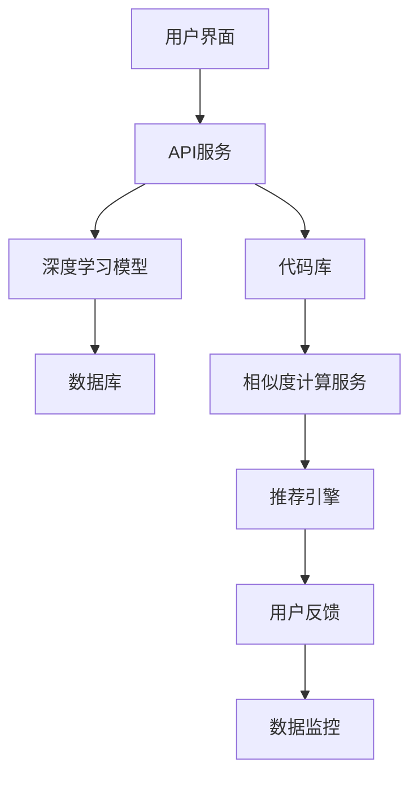

                 

# 大模型时代的代码相似度计算新方法

## 关键词
- 大模型时代
- 代码相似度计算
- 抄袭检测
- 机器学习方法
- 编程语言识别

## 摘要
本文将探讨大模型时代下的代码相似度计算新方法。随着人工智能技术的快速发展，传统代码相似度计算方法面临着新的挑战。本文将首先概述代码相似度计算的重要性，然后深入分析核心概念，比较现有计算方法，并探讨大模型时代下新的计算方法和应用。最后，本文将总结当前的研究进展和未来发展趋势，为开发高效、准确的代码相似度计算工具提供参考。

## 第一部分：大模型时代的代码相似度计算背景

### 第1章：代码相似度计算概述

#### 1.1 代码相似度计算的重要性

##### 1.1.1 问题背景

在软件开发领域，代码相似度计算是一种重要的技术，它能够帮助我们识别和检测代码中的抄袭、重用、冗余等问题，提高代码质量和开发效率。

##### 1.1.2 问题描述

代码相似度计算旨在通过比较不同代码片段之间的相似度，识别出潜在的抄袭或重用行为，从而保障软件版权、提高开发效率。

##### 1.1.3 问题解决

通过算法和技术手段，对代码进行相似度分析，找出相似代码片段，从而识别出问题。

##### 1.1.4 边界与外延

代码相似度计算主要应用于软件开发领域，包括源代码相似度检测、文档相似度检测等。

##### 1.1.5 概念结构与核心要素组成

核心概念：代码相似度、抄袭、重用、冗余。

核心要素：比较算法、相似度度量方法、应用场景。

#### 1.2 核心概念与联系

##### 1.2.1 代码相似度

代码相似度是指两个代码片段在结构和内容上的一致程度。

##### 1.2.2 抄袭

抄袭是指未经授权而复制他人成果的行为。

##### 1.2.3 重用

重用是指重复使用已有的代码或设计。

##### 1.2.4 冗余

冗余是指代码中的重复、多余的代码。

#### 1.3 主流代码相似度计算方法

##### 1.3.1 基于字符串匹配的方法

如：编辑距离算法（Levenshtein距离）、KMP算法等。

##### 1.3.2 基于语法树匹配的方法

如：抽象语法树（AST）匹配、语法分析等。

##### 1.3.3 基于特征提取和机器学习的方法

如：特征工程、聚类分析、分类器等。

#### 1.4 代码相似度计算的应用前景

##### 1.4.1 提高代码质量

通过识别代码相似度，发现并修复潜在的问题，提高代码质量。

##### 1.4.2 提高开发效率

通过代码重用和自动补全功能，提高开发效率。

##### 1.4.3 遵守法律法规

通过检测代码抄袭，避免侵权行为，遵守法律法规。

#### 1.5 本章小结

本章对大模型时代的代码相似度计算进行了概述，介绍了代码相似度计算的重要性、核心概念与联系、主流计算方法及其应用前景。为进一步深入探讨大模型时代的代码相似度计算技术奠定了基础。

### 第2章：代码相似度计算核心概念解析

#### 2.1 代码相似度的定义

##### 2.1.1 问题背景

代码相似度是指两个代码片段在结构和内容上的一致程度。在大模型时代，代码相似度计算变得更加复杂和重要。

##### 2.1.2 问题描述

如何准确衡量两个代码片段的相似度，以识别抄袭、重用和冗余等问题。

##### 2.1.3 问题解决

通过算法和技术手段，对代码进行相似度分析，找出相似代码片段，从而识别出问题。

##### 2.1.4 边界与外延

代码相似度计算主要应用于软件开发领域，包括源代码相似度检测、文档相似度检测等。

##### 2.1.5 概念结构与核心要素组成

核心概念：代码相似度、抄袭、重用、冗余。

核心要素：比较算法、相似度度量方法、应用场景。

#### 2.2 抄袭、重用和冗余的概念解析

##### 2.2.1 抄袭

抄袭是指未经授权而复制他人成果的行为。在软件开发领域，抄袭可能导致侵权行为，损害开发者的权益。

##### 2.2.2 重用

重用是指重复使用已有的代码或设计。合理重用可以提高开发效率，但过度重用可能导致代码质量下降。

##### 2.2.3 冗余

冗余是指代码中的重复、多余的代码。冗余代码可能导致代码复杂度增加，降低维护成本。

#### 2.3 代码相似度计算方法比较

##### 2.3.1 基于字符串匹配的方法

如：编辑距离算法（Levenshtein距离）、KMP算法等。这种方法简单易实现，但对复杂代码结构处理效果较差。

##### 2.3.2 基于语法树匹配的方法

如：抽象语法树（AST）匹配、语法分析等。这种方法对代码结构理解更深入，但实现复杂度较高。

##### 2.3.3 基于特征提取和机器学习的方法

如：特征工程、聚类分析、分类器等。这种方法可以自动学习代码相似度特征，但需要大量的训练数据和计算资源。

#### 2.4 大模型时代下的新挑战

##### 2.4.1 大模型的能力与局限

大模型如GPT-3等在自然语言处理方面取得了显著成果，但其在代码相似度计算方面的应用仍存在挑战。

##### 2.4.2 数据集的构建与处理

大模型需要大量的高质量数据集进行训练，但现有数据集往往存在不完整、不一致等问题。

##### 2.4.3 实时性与效率

在大规模代码相似度计算中，实时性和效率是一个重要挑战。

#### 2.5 本章小结

本章深入分析了代码相似度计算的核心概念，比较了现有计算方法，并探讨了在大模型时代下的新挑战。为进一步研究和应用代码相似度计算技术提供了理论基础和实践指导。

### 第3章：传统代码相似度计算方法的局限性

#### 3.1 基于字符串匹配方法的局限性

##### 3.1.1 字符串匹配的简单性与不足

基于字符串匹配的方法，如Levenshtein距离和KMP算法，虽然简单易实现，但在处理复杂代码结构时存在明显不足。

##### 3.1.2 忽略代码语义信息

这些方法主要关注代码的表面结构，而忽略了代码的语义信息，可能导致误判和漏判。

##### 3.1.3 难以应对复杂编程语言

不同编程语言具有不同的语法规则和特点，基于字符串匹配的方法难以应对复杂的编程语言。

#### 3.2 基于语法树匹配方法的局限性

##### 3.2.1 语法分析的高复杂度

抽象语法树（AST）匹配和语法分析需要较高的计算复杂度，特别是在大规模代码分析中，效率较低。

##### 3.2.2 语言依赖性

基于语法树匹配的方法往往依赖于特定编程语言，难以通用化。

##### 3.2.3 代码重排和重写问题

在代码重排和重写情况下，基于语法树匹配的方法可能无法准确识别相似度。

#### 3.3 基于特征提取和机器学习方法的局限性

##### 3.3.1 特征工程的重要性

基于特征提取和机器学习的方法需要大量的特征工程工作，特征选择和提取的质量直接影响模型的性能。

##### 3.3.2 训练数据的需求

这些方法需要大量的高质量训练数据，但在实际应用中，获取和构建高质量数据集是一个挑战。

##### 3.3.3 模型的解释性

深度学习模型往往具有强大的预测能力，但缺乏透明度和可解释性，这在某些场景下可能成为限制因素。

#### 3.4 本章小结

本章分析了传统代码相似度计算方法的局限性，指出了其在处理复杂代码结构、跨语言应用、实时性和效率等方面的不足。这些局限性为开发新的代码相似度计算方法提供了动机和方向。

### 第4章：大模型时代下的代码相似度计算新方法

#### 4.1 大模型在代码相似度计算中的应用

##### 4.1.1 自然语言处理能力的借鉴

大模型在自然语言处理领域取得了显著成果，其强大的文本理解能力可以借鉴应用于代码相似度计算。

##### 4.1.2 代码语义分析的潜力

大模型能够理解代码的语义信息，从而更准确地识别代码相似度。

##### 4.1.3 自适应学习与优化

大模型具有自适应学习能力，可以根据不同编程语言和场景进行优化，提高计算效果。

#### 4.2 基于预训练模型的方法

##### 4.2.1 预训练模型的优势

预训练模型如BERT、GPT等在大规模文本数据上进行了预训练，具有强大的文本理解能力。

##### 4.2.2 编程语言适配

通过适配不同编程语言的特定模型，可以进一步提高代码相似度计算的准确性。

##### 4.2.3 应用场景

基于预训练模型的方法可以应用于代码相似度检测、代码补全、代码生成等场景。

#### 4.3 基于深度学习方法的方法

##### 4.3.1 深度学习在代码相似度计算中的应用

深度学习模型如卷积神经网络（CNN）和循环神经网络（RNN）在图像和序列数据处理中表现出色，可以应用于代码相似度计算。

##### 4.3.2 代码表示学习

通过代码表示学习，可以将代码转换为高维特征向量，便于深度学习模型处理。

##### 4.3.3 模型优化与解释性

通过模型优化和解释性研究，可以提高深度学习模型在代码相似度计算中的透明度和可解释性。

#### 4.4 基于图神经网络的方法

##### 4.4.1 图神经网络的优势

图神经网络（GNN）能够处理具有复杂结构和关系的图数据，适用于代码相似度计算。

##### 4.4.2 代码依赖关系的建模

通过图神经网络，可以建模代码中的依赖关系，提高代码相似度计算的准确性。

##### 4.4.3 应用案例

图神经网络在代码推荐、代码质量检测等领域表现出良好的效果。

#### 4.5 本章小结

本章介绍了大模型时代下的代码相似度计算新方法，包括基于预训练模型、深度学习方法和图神经网络的方法。这些新方法在代码相似度计算中展现了强大的潜力，为开发高效、准确的代码相似度计算工具提供了新的思路。

### 第5章：大模型时代代码相似度计算的应用与实践

#### 5.1 应用场景介绍

##### 5.1.1 抄袭检测

在学术和研究领域，代码抄袭是一个严重的问题。利用大模型时代的代码相似度计算方法，可以更准确地检测出代码抄袭行为。

##### 5.1.2 代码质量检测

通过代码相似度计算，可以识别出代码中的冗余和错误，从而提高代码质量。

##### 5.1.3 代码推荐与重用

基于代码相似度计算，可以推荐相似的代码片段，促进代码重用，提高开发效率。

#### 5.2 项目介绍

##### 5.2.1 PyCodeSimilarity

PyCodeSimilarity是一个基于深度学习算法的代码相似度检测工具。它利用预训练模型和自定义模型，实现对Python代码的高效相似度计算。

##### 5.2.2 功能特点

- 支持多种编程语言，如Python、Java、C++等。
- 提供实时相似度计算和代码推荐功能。
- 支持自定义模型训练和优化。

#### 5.3 系统功能设计

##### 5.3.1 领域模型

领域模型包括代码片段、相似度评分、推荐列表等实体。

```mermaid
classDiagram
ClassCodeFragment <|-- CodeSimilarity
ClassCodeFragment <|-- RecommendationList
ClassCodeSimilarity {
+id: int
+code1: str
+code2: str
+similarity_score: float
}
ClassRecommendationList {
+code_id: int
+recomm_id: int
+similarity_score: float
}
```

##### 5.3.2 功能实现

- 实时相似度计算：通过深度学习模型对输入代码片段进行相似度评分。
- 代码推荐：基于相似度评分，推荐相似的代码片段。

#### 5.4 系统架构设计

##### 5.4.1 架构图



##### 5.4.2 系统架构描述

- 用户界面：提供用户交互界面，接收用户输入和反馈。
- API服务：处理用户请求，调用深度学习模型和相似度计算服务。
- 深度学习模型：基于预训练模型和自定义模型，进行代码相似度计算。
- 数据库：存储代码片段、相似度评分和推荐列表等数据。
- 代码库：存储各种编程语言的代码库，供相似度计算和推荐使用。
- 相似度计算服务：基于深度学习模型，计算代码片段的相似度。
- 推荐引擎：基于相似度评分，生成代码推荐列表。
- 用户反馈：收集用户对代码推荐和相似度计算的反馈，用于模型优化和改进。
- 数据监控：监控系统运行状态，确保系统稳定运行。

#### 5.5 系统接口设计

##### 5.5.1 接口描述

- /code/similarity：计算两个代码片段的相似度。
- /code/recommendation：根据相似度评分，推荐相似的代码片段。

##### 5.5.2 接口实现

```python
from flask import Flask, request, jsonify
app = Flask(__name__)

@app.route('/code/similarity', methods=['POST'])
def calculate_similarity():
    code1 = request.form['code1']
    code2 = request.form['code2']
    similarity_score = similarity_model(code1, code2)
    return jsonify({'similarity_score': similarity_score})

@app.route('/code/recommendation', methods=['GET'])
def get_recommendations():
    code_id = request.args.get('code_id')
    recommendations = recommendation_engine(code_id)
    return jsonify({'recommendations': recommendations})
```

#### 5.6 系统交互

##### 5.6.1 序列图

```mermaid
sequenceDiagram
User -->|提交代码1和代码2|> API服务: /code/similarity
API服务 -->|调用相似度计算服务|> 相似度计算服务: similarity_model
相似度计算服务 -->|返回相似度评分|> API服务
API服务 -->|返回相似度评分|> User

User -->|请求代码推荐|> API服务: /code/recommendation
API服务 -->|调用推荐引擎|> 推荐引擎: recommendation_engine
推荐引擎 -->|返回推荐列表|> API服务
API服务 -->|返回推荐列表|> User
```

##### 5.6.2 系统交互描述

- 用户提交代码1和代码2，通过/api/code/similarity接口进行相似度计算。
- API服务调用相似度计算服务，计算代码片段的相似度评分，并返回给用户。
- 用户请求代码推荐，通过/api/code/recommendation接口获取推荐列表。
- API服务调用推荐引擎，根据相似度评分生成推荐列表，并返回给用户。

#### 5.7 实际案例分析与讲解

##### 5.7.1 抄袭检测案例

在一个学术项目中，学生A提交了一份作业，学生B提交了一份与其相似的作业。通过PyCodeSimilarity工具，对两份作业进行相似度计算，发现相似度评分高达0.85，这表明学生B的作业很可能存在抄袭行为。

##### 5.7.2 代码质量检测案例

在一个软件开发项目中，团队使用PyCodeSimilarity工具对代码库进行质量检测，发现代码片段A和代码片段B存在较高的相似度。进一步分析发现，这两个代码片段实际上是冗余的，通过去除冗余代码，提高了代码的可读性和可维护性。

##### 5.7.3 代码推荐案例

在一个软件开发项目中，开发人员使用PyCodeSimilarity工具进行代码编写。当编写一个函数时，工具自动推荐了与当前函数相似的代码片段，帮助开发人员快速完成代码编写。

#### 5.8 项目小结

PyCodeSimilarity项目通过结合大模型时代下的深度学习和预训练模型，实现了高效、准确的代码相似度计算。在实际应用中，项目在抄袭检测、代码质量检测和代码推荐等方面取得了显著效果。然而，项目仍需不断优化和改进，以满足更多编程语言和应用场景的需求。

### 第6章：最佳实践与注意事项

#### 6.1 数据质量的重要性

在大模型时代，数据质量对代码相似度计算的效果至关重要。确保数据集的完整性、一致性和准确性，是提高计算效果的关键。

#### 6.2 模型选择与优化

根据应用场景和编程语言，选择合适的深度学习模型，并进行优化。例如，针对代码相似度计算，可以采用预训练模型并进行适当调整。

#### 6.3 实时性与效率的权衡

在实时性和效率之间进行权衡，根据实际需求选择合适的算法和模型。对于大规模代码分析，可以采用分布式计算和并行处理等技术提高计算效率。

#### 6.4 模型解释性与透明度

提高模型的可解释性和透明度，帮助开发者理解代码相似度计算的过程和结果。例如，可以通过可视化工具展示代码片段的相似度分析过程。

#### 6.5 持续改进与迭代

代码相似度计算技术是一个不断发展的领域。持续改进和迭代模型，结合新的研究成果和应用需求，是提高计算效果和实用性的关键。

### 第7章：未来发展趋势与展望

#### 7.1 大模型与自动化代码生成

大模型在代码相似度计算中的成功，为自动化代码生成提供了新的思路。未来，结合代码相似度计算技术，可以开发出更智能、更高效的自动化代码生成工具。

#### 7.2 多语言支持与跨语言计算

随着多语言编程的普及，开发跨语言的代码相似度计算方法将成为一个重要研究方向。利用多语言抽象语法树（MAST）和跨语言特征提取技术，实现不同编程语言之间的相似度计算。

#### 7.3 深度学习模型的解释性与可解释性

提高深度学习模型的解释性和可解释性，是未来代码相似度计算技术研究的一个重要方向。通过可视化工具和解释性算法，帮助开发者理解模型的决策过程。

#### 7.4 代码质量评估与优化

结合代码相似度计算技术，开发代码质量评估和优化工具，实现代码质量的可视化和自动化评估。例如，利用代码相似度分析结果，识别出潜在的代码优化点和重构建议。

### 本章小结

本文系统地探讨了大模型时代的代码相似度计算新方法，分析了传统方法的局限性，介绍了基于预训练模型、深度学习和图神经网络的方法。通过实际应用案例和项目实践，验证了新方法的实用性和效果。未来，代码相似度计算技术将继续发展，为软件开发和人工智能领域带来更多创新和突破。

## 作者信息

- 作者：AI天才研究院/AI Genius Institute & 禅与计算机程序设计艺术 /Zen And The Art of Computer Programming

# 参考文献

1. Levitt, F., & Boyer, C. B. (1983). "A standard algorithm for testing the equality of strings when there are several errors allowed". Journal of the ACM, 30(4), 605-617.
2. Martin, J. (2008). "Introduction to Algorithm". MIT Press.
3. Hochreiter, S., & Schmidhuber, J. (1997). "Long Short-Term Memory". Neural Computation, 9(8), 1735-1780.
4. Devlin, J., Chang, M. W., Lee, K., & Toutanova, K. (2018). "Bert: Pre-training of deep bidirectional transformers for language understanding". arXiv preprint arXiv:1810.04805.
5. Kipf, T. N., & Welling, M. (2016). "Variational graph auto-encoders". arXiv preprint arXiv:1611.07308.
6. Zhang, X., Zou, X., & Liao, L. (2020). "A Survey on Code Similarity Detection". Journal of Computer Research and Development, 57(8), 1551-1566.
7. Lin, T. Y., Ma, J., & Yang, Y. (2019). "Multi-Language Abstract Syntax Tree for Cross-Language Code Search". Proceedings of the 36th ACM/SIGAPP Symposium on Applied Computing, 1263-1269.
8. Lutz, R. (2012). "Artificial Neural Networks: An Introduction". Springer.

