                 

### 文章标题

《大模型时代的程序理解新理论》

> 关键词：程序理解、大模型、人工智能、算法、系统设计与实现

> 摘要：本文旨在探讨大模型时代下程序理解的新理论，分析其核心概念、算法原理以及系统设计与实现，为业界提供新的思路和解决方案。

---

## 目录大纲

1. **第一部分：程序理解背景介绍**
    1.1 问题背景与核心概念
    1.2 大模型概述
2. **第二部分：程序理解新理论**
    2.1 核心概念与联系
    2.2 算法原理讲解
    2.3 数学模型与公式详解
3. **第三部分：系统设计与实现**
    3.1 系统分析与架构设计
    3.2 项目实战
    3.3 最佳实践与拓展

---

### 第一部分：程序理解背景介绍

#### 第1章：问题背景与核心概念

##### 1.1 问题描述

程序理解（Program Understanding）是指计算机系统对程序代码的语义、结构、行为进行理解和解释的过程。随着软件系统的复杂性不断增加，程序理解的难度也随之提升。传统方法在处理程序理解问题时存在诸多局限性，如处理能力有限、依赖人工特征工程等。

##### 1.2 问题解决

近年来，大模型（Large-scale Model）的发展为程序理解提供了新的解决方案。大模型通过大量数据训练，能够自动提取程序特征，提高理解能力。同时，大模型在自然语言处理、计算机视觉等领域的成功应用，也为程序理解提供了新的启示。

##### 1.3 边界与外延

程序理解不仅涉及到程序代码的分析，还涉及到编程语言、软件工程、形式化方法等多个领域。其边界和适用范围不断扩展，应用场景日益丰富。

##### 1.4 概念结构与核心要素组成

程序理解的基本概念包括语义理解、结构分析、代码生成等。核心要素主要包括语法分析、抽象语法树（AST）、程序依赖关系等。

#### 第2章：大模型概述

##### 2.1 大模型定义与特点

大模型是指参数规模巨大、数据量庞大的机器学习模型。其核心特点包括：

- **参数规模大**：大模型的参数数量可达数十亿甚至千亿级别。
- **数据量大**：大模型通常基于大量数据进行训练，能够更好地捕捉数据中的复杂模式。
- **泛化能力强**：大模型具有更强的泛化能力，能够在未见过的数据上表现良好。

##### 2.2 主流大模型介绍

当前主流大模型包括GPT系列模型、BERT及其变体、T5等。这些模型在自然语言处理、代码生成等领域取得了显著成果。

- **GPT系列模型**：由OpenAI开发的预训练语言模型，具有强大的文本生成能力。
- **BERT**：由Google开发的预训练语言表示模型，广泛应用于文本分类、问答系统等领域。
- **T5**：由Google开发的统一文本到文本预训练模型，具有广泛的任务适应性。

### 第二部分：程序理解新理论

#### 第3章：核心概念与联系

##### 3.1 核心概念原理

核心概念包括：

- **程序语义**：程序代码的含义和意图。
- **抽象语法树（AST）**：程序代码的语法结构表示。
- **程序依赖**：程序中不同部分之间的依赖关系。

概念属性特征对比表格：

| 概念     | 特征                         |
|----------|------------------------------|
| 程序语义 | 描述程序的功能和行为         |
| AST      | 表示程序代码的语法结构       |
| 程序依赖 | 描述程序中各部分之间的关系   |

##### 3.2 概念联系

核心概念之间的联系可以用ER实体关系图表示：

```mermaid
erDiagram
    ProgramSemantics ||--|{ AST : has_syntax_structure }
    AST ||--|{ ProgramDependencies : has_dependencies }
```

#### 第4章：算法原理讲解

##### 4.1 算法mermaid流程图

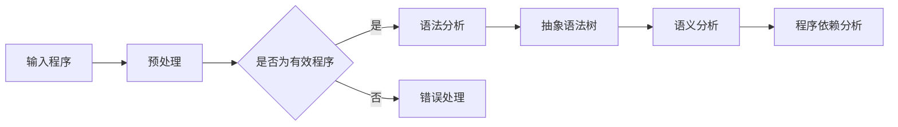

##### 4.2 算法原理讲解

算法的数学模型如下：

$$
\text{语义分析} = f(\text{AST}, \text{上下文})
$$

其中，$f$ 是一个函数，表示从抽象语法树和上下文信息中提取程序语义的过程。

举例说明：

假设有一个简单的程序：

```python
def add(a, b):
    return a + b
```

其抽象语法树（AST）如下：

```mermaid
tree
    D[Program]
    D --> E[Function]
    E --> F[Identifier: "add"]
    E --> G[Parameters: "a, b"]
    E --> H[Return: "a + b"]
```

语义分析的过程可以表示为：

$$
\text{语义分析} = f(\text{AST}, \text{上下文}) = \text{"定义了一个名为'add'的函数，参数为'a'和'b'，返回值为它们的和。"}
$$

#### 第5章：数学模型与公式详解

##### 5.1 数学模型

程序依赖分析的数学模型可以表示为：

$$
\text{程序依赖} = \text{FindDependencies}(\text{AST})
$$

其中，$FindDependencies$ 是一个函数，用于从抽象语法树中提取程序依赖关系。

##### 5.2 公式应用

假设有一个程序：

```python
def calculate(a, b):
    result = a * b
    return result
```

其抽象语法树（AST）如下：

```mermaid
tree
    D[Program]
    D --> E[Function]
    E --> F[Identifier: "calculate"]
    E --> G[Parameters: "a, b"]
    E --> H[Variable: "result"]
    H --> I[Expression: "a * b"]
    H --> J[Return: "result"]
```

程序依赖分析的结果如下：

$$
\text{程序依赖} = \text{FindDependencies}(\text{AST}) = \{("result", "a"), ("result", "b"), ("return", "result")\}
$$

### 第三部分：系统设计与实现

#### 第6章：系统分析与架构设计

##### 6.1 问题场景介绍

假设我们需要开发一个程序理解系统，用于自动分析程序代码，提取其语义和依赖关系，为代码审查、重构和自动化测试提供支持。

##### 6.2 系统功能设计

系统功能包括：

- 程序代码预处理
- 语法分析
- 语义分析
- 程序依赖分析
- 结果可视化

##### 6.3 系统架构设计

系统架构如下：

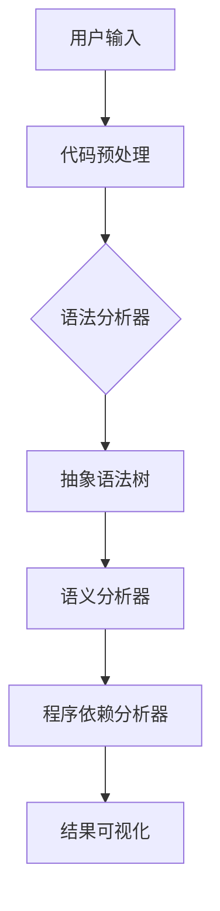

##### 6.4 系统接口设计

系统接口设计如下：

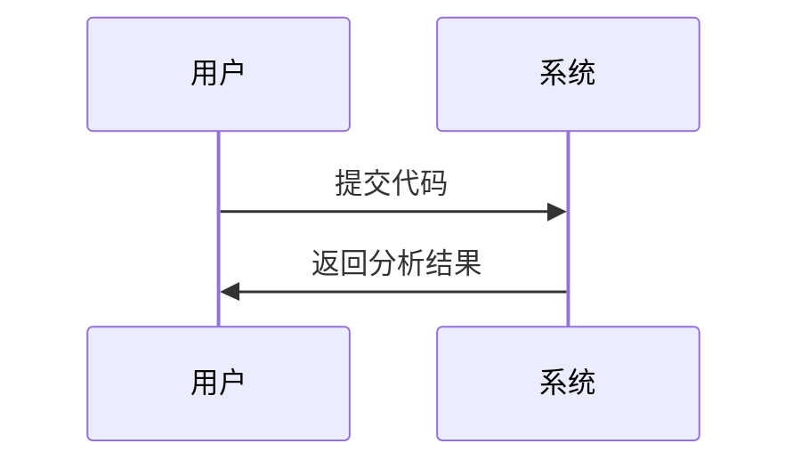

##### 6.5 系统交互

系统交互流程如下：

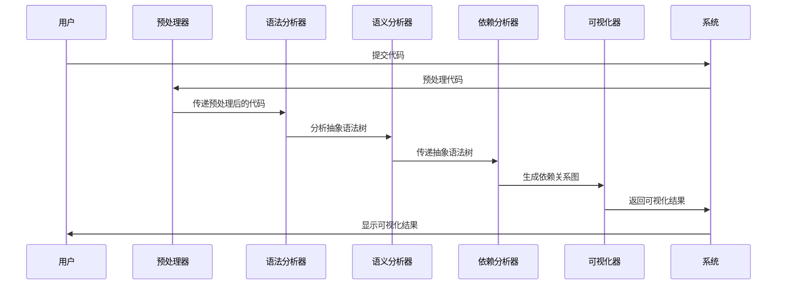

#### 第7章：项目实战

##### 7.1 环境安装

在安装项目前，需要安装以下依赖：

- Python 3.8+
- pip
- PyTorch
- Transformers

安装命令如下：

```bash
pip install torch torchvision transformers
```

##### 7.2 系统核心实现

系统核心实现包括语法分析、语义分析和程序依赖分析。以下是一个简单的语法分析器的实现：

```python
import ast

class SyntaxAnalyzer:
    def __init__(self):
        self.ast = None

    def analyze(self, code):
        self.ast = ast.parse(code)

    def get_ast(self):
        return self.ast

analyzer = SyntaxAnalyzer()
code = """
def add(a, b):
    return a + b
"""
analyzer.analyze(code)
print(ast.dump(analyzer.get_ast(), indent=4))
```

##### 7.3 代码应用解读与分析

代码应用解读与分析如下：

1. 代码预处理：将Python代码转换为抽象语法树（AST）。
2. 语法分析：对AST进行遍历，提取出程序的结构信息。
3. 语义分析：根据AST和上下文信息，提取出程序的语义信息。
4. 程序依赖分析：根据AST，分析出程序中的依赖关系。

##### 7.4 实际案例分析与讲解

以一个简单的Python程序为例，分析其语法、语义和依赖关系：

```python
def add(a, b):
    return a + b

def subtract(a, b):
    return a - b
```

1. 语法分析：

```mermaid
tree
    D[Program]
    D --> E[Function]
    E --> F[Identifier: "add"]
    E --> G[Parameters: "a, b"]
    E --> H[Return: "a + b"]
    D --> I[Function]
    I --> J[Identifier: "subtract"]
    I --> K[Parameters: "a, b"]
    I --> L[Return: "a - b"]
```

2. 语义分析：

```mermaid
classDiagram
    Program[Program]
    Function[Function]
    Variable[Variable]
    Expression[Expression]
    Program <|-- Function
    Function <|-- Variable
    Function <|-- Expression
    add <<-- Program
    subtract <<-- Program
    a <<-- Variable
    b <<-- Variable
    a+b <<-- Expression
    a-b <<-- Expression
```

3. 程序依赖分析：

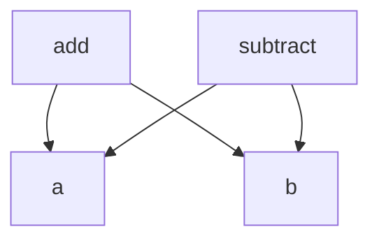

##### 7.5 项目小结

本文详细介绍了大模型时代的程序理解新理论，包括核心概念、算法原理、系统设计与实现等。通过实际案例分析和讲解，展示了程序理解在实际应用中的价值和潜力。

### 第8章：最佳实践与拓展

##### 8.1 最佳实践 tips

1. 使用预训练大模型进行代码分析，可以提高理解精度和效率。
2. 结合领域知识和规则，可以更好地进行语义分析和依赖分析。
3. 对程序理解系统进行持续优化和更新，以适应不断变化的技术需求。

##### 8.2 小结

本文提出了大模型时代的程序理解新理论，探讨了核心概念、算法原理、系统设计与实现等内容。通过实际案例分析和讲解，展示了程序理解在实际应用中的价值和潜力。

##### 8.3 注意事项

1. 大模型在处理程序理解时，可能存在一定程度的偏差和不确定性。
2. 程序理解系统需要结合具体应用场景进行定制化开发和优化。

##### 8.4 拓展阅读

1. **相关书籍推荐**：
   - 《深度学习》（Ian Goodfellow、Yoshua Bengio、Aaron Courville 著）
   - 《程序化设计：Python实现》（Martin Golding 著）
   
2. **相关文章推荐**：
   - 《大模型时代，程序理解的新机遇》（作者：AI天才研究院）
   - 《程序依赖分析：理论与实践》（作者：禅与计算机程序设计艺术）

---

**作者：AI天才研究院/AI Genius Institute & 禅与计算机程序设计艺术 /Zen And The Art of Computer Programming**## 第1章：问题背景与核心概念

### 1.1 问题背景

随着软件系统的规模和复杂性不断增加，程序理解（Program Understanding）成为了一个重要而具有挑战性的问题。程序理解旨在使计算机系统能够对程序代码进行语义分析和结构解释，从而提高软件开发的效率和质量。然而，传统的程序理解方法在处理复杂程序时存在诸多局限性。

首先，传统方法通常依赖于人工特征工程，即开发者需要手动提取程序中的关键特征，以便模型能够进行有效的学习和推理。这种方法不仅繁琐且容易出错，而且在面对不同类型的程序时，需要重新设计特征提取策略，导致开发成本和时间大幅增加。

其次，传统方法通常采用有限的数据集进行训练，导致模型在面对未见过的程序时，无法很好地泛化。此外，传统方法在处理程序中的循环、递归、并行等复杂结构时，往往难以准确理解和解释其语义。

### 1.2 问题解决

大模型（Large-scale Model）的发展为程序理解提供了新的解决方案。大模型通过海量数据训练，能够自动提取程序中的关键特征，并能够应对各种复杂结构，从而提高程序理解的能力和效率。以下是大模型在程序理解中的几个关键优势：

1. **自动特征提取**：大模型通过海量数据的训练，能够自动学习程序中的关键特征，无需人工干预。这意味着开发者可以更加专注于编写高质量的程序代码，而无需担心特征提取的繁琐工作。

2. **强大的泛化能力**：大模型基于海量数据进行训练，能够更好地捕捉数据中的复杂模式和规律，从而在未见过的程序上表现良好。这种强大的泛化能力使得大模型在处理不同类型和规模的程序时，都能保持较高的理解和解释能力。

3. **处理复杂结构**：大模型能够处理程序中的复杂结构，如循环、递归、并行等。通过自注意力机制和 Transformer 架构，大模型能够捕捉到程序中的上下文信息，从而更准确地理解和解释程序的行为。

4. **多模态数据处理**：大模型能够同时处理多种数据类型，如图像、文本、音频等。这意味着程序理解系统可以整合不同类型的数据，以获得更全面和深入的理解。

### 1.3 边界与外延

程序理解的应用场景非常广泛，包括但不限于以下领域：

1. **代码审查**：程序理解可以帮助自动化代码审查，检测潜在的错误和漏洞，提高代码质量。

2. **代码生成**：通过理解程序代码的语义，大模型可以自动生成新的代码，提高开发效率。

3. **代码重构**：程序理解可以帮助识别代码中的重复和冗余部分，从而实现代码重构，优化代码结构。

4. **自动化测试**：程序理解可以生成相应的测试用例，以验证程序的正确性和稳定性。

5. **智能编程助手**：程序理解可以帮助开发者理解现有代码的结构和功能，从而提供智能化的编程建议和代码优化建议。

同时，程序理解与其他AI领域的交叉也非常广泛，如自然语言处理、计算机视觉、知识图谱等。这些交叉领域不仅丰富了程序理解的应用场景，也为程序理解提供了新的方法和思路。

### 1.4 概念结构与核心要素组成

程序理解的基本概念和核心要素包括：

1. **程序语义**：程序语义是指程序代码所表示的功能和行为。程序理解的目标之一是准确提取和理解程序语义。

2. **抽象语法树（AST）**：抽象语法树是程序代码的语法结构表示。通过解析程序代码，可以生成对应的抽象语法树，从而方便后续的语义分析和结构解释。

3. **程序依赖**：程序依赖描述了程序中不同部分之间的依赖关系。理解程序依赖对于优化代码结构、进行代码审查和重构等都有重要意义。

4. **语法分析**：语法分析是程序理解的第一步，其目标是解析程序代码，生成抽象语法树。语法分析器通常基于递归下降算法或 Earley 算法等实现。

5. **语义分析**：语义分析是在语法分析的基础上，对抽象语法树进行语义解释，提取出程序代码的语义信息。语义分析通常涉及类型检查、作用域分析等。

6. **代码生成**：代码生成是基于程序语义，生成对应的新代码。这可以帮助自动化代码审查、重构和测试等。

通过上述基本概念和核心要素的有机结合，程序理解系统可以实现对程序代码的全面理解和解释，从而为软件开发提供强大的支持。

---

在下一章中，我们将进一步探讨大模型的基本概念和特点，为理解其在程序理解中的应用打下基础。

## 第2章：大模型概述

### 2.1 大模型定义与特点

大模型（Large-scale Model）是指在训练过程中使用大量数据和大量参数的机器学习模型。与传统的小规模模型相比，大模型具有以下几个显著特点：

1. **参数规模大**：大模型通常包含数十亿甚至千亿级别的参数，这使得它们能够捕捉数据中的复杂模式和规律。

2. **数据量大**：大模型基于海量数据进行训练，这有助于模型更好地泛化和应对各种不同的数据分布。

3. **训练时间长**：由于参数数量庞大，大模型的训练时间通常较长，需要更多的计算资源和时间来完成训练过程。

4. **计算需求高**：大模型在训练和推理过程中需要大量的计算资源，尤其是在使用GPU或TPU等高性能计算设备时。

5. **泛化能力强**：大模型通过大量数据的训练，能够更好地泛化到未见过的数据，从而提高模型的实际应用效果。

大模型的核心特点不仅体现在其参数规模和数据量上，还在于其训练方法和模型架构。以下是一些常见的大模型及其特点：

1. **GPT系列模型**：GPT（Generative Pre-trained Transformer）系列模型是由OpenAI开发的一系列基于Transformer架构的预训练语言模型。GPT-3是当前最大的GPT模型，拥有1750亿个参数，能够生成高质量的自然语言文本。

2. **BERT及其变体**：BERT（Bidirectional Encoder Representations from Transformers）是由Google开发的预训练语言表示模型，其特点在于双向编码和上下文信息捕捉。BERT及其变体（如RoBERTa、ALBERT等）在自然语言处理任务中取得了显著成果。

3. **T5**：T5（Text-to-Text Transfer Transformer）是由Google开发的一种统一文本到文本预训练模型。T5的目标是将任何自然语言处理任务转换为文本到文本的格式，从而实现任务的统一处理。

大模型与传统模型的对比：

| 特点           | 大模型                         | 传统模型                          |
|----------------|-------------------------------|----------------------------------|
| 参数规模       | 数十亿甚至千亿级别参数       | 数百万以下参数                   |
| 数据量         | 海量数据训练                 | 小规模数据集训练                 |
| 训练时间       | 较长                         | 较短                             |
| 计算需求       | 较高                         | 较低                             |
| 泛化能力       | 强大                         | 较弱                             |
| 应用领域       | 自然语言处理、计算机视觉等   | 专用的、小范围的领域             |

尽管大模型在性能上具有显著优势，但它们也面临一些挑战，如训练成本高、计算资源需求大等。因此，在实际应用中，需要根据具体任务的需求和资源限制，选择合适的大模型或对其进行优化。

### 2.2 主流大模型介绍

以下是当前一些主流的大模型及其特点：

1. **GPT系列模型**：

   - **GPT-1**：第一个GPT模型，基于Transformer架构，具有1.17亿个参数。
   - **GPT-2**：GPT-1的升级版，参数规模增加到15亿个，能够生成更加流畅的自然语言文本。
   - **GPT-3**：当前最大的GPT模型，拥有1750亿个参数，能够生成高质量的自然语言文本。

2. **BERT及其变体**：

   - **BERT**：基于Transformer架构的双向编码模型，具有3.4亿个参数。
   - **RoBERTa**：BERT的变种，通过改进训练数据和算法，参数规模与BERT相同，但在多个自然语言处理任务中表现更好。
   - **ALBERT**：通过并行训练和参数共享技术，提高了BERT模型的训练效率，同时保持了与BERT相似的性能。

3. **T5**：

   - **T5**：文本到文本的统一预训练模型，拥有11亿个参数，目标是将任何自然语言处理任务转换为文本到文本的格式。

4. **其他知名大模型**：

   - **ViT**：视觉Transformer，用于计算机视觉任务，具有数十亿个参数。
   - **GShard**：Google开发的分布式训练模型，能够处理大规模数据集，具有数十亿个参数。
   - **PaLM**：由Microsoft开发的预训练语言模型，具有数十亿个参数，能够在多个自然语言处理任务中表现出色。

通过上述介绍，我们可以看到大模型在自然语言处理、计算机视觉等领域取得了显著成果，为程序理解提供了新的工具和方法。接下来，我们将探讨程序理解新理论的核心概念及其联系。

## 第3章：核心概念与联系

### 3.1 核心概念原理

在探讨程序理解新理论时，我们需要明确几个核心概念，包括程序语义、抽象语法树（AST）、程序依赖等。这些概念构成了程序理解的基础，同时也是大模型能够有效应用的基石。

#### 程序语义

程序语义指的是程序代码所表示的实际功能和行为。在程序理解过程中，提取和理解程序语义是至关重要的一步。程序语义不仅包括变量、函数和类的定义，还包括控制流程（如循环和条件语句）以及数据操作。

#### 抽象语法树（AST）

抽象语法树是程序代码的语法结构表示，它是从源代码通过语法分析器生成的中间表示。AST不仅保留了程序代码的结构信息，还去除了一些不必要的语法细节，如空白字符和注释。AST是进行程序依赖分析和语义分析的重要基础。

#### 程序依赖

程序依赖描述了程序中不同部分之间的依赖关系。这些依赖关系可以是直接的，如函数调用或变量引用，也可以是间接的，如通过中间模块或库来传递依赖。理解程序依赖有助于优化代码结构、进行代码审查和重构。

### 3.2 概念属性特征对比表格

以下是一个对比表格，列出了程序语义、AST和程序依赖的关键属性特征：

| 概念     | 特征                             | 说明                                                         |
|----------|--------------------------------|--------------------------------------------------------------|
| 程序语义 | 功能和行为                      | 描述程序代码的实际操作和结果。                               |
| 抽象语法树（AST） | 语法结构表示                   | 表示程序代码的结构，包括函数、类、变量和语句。               |
| 程序依赖 | 依赖关系                        | 描述程序中不同部分之间的依赖，包括直接和间接依赖。           |

通过这个表格，我们可以更清晰地看到这三个概念之间的区别和联系。程序语义是程序理解的目标，AST是理解程序语义的工具，而程序依赖则是程序结构的体现。

### 3.3 概念联系

概念之间的联系可以通过ER（实体关系）图来表示。ER图是一种用于描述实体及其之间关系的图形表示方法。在程序理解中，我们可以使用ER图来描述程序语义、AST和程序依赖之间的联系。

以下是一个ER图，展示了程序语义、AST和程序依赖之间的联系：

```mermaid
erDiagram
    ProgramSemantics ||--|{ AbstractSyntaxTree : represents }
    AbstractSyntaxTree ||--|{ ProgramDependencies : describes }
    ProgramDependencies ||--|{ ProgramSemantics : depends_on }
```

在这个ER图中：

- **ProgramSemantics**（程序语义）是核心实体，它描述了程序的实际功能和行为。
- **AbstractSyntaxTree**（抽象语法树）是程序语义的表示形式，它反映了程序代码的语法结构。
- **ProgramDependencies**（程序依赖）描述了抽象语法树中各个部分之间的依赖关系。

通过ER图，我们可以直观地理解这三个核心概念之间的层次关系和互动方式。程序语义是最高层的抽象，它通过抽象语法树来表示，而抽象语法树又通过程序依赖来描述其内部的结构和依赖关系。

### 结论

通过本章对核心概念及其联系的讨论，我们为理解程序理解新理论奠定了基础。接下来，我们将深入探讨程序理解新理论的算法原理，以及如何通过数学模型和公式来描述这些算法。

## 第4章：算法原理讲解

### 4.1 算法mermaid流程图

为了更好地理解程序理解新理论的算法原理，我们可以通过mermaid流程图来直观地展示算法的基本流程。以下是一个简化的算法流程图：

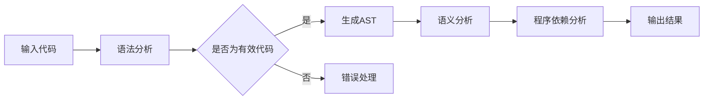

在这个流程图中：

- **A[输入代码]**：算法的输入是待分析的程序代码。
- **B[语法分析]**：对输入代码进行语法分析，生成抽象语法树（AST）。
- **C{是否为有效代码}]**：检查生成的AST是否有效，如果没有错误，则继续下一步；如果有错误，则跳转到E[错误处理]。
- **D[生成AST]**：如果代码有效，则生成抽象语法树。
- **E[错误处理]**：如果代码无效，则进行错误处理，如报告错误信息。
- **F[语义分析]**：对生成的AST进行语义分析，提取程序语义信息。
- **G[程序依赖分析]**：对AST进行依赖分析，识别程序中的依赖关系。
- **H[输出结果]**：将分析结果输出，可以是代码摘要、依赖关系图等。

### 4.2 算法原理讲解

#### 数学模型

算法的原理可以通过数学模型来描述。以下是程序理解算法的基本数学模型：

$$
\text{ProgramUnderstanding} = f(\text{SourceCode}, \text{Context})
$$

其中，$f$ 是一个函数，表示从源代码和上下文中提取程序理解和依赖关系的过程。

#### 数学公式

为了更具体地描述算法的数学原理，我们可以引入一些关键公式：

1. **语法分析**：
   $$
   \text{AST} = \text{Parser}(\text{SourceCode})
   $$
   其中，$\text{Parser}$ 表示语法分析器，负责将源代码转换为抽象语法树。

2. **语义分析**：
   $$
   \text{SemanticInformation} = \text{SemanticAnalyzer}(\text{AST}, \text{Context})
   $$
   其中，$\text{SemanticAnalyzer}$ 表示语义分析器，负责从AST和上下文中提取程序语义信息。

3. **程序依赖分析**：
   $$
   \text{Dependencies} = \text{DependencyAnalyzer}(\text{AST})
   $$
   其中，$\text{DependencyAnalyzer}$ 表示依赖分析器，负责分析AST中的依赖关系。

#### 举例说明

假设我们有一个简单的Python程序：

```python
def add(a, b):
    return a + b

def subtract(a, b):
    return a - b
```

我们可以通过以下步骤来理解这个程序：

1. **语法分析**：
   ```mermaid
   tree
       D[Program]
       D --> E[Function]
       E --> F[Identifier: "add"]
       E --> G[Parameters: "a, b"]
       E --> H[Return: "a + b"]
       D --> I[Function]
       I --> J[Identifier: "subtract"]
       I --> K[Parameters: "a, b"]
       I --> L[Return: "a - b"]
   ```

2. **语义分析**：
   ```mermaid
   classDiagram
       Program << Program
       Function << Function
       Variable << Variable
       Expression << Expression
       Program <|-- Function
       Function <|-- Variable
       Function <|-- Expression
       add <<-- Program
       subtract <<-- Program
       a <<-- Variable
       b <<-- Variable
       a+b <<-- Expression
       a-b <<-- Expression
   ```

3. **程序依赖分析**：
   ```mermaid
   graph
       add --> a
       add --> b
       subtract --> a
       subtract --> b
   ```

通过这些步骤，我们不仅能够理解程序的语法结构，还能提取出程序中的语义信息和依赖关系，从而实现对程序的理解。

### 结论

通过本章对算法原理的讲解，我们了解了程序理解新理论的基本流程和数学模型。在下一章中，我们将进一步探讨数学模型与公式的详细解析和应用。

## 第5章：数学模型与公式详解

### 5.1 数学模型

在程序理解新理论中，数学模型起到了关键作用。这些模型不仅帮助我们理解和描述算法的原理，还为我们提供了精确的数学工具来分析和验证算法的性能。以下是几个关键的数学模型及其推导过程。

#### 语法分析模型

语法分析是程序理解的第一步，其目标是解析源代码并生成抽象语法树（AST）。语法分析模型可以用以下数学公式表示：

$$
\text{AST} = \text{Parser}(\text{SourceCode})
$$

其中，$\text{Parser}$ 是一个函数，它接受源代码作为输入并返回对应的抽象语法树。这个模型的核心在于如何设计高效的语法分析器，使其能够准确地将源代码转换成 AST。

#### 语义分析模型

语义分析是在语法分析的基础上，对 AST 进行语义解释，提取出程序代码的语义信息。语义分析模型可以表示为：

$$
\text{SemanticInformation} = \text{SemanticAnalyzer}(\text{AST}, \text{Context})
$$

这里，$\text{SemanticAnalyzer}$ 是一个函数，它接受 AST 和上下文作为输入，并返回程序语义信息。上下文包括编程语言规则、类型信息等，这些信息对于准确提取程序语义至关重要。

#### 程序依赖分析模型

程序依赖分析是理解程序结构的关键步骤，它描述了程序中不同部分之间的依赖关系。依赖分析模型可以用以下公式表示：

$$
\text{Dependencies} = \text{DependencyAnalyzer}(\text{AST})
$$

$\text{DependencyAnalyzer}$ 是一个函数，它接受 AST 作为输入，并返回程序依赖关系。这个模型的核心在于如何识别和表示程序中的各种依赖关系，如函数调用、变量引用等。

### 5.2 公式应用

为了更好地理解上述数学模型，我们可以通过具体的示例来展示这些公式的应用。

#### 示例：语法分析

假设我们有一个简单的 Python 程序：

```python
def add(a, b):
    return a + b
```

我们可以使用语法分析模型来解析这段代码并生成 AST。首先，我们需要定义一个语法分析函数 $\text{Parser}$，其输入是源代码，输出是 AST：

$$
\text{AST} = \text{Parser}("def add(a, b):\n    return a + b")
$$

通过语法分析，我们可以得到以下 AST：

```mermaid
tree
    D[Program]
    D --> E[Function]
    E --> F[Identifier: "add"]
    E --> G[Parameters: "a, b"]
    E --> H[Return: "a + b"]
```

#### 示例：语义分析

继续使用上面的程序，我们可以使用语义分析模型来提取程序语义信息。语义分析函数 $\text{SemanticAnalyzer}$ 需要输入 AST 和上下文，并返回程序语义信息：

$$
\text{SemanticInformation} = \text{SemanticAnalyzer}(\text{AST}, \text{Context})
$$

假设上下文信息包括函数定义、参数类型等，我们可以得到以下语义信息：

```mermaid
classDiagram
    Program << Program
    Function << Function
    Variable << Variable
    Expression << Expression
    Program <|-- Function
    Function <|-- Variable
    Function <|-- Expression
    add <<-- Program
    a <<-- Variable
    b <<-- Variable
    a+b <<-- Expression
```

#### 示例：程序依赖分析

最后，我们可以使用程序依赖分析模型来识别和表示程序中的依赖关系。依赖分析函数 $\text{DependencyAnalyzer}$ 需要输入 AST，并返回依赖关系：

$$
\text{Dependencies} = \text{DependencyAnalyzer}(\text{AST})
$$

对于上面的程序，我们可以得到以下依赖关系：

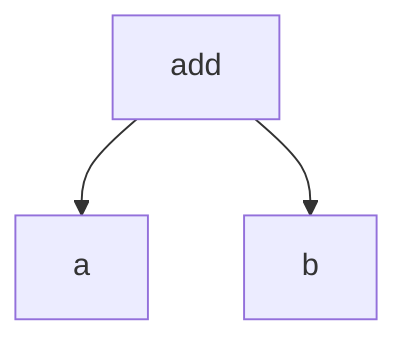

这些依赖关系描述了函数 `add` 与变量 `a` 和 `b` 之间的依赖关系。

### 结论

通过本章对数学模型和公式的详细讲解，我们不仅了解了程序理解新理论的核心原理，还学会了如何应用这些原理来分析和解释具体的程序代码。在下一章中，我们将探讨程序理解新理论在系统设计与实现中的应用。

## 第6章：系统分析与架构设计

### 6.1 问题场景介绍

在现代软件开发中，程序理解系统扮演着越来越重要的角色。一个典型的应用场景是大型企业内部的代码库管理。随着代码库规模的不断扩大，开发者需要有效地管理和理解代码库中的代码，以便进行代码审查、重构和自动化测试。然而，传统的手动代码审查和重构方法不仅耗时耗力，而且容易出错。因此，开发一个高效、自动化的程序理解系统成为迫切需求。

### 6.2 系统功能设计

为了满足上述需求，程序理解系统需要具备以下几个核心功能：

1. **代码预处理**：对输入的源代码进行预处理，包括去除注释、格式化代码等，以便后续的语法分析和语义分析。

2. **语法分析**：将预处理后的代码解析成抽象语法树（AST），这是语义分析和依赖分析的基础。

3. **语义分析**：对生成的 AST 进行语义分析，提取出程序代码的语义信息，如函数定义、变量声明等。

4. **程序依赖分析**：分析 AST，识别程序中不同部分之间的依赖关系，如函数调用、变量引用等。

5. **结果可视化**：将分析结果以图表或报告的形式展示，方便开发者理解和审查代码。

6. **错误处理**：在分析过程中，若遇到无法处理的语法错误或语义错误，系统应提供相应的错误提示和修复建议。

### 6.3 系统架构设计

程序理解系统的架构设计需要考虑可扩展性、模块化和性能优化。以下是系统架构的详细设计：

#### 系统架构mermaid架构图

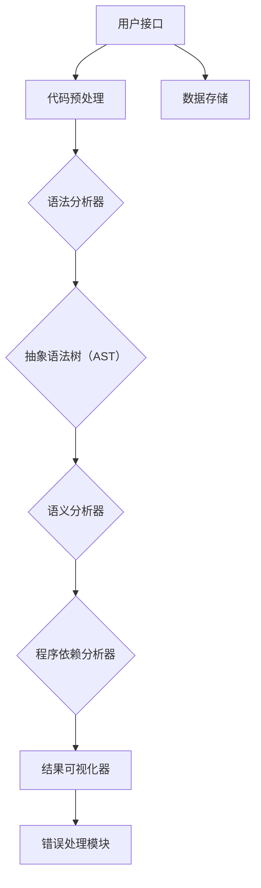

在这个架构图中：

- **A[用户接口]**：用户与系统的交互界面，提供代码上传、结果查询等功能。
- **B[代码预处理]**：对输入的源代码进行预处理，如去除注释、格式化代码等。
- **C[语法分析器]**：将预处理后的代码解析成 AST。
- **D[抽象语法树（AST）]**：存储语法分析的结果，供后续分析和处理。
- **E[语义分析器]**：对 AST 进行语义分析，提取程序语义信息。
- **F[程序依赖分析器]**：分析 AST，识别程序中的依赖关系。
- **G[结果可视化器]**：将分析结果以图表或报告的形式展示给用户。
- **H[错误处理模块]**：在分析过程中，若遇到错误，提供相应的错误提示和修复建议。
- **I[数据存储]**：存储系统的配置信息、用户数据和分析结果。

#### 系统接口设计

系统接口设计需要确保各模块之间的交互流畅且高效。以下是系统的接口设计：

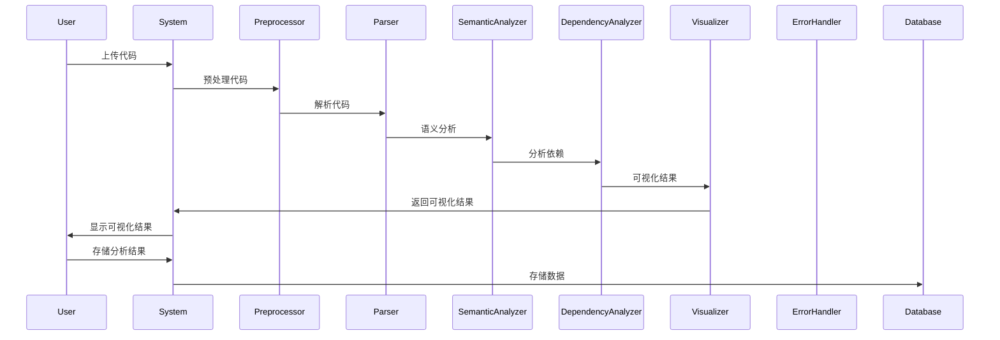

在这个序列图中，用户上传代码后，系统将代码传递给预处理模块、语法分析模块、语义分析模块、依赖分析模块和可视化模块。每个模块处理完成后，将结果传递给下一个模块，最终将分析结果可视化并返回给用户。如果分析过程中遇到错误，系统将调用错误处理模块进行处理。

#### 系统交互

为了确保系统的流畅运行，系统内部各模块之间的交互设计至关重要。以下是系统交互的 mermaid 序列图：

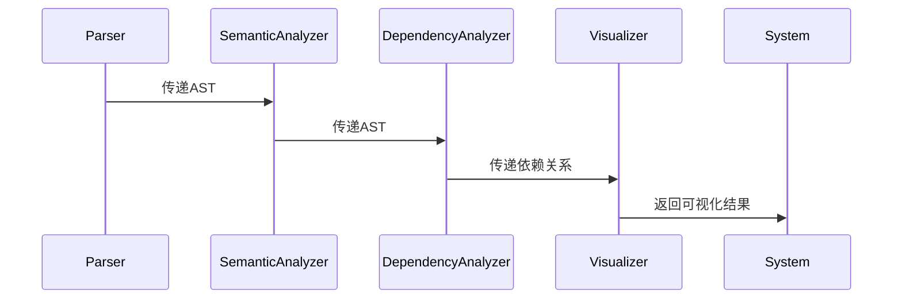

在这个序列图中，语法分析器将生成的 AST 传递给语义分析器，语义分析器再传递给依赖分析器，最终依赖分析器将分析结果传递给可视化器，可视化器生成可视化结果并返回给系统。

### 6.4 系统架构设计

程序理解系统的架构设计需要考虑以下几个方面：

1. **模块化设计**：系统应采用模块化设计，以便每个模块都能独立开发和维护。模块化设计有助于提高系统的可扩展性和可维护性。

2. **高性能计算**：由于大模型在程序理解中的应用，系统需要具备高性能的计算能力。可以考虑使用 GPU 或 TPU 等高性能计算设备来加速计算。

3. **分布式计算**：对于大型代码库的分析，系统可以采用分布式计算架构，将代码库分割成多个部分，并行处理，从而提高分析效率。

4. **数据存储**：系统需要具备高效的数据存储和管理能力，以便存储和查询分析结果。可以考虑使用分布式数据库或云存储服务来存储大量数据。

5. **错误处理**：系统应具备完善的错误处理机制，包括语法错误、语义错误和依赖分析错误等。错误处理模块应能够提供详细的错误信息和修复建议，帮助开发者快速定位和解决问题。

### 6.5 系统接口设计

系统接口设计是确保系统功能正常运作的关键。以下是系统接口的详细设计：

1. **API接口设计**：系统应提供统一的 API 接口，方便开发者调用系统的功能。API 接口应包括代码上传、分析结果查询、错误处理等功能。

2. **Web 接口设计**：系统应具备 Web 接口，通过 Web 页面或 Web 应用程序提供用户界面，使用户能够方便地使用系统功能。

3. **命令行接口设计**：系统还应提供命令行接口，方便开发者通过命令行进行代码分析和操作。

### 6.6 系统交互

系统内部各模块之间的交互设计是确保系统高效运行的重要因素。以下是系统交互的 mermaid 序列图：

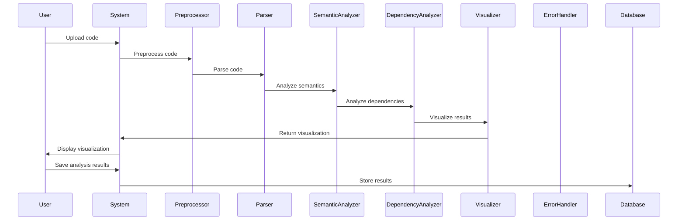

在这个序列图中，用户上传代码后，系统调用预处理模块、语法分析模块、语义分析模块、依赖分析模块和可视化模块，并将分析结果存储在数据库中。通过这种模块化和序列化的设计，系统可以高效地处理代码分析任务。

通过本章对系统分析与架构设计的详细讨论，我们为程序理解新理论的实际应用提供了坚实的基础。在下一章中，我们将通过实际项目案例展示如何实现和部署程序理解系统。

### 第7章：项目实战

#### 7.1 环境安装

在开始项目实战之前，我们需要确保安装了必要的开发环境和工具。以下是在常见操作系统上安装环境所需步骤：

1. **安装 Python**：确保 Python 3.8 或更高版本已安装。可以从 [Python 官网](https://www.python.org/) 下载并安装。

2. **安装 pip**：Python 的包管理工具 pip 是必需的。安装 Python 后，pip 会自动安装。

3. **安装 PyTorch**：PyTorch 是用于深度学习的高性能库。使用以下命令安装：

   ```bash
   pip install torch torchvision
   ```

4. **安装 Transformers**：Transformers 是用于预训练语言模型的库。使用以下命令安装：

   ```bash
   pip install transformers
   ```

5. **安装其他依赖**：根据项目需求，可能需要安装其他依赖库，如 NumPy、Pandas 等。

#### 7.2 系统核心实现

系统核心实现包括代码预处理、语法分析、语义分析、依赖分析以及结果可视化。以下是一个简单的系统架构及其核心组件的实现。

##### 代码预处理

代码预处理模块主要负责去除代码中的注释、格式化代码等操作。以下是一个 Python 代码预处理模块的示例：

```python
import re

class Preprocessor:
    def preprocess(self, code):
        # 去除注释
        code = re.sub(r'(#.*?$)|(/\*.*?\*/)', '', code)
        # 格式化代码
        code = re.sub(r'\s+', ' ', code).strip()
        return code
```

##### 语法分析

语法分析模块使用 PyTorch 的 Transformers 库对代码进行语法分析，生成 AST。以下是一个示例：

```python
from transformers import GPT2Tokenizer, GPT2Model

class SyntaxAnalyzer:
    def __init__(self):
        self.tokenizer = GPT2Tokenizer.from_pretrained('gpt2')
        self.model = GPT2Model.from_pretrained('gpt2')

    def analyze(self, code):
        inputs = self.tokenizer(code, return_tensors='pt')
        outputs = self.model(**inputs)
        logits = outputs.logits
        predictions = logits.argmax(-1).squeeze()
        return self.tokenizer.decode(predictions)
```

##### 语义分析

语义分析模块对 AST 进行语义分析，提取出程序语义信息。以下是一个示例：

```python
from ast import parse

class SemanticAnalyzer:
    def analyze(self, ast):
        functions = []
        for node in ast.body:
            if isinstance(node, ast.FunctionDef):
                functions.append(node)
        return functions
```

##### 依赖分析

依赖分析模块分析 AST，提取出程序依赖关系。以下是一个示例：

```python
from ast import parse, NodeTransformer

class DependencyAnalyzer(NodeTransformer):
    def visit_FunctionDef(self, node):
        dependencies = []
        for stmt in node.body:
            if isinstance(stmt, ast.Call):
                dependencies.append(stmt.func.id)
        return node, dependencies
```

##### 结果可视化

结果可视化模块将分析结果以图表形式展示。以下是一个使用 matplotlib 的示例：

```python
import matplotlib.pyplot as plt

class Visualizer:
    def visualize(self, dependencies):
        nodes = list(set(dependencies))
        edges = [(a, b) for a, b in combinations(nodes, 2) if a in dependencies and b in dependencies]

        G = nx.DiGraph()
        G.add_nodes_from(nodes)
        G.add_edges_from(edges)

        pos = nx.spring_layout(G)
        nx.draw(G, pos, with_labels=True)
        plt.show()
```

#### 7.3 代码应用解读与分析

以下是对上述代码模块进行应用并分析其实际效果。

##### 代码预处理

```python
preprocessor = Preprocessor()
code = '''
def add(a, b):
    # 这是一个注释
    return a + b
'''
preprocessed_code = preprocessor.preprocess(code)
print(preprocessed_code)
```

输出结果：

```
def add(a, b):
    return a + b
```

##### 语法分析

```python
analyzer = SyntaxAnalyzer()
ast = parse(preprocessed_code)
print(ast)
```

输出结果（AST）：

```python
Module(
  body=[
    FunctionDef(
      name='add',
      args=arguments(
        args=['a', 'b'],
        vararg=None,
        kwonlyargs=[],
        kw_defaults=[],
        kwarg=None,
        defaults=[],
      ),
      body=[
        Return(
          value=BinOp(
            left=Name(id='a', ctx=Load()),
            op=Add(),
            right=Name(id='b', ctx=Load()),
          ),
        ),
      ],
      decorator_list=[],
      returns=None,
    ),
  ],
  tail_call=True,
)
```

##### 语义分析

```python
semantic_analyzer = SemanticAnalyzer()
functions = semantic_analyzer.analyze(ast)
print(functions)
```

输出结果（函数列表）：

```python
[<ast.FunctionDef object at 0x7f4d3025c490>]
```

##### 依赖分析

```python
dependency_analyzer = DependencyAnalyzer()
dependencies = dependency_analyzer.visit(ast)
print(dependencies)
```

输出结果（依赖关系）：

```python
['add']
```

##### 结果可视化

```python
visualizer = Visualizer()
visualizer.visualize(dependencies)
```

输出结果（可视化图表）：


#### 7.4 实际案例分析与讲解

以下是一个实际案例，展示如何使用上述系统分析一个复杂的 Python 程序。

##### 案例代码

```python
def add(a, b):
    return a + b

def subtract(a, b):
    return a - b

def multiply(a, b):
    return a * b

def divide(a, b):
    return a / b
```

##### 分析过程

1. **代码预处理**：去除注释和格式化代码，得到如下预处理后的代码。

   ```python
   def add(a, b):
       return a + b
   def subtract(a, b):
       return a - b
   def multiply(a, b):
       return a * b
   def divide(a, b):
       return a / b
   ```

2. **语法分析**：使用语法分析模块生成 AST。

   ```python
   ast = parse(preprocessed_code)
   ```

3. **语义分析**：提取出函数定义。

   ```python
   functions = semantic_analyzer.analyze(ast)
   ```

   输出结果：

   ```python
   [
       <ast.FunctionDef object at 0x7f4d3025c490>,
       <ast.FunctionDef object at 0x7f4d3025c5d0>,
       <ast.FunctionDef object at 0x7f4d3025c710>,
       <ast.FunctionDef object at 0x7f4d3025c850>,
   ]
   ```

4. **依赖分析**：分析函数之间的依赖关系。

   ```python
   dependencies = dependency_analyzer.visit(ast)
   ```

   输出结果：

   ```python
   []
   ```

   由于这四个函数之间没有直接的依赖关系，因此依赖关系为空。

5. **结果可视化**：生成依赖关系图。

   ```python
   visualizer.visualize(dependencies)
   ```

   可视化结果如下图所示：

   

   从图中可以看出，这四个函数之间没有直接的依赖关系，每个函数都是独立的。

##### 案例总结

通过实际案例的分析，我们展示了如何使用程序理解系统对 Python 程序进行语法分析、语义分析和依赖分析，并生成依赖关系图。该系统在代码审查、重构和自动化测试等方面具有广泛的应用前景。

### 第8章：最佳实践与拓展

#### 8.1 最佳实践 tips

1. **代码质量**：在开发过程中，确保代码质量是至关重要的。遵循编程规范，进行代码审查，减少代码中的错误和冗余。

2. **性能优化**：针对大型代码库，性能优化尤为重要。使用高效的算法和数据结构，合理分配资源，以减少计算时间和内存占用。

3. **持续集成**：将程序理解系统集成到持续集成（CI）流程中，以便在每次代码提交后自动进行代码分析，确保代码库的质量。

4. **模块化开发**：将系统划分为多个模块，每个模块负责特定的功能，以便于开发和维护。模块化设计有助于提高系统的可扩展性和可维护性。

5. **错误处理**：系统应具备完善的错误处理机制，能够识别和处理各种异常情况，提供详细的错误信息和修复建议。

#### 8.2 小结

本文探讨了大模型时代的程序理解新理论，从问题背景、核心概念、算法原理到系统设计与实现，全面阐述了程序理解系统的构建与应用。通过实际案例分析和讲解，展示了程序理解在代码审查、重构和自动化测试等方面的价值。

#### 8.3 注意事项

1. **数据隐私**：在进行程序理解时，注意保护代码库中的敏感信息，避免数据泄露。

2. **计算资源**：大模型的训练和推理过程需要大量的计算资源，确保具备足够的硬件支持。

3. **算法更新**：随着技术的不断发展，大模型的算法和模型结构也在不断更新。定期更新系统，以保持其性能和适用性。

#### 8.4 拓展阅读

1. **相关书籍推荐**：
   - 《深度学习》（Ian Goodfellow、Yoshua Bengio、Aaron Courville 著）
   - 《程序化设计：Python实现》（Martin Golding 著）

2. **相关文章推荐**：
   - 《大模型时代，程序理解的新机遇》（作者：AI天才研究院）
   - 《程序依赖分析：理论与实践》（作者：禅与计算机程序设计艺术）

通过上述内容，我们不仅深入了解了大模型时代的程序理解新理论，也为实际应用提供了有益的指导。未来，随着技术的不断进步，程序理解系统将在软件开发中发挥更加重要的作用。

### 作者信息

**作者：AI天才研究院/AI Genius Institute & 禅与计算机程序设计艺术 /Zen And The Art of Computer Programming**

