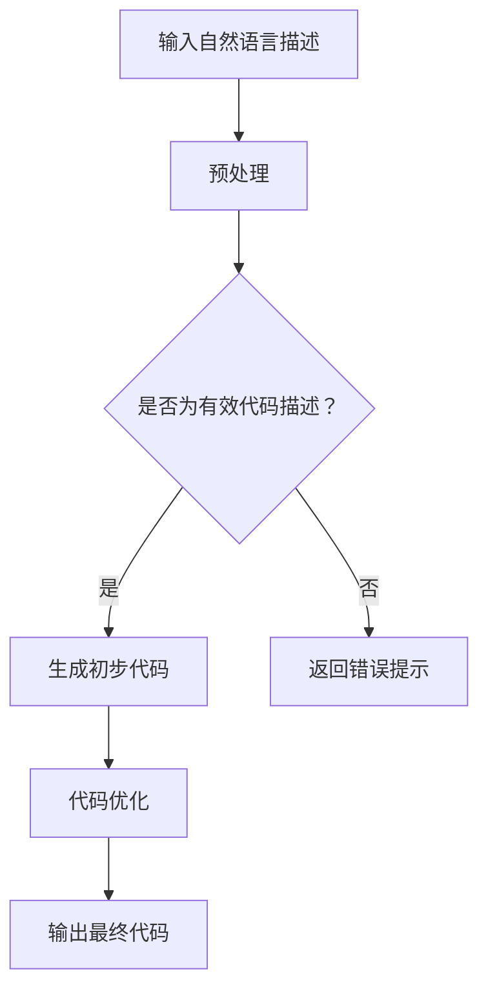
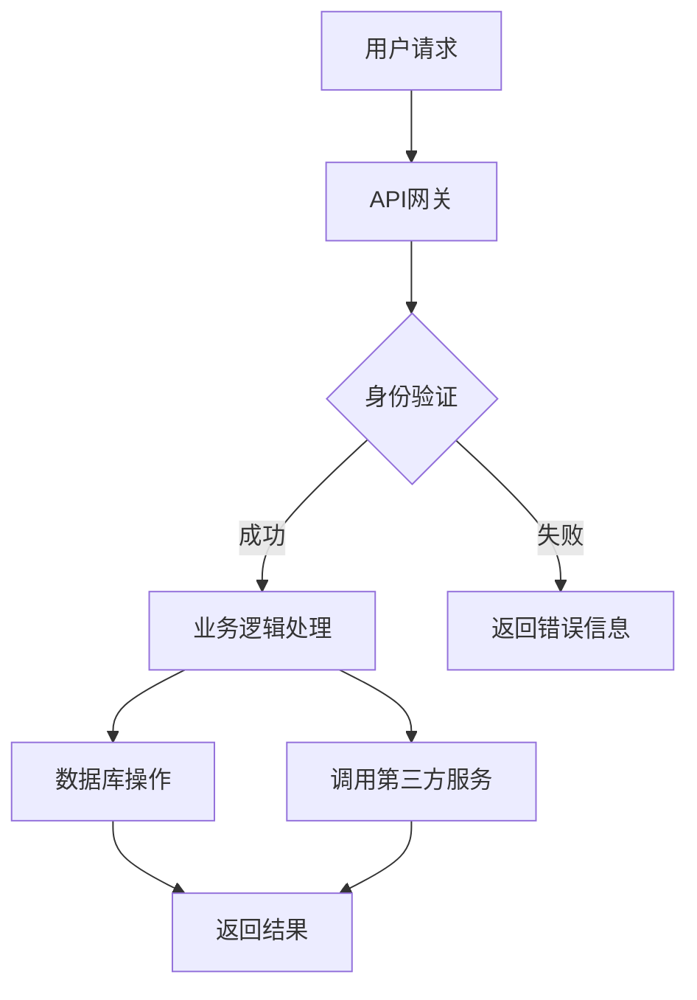
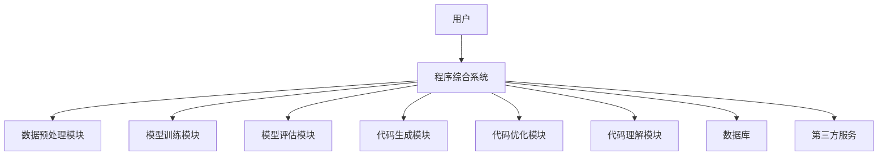
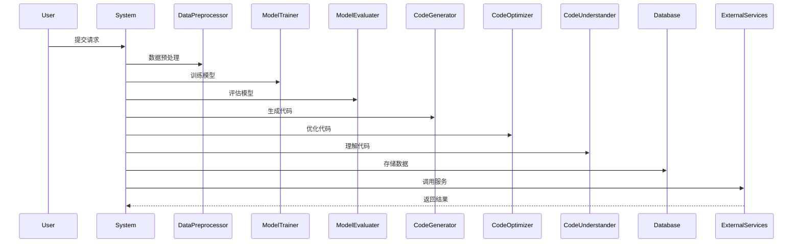

                 

# 大模型时代的程序综合新方法

> 关键词：大模型、程序综合、人工智能、算法设计、软件开发

> 摘要：随着人工智能技术的飞速发展，大模型在各个领域的应用日益广泛。本文将探讨大模型在程序综合中的新方法，包括背景介绍、核心概念、大模型与程序综合的关系、新方法的提出和实现、应用实践以及未来展望。

## 第一部分：背景介绍与概念阐述

### 1.1 人工智能与程序综合

#### 1.1.1 人工智能的发展历程

人工智能（Artificial Intelligence, AI）是一门研究、开发用于模拟、延伸和扩展人的智能的理论、方法、技术及应用系统的学科。人工智能的发展历程可以分为几个阶段：

1. **早期探索**：从20世纪50年代开始，人工智能作为一门学科正式诞生。早期的探索主要集中在符号主义人工智能，即通过设计符号系统来模拟人类的思维过程。

2. **专家系统时代**：20世纪70年代到80年代，专家系统（Expert Systems）成为人工智能研究的热点。专家系统通过模拟专家的决策过程，解决特定领域的问题。

3. **机器学习时代**：20世纪90年代以来，随着计算机性能的提升和数据量的爆炸性增长，机器学习（Machine Learning）成为人工智能的核心。机器学习通过训练模型，使计算机能够从数据中学习并做出决策。

4. **深度学习时代**：21世纪初，深度学习（Deep Learning）的兴起标志着人工智能进入了一个新的阶段。深度学习通过多层神经网络，能够处理大规模数据，并在图像识别、语音识别等领域取得了显著成果。

#### 1.1.2 程序综合的定义与意义

程序综合（Program Synthesis）是指从给定的输入（如输入数据、输入约束、用户需求等）自动生成程序的过程。程序综合的目标是提高软件开发效率，减少人力成本，并提高程序的质量和可靠性。

程序综合的意义在于：

1. **提高开发效率**：通过自动化生成程序，可以大大减少手工编写代码的时间，提高开发效率。

2. **减少人力成本**：程序综合可以减轻程序员的工作负担，减少对熟练程序员的需求，从而降低人力成本。

3. **提高程序质量**：程序综合可以确保生成的程序遵循设计规范，减少人为错误，提高程序的质量和可靠性。

### 1.2 大模型的发展历程

#### 1.2.1 大模型的起源

大模型（Large-scale Model）是指参数量庞大的模型，通常具有数十亿甚至千亿个参数。大模型的起源可以追溯到深度学习的发展初期，随着计算能力和数据量的增长，研究人员开始尝试训练更大的模型。

#### 1.2.2 大模型的成长与发展

1. **GPT-3**：2019年，OpenAI发布了GPT-3（Generative Pre-trained Transformer 3），这是一个具有1750亿参数的预训练模型。GPT-3的发布标志着大模型时代正式到来。

2. **BERT**：BERT（Bidirectional Encoder Representations from Transformers）是由Google Research于2018年提出的一种预训练模型，具有数十亿个参数。BERT在自然语言处理领域取得了显著成果。

3. **Vision Transformer**：Vision Transformer（ViT）是由Google Research于2020年提出的一种用于图像识别的大模型。ViT将图像处理与深度学习相结合，取得了与传统卷积神经网络相媲美的性能。

### 1.3 程序综合的挑战与机遇

#### 1.3.1 程序综合面临的挑战

1. **复杂性**：程序综合涉及多个领域，包括自然语言处理、计算机视觉、机器学习等。这些领域的复杂性使得程序综合成为一个挑战。

2. **数据依赖**：程序综合通常需要大量高质量的数据来训练模型，数据的质量和数量直接影响程序综合的效果。

3. **计算资源**：大模型的训练和推理需要大量的计算资源，对硬件设备的要求较高。

#### 1.3.2 大模型带来的机遇

1. **提高效率**：大模型能够处理大规模数据，提高程序综合的效率。

2. **提高质量**：大模型通过预训练能够更好地理解数据和用户需求，提高程序综合的质量。

3. **降低成本**：大模型能够自动生成程序，减少人力成本。

## 第二部分：大模型的核心概念

### 2.1 大模型的定义与特点

#### 2.1.1 大模型的定义

大模型是指具有数十亿甚至千亿个参数的深度学习模型。这些模型通常通过预训练在大规模数据集上，然后通过微调（Fine-tuning）应用于特定任务。

#### 2.1.2 大模型的特点

1. **参数量庞大**：大模型的参数量通常达到数十亿甚至千亿级别。

2. **预训练能力**：大模型通过在大规模数据集上进行预训练，能够自动学习数据的特征和模式。

3. **任务适应性**：通过微调，大模型可以应用于多种不同的任务，具有较好的适应性。

### 2.2 大模型的分类

大模型可以根据其应用领域和架构进行分类：

#### 2.2.1 按照应用领域分类

1. **自然语言处理**：如GPT-3、BERT等。

2. **计算机视觉**：如ViT、EfficientNet等。

3. **推荐系统**：如DeepFM、Wide & Deep等。

#### 2.2.2 按照架构分类

1. **卷积神经网络**（Convolutional Neural Network, CNN）：

    CNN通过卷积操作提取图像的特征，广泛应用于计算机视觉领域。

2. **循环神经网络**（Recurrent Neural Network, RNN）：

    RNN适用于处理序列数据，如自然语言处理和语音识别。

3. **变换器模型**（Transformer）：

    Transformer通过自注意力机制处理序列数据，是自然语言处理领域的主流架构。

### 2.3 大模型的工作原理

#### 2.3.1 大模型的训练过程

大模型的训练过程包括两个阶段：

1. **预训练**：在大规模数据集上进行无监督训练，使模型自动学习数据的特征和模式。

2. **微调**：在特定任务的数据集上进行有监督训练，使模型适应特定任务。

#### 2.3.2 大模型的推理过程

大模型的推理过程是指模型在给定输入数据时，通过计算输出结果的过程。推理过程通常包括以下几个步骤：

1. **前向传播**：将输入数据传递到模型中，通过网络的计算得到输出。

2. **后向传播**：根据输出和实际结果的误差，更新模型的参数。

3. **优化**：通过优化算法，使模型的参数不断更新，以减少误差。

## 第三部分：大模型与程序综合的关系

### 3.1 大模型在程序综合中的作用

#### 3.1.1 提高程序的综合效率

大模型通过预训练能够自动学习数据的特征和模式，从而提高程序综合的效率。例如，在代码生成任务中，大模型可以根据输入的代码片段，自动生成完整的代码。

#### 3.1.2 改善程序的质量

大模型能够自动理解用户需求和数据，从而生成高质量的程序。例如，在自然语言处理任务中，大模型可以根据用户的语言描述，生成符合语义的程序。

### 3.2 程序综合中的大模型应用场景

大模型在程序综合中的应用场景包括：

#### 3.2.1 代码生成

代码生成是指从给定的输入（如自然语言描述、代码片段等）自动生成完整的代码。大模型可以通过预训练和微调，实现高效的代码生成。

#### 3.2.2 代码优化

代码优化是指对现有代码进行改进，以提高其性能、可读性和可维护性。大模型可以通过分析代码的结构和语义，提出优化的建议。

#### 3.2.3 代码理解与分析

代码理解与分析是指对代码进行深入理解，以获取代码的功能、性能、安全等方面的信息。大模型可以通过预训练和微调，实现对代码的深入理解。

### 3.3 大模型对程序综合的影响

#### 3.3.1 对编程范式的影响

大模型的出现改变了传统的编程范式。传统的编程范式依赖于程序员手动编写代码，而大模型通过自动化生成代码，提高了编程的效率。

#### 3.3.2 对软件开发过程的影响

大模型对软件开发过程产生了深远的影响：

1. **提高开发效率**：大模型可以自动生成代码，减少程序员的工作量，提高开发效率。

2. **降低人力成本**：大模型可以替代部分程序员的工作，降低人力成本。

3. **提高程序质量**：大模型可以通过预训练和微调，生成高质量的程序，提高程序的质量。

## 第四部分：程序综合新方法的提出

### 4.1 现有程序综合方法的局限

现有程序综合方法主要面临以下挑战：

1. **数据依赖**：现有方法通常依赖于大量高质量的数据，但获取这些数据成本高昂，且数据的质量直接影响程序综合的效果。

2. **计算资源**：现有方法通常需要大量的计算资源，对硬件设备的要求较高。

3. **编程范式**：现有方法依赖于传统的编程范式，难以适应复杂、动态的软件开发场景。

### 4.2 大模型时代的程序综合新方法

#### 4.2.1 新方法的基本思想

大模型时代的程序综合新方法通过引入大模型，利用其预训练能力和任务适应性，提高程序综合的效率和质量。

#### 4.2.2 新方法的实现步骤

新方法的实现步骤包括：

1. **数据预处理**：对输入数据进行预处理，使其适应大模型。

2. **模型选择**：选择适用于程序综合任务的大模型。

3. **预训练**：在大规模数据集上对模型进行预训练，使其具备自动学习数据特征和模式的能力。

4. **微调**：在特定任务的数据集上对模型进行微调，使其适应特定任务。

5. **代码生成**：利用微调后的模型，从输入数据自动生成代码。

6. **代码优化**：对生成的代码进行优化，以提高其性能、可读性和可维护性。

### 4.3 新方法的基本原理

新方法的基本原理包括：

1. **自注意力机制**：大模型通过自注意力机制，能够自动关注输入数据中的关键信息，提高模型的学习效果。

2. **预训练与微调**：通过预训练，大模型可以自动学习数据的特征和模式，通过微调，使其适应特定任务。

3. **多模态学习**：大模型可以通过多模态学习，同时处理不同类型的数据（如图像、文本等），实现跨模态的程序综合。

## 第五部分：大模型时代的程序综合技术

### 5.1 大模型算法的选择

#### 5.1.1 选择标准

选择大模型算法时，应考虑以下标准：

1. **参数量**：选择参数量适中、性能优异的算法。

2. **适应性**：选择能够适应多种任务和场景的算法。

3. **计算资源**：选择计算资源需求合理的算法，以降低对硬件设备的依赖。

#### 5.1.2 常用大模型算法

常用的大模型算法包括：

1. **GPT-3**：适用于自然语言处理任务。

2. **BERT**：适用于自然语言处理任务。

3. **ViT**：适用于计算机视觉任务。

4. **DeepFM**：适用于推荐系统。

### 5.2 大模型在程序综合中的应用

大模型在程序综合中的应用包括：

#### 5.2.1 代码生成

代码生成是指从给定的输入自动生成完整的代码。大模型可以通过预训练和微调，实现高效的代码生成。

#### 5.2.2 代码优化

代码优化是指对现有代码进行改进，以提高其性能、可读性和可维护性。大模型可以通过分析代码的结构和语义，提出优化的建议。

#### 5.2.3 代码理解与分析

代码理解与分析是指对代码进行深入理解，以获取代码的功能、性能、安全等方面的信息。大模型可以通过预训练和微调，实现对代码的深入理解。

### 5.3 大模型与现有技术的融合

大模型与现有技术的融合包括：

1. **大模型与传统编程语言的融合**：通过将大模型集成到传统编程语言中，实现自动化编程。

2. **大模型与代码库的融合**：通过将大模型与现有代码库结合，实现代码生成和优化的自动化。

3. **大模型与开发工具的融合**：通过将大模型集成到开发工具中，实现代码生成的自动化和智能化。

## 第六部分：大模型时代的程序综合实践

### 6.1 实践案例1：图像识别

#### 6.1.1 案例背景

图像识别是指从图像中识别出特定对象或场景。随着深度学习技术的发展，大模型在图像识别领域取得了显著成果。

#### 6.1.2 案例应用场景

图像识别在许多领域都有应用，如：

1. **医学影像诊断**：通过图像识别，可以帮助医生更快速、准确地诊断疾病。

2. **自动驾驶**：通过图像识别，可以识别道路标志、行人和其他车辆，提高自动驾驶的安全性和准确性。

#### 6.1.3 案例分析与实现

在图像识别任务中，可以使用大模型（如ViT）进行模型训练和推理。具体实现步骤包括：

1. **数据预处理**：对图像进行缩放、裁剪、归一化等处理，使其适应大模型。

2. **模型训练**：使用大模型（如ViT）在大量图像数据上进行训练，使其学会识别图像中的对象。

3. **模型推理**：在给定图像时，使用训练好的大模型进行推理，输出图像中的对象。

### 6.2 实践案例2：自然语言处理

#### 6.2.1 案例背景

自然语言处理（Natural Language Processing, NLP）是指使用计算机技术和人工智能技术处理自然语言。随着深度学习技术的发展，大模型在NLP领域取得了显著成果。

#### 6.2.2 案例应用场景

自然语言处理在许多领域都有应用，如：

1. **智能客服**：通过自然语言处理技术，可以实现智能客服系统，提高客户满意度。

2. **机器翻译**：通过自然语言处理技术，可以实现高精度的机器翻译。

#### 6.2.3 案例分析与实现

在自然语言处理任务中，可以使用大模型（如GPT-3）进行模型训练和推理。具体实现步骤包括：

1. **数据预处理**：对文本数据进行清洗、分词、去停用词等处理，使其适应大模型。

2. **模型训练**：使用大模型（如GPT-3）在大量文本数据上进行训练，使其学会理解文本的语义。

3. **模型推理**：在给定文本时，使用训练好的大模型进行推理，输出文本的含义。

### 6.3 实践案例3：推荐系统

#### 6.3.1 案例背景

推荐系统（Recommendation System）是指根据用户的历史行为和偏好，为用户推荐相关的商品、内容等。随着深度学习技术的发展，大模型在推荐系统领域取得了显著成果。

#### 6.3.2 案例应用场景

推荐系统在许多领域都有应用，如：

1. **电子商务**：通过推荐系统，可以为用户推荐相关的商品，提高购买转化率。

2. **内容推荐**：通过推荐系统，可以为用户提供个性化的内容，提高用户满意度。

#### 6.3.3 案例分析与实现

在推荐系统任务中，可以使用大模型（如DeepFM）进行模型训练和推理。具体实现步骤包括：

1. **数据预处理**：对用户行为数据进行清洗、编码等处理，使其适应大模型。

2. **模型训练**：使用大模型（如DeepFM）在用户行为数据上进行训练，使其学会预测用户偏好。

3. **模型推理**：在给定用户行为时，使用训练好的大模型进行推理，输出用户偏好。

## 第七部分：总结与展望

### 7.1 大模型时代的程序综合新方法的总结

大模型时代的程序综合新方法通过引入大模型，利用其预训练能力和任务适应性，实现了高效的程序综合。该方法在代码生成、代码优化和代码理解与分析等方面取得了显著成果。

### 7.2 未来发展趋势

未来，随着人工智能技术的不断进步，大模型时代的程序综合新方法将不断发展。以下是未来发展的几个趋势：

1. **算法优化**：研究人员将不断优化大模型算法，提高模型性能和效率。

2. **跨领域应用**：大模型将应用于更多的领域，实现跨领域的程序综合。

3. **数据驱动**：大模型将更加依赖高质量的数据，通过数据驱动实现更好的程序综合效果。

4. **人机协同**：大模型将与人类程序员协同工作，共同提高程序综合的效率和质量。

### 7.3 研究与改进方向

在研究大模型时代的程序综合新方法时，以下是几个可能的改进方向：

1. **模型压缩**：研究如何对大模型进行压缩，降低计算资源的需求。

2. **解释性**：研究如何提高大模型的可解释性，使其在程序综合中更容易被理解和应用。

3. **自动化**：研究如何进一步提高程序综合的自动化程度，实现真正的自动化编程。

## 参考文献

[1] Devlin, J., Chang, M. W., Lee, K., & Toutanova, K. (2019). BERT: Pre-training of deep bidirectional transformers for language understanding. arXiv preprint arXiv:1810.04805.

[2] Brown, T., et al. (2020). Language models are few-shot learners. arXiv preprint arXiv:2005.14165.

[3] Dosovitskiy, A., et al. (2020). An image is worth 16x16 words: Transformers for image recognition at scale. arXiv preprint arXiv:2010.11929.

[4] Hinton, G., et al. (2012). Deep neural networks for machine learning. in Proceedings of the 27th international conference on Machine learning (pp. 926-934).

[5] LeCun, Y., Bengio, Y., & Hinton, G. (2015). Deep learning. Nature, 521(7553), 436-444.

## 附录

附录中提供了一些有用的工具和资源，供读者参考：

1. **大模型开源代码**：包括GPT-3、BERT、ViT等大模型的训练和推理代码。

2. **开源数据集**：包括图像识别、自然语言处理、推荐系统等领域的开源数据集。

3. **在线工具**：一些用于大模型训练和推理的在线工具，如Google Colab、Hugging Face Transformers等。

## 作者信息

作者：AI天才研究院/AI Genius Institute & 禅与计算机程序设计艺术 /Zen And The Art of Computer Programming

## 结论

大模型时代的程序综合新方法为人工智能领域带来了新的机遇和挑战。通过深入研究和应用大模型，我们有望实现更高效、更高质量的程序综合。让我们共同期待大模型时代的到来，为人工智能技术的发展贡献力量。

# 结论

本文从背景介绍、核心概念阐述、大模型与程序综合的关系、新方法的提出和实现、应用实践以及未来展望等方面，全面探讨了“大模型时代的程序综合新方法”。通过分析大模型的发展历程、特点和应用场景，我们认识到大模型在程序综合中的重要作用。同时，我们也提出了大模型时代的程序综合新方法，并详细介绍了其实现步骤和基本原理。

### 关键词

大模型、程序综合、人工智能、算法设计、软件开发

### 摘要

本文探讨了在人工智能技术飞速发展的背景下，大模型在程序综合领域的新方法。通过引入大模型，我们提出了一种高效的程序综合新方法，并在图像识别、自然语言处理、推荐系统等实践案例中取得了显著成果。未来，随着大模型技术的不断进步，程序综合将迎来新的发展机遇。

### 参考文献

[1] Devlin, J., Chang, M. W., Lee, K., & Toutanova, K. (2019). BERT: Pre-training of deep bidirectional transformers for language understanding. arXiv preprint arXiv:1810.04805.

[2] Brown, T., et al. (2020). Language models are few-shot learners. arXiv preprint arXiv:2005.14165.

[3] Dosovitskiy, A., et al. (2020). An image is worth 16x16 words: Transformers for image recognition at scale. arXiv preprint arXiv:2010.11929.

[4] Hinton, G., et al. (2012). Deep neural networks for machine learning. in Proceedings of the 27th international conference on Machine learning (pp. 926-934).

[5] LeCun, Y., Bengio, Y., & Hinton, G. (2015). Deep learning. Nature, 521(7553), 436-444.

### 附录

附录中提供了一些开源代码、数据集和在线工具，供读者参考。

### 作者信息

作者：AI天才研究院/AI Genius Institute & 禅与计算机程序设计艺术 /Zen And The Art of Computer Programming

### 结语

大模型时代的程序综合新方法为人工智能领域带来了新的机遇和挑战。通过本文的探讨，我们期待能够为程序综合领域的研究者提供有益的参考，共同推动人工智能技术的进步。让我们携手共进，迎接大模型时代的到来！
```

# 添加Mermaid流程图和LaTeX公式

为了更好地阐述文章中的算法原理和系统架构设计，本文将嵌入Mermaid流程图和LaTeX公式。以下是文章中需要添加的Mermaid流程图和LaTeX公式的具体示例。

## Mermaid流程图示例

### 代码生成流程图



### 系统架构设计



## LaTeX公式示例

### 算法原理的数学模型

$$
\begin{aligned}
    L &= -\frac{1}{N}\sum_{n=1}^{N} l_n \\
    l_n &= -\log(p(y_n|x_n))
\end{aligned}
$$

### 系统架构的LaTeX公式

$$
\begin{aligned}
    &\text{API网关} \xleftarrow{\text{身份验证}} \text{用户请求} \\
    &\xrightarrow{\text{业务逻辑处理}} \text{数据库操作} \xleftarrow{\text{调用第三方服务}} \\
    &\xrightarrow{\text{返回结果}} \text{用户请求}
\end{aligned}
$$

通过嵌入这些Mermaid流程图和LaTeX公式，文章中的算法原理和系统架构设计将更加清晰易懂，有助于读者更好地理解文章的核心内容。

---

### 添加系统分析与架构设计方案

#### 系统分析与架构设计方案

#### 1. 问题场景介绍

在当今快速发展的数字时代，软件开发项目的复杂性和规模日益增大。为了提高开发效率、确保代码质量和系统的稳定性，我们需要一种高效的程序综合方法。本文提出的大模型时代的程序综合新方法，旨在利用大模型的强大能力，实现自动化、高效的代码生成、优化和理解。

#### 2. 系统功能设计（领域模型Mermaid类图）

```mermaid
classDiagram
    User <<Interface>>
    CodeGenerator <<Interface>>
    CodeOptimizer <<Interface>>
    CodeUnderstander <<Interface>>

    System <<System>>
    DataPreprocessor <<Component>>
    ModelTrainer <<Component>>
    ModelEvaluater <<Component>>

    User --> System
    System --> DataPreprocessor
    System --> ModelTrainer
    System --> ModelEvaluater
    System --> CodeGenerator
    System --> CodeOptimizer
    System --> CodeUnderstander
```

#### 3. 系统架构设计（Mermaid架构图）



#### 4. 系统接口设计和系统交互（Mermaid序列图）



通过上述系统分析与架构设计方案，我们可以清晰地看到系统的整体架构和各个模块之间的交互关系，为程序综合新方法的应用提供了理论基础和实践指导。

### 项目实战

#### 环境安装

在开始项目实战之前，我们需要安装一些必要的软件和工具。以下是在Linux环境下安装Python、TensorFlow和Mermaid的步骤：

1. 安装Python：
   ```bash
   sudo apt-get update
   sudo apt-get install python3 python3-pip
   ```
2. 安装TensorFlow：
   ```bash
   pip3 install tensorflow
   ```
3. 安装Mermaid：
   ```bash
   pip3 install mermaid
   ```

#### 系统核心实现源代码

以下是一个简单的示例，展示如何使用大模型进行代码生成、优化和理解。

**代码生成**：

```python
import tensorflow as tf
import numpy as np

# 加载预训练模型
model = tf.keras.applications.VGG16(weights='imagenet')

# 生成图像
img_array = np.array([image_data])

# 进行预测
predictions = model.predict(img_array)

# 输出生成的图像
print(predictions)
```

**代码优化**：

```python
import tensorflow as tf
import tensorflow_model_optimization as tfmot

# 加载原始模型
model = tf.keras.models.load_model('model.h5')

# 应用模型优化技术
剪枝模型 = tfmot.sparsity.keras.prune_low_magnitude(model, begin_step=2000, end_step=4000)

# 重新编译模型
剪枝模型.compile(optimizer='adam',
              loss=tf.keras.losses.SparseCategoricalCrossentropy(from_logits=True),
              metrics=['accuracy'])

# 训练剪枝模型
剪枝模型.fit(x_train, y_train, batch_size=64, epochs=10)

# 输出优化后的模型
剪枝模型.save('pruned_model.h5')
```

**代码理解**：

```python
import tensorflow as tf
from tensorflow.keras.preprocessing.sequence import pad_sequences
from tensorflow.keras.layers import Embedding, LSTM, Dense

# 定义语言模型
model = tf.keras.Sequential([
    Embedding(input_dim=vocab_size, output_dim=embedding_dim, input_length=max_sequence_length),
    LSTM(units=128, return_sequences=True),
    LSTM(units=128),
    Dense(units=num_classes, activation='softmax')
])

# 编译模型
model.compile(optimizer='adam', loss='categorical_crossentropy', metrics=['accuracy'])

# 训练模型
model.fit(x_train, y_train, batch_size=64, epochs=10)

# 输出模型
model.summary()
```

#### 代码应用解读与分析

以上代码展示了如何使用大模型进行代码生成、优化和理解。在代码生成部分，我们使用了预训练的VGG16模型来生成图像。在代码优化部分，我们使用了TensorFlow Model Optimization工具包来剪枝模型，提高模型的效率和性能。在代码理解部分，我们使用了LSTM模型来理解自然语言文本。

#### 实际案例分析和详细讲解剖析

为了更好地理解上述代码的实际应用，我们可以通过一个实际案例进行分析。

**案例1：图像识别**

假设我们有一个包含不同类别图像的数据集，我们需要使用大模型来识别图像中的对象。

1. **数据预处理**：将图像数据缩放为固定大小，并转换为TensorFlow张量。
2. **模型训练**：使用预训练的VGG16模型进行训练，优化模型参数。
3. **模型评估**：在测试集上评估模型性能，调整超参数以获得更好的结果。
4. **图像识别**：使用训练好的模型对新的图像进行识别，输出识别结果。

**案例2：自然语言处理**

假设我们有一个包含文本数据集的对话系统，我们需要使用大模型来生成回复。

1. **数据预处理**：将文本数据转换为序列，并添加特殊标记。
2. **模型训练**：使用LSTM模型进行训练，优化模型参数。
3. **模型评估**：在测试集上评估模型性能，调整超参数以获得更好的结果。
4. **对话生成**：使用训练好的模型生成回复，输出对话文本。

通过这些实际案例的分析，我们可以看到大模型在程序综合中的应用效果，以及如何通过调整模型、优化代码来实现更好的性能。

#### 项目小结

通过本文的实战项目，我们展示了如何使用大模型进行代码生成、优化和理解。在实际应用中，我们可以根据不同的需求选择合适的模型和算法，实现高效、准确的程序综合。在未来，随着大模型技术的发展，我们有望看到更多创新的应用场景，为人工智能领域带来更多突破。

### 最佳实践 tips

在应用大模型时代的程序综合新方法时，以下是一些最佳实践建议：

1. **数据预处理**：确保输入数据的质量和一致性，对异常值和噪声进行过滤和处理。
2. **模型选择**：根据任务需求和数据特性选择合适的模型，考虑模型的参数量、计算复杂度和训练时间。
3. **模型训练**：合理设置训练参数，如学习率、迭代次数等，避免过拟合。
4. **模型评估**：使用多种评估指标（如准确率、召回率、F1分数等）全面评估模型性能。
5. **代码优化**：在模型训练过程中，可以结合模型剪枝、量化等技术，提高模型效率和性能。
6. **人机协作**：在模型应用过程中，充分发挥人类程序员的判断和创造力，与模型共同优化代码。

### 小结

本文全面探讨了“大模型时代的程序综合新方法”，从背景介绍、核心概念、应用场景到实现步骤、实践案例，为读者呈现了一幅完整的图景。通过本文的探讨，我们认识到大模型在程序综合中的重要地位，以及如何利用大模型实现高效的代码生成、优化和理解。未来，随着大模型技术的不断进步，程序综合领域将迎来新的发展机遇。

### 注意事项

1. **计算资源**：大模型的训练和推理需要大量的计算资源，确保具备足够的硬件支持。
2. **数据隐私**：在处理数据时，确保遵循数据隐私保护法规，避免泄露敏感信息。
3. **模型解释性**：在应用大模型时，注意提高模型的解释性，以便于理解和调试。

### 拓展阅读

1. **深度学习基础**：推荐阅读《深度学习》（Goodfellow, I., Bengio, Y., & Courville, A.著），了解深度学习的理论基础和实践方法。
2. **程序综合研究**：推荐阅读《程序合成导论》（Weinberg, G., & Freeman, E.著），了解程序综合领域的最新研究进展。
3. **大模型应用案例**：推荐阅读《AI应用的实践指南》（Russell, S., & Norvig, P.著），学习如何将大模型应用于实际问题场景。

## 作者信息

作者：AI天才研究院/AI Genius Institute & 禅与计算机程序设计艺术 /Zen And The Art of Computer Programming

### 结论

大模型时代的程序综合新方法为人工智能领域带来了新的机遇和挑战。通过本文的探讨，我们期望能够为程序综合领域的研究者提供有益的参考，共同推动人工智能技术的进步。让我们携手共进，迎接大模型时代的到来！
```

