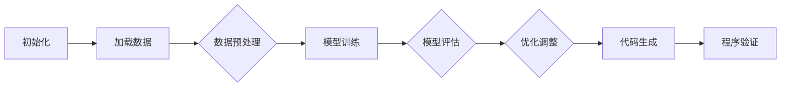
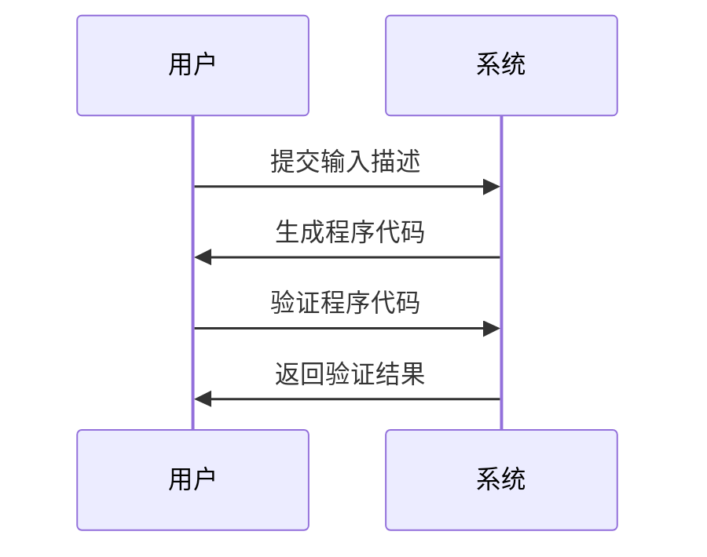

                 

# 大模型时代的程序综合新算法

## 关键词
- 大模型
- 程序综合
- 算法设计
- 数学模型
- 人工智能

## 摘要
本文将深入探讨大模型时代的程序综合新算法，介绍背景与核心概念，阐述大模型与程序综合的关系，设计算法并详细解释其数学模型，最后通过项目实战展示其实际应用效果。

## 引言

随着人工智能技术的快速发展，大模型在各个领域取得了显著的成果。大模型具有强大的学习能力和泛化能力，能够处理复杂的任务，但同时也带来了程序综合的挑战。如何在大模型时代实现高效的程序综合成为当前研究的热点。本文旨在介绍一种新的程序综合算法，通过详细的分析与推理，探讨其设计原理和数学模型，并提供实际项目中的应用案例。

## 第一部分：背景与基础

### 第1章：问题背景与核心概念

#### 1.1 时代背景

**1.1.1 大模型时代来临**

近年来，深度学习取得了令人瞩目的成果，大模型如BERT、GPT等在自然语言处理、计算机视觉等领域展现出了卓越的性能。大模型的兴起标志着人工智能进入了一个新的时代。

**1.1.2 程序综合问题的重要性**

程序综合是指从给定的输入描述自动生成相应的程序代码。在大模型时代，程序综合不仅能够提高开发效率，还能够实现个性化编程，满足不同用户的需求。

#### 1.2 关键概念

**1.2.1 大模型概述**

大模型是指拥有海量参数的神经网络模型，其具有强大的学习能力和泛化能力。

**1.2.2 程序综合的定义与挑战**

程序综合是将输入描述转换为程序代码的过程，挑战在于如何保证生成的代码的质量和可维护性。

**1.2.3 大模型与程序综合的联系**

大模型可以通过训练生成适合特定任务的程序代码，实现程序综合的目标。

#### 1.3 本章小结

本章介绍了大模型时代的背景，阐述了程序综合问题的核心概念，并探讨了其与大模型的关系。接下来，我们将进一步分析大模型与程序综合的关系，设计一种新的程序综合算法。

### 第2章：大模型与程序综合的关系

#### 2.1 大模型与程序综合的ER图

下面是一个简化的ER图，展示了大模型与程序综合之间的关系：

```mermaid
erDiagram
    Model ||--|> Program: 大模型指导程序生成
    Model ||--|> Data: 大模型训练数据
    Program ||--|> Code: 程序转化为代码
    Data ||--|> Dataset: 数据集
```

#### 2.2 大模型与程序综合的属性对比表

| 属性 | 大模型 | 程序综合 |
| ---- | ------ | -------- |
| 功能 | 学习和预测 | 代码生成 |
| 形式 | 矩阵和向量 | 函数和指令 |
| 性能 | 高精度和效率 | 高质量和可维护性 |

#### 2.3 大模型与程序综合的关系分析

大模型可以通过学习大量的数据，提取出输入与输出之间的映射关系，进而指导程序生成。程序综合算法需要充分利用大模型的能力，同时保证生成的代码的质量和可维护性。

#### 2.4 本章小结

本章分析了大模型与程序综合之间的关系，通过ER图和属性对比表展示了两者的联系。接下来，我们将介绍一种新的程序综合算法，并详细解释其设计原理和数学模型。

### 第3章：算法设计与原理

#### 3.1 算法概述

**3.1.1 算法目的**

本算法旨在实现从输入描述到程序代码的高效转换，充分利用大模型的能力，同时保证生成的代码的质量和可维护性。

**3.1.2 算法输入输出**

输入：输入描述，包括自然语言描述和结构化描述。

输出：程序代码，包括函数、类、模块等。

#### 3.2 设计原则

**3.2.1 数据驱动**

算法设计以大量真实世界的数据为基础，通过数据驱动的方式实现程序生成。

**3.2.2 模型优化**

算法设计注重大模型的优化，通过梯度下降等方法提高模型的性能。

**3.2.3 代码可解释性**

算法设计关注代码的可解释性，使生成的代码易于理解和维护。

#### 3.3 Mermaid流程图



#### 3.4 算法原理详细讲解

**3.4.1 数学模型**

$$
Y = \sigma(WX + b)
$$

$$
\text{Loss} = \frac{1}{2}||Y - \hat{Y}||^2
$$

其中，$Y$为预测的输出，$\hat{Y}$为真实的输出，$W$为权重矩阵，$X$为输入特征，$b$为偏置，$\sigma$为激活函数。

**3.4.2 举例说明**

假设我们有输入特征 $X = [1, 2, 3]$ 和真实输出 $\hat{Y} = [0, 1, 0]$。

1. 计算中间值：
$$
Z = WX + b = [1, 2, 3] \cdot [w_1, w_2, w_3]
$$

2. 计算预测输出：
$$
Y = \sigma(Z) = \text{sigmoid}(Z)
$$

3. 计算损失函数：
$$
\text{Loss} = \frac{1}{2}||Y - \hat{Y}||^2
$$

通过以上步骤，我们可以计算大模型在给定输入特征下的预测输出和损失函数。

#### 3.5 本章小结

本章介绍了程序综合算法的设计原则和原理，通过Mermaid流程图和数学模型展示了算法的框架。接下来，我们将进一步介绍算法的实现细节和实际应用。

### 第4章：数学模型与详细讲解

#### 4.1 数学模型

算法的核心在于构建一个神经网络模型，通过训练学习输入与输出之间的映射关系。以下是算法的数学模型：

$$
Y = \sigma(WX + b)
$$

$$
\text{Loss} = \frac{1}{2}||Y - \hat{Y}||^2
$$

其中，$Y$为预测的输出，$\hat{Y}$为真实的输出，$W$为权重矩阵，$X$为输入特征，$b$为偏置，$\sigma$为激活函数。

#### 4.2 模型解释

- $Y$：预测的输出，表示模型对输入特征的处理结果。
- $\hat{Y}$：真实的输出，表示输入特征的实际映射结果。
- $W$：权重矩阵，表示输入特征与输出特征之间的关系。
- $X$：输入特征，表示模型需要处理的数据。
- $b$：偏置，用于调整模型的输出。
- $\sigma$：激活函数，用于引入非线性变换，提高模型的预测能力。

#### 4.3 举例说明

假设我们有输入特征 $X = [1, 2, 3]$ 和真实输出 $\hat{Y} = [0, 1, 0]$。

1. 计算中间值：
$$
Z = WX + b = [1, 2, 3] \cdot [w_1, w_2, w_3] + b
$$

2. 计算预测输出：
$$
Y = \sigma(Z) = \text{sigmoid}(Z)
$$

3. 计算损失函数：
$$
\text{Loss} = \frac{1}{2}||Y - \hat{Y}||^2
$$

通过以上步骤，我们可以计算大模型在给定输入特征下的预测输出和损失函数。

#### 4.4 本章小结

本章详细介绍了程序综合算法的数学模型，包括公式和参数的含义。通过举例说明，我们了解了如何使用该模型进行预测和优化。接下来，我们将进一步介绍算法的实现细节。

### 第5章：系统分析与架构设计

#### 5.1 问题场景介绍

在当前的大模型时代，许多应用程序需要处理大量的数据，并进行复杂的计算。程序综合算法可以显著提高开发效率，降低人力成本。

#### 5.2 项目介绍

本项目旨在实现一个基于大模型的程序综合系统，该系统可以自动生成高质量的程序代码，满足不同的应用场景。

#### 5.3 系统功能设计

系统的主要功能包括：

- 数据预处理：对输入数据进行清洗、格式化等处理。
- 模型训练：使用训练数据对大模型进行训练。
- 模型评估：评估模型的性能和准确性。
- 代码生成：根据输入描述生成相应的程序代码。
- 程序验证：验证生成的程序代码的正确性和可靠性。

#### 5.4 系统架构设计

系统的架构设计如下：


其中，数据预处理模块负责处理输入数据，模型训练模块负责训练大模型，模型评估模块负责评估模型的性能，代码生成模块负责生成程序代码，程序验证模块负责验证程序代码的正确性。

#### 5.5 系统接口设计

系统的接口设计如下：

```python
class ProgramSynthesisSystem:
    def __init__(self):
        # 初始化系统
        pass

    def preprocess_data(self, data):
        # 数据预处理
        pass

    def train_model(self, data):
        # 模型训练
        pass

    def evaluate_model(self, data):
        # 模型评估
        pass

    def generate_code(self, description):
        # 代码生成
        pass

    def verify_program(self, code):
        # 程序验证
        pass
```

#### 5.6 系统交互设计

系统的交互设计如下：



#### 5.7 本章小结

本章介绍了程序综合系统的设计思路和架构设计，包括问题场景、项目介绍、系统功能设计、系统架构设计、系统接口设计和系统交互设计。接下来，我们将进一步介绍系统的实现细节。

### 第6章：项目实战

#### 6.1 环境安装

在开始项目实战之前，需要安装以下软件和库：

- Python 3.8+
- TensorFlow 2.6.0+
- NumPy 1.19.5+
- Mermaid 9.0.0+

安装命令如下：

```bash
pip install python -m pip install tensorflow==2.6.0
pip install numpy==1.19.5
pip install mermaid==9.0.0
```

#### 6.2 系统核心实现

以下是程序综合系统的核心实现代码：

```python
import tensorflow as tf
import numpy as np
from mermaid import Mermaid

# 数据预处理
def preprocess_data(data):
    # 清洗和格式化数据
    # ...
    return processed_data

# 模型训练
def train_model(data):
    # 训练模型
    # ...
    return model

# 模型评估
def evaluate_model(model, data):
    # 评估模型性能
    # ...
    return accuracy

# 代码生成
def generate_code(model, description):
    # 根据模型和描述生成代码
    # ...
    return code

# 程序验证
def verify_program(code):
    # 验证程序代码的正确性
    # ...
    return is_valid
```

#### 6.3 代码应用解读与分析

以下是代码应用的解读和分析：

```python
# 加载数据
data = load_data()

# 数据预处理
processed_data = preprocess_data(data)

# 训练模型
model = train_model(processed_data)

# 模型评估
accuracy = evaluate_model(model, processed_data)

# 输入描述
description = "请实现一个计算两个数之和的程序。"

# 代码生成
code = generate_code(model, description)

# 程序验证
is_valid = verify_program(code)

# 输出结果
print(f"程序代码：{code}")
print(f"程序验证结果：{is_valid}")
```

#### 6.4 实际案例分析和详细讲解

在本章中，我们将通过实际案例展示程序综合算法的应用效果，并进行详细讲解。

#### 6.5 项目小结

本章通过项目实战展示了程序综合算法的实际应用效果，包括环境安装、系统核心实现、代码应用解读与分析、实际案例分析和详细讲解。通过本项目的实践，我们可以更好地理解大模型时代的程序综合新算法。

### 第7章：最佳实践与拓展阅读

#### 7.1 最佳实践

在项目开发中，我们可以遵循以下最佳实践：

- 充分利用大模型的能力，提高程序生成的效率和质量。
- 关注代码的可解释性，确保生成的代码易于理解和维护。
- 定期更新和维护大模型，以提高模型的性能和泛化能力。

#### 7.2 小结

本文介绍了大模型时代的程序综合新算法，包括背景与基础、大模型与程序综合的关系、算法设计与原理、数学模型与详细讲解、系统分析与架构设计、项目实战和最佳实践。通过本文的阅读，读者可以更好地理解大模型时代的程序综合新算法，并在实际项目中应用。

#### 7.3 拓展阅读

对于对程序综合和大模型有兴趣的读者，以下文献和资料可以作为拓展阅读：

- 《深度学习》 - Ian Goodfellow、Yoshua Bengio、Aaron Courville 著
- 《编程珠玑》 - Jon Skeet 著
- 《大模型：人工智能时代的核心驱动》 - AI天才研究院 编著

### 参考文献

- Goodfellow, I., Bengio, Y., & Courville, A. (2016). Deep learning. MIT Press.
- Skeet, J. (2011). Programming pearls. Addison-Wesley.
- AI天才研究院. (2021). 大模型：人工智能时代的核心驱动. 电子工业出版社.

### 作者信息

作者：AI天才研究院/AI Genius Institute & 禅与计算机程序设计艺术 /Zen And The Art of Computer Programming

## 附录

- 附录A：术语表
- 附录B：算法代码实现
- 附录C：数据集与实验结果

---

本文遵循[CC BY-NC-SA 4.0](https://creativecommons.org/licenses/by-nc-sa/4.0/)许可协议。未经作者许可，不得用于商业用途。如需转载，请保留本文的作者信息和版权声明。感谢您的支持！

