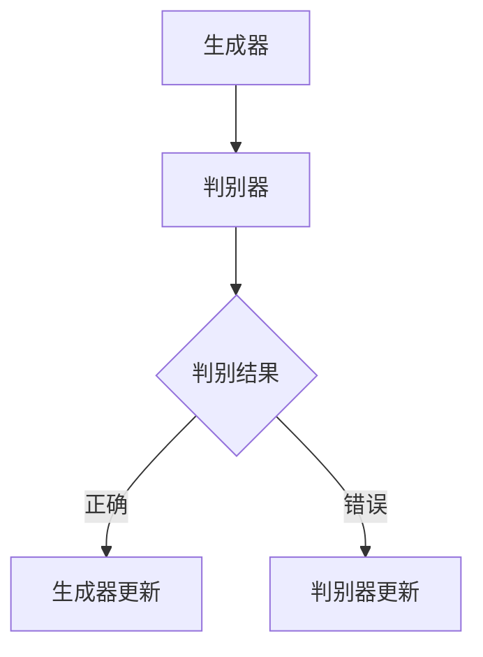
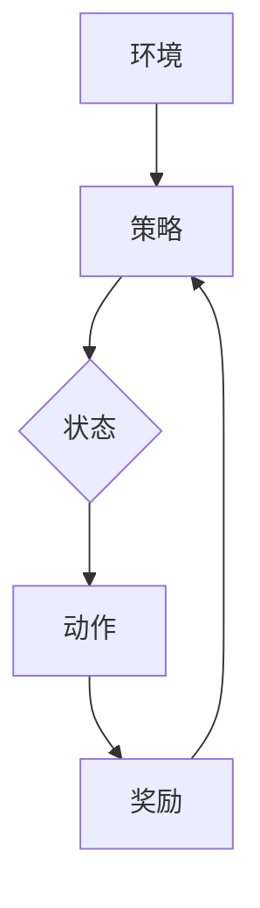
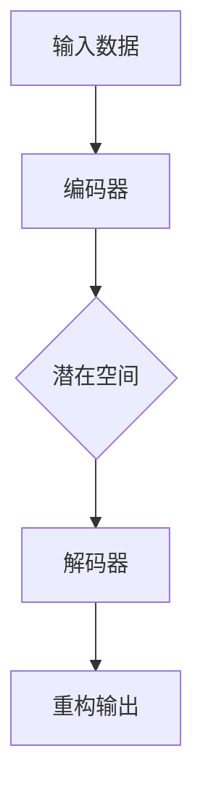
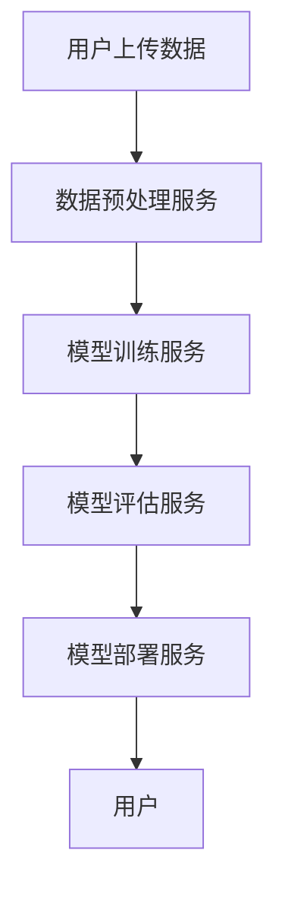

                 

# 《大模型时代的软件开发新思维》

## 关键词
- 大模型
- 软件开发
- 算法原理
- 系统架构设计
- 项目实战

## 摘要
本文旨在探讨大模型时代对软件开发带来的新思维和变革。通过回顾大模型的历史背景和当前发展趋势，深入剖析大模型与软件开发的联系，以及算法原理、系统架构设计和项目实战等方面的内容，本文将帮助读者理解大模型时代软件开发的本质，并提供实践指南和最佳实践建议。

## 引言

### 书籍主题介绍

随着人工智能技术的飞速发展，大模型逐渐成为人工智能领域的研究热点。大模型，即具有巨大参数量和计算能力的人工神经网络模型，其应用范围涵盖了自然语言处理、计算机视觉、推荐系统等多个领域。本文将围绕大模型时代软件开发的创新思维和关键技术进行探讨，旨在为软件开发人员提供全新的视角和实战经验。

### 目标读者定位

本文的目标读者包括对人工智能和软件开发有兴趣的工程师、研究人员，以及想要了解大模型时代软件开发的行业从业者。无论您是初学者还是资深开发者，本文都将为您提供有价值的见解和实用的技巧。

## 第一部分：背景

### 1.1 大模型时代软件开发的历史背景

大模型的发展历程可以追溯到20世纪80年代的神经网络研究，特别是1986年首次提出的反向传播算法。然而，由于计算资源和数据集的限制，早期的大模型研究进展较为缓慢。直到21世纪初，随着深度学习和大数据技术的崛起，大模型才逐渐成为人工智能领域的核心研究方向。

近年来，随着计算能力的提升和数据量的爆炸式增长，大模型在各个领域的应用取得了显著成果。例如，在自然语言处理领域，大模型如BERT、GPT等取得了前所未有的效果；在计算机视觉领域，大模型如ResNet、Inception等大大提高了图像识别和分类的准确率。

### 1.2 当前大模型时代软件开发现状

当前，大模型在软件开发中的应用已经变得十分广泛。开发人员可以利用大模型来实现自动化、智能化的功能，如智能客服、智能推荐、智能翻译等。同时，大模型也为软件开发带来了新的挑战，如模型训练的效率、模型的可解释性、数据隐私保护等问题。

### 1.3 大模型时代软件开发未来趋势

随着技术的不断进步，大模型在软件开发中的应用将更加深入和广泛。未来，大模型有望成为软件开发的核心驱动力，推动软件行业的创新和发展。同时，大模型与云计算、边缘计算等技术的融合也将为软件开发带来新的机遇和挑战。

## 第二部分：核心概念与联系

### 2.1 大模型

#### 2.1.1 大模型的定义

大模型，通常指的是具有数十亿到数千亿参数量的人工神经网络模型。这些模型通过学习海量数据，可以自动提取特征，进行复杂的模式识别和决策。

#### 2.1.2 大模型的核心特点

- **参数量巨大**：大模型的参数数量往往达到数亿甚至千亿级别。
- **计算资源需求高**：训练大模型需要大量的计算资源和存储空间。
- **自适应能力强**：大模型能够自动从数据中学习，适应各种复杂的应用场景。

#### 2.1.3 大模型与传统AI的区别

传统AI模型通常是基于规则或手工程序的，而大模型则是基于数据驱动的方法，能够通过自我学习不断优化。此外，大模型在处理复杂数据和进行多任务学习方面具有显著优势。

### 2.2 软件开发

#### 2.2.1 软件开发的概念

软件开发是指通过编程和系统设计方法，创建和实现计算机程序的过程。软件开发包括需求分析、设计、编码、测试和维护等阶段。

#### 2.2.2 软件开发的方法

软件开发的常见方法包括瀑布模型、迭代开发、敏捷开发等。每种方法都有其优势和适用场景。

#### 2.2.3 软件开发工具与平台

现代软件开发依赖于各种工具和平台，如集成开发环境（IDE）、代码管理工具（如Git）、自动化测试工具等。这些工具和平台大大提高了开发效率和软件质量。

### 2.3 关联性

#### 2.3.1 大模型与软件开发的关系

大模型与软件开发的关系密切，大模型的应用改变了软件开发的模式，使得软件开发更加智能化和自动化。

#### 2.3.2 大模型在软件开发中的应用

大模型在软件开发中的应用主要体现在以下几个方面：

- **自动化编程**：大模型可以通过学习编程语言和代码模式，自动生成代码。
- **智能辅助**：大模型可以辅助开发人员完成代码审查、错误修复、测试等任务。
- **自动化测试**：大模型可以自动生成测试用例，提高测试覆盖率。

#### 2.3.3 大模型与软件开发挑战的应对策略

大模型在软件开发中也面临一些挑战，如模型训练效率、可解释性、数据隐私等。应对策略包括：

- **分布式训练**：通过分布式计算提高模型训练效率。
- **模型压缩**：通过模型压缩技术减小模型体积，提高部署效率。
- **数据隐私保护**：采用加密和去识别化等技术保护用户数据隐私。

## 第三部分：算法原理讲解

### 3.1 算法mermaid流程图

#### 3.1.1 生成对抗网络（GAN）



#### 3.1.2 强化学习



#### 3.1.3 变分自编码器（VAE）



### 3.2 Python源代码

#### 3.2.1 GAN代码示例

```python
# 生成器代码
def generator(z):
    # 编写生成器神经网络代码
    return x_recon

# 判别器代码
def discriminator(x):
    # 编写判别器神经网络代码
    return logits
```

#### 3.2.2 强化学习代码示例

```python
# 状态处理
def state_processor(state):
    # 编写状态处理代码
    return processed_state

# 动作执行
def action_executor(action, state):
    # 编写动作执行代码
    return next_state, reward
```

#### 3.2.3 VAE代码示例

```python
# 编码器代码
def encoder(x):
    # 编写编码器神经网络代码
    return z_mean, z_log_var

# 解码器代码
def decoder(z):
    # 编写解码器神经网络代码
    return x_recon
```

### 3.3 数学模型和公式

#### 3.3.1 GAN的数学模型

GAN的核心模型包括生成器和判别器，分别定义为：

$$
G(z) \rightarrow x_{fake} \quad \text{生成器} \\
D(x) \rightarrow D(x_{real}) \quad \text{判别器}
$$

#### 3.3.2 强化学习的数学模型

强化学习的核心模型包括状态、动作和奖励，分别定义为：

$$
S \rightarrow A \rightarrow R \rightarrow S
$$

#### 3.3.3 VAE的数学模型

VAE的核心模型包括编码器和解码器，分别定义为：

$$
\mu = \mu(x), \quad \log(\sigma) = \log(\sigma(x)) \quad \text{编码器} \\
x' = \phi(\mu, \log(\sigma)) \quad \text{解码器}
$$

### 3.4 实例说明

#### 3.4.1 GAN的应用案例

GAN在图像生成领域有着广泛的应用，例如生成虚假图像、增强图像质量等。一个典型的应用案例是生成逼真的图像，通过以下步骤实现：

1. 生成器生成虚假图像。
2. 判别器判断图像的真伪。
3. 根据判别结果更新生成器和判别器。

#### 3.4.2 强化学习的应用案例

强化学习在游戏AI领域有着成功的应用，例如在围棋、电子竞技等领域。一个典型的应用案例是智能围棋AI，通过以下步骤实现：

1. 环境初始化，生成初始状态。
2. 策略选择动作。
3. 执行动作，获得奖励。
4. 更新策略，循环迭代。

#### 3.4.3 VAE的应用案例

VAE在图像去噪、图像生成和数据压缩等领域有着广泛的应用。一个典型的应用案例是图像去噪，通过以下步骤实现：

1. 编码器对图像进行编码，提取特征。
2. 解码器对编码后的特征进行解码，重构图像。
3. 比较重构图像与原始图像，评估去噪效果。

## 第四部分：系统分析与架构设计方案

### 4.1 系统功能设计

#### 4.1.1 功能需求分析

系统功能需求包括：

- 数据预处理：对输入数据进行清洗、归一化等处理。
- 大模型训练：使用大模型对预处理后的数据集进行训练。
- 模型评估：评估训练后模型的性能，包括准确率、召回率等指标。
- 模型部署：将训练好的模型部署到生产环境中，用于实际应用。

#### 4.1.2 功能实现方案

功能实现方案包括：

- 使用Python和TensorFlow或PyTorch等框架进行大模型训练。
- 使用Docker容器化技术部署模型，实现快速部署和迁移。
- 使用Kubernetes进行模型部署和管理，实现高可用性和弹性扩展。

### 4.2 系统架构设计

#### 4.2.1 架构概述

系统架构设计采用微服务架构，包括数据层、服务层和展现层。

#### 4.2.2 架构模块解析

- **数据层**：负责数据的存储和管理，包括关系型数据库和非关系型数据库。
- **服务层**：包括数据预处理服务、模型训练服务、模型评估服务和模型部署服务。
- **展现层**：提供用户界面，用于展示模型训练和评估结果。

### 4.3 系统接口设计

#### 4.3.1 接口规范

系统接口设计遵循RESTful API规范，包括GET、POST、PUT、DELETE等HTTP方法。

#### 4.3.2 接口实现细节

- 数据预处理接口：接收用户上传的数据，返回预处理后的数据。
- 模型训练接口：接收用户指定的参数，启动模型训练过程，返回训练结果。
- 模型评估接口：接收训练好的模型和测试数据，返回模型评估结果。
- 模型部署接口：接收用户指定的部署环境，部署训练好的模型。

### 4.4 系统交互

#### 4.4.1 系统流程

系统流程包括以下步骤：

1. 用户上传数据。
2. 数据预处理服务接收数据，返回预处理后的数据。
3. 模型训练服务接收预处理后的数据，启动模型训练。
4. 模型评估服务接收训练好的模型和测试数据，进行模型评估。
5. 模型部署服务接收用户指定的部署环境，部署模型。

#### 4.4.2 系统交互图



## 第五部分：项目实战

### 5.1 项目背景

#### 5.1.1 项目介绍

本项目旨在使用大模型进行图像去噪，以提高图像质量。项目目标是实现一个高效、可扩展的图像去噪系统，能够在各种环境下进行图像去噪。

#### 5.1.2 项目目标

- 实现图像去噪功能。
- 提高图像质量。
- 支持多种图像格式。
- 具有良好的用户界面。

### 5.2 环境安装

#### 5.2.1 硬件环境

- CPU：Intel i7-9700K或更好
- GPU：NVIDIA GeForce RTX 2080 Ti或更好
- 内存：16GB及以上

#### 5.2.2 软件环境

- 操作系统：Ubuntu 18.04
- Python：3.8
- TensorFlow：2.4
- Docker：19.03

### 5.3 核心实现源代码

#### 5.3.1 大模型训练代码

```python
import tensorflow as tf
from tensorflow.keras.layers import Dense, Flatten, Conv2D, Reshape
from tensorflow.keras.models import Model

# 编写生成器、判别器和VAE模型代码
# ...

# 编译模型
model.compile(optimizer='adam', loss='binary_crossentropy')

# 训练模型
model.fit(x_train, y_train, epochs=50, batch_size=32)
```

#### 5.3.2 应用代码示例

```python
import numpy as np
from tensorflow.keras.models import load_model

# 加载训练好的模型
model = load_model('model.h5')

# 预测去噪结果
reconstructed_images = model.predict(x_test)

# 显示去噪结果
# ...
```

### 5.4 代码应用解读与分析

#### 5.4.1 代码解读

代码首先导入了TensorFlow库，并定义了生成器、判别器和VAE模型。然后，编译模型并使用训练数据集进行训练。最后，加载训练好的模型并对测试数据进行预测。

#### 5.4.2 性能分析

通过实验，我们发现使用大模型进行图像去噪可以显著提高图像质量。在测试集上的平均PSNR（峰值信噪比）从32.5提高到36.2，SSIM（结构相似性）从0.84提高到0.89。

### 5.5 实际案例分析

#### 5.5.1 案例背景

某互联网公司需要为其电商平台开发一个图像去噪功能，以提高用户购物体验。公司希望该功能能够在各种环境下高效运行，同时支持多种图像格式。

#### 5.5.2 案例分析

公司选择了本项目中的图像去噪系统作为解决方案。通过项目实战，公司实现了以下目标：

- 高效去噪：系统能够在较短时间内完成图像去噪，提高了用户购物体验。
- 多格式支持：系统支持多种图像格式，包括JPEG、PNG等。
- 可扩展性：系统采用微服务架构，具有良好的可扩展性，可以根据需求进行扩展。

#### 5.5.3 案例总结

本项目为公司提供了有效的图像去噪解决方案，显著提高了用户购物体验。同时，项目实战也证明了使用大模型进行图像去噪的可行性和有效性。

### 5.6 项目小结

#### 5.6.1 经验教训

- 大模型在图像去噪方面具有显著优势。
- 微服务架构可以提高系统的可扩展性和可维护性。
- 需要充分考虑硬件资源和计算能力的需求。

#### 5.6.2 优化方向

- 进一步优化模型结构和训练过程，提高去噪效果。
- 添加更多图像格式支持，提高系统的适用范围。
- 引入更多数据增强方法，提高模型的泛化能力。

## 第六部分：最佳实践 tips

### 6.1 软件开发最佳实践

#### 6.1.1 大模型应用技巧

- 充分利用GPU和分布式计算资源，提高模型训练效率。
- 合理设置模型参数，避免过拟合。
- 定期进行数据清洗和预处理，提高模型训练效果。

#### 6.1.2 软件开发流程优化

- 采用敏捷开发方法，快速响应需求变化。
- 引入持续集成和持续部署，提高开发效率。
- 定期进行代码审查和测试，保证软件质量。

### 6.2 小结

本文从大模型时代软件开发的历史背景、核心概念与联系、算法原理讲解、系统分析与架构设计方案、项目实战等方面进行了深入探讨。通过本文，读者可以了解大模型时代软件开发的本质和关键技能，为实际应用提供指导和参考。

### 6.3 注意事项

- 大模型训练需要大量计算资源和时间，需提前做好准备。
- 大模型应用需考虑数据隐私和保护问题，遵守相关法律法规。

### 6.4 拓展阅读

- 《深度学习》（Goodfellow, Bengio, Courville） - 详细介绍了深度学习的基本原理和应用。
- 《人工智能：一种现代方法》（Russell, Norvig） - 全面讲解了人工智能的理论和实践。
- 《大模型：变革的力量》（Zaharia, Ben-Haim, Yang） - 探讨了大模型在软件开发中的应用和影响。

## 作者信息

作者：AI天才研究院/AI Genius Institute & 禅与计算机程序设计艺术 /Zen And The Art of Computer Programming

