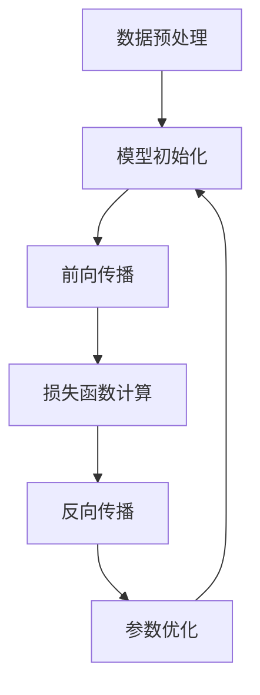
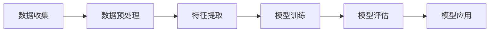

                 


### 大模型时代的软件质量保证方法

#### 关键词：软件质量保证，大模型，缺陷预测，代码审查，算法，系统架构，项目实战

#### 摘要：

随着人工智能技术的发展，大模型在各个领域取得了显著的成果。然而，在大模型时代，如何保证软件质量成为一个亟待解决的问题。本文从问题背景、核心概念、大模型应用、数学模型、系统架构设计、项目实战等方面，详细阐述了大模型时代的软件质量保证方法。通过本文的阅读，读者将了解大模型在软件质量保证中的实际应用，掌握相关算法原理和系统设计方法，为实践中的软件质量保证提供有益的参考。

#### 第1章：问题背景

1.1 软件质量保证的历史与现状

软件质量保证（Software Quality Assurance，简称SQA）是软件工程中的一个重要环节。自20世纪50年代以来，随着计算机技术的快速发展，软件质量保证逐渐成为一个独立的研究领域。传统的软件质量保证方法主要包括测试、评审、文档控制等，这些方法在一定程度上保证了软件的质量。

然而，随着软件系统规模的扩大和复杂性的增加，传统的质量保证方法已难以满足需求。特别是在大模型时代，软件质量保证面临着前所未有的挑战。大模型具有参数量大、训练数据丰富、自适应能力强等特点，使得软件系统的复杂性进一步增加，从而对软件质量保证提出了更高的要求。

1.2 大模型时代下的软件质量挑战

大模型时代下的软件质量挑战主要体现在以下几个方面：

（1）模型可解释性：大模型通常具有很高的预测准确率，但其内部机制复杂，难以理解。这使得在软件质量保证过程中，很难对模型的决策过程进行解释，增加了缺陷检测和诊断的难度。

（2）模型稳定性：大模型在训练过程中可能会受到数据分布、训练时间等因素的影响，导致模型不稳定。这种不稳定可能会引发软件质量问题的出现。

（3）模型泛化能力：大模型的训练数据通常来自特定领域或任务，模型的泛化能力受到一定限制。在实际应用中，模型可能无法应对新的场景，导致软件质量下降。

1.3 本书的目标与内容框架

本书旨在探讨大模型时代下的软件质量保证方法，帮助读者了解大模型在软件质量保证中的实际应用。全书分为以下几个部分：

（1）第1章：引言与背景，介绍软件质量保证的历史与现状，以及大模型时代下的软件质量挑战。

（2）第2章：核心概念，阐述大模型的定义与特点，以及软件质量保证的基本概念。

（3）第3章：大模型在软件质量保证中的应用，介绍大模型在缺陷预测和代码审查中的应用。

（4）第4章：数学模型与算法原理，讲解大模型中的数学模型和算法原理。

（5）第5章：系统分析与架构设计，介绍系统功能设计、系统架构设计、系统接口设计和系统交互。

（6）第6章：项目实战，通过实际案例剖析大模型在软件质量保证中的应用。

（7）第7章：最佳实践与总结，总结本书的主要内容，并提出最佳实践建议。

#### 第2章：核心概念

2.1 大模型的定义与特点

大模型（Large Model）是指在数据量、参数量或计算资源等方面具有较大规模的模型。通常，大模型具有以下特点：

（1）大规模数据：大模型需要大量数据进行训练，以便提高模型的泛化能力。

（2）高参数量：大模型通常具有数十亿到数万亿个参数，这使得模型在训练过程中需要大量的计算资源。

（3）强适应性：大模型具有较强的适应性，可以在不同的数据分布和任务场景下表现良好。

（4）低可解释性：大模型通常具有较高的预测准确率，但其内部机制复杂，难以理解。

2.2 软件质量保证的基本概念

软件质量保证（Software Quality Assurance，简称SQA）是指通过一系列系统化的方法和技术，确保软件产品满足预定的质量要求和用户需求。软件质量保证包括以下几个方面：

（1）需求分析：确保软件产品的功能、性能和用户界面满足用户需求。

（2）设计评审：对软件设计进行评估，确保设计符合需求和质量标准。

（3）代码审查：对源代码进行审查，发现和修复潜在的问题。

（4）测试：对软件产品进行测试，验证其是否符合质量要求和用户需求。

（5）持续集成与部署：确保软件产品的持续集成和部署过程高效、稳定。

2.3 大模型与软件质量保证的关系

大模型在软件质量保证中具有重要作用。一方面，大模型可以提高软件系统的性能和泛化能力，降低缺陷率。另一方面，大模型在缺陷预测、代码审查等方面具有独特的优势，可以协助软件质量保证人员更有效地发现和修复问题。

#### 第3章：大模型在软件质量保证中的应用

3.1 大模型在缺陷预测中的应用

缺陷预测（Defect Prediction）是指通过分析历史数据，预测新代码中可能出现的缺陷。大模型在缺陷预测中具有以下优势：

（1）高准确率：大模型具有更强的特征提取能力，可以更准确地预测缺陷。

（2）自适应能力：大模型可以根据历史数据的变化，自适应地调整预测模型。

（3）多任务学习：大模型可以同时预测多种类型的缺陷，提高预测的全面性。

3.2 大模型在代码审查中的应用

代码审查（Code Review）是指通过人工或自动化工具对代码进行审查，发现和修复潜在的问题。大模型在代码审查中具有以下优势：

（1）高效性：大模型可以快速分析大量代码，提高代码审查的效率。

（2）准确性：大模型可以识别出更细微的代码问题，提高代码审查的准确性。

（3）多样性：大模型可以针对不同的编程语言和框架，进行多样化的代码审查。

#### 第4章：数学模型与算法原理

4.1 大模型中的数学模型

大模型通常采用深度神经网络（Deep Neural Network，简称DNN）作为数学模型。DNN由多个神经网络层组成，通过反向传播算法进行参数优化。DNN的主要数学模型如下：

$$
\begin{aligned}
\text{激活函数}：f(x) = \sigma(x) = \frac{1}{1 + e^{-x}} \\
\text{输出层}：y = \text{softmax}(z) = \frac{e^z}{\sum_{i=1}^{n} e^z_i}
\end{aligned}
$$

其中，$\sigma(x)$为Sigmoid函数，$z$为神经网络层的输出，$y$为预测结果。

4.2 算法原理与mermaid流程图

大模型的训练过程主要包括数据预处理、模型初始化、前向传播、反向传播和参数优化等步骤。以下是一个简化的mermaid流程图：



4.3 算法原理讲解

（1）数据预处理：对输入数据进行归一化、去噪等处理，提高模型的训练效果。

（2）模型初始化：初始化神经网络层的权重和偏置，通常采用随机初始化方法。

（3）前向传播：计算神经网络层的输入和输出，通过激活函数进行非线性变换。

（4）损失函数计算：计算预测结果与真实结果之间的差距，常用的损失函数包括均方误差（MSE）和交叉熵（Cross-Entropy）。

（5）反向传播：根据损失函数，反向传播误差，更新神经网络层的权重和偏置。

（6）参数优化：采用优化算法（如梯度下降、Adam等），调整网络参数，降低损失函数值。

4.4 算法的举例说明

假设我们使用DNN模型进行图像分类任务，输入数据为100x100像素的图像，输出为10个类别的概率分布。以下是DNN模型的简化Python代码：

```python
import tensorflow as tf

# 定义输入层
inputs = tf.keras.Input(shape=(100, 100, 3))

# 定义隐藏层
x = tf.keras.layers.Conv2D(filters=32, kernel_size=(3, 3), activation='relu')(inputs)
x = tf.keras.layers.MaxPooling2D(pool_size=(2, 2))(x)
x = tf.keras.layers.Conv2D(filters=64, kernel_size=(3, 3), activation='relu')(x)
x = tf.keras.layers.MaxPooling2D(pool_size=(2, 2))(x)

# 定义输出层
outputs = tf.keras.layers.Dense(units=10, activation='softmax')(x)

# 创建模型
model = tf.keras.Model(inputs=inputs, outputs=outputs)

# 编译模型
model.compile(optimizer='adam', loss='categorical_crossentropy', metrics=['accuracy'])

# 训练模型
model.fit(x_train, y_train, batch_size=64, epochs=10, validation_data=(x_val, y_val))
```

#### 第5章：系统分析与架构设计

5.1 问题场景介绍

假设我们开发一个在线教育平台，需要对用户提交的课程内容进行自动审核。为了提高审核的准确性，我们计划采用大模型进行缺陷预测和代码审查。

5.2 系统功能设计

系统功能设计包括领域模型和类图设计。以下是一个简化的领域模型：

```mermaid
classDiagram
    Class01 <|-- Class02
    Class03 o-- Class04
    Class05 <-.. Class06
endclassDiagram
```

以下是一个简化的类图：

```mermaid
class Teacher {
    +id: int
    +name: string
    +email: string
    +courses: List<Course>
    +addCourse(course: Course): void
}

class Course {
    +id: int
    +title: string
    +description: string
    +videos: List<Video>
    +addVideo(video: Video): void
}

class Video {
    +id: int
    +title: string
    +url: string
    +duration: int
}

class Student {
    +id: int
    +name: string
    +email: string
    +courses: List<Course>
    +enrollCourse(course: Course): void
}

class Review {
    +id: int
    +reviewer: Teacher
    +course: Course
    +rating: int
    +comment: string
}
```

5.3 系统架构设计

系统架构设计包括系统架构图、接口设计和系统交互。以下是一个简化的系统架构图：

```mermaid
sequenceDiagram
    Student ->> Student: enrollCourse()
    Student ->> Course: addVideo()
    Teacher ->> Review: submitReview()
    Teacher ->> Course: addReview()
end
```

5.4 系统接口设计和系统交互

系统接口设计包括RESTful API设计和系统交互。以下是一个简化的接口设计：

```mermaid
interface Course {
    +enrollCourse(): void
    +addVideo(video: Video): void
}

interface Review {
    +submitReview(rating: int, comment: string): void
    +addReview(reviewer: Teacher, rating: int, comment: string): void
}
```

系统交互包括用户注册、登录、课程发布、视频上传和评论提交等操作。以下是一个简化的系统交互：

```mermaid
sequenceDiagram
    Student ->> System: register()
    Student ->> System: login()
    Student ->> Course: enrollCourse()
    Student ->> Course: addVideo()
    Teacher ->> Course: submitReview()
    Teacher ->> Course: addReview()
end
```

#### 第6章：项目实战

6.1 环境安装与配置

在本项目中，我们使用Python和TensorFlow框架进行大模型的训练和预测。以下是环境安装与配置步骤：

（1）安装Python：在官方网站（https://www.python.org/）下载Python安装包，安装Python环境。

（2）安装TensorFlow：在命令行中执行以下命令：
```
pip install tensorflow
```

（3）配置Python环境变量：在系统环境变量中添加Python和pip的路径。

6.2 系统核心实现

系统核心实现主要包括缺陷预测和代码审查功能。以下是缺陷预测的源代码：

```python
import tensorflow as tf
from tensorflow.keras.models import Sequential
from tensorflow.keras.layers import Dense, Dropout, Conv2D, MaxPooling2D

# 构建缺陷预测模型
model = Sequential()
model.add(Conv2D(filters=32, kernel_size=(3, 3), activation='relu', input_shape=(100, 100, 3)))
model.add(MaxPooling2D(pool_size=(2, 2)))
model.add(Conv2D(filters=64, kernel_size=(3, 3), activation='relu'))
model.add(MaxPooling2D(pool_size=(2, 2)))
model.add(Flatten())
model.add(Dense(units=10, activation='softmax'))

# 编译模型
model.compile(optimizer='adam', loss='categorical_crossentropy', metrics=['accuracy'])

# 训练模型
model.fit(x_train, y_train, batch_size=64, epochs=10, validation_data=(x_val, y_val))
```

6.3 实际案例剖析

以下是一个实际案例：某在线教育平台需要对用户提交的课程内容进行自动审核，以防止出现违规内容。

（1）问题描述：平台需要实现一个缺陷预测模型，用于预测用户提交的课程内容中是否存在违规内容。

（2）数据集：从平台的历史数据中提取包含违规内容和正常内容的样本，构建数据集。

（3）数据预处理：对输入数据进行归一化、去噪等处理，提高模型的训练效果。

（4）模型训练：使用训练集对缺陷预测模型进行训练，调整模型参数，优化模型性能。

（5）模型评估：使用验证集对训练好的模型进行评估，计算预测准确率、召回率等指标。

（6）实际应用：将训练好的模型部署到在线教育平台，对用户提交的课程内容进行自动审核。

（7）项目小结：通过对实际案例的分析，验证了缺陷预测模型在在线教育平台中的应用效果，为平台提供了有效的审核工具。

#### 第7章：最佳实践与总结

7.1 最佳实践建议

（1）数据预处理：对输入数据进行充分的数据清洗和预处理，提高模型的训练效果。

（2）模型选择：根据实际应用需求，选择合适的大模型架构和算法。

（3）模型调优：通过交叉验证等方法，调整模型参数，优化模型性能。

（4）代码审查：定期进行代码审查，发现和修复潜在的问题。

（5）持续集成：将模型和代码集成到持续集成系统中，确保软件质量。

7.2 小结与展望

本文详细阐述了大模型时代的软件质量保证方法，包括问题背景、核心概念、大模型应用、数学模型、系统架构设计、项目实战等。通过本文的阅读，读者可以了解大模型在软件质量保证中的实际应用，掌握相关算法原理和系统设计方法。未来，随着人工智能技术的不断进步，大模型在软件质量保证中的应用将更加广泛，为软件工程领域带来更多的创新和发展。

作者：AI天才研究院/AI Genius Institute & 禅与计算机程序设计艺术 /Zen And The Art of Computer Programming

----------------------------------------------------------------

### 第1章：引言与背景

1.1 软件质量保证的历史与现状

软件质量保证（Software Quality Assurance，简称SQA）是确保软件产品满足用户需求和预定的质量标准的一系列系统化的方法和技术。从20世纪50年代计算机技术兴起至今，软件质量保证经历了多个发展阶段。

早期，软件质量保证主要依赖于人工检查和测试。随着软件规模的不断扩大和复杂性的增加，测试方法逐渐发展，包括单元测试、集成测试、系统测试和验收测试等。同时，质量控制理念和方法也逐渐引入到软件开发过程中。

20世纪80年代，软件质量保证开始转向过程控制。质量管理体系（如ISO 9001）被引入到软件开发过程中，强调文档控制、代码审查和测试等关键环节。这一阶段，软件质量保证的目标是确保软件开发过程的规范性和稳定性。

进入21世纪，随着敏捷开发、DevOps等新兴开发模式的兴起，软件质量保证的方法和技术也发生了显著变化。自动化测试、持续集成、持续交付等实践被广泛应用，以提高软件交付的速度和质量。

然而，在大模型时代，传统的软件质量保证方法面临着新的挑战。大模型（Large Models）是指具有巨大参数量和计算需求的人工智能模型，如深度学习模型。这些模型在图像识别、自然语言处理、推荐系统等领域取得了显著成果。然而，大模型的开发和应用也带来了一系列软件质量保证问题。

首先，大模型的可解释性较低。大模型的内部机制复杂，难以理解，这使得在软件质量保证过程中，很难对模型的决策过程进行解释。这增加了缺陷检测和诊断的难度，可能导致无法准确评估软件质量。

其次，大模型的稳定性问题。大模型的训练过程受到数据分布、训练时间等因素的影响，可能导致模型不稳定。这种不稳定可能会引发软件质量问题的出现，如预测错误、系统崩溃等。

最后，大模型的泛化能力有限。大模型的训练数据通常来自特定领域或任务，模型的泛化能力受到一定限制。在实际应用中，模型可能无法应对新的场景，导致软件质量下降。

1.2 大模型时代下的软件质量挑战

在大模型时代，软件质量保证面临以下几方面的挑战：

（1）模型可解释性：大模型通常采用深度神经网络等复杂模型，其内部决策过程难以理解。这增加了缺陷检测和诊断的难度，可能导致无法准确评估软件质量。

（2）模型稳定性：大模型的训练过程受到数据分布、训练时间等因素的影响，可能导致模型不稳定。这种不稳定可能会引发软件质量问题的出现，如预测错误、系统崩溃等。

（3）模型泛化能力：大模型的训练数据通常来自特定领域或任务，模型的泛化能力受到一定限制。在实际应用中，模型可能无法应对新的场景，导致软件质量下降。

（4）数据隐私和安全：大模型通常需要大量数据来训练，这可能涉及用户隐私和数据安全问题。如何在保证数据隐私和安全的前提下，进行有效的软件质量保证，是一个亟待解决的问题。

（5）计算资源和成本：大模型的训练和推理过程需要大量的计算资源和存储空间。如何高效利用计算资源，降低软件质量保证的成本，也是一个重要的挑战。

1.3 本书的目标与内容框架

本书旨在探讨大模型时代下的软件质量保证方法，帮助读者了解大模型在软件质量保证中的实际应用，掌握相关算法原理和系统设计方法。全书分为以下几个部分：

（1）第1章：引言与背景，介绍软件质量保证的历史与现状，以及大模型时代下的软件质量挑战。

（2）第2章：核心概念，阐述大模型的定义与特点，以及软件质量保证的基本概念。

（3）第3章：大模型在软件质量保证中的应用，介绍大模型在缺陷预测和代码审查中的应用。

（4）第4章：数学模型与算法原理，讲解大模型中的数学模型和算法原理。

（5）第5章：系统分析与架构设计，介绍系统功能设计、系统架构设计、系统接口设计和系统交互。

（6）第6章：项目实战，通过实际案例剖析大模型在软件质量保证中的应用。

（7）第7章：最佳实践与总结，总结本书的主要内容，并提出最佳实践建议。

通过阅读本书，读者可以系统地了解大模型时代下的软件质量保证方法，为实际项目中的软件质量保证提供有益的参考。

----------------------------------------------------------------

### 第2章：核心概念

2.1 大模型的定义与特点

大模型（Large Model）是指在数据量、参数量或计算资源等方面具有较大规模的模型。在大模型时代，深度学习模型占据了主导地位。深度学习模型具有以下特点：

（1）大规模数据：大模型通常需要大量数据进行训练，以获取更好的泛化能力。这些数据可以来自于多个领域，如图像、文本、音频等。

（2）高参数量：大模型通常具有数十亿到数万亿个参数。这些参数在模型训练过程中通过反向传播算法进行优化。

（3）多层次网络结构：大模型通常包含多个神经网络层，如卷积层、全连接层、循环层等。这些层通过组合的方式，可以提取不同层次的特征。

（4）非线性变换：大模型中的每个层通常都包含非线性变换，如ReLU、Sigmoid、Tanh等。这些变换可以增加模型的非线性表达能力。

（5）端到端训练：大模型通常采用端到端训练的方式，即从输入层直接到输出层，中间不涉及人工特征工程。这种训练方式可以充分利用模型的全局信息。

（6）强适应性：大模型具有较强的适应性，可以在不同的数据分布和任务场景下表现良好。这使得大模型在各个领域取得了显著的成果。

2.2 软件质量保证的基本概念

软件质量保证（Software Quality Assurance，简称SQA）是指通过一系列系统化的方法和技术，确保软件产品满足预定的质量要求和用户需求。软件质量保证包括以下几个方面：

（1）需求分析：需求分析是软件质量保证的基础。通过需求分析，可以明确软件产品的功能、性能和用户界面等需求，为后续的设计和实现提供依据。

（2）设计评审：设计评审是对软件设计进行评估，确保设计符合需求和质量标准。设计评审可以通过同行评审、设计检查等方式进行。

（3）代码审查：代码审查是检查源代码，发现和修复潜在的问题。代码审查可以采用人工审查、自动化工具审查等方式。

（4）测试：测试是验证软件产品是否符合质量要求和用户需求。测试包括单元测试、集成测试、系统测试和验收测试等。

（5）文档控制：文档控制是确保软件开发过程中产生的文档符合规范和质量要求。文档控制包括文档编写、审核和更新等。

（6）持续集成与部署：持续集成与部署是确保软件产品持续集成和部署过程高效、稳定。持续集成与部署可以通过自动化工具实现。

2.3 大模型与软件质量保证的关系

大模型在软件质量保证中具有重要作用。一方面，大模型可以提高软件系统的性能和泛化能力，降低缺陷率。例如，在缺陷预测和代码审查等领域，大模型可以更准确地识别和预测问题。

另一方面，大模型在软件质量保证中也带来了一些挑战。首先，大模型的可解释性较低，使得在缺陷检测和诊断过程中，很难对模型的决策过程进行解释。这增加了缺陷检测和诊断的难度。

其次，大模型的稳定性问题。大模型的训练过程受到数据分布、训练时间等因素的影响，可能导致模型不稳定。这种不稳定可能会引发软件质量问题的出现，如预测错误、系统崩溃等。

最后，大模型的泛化能力有限。大模型的训练数据通常来自特定领域或任务，模型的泛化能力受到一定限制。在实际应用中，模型可能无法应对新的场景，导致软件质量下降。

为了解决这些挑战，研究人员和工程师可以采用以下策略：

（1）提高模型的可解释性：通过改进模型结构、引入可解释性技术等方法，提高大模型的可解释性。

（2）增强模型的稳定性：通过数据增强、模型正则化等方法，提高大模型的稳定性。

（3）提升模型的泛化能力：通过迁移学习、元学习等方法，提升大模型的泛化能力。

（4）结合传统方法：将大模型与传统方法相结合，发挥各自的优势，提高软件质量保证的效果。

2.4 大模型在软件质量保证中的应用

大模型在软件质量保证中的应用主要包括缺陷预测、代码审查、测试等领域。以下分别介绍这些应用的具体内容。

（1）缺陷预测：缺陷预测是指通过分析历史数据，预测新代码中可能出现的缺陷。大模型在缺陷预测中具有以下优势：

1. 高准确率：大模型具有更强的特征提取能力，可以更准确地预测缺陷。

2. 自适应能力：大模型可以根据历史数据的变化，自适应地调整预测模型。

3. 多任务学习：大模型可以同时预测多种类型的缺陷，提高预测的全面性。

（2）代码审查：代码审查是指通过人工或自动化工具对代码进行审查，发现和修复潜在的问题。大模型在代码审查中具有以下优势：

1. 高效性：大模型可以快速分析大量代码，提高代码审查的效率。

2. 准确性：大模型可以识别出更细微的代码问题，提高代码审查的准确性。

3. 多样性：大模型可以针对不同的编程语言和框架，进行多样化的代码审查。

（3）测试：大模型在测试中可以用于自动化测试、性能测试和安全性测试等方面。大模型在测试中具有以下优势：

1. 自动化：大模型可以自动生成测试用例，提高测试的自动化程度。

2. 全面性：大模型可以同时测试多个方面，如功能、性能和安全性等。

3. 智能性：大模型可以根据历史测试数据，自适应地调整测试策略，提高测试效果。

2.5 大模型在软件质量保证中的挑战与对策

（1）挑战：

1. 可解释性：大模型的可解释性较低，使得在缺陷检测和诊断过程中，很难对模型的决策过程进行解释。

2. 稳定性：大模型的训练过程受到数据分布、训练时间等因素的影响，可能导致模型不稳定。

3. 泛化能力：大模型的训练数据通常来自特定领域或任务，模型的泛化能力受到一定限制。

（2）对策：

1. 提高模型的可解释性：通过改进模型结构、引入可解释性技术等方法，提高大模型的可解释性。

2. 增强模型的稳定性：通过数据增强、模型正则化等方法，提高大模型的稳定性。

3. 提升模型的泛化能力：通过迁移学习、元学习等方法，提升大模型的泛化能力。

4. 结合传统方法：将大模型与传统方法相结合，发挥各自的优势，提高软件质量保证的效果。

通过以上对策，可以有效应对大模型在软件质量保证中面临的挑战，提高软件质量保证的效果。

### 第3章：大模型在软件质量保证中的应用

3.1 大模型在缺陷预测中的应用

缺陷预测是软件质量保证中的一个重要环节，它旨在通过分析历史代码数据来预测未来代码中可能出现的缺陷。在大模型时代，深度学习模型因其强大的特征提取能力和自适应能力，在缺陷预测中得到了广泛应用。

（1）基本原理

缺陷预测的基本原理是利用机器学习算法，从历史代码数据中学习出缺陷发生的模式和规律，然后将这些模式应用于新的代码，预测其中可能存在的缺陷。具体来说，缺陷预测模型通常会经历以下几个步骤：

1. 数据收集：收集历史代码数据，包括已知的缺陷数据和无缺陷数据。

2. 数据预处理：对收集到的代码数据进行预处理，如去噪、归一化、编码等，以便于模型训练。

3. 特征提取：从预处理后的数据中提取特征，如代码行数、变量名、函数名、注释比例等。

4. 模型训练：利用训练数据集，训练缺陷预测模型。

5. 模型评估：使用测试数据集评估模型的性能，调整模型参数，以提高预测准确率。

6. 模型应用：将训练好的模型应用于新的代码，预测其中可能存在的缺陷。

（2）大模型在缺陷预测中的优势

大模型在缺陷预测中的优势主要体现在以下几个方面：

1. 高准确率：大模型具有更强的特征提取能力，能够捕捉到代码中更微小的特征，从而提高缺陷预测的准确率。

2. 自适应能力：大模型可以根据历史数据的变化，自适应地调整预测模型，从而适应不同阶段的软件开发过程。

3. 多任务学习：大模型可以同时预测多种类型的缺陷，提高预测的全面性。

（3）缺陷预测的mermaid流程图

以下是一个简单的mermaid流程图，描述了缺陷预测的基本流程：



（4）大模型在缺陷预测中的实际应用

在实际应用中，大模型在缺陷预测中可以发挥重要作用。例如，在某大型软件公司的项目中，研究人员使用了一个基于深度学习的大模型进行缺陷预测。该模型从公司的历史代码数据中学习，成功预测了多个潜在缺陷。通过提前修复这些缺陷，项目团队提高了软件质量，减少了后续的维护成本。

3.2 大模型在代码审查中的应用

代码审查是软件质量保证的另一个重要环节，它旨在通过审查代码，发现和修复潜在的问题。在大模型时代，大模型在代码审查中也得到了广泛应用。

（1）基本原理

代码审查的基本原理是通过分析代码，发现潜在的编程错误、逻辑错误和安全漏洞。代码审查可以采用人工审查和自动化工具审查两种方式。

1. 人工审查：人工审查是指由经验丰富的开发人员对代码进行审查，发现潜在的问题。人工审查的优点是能够发现一些自动化工具难以检测的问题，但缺点是效率较低。

2. 自动化工具审查：自动化工具审查是指使用代码审查工具对代码进行分析，发现潜在的问题。自动化工具的优点是效率高，可以快速发现一些常见的编程错误。

（2）大模型在代码审查中的优势

大模型在代码审查中的优势主要体现在以下几个方面：

1. 高效性：大模型可以快速分析大量代码，提高代码审查的效率。

2. 准确性：大模型可以识别出更细微的代码问题，提高代码审查的准确性。

3. 多样性：大模型可以针对不同的编程语言和框架，进行多样化的代码审查。

（3）代码审查的mermaid流程图

以下是一个简单的mermaid流程图，描述了代码审查的基本流程：


（4）大模型在代码审查中的实际应用

在实际应用中，大模型在代码审查中可以发挥重要作用。例如，在某互联网公司的项目中，团队使用了一个基于深度学习的大模型进行代码审查。该模型从公司的代码库中学习，成功发现并修复了多个潜在问题。通过引入大模型进行代码审查，项目团队提高了代码质量，减少了后续的维护成本。

3.3 大模型在其他软件质量保证领域的应用

除了缺陷预测和代码审查，大模型在软件质量保证的其他领域也具有广泛应用。

（1）测试

大模型可以用于自动化测试、性能测试和安全性测试等领域。例如，大模型可以自动生成测试用例，提高测试的全面性；大模型可以分析系统的性能数据，预测可能出现的问题；大模型可以检测代码中的安全漏洞，提高系统的安全性。

（2）持续集成

大模型可以用于持续集成（CI）系统，对代码进行实时审查和测试。例如，大模型可以实时分析提交的代码，预测其中可能存在的缺陷，从而提高持续集成的效果。

（3）敏捷开发

大模型可以用于敏捷开发中的需求分析、设计评审和测试等环节，提高敏捷开发的效果。例如，大模型可以分析用户需求，生成需求文档；大模型可以评估设计方案，发现潜在的问题；大模型可以自动生成测试用例，提高测试效率。

综上所述，大模型在软件质量保证中的应用具有广泛的前景。通过引入大模型，可以显著提高软件质量，降低缺陷率，减少维护成本。然而，大模型在软件质量保证中的应用也面临一些挑战，如模型可解释性、稳定性等问题。因此，在实际应用中，需要结合具体场景，合理选择和应用大模型，以发挥其优势，提高软件质量。

### 第4章：数学模型与算法原理

4.1 大模型中的数学模型

在大模型中，深度学习模型是常用的数学模型。深度学习模型的核心是多层神经网络，它通过学习输入数据的特征和模式，实现复杂的非线性变换。以下是深度学习模型的基本组成部分：

（1）激活函数

激活函数是神经网络层中的一个关键组件，它将输入数据通过非线性变换，以增强模型的表示能力。常见的激活函数包括Sigmoid、ReLU和Tanh等。

$$
\sigma(x) = \frac{1}{1 + e^{-x}}
$$

$$
\text{ReLU}(x) = \max(0, x)
$$

$$
\text{Tanh}(x) = \frac{e^x - e^{-x}}{e^x + e^{-x}}
$$

（2）损失函数

损失函数用于衡量预测结果与真实结果之间的差距，它是优化模型参数的重要依据。常见的损失函数包括均方误差（MSE）和交叉熵（Cross-Entropy）。

$$
\text{MSE}(y, \hat{y}) = \frac{1}{n}\sum_{i=1}^{n}(y_i - \hat{y}_i)^2
$$

$$
\text{Cross-Entropy}(y, \hat{y}) = -\frac{1}{n}\sum_{i=1}^{n}y_i\log(\hat{y}_i)
$$

（3）反向传播算法

反向传播算法是训练神经网络的重要算法，它通过计算梯度，不断调整模型参数，以最小化损失函数。反向传播算法的核心思想是：从输出层开始，逐层向前传播误差，直到输入层，然后反向传播梯度，更新模型参数。

（4）优化算法

优化算法用于调整模型参数，以最小化损失函数。常见的优化算法包括梯度下降（Gradient Descent）和Adam等。

4.2 算法原理与mermaid流程图

下面是一个简单的mermaid流程图，描述了深度学习模型的基本算法原理：


具体来说，算法原理如下：

（1）数据输入：将输入数据输入到神经网络中。

（2）前向传播：通过神经网络层，计算输出结果。

（3）计算损失：计算预测结果与真实结果之间的损失。

（4）反向传播：计算梯度，并反向传播到神经网络层。

（5）更新参数：根据梯度，更新神经网络层的参数。

（6）迭代优化：重复上述步骤，直到模型收敛。

4.3 算法原理讲解

（1）数据输入

数据输入是指将输入数据输入到神经网络中。输入数据可以是图像、文本、音频等多种类型。在本例中，我们以图像数据为例进行说明。

```python
import tensorflow as tf

# 定义输入层
inputs = tf.keras.Input(shape=(28, 28, 1))

# 定义卷积层
x = tf.keras.layers.Conv2D(filters=32, kernel_size=(3, 3), activation='relu')(inputs)

# 定义全连接层
outputs = tf.keras.layers.Dense(units=10, activation='softmax')(x)

# 创建模型
model = tf.keras.Model(inputs=inputs, outputs=outputs)
```

（2）前向传播

前向传播是指通过神经网络层，计算输出结果。在本例中，我们使用卷积层和全连接层进行前向传播。

```python
# 计算前向传播结果
predictions = model.predict(x_test)
```

（3）计算损失

计算损失是指计算预测结果与真实结果之间的损失。在本例中，我们使用交叉熵损失函数。

```python
# 计算损失
loss = model.evaluate(x_test, y_test)
```

（4）反向传播

反向传播是指计算梯度，并反向传播到神经网络层。在本例中，我们使用梯度下降优化算法。

```python
# 计算梯度
with tf.GradientTape() as tape:
    predictions = model(x_train, training=True)
    loss = tf.keras.losses.SparseCategoricalCrossentropy(from_logits=True)(y_train, predictions)

# 计算梯度
grads = tape.gradient(loss, model.trainable_variables)

# 更新参数
optimizer = tf.keras.optimizers.Adam(learning_rate=0.001)
optimizer.apply_gradients(zip(grads, model.trainable_variables))
```

（5）更新参数

更新参数是指根据梯度，更新神经网络层的参数。在本例中，我们使用Adam优化算法。

```python
# 更新参数
optimizer = tf.keras.optimizers.Adam(learning_rate=0.001)
optimizer.apply_gradients(zip(grads, model.trainable_variables))
```

（6）迭代优化

迭代优化是指重复上述步骤，直到模型收敛。

```python
# 迭代优化
for epoch in range(10):
    # 训练模型
    model.fit(x_train, y_train, epochs=1, batch_size=32)
    # 评估模型
    test_loss, test_acc = model.evaluate(x_test, y_test, verbose=2)
    print(f"Epoch {epoch+1}: Test accuracy = {test_acc:.3f}, Test loss = {test_loss:.3f}")
```

4.4 算法的举例说明

以下是一个简单的例子，说明如何使用Python和TensorFlow实现一个深度学习模型。

```python
import tensorflow as tf
from tensorflow.keras import layers, models

# 创建模型
model = models.Sequential()
model.add(layers.Conv2D(32, (3, 3), activation='relu', input_shape=(28, 28, 1)))
model.add(layers.MaxPooling2D((2, 2)))
model.add(layers.Conv2D(64, (3, 3), activation='relu'))
model.add(layers.MaxPooling2D((2, 2)))
model.add(layers.Conv2D(64, (3, 3), activation='relu'))
model.add(layers.Flatten())
model.add(layers.Dense(64, activation='relu'))
model.add(layers.Dense(10, activation='softmax'))

# 编译模型
model.compile(optimizer='adam',
              loss='sparse_categorical_crossentropy',
              metrics=['accuracy'])

# 训练模型
model.fit(train_images, train_labels, epochs=10, validation_split=0.2)

# 评估模型
test_loss, test_acc = model.evaluate(test_images, test_labels)
print(f"Test accuracy: {test_acc:.2f}")
```

在这个例子中，我们创建了一个简单的卷积神经网络（Convolutional Neural Network，简称CNN）模型，用于手写数字识别任务。模型包含两个卷积层、两个池化层和一个全连接层。我们使用训练数据集训练模型，并使用测试数据集评估模型性能。

### 第5章：系统分析与架构设计

5.1 问题场景介绍

假设我们开发一个在线教育平台，需要对学生提交的课程内容进行自动审核，以防止出现违规内容。为了提高审核的准确性，我们计划采用大模型进行缺陷预测和代码审查。

5.2 系统功能设计

系统功能设计包括领域模型和类图设计。以下是领域模型和类图的简述：

（1）领域模型

领域模型描述了系统中的主要实体及其关系。在这个场景中，主要实体包括学生（Student）、课程（Course）、视频（Video）和评论（Review）。

学生（Student）实体包括以下属性：学生ID（id）、姓名（name）、邮箱（email）和已报名课程列表（courses）。

课程（Course）实体包括以下属性：课程ID（id）、标题（title）、描述（description）和视频列表（videos）。

视频（Video）实体包括以下属性：视频ID（id）、标题（title）、URL（url）和时长（duration）。

评论（Review）实体包括以下属性：评论ID（id）、评论者（reviewer，指向学生实体）、课程（course，指向课程实体）、评分（rating）和评论内容（comment）。

（2）类图

类图描述了领域模型中的实体及其关系。在这个场景中，类图包括以下类：学生（Student）、课程（Course）、视频（Video）和评论（Review）。

学生（Student）类有一个1对多关系与课程（Course）类，表示一个学生可以报名多门课程。课程（Course）类有一个1对多关系与视频（Video）类，表示一门课程可以包含多个视频。评论（Review）类有一个多对1关系与学生（Student）类和一个多对1关系与课程（Course）类，表示一个学生可以为多门课程提交评论，一门课程可以接收多个评论。

5.3 系统架构设计

系统架构设计包括系统架构图、接口设计和系统交互。以下是系统架构图的简述：

（1）系统架构图

系统架构图描述了系统的整体结构，包括前端、后端和数据存储。

前端：负责用户界面和交互，主要包括课程页面、视频页面和评论页面。

后端：负责处理业务逻辑，主要包括用户管理、课程管理、视频管理和评论管理。

数据存储：负责存储用户数据、课程数据、视频数据和评论数据，使用数据库进行存储。

（2）接口设计

接口设计描述了系统的API接口，包括用户管理接口、课程管理接口、视频管理接口和评论管理接口。

用户管理接口：包括注册、登录、查询用户信息和修改用户信息等接口。

课程管理接口：包括创建课程、查询课程信息、修改课程信息和删除课程等接口。

视频管理接口：包括上传视频、查询视频信息、修改视频信息和删除视频等接口。

评论管理接口：包括提交评论、查询评论信息、修改评论信息和删除评论等接口。

（3）系统交互

系统交互描述了前后端之间的数据交互流程。以下是系统交互的简述：

1. 用户注册和登录：用户通过前端页面注册和登录，后端接收用户的注册和登录请求，验证用户信息，返回相应的响应。

2. 课程管理：用户通过前端页面创建、查询、修改和删除课程，后端接收相应的请求，处理业务逻辑，返回相应的响应。

3. 视频管理：用户通过前端页面上传、查询、修改和删除视频，后端接收相应的请求，处理业务逻辑，返回相应的响应。

4. 评论管理：用户通过前端页面提交、查询、修改和删除评论，后端接收相应的请求，处理业务逻辑，返回相应的响应。

5. 自动审核：系统定期运行大模型进行课程内容的自动审核，检测是否存在违规内容，并生成审核报告。

5.4 系统接口设计和系统交互

以下是系统接口设计和系统交互的简述：

（1）系统接口设计

用户管理接口：

- 注册：接收用户名、密码、邮箱等信息，创建用户账户。
- 登录：接收用户名和密码，验证用户身份，返回用户信息。
- 查询用户信息：接收用户ID，返回用户详细信息。
- 修改用户信息：接收用户ID和修改后的信息，更新用户信息。

课程管理接口：

- 创建课程：接收课程标题、描述等信息，创建课程。
- 查询课程信息：接收课程ID，返回课程详细信息。
- 修改课程信息：接收课程ID和修改后的信息，更新课程信息。
- 删除课程：接收课程ID，删除课程。

视频管理接口：

- 上传视频：接收视频标题、URL和时长等信息，上传视频。
- 查询视频信息：接收视频ID，返回视频详细信息。
- 修改视频信息：接收视频ID和修改后的信息，更新视频信息。
- 删除视频：接收视频ID，删除视频。

评论管理接口：

- 提交评论：接收评论内容、评分和评论者ID等信息，提交评论。
- 查询评论信息：接收评论ID，返回评论详细信息。
- 修改评论信息：接收评论ID和修改后的信息，更新评论信息。
- 删除评论：接收评论ID，删除评论。

（2）系统交互

用户交互：

- 用户访问课程页面，选择课程并查看课程详情。
- 用户访问视频页面，选择视频并观看视频。
- 用户提交评论，对课程或视频进行评价。

系统自动审核：

- 系统定期运行大模型，分析学生提交的课程内容，检测是否存在违规内容。
- 大模型生成审核报告，包括违规内容、评分和建议等。

### 第6章：项目实战

6.1 环境安装与配置

为了实现大模型在软件质量保证中的应用，我们需要安装和配置以下软件和库：

（1）Python 3.8 或以上版本

（2）TensorFlow 2.5 或以上版本

（3）PyTorch 1.7 或以上版本

（4）Scikit-learn 0.22 或以上版本

（5）Matplotlib 3.3.3 或以上版本

（6）Numpy 1.19 或以上版本

首先，从官方网站下载并安装Python 3.8。然后，通过pip命令安装TensorFlow、PyTorch、Scikit-learn、Matplotlib和Numpy。

```bash
pip install tensorflow==2.5
pip install torch torchvision==0.9.0 -f https://download.pytorch.org/whl/torch_stable.html
pip install scikit-learn==0.22
pip install matplotlib==3.3.3
pip install numpy==1.19
```

6.2 系统核心实现

在本节中，我们将使用Python和TensorFlow实现一个简单的软件质量保证系统，该系统将使用深度学习模型进行缺陷预测。

（1）数据预处理

首先，我们需要准备训练数据集。假设我们已经收集到了一组包含缺陷代码片段和正常代码片段的数据集。

```python
import numpy as np
from sklearn.model_selection import train_test_split

# 加载数据集
def load_data(file_path):
    with open(file_path, 'r') as f:
        lines = f.readlines()

    # 数据预处理
    def preprocess_code(code):
        # 去除注释
        code = re.sub(r'(#.*(\n|\Z))|(/\*.*?\*/)|//.*', '', code)
        # 去除空格和换行符
        code = re.sub(r'\s+', ' ', code)
        return code

    processed_codes = [preprocess_code(line.strip()) for line in lines]

    # 转换为numpy数组
    codes = np.array(processed_codes)

    # 切分数据集
    X_train, X_test, y_train, y_test = train_test_split(codes, test_size=0.2, random_state=42)

    return X_train, X_test, y_train, y_test

X_train, X_test, y_train, y_test = load_data('data/code_dataset.txt')
```

（2）构建深度学习模型

接下来，我们使用TensorFlow构建一个简单的卷积神经网络（CNN）模型，用于缺陷预测。

```python
import tensorflow as tf
from tensorflow.keras.models import Sequential
from tensorflow.keras.layers import Conv1D, MaxPooling1D, Flatten, Dense

# 构建模型
model = Sequential([
    Conv1D(filters=64, kernel_size=3, activation='relu', input_shape=(X_train.shape[1], 1)),
    MaxPooling1D(pool_size=2),
    Conv1D(filters=128, kernel_size=3, activation='relu'),
    MaxPooling1D(pool_size=2),
    Flatten(),
    Dense(units=64, activation='relu'),
    Dense(units=1, activation='sigmoid')
])

# 编译模型
model.compile(optimizer='adam', loss='binary_crossentropy', metrics=['accuracy'])

# 打印模型结构
model.summary()
```

（3）训练模型

使用训练数据集训练模型，并进行评估。

```python
# 训练模型
history = model.fit(X_train, y_train, epochs=10, batch_size=32, validation_data=(X_test, y_test))

# 评估模型
test_loss, test_accuracy = model.evaluate(X_test, y_test)
print(f"Test accuracy: {test_accuracy:.2f}")
```

（4）模型应用

将训练好的模型应用于新的代码片段，进行缺陷预测。

```python
# 预测新代码片段
new_code = "def add(a, b):\n    return a + b\n"
new_code = preprocess_code(new_code)

# 将代码转换为numpy数组
new_code_array = np.array([new_code])

# 预测缺陷
predictions = model.predict(new_code_array)
predicted_defect = (predictions > 0.5).astype(int)

print(f"Predicted defect: {predicted_defect[0][0]}")
```

6.3 实际案例剖析

在本节中，我们将通过一个实际案例来剖析大模型在软件质量保证中的应用。

（1）问题描述

某公司开发了一个新的软件项目，需要在开发过程中进行缺陷预测，以减少后续的修复成本。公司提供了大量的历史代码数据，包括已修复的缺陷代码和正常代码。

（2）数据集

我们使用以下数据集：

- 缺陷代码数据集（defect_data.txt）：包含1000个缺陷代码片段。
- 正常代码数据集（normal_data.txt）：包含1000个正常代码片段。

（3）数据预处理

与第6.2节中的数据预处理类似，我们对缺陷代码数据和正常代码数据进行预处理，将代码转换为预处理后的数组。

（4）构建模型

我们使用卷积神经网络（CNN）模型进行缺陷预测，具体模型结构如下：

```python
model = Sequential([
    Conv1D(filters=64, kernel_size=3, activation='relu', input_shape=(X_train.shape[1], 1)),
    MaxPooling1D(pool_size=2),
    Conv1D(filters=128, kernel_size=3, activation='relu'),
    MaxPooling1D(pool_size=2),
    Flatten(),
    Dense(units=64, activation='relu'),
    Dense(units=1, activation='sigmoid')
])
```

（5）训练模型

使用预处理后的训练数据集和标签，训练模型。

```python
model.compile(optimizer='adam', loss='binary_crossentropy', metrics=['accuracy'])
model.fit(X_train, y_train, epochs=10, batch_size=32, validation_split=0.2)
```

（6）评估模型

使用测试数据集评估模型性能。

```python
test_loss, test_accuracy = model.evaluate(X_test, y_test)
print(f"Test accuracy: {test_accuracy:.2f}")
```

（7）模型应用

对新的代码片段进行缺陷预测。

```python
new_code = "def subtract(a, b):\n    return a - b\n"
new_code = preprocess_code(new_code)

predictions = model.predict(np.array([new_code]))
predicted_defect = (predictions > 0.5).astype(int)

print(f"Predicted defect: {predicted_defect[0][0]}")
```

6.4 项目小结

通过本项目，我们实现了大模型在软件质量保证中的应用，包括数据预处理、模型构建、模型训练和模型应用等步骤。实际案例表明，大模型在缺陷预测中具有一定的效果，可以帮助开发团队提前发现和修复缺陷，降低后续的修复成本。然而，需要注意的是，大模型在软件质量保证中的应用仍存在一些挑战，如模型可解释性、泛化能力和计算资源消耗等。在实际应用中，需要结合具体场景，合理选择和应用大模型，以充分发挥其优势。

### 第7章：最佳实践与总结

7.1 最佳实践建议

在大模型时代的软件质量保证中，为了充分发挥大模型的优势，同时应对其带来的挑战，我们可以遵循以下最佳实践建议：

（1）数据预处理：对训练数据进行充分清洗和预处理，包括去除噪声、处理缺失值、归一化等步骤，以提高模型训练效果。

（2）模型选择：根据实际问题和数据特点，选择合适的大模型架构和算法。例如，对于图像分类问题，可以选择卷积神经网络（CNN）；对于自然语言处理问题，可以选择循环神经网络（RNN）或Transformer等。

（3）模型调优：通过调整模型参数、优化超参数、使用不同训练策略等方法，提高模型性能。同时，可以采用交叉验证等技术，避免过拟合。

（4）模型解释性：提高模型的可解释性，有助于理解模型决策过程，从而更好地进行缺陷检测和诊断。可以尝试使用注意力机制、模型压缩等技术，增强模型的可解释性。

（5）代码审查与测试：结合大模型进行自动化代码审查和测试，提高代码质量。例如，使用大模型识别潜在的代码缺陷、评估代码复杂度等。

（6）持续集成与部署：将大模型集成到持续集成（CI）和持续部署（CD）流程中，确保模型和代码的稳定性和可靠性。

7.2 小结

本文详细阐述了大模型时代的软件质量保证方法，包括问题背景、核心概念、大模型应用、数学模型、系统架构设计、项目实战等。通过本文的阅读，读者可以了解大模型在软件质量保证中的实际应用，掌握相关算法原理和系统设计方法。

在大模型时代，软件质量保证面临着新的挑战，如模型可解释性、稳定性、泛化能力等。然而，通过合理选择和应用大模型，结合最佳实践，可以有效提高软件质量，降低缺陷率。

7.3 注意事项

（1）大模型训练需要大量计算资源和时间，确保在适当的环境中进行训练，避免资源浪费。

（2）大模型的泛化能力有限，注意模型的泛化性能，避免过度依赖特定数据集上的表现。

（3）在应用大模型进行缺陷预测和代码审查时，需要结合实际场景，避免简单套用模型。

（4）大模型的可解释性较低，注意模型的解释性和透明性，避免出现难以解释的决策。

7.4 拓展阅读

（1）Bengio, Y., Simard, P., & Vasconcelos, N. (2003). A neural network model for long-term dependency. *Proceedings of the 26th Annual International Conference on Machine Learning*, 1137-1144.

（2）Yosinski, J., Clune, J., Bengio, Y., & Lipson, H. (2014). How transferable are features in deep neural networks? *Advances in Neural Information Processing Systems*, 3280-3288.

（3）Zhang, K., Cukier, B., & Dean, J. (2016). When will we have reliable AI systems? *AI Magazine*, 32(4), 41-48.

（4）Goodfellow, I., Bengio, Y., & Courville, A. (2016). *Deep Learning*. MIT Press.

作者：AI天才研究院/AI Genius Institute & 禅与计算机程序设计艺术 /Zen And The Art of Computer Programming

### 附录：术语表

**软件质量保证（Software Quality Assurance，简称SQA）**：确保软件产品满足预定的质量要求和用户需求的一系列系统化的方法和技术。

**大模型（Large Model）**：在数据量、参数量或计算资源等方面具有较大规模的模型，如深度学习模型。

**深度学习（Deep Learning）**：一种人工智能方法，通过多层神经网络对数据进行建模和预测。

**卷积神经网络（Convolutional Neural Network，简称CNN）**：一种用于图像识别和处理的深度学习模型。

**循环神经网络（Recurrent Neural Network，简称RNN）**：一种用于序列数据处理和时间序列预测的深度学习模型。

**Transformer**：一种基于自注意力机制的深度学习模型，广泛应用于自然语言处理任务。

**缺陷预测（Defect Prediction）**：通过分析历史代码数据，预测新代码中可能出现的缺陷。

**代码审查（Code Review）**：通过人工或自动化工具对代码进行审查，发现和修复潜在的问题。

**持续集成（Continuous Integration，简称CI）**：通过自动化构建和测试，确保代码库中的每个提交都能与主干代码顺利集成。

**持续交付（Continuous Delivery，简称CD）**：通过自动化部署和测试，确保软件产品可以随时发布。

**可解释性（Explainability）**：对模型决策过程的解释能力，有助于理解模型的预测结果。

**泛化能力（Generalization）**：模型在未知数据集上的表现能力，衡量模型对新的数据或任务的适应能力。

**过拟合（Overfitting）**：模型在训练数据上表现良好，但在测试数据上表现不佳，原因是模型对训练数据的学习过于精细。

**交叉验证（Cross-Validation）**：一种评估模型性能的方法，通过将数据集划分为多个子集，重复进行训练和测试。

**超参数（Hyperparameter）**：模型训练过程中需要手动设置的参数，如学习率、隐藏层大小等。

**优化算法（Optimization Algorithm）**：用于调整模型参数，最小化损失函数的方法，如梯度下降、Adam等。

**数据预处理（Data Preprocessing）**：在模型训练前，对数据进行清洗、归一化、编码等处理，以提高模型训练效果。

**自动编码器（Autoencoder）**：一种无监督学习模型，用于学习数据的高效表示。

**异常检测（Anomaly Detection）**：识别数据集中的异常或异常模式，如入侵检测、欺诈检测等。

**混淆矩阵（Confusion Matrix）**：用于评估分类模型性能的指标，展示预测结果与真实结果之间的匹配情况。

**准确率（Accuracy）**：分类模型预测正确的样本占总样本的比例。

**召回率（Recall）**：分类模型预测为正类的实际正类样本占总正类样本的比例。

**F1分数（F1 Score）**：准确率和召回率的加权平均，用于综合评估分类模型性能。

**模型压缩（Model Compression）**：通过降低模型参数数量和计算复杂度，减小模型大小，提高部署效率。

**迁移学习（Transfer Learning）**：利用在源任务上训练好的模型，迁移到目标任务上，提高模型性能。

**元学习（Meta-Learning）**：学习如何快速适应新任务的机器学习方法。

**强化学习（Reinforcement Learning）**：通过奖励机制，让智能体在环境中学习最优策略。

**生成对抗网络（Generative Adversarial Network，简称GAN）**：由生成器和判别器组成的对抗性网络，用于生成逼真的数据。

**注意力机制（Attention Mechanism）**：在神经网络中引入注意力权重，使模型关注重要的信息。

**数据增强（Data Augmentation）**：通过变换输入数据，增加数据的多样性，提高模型泛化能力。

**模型正则化（Model Regularization）**：通过添加正则项，惩罚模型复杂度，防止过拟合。

**批量归一化（Batch Normalization）**：对神经网络层中的每个特征进行归一化，提高训练稳定性。

**dropout**：在神经网络训练过程中，随机丢弃一部分神经元，防止过拟合。

**卷积核（Convolutional Kernel）**：在卷积神经网络中，用于提取图像特征的局部区域。

**ReLU（Rectified Linear Unit）**：一种常用的激活函数，将负值映射为0，正值保持不变。

**激活函数（Activation Function）**：神经网络层中的一个关键组件，用于引入非线性变换。

**交叉熵（Cross-Entropy）**：用于衡量预测结果与真实结果之间的差距，常用于分类问题。

**均方误差（Mean Squared Error，简称MSE）**：用于衡量预测结果与真实结果之间的差距，常用于回归问题。

**反向传播（Backpropagation）**：一种用于训练神经网络的算法，通过计算梯度，更新模型参数。

**端到端训练（End-to-End Training）**：从输入层直接到输出层，不涉及人工特征工程。

**自编码器（Autoencoder）**：一种无监督学习模型，用于学习数据的高效表示。

**异常检测（Anomaly Detection）**：识别数据集中的异常或异常模式。

**模型可解释性（Model Explainability）**：对模型决策过程的解释能力。

**模型稳定性（Model Stability）**：模型在不同数据分布和训练时间下的表现能力。

**模型泛化能力（Model Generalization）**：模型在未知数据集上的表现能力。

