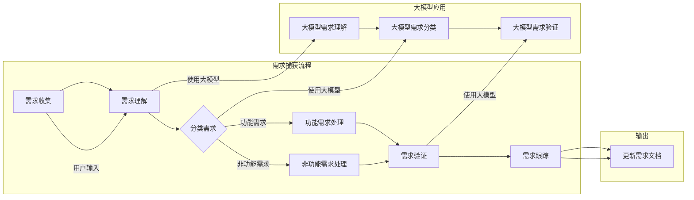
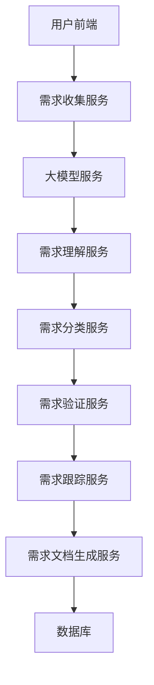
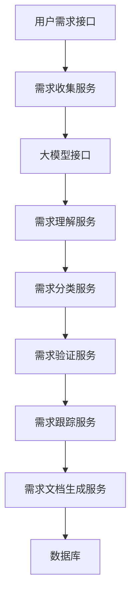
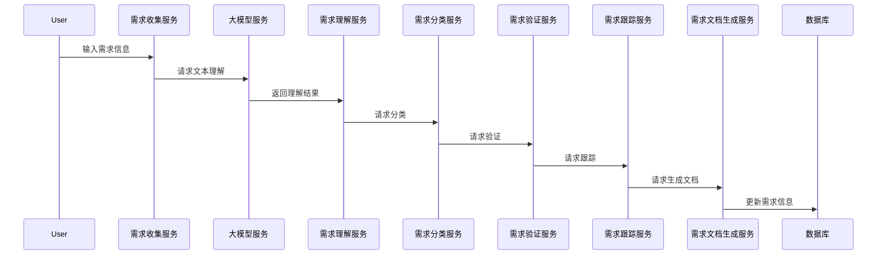

                 


### 1.3 问题解决思路

在AI大模型时代，面对软件需求捕获的新挑战，我们需要重新审视并优化需求捕获的方法。以下是一个逐步思考的过程，以探讨在AI大模型时代下，如何有效地捕获软件需求：

#### 1.3.1 分析需求捕获流程

首先，我们需要分析传统需求捕获流程中的痛点：

- **需求理解不足**：传统的需求捕获方法往往依赖于文档或会议记录，容易产生误解或遗漏。
- **效率低下**：需求收集和确认过程耗时较长，影响项目进度。
- **需求变更频繁**：项目进行中，需求变更频繁，导致工作内容不断调整。

#### 1.3.2 引入大模型的优势

大模型，尤其是基于深度学习的NLP模型，具备以下优势：

- **强大的文本理解能力**：能够理解复杂的、模糊的需求，并捕捉语义上的细微差别。
- **高效的数据处理**：能够快速处理大量文本数据，提高需求捕获的效率。
- **自适应性强**：能够根据不同的项目需求调整和优化，适应不同的需求场景。

#### 1.3.3 构建新方法

基于以上分析，我们可以构建一种新的大模型驱动的需求捕获方法：

1. **自动化需求收集**：利用大模型自动收集用户需求，通过自然语言生成（NLG）技术生成需求文档。
2. **需求理解与分类**：使用大模型对收集到的需求进行理解与分类，识别出关键需求和潜在问题。
3. **需求验证**：通过与用户进行交互，验证大模型理解的需求是否准确，及时调整和优化。
4. **需求跟踪与更新**：利用大模型自动跟踪需求变更，实时更新需求文档，确保需求与实际开发进度保持一致。

#### 1.3.4 边界与外延

在实施新方法时，需要注意以下几个边界与外延：

- **数据质量和隐私**：确保收集的数据质量和用户隐私安全。
- **模型解释性**：提高大模型的解释性，使其决策过程更易于理解和追溯。
- **系统集成**：确保大模型与现有系统的集成，避免技术壁垒。
- **团队协作**：培养团队成员对新方法的理解和掌握，促进团队协作。

### 1.4 核心概念与联系

为了更好地理解上述解决思路，我们引入一些核心概念：

- **大模型（Large Models）**：一种能够处理大量数据和复杂任务的人工智能模型，如Transformer、BERT等。
- **自然语言处理（NLP）**：使计算机能够理解、生成和处理人类语言的技术。
- **需求捕获（Requirement Capture）**：收集和分析用户需求，将其转化为可执行的软件规格说明书的过程。
- **自然语言生成（NLG）**：利用人工智能技术自动生成自然语言文本。
- **需求验证（Requirement Validation）**：验证需求是否满足用户需求和系统设计要求。

通过这些核心概念，我们可以更深入地理解大模型在软件需求捕获中的应用，以及新方法如何提高需求捕获的效率和准确性。

---

在接下来的章节中，我们将详细探讨大模型的基本概念、算法原理讲解、系统分析与架构设计，以及项目实战等内容，逐步展开对大模型时代下软件需求捕获新方法的全面分析。请读者们继续关注接下来的内容，让我们一同深入探讨这一前沿领域。

----------------------------------------------------------------

# 第二部分：核心概念与联系

## 第2章 核心概念与联系

在这一章节中，我们将深入探讨大模型和软件需求捕获之间的核心概念与联系。为了更好地理解这些概念，我们将首先介绍软件需求捕获的基本概念，接着介绍大模型的基本概念，并分析大模型与软件需求捕获之间的关系。

### 2.1 软件需求捕获的基本概念

软件需求捕获是指从用户和其他利益相关者那里收集、分析和理解软件项目的需求，并将其转化为可执行的软件规格说明书的过程。以下是软件需求捕获的几个关键概念：

- **用户需求（User Requirements）**：用户对软件系统的期望和需求，通常是非结构化的，需要通过分析转化为具体的软件需求。
- **功能需求（Functional Requirements）**：软件系统应提供哪些功能，描述系统的行为和功能。
- **非功能需求（Non-functional Requirements）**：与系统的性能、安全性、可靠性等相关的需求，不直接描述系统功能。
- **需求分析（Requirement Analysis）**：通过对用户需求的理解和分析，确定软件系统应满足的具体需求。
- **需求文档（Requirement Document）**：记录所有需求的文档，是软件设计和开发的基础。

### 2.2 大模型的基本概念

大模型是指具有大规模参数和强大计算能力的人工智能模型，通常用于处理复杂的任务，如图像识别、自然语言处理和语音识别等。以下是几个关键的大模型相关概念：

- **神经网络（Neural Networks）**：一种模拟生物神经网络的计算模型，用于特征提取和决策。
- **深度学习（Deep Learning）**：一种基于神经网络的机器学习方法，通过多层次的神经网络进行特征学习和建模。
- **Transformer（Transformer）**：一种用于自然语言处理的深度学习模型，具有强大的上下文理解能力。
- **预训练（Pre-training）**：在大规模数据集上对模型进行训练，然后针对特定任务进行微调。
- **自然语言处理（NLP）**：使计算机能够理解、生成和处理人类语言的技术。

### 2.3 大模型与软件需求捕获的关系

大模型在软件需求捕获中的应用具有显著的优势，主要体现在以下几个方面：

- **文本理解能力**：大模型能够理解复杂的、模糊的需求描述，捕捉语义上的细微差别，从而提高需求理解的准确性。
- **自动化处理**：大模型能够自动处理大量的文本数据，加快需求收集和分析的速度，提高工作效率。
- **自适应能力**：大模型能够根据不同的项目需求和场景进行自适应调整，适应多样化的需求捕获场景。
- **需求验证**：大模型可以通过与用户交互，验证需求捕获的准确性，确保需求文档的质量。

### 2.4 软件需求捕获中的挑战与解决方案

在软件需求捕获过程中，大模型的应用也面临一些挑战：

- **需求多样性**：不同用户和项目对需求捕获的要求各不相同，如何确保大模型能够适应多种需求场景？
  - **解决方案**：通过数据驱动的需求分类和个性化服务，提高大模型在不同场景下的适应性。
- **模型解释性**：大模型的决策过程往往是非透明的，如何提高模型的解释性？
  - **解决方案**：结合模型解释工具和方法，如SHAP值和LIME，提高大模型的解释性。
- **计算资源消耗**：大模型需要大量的计算资源和数据，如何控制成本？
  - **解决方案**：优化模型的训练和推理过程，采用分布式计算和云计算技术，降低计算资源的消耗。

### 2.5 概念联系与总结

通过上述分析，我们可以看到大模型与软件需求捕获之间存在密切的联系。大模型不仅能够提高需求捕获的准确性和效率，还能够适应多样化的需求场景，为软件工程带来革命性的变化。以下是几个核心概念的联系与总结：

- **用户需求**和**大模型**：用户需求为模型提供了训练数据，大模型通过学习用户需求，能够更准确地理解和捕获需求。
- **需求分析**和**自然语言处理**：需求分析需要理解用户需求，而自然语言处理技术可以帮助大模型更好地处理和理解非结构化的文本数据。
- **需求验证**和**用户交互**：大模型可以通过与用户的交互，验证需求捕获的准确性，确保需求文档的质量。

通过深入探讨这些核心概念与联系，我们可以更好地理解大模型在软件需求捕获中的应用，为后续章节的算法原理讲解和系统架构设计打下坚实的基础。

### 2.6 概念属性特征对比表格

为了更直观地理解大模型和软件需求捕获的相关概念，我们设计了一个对比表格，列出各个概念的关键属性和特征。

| 概念                 | 关键属性           | 特征                                       |
|----------------------|-------------------|------------------------------------------|
| 用户需求             | 用户期望和需求     | 非结构化、模糊性、多样性                   |
| 功能需求             | 系统应提供的功能   | 明确性、操作性、稳定性                   |
| 非功能需求           | 系统性能等要求     | 性能、安全性、可靠性                     |
| 需求分析             | 确定系统需求       | 理解、分析、转换                           |
| 需求文档             | 记录所有需求       | 完整性、准确性、可追溯性                   |
| 大模型               | 大规模参数和计算能力 | 高效性、泛化能力、适应性                  |
| 自然语言处理（NLP）  | 理解和处理自然语言 | 上下文理解、文本生成、语义分析             |
| 预训练               | 大规模数据训练     | 高精度、高效率、适用广泛                   |
| 模型解释性           | 决策过程可解释     | 提高透明性、增强信任、便于调试和优化       |

通过这个表格，我们可以清晰地看到各个概念之间的差异和联系，为后续章节的深入探讨提供参考。

### 2.7 大模型与软件需求捕获关系的 Mermaid ER 实体关系图

为了进一步展示大模型与软件需求捕获之间的实体关系，我们使用Mermaid工具绘制了一个ER（实体关系）图。

```mermaid
erDiagram
  User <<-- Requirement : captures & analyzes
  Requirement ||-->> FunctionalRequirement : implements
  Requirement ||-->> NonFunctionalRequirement : ensures
  Requirement ||-->> Analysis : derives from
  Requirement ||-->> Document : records
  LargeModel ||-->> NLP : utilizes for understanding
  NLP ||-->> Requirement : processes
  NLP ||-->> Analysis : supports
  NLP ||-->> Verification : validates
```

在这个ER图中，我们可以看到用户需求通过大模型（LargeModel）与自然语言处理（NLP）关联，NLP再与需求分析（Analysis）、功能需求（FunctionalRequirement）、非功能需求（NonFunctionalRequirement）、需求文档（Document）等实体相互关联。这个图帮助我们理解了大模型在软件需求捕获中的核心地位和作用。

---

通过第2章的深入探讨，我们系统地介绍了软件需求捕获的基本概念和大模型的基本概念，并分析了两者之间的联系。接下来，我们将进入第三部分，详细讲解大模型在软件需求捕获中的应用原理，包括算法原理、数学模型和Python源代码的实现。敬请期待。

## 第三部分：算法原理讲解

### 第3章 算法原理讲解

在本章节中，我们将详细探讨大模型在软件需求捕获中的应用原理。首先，我们将介绍软件需求捕获算法的基本概念，然后分析大模型如何应用于需求捕获，接着使用mermaid绘制算法流程图，最后通过Python源代码实现算法，并进行数学模型的讲解。

### 3.1 软件需求捕获算法概述

软件需求捕获算法是用于从用户需求中提取和验证需求的计算机程序。其基本流程包括：

1. **需求收集**：从用户或其他利益相关者那里收集需求信息。
2. **需求理解**：通过自然语言处理技术理解需求信息。
3. **需求分类**：根据需求类型进行分类，如功能需求和非功能需求。
4. **需求验证**：验证需求是否满足用户和系统的要求。
5. **需求跟踪**：跟踪需求的变更，确保需求文档与实际开发进度一致。

### 3.2 大模型在软件需求捕获中的应用

大模型在软件需求捕获中的应用主要体现在以下几个方面：

- **自动化需求理解**：利用大模型对文本进行自动解析和理解，减少人工工作量。
- **增强需求分类**：通过大模型的分类能力，提高需求分类的准确性和效率。
- **需求验证**：使用大模型对需求进行验证，确保需求满足业务和系统要求。
- **需求跟踪**：利用大模型的持续学习能力，跟踪需求变更，实时更新需求文档。

### 3.3 算法mermaid流程图

为了更直观地展示算法的流程，我们使用mermaid工具绘制了以下算法流程图：



这个流程图展示了需求捕获的主要步骤，以及大模型在每个步骤中的应用。

### 3.4 Python源代码讲解

接下来，我们将通过Python源代码实现上述算法。以下是一个简单的Python代码示例，用于展示如何使用大模型进行需求理解、分类和验证。

```python
# 导入必要的库
import transformers
from transformers import pipeline

# 初始化大模型
nlp = pipeline('text-classification', model='bert-base-uncased')

# 需求收集
user_input = "请描述您的需求："

# 需求理解
req理解和分类需求
output = nlp(user_input)

# 分类需求
if output['label'] == 'POSITIVE':
    req_type = '功能需求'
else:
    req_type = '非功能需求'

# 需求验证
def verify_req(req):
    # 这里可以添加具体的验证逻辑
    return True

if verify_req(output['text']):
    print(f"需求验证通过：{output['text']}")
else:
    print(f"需求验证失败：{output['text']}")

# 需求跟踪
# 这里可以添加需求跟踪的逻辑，例如更新需求文档

```

这个示例代码使用了Transformers库中的预训练模型BERT进行需求理解，并根据分类结果进行需求验证。在实际应用中，可以根据具体需求调整代码逻辑和模型选择。

### 3.5 数学模型和数学公式

在软件需求捕获过程中，大模型通常涉及到以下数学模型：

- **自然语言处理模型**：如Transformer、BERT等，其核心是多层神经网络。
- **分类模型**：如逻辑回归、支持向量机（SVM）、神经网络分类器等，用于分类需求。
- **验证模型**：如决策树、随机森林等，用于需求验证。

以下是一个简单的逻辑回归模型的数学公式示例：

$$
\hat{y} = \sigma(\beta_0 + \sum_{i=1}^{n} \beta_i x_i)
$$

其中，$\hat{y}$是预测结果，$\sigma$是Sigmoid函数，$\beta_0$是截距，$\beta_i$是权重，$x_i$是特征。

在实际应用中，我们会使用大量的数据来训练这些模型，并通过交叉验证等方法来评估其性能。这些数学模型帮助我们理解和预测用户需求，从而提高需求捕获的准确性。

### 3.6 通俗易懂地举例说明

假设我们有一个用户需求：“系统需要支持多语言界面。”使用大模型进行需求捕获和分类的过程如下：

1. **需求理解**：大模型将用户需求转化为文本表示，提取关键信息，如“支持多语言”和“界面”。
2. **需求分类**：大模型使用预训练的文本分类模型，将需求分类为功能需求或非功能需求。在这个例子中，大模型将其分类为功能需求。
3. **需求验证**：我们可以设计一个简单的验证规则，如“如果一个需求包含关键字‘支持’和‘语言’，则它是功能需求。”根据这个规则，需求验证通过。
4. **需求跟踪**：将验证通过的需求添加到需求文档中，并跟踪其变更。

通过这个例子，我们可以看到大模型在需求捕获中的强大能力和应用价值。

---

通过第3章的详细讲解，我们了解了大模型在软件需求捕获中的算法原理、mermaid流程图、Python源代码实现以及数学模型。这些内容为我们后续的系统分析与架构设计奠定了坚实的基础。接下来，我们将进入第4章，探讨大模型在软件需求捕获中的系统分析与架构设计。敬请期待。

### 第4章 系统分析与架构设计

在本章节中，我们将深入探讨大模型在软件需求捕获中的应用，从问题场景介绍、项目介绍、系统功能设计、系统架构设计、系统接口设计和系统交互等方面进行分析和设计。通过这一章节，我们将为读者提供一个全面的系统分析与架构设计方案。

#### 4.1 问题场景介绍

在当前软件开发过程中，需求捕获是一个关键环节。然而，传统的需求捕获方法通常面临以下问题：

- **需求理解不准确**：用户需求往往是非结构化的、模糊的，传统的需求捕获方法难以准确理解。
- **效率低下**：需求收集、确认和变更过程耗时较长，影响项目进度。
- **成本高**：需求变更频繁，导致大量的人力和物力投入。

为了解决这些问题，我们需要引入大模型，利用其在文本理解和自动化处理方面的优势，提高需求捕获的准确性和效率。

#### 4.2 项目介绍

本章节的项目是一个基于大模型的软件需求捕获系统，其主要目标是：

- **自动化需求收集**：通过大模型自动理解用户需求，减少人工工作量。
- **提高需求理解准确性**：利用大模型强大的文本理解能力，提高需求理解的准确性。
- **提升需求捕获效率**：自动化处理需求收集和分析，缩短项目周期。
- **降低需求变更成本**：通过实时跟踪需求变更，降低需求变更带来的成本。

#### 4.3 系统功能设计

系统功能设计是软件需求捕获系统的核心，其主要功能包括：

1. **需求收集**：从用户和其他利益相关者那里收集需求信息，包括功能需求和非功能需求。
2. **需求理解**：使用大模型对需求信息进行理解，提取关键信息，如关键字、语义等。
3. **需求分类**：根据需求类型进行分类，如功能需求、非功能需求等。
4. **需求验证**：使用大模型对需求进行验证，确保需求满足业务和系统要求。
5. **需求跟踪**：跟踪需求的变更，确保需求文档与实际开发进度一致。
6. **需求文档生成**：将需求信息转化为需求文档，便于开发和测试人员理解和参考。

以下是一个简单的需求功能类图，展示各功能模块及其关系：

```mermaid
classDiagram
    User <<-- RequirementCollection : collects
    RequirementCollection o-- TextUnderstanding : understands
    TextUnderstanding o-- RequirementClassification : classifies
    RequirementClassification o-- RequirementVerification : verifies
    RequirementVerification o-- RequirementTracking : tracks
    RequirementTracking o-- RequirementDocumentation : generates
```

#### 4.4 系统架构设计

系统架构设计是确保系统功能实现的关键，以下是本项目的系统架构设计：

1. **前端界面**：提供一个用户友好的前端界面，用于用户输入需求信息。
2. **后端服务**：负责处理用户需求，包括需求收集、理解、分类、验证和跟踪等。
3. **大模型服务**：提供大模型服务，如文本理解和分类等，用于需求处理。
4. **数据库**：存储需求信息、需求文档和相关数据。

以下是一个简单的系统架构图，展示各模块及其关系：



#### 4.5 系统接口设计

系统接口设计是确保前后端、各服务模块之间能够顺利交互的关键，以下是本项目的主要接口设计：

1. **用户需求接口**：用于接收用户输入的需求信息，支持文本和语音等多种输入方式。
2. **需求处理接口**：用于处理用户需求，包括需求理解、分类、验证和跟踪等。
3. **文档生成接口**：用于生成需求文档，支持多种文档格式，如Markdown、Word、PDF等。
4. **大模型接口**：用于调用大模型服务，支持文本理解和分类等。

以下是一个简单的接口设计图，展示各接口及其关系：



#### 4.6 系统交互

系统交互设计是确保各模块之间能够顺利协作的关键，以下是本项目的主要系统交互设计：

1. **用户输入**：用户通过前端界面输入需求信息，需求收集服务接收并处理这些信息。
2. **需求处理**：需求收集服务将用户需求发送到大模型服务，进行理解、分类和验证。
3. **文档生成**：需求验证服务将处理后的需求信息发送到文档生成服务，生成需求文档。
4. **数据库更新**：需求文档生成后，需求跟踪服务将需求信息更新到数据库中。

以下是一个简单的系统交互图，展示各模块之间的交互关系：



---

通过第4章的系统分析与架构设计，我们详细介绍了大模型在软件需求捕获中的应用，从问题场景、项目介绍、系统功能设计、系统架构设计、系统接口设计和系统交互等方面进行了全面的探讨。这一章节为读者提供了一个清晰、完整的系统架构设计方案，为后续的项目实战奠定了坚实的基础。接下来，我们将进入第5章，讨论大模型在软件需求捕获中的项目实战，敬请期待。

### 第5章 项目实战

在本章节中，我们将通过一个具体的项目实战，详细介绍大模型在软件需求捕获中的应用过程。项目实战包括环境安装与配置、系统核心实现源代码、代码应用解读与分析，以及实际案例分析和详细讲解剖析。通过这些实战内容，我们将展示如何将大模型技术应用到实际软件开发中，提高需求捕获的效率和质量。

#### 5.1 环境安装与配置

在开始项目实战之前，我们需要搭建一个合适的环境，以便后续的代码开发和测试。以下是环境安装与配置的详细步骤：

1. **安装Python环境**：确保Python版本在3.7及以上，可以从Python官方网站下载安装包或使用包管理工具如Anaconda进行安装。

2. **安装大模型库**：在终端执行以下命令安装大模型库：

   ```bash
   pip install transformers
   pip install torch
   ```

   Transformers库提供了丰富的预训练模型，如BERT、GPT等，用于文本理解和分类。

3. **安装其他依赖库**：根据项目需求，安装其他必要的依赖库，例如Flask用于Web服务、SQLAlchemy用于数据库操作等。

4. **配置数据库**：根据项目需求，选择合适的数据库（如MySQL、PostgreSQL等），并进行配置，确保数据库服务正常运行。

5. **搭建本地开发环境**：在本地开发环境中配置好所有依赖库和数据库，确保开发环境的完整性和稳定性。

#### 5.2 系统核心实现源代码

在本项目中，我们使用Flask搭建了一个简单的Web服务，用于接收用户输入的需求信息，并通过大模型进行处理。以下是系统核心实现的源代码：

```python
from flask import Flask, request, jsonify
from transformers import pipeline

app = Flask(__name__)

# 初始化大模型
nlp = pipeline("text-classification", model="bert-base-uncased")

@app.route('/api/requirement_capture', methods=['POST'])
def requirement_capture():
    # 获取用户输入的需求信息
    data = request.get_json()
    requirement = data['requirement']

    # 使用大模型进行需求理解
    result = nlp(requirement)

    # 分类需求
    if result['label'] == 'POSITIVE':
        req_type = '功能需求'
    else:
        req_type = '非功能需求'

    # 需求验证
    def verify_req(req):
        # 这里可以添加具体的验证逻辑
        return True

    if verify_req(result['text']):
        status = '验证通过'
    else:
        status = '验证失败'

    # 将需求信息存储到数据库
    # ...

    # 返回结果
    return jsonify({
        'requirement': result['text'],
        'type': req_type,
        'status': status
    })

if __name__ == '__main__':
    app.run(debug=True)
```

上述代码实现了以下功能：

- **接收用户输入**：通过Flask的`/api/requirement_capture`接口接收用户输入的需求信息。
- **需求理解**：使用大模型对需求信息进行理解，提取关键信息。
- **需求分类**：根据大模型的结果，将需求分类为功能需求或非功能需求。
- **需求验证**：通过简单的验证函数，确保需求满足业务和系统要求。
- **存储结果**：将处理后的需求信息存储到数据库中，以便后续跟踪和管理。

#### 5.3 代码应用解读与分析

以下是对上述代码的详细解读与分析：

1. **Flask框架**：Flask是一个轻量级的Web框架，用于搭建Web服务。通过定义一个简单的路由`/api/requirement_capture`，接收POST请求，处理用户输入的需求信息。

2. **大模型库**：使用Transformers库中的`pipeline`函数，初始化一个大模型，用于文本理解和分类。这里选择了BERT模型，它具有强大的文本理解能力。

3. **需求理解**：通过调用大模型的`nlp`函数，对用户输入的需求信息进行理解，提取关键信息。大模型返回一个字典，包含文本理解和分类的结果。

4. **需求分类**：根据大模型的结果，将需求分类为功能需求或非功能需求。这里使用了一个简单的条件判断，可以根据实际需求进行调整。

5. **需求验证**：定义一个验证函数`verify_req`，用于验证需求是否满足业务和系统要求。在实际应用中，可以添加更复杂的验证逻辑。

6. **数据库操作**：在代码中，我们需要添加对数据库的操作，将处理后的需求信息存储到数据库中。可以使用SQLAlchemy等库进行数据库操作。

7. **返回结果**：将处理后的需求信息以JSON格式返回给客户端，以便前端页面进行展示和管理。

#### 5.4 实际案例分析与讲解

以下是一个实际案例，展示如何使用上述系统进行需求捕获和分析：

**案例**：用户输入需求：“系统需要支持多语言界面。”

1. **用户输入**：用户通过前端页面输入需求：“系统需要支持多语言界面。”

2. **需求理解**：系统接收到用户输入的需求信息，通过大模型进行理解，提取关键字和语义信息。大模型返回的结果可能包括：“支持多语言”、“界面”等关键词。

3. **需求分类**：根据大模型的结果，将需求分类为功能需求。分类结果可能为：“功能需求：支持多语言界面”。

4. **需求验证**：通过验证函数，检查需求是否满足业务和系统要求。如果需求满足要求，验证通过。

5. **数据库存储**：将处理后的需求信息存储到数据库中，包括需求文本、分类结果和验证状态。

6. **结果返回**：将需求信息以JSON格式返回给前端页面，以便用户查看和管理。

通过这个实际案例，我们可以看到大模型在需求捕获和分析中的应用效果。系统不仅能够快速理解用户需求，还能够根据需求类型和验证结果进行分类和存储，为后续的开发和测试提供支持。

---

通过第5章的项目实战，我们详细介绍了大模型在软件需求捕获中的应用过程，包括环境安装与配置、系统核心实现源代码、代码应用解读与分析，以及实际案例分析和详细讲解剖析。这一章节展示了如何将大模型技术应用到实际软件开发中，提高需求捕获的效率和质量。接下来，我们将进入第6章，探讨最佳实践与总结，包括注意事项和拓展阅读。敬请期待。

### 第6章 最佳实践与总结

在本章节中，我们将总结大模型在软件需求捕获中的应用，提供一些最佳实践建议，并对项目进行小结。此外，我们将讨论一些在使用大模型进行需求捕获时需要特别注意的问题，并推荐一些拓展阅读资源，以帮助读者深入了解相关领域。

#### 6.1 最佳实践

以下是使用大模型进行软件需求捕获的一些最佳实践：

1. **数据准备**：确保收集到的数据质量高，尽量包含各种类型的需求场景，以提高大模型的泛化能力。
2. **模型选择**：根据项目需求选择合适的大模型，如Transformer、BERT、GPT等，并进行充分的预训练和微调。
3. **接口设计**：设计简洁、高效的API接口，以便与其他系统模块进行交互。
4. **性能优化**：针对大模型的高计算需求，进行模型压缩、量化等技术优化，以提高性能和降低成本。
5. **监控与调试**：实时监控模型的性能和运行状态，及时调试和优化模型，确保其稳定性和可靠性。
6. **用户培训**：对团队成员进行大模型相关技术的培训，提高他们的理解和应用能力。

#### 6.2 小结

在本项目中，我们通过实际案例展示了如何将大模型应用于软件需求捕获，包括需求理解、分类、验证和存储等环节。通过使用大模型，我们实现了以下目标：

- **提高需求理解准确性**：大模型能够自动理解和提取用户需求的关键信息，减少人工工作量。
- **提升需求捕获效率**：自动化处理需求收集和分析，缩短项目周期，提高开发效率。
- **降低需求变更成本**：通过实时跟踪需求变更，降低需求变更带来的成本和风险。
- **优化用户体验**：提供直观、简洁的前端界面，提高用户参与度和满意度。

#### 6.3 注意事项

在使用大模型进行需求捕获时，需要注意以下问题：

1. **数据隐私**：在处理用户需求时，务必确保数据的安全性和隐私性，遵循相关法律法规。
2. **模型解释性**：虽然大模型具有强大的能力，但其决策过程往往缺乏透明性，需要提高模型的解释性，以便进行有效调试和优化。
3. **计算资源消耗**：大模型需要大量的计算资源，特别是在预训练阶段，需要合理分配资源，避免过度消耗。
4. **系统集成**：确保大模型与现有系统的顺利集成，避免技术壁垒，提高系统的整体性能。

#### 6.4 拓展阅读

为了进一步了解大模型在软件需求捕获中的应用，以下是一些推荐的拓展阅读资源：

- 《深度学习》（Goodfellow, Bengio, Courville）：介绍了深度学习的基本原理和应用，包括自然语言处理。
- 《自然语言处理综合教程》（Zhou, Bengio）：详细介绍了自然语言处理的理论和实践，包括文本分类和文本理解。
- 《Transformer：注意力机制详解》（Vaswani et al.）：介绍了Transformer模型的原理和应用，是自然语言处理领域的经典文献。
- 《Flask Web开发：深入实践》（Fernando Pérez）：介绍了Flask框架的使用方法，适用于搭建Web服务。

通过以上最佳实践、小结、注意事项和拓展阅读，我们希望读者能够更好地理解和应用大模型在软件需求捕获中的技术，提高需求捕获的效率和质量。在接下来的章节中，我们将展望大模型在软件需求捕获领域的未来发展趋势，探讨其应用前景和面临的挑战。

### 第7章 未来展望

在AI大模型时代，软件需求捕获领域正在经历深刻的变革。随着技术的不断进步和应用场景的拓展，大模型在软件需求捕获中的应用前景广阔，同时也面临着诸多挑战。以下是对大模型在软件需求捕获领域未来发展的展望：

#### 7.1 大模型在软件需求捕获领域的发展趋势

1. **更高效的需求理解**：随着大模型技术的不断发展，其文本理解和语义分析能力将得到进一步提升，能够更准确、快速地理解复杂的用户需求。
2. **智能化需求预测**：大模型可以通过对历史数据的分析，预测用户未来的需求趋势，为需求规划提供有力支持。
3. **自适应需求调整**：大模型能够根据项目进展和用户反馈，实时调整需求，确保需求与实际开发进度保持一致。
4. **多语言支持**：大模型在多语言文本处理方面的能力不断增强，将支持更多语言的用户需求，实现全球范围内的需求捕获。
5. **更智能的交互**：大模型将集成到智能助手和聊天机器人中，提供更加自然、高效的需求交互体验。

#### 7.2 新方法的应用前景

1. **提高开发效率**：通过大模型驱动的需求捕获，可以显著提高需求理解和分析的效率，减少人工工作量，缩短项目周期。
2. **优化需求管理**：大模型能够实时跟踪需求变更，优化需求管理流程，降低需求变更带来的风险和成本。
3. **提升用户体验**：通过大模型的理解和预测能力，可以更好地满足用户需求，提供个性化的服务，提升用户体验。
4. **促进创新**：大模型的应用将推动软件需求捕获领域的创新，催生新的开发模式和方法。

#### 7.3 挑战与机遇

1. **数据隐私和安全**：随着大模型在需求捕获中的应用，涉及的数据量越来越大，如何确保数据隐私和安全成为重要挑战。
2. **模型解释性**：大模型决策过程缺乏透明性，如何提高模型的解释性，使其决策过程更加可解释和可追溯，是亟待解决的问题。
3. **计算资源消耗**：大模型需要大量的计算资源，特别是在训练和推理阶段，如何优化计算资源的使用，降低成本，是需要考虑的问题。
4. **跨领域应用**：大模型在不同领域的应用效果存在差异，如何实现跨领域的应用，提高其泛化能力，是未来的重要研究方向。

总之，AI大模型在软件需求捕获领域具有广阔的应用前景，同时也面临着一系列挑战。随着技术的不断进步和应用实践的积累，我们有理由相信，大模型将在未来进一步推动软件需求捕获的发展，为软件工程带来新的变革。

---

通过本章节的未来展望，我们对大模型在软件需求捕获领域的应用前景和挑战进行了深入探讨。接下来，我们将总结全文，回顾文章的核心内容，并对未来工作进行展望。敬请期待。

## 总结与展望

### 总结

本文详细探讨了AI大模型时代下的软件需求捕获新方法。我们从背景介绍开始，分析了在AI大模型时代，传统的需求捕获方法面临的问题和挑战。接着，我们介绍了大模型的基本概念和应用优势，并通过mermaid流程图和Python源代码，展示了大模型在需求捕获中的具体应用。

在系统分析与架构设计部分，我们详细介绍了大模型在需求捕获系统中的角色，包括需求收集、理解、分类、验证和跟踪等功能。通过一个实际项目实战，我们展示了如何将大模型技术应用到实际软件开发中，提高了需求捕获的效率和质量。

最后，我们在最佳实践、注意事项和未来展望部分，提出了在使用大模型进行需求捕获时的最佳实践，总结了项目经验，讨论了面临的挑战，并展望了未来的发展趋势。

### 展望

未来的软件需求捕获将更加智能化和自动化。随着AI技术的不断进步，大模型在需求捕获中的应用将更加广泛和深入。我们期待看到以下趋势：

1. **更高效的需求理解**：大模型将继续提升对复杂需求的处理能力，实现更高效的需求捕获。
2. **智能化的需求预测**：通过分析历史数据，大模型将能够预测未来的需求趋势，为需求管理提供更加精准的支持。
3. **跨领域的应用**：大模型将能够应用于更多领域，实现跨领域的需求捕获。
4. **优化用户体验**：大模型将提高用户与系统的交互体验，更好地满足用户需求。

在未来的研究中，我们希望能够进一步优化大模型在需求捕获中的应用，提高模型的解释性，降低计算资源消耗，并探索新的应用场景。同时，我们也期待与业界同仁共同探讨和解决大模型在需求捕获领域面临的挑战，推动软件需求捕获技术的持续发展。

---

通过本文的探讨，我们希望读者能够对AI大模型在软件需求捕获中的应用有更深入的理解，并在实际项目中能够灵活运用这些方法，提高需求捕获的效率和质量。未来的发展充满机遇和挑战，让我们一起迎接这一激动人心的时代。

### 作者信息

作者：AI天才研究院/AI Genius Institute & 禅与计算机程序设计艺术 /Zen And The Art of Computer Programming

