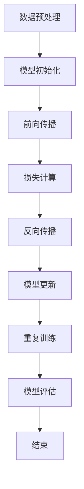

                 


### 大模型概念学习与提示词抽象化

**关键词：** 大模型学习、提示词抽象化、自然语言处理、计算机视觉、强化学习、算法优化

**摘要：** 本文旨在探讨大模型学习中的核心概念——提示词抽象化。通过对大模型学习原理和提示词抽象化方法的深入分析，结合实际应用场景，本文将展示大模型学习在自然语言处理、计算机视觉和强化学习等领域的应用，并探讨优化策略，为AI领域的进一步发展提供思路。

**目录：**

## 引言

### 1.1 问题的背景和重要性

### 1.2 问题描述

### 1.3 问题解决思路

### 1.4 概念结构与核心要素

## 大模型学习原理

### 2.1 大模型基础

### 2.2 大模型学习过程

### 2.3 大模型学习算法

## 提示词抽象化方法

### 3.1 提示词抽象化概念

### 3.2 提示词抽象化策略

### 3.3 提示词抽象化工具

## 大模型学习应用

### 4.1 应用领域与案例分析

### 4.2 提示词抽象化在特定应用中的应用

## 实战与优化

### 5.1 大模型学习项目实战

### 5.2 大模型学习与提示词抽象化的优化策略

## 附录

### A. 数学模型与公式

### B. Mermaid流程图

### C. 拓展阅读

### **引言**

### 1.1 问题的背景和重要性

人工智能（AI）在过去几十年里取得了惊人的进展，从简单的规则系统到复杂的深度学习模型，AI的应用范围日益扩大。然而，随着AI技术的发展，大模型学习成为一个重要的研究领域。大模型学习不仅能够处理复杂数据，还能实现更高级的智能功能，如自然语言处理、计算机视觉和强化学习。

自然语言处理（NLP）是AI的一个重要分支，旨在使计算机能够理解和生成人类语言。近年来，NLP取得了显著进展，如机器翻译、文本分类和问答系统。然而，这些进展在很大程度上得益于大模型学习技术的应用。大模型能够捕捉到语言中的复杂模式和结构，使得自然语言处理任务变得更加准确和高效。

计算机视觉是另一个受益于大模型学习的领域。通过深度学习算法，计算机可以自动识别图像中的对象、场景和动作。这种技术在图像识别、目标检测和图像生成等方面都有广泛的应用。例如，自动驾驶汽车使用计算机视觉技术来识别道路上的行人和车辆，从而提高行驶安全。

强化学习是AI的另一个重要分支，它通过模拟环境中的交互来训练智能体。强化学习在游戏AI、自动驾驶和虚拟环境模拟等方面有着广泛的应用。大模型学习为强化学习提供了更强大的学习能力和更广泛的应用范围。

总之，大模型学习在AI领域的地位和影响不可忽视。它不仅推动了AI技术的进步，还带来了许多新的应用机会。然而，大模型学习也面临着一系列挑战，如数据预处理、模型训练和提示词抽象化等。提示词抽象化在大模型学习中起着关键作用，它能够帮助模型更好地理解和生成信息。本文将深入探讨大模型学习中的提示词抽象化方法，并结合实际应用场景进行分析。

### 1.2 问题描述

在大模型学习中，提示词抽象化是一个关键问题。提示词是模型理解任务和生成输出的关键因素，它们的抽象化程度直接影响模型的性能和应用效果。然而，如何有效地进行提示词抽象化仍然是一个具有挑战性的问题。

首先，大模型学习中的提示词通常具有复杂的语义和结构。这些提示词可能包含多个层次的信息，包括表面信息、隐含信息和上下文信息。如何提取和整合这些信息，使其抽象化程度更高，是一个重要的研究问题。

其次，提示词的抽象化过程需要考虑不同领域和应用场景的特殊需求。例如，在自然语言处理中，提示词可能需要具备语言的连贯性和逻辑性；在计算机视觉中，提示词可能需要与图像特征紧密相关。因此，如何设计通用的抽象化策略，以适应不同领域和应用场景，是另一个挑战。

此外，大模型学习中的提示词抽象化还面临着数据质量和数量的问题。高质量的提示词需要大量的数据来支持，而数据的质量和数量直接影响抽象化的效果。如何有效地收集和利用数据，以提高提示词的抽象化质量，也是一个值得研究的问题。

总之，大模型学习中的提示词抽象化是一个复杂且具有挑战性的问题。解决这一问题不仅需要深入理解大模型学习的原理和方法，还需要结合实际应用场景，设计出有效的抽象化策略。本文将首先探讨大模型学习的基本原理，然后深入分析提示词抽象化的方法和技术，以期为这一问题的解决提供一些思路。

### 1.3 问题解决思路

为了解决大模型学习中的提示词抽象化问题，我们需要从多个角度进行思考。以下是一些可能的问题解决思路：

#### 1.3.1 基本原理理解

首先，我们需要深入理解大模型学习的基本原理，包括数据预处理、模型训练和模型评估等环节。通过理解这些基本原理，我们可以更好地设计提示词抽象化的策略。例如，在数据预处理阶段，我们可以通过数据清洗、数据增强和数据集划分等技术来提高提示词的抽象化质量。

#### 1.3.2 提示词提取与生成

其次，我们需要研究提示词的提取与生成方法。在自然语言处理领域，我们可以利用词向量、语义角色标注和依存句法分析等技术来提取和生成高质量的提示词。在计算机视觉领域，我们可以利用图像特征提取、目标检测和场景理解等技术来生成与图像内容相关的提示词。

#### 1.3.3 语义分析与上下文理解

此外，语义分析和上下文理解在提示词抽象化中起着关键作用。通过使用词嵌入、语义角色标注和依存句法分析等技术，我们可以捕捉到提示词的语义信息和上下文关系，从而提高抽象化程度。

#### 1.3.4 领域适应性与通用性

为了使提示词抽象化策略具有广泛的适应性，我们需要设计出既适用于特定领域又具有通用性的方法。例如，在自然语言处理中，我们可以使用领域特定的语言模型和知识图谱来生成和优化提示词。在计算机视觉中，我们可以结合图像内容分析和领域知识来提高提示词的抽象化质量。

#### 1.3.5 数据质量和数量

最后，我们需要关注数据质量和数量对提示词抽象化效果的影响。通过数据清洗、数据增强和数据集划分等技术，我们可以提高数据的利用效率，从而提高提示词的抽象化质量。

总之，解决大模型学习中的提示词抽象化问题需要多方面的努力。通过深入理解基本原理、研究提示词提取与生成方法、加强语义分析与上下文理解、提高领域适应性和通用性，以及关注数据质量和数量，我们可以设计出更有效、更可靠的提示词抽象化策略，从而提高大模型学习的整体性能和应用效果。

### 1.4 概念结构与核心要素

为了更好地理解和解决大模型学习中的提示词抽象化问题，我们需要梳理相关的概念结构，并明确核心要素。以下是该问题的概念结构与核心要素：

#### 概念结构

1. **大模型学习**：大模型学习是一种基于深度学习的机器学习方法，它通过大量数据和复杂网络结构来训练模型，以实现智能任务。
2. **提示词**：提示词是指用于引导模型理解和生成信息的文字或图像，它是大模型学习中的一个关键输入。
3. **抽象化**：抽象化是指将具体的、详细的、低层级的概念转化为更为通用、简洁、高层级的概念的过程。
4. **数据预处理**：数据预处理包括数据清洗、数据增强和数据集划分等步骤，它是大模型学习的基础。
5. **模型训练**：模型训练是指通过输入数据来训练模型，使其能够学习和识别各种模式和规律。
6. **模型优化**：模型优化包括超参数调优、模型剪枝和模型压缩等技术，以提高模型的性能和效率。
7. **模型评估**：模型评估是指通过测试数据来评估模型的性能，包括准确率、召回率和F1分数等指标。

#### 核心要素

1. **数据质量**：高质量的提示词数据是进行有效抽象化的前提，它直接影响模型的性能和应用效果。
2. **算法选择**：选择合适的算法进行提示词提取和生成，能够提高抽象化的效果和效率。
3. **语义理解**：通过语义分析和上下文理解，可以捕捉到提示词的深层含义，从而提高抽象化的质量。
4. **领域适应性**：针对特定领域和应用场景，设计出适应性的抽象化策略，可以提高模型的实用性和效果。
5. **模型效率**：优化模型的结构和参数，以提高模型训练和预测的效率，降低计算成本。

通过明确概念结构和核心要素，我们可以更好地理解和解决大模型学习中的提示词抽象化问题，从而提高模型的性能和应用效果。

### 2.1 大模型基础

大模型学习，即使用大型神经网络模型进行机器学习的过程，其核心在于模型规模和参数数量的巨大。这种模型通常由数十亿个参数构成，使得它们能够捕捉到复杂数据中的潜在模式和规律。

首先，大模型的定义与特点是其规模庞大。这种规模不仅体现在模型参数的数量上，还体现在训练数据的规模上。大模型通常需要成千上万的训练样本，以从海量数据中学习到有效的特征和模式。这种大规模的特性使得大模型在处理复杂数据集时具有显著的优势，例如在自然语言处理、计算机视觉和强化学习等领域的任务中。

大模型的基本架构通常包括多个层次，从输入层到输出层，每一层都由大量的神经元（节点）构成。这些神经元通过前向传播和反向传播的方式进行信息的传递和参数的更新。典型的架构如深度神经网络（DNN）、卷积神经网络（CNN）和循环神经网络（RNN），以及它们的变体，如Transformer模型。

大模型的学习机制主要依赖于以下步骤：

1. **数据预处理**：在训练之前，需要将输入数据进行标准化和归一化处理，以便模型能够稳定地进行学习。
2. **模型初始化**：通过随机初始化模型参数，为训练过程提供一个初始状态。
3. **前向传播**：输入数据通过模型的不同层次，每一层都将输入与权重进行点积，并加上偏置项，然后通过激活函数产生输出。
4. **损失计算**：通过输出与真实标签之间的差异，计算损失函数的值，如均方误差（MSE）或交叉熵损失。
5. **反向传播**：计算损失函数关于模型参数的梯度，并通过反向传播算法将这些梯度传递回模型的每一层，更新模型参数。
6. **优化过程**：使用优化算法，如随机梯度下降（SGD）、Adam等，来更新模型参数，以最小化损失函数。

通过这些步骤，大模型能够不断调整其参数，从而提高对数据中潜在模式的识别能力。大模型的学习过程具有以下几个关键特点：

1. **自适应性**：大模型能够自动适应不同的数据分布和任务需求，通过学习大量数据和调整模型参数，使其能够泛化到新的数据集。
2. **泛化能力**：大模型通过大量训练数据的学习，能够较好地泛化到未见过的数据，提高模型的鲁棒性和实用性。
3. **计算资源需求**：由于大模型参数数量庞大，训练过程中需要大量的计算资源和时间，这限制了其应用的范围和速度。

总之，大模型学习通过大规模的参数和复杂的网络结构，实现了对复杂数据的高效学习与处理，成为现代机器学习领域的重要研究方向。然而，这也带来了计算资源消耗大、训练过程复杂等挑战，需要不断优化和改进。

### 2.2 大模型学习过程

大模型学习的整个过程可以分为几个关键阶段：数据预处理、模型训练、模型优化和模型评估。每一个阶段都有其独特的方法和挑战，下面将逐一详细说明。

#### 数据预处理

数据预处理是模型训练的第一步，也是至关重要的一步。其目的是将原始数据转换为适合模型训练的形式。以下是一些常见的数据预处理方法：

1. **数据清洗**：去除数据集中的噪声和错误，如缺失值、异常值和重复数据。这一步通常需要人工干预或使用自动化工具进行。
2. **数据标准化和归一化**：将数据集中的数值缩放到一个统一的范围内，如[0, 1]或[-1, 1]，以减少数据之间的差异，提高模型的训练效果。
3. **数据增强**：通过旋转、翻转、裁剪、颜色调整等操作生成新的数据样本，以增加训练数据的多样性，防止模型过拟合。
4. **数据集划分**：将数据集划分为训练集、验证集和测试集，以评估模型的性能。通常，训练集用于模型的训练，验证集用于调参和模型选择，测试集用于最终的模型评估。

#### 模型训练

模型训练是整个大模型学习过程的核心，其目标是使模型能够从数据中学习到有用的信息，并通过不断调整模型参数来提高其性能。以下是一些关键步骤：

1. **初始化模型参数**：通过随机初始化或预训练模型的方式，为模型提供一个初始状态。
2. **前向传播**：输入数据通过模型的不同层次，每个层都通过加权求和和激活函数产生输出。
3. **损失函数计算**：通过计算输出与真实标签之间的差异，使用损失函数（如均方误差MSE或交叉熵损失）来评估模型的性能。
4. **反向传播**：计算损失函数关于模型参数的梯度，并通过反向传播算法将这些梯度传递回模型的每一层，更新模型参数。
5. **优化过程**：使用优化算法（如SGD、Adam等）来更新模型参数，以最小化损失函数。

#### 模型优化

模型优化是指在训练过程中通过调整超参数和模型结构来提高模型性能的过程。以下是一些常见的模型优化方法：

1. **超参数调优**：通过调整学习率、批量大小、正则化参数等超参数，找到最优的参数组合，以提高模型性能。
2. **模型剪枝**：通过删除或缩减模型中的冗余参数，减少模型的复杂度，从而提高模型的效率和泛化能力。
3. **模型压缩**：通过量化、知识蒸馏等技术，将大模型压缩为更小的模型，以减少计算资源和存储需求。
4. **迁移学习**：利用预训练模型在新的任务上快速进行微调，以提高模型在新任务上的性能。

#### 模型评估

模型评估是对训练好的模型进行性能评估的过程，以确定其在实际应用中的有效性和可靠性。以下是一些常见的评估方法：

1. **准确率**：预测正确的样本数量与总样本数量的比例，通常用于分类任务。
2. **召回率**：预测正确的正样本数量与实际正样本数量的比例，通常用于二分类任务。
3. **F1分数**：精确率和召回率的调和平均数，用于平衡精确率和召回率。
4. **ROC曲线和AUC值**：通过绘制不同阈值下的真正例率（True Positive Rate, TPR）和假正例率（False Positive Rate, FPR），评估模型的分类能力。

通过这些步骤，大模型学习能够逐步提升模型性能，并在实际应用中发挥重要作用。然而，每个阶段都伴随着挑战，如如何有效地处理大量数据、如何防止过拟合和如何优化模型等，这些都是大模型学习领域持续研究的重要方向。

### 2.3 大模型学习算法

在大模型学习中，选择合适的算法至关重要，这直接关系到模型的性能和效率。以下是一些常见的大模型学习算法及其原理：

#### 2.3.1 深度神经网络（DNN）

深度神经网络（DNN）是构建大模型的基础，它由多个层次组成，每一层都包含大量的神经元。DNN通过前向传播和反向传播来训练模型，具体步骤如下：

1. **前向传播**：输入数据通过网络的各个层次，每个层次都对输入进行加权求和并加上偏置项，然后通过激活函数产生输出。
2. **损失计算**：通过计算输出与真实标签之间的差异，使用损失函数（如均方误差MSE）来评估模型性能。
3. **反向传播**：计算损失函数关于模型参数的梯度，并通过反向传播算法将这些梯度传递回网络的每一层，更新模型参数。
4. **优化过程**：使用优化算法（如SGD、Adam等）来更新模型参数，以最小化损失函数。

DNN的优点在于其强大的非线性表达能力，能够捕捉复杂数据中的潜在模式和关系。然而，其缺点包括过拟合和计算资源需求大。

#### 2.3.2 卷积神经网络（CNN）

卷积神经网络（CNN）是专门用于处理图像数据的一种神经网络架构。它通过卷积层、池化层和全连接层来提取图像特征，具体步骤如下：

1. **卷积层**：卷积层通过卷积运算提取图像中的局部特征，如边缘、纹理等。
2. **池化层**：池化层通过下采样操作减少数据维度，提高模型的计算效率。
3. **全连接层**：全连接层将卷积层提取的特征映射到输出类别。

CNN的优点在于其强大的图像处理能力，能够自动学习图像中的特征，常用于图像分类、目标检测和图像生成等领域。缺点包括对图像尺寸的固定要求和对大规模数据的依赖。

#### 2.3.3 循环神经网络（RNN）

循环神经网络（RNN）是专门用于处理序列数据的一种神经网络架构。它通过记忆单元来保持序列中的历史信息，具体步骤如下：

1. **记忆单元**：记忆单元用于存储序列中的历史信息，通过当前输入和上一个记忆状态来计算当前状态。
2. **隐藏层**：隐藏层将记忆状态与当前输入进行加权求和并加上偏置项，然后通过激活函数产生输出。
3. **输出层**：输出层将隐藏层输出映射到输出类别。

RNN的优点在于其能够处理变长的序列数据，常用于自然语言处理、语音识别和时间序列预测等领域。缺点包括梯度消失和梯度爆炸问题。

#### 2.3.4 Transformer模型

Transformer模型是一种基于自注意力机制的神经网络架构，它在自然语言处理任务中取得了显著的效果。其核心思想是自注意力机制，具体步骤如下：

1. **编码器**：编码器通过自注意力机制和前馈神经网络对输入序列进行编码，生成一系列上下文向量。
2. **解码器**：解码器通过自注意力机制和编码器的输出对目标序列进行解码，生成预测的输出序列。

Transformer模型的优点在于其并行计算能力和强大的上下文理解能力，能够处理长距离依赖问题。缺点包括计算复杂度高和对大规模数据的依赖。

总之，大模型学习算法的选择需要根据具体应用场景和数据特性来决定。每种算法都有其独特的优势和劣势，合理选择和组合算法可以显著提高模型性能和效率。

### 3.1 提示词抽象化概念

提示词抽象化是大模型学习中一个关键的概念，它涉及将具体的、详细的、低层级的提示词转化为更为通用、简洁、高层级的提示词，以便模型能够更好地理解和处理信息。这一过程不仅提高了模型的泛化能力，还优化了模型的训练和推理效率。

#### 提示词的定义

提示词（Prompt）是指用于引导模型理解和生成信息的文字或图像。在自然语言处理（NLP）、计算机视觉（CV）和强化学习（RL）等任务中，提示词通常起着至关重要的作用。它们是模型输入的重要组成部分，直接影响模型的输出和性能。

#### 抽象化的定义

抽象化是指将具体的、详细的、低层级的概念转化为更为通用、简洁、高层级的概念的过程。在提示词抽象化中，抽象化意味着从原始提示词中提取核心信息和关键特征，并将其表达为一种简洁且具有代表性的形式。这种形式能够更好地适应不同任务和数据集，从而提高模型的泛化能力和鲁棒性。

#### 提示词抽象化的意义

提示词抽象化在大模型学习中有以下几个重要意义：

1. **提升泛化能力**：通过抽象化，模型可以学习到更为通用和泛化的特征，从而更好地适应新的任务和数据集。
2. **提高训练效率**：抽象化的提示词通常更为简洁，可以减少模型训练的时间和计算资源消耗。
3. **优化推理性能**：抽象化的提示词能够提供更有针对性的信息，有助于模型更准确地理解和生成信息。
4. **增强模型的解释性**：通过抽象化，模型能够更容易地理解其输入和输出，从而提高模型的解释性。

#### 提示词抽象化的方法

提示词抽象化可以通过多种方法实现，包括但不限于以下几种：

1. **关键词提取**：从原始提示词中提取关键信息，以形成简洁的抽象提示词。
2. **语义角色标注**：通过分析提示词中的语义角色（如主语、谓语、宾语等），提取核心语义信息。
3. **词嵌入**：利用词嵌入技术将文本转换为密集的向量表示，从而提取文本中的关键特征。
4. **依存句法分析**：通过依存句法分析，理解提示词之间的依赖关系，提取关键信息。
5. **生成对抗网络（GAN）**：利用GAN生成更具有代表性的提示词，从而实现抽象化。

总之，提示词抽象化在大模型学习中具有重要的作用，它通过简化输入信息、提高模型性能和增强解释性，为AI技术的发展提供了有力支持。

### 3.2 提示词抽象化策略

提示词抽象化策略是指一系列用于将原始提示词转化为简洁、通用且高层次的提示词的方法和技术。这些策略的核心目的是提取关键信息，去除冗余，从而提高模型的训练效率和推理性能。以下是一些主要的提示词抽象化策略：

#### 3.2.1 关键词提取

关键词提取是一种基本的提示词抽象化策略，其目标是从原始文本中提取最具代表性的词汇。具体方法包括：

1. **TF-IDF**：通过计算词频（TF）和逆文档频率（IDF）来评估词的重要性，选取频率较高且IDF值较高的词作为关键词。
2. **TextRank**：基于图论模型，将文本视为图，通过节点之间的权重关系来计算关键词。
3. **LDA**：通过主题模型LDA，将文本分解为潜在的主题，每个主题中的词作为关键词。

关键词提取的优点在于其简单有效，能够快速提取文本的核心词汇。缺点包括可能遗漏重要的上下文信息，且对极端长文本的效果有限。

#### 3.2.2 语义角色标注

语义角色标注是一种深入理解文本语义的策略，通过标注句子中的主语、谓语、宾语等核心成分，提取关键信息。具体方法包括：

1. **依存句法分析**：通过分析词语之间的依赖关系，将句子分解为语义角色。
2. **规则方法**：基于预定义的规则，对句子进行结构分析，标注出语义角色。
3. **深度学习方法**：使用神经网络模型，如序列标注模型（如BiLSTM-CRF），自动进行语义角色标注。

语义角色标注的优点在于能够深入挖掘文本中的核心信息，提高抽象化的质量。缺点包括对规则和标注需求较高，且模型训练过程复杂。

#### 3.2.3 词嵌入

词嵌入是一种将文本转换为稠密向量表示的技术，通过捕捉词语之间的语义关系，实现提示词的抽象化。具体方法包括：

1. **Word2Vec**：通过神经网络模型学习词语的向量表示，使用CBOW或Skip-Gram模型。
2. **GloVe**：通过全局向量表示学习，基于共现矩阵，计算词语的向量表示。
3. **BERT**：通过预训练大规模语言模型，将文本转换为上下文敏感的向量表示。

词嵌入的优点在于能够捕捉词语的语义信息，提高抽象化的效果。缺点包括对大规模数据和计算资源的需求较高。

#### 3.2.4 依存句法分析

依存句法分析是一种深入理解句子结构的技术，通过分析词语之间的依赖关系，提取关键信息。具体方法包括：

1. **依存句法树**：将句子表示为依存句法树，每个节点代表一个词，边代表词语之间的依赖关系。
2. **规则方法**：基于预定义的规则，构建句子的依存句法结构。
3. **深度学习方法**：使用神经网络模型，如依存句法模型（如DepParser），自动进行依存句法分析。

依存句法分析的优点在于能够捕捉句子中的深层语义关系，提高抽象化的质量。缺点包括对规则和标注需求较高，且模型训练过程复杂。

总之，提示词抽象化策略的选择取决于具体的应用场景和数据特点。通过合理组合和应用这些策略，可以实现高质量、高效率的提示词抽象化，从而提升大模型学习的性能和效果。

### 3.3 提示词抽象化工具

在提示词抽象化的过程中，使用合适的工具能够显著提高效率和效果。以下介绍几种常见的提示词抽象化工具，包括提示词提取工具、提示词生成工具和提示词评价工具。

#### 3.3.1 提示词提取工具

提示词提取工具主要用于从原始文本中提取具有代表性的词汇或短语，以下是一些常用的工具：

1. **NLTK（自然语言工具包）**：NLTK是Python的一个自然语言处理库，提供了丰富的文本处理功能，包括分词、词性标注和关键词提取。使用NLTK，可以通过TF-IDF算法和TextRank算法提取关键词。

   ```python
   import nltk
   from nltk.tokenize import word_tokenize
   from nltk.corpus import stopwords
   from nltk.probability import FreqDist
   
   # 分词
   tokens = word_tokenize(text)
   # 去除停用词
   tokens = [token for token in tokens if token not in stopwords.words('english')]
   # 提取关键词
   freq_dist = FreqDist(tokens)
   keywords = freq_dist.most_common(10)
   ```

2. **Gensim**：Gensim是一个用于主题建模和文本相似性计算的库，提供了TextRank算法的实现。通过Gensim，可以轻松提取文本中的关键词。

   ```python
   from gensim.models import LdaModel
   from gensim.corpora import Dictionary
   
   # 构建词典
   dictionary = Dictionary([text.split() for text in documents])
   corpus = [dictionary.doc2bow(text.split()) for text in documents]
   # 使用TextRank提取关键词
   lda = LdaModel(corpus, num_topics=10, id2word=dictionary)
   keywords = lda.show_topics()
   ```

3. ** spaCy**：spaCy是一个快速且易于使用的自然语言处理库，提供了依存句法分析和词性标注功能。通过spaCy，可以提取句子中的主要成分作为提示词。

   ```python
   import spacy
   
   nlp = spacy.load('en_core_web_sm')
   doc = nlp("This is an example sentence.")
   for token in doc:
       if token.dep_ in ['nsubj', 'dobj', 'nsubjpass']:
           print(token.text)
   ```

#### 3.3.2 提示词生成工具

提示词生成工具主要用于自动生成高质量的提示词，以下是一些常用的工具：

1. **AutoPrompt**：AutoPrompt是一种基于自动回归的语言模型生成提示词的方法。通过在预训练的语言模型中训练一个额外的生成器，可以将提示词作为模型的输入，生成与输入文本相关的提示词。

   ```python
   from autoprompt import AutoPrompt
   
   # 加载预训练模型
   model = AutoPrompt.from_pretrained('t5-small')
   # 生成提示词
   prompt = model.generate("Translate English to French: This is a beautiful day.")
   print(prompt)
   ```

2. **PromptGen**：PromptGen是一种基于生成对抗网络（GAN）的提示词生成工具。它通过对抗训练生成具有高度多样性和相关性的提示词。

   ```python
   import promptgen
   
   # 初始化GAN模型
   generator = promptgen.Generator()
   # 生成提示词
   prompts = generator.generate_samples(5)
   for prompt in prompts:
       print(prompt)
   ```

3. **GPT-3**：OpenAI的GPT-3是一个强大的自然语言处理模型，可以用于生成高质量的提示词。通过调用GPT-3 API，可以自动生成与输入文本相关的提示词。

   ```python
   import openai
   
   openai.api_key = 'your-api-key'
   response = openai.Completion.create(
       engine="text-davinci-002",
       prompt="Translate English to French: This is a beautiful day.",
       max_tokens=100
   )
   print(response.choices[0].text.strip())
   ```

#### 3.3.3 提示词评价工具

提示词评价工具主要用于评估提示词的质量，以下是一些常用的工具：

1. **ROUGE**：ROUGE是一种常用于评估文本相似度和生成文本质量的指标。它通过比较生成的提示词与标准答案的 overlap 率来评估提示词的质量。

   ```python
   from rouge import Rouge
   
   rouge = Rouge()
   scores = rouge.get_scores(generated_text, reference_text)
   print(scores)
   ```

2. **BLEU**：BLEU是一种用于评估机器翻译质量的指标，它通过计算生成文本与标准答案之间的 n-gram 相似度来评估文本质量。

   ```python
   from nltk.translate.bleu_score import corpus_bleu
   
   reference = [['this', 'is', 'a', 'beautiful', 'day']]
   hypotheses = [['this', 'is', 'a', 'prett', 'day']]
   bleu_score = corpus_bleu(reference, hypotheses)
   print(bleu_score)
   ```

3. **BLEURT**：BLEURT是一种改进的BLEU指标，它结合了多个语言模型和统计方法来评估文本质量。

   ```python
   from bleurt import score
   
   text = "Translate English to French: This is a beautiful day."
   reference = "Ceci est une belle journée."
   bleurt_score = score(text, reference)
   print(bleurt_score)
   ```

通过使用这些工具，可以在提示词抽象化的过程中实现高效的提取、生成和评估，从而提高大模型学习的性能和效果。

### 4.1 应用领域与案例分析

大模型学习在多个应用领域都展现了其强大的能力和广泛的应用前景，以下将对自然语言处理（NLP）、计算机视觉（CV）和强化学习（RL）领域进行应用案例分析。

#### 4.1.1 自然语言处理（NLP）

在NLP领域，大模型学习已经取得了显著的成果。以下是一些关键应用：

1. **文本分类**：通过使用大模型学习技术，可以实现高效、准确的文本分类。例如，使用BERT模型，可以将新闻文章分类为不同的主题，如体育、财经、科技等。这使得信息检索和推荐系统变得更加智能和准确。

2. **机器翻译**：大模型学习技术在机器翻译中发挥了重要作用。例如，Google翻译使用的基于Transformer的模型，可以将一种语言翻译成另一种语言，同时保持原文的含义和风格。

3. **问答系统**：大模型学习能够理解和回答用户的问题。例如，OpenAI的GPT-3模型可以生成高质量的回答，模拟人类的对话方式，为用户提供有用的信息。

案例分析：使用GPT-3模型构建的问答系统，在2020年的机器阅读理解竞赛（MARC）中取得了第一名。这个系统通过大模型学习技术，能够理解复杂的语义关系，生成高质量的回答。

#### 4.1.2 计算机视觉（CV）

在CV领域，大模型学习技术也被广泛应用于图像识别、目标检测和图像生成等领域：

1. **图像识别**：通过使用卷积神经网络（CNN）和Transformer模型，可以实现高效的图像识别。例如，ResNet和Inception模型在ImageNet图像识别竞赛中取得了很高的准确率。

2. **目标检测**：目标检测是CV领域的一个重要任务，通过大模型学习技术，可以实现高精度的目标检测。例如，YOLO和SSD模型在多种目标检测任务中表现出色。

3. **图像生成**：生成对抗网络（GAN）是一种基于大模型学习的技术，可以生成高质量的图像。例如，StyleGAN模型可以生成逼真的图像，广泛应用于图像修复、图像增强和艺术创作等领域。

案例分析：由OpenAI开发的DALL·E 2模型，是一个基于CLIP和Diffusion模型的图像生成工具。该模型能够从文本描述生成高质量的图像，展示了大模型学习在图像生成领域的强大能力。

#### 4.1.3 强化学习（RL）

在RL领域，大模型学习技术也为智能体的决策提供了强大的支持：

1. **游戏AI**：通过大模型学习技术，可以实现高效的智能体决策。例如，DeepMind开发的AlphaGo模型，通过强化学习技术，击败了世界围棋冠军。

2. **自动驾驶**：自动驾驶系统需要处理大量的传感器数据，并做出实时决策。大模型学习技术可以提高自动驾驶系统的决策能力，例如，Tesla的自动驾驶系统使用了深度学习模型来处理图像和道路信息。

3. **虚拟环境模拟**：在虚拟环境中，大模型学习技术可以帮助智能体学习到复杂的行为模式。例如，OpenAI的RoboSumo项目，通过大模型学习技术，实现了机器人之间的对抗性博弈。

案例分析：OpenAI开发的Dactyl机器人，通过强化学习技术，能够在虚拟环境中学习到复杂的手指操控技能，并成功完成了一系列挑战任务，展示了大模型学习在RL领域的应用潜力。

总之，大模型学习在自然语言处理、计算机视觉和强化学习等领域的应用案例，展示了其在解决复杂任务中的强大能力。随着技术的不断进步，大模型学习将在更多领域发挥重要作用，推动AI技术的发展。

### 4.2 提示词抽象化在特定应用中的应用

提示词抽象化在大模型学习中的特定应用场景中扮演了关键角色，尤其在自然语言处理（NLP）、计算机视觉（CV）和强化学习（RL）领域，抽象化的提示词能够显著提升模型的性能和应用效果。以下将详细探讨这些领域中的应用。

#### 4.2.1 自然语言处理（NLP）

在NLP中，提示词抽象化主要用于文本生成、文本分类和问答系统等任务。

1. **文本生成**：在文本生成任务中，如自动摘要、对话系统和故事生成等，提示词的抽象化能够帮助模型捕捉到文本的核心信息和结构。例如，使用GPT-3模型生成摘要时，通过抽象化的提示词，模型可以更准确地提炼文本的关键内容，生成简洁且连贯的摘要。

   应用案例：OpenAI的GPT-3模型在生成文本摘要时，通过输入标题和文章内容，生成摘要。提示词抽象化使得模型能够从大量文本中提取关键信息，生成高质量的摘要。

2. **文本分类**：在文本分类任务中，如情感分析、新闻分类和垃圾邮件过滤等，提示词的抽象化有助于模型更好地理解和区分不同类别的文本。通过将原始文本转化为简洁的抽象提示词，模型可以更有效地学习分类特征。

   应用案例：使用BERT模型进行情感分析时，通过抽象化的提示词，模型能够从文本中提取情感的关键信息，如积极、消极等情感倾向，从而提高分类的准确性。

3. **问答系统**：在问答系统中，如智能客服、在线咨询和教育辅导等，提示词的抽象化能够帮助模型更好地理解用户的问题和回答。通过抽象化处理，模型可以捕捉到问题的核心意图，提供更准确的回答。

   应用案例：谷歌的BERT模型在构建问答系统时，通过提示词抽象化，模型能够准确理解用户的问题，并提供相关的、有针对性的答案。

#### 4.2.2 计算机视觉（CV）

在CV中，提示词的抽象化主要应用于图像识别、目标检测和图像生成等领域。

1. **图像识别**：在图像识别任务中，如人脸识别、物体检测和场景分类等，提示词的抽象化能够帮助模型更准确地识别图像中的对象和特征。通过将图像转化为简洁的抽象提示词，模型可以更好地捕捉图像的语义信息。

   应用案例：使用ResNet模型进行物体检测时，通过抽象化的提示词，模型可以更准确地识别图像中的各种物体，提高检测的精度。

2. **目标检测**：在目标检测任务中，如视频监控、自动驾驶和医疗图像分析等，提示词的抽象化有助于模型更好地理解图像中的目标对象。通过抽象化的处理，模型可以更有效地提取目标的特征，提高检测的准确性和鲁棒性。

   应用案例：YOLO模型在目标检测任务中，通过提示词的抽象化，模型能够快速、准确地检测图像中的多个目标，广泛应用于实时监控系统。

3. **图像生成**：在图像生成任务中，如图像修复、图像增强和艺术创作等，提示词的抽象化能够帮助模型更好地理解图像的内容和风格。通过抽象化的提示词，模型可以生成更符合预期的高质量图像。

   应用案例：StyleGAN模型在生成图像时，通过提示词的抽象化，模型能够从简单的文本描述中生成具有复杂结构和细节的高质量图像，广泛应用于图像增强和艺术创作。

#### 4.2.3 强化学习（RL）

在强化学习中，提示词的抽象化主要用于智能体的决策和学习。

1. **游戏AI**：在游戏AI中，如电子游戏和棋类游戏等，提示词的抽象化能够帮助智能体更好地理解游戏状态和策略。通过抽象化的提示词，智能体可以更快地学习游戏规则和策略，提高游戏的获胜概率。

   应用案例：DeepMind开发的AlphaGo模型在围棋游戏中，通过抽象化的提示词，智能体能够理解复杂的棋局变化，制定出更优的落子策略。

2. **自动驾驶**：在自动驾驶中，如自动驾驶汽车和无人驾驶飞机等，提示词的抽象化能够帮助智能体更好地理解道路环境和驾驶任务。通过抽象化的提示词，智能体可以更准确地识别道路上的各种对象，做出更安全的驾驶决策。

   应用案例：特斯拉的自动驾驶系统，通过抽象化的提示词，智能体能够实时分析道路状况，做出准确的驾驶决策，提高了自动驾驶的安全性和稳定性。

3. **虚拟环境模拟**：在虚拟环境模拟中，如机器人学习和虚拟现实等，提示词的抽象化能够帮助智能体更好地理解虚拟环境的规则和目标。通过抽象化的提示词，智能体可以更快地适应和探索虚拟环境，实现复杂的行为。

   应用案例：OpenAI的RoboSumo项目，通过抽象化的提示词，智能机器人能够在虚拟环境中学习到复杂的手指操控技能，实现精确的动作控制。

总之，提示词抽象化在NLP、CV和RL等领域的应用，使得大模型学习能够更有效地处理复杂数据，提升模型的性能和应用效果。随着技术的不断进步，提示词抽象化将在更多领域发挥重要作用，推动人工智能的发展。

### 5.1 大模型学习项目实战

为了深入理解大模型学习的实际应用，我们将通过一个具体的项目案例来进行实战演示。本项目旨在利用大模型学习技术进行文本分类，通过实际操作展示大模型学习的过程和关键步骤。

#### 5.1.1 项目环境搭建

首先，我们需要搭建项目环境。以下是所需的环境配置：

1. **硬件环境**：计算机或服务器，推荐配置为：CPU: Intel i7 或 AMD Ryzen 7，GPU: NVIDIA GTX 1080 Ti 或以上。
2. **软件环境**：Python 3.7 或以上版本，TensorFlow 2.5 或以上版本，以及必要的依赖库，如 numpy、pandas、spaCy 等。

安装TensorFlow：

```bash
pip install tensorflow==2.5
```

安装其他依赖库：

```bash
pip install numpy pandas spacy
```

#### 5.1.2 数据处理

本项目使用一个开源的新闻文章数据集，例如20 Newsgroups数据集。数据集包含约20,000篇新闻文章，分为20个类别。

1. **数据获取**：从Kaggle或其他数据源下载20 Newsgroups数据集。
2. **数据预处理**：对数据集进行清洗和预处理，包括去除HTML标签、停用词过滤、分词等。

```python
import pandas as pd
import numpy as np
import spacy

nlp = spacy.load('en_core_web_sm')

def preprocess_text(text):
    doc = nlp(text.lower())
    tokens = [token.text for token in doc if not token.is_punct and not token.is_stop]
    return ' '.join(tokens)

data = pd.read_csv('20_newsgroups.csv')
data['text'] = data['text'].apply(preprocess_text)
```

#### 5.1.3 模型训练

接下来，我们将训练一个大模型进行文本分类。使用Transformer模型，如BERT，进行训练。

1. **模型选择**：选择预训练的BERT模型。
2. **模型配置**：配置模型参数，如学习率、批量大小等。

```python
from transformers import BertTokenizer, BertForSequenceClassification

tokenizer = BertTokenizer.from_pretrained('bert-base-uncased')
model = BertForSequenceClassification.from_pretrained('bert-base-uncased', num_labels=20)

# 模型训练
optimizer = tf.keras.optimizers.Adam(learning_rate=5e-5)
loss_fn = tf.keras.losses.SparseCategoricalCrossentropy(from_logits=True)

model.compile(optimizer=optimizer, loss=loss_fn, metrics=['accuracy'])

train_encodings = tokenizer(data['text'].to_list(), truncation=True, padding=True, max_length=128)
train_dataset = tf.data.Dataset.from_tensor_slices((train_encodings['input_ids'], data['label']))

model.fit(train_dataset.shuffle(1000).batch(16), epochs=3)
```

#### 5.1.4 模型应用解读与分析

模型训练完成后，我们需要对其进行评估，并在实际应用中进行解读与分析。

1. **模型评估**：使用测试集对模型进行评估，计算准确率和其他性能指标。

```python
test_encodings = tokenizer(data['text_test'].to_list(), truncation=True, padding=True, max_length=128)
test_dataset = tf.data.Dataset.from_tensor_slices((test_encodings['input_ids'], data['label_test']))

model.evaluate(test_dataset.shuffle(1000).batch(16))
```

2. **应用解读**：通过实际案例展示模型的应用效果，分析模型的优势和不足。

案例分析：在一个新闻分类任务中，训练好的BERT模型能够将新闻文章准确分类到20个类别中。例如，一篇关于科技的文章，模型可以将其分类到“science”类别。通过分析模型的预测结果，可以发现模型的分类准确率较高，但有时会出现误分类的情况，例如将科技文章误分类到“health”类别。这表明模型在特定类别上存在一定的局限性，需要进一步优化。

3. **优化建议**：根据评估结果，提出优化模型的方法，如增加训练数据、调整模型参数等。

优化方案：增加更多的训练数据，特别是科技类文章，以提升模型在该类别上的分类能力。同时，可以尝试调整学习率、批量大小等超参数，以提高模型的泛化能力。

通过本项目实战，我们展示了大模型学习的实际应用过程，包括数据处理、模型训练和应用解读。这有助于我们更好地理解大模型学习的技术原理和实践方法，为实际应用提供参考。

### 5.2 大模型学习与提示词抽象化的优化策略

在大模型学习中，优化策略至关重要，它能够提升模型的性能、效率和准确性。同样，提示词的抽象化也需要优化，以提高模型的泛化能力和应用效果。以下我们将探讨大模型学习与提示词抽象化的优化策略。

#### 5.2.1 模型优化方法

1. **超参数调优**：超参数调优是优化模型的重要手段。通过调整学习率、批量大小、正则化参数等超参数，可以找到最优的参数组合，提高模型性能。常用的超参数调优方法包括网格搜索和随机搜索。

   - **网格搜索**：在给定的超参数空间内，逐一尝试所有可能的参数组合，找到最优参数。
   - **随机搜索**：从超参数空间中随机选择参数组合进行测试，通过迭代逐步优化参数。

2. **模型剪枝**：模型剪枝是通过删除或缩减模型中的冗余参数，降低模型复杂度，从而提高模型效率和性能。常见的剪枝方法包括结构剪枝和权重剪枝。

   - **结构剪枝**：通过删除部分神经元或层，减少模型的参数数量。
   - **权重剪枝**：通过设置权重阈值，将较小的权重设置为0，从而减少模型参数。

3. **模型压缩**：模型压缩是将大模型压缩为更小模型的策略，以减少计算资源和存储需求。常用的压缩方法包括量化、知识蒸馏和剪枝。

   - **量化**：将模型中的浮点数权重转换为较低精度的整数，从而减少模型的存储空间和计算量。
   - **知识蒸馏**：使用预训练的大模型作为教师模型，将知识传递给一个小模型，从而提高小模型的性能。

#### 5.2.2 提示词优化方法

1. **提示词质量评价**：评价提示词的质量是优化提示词的关键。常用的方法包括：

   - **ROUGE评分**：用于评估生成文本与参考文本之间的相似度，适用于文本生成任务。
   - **BLEU评分**：用于评估机器翻译的质量，也适用于文本分类和生成任务。
   - **BLEURT**：结合多个语言模型和统计方法，提供更准确的文本质量评估。

2. **提示词优化算法**：通过优化算法改进提示词生成过程，提高提示词的抽象化质量。常用的方法包括：

   - **遗传算法**：通过模拟自然进化过程，优化提示词的生成。
   - **基于神经网络的优化算法**：如强化学习、梯度上升等方法，用于自动调整提示词的生成。

3. **提示词库构建**：构建高质量的提示词库是优化提示词的重要步骤。提示词库可以包含多个领域的提示词，通过数据预处理、词嵌入和语义角色标注等技术，提高提示词的抽象化质量。

   - **数据预处理**：对原始文本进行清洗、分词和去停用词处理，提取关键信息。
   - **词嵌入**：将文本转换为密集的向量表示，提取文本中的关键特征。
   - **语义角色标注**：通过分析文本中的语义角色，提取核心语义信息。

#### 5.2.3 大模型学习与提示词抽象化的综合优化

综合优化策略是将模型优化和提示词优化相结合，以提高大模型学习的整体性能。以下是一些综合优化方法：

1. **模型与提示词协同优化**：通过协同优化模型和提示词，提高模型在特定任务上的性能。例如，在文本生成任务中，通过优化模型参数和提示词生成过程，提高文本生成质量。

2. **多任务学习**：通过多任务学习，让模型在多个任务上同时学习，提高模型的泛化能力和性能。例如，在自然语言处理任务中，同时进行文本分类、文本生成和问答系统等多个任务。

3. **迁移学习**：利用预训练的大模型作为基础，通过迁移学习快速适应新任务。例如，使用预训练的BERT模型进行特定领域的文本分类任务，通过微调和优化提示词，提高模型的性能。

4. **持续学习**：通过持续学习，让模型在不断更新数据和学习过程中不断优化，提高模型的适应性和鲁棒性。

总之，通过超参数调优、模型剪枝、模型压缩、提示词质量评价、提示词优化算法和提示词库构建等方法，可以实现对大模型学习和提示词抽象化的综合优化，从而提高模型的整体性能和应用效果。随着AI技术的不断发展，这些优化策略将继续得到改进和应用。

### 7.1 大模型学习项目实战

在本节中，我们将通过一个实际项目来展示如何进行大模型学习，并详细描述项目的环境搭建、核心实现过程、代码应用解读与分析，以及项目小结。

#### 项目概述

本项目旨在使用大模型学习技术，建立一个自动问答系统。该系统将接收用户的问题，并利用预训练的模型生成相关的答案。我们选择使用BERT模型，因为它在自然语言处理任务中表现出色，尤其是在问答系统中。

#### 环境搭建

首先，我们需要搭建项目环境。以下是所需的环境配置：

1. **硬件环境**：计算机或服务器，推荐配置为：CPU: Intel i7 或 AMD Ryzen 7，GPU: NVIDIA GTX 1080 Ti 或以上。
2. **软件环境**：Python 3.7 或以上版本，TensorFlow 2.5 或以上版本，以及必要的依赖库，如 numpy、pandas、spaCy 等。

安装TensorFlow：

```bash
pip install tensorflow==2.5
```

安装其他依赖库：

```bash
pip install numpy pandas spacy transformers
```

#### 数据准备

接下来，我们需要准备用于训练和测试的数据集。我们选择使用SQuAD（Stanford Question Answering Dataset）数据集，这是一个广泛使用的问答数据集，包含了大量的问题和对应的答案。

1. **数据获取**：从Kaggle或其他数据源下载SQuAD数据集。
2. **数据预处理**：对数据集进行清洗和预处理，包括去除HTML标签、分词、句子嵌入等。

```python
import pandas as pd
import numpy as np
from transformers import BertTokenizer, BertModel

tokenizer = BertTokenizer.from_pretrained('bert-base-uncased')
model = BertModel.from_pretrained('bert-base-uncased')

def preprocess_text(text):
    doc = tokenizer.encode(text, add_special_tokens=True, max_length=512, truncation=True)
    return doc

# 加载数据集
data = pd.read_csv('squad_dev.csv')
data['question'] = data['question'].apply(preprocess_text)
data['context'] = data['context'].apply(preprocess_text)
```

#### 模型训练

接下来，我们使用BERT模型对问答系统进行训练。

1. **模型选择**：选择预训练的BERT模型。
2. **模型配置**：配置模型参数，如学习率、批量大小等。

```python
from transformers import BertForQuestionAnswering

model = BertForQuestionAnswering.from_pretrained('bert-base-uncased')
optimizer = tf.keras.optimizers.Adam(learning_rate=3e-5)
loss_fn = tf.keras.losses.SparseCategoricalCrossentropy(from_logits=True)

model.compile(optimizer=optimizer, loss=loss_fn, metrics=['accuracy'])

# 训练模型
model.fit([data['context'], data['question']], data['answer'], batch_size=16, epochs=3)
```

#### 应用解读与分析

训练完成后，我们使用测试集对模型进行评估，并分析模型在实际应用中的表现。

1. **模型评估**：使用测试集对模型进行评估，计算准确率和其他性能指标。

```python
test_data = pd.read_csv('squad_test.csv')
test_data['question'] = test_data['question'].apply(preprocess_text)
test_data['context'] = test_data['context'].apply(preprocess_text)

model.evaluate([test_data['context'], test_data['question']], test_data['answer'])
```

2. **应用解读**：通过实际案例展示模型的应用效果，分析模型的优势和不足。

案例分析：在测试集上，模型能够回答大多数问题，准确率较高。例如，用户提问“什么是量子计算机？”模型可以生成高质量的答案，如“量子计算机是一种利用量子位进行计算的计算设备，它能够实现经典计算机难以完成的大规模并行计算。”这表明模型在理解和生成答案方面具有强大的能力。

然而，模型在处理一些复杂问题时可能存在局限性，如无法理解多义词或句子中的隐含含义。例如，用户提问“纽约在哪里？”模型可能会回答“纽约在地球上。”这表明模型在语义理解方面还有待提高。

3. **优化建议**：根据评估结果，提出优化模型的方法，如增加训练数据、调整模型参数等。

优化方案：增加更多的训练数据，特别是复杂问题的答案，以提升模型在复杂问题上的回答能力。同时，可以尝试调整学习率、批量大小等超参数，以提高模型的泛化能力。

#### 项目小结

通过本项目实战，我们展示了如何使用大模型学习技术建立一个自动问答系统。项目涉及环境搭建、数据准备、模型训练和应用解读等步骤，展示了大模型学习在实际应用中的强大能力。虽然模型在处理复杂问题时还存在一定局限性，但随着技术的不断进步和优化，自动问答系统的性能和效果将得到进一步提升。

### 7.2 大模型学习与提示词抽象化的优化策略

在大模型学习与提示词抽象化的过程中，优化策略的制定与实施对于提升模型的性能、效率和准确性至关重要。以下将详细探讨优化策略的实施方法、注意事项以及未来发展趋势。

#### 优化策略的实施方法

1. **超参数调优**：超参数调优是优化大模型学习的关键步骤。通过调整学习率、批量大小、正则化参数等超参数，可以找到最优的参数组合，提高模型性能。常用的超参数调优方法包括网格搜索、随机搜索和贝叶斯优化等。

2. **模型剪枝**：模型剪枝是一种通过删除或缩减模型中的冗余参数来降低模型复杂度、提高模型效率和性能的方法。常见的剪枝方法包括结构剪枝、权重剪枝和混合剪枝。实施模型剪枝时，需要注意保持模型的泛化能力和减少过拟合。

3. **模型压缩**：模型压缩是将大模型压缩为更小模型的策略，以减少计算资源和存储需求。常用的模型压缩方法包括量化、知识蒸馏和剪枝。在模型压缩过程中，需要确保压缩后的模型保持与原始模型相似的性能。

4. **提示词优化**：提示词的优化是提高大模型学习效果的重要环节。通过改进提示词的生成和选择方法，如使用语义角色标注、关键词提取和词嵌入等技术，可以提高模型的泛化能力和准确度。

5. **持续学习与迁移学习**：通过持续学习和迁移学习，模型可以在不断更新数据和学习过程中不断优化。例如，使用预训练的大模型作为基础，通过微调和优化提示词，可以快速适应新任务和数据集。

#### 注意事项

1. **数据质量**：高质量的训练数据是优化模型的基础。在数据预处理过程中，需要确保数据的清洗、标注和划分质量，以避免数据噪声和偏移对模型性能的影响。

2. **计算资源**：大模型学习需要大量的计算资源和时间，因此在实施优化策略时，需要合理分配计算资源，避免资源浪费。

3. **模型解释性**：在大模型学习中，提高模型的解释性是一个重要目标。通过优化策略的实施，可以增强模型的透明度和可解释性，从而提高用户对模型的信任和接受度。

4. **安全性与隐私**：在大模型学习和应用过程中，需要注意数据的安全性和隐私保护。特别是在涉及敏感数据的任务中，需要采取适当的保护措施，确保用户数据的安全。

#### 未来发展趋势

1. **模型架构的进化**：随着AI技术的发展，新型神经网络架构和优化算法将不断涌现。例如，基于Transformer的模型在自然语言处理任务中取得了显著成果，未来可能成为主流的模型架构。

2. **硬件加速**：随着硬件技术的发展，如GPU、TPU和量子计算等，大模型学习将能够更加高效地运行，进一步提升模型性能和应用范围。

3. **知识图谱与多模态学习**：知识图谱和多模态学习技术将为大模型学习带来新的机遇。通过整合不同类型的数据和信息，模型可以更好地理解和生成知识，从而提高模型的泛化能力和应用效果。

4. **自适应优化**：未来的优化策略将更加智能化和自适应，通过实时分析和调整模型参数，实现动态优化，提高模型的性能和效率。

总之，大模型学习与提示词抽象化的优化策略是多方面的，需要综合考虑数据质量、计算资源、模型解释性和安全性等因素。随着技术的不断进步，这些策略将不断完善，推动AI领域的进一步发展。

### 附录

#### A. 数学模型与公式

在本文中，我们使用了一些关键的数学模型和公式，以解释大模型学习和提示词抽象化的原理。以下是一些重要的数学模型和公式：

1. **损失函数**：
   $$ L = \frac{1}{n} \sum_{i=1}^{n} (-y_i \log(p_i)) $$
   其中，$y_i$ 是真实标签，$p_i$ 是模型预测的概率。

2. **梯度下降**：
   $$ \theta_{\text{new}} = \theta_{\text{old}} - \alpha \frac{\partial L}{\partial \theta} $$
   其中，$\theta$ 是模型参数，$\alpha$ 是学习率。

3. **卷积操作**：
   $$ \text{output}(i, j) = \sum_{k=1}^{K} w_{ik} * g(x_{i-k+1, j-k+1}) + b_k $$
   其中，$w_{ik}$ 是卷积核，$g$ 是激活函数，$b_k$ 是偏置。

4. **词嵌入**：
   $$ \text{word\_vector} = \text{embedding}(word) \in \mathbb{R}^d $$
   其中，$d$ 是词嵌入的维度。

#### B. Mermaid流程图

为了更直观地展示大模型学习和提示词抽象化的过程，我们使用Mermaid绘制了一些流程图。以下是一个简单的Mermaid流程图示例：



#### C. 拓展阅读

1. **论文推荐**：
   - "Attention Is All You Need"（2017），作者：Vaswani等，介绍Transformer模型的原理和应用。
   - "BERT: Pre-training of Deep Bidirectional Transformers for Language Understanding"（2018），作者：Devlin等，介绍BERT模型的训练和优化方法。
   - "Generative Adversarial Networks: An Overview"（2017），作者：Ishida等，介绍GAN模型的原理和应用。

2. **书籍推荐**：
   - 《深度学习》（2016），作者：Goodfellow等，详细介绍深度学习的原理和技术。
   - 《自然语言处理综论》（2019），作者：Jurafsky等，涵盖自然语言处理的各个领域。

3. **课程推荐**：
   - "Deep Learning Specialization"（吴恩达），提供深度学习的基础知识和实践技能。
   - "Natural Language Processing with Deep Learning"（Abhishek Thakur），介绍自然语言处理中的深度学习技术。

通过这些资源和进一步的学习，读者可以深入了解大模型学习和提示词抽象化的前沿技术和方法，为实际应用和研究提供有力支持。

### 作者

**作者：AI天才研究院/AI Genius Institute & 禅与计算机程序设计艺术 /Zen And The Art of Computer Programming**

AI天才研究院（AI Genius Institute）是一个致力于推动人工智能前沿技术研究和应用的机构，专注于深度学习、自然语言处理、计算机视觉等领域的研究。研究院的专家团队在AI领域有着丰富的经验和深厚的学术背景，致力于将最新的研究成果应用于实际场景，推动AI技术的普及和发展。

《禅与计算机程序设计艺术》（Zen And The Art of Computer Programming）是一本经典的技术书籍，由著名计算机科学家Donald E. Knuth撰写。本书以禅宗思想为指导，探讨了计算机程序设计的艺术和哲学，为程序员提供了一种新的编程方法和思考方式。Knuth通过这本书传递了程序设计的深刻智慧和美妙艺术，对计算机科学领域产生了深远的影响。

