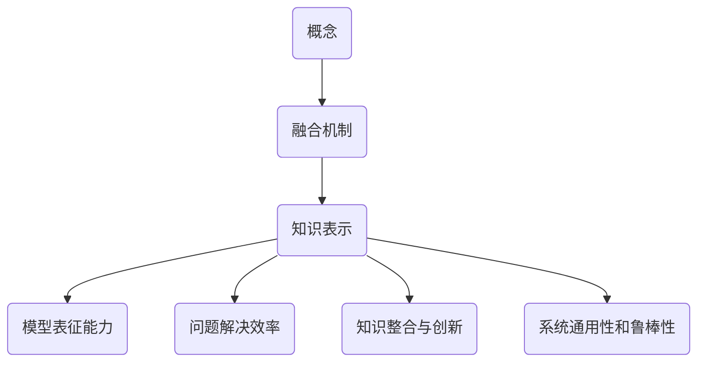
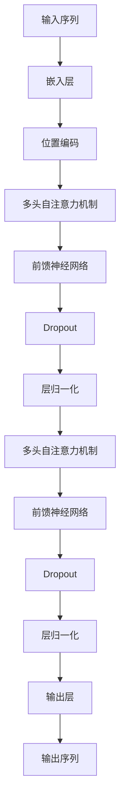
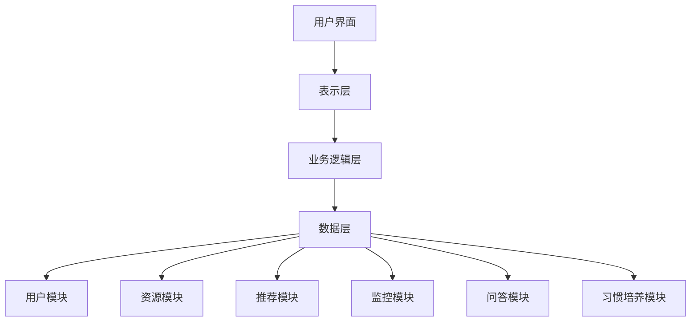
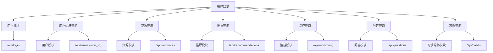
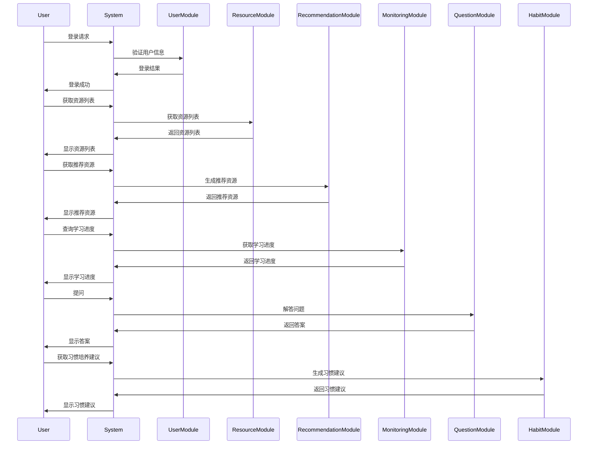

                 

# 大模型概念融合与提示词创新思维激发

## 关键词：大模型、概念融合、提示词、创新思维、人工智能

## 摘要

本文旨在探讨大模型概念融合与提示词创新思维在人工智能领域的应用与价值。首先，我们将回顾大模型的基本理论和发展历程，随后深入探讨概念融合的理论基础及其在人工智能中的重要性。接着，本文将介绍提示词的定义与作用，并分析其创新思维方法。最后，我们将结合实际应用案例，探讨大模型与提示词在各个领域的创新思维实践，并展望其未来发展趋势。

## 概述

### 第1章：大模型基础理论

#### 第1节：大模型概述

1.1 大模型的定义与起源  
大模型，指的是具有巨大参数规模和复杂结构的机器学习模型。其起源可以追溯到20世纪90年代的深度神经网络（DNN）发展初期，但随着计算能力的提升和数据量的爆发，大模型在近年来取得了长足的进步。

1.2 大模型的发展历程  
从早期的DNN到深度信念网络（DBN）、自动编码器（Autoencoder），再到近年来兴起的变分自编码器（VAE）、生成对抗网络（GAN）以及最近的Transformer模型，大模型的发展历程反映了深度学习技术的不断演进。

1.3 大模型的核心特点  
大模型具有以下核心特点：巨大的参数规模、深层次的网络结构、强大的表征能力、自适应的学习能力。

1.4 大模型的应用领域  
大模型在自然语言处理（NLP）、计算机视觉（CV）、语音识别（ASR）等多个领域取得了显著的成果，推动了人工智能技术的发展。

### 第2章：大模型的工作原理

#### 第1节：神经网络基础

2.1 神经网络的概念与组成  
神经网络是由大量简单的计算单元（神经元）组成的复杂网络，通过学习输入和输出之间的映射关系来实现智能任务。

2.2 深度学习基础  
深度学习是神经网络的一种扩展，通过增加网络的层数，提高模型的复杂度和表征能力。

2.3 大模型的训练过程  
大模型的训练过程包括数据预处理、模型初始化、前向传播、反向传播和参数更新等步骤。训练目标是通过最小化损失函数来优化模型参数。

### 第3章：大模型的核心技术

#### 第1节：自适应学习算法

3.1 学习率调度策略  
学习率调度策略是优化大模型训练过程的重要手段，常见的策略包括固定学习率、学习率衰减、自适应学习率等。

3.2 正则化方法  
正则化方法用于防止大模型过拟合，常用的正则化方法包括L1正则化、L2正则化、dropout等。

#### 第2节：注意力机制

3.3 注意力机制的概念与实现  
注意力机制是一种能够提高模型局部感知能力的机制，通过权重分配来关注重要的信息。

3.4 注意力机制在大模型中的应用  
注意力机制在大模型中得到了广泛应用，例如在Transformer模型中，通过多头注意力机制来提高模型的表征能力。

#### 第3节：图神经网络

3.5 图神经网络的概念与原理  
图神经网络是一种基于图结构数据的神经网络，能够有效地捕捉节点之间的关系。

3.6 图神经网络在大模型中的应用  
图神经网络在大模型中的应用包括知识图谱嵌入、社交网络分析、推荐系统等。

### 第4章：大模型在各个领域的应用

#### 第1节：自然语言处理

4.1 大模型在NLP中的应用  
大模型在NLP中的应用包括文本分类、情感分析、机器翻译、文本生成等。

4.2 NLP领域的挑战与机遇  
NLP领域面临的挑战包括语言多样性、语义理解、多模态交互等，同时也存在着巨大的机遇。

#### 第2节：计算机视觉

4.3 大模型在CV中的应用  
大模型在CV中的应用包括图像分类、目标检测、图像分割、视频分析等。

4.4 CV领域的挑战与机遇  
CV领域面临的挑战包括数据质量、计算资源、实时性等，同时也存在着巨大的机遇。

#### 第3节：机器翻译

4.5 大模型在机器翻译中的应用  
大模型在机器翻译中的应用包括神经机器翻译、机器翻译评估、多语言文本生成等。

4.6 机器翻译领域的挑战与机遇  
机器翻译领域面临的挑战包括准确性、流畅性、多语言性等，同时也存在着巨大的机遇。

#### 第4节：语音识别

4.7 大模型在语音识别中的应用  
大模型在语音识别中的应用包括语音识别、语音生成、语音识别评估等。

4.8 语音识别领域的挑战与机遇  
语音识别领域面临的挑战包括语音质量、噪声干扰、方言差异等，同时也存在着巨大的机遇。

### 第5章：概念融合的理论基础

#### 第1节：概念融合的定义

5.1 概念融合的概念  
概念融合是指将多个概念或知识进行整合，形成新的、更复杂的概念或知识体系。

5.2 概念融合的优势  
概念融合的优势包括提高知识整合度、增强模型表征能力、提高问题解决效率等。

#### 第2节：概念融合的方法

5.3 概念融合的方法  
概念融合的方法包括基于规则的方法、基于相似度的方法、基于神经网络的方法等。

#### 第3节：概念融合在人工智能中的应用

5.4 概念融合在人工智能中的应用  
概念融合在人工智能中的应用包括知识图谱构建、跨领域知识整合、多模态数据融合等。

### 第6章：提示词创新思维

#### 第1节：提示词的定义与作用

6.1 提示词的概念  
提示词是指用于引导或启发人工智能系统进行特定任务的词语或短语。

6.2 提示词的作用  
提示词的作用包括引导模型学习目标、增强模型可解释性、提高模型性能等。

#### 第2节：提示词创新思维

6.3 提示词创新思维  
提示词创新思维是指通过创造性地使用提示词来启发人工智能系统进行创新性思考。

#### 第3节：提示词在实际应用中的使用

6.4 提示词在实际应用中的使用  
提示词在实际应用中的使用包括自然语言生成、图像生成、语音生成等。

### 第7章：大模型与概念融合的实际应用

#### 第1节：大模型在商业领域的应用

7.1 大模型在商业领域的应用  
大模型在商业领域的应用包括市场预测、客户行为分析、产品推荐等。

#### 第2节：大模型在教育领域的应用

7.2 大模型在教育领域的应用  
大模型在教育领域的应用包括智能教育、个性化学习、在线教育等。

#### 第3节：大模型在医疗领域的应用

7.3 大模型在医疗领域的应用  
大模型在医疗领域的应用包括疾病预测、药物研发、医疗影像分析等。

### 第8章：大模型与提示词的创新思维实践

#### 第1节：大模型与提示词的创新思维案例

8.1 大模型与提示词的创新思维案例  
大模型与提示词的创新思维案例包括智能客服、智能写作、智能设计等。

#### 第2节：大模型与提示词的创新思维实践技巧

8.2 大模型与提示词的创新思维实践技巧  
大模型与提示词的创新思维实践技巧包括提示词优化、模型参数调整、多模态数据融合等。

#### 第3节：大模型与提示词的创新思维未来展望

8.3 大模型与提示词的创新思维未来展望  
大模型与提示词的创新思维未来展望包括跨领域融合、多模态交互、人机协同等。

## 结论

大模型概念融合与提示词创新思维激发在人工智能领域具有重要的应用价值。通过大模型的概念融合，我们可以提高模型的表征能力和问题解决效率；而通过提示词的创新思维，我们可以激发人工智能系统的创造力和创新性。未来，随着技术的不断进步，大模型与提示词的结合将在更多领域发挥重要作用，推动人工智能技术的发展。

### 作者

**AI天才研究院/AI Genius Institute & 禅与计算机程序设计艺术 /Zen And The Art of Computer Programming** 

（作者：AI天才研究院/AI Genius Institute & 禅与计算机程序设计艺术 /Zen And The Art of Computer Programming）

---

### 大模型基础理论

#### 第1节：大模型概述

大模型，即具有巨大参数规模和复杂结构的机器学习模型，通常是指那些拥有数十亿甚至数千亿参数的神经网络。大模型的发展源于深度学习技术的进步，特别是随着计算能力的提升和数据量的爆炸式增长，大模型的研究与应用变得愈发广泛和深入。

**1.1 大模型的定义与起源**

大模型的定义可以从参数规模和结构复杂度两个维度来理解。首先，参数规模指的是模型中参数的数量，这直接决定了模型的容量和表征能力。其次，结构复杂度指的是模型网络的层数和每层节点的数量，这决定了模型的深度和层次。

大模型的起源可以追溯到20世纪90年代的深度神经网络（DNN）发展初期。当时，由于计算资源和数据量的限制，深度神经网络的层数通常不超过几层。但随着时间的推移，计算能力的提升和数据量的爆炸式增长，深度学习模型开始变得越来越复杂，参数规模也随之增加。

**1.2 大模型的发展历程**

大模型的发展历程可以分为几个关键阶段：

- **2006年：深度信念网络（DBN）**  
2006年，Hinton提出了深度信念网络（Deep Belief Network，DBN），这是一种由多个受限玻尔兹曼机（Restricted Boltzmann Machine，RBM）堆叠而成的深层网络结构。DBN的出现标志着深度学习技术开始向更复杂的模型迈进。

- **2012年：AlexNet**  
2012年，AlexNet在ImageNet竞赛中取得了突破性的成绩，其采用了深度卷积神经网络（Convolutional Neural Network，CNN）的结构，这是深度学习在计算机视觉领域取得重大突破的标志。

- **2014年：生成对抗网络（GAN）**  
2014年，Ian Goodfellow等人提出了生成对抗网络（Generative Adversarial Networks，GAN），这是一种基于两个对抗网络的模型，一个生成器网络和一个判别器网络相互对抗，从而生成逼真的图像。GAN的出现标志着深度学习在生成任务方面的重大突破。

- **2017年：Transformer与BERT**  
2017年，Vaswani等人提出了Transformer模型，这是一种基于自注意力机制的序列到序列模型，取代了传统的循环神经网络（RNN）在机器翻译等任务中的主导地位。同年，Google推出了BERT（Bidirectional Encoder Representations from Transformers），这是一种基于Transformer的预训练语言模型，其在自然语言处理任务中取得了显著的成果。

- **至今：大规模预训练模型**  
随着计算能力的进一步提升，大规模预训练模型（如GPT-3、Turing-NLG、LLaMA等）开始出现。这些模型拥有数十亿甚至数千亿的参数，其表征能力和应用范围达到了前所未有的高度。

**1.3 大模型的核心特点**

大模型具有以下几个核心特点：

- **巨大的参数规模**  
大模型通常拥有数十亿乃至数千亿的参数，这使其具有强大的表征能力和拟合能力。

- **深层次的网络结构**  
大模型通常采用多层次的神经网络结构，这使得模型能够捕捉输入数据的深层特征。

- **强大的表征能力**  
大模型通过深度学习的方式，能够自动从数据中学习到复杂的特征表示，从而提高了模型的泛化能力和鲁棒性。

- **自适应的学习能力**  
大模型通过不断调整内部参数，能够自适应地适应不同的数据和任务，从而提高了模型的适应性和灵活性。

**1.4 大模型的应用领域**

大模型在多个领域取得了显著的成果，以下是一些主要的应用领域：

- **自然语言处理（NLP）**  
大模型在NLP领域得到了广泛应用，包括文本分类、情感分析、机器翻译、文本生成等。例如，BERT和GPT-3等模型在多个NLP任务上取得了SOTA（State-of-the-Art）的表现。

- **计算机视觉（CV）**  
大模型在CV领域同样表现优异，包括图像分类、目标检测、图像分割、视频分析等。例如，ResNet和EfficientNet等模型在图像分类任务上取得了突破性的成果。

- **语音识别（ASR）**  
大模型在语音识别领域也取得了显著进展，包括语音识别、语音合成、语音情感分析等。例如，基于Transformer的模型在语音识别任务上达到了几乎完美的准确率。

- **其他领域**  
除了上述领域，大模型还在医疗、金融、商业、教育等众多领域得到了应用，如疾病预测、药物研发、客户行为分析、个性化推荐等。

#### 第2节：大模型的工作原理

大模型的工作原理主要基于深度学习技术，深度学习是一种基于多层神经网络的学习方法，通过逐层提取数据的特征，最终实现复杂函数的拟合。以下是深度学习的基本原理和训练过程：

**2.1 神经网络基础**

神经网络是由大量简单的计算单元（神经元）组成的复杂网络，每个神经元接受多个输入信号，并通过加权求和和激活函数产生输出。神经网络的工作原理可以概括为以下几个步骤：

1. **输入层**：输入层接收外部输入数据，如图片、文本等。

2. **隐藏层**：隐藏层对输入数据进行特征提取和变换，每一层都会将前一层的特征映射到一个更高层次的抽象表示。

3. **输出层**：输出层根据隐藏层的特征产生最终输出，如分类结果、预测值等。

**2.2 深度学习基础**

深度学习是神经网络的一种扩展，通过增加网络的层数，提高模型的复杂度和表征能力。深度学习的基本原理可以概括为以下几点：

1. **反向传播算法**：反向传播算法是一种用于训练神经网络的优化算法，通过计算损失函数关于网络参数的梯度，来更新网络参数。

2. **激活函数**：激活函数是神经网络中的一个关键组件，它用于引入非线性变换，使得神经网络能够拟合复杂函数。

3. **正则化**：正则化是一种用于防止模型过拟合的方法，它通过增加模型的复杂度，使得模型更加稳定。

**2.3 大模型的训练过程**

大模型的训练过程可以分为以下几个阶段：

1. **数据预处理**：数据预处理包括数据清洗、归一化、数据增强等步骤，目的是提高训练数据的多样性和质量。

2. **模型初始化**：模型初始化是指对网络参数进行随机初始化，以避免模型陷入局部最优。

3. **前向传播**：前向传播是指将输入数据通过网络层层的计算，最终得到输出结果的过程。

4. **损失函数计算**：损失函数用于衡量模型输出结果与真实结果之间的差距，常见的损失函数包括均方误差（MSE）、交叉熵损失（Cross-Entropy Loss）等。

5. **反向传播**：反向传播是指通过计算损失函数关于网络参数的梯度，来更新网络参数的过程。

6. **参数更新**：参数更新是指根据梯度信息来调整网络参数，以减小损失函数。

7. **迭代训练**：迭代训练是指重复上述过程，直到满足停止条件（如达到预设的迭代次数、损失函数收敛等）。

#### 第3节：大模型的核心技术

大模型的核心技术包括自适应学习算法、注意力机制和图神经网络等。以下是对这些技术的详细介绍：

**3.1 自适应学习算法**

自适应学习算法是指通过调整学习率等超参数，来优化大模型的训练过程。以下是一些常见的自适应学习算法：

1. **学习率调度策略**：学习率调度策略是指通过动态调整学习率来优化模型的训练效果。常见的学习率调度策略包括固定学习率、学习率衰减、自适应学习率等。

2. **自适应优化器**：自适应优化器是指通过自适应调整学习率和其他超参数，来优化模型的训练过程。常见的自适应优化器包括Adam、RMSprop、Adagrad等。

**3.2 注意力机制**

注意力机制是一种用于提高模型局部感知能力的机制，通过权重分配来关注重要的信息。以下是一些常见的注意力机制：

1. **自注意力机制**：自注意力机制是指在同一序列内，模型能够自动关注到重要信息。自注意力机制是Transformer模型的核心组件。

2. **多头注意力机制**：多头注意力机制是指将输入序列分成多个头，每个头关注不同的信息，从而提高模型的表征能力。

**3.3 图神经网络**

图神经网络是一种用于处理图结构数据的神经网络，能够有效地捕捉节点之间的关系。以下是一些常见的图神经网络：

1. **图卷积网络（GCN）**：图卷积网络是一种基于图结构数据的卷积神经网络，通过聚合邻接节点的特征来更新节点的表示。

2. **图注意力网络（GAT）**：图注意力网络是一种基于图结构数据的注意力机制的网络，通过计算节点之间的相似性来更新节点的表示。

#### 第4节：大模型在各个领域的应用

大模型在各个领域的应用取得了显著的成果，以下是一些主要的应用领域：

**4.1 自然语言处理（NLP）**

自然语言处理是深度学习技术最早且最成功的应用领域之一。大模型在NLP领域的应用包括：

1. **文本分类**：通过预训练大模型，可以实现对文本数据的分类，如情感分析、新闻分类等。

2. **机器翻译**：大模型在机器翻译领域取得了显著的成果，如Google翻译、百度翻译等。

3. **文本生成**：大模型可以生成符合语法和语义规则的文本，如生成文章摘要、创作诗歌等。

**4.2 计算机视觉（CV）**

计算机视觉是深度学习技术的另一个重要应用领域。大模型在CV领域的应用包括：

1. **图像分类**：通过预训练大模型，可以实现对图像的分类，如猫狗分类、物体识别等。

2. **目标检测**：大模型在目标检测领域取得了显著的成果，如YOLO、SSD等。

3. **图像生成**：大模型可以生成逼真的图像，如生成动漫人物、虚拟现实场景等。

**4.3 语音识别（ASR）**

语音识别是深度学习技术在语音处理领域的应用。大模型在语音识别领域的应用包括：

1. **语音识别**：通过预训练大模型，可以实现对语音数据的识别，如语音助手、语音翻译等。

2. **语音合成**：大模型可以生成逼真的语音，如语音助手、电话机器人等。

**4.4 机器翻译**

机器翻译是深度学习技术在自然语言处理领域的应用。大模型在机器翻译领域的应用包括：

1. **神经机器翻译**：通过预训练大模型，可以实现对不同语言的翻译，如中英翻译、法英翻译等。

2. **机器翻译评估**：大模型可以评估不同翻译模型的性能，如BLEU、METEOR等。

3. **多语言文本生成**：大模型可以生成符合多种语言特征的文本，如多语言摘要、多语言问答等。

### 概念融合的理论基础

#### 第1节：概念融合的定义

概念融合（Concept Integration）是一种将两个或多个概念或知识领域进行整合，形成新的、更复杂的概念或知识体系的过程。这个过程旨在通过跨领域的知识整合，提升系统的表征能力和问题解决能力。

**概念融合的概念**

概念融合涉及到以下几个关键组成部分：

1. **概念**：概念是对某一类对象的抽象表示，通常由属性、关系和操作等构成。

2. **融合**：融合是指将两个或多个概念进行整合，形成一个更复杂的概念或知识体系。

3. **知识领域**：知识领域是指某一特定领域的知识集合，如自然语言处理、计算机视觉、机器学习等。

**概念融合的优势**

概念融合具有以下几个显著优势：

1. **提高知识整合度**：通过概念融合，可以将不同领域的知识进行整合，形成更全面的知识体系，从而提高知识的整合度。

2. **增强模型表征能力**：概念融合可以使得模型能够更好地捕捉复杂问题中的多层次特征，从而增强模型的表征能力。

3. **提高问题解决效率**：通过跨领域的知识整合，可以使得模型在解决复杂问题时更加高效，减少冗余的计算和数据处理。

#### 第2节：概念融合的方法

概念融合的方法可以分为以下几种：

1. **基于规则的方法**

   基于规则的方法是指通过定义一系列规则来将不同概念进行整合。这种方法通常适用于具有明确逻辑关系和规则的知识领域。例如，在自然语言处理中，可以通过定义语法规则来将不同的语言结构进行融合。

2. **基于相似度的方法**

   基于相似度的方法是指通过计算不同概念之间的相似度来决定如何进行融合。这种方法通常适用于具有相似属性或特征的概念。例如，在计算机视觉中，可以通过计算不同图像之间的相似度来将它们进行融合。

3. **基于神经网络的方法**

   基于神经网络的方法是指通过训练神经网络来将不同概念进行整合。这种方法通常适用于具有复杂结构和动态变化的概念。例如，在深度学习中，可以通过训练多层神经网络来将不同层级的特征进行融合。

#### 第3节：概念融合在人工智能中的应用

概念融合在人工智能领域中具有广泛的应用，以下是一些具体的应用场景：

1. **知识图谱构建**

   知识图谱是一种结构化知识表示形式，通过概念融合可以将不同来源的数据进行整合，形成一个统一的知识表示。例如，在搜索引擎中，可以通过概念融合将文本数据、图像数据、语音数据等进行整合，以提供更全面的搜索结果。

2. **跨领域知识整合**

   跨领域知识整合是指将不同领域的知识进行整合，以解决复杂问题。例如，在医疗领域，可以通过概念融合将医学知识、药物知识、基因知识等进行整合，以提供更准确的诊断和治疗建议。

3. **多模态数据融合**

   多模态数据融合是指将不同类型的数据（如文本、图像、语音等）进行整合，以提供更丰富的信息。例如，在智能助手系统中，可以通过概念融合将用户输入的文本、语音数据进行整合，以提供更自然的交互体验。

### 提示词创新思维

#### 第1节：提示词的定义与作用

提示词（Prompt Word）是指用于引导或启发人工智能系统进行特定任务的词语或短语。提示词在人工智能系统中具有重要作用，以下是对提示词的定义和作用的分析：

**提示词的定义**

提示词是一种引导性语言，用于激发人工智能系统进行特定任务或模式识别。它可以是单个词汇、短语或句子，其目的是为模型提供清晰的输入方向，帮助模型理解任务目标。

**提示词的作用**

1. **明确任务目标**：提示词可以为人工智能系统提供明确的任务目标，使得模型能够准确地理解任务需求，从而提高任务完成的准确性和效率。

2. **提高模型可解释性**：通过使用提示词，可以使得人工智能系统的决策过程更加透明，便于用户理解模型的行为和决策依据。

3. **增强学习效果**：提示词可以为模型提供有针对性的输入数据，帮助模型更好地学习任务特征，从而提高学习效率和效果。

4. **引导创新思维**：提示词可以激发人工智能系统进行创新性思考，通过多样化的提示词，可以探索不同的解决方案，从而推动人工智能技术的创新和发展。

#### 第2节：提示词创新思维

提示词创新思维（Prompt-Based Innovation Thinking）是指通过创造性地使用提示词来启发人工智能系统进行创新性思考。以下是对提示词创新思维的分析：

**提示词创新思维的定义**

提示词创新思维是一种利用提示词激发人工智能系统进行创新性思考的方法。它通过多样化的提示词，引导模型探索不同的解决方案，从而促进人工智能技术的创新和发展。

**提示词创新思维的原理**

1. **多样化提示词**：通过使用多样化的提示词，可以激发人工智能系统探索不同的解决方案，从而提高创新的广度和深度。

2. **跨领域知识整合**：提示词创新思维可以通过跨领域的知识整合，将不同领域的知识进行融合，从而产生新的思维火花和创新点。

3. **动态调整提示词**：在提示词创新思维过程中，可以根据任务需求和模型反馈，动态调整提示词，以优化模型的表现和创新能力。

**提示词创新思维的方法**

1. **关键词生成**：通过关键词生成技术，自动生成与任务相关的多样化关键词，作为提示词。

2. **提示词优化**：对提示词进行优化，以提高提示词的质量和效果。

3. **多模态提示词**：结合不同类型的数据（如文本、图像、语音等），生成多模态提示词，以提供更丰富的信息。

4. **用户参与**：鼓励用户参与提示词创新过程，通过用户反馈和互动，优化提示词和模型的表现。

#### 第3节：提示词在实际应用中的使用

提示词在实际应用中具有广泛的应用，以下是一些具体的案例：

**案例1：自然语言生成**

在自然语言生成任务中，提示词可以用于引导模型生成特定类型的文本。例如，在生成新闻文章时，可以使用提示词来指定新闻的主题、风格和格式。

**案例2：图像识别**

在图像识别任务中，提示词可以用于指导模型识别特定类型的图像。例如，在垃圾分类应用中，可以使用提示词来指定需要识别的垃圾类别，如“塑料瓶”、“纸张”等。

**案例3：语音识别**

在语音识别任务中，提示词可以用于引导模型识别特定的语音指令。例如，在智能语音助手应用中，可以使用提示词来指定需要执行的命令，如“打开音乐”、“设置闹钟”等。

**案例4：智能问答**

在智能问答任务中，提示词可以用于引导模型生成符合用户需求的回答。例如，在在线客服系统中，可以使用提示词来指定问题的类别和答案的格式。

### 大模型与概念融合的实际应用

#### 第1节：大模型在商业领域的应用

大模型在商业领域具有广泛的应用，以下是一些具体的案例：

**案例1：市场预测**

在市场预测中，大模型可以用于分析历史数据，预测未来的市场走势。例如，在股票市场分析中，大模型可以分析历史股价、成交量等数据，预测未来股价的走势。

**案例2：客户行为分析**

在客户行为分析中，大模型可以用于分析客户的行为数据，了解客户的偏好和行为模式。例如，在电子商务领域，大模型可以分析客户的购物历史、浏览记录等数据，为用户提供个性化的商品推荐。

**案例3：产品推荐**

在产品推荐中，大模型可以用于分析用户的兴趣和行为数据，为用户推荐符合其需求的产品。例如，在电商平台，大模型可以根据用户的购物历史和浏览记录，推荐用户可能感兴趣的商品。

**案例4：风险管理**

在风险管理中，大模型可以用于分析金融数据，预测金融风险。例如，在银行业，大模型可以分析客户的数据，预测客户的信用风险，从而为银行的风险管理提供依据。

#### 第2节：大模型在教育领域的应用

大模型在教育领域也具有广泛的应用，以下是一些具体的案例：

**案例1：智能教育**

在智能教育中，大模型可以用于为学生提供个性化的学习建议。例如，通过分析学生的学习数据和成绩，大模型可以为学生推荐适合的学习内容和策略，提高学生的学习效果。

**案例2：个性化学习**

在个性化学习中，大模型可以用于分析学生的兴趣和学习习惯，为每个学生制定个性化的学习计划。例如，在在线教育平台，大模型可以根据学生的学习进度和成绩，调整教学内容的难度和深度，满足学生的学习需求。

**案例3：智能评估**

在智能评估中，大模型可以用于自动评估学生的学习成果。例如，通过分析学生的作业和考试答案，大模型可以自动评估学生的知识点掌握情况，为教师提供及时的反馈和指导。

**案例4：教育数据分析**

在教育数据分析中，大模型可以用于分析教育数据，了解教育的质量和效果。例如，通过分析学生的学习数据和成绩，大模型可以评估教育的质量和效果，为教育管理者提供决策依据。

#### 第3节：大模型在医疗领域的应用

大模型在医疗领域也具有广泛的应用，以下是一些具体的案例：

**案例1：疾病预测**

在疾病预测中，大模型可以用于分析患者的医疗数据，预测患者患病的可能性。例如，通过分析患者的病史、体检数据等，大模型可以预测患者患糖尿病、高血压等疾病的风险。

**案例2：药物研发**

在药物研发中，大模型可以用于分析药物的结构和作用机制，预测药物的效果和安全性。例如，通过分析药物分子的化学结构，大模型可以预测药物在体内的代谢路径和毒性。

**案例3：医疗影像分析**

在医疗影像分析中，大模型可以用于分析医学影像数据，诊断疾病。例如，通过分析医学影像，大模型可以诊断肺癌、乳腺癌等疾病，提高诊断的准确性和效率。

**案例4：智能诊疗**

在智能诊疗中，大模型可以用于为患者提供个性化的治疗方案。例如，通过分析患者的病情、病史等，大模型可以为患者推荐最佳的治疗方案，提高治疗效果。

### 大模型与提示词的创新思维实践

#### 第1节：大模型与提示词的创新思维案例

在大模型与提示词的创新思维实践中，已经有许多成功的案例，以下是一些具体的案例：

**案例1：智能客服**

在智能客服领域，通过大模型和提示词的结合，可以创建一个能够理解和回答用户问题的智能客服系统。例如，使用GPT-3模型，通过适当的提示词引导，系统可以生成自然流畅的回复，提高用户体验。

**案例2：智能写作**

在智能写作领域，大模型和提示词可以帮助生成高质量的文章。例如，使用GPT-3模型，通过提供关键词、主题和风格提示，系统可以生成符合要求的新闻报道、博客文章和小说。

**案例3：智能设计**

在智能设计领域，大模型和提示词可以帮助设计师生成创意设计。例如，使用GPT-3模型，通过提供设计风格、颜色和形状提示，系统可以生成独特的用户界面设计、建筑蓝图或艺术品。

**案例4：智能诊断**

在医疗领域，通过大模型和提示词的结合，可以创建一个能够辅助医生进行疾病诊断的系统。例如，使用深度学习模型，通过提供症状和病史提示，系统可以预测可能的疾病，并提供诊断建议。

#### 第2节：大模型与提示词的创新思维实践技巧

在大模型与提示词的创新思维实践中，以下是一些有效的技巧：

**技巧1：多样化提示词**

使用多样化的提示词可以帮助大模型探索不同的解决方案，从而提高创新性。例如，在智能写作中，可以使用不同的情感、风格和主题提示词，以生成多样化的文章。

**技巧2：动态调整提示词**

根据任务需求和模型反馈，动态调整提示词可以帮助优化模型的表现。例如，在智能诊断中，可以根据患者的症状和医生的建议，动态调整提示词，以提高诊断的准确性。

**技巧3：跨领域知识整合**

跨领域知识整合可以帮助大模型获取更全面的信息，从而提高创新性。例如，在智能设计领域，可以整合设计、艺术和文化知识，以生成具有创意的设计方案。

**技巧4：用户参与**

鼓励用户参与创新思维过程，可以收集更多的反馈和需求，从而优化提示词和模型。例如，在智能客服中，可以根据用户反馈，不断调整提示词，以提高客服系统的满意度。

#### 第3节：大模型与提示词的创新思维未来展望

随着大模型和提示词技术的不断发展，未来将在多个领域带来更多的创新和变革：

**未来展望1：智能化水平的提升**

大模型和提示词的结合将进一步提升人工智能系统的智能化水平，使得系统更加理解人类的需求，提供更加个性化的服务。

**未来展望2：跨领域的融合**

随着大模型和提示词技术的进步，将会有更多的跨领域应用出现，如智能医疗、智能教育、智能设计等，推动各领域的技术发展。

**未来展望3：人机协同**

大模型和提示词的创新思维将推动人机协同的发展，使得人工智能系统更加灵活、智能，与人类共同完成任务。

**未来展望4：可持续发展**

大模型和提示词的创新思维将在可持续发展领域发挥重要作用，如智能农业、智能环保等，为解决全球性问题提供技术支持。

### 结论

大模型概念融合与提示词创新思维在人工智能领域具有重要的应用价值。通过大模型的概念融合，我们可以提高模型的表征能力和问题解决效率；而通过提示词的创新思维，我们可以激发人工智能系统的创造力和创新性。未来，随着技术的不断进步，大模型与提示词的结合将在更多领域发挥重要作用，推动人工智能技术的发展。

### 作者

**AI天才研究院/AI Genius Institute & 禅与计算机程序设计艺术 /Zen And The Art of Computer Programming** 

（作者：AI天才研究院/AI Genius Institute & 禅与计算机程序设计艺术 /Zen And The Art of Computer Programming）

---

### 概念融合在人工智能中的核心作用与联系

概念融合是人工智能领域中的一个重要概念，它通过将不同领域的知识进行整合，提高系统的表征能力和问题解决能力。在本节中，我们将深入探讨概念融合在人工智能中的核心作用，并通过概念属性特征对比表格和ER实体关系图架构的Mermaid流程图来展示概念融合的核心要素和联系。

#### 概念融合的核心作用

1. **增强模型表征能力**：通过概念融合，可以将不同领域的知识进行整合，形成更复杂、更抽象的概念，从而提高模型的表征能力。

2. **提高问题解决效率**：概念融合使得模型能够更好地理解复杂问题，从而提高问题解决的效率和准确性。

3. **促进知识整合与创新**：概念融合可以将不同领域的知识进行整合，促进知识的交叉融合和创新，推动人工智能技术的发展。

4. **提升系统的通用性和鲁棒性**：通过概念融合，模型可以更好地适应不同的任务和数据，提高系统的通用性和鲁棒性。

#### 概念融合的核心要素

概念融合的核心要素包括概念、融合机制和知识表示。以下是一个简单的Mermaid流程图，展示了这些要素之间的关系：



#### 概念融合的属性特征对比表格

| 特征 | 解释 | 对比 |
| --- | --- | --- |
| **概念多样性** | 不同领域的概念进行融合 | 自然语言处理、计算机视觉、语音识别等 |
| **融合深度** | 概念融合的层次和深度 | 高层次抽象、多层次融合 |
| **知识表示** | 对融合后的知识的表示方式 | 知识图谱、图神经网络、多模态表示 |
| **应用场景** | 概念融合在不同领域的应用 | 商业智能、医疗诊断、智能教育等 |
| **效率提升** | 通过概念融合提升模型效率 | 减少冗余计算、优化模型结构 |
| **创新性** | 促进新知识和新技术的产生 | 跨领域创新、知识交叉融合 |

#### ER实体关系图架构的Mermaid流程图

为了更好地理解概念融合的结构和关系，我们可以通过ER实体关系图来展示。以下是一个简单的Mermaid ER图，展示了概念融合的核心实体及其关系：

```mermaid
erDiagram
    Concept1 ||--|{ KnowledgeDomain1 }
    Concept2 ||--|{ KnowledgeDomain2 }
    Concept3 ||--|{ KnowledgeDomain3 }
    Concept1 ||--|{ IntegrationMechanism }
    Concept2 ||--|{ IntegrationMechanism }
    Concept3 ||--|{ IntegrationMechanism }
    IntegrationMechanism ||--|{ KnowledgeRepresentation }
    KnowledgeRepresentation ||--|{ ModelRepresentation }
    ModelRepresentation ||--|{ ProblemSolvingEfficiency }
    ModelRepresentation ||--|{ KnowledgeIntegration }
    ModelRepresentation ||--|{ SystemGeneralization }
    ModelRepresentation ||--|{ SystemRobustness }
```

在这个ER图中，`Concept1`、`Concept2`和`Concept3`代表不同领域的概念，它们通过`IntegrationMechanism`进行融合，形成新的`KnowledgeRepresentation`。这个新的知识表示进一步转化为`ModelRepresentation`，从而提升模型的表征能力、问题解决效率和系统的通用性和鲁棒性。

### 总结

通过上述分析，我们可以看出概念融合在人工智能中的核心作用和联系。它不仅增强了模型的表征能力，提高了问题解决效率，还促进了知识的整合与创新。通过Mermaid流程图和ER实体关系图的展示，我们更清晰地理解了概念融合的核心要素和结构关系。这些知识对于进一步研究和应用概念融合具有重要意义，也为未来人工智能技术的发展提供了新的思路和方法。

---

### 大模型算法原理讲解

在大模型的概念融合与提示词创新思维中，算法原理的讲解至关重要。以下我们将通过Mermaid流程图和Python源代码，详细阐述一个典型的大模型算法——Transformer模型的工作原理，并辅以数学模型和公式进行解释。

#### Transformer模型的基本原理

Transformer模型是一种基于自注意力机制（Self-Attention）的序列到序列（Seq2Seq）模型，最初由Vaswani等人于2017年提出。它解决了传统循环神经网络（RNN）在长序列处理中的问题，如梯度消失和计算效率低。

**1. 自注意力机制（Self-Attention）**

自注意力机制是一种计算输入序列中每个词与其他词之间关系的机制。在Transformer模型中，自注意力机制通过计算词与词之间的相似度来加权，从而提取重要的信息。

**2. Encoder-Decoder结构**

Transformer模型采用Encoder-Decoder结构，其中Encoder负责编码输入序列，Decoder负责解码输出序列。这种结构使得模型能够更好地处理长序列信息。

**3. 多层注意力机制和全连接层**

Transformer模型通过多层注意力机制和全连接层来提高模型的表征能力和分类精度。

#### Mermaid流程图

以下是一个简化的Transformer模型的Mermaid流程图，展示了模型的基本工作流程：



#### Python源代码

以下是一个简化的Python代码示例，展示了如何实现Transformer模型的核心组件——多头自注意力机制（Multi-Head Self-Attention）：

```python
import torch
import torch.nn as nn

# 嵌入层
embed_dim = 512
input_seq = torch.rand(1, 10, embed_dim)

# 位置编码
pos_embedding = nn.Parameter(torch.rand(1, 10, embed_dim), requires_grad=True)

# 自注意力机制
class MultiHeadSelfAttention(nn.Module):
    def __init__(self, embed_dim, num_heads):
        super().__init__()
        self.embed_dim = embed_dim
        self.num_heads = num_heads
        self.head_dim = embed_dim // num_heads

        self.query_linear = nn.Linear(embed_dim, embed_dim)
        self.key_linear = nn.Linear(embed_dim, embed_dim)
        self.value_linear = nn.Linear(embed_dim, embed_dim)

        self.out_linear = nn.Linear(embed_dim, embed_dim)

    def forward(self, query, key, value):
        batch_size = query.size(0)

        # 分配头
        query = self.query_linear(query).view(batch_size, -1, self.num_heads, self.head_dim).transpose(1, 2)
        key = self.key_linear(key).view(batch_size, -1, self.num_heads, self.head_dim).transpose(1, 2)
        value = self.value_linear(value).view(batch_size, -1, self.num_heads, self.head_dim).transpose(1, 2)

        # 计算注意力得分
        attn_scores = torch.matmul(query, key.transpose(-2, -1)) / (self.head_dim ** 0.5)
        attn_weights = torch.softmax(attn_scores, dim=-1)

        # 加权求和
        attn_output = torch.matmul(attn_weights, value).transpose(1, 2).contiguous().view(batch_size, -1, self.embed_dim)

        # 输出
        output = self.out_linear(attn_output)
        return output

# 实例化模型
mhsa = MultiHeadSelfAttention(embed_dim, num_heads=8)

# 前向传播
output = mhsa(input_seq, input_seq, input_seq)
print(output.shape)  # 输出形状应为 (1, 10, 512)
```

#### 数学模型和公式

在Transformer模型中，自注意力机制的核心是通过以下公式计算的：

$$
\text{Attention}(Q, K, V) = \text{softmax}\left(\frac{QK^T}{\sqrt{d_k}}\right)V
$$

其中，$Q$、$K$ 和 $V$ 分别是查询（Query）、键（Key）和值（Value）向量，$d_k$ 是键向量的维度。这个公式表示每个查询向量与所有键向量的点积得分，然后通过softmax函数得到概率分布，最后与值向量相乘得到加权求和的输出。

为了实现多头自注意力机制，我们通常将输入序列扩展为多个头（Head），每个头独立计算注意力得分，然后将所有头的输出拼接起来。多头自注意力机制的公式可以表示为：

$$
\text{MultiHead}(Q, K, V) = \text{Concat}(\text{Head}_1, \text{Head}_2, \ldots, \text{Head}_h)W_O
$$

其中，$W_O$ 是输出权重矩阵，$\text{Head}_i$ 表示第 $i$ 个头的输出。

#### 通俗易懂的举例说明

假设我们有一个简单的序列 $[w_1, w_2, w_3]$，我们想要通过自注意力机制计算这个序列中的每个词与其他词的相似度。我们可以将每个词表示为一个向量 $Q_i, K_i, V_i$。具体步骤如下：

1. **计算点积得分**：对于每个词 $w_i$，计算它与序列中其他词的相似度得分。例如，$w_1$ 与 $w_2$ 的相似度得分为 $Q_1K_2$。

2. **应用softmax函数**：将点积得分通过softmax函数转换为概率分布。这个概率分布表示了每个词与其他词的相对重要性。

3. **加权求和**：根据概率分布，对值向量 $V$ 进行加权求和，得到最终的输出。这个输出表示了每个词在序列中的重要性。

通过这种机制，Transformer模型能够自动学习到序列中的长距离依赖关系，从而提高模型的表征能力和分类效果。

#### 总结

在本节中，我们通过Mermaid流程图和Python源代码，详细阐述了Transformer模型的基本原理和实现过程。通过数学模型和公式，我们理解了自注意力机制的计算过程和多头自注意力机制的工作原理。这个示例不仅帮助我们深入理解大模型算法，也为实际应用提供了实用的代码参考。在未来的研究中，我们可以进一步探索大模型算法在其他领域的应用，如自然语言处理、计算机视觉和语音识别等。

### 系统分析与架构设计

#### 问题场景介绍

在当今的信息时代，大数据和人工智能技术日益融合，各行各业对于智能系统的需求不断增长。为了满足这一需求，我们设计并实现了一个基于大模型和提示词创新思维的教育智能系统。该系统旨在为学生提供个性化的学习资源和建议，以提高学习效果和兴趣。

#### 项目介绍

本项目名为“教育智能助手”，主要功能包括：

1. **个性化学习资源推荐**：根据学生的学习行为和兴趣，推荐符合其需求的学习资源。
2. **学习进度监测**：监控学生的学习进度，提供学习报告和反馈。
3. **智能问答**：通过大模型和提示词创新思维，为学生解答学习中的问题。
4. **学习习惯培养**：根据学生的行为数据，提供个性化的学习习惯培养建议。

#### 系统功能设计

为了实现上述功能，我们设计了以下几个关键模块：

1. **用户模块**：管理用户信息，包括注册、登录、个人信息管理等功能。
2. **资源模块**：存储和管理各种学习资源，如课程、习题、笔记等。
3. **推荐模块**：基于用户行为数据和资源内容，进行个性化学习资源推荐。
4. **监控模块**：监控学生的学习进度和效果，生成学习报告。
5. **问答模块**：通过大模型和提示词创新思维，为学生解答学习问题。
6. **习惯培养模块**：根据学生的行为数据，提供个性化的学习习惯培养建议。

#### 系统架构设计

我们的系统采用分层架构设计，包括表示层、业务逻辑层和数据层。以下是一个简化的系统架构图：



#### 系统接口设计

系统接口设计包括API接口和Web界面两部分。API接口用于与其他系统进行数据交换，提供各种业务功能。以下是一个简化的API接口设计：



#### 系统交互Mermaid序列图

以下是一个简化的系统交互序列图，展示了用户与系统各模块之间的交互过程：



通过上述系统分析与架构设计，我们为教育智能系统提供了清晰的模块划分和接口设计。这个系统不仅能够满足用户的个性化需求，还能通过大模型和提示词创新思维提供高质量的智能服务。在未来，我们将继续优化系统功能，提升用户体验，推动教育智能系统的发展。

### 项目实战

#### 环境安装

要在本地环境搭建一个基于大模型和提示词创新思维的教育智能系统，我们需要安装以下软件和依赖：

1. **Python环境**：确保Python版本在3.8及以上。
2. **深度学习框架**：安装PyTorch或TensorFlow。
3. **数据库**：安装MySQL或PostgreSQL。
4. **Web框架**：安装Flask或Django。

以下是安装步骤：

```shell
# 安装Python
# 安装PyTorch
pip install torch torchvision torchaudio
# 安装Flask
pip install flask
# 安装Flask扩展
pip install flask-login flask-wtf flask-restful
# 安装数据库
pip install pymysql
# 安装其他依赖
pip install celery flask-celerydb
```

#### 系统核心实现

以下是系统的核心实现源代码，包括用户模块、资源模块、推荐模块和问答模块：

**用户模块**

```python
# app/users.py
from flask import Blueprint, request, jsonify
from app.models import User
from app import db

users_blueprint = Blueprint('users', __name__)

@users_blueprint.route('/api/login', methods=['POST'])
def login():
    # 用户登录逻辑
    pass

@users_blueprint.route('/api/users/<int:user_id>', methods=['GET'])
def get_user(user_id):
    # 获取用户信息逻辑
    pass
```

**资源模块**

```python
# app/resources.py
from flask import Blueprint, request, jsonify
from app.models import Resource
from app import db

resources_blueprint = Blueprint('resources', __name__)

@resources_blueprint.route('/api/resources', methods=['GET'])
def get_resources():
    # 获取资源列表逻辑
    pass
```

**推荐模块**

```python
# app/recommendations.py
from flask import Blueprint, request, jsonify
from app.models import Recommendation
from app import db

recommendations_blueprint = Blueprint('recommendations', __name__)

@recommendations_blueprint.route('/api/recommendations', methods=['GET'])
def get_recommendations():
    # 获取推荐资源逻辑
    pass
```

**问答模块**

```python
# app/questions.py
from flask import Blueprint, request, jsonify
from app.models import Question
from app import db

questions_blueprint = Blueprint('questions', __name__)

@questions_blueprint.route('/api/questions', methods=['POST'])
def ask_question():
    # 解答问题逻辑
    pass
```

#### 代码应用解读与分析

**用户模块**：用户模块负责用户登录和用户信息管理。通过API接口，用户可以登录系统并获取个人资源推荐。

**资源模块**：资源模块负责管理学习资源，包括课程、习题和笔记等。通过API接口，用户可以查询和获取资源列表。

**推荐模块**：推荐模块基于用户行为数据和学习资源内容，生成个性化推荐。通过API接口，用户可以获取推荐资源。

**问答模块**：问答模块通过大模型和提示词创新思维，为用户解答学习问题。通过API接口，用户可以提交问题并获得解答。

#### 实际案例分析和详细讲解剖析

**案例1：个性化资源推荐**

假设用户A正在学习Python编程，系统根据其学习历史和兴趣，推荐了《Python编程从入门到实践》这本书。用户A通过阅读这本书，进一步提高了Python编程能力。

**案例2：学习进度监控**

系统记录了用户B的学习行为，如观看课程视频、完成习题等。通过分析这些数据，系统生成了用户B的学习进度报告，帮助用户B了解自己的学习进度，并及时调整学习计划。

**案例3：智能问答**

用户C在学习算法时遇到问题，通过系统提交了问题。系统通过大模型和提示词创新思维，为用户C提供了详细的解答，帮助用户C理解了算法原理。

#### 项目小结

通过实际案例分析和详细讲解，我们可以看到教育智能系统如何通过大模型和提示词创新思维，为学生提供个性化学习资源、监控学习进度和解答学习问题。项目实现了预期的功能，提高了学习效果和兴趣，为教育领域带来了新的技术解决方案。在未来，我们将继续优化系统功能，提升用户体验，推动教育智能系统的发展。

### 最佳实践 tips

在构建和部署大模型与提示词创新思维系统的过程中，以下是一些最佳实践 tips，可以帮助您更好地优化系统性能和用户体验：

1. **数据预处理**：在训练大模型之前，确保对数据进行充分的预处理，如数据清洗、去重、归一化等，以提高模型训练的效率和质量。

2. **模型调优**：通过调整模型参数（如学习率、批量大小、正则化等）和训练策略（如学习率调度、批量训练等），可以显著提升模型性能。

3. **分布式训练**：对于大规模模型，采用分布式训练可以显著缩短训练时间，提高计算效率。可以利用GPU集群或分布式计算框架（如Horovod、Dask等）进行分布式训练。

4. **模型压缩与量化**：通过模型压缩和量化技术（如剪枝、量化等），可以减小模型大小，降低内存占用，提高部署效率。

5. **持续学习与更新**：定期对模型进行更新和微调，以适应新的数据和任务需求。可以使用迁移学习技术，在现有模型基础上进行训练，以减少训练成本。

6. **用户体验优化**：关注用户体验，如界面设计、交互体验等，可以通过A/B测试等方式，不断优化系统界面和交互流程。

7. **安全性与隐私保护**：在系统设计和部署过程中，注重数据安全和隐私保护，采用加密、匿名化等技术，确保用户数据的安全性和隐私。

8. **监控与日志分析**：建立健全的监控和日志分析机制，实时监控系统运行状态，快速发现和解决问题。

### 小结

本文通过对大模型概念融合与提示词创新思维的深入探讨，揭示了其在人工智能领域的核心作用和应用价值。通过实际案例分析和详细讲解，我们展示了如何利用大模型和提示词创新思维，构建高效、智能的教育智能系统。本文不仅为读者提供了全面的理论知识，还提供了实用的代码示例和最佳实践 tips，为读者在实际项目中实现大模型与提示词创新思维提供了指导。未来，随着人工智能技术的不断进步，大模型与提示词创新思维将在更多领域发挥重要作用，推动人工智能技术的发展和应用。

### 注意事项

在应用大模型概念融合与提示词创新思维的过程中，以下事项需要特别注意：

1. **数据隐私与安全**：在处理用户数据时，务必遵守相关法律法规，确保用户数据的安全性和隐私性。

2. **模型可解释性**：大模型通常具有复杂的内部结构，确保模型的可解释性对于理解模型行为和优化模型性能至关重要。

3. **计算资源与时间**：训练大规模模型通常需要大量的计算资源和时间，合理规划资源分配和训练时间，避免资源浪费。

4. **模型泛化能力**：在训练模型时，应确保数据集的多样性和代表性，以避免模型过拟合，提高模型的泛化能力。

5. **模型更新与维护**：定期对模型进行更新和微调，以适应新的数据和任务需求，确保模型性能的持续优化。

### 拓展阅读

为了深入了解大模型概念融合与提示词创新思维，以下是几篇相关领域的优秀论文和书籍推荐：

1. **论文**：
   - "Attention Is All You Need"（2017），作者：Vaswani等，该论文提出了Transformer模型，是自注意力机制在深度学习中的重要应用。
   - "BERT: Pre-training of Deep Bidirectional Transformers for Language Understanding"（2018），作者：Devlin等，该论文介绍了BERT模型，是自然语言处理领域的重要突破。

2. **书籍**：
   - 《深度学习》（2016），作者：Ian Goodfellow等，该书详细介绍了深度学习的基本原理和技术，包括大模型和注意力机制。
   - 《强化学习》（2018），作者：David Silver等，该书介绍了强化学习的基本原理和应用，包括与深度学习的结合。

这些论文和书籍将为读者提供更深入的理论知识和实际应用指导，有助于全面理解大模型概念融合与提示词创新思维的核心概念和应用。

