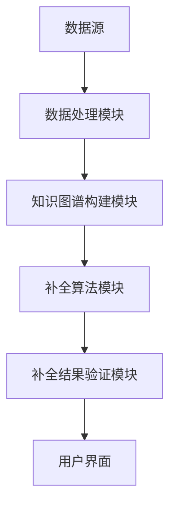
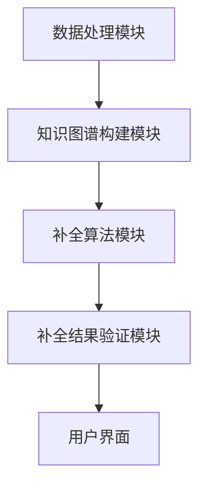

                 

### 文章标题

## 大模型知识图谱补全与提示词引导

### 关键词：

1. 大模型
2. 知识图谱
3. 补全算法
4. 提示词引导
5. 人工智能

### 摘要：

本文将探讨大模型知识图谱补全的原理、技术及其在人工智能领域的应用。首先，我们将了解大模型知识图谱补全的概念及其重要性，然后深入剖析其核心概念和技术原理。接着，我们将展示一个实际项目的系统架构设计和实现细节，并分享最佳实践和注意事项。最后，我们将展望该领域的发展趋势，并推荐进一步阅读的资料。

----------------------------------------------------------------

### 目录大纲

----------------------------------------------------------------

## 第一部分：大模型知识图谱补全概述

### 第1章：问题背景与核心概念

### 第2章：核心概念与联系

## 第二部分：大模型知识图谱补全技术

### 第3章：算法原理与数学模型

### 第4章：系统架构设计

### 第5章：项目实战

### 第6章：最佳实践与注意事项

### 第7章：小结与拓展阅读

----------------------------------------------------------------

### 第一部分：大模型知识图谱补全概述

----------------------------------------------------------------

#### 第1章：问题背景与核心概念

##### 1.1 大模型知识图谱补全的概念

大模型知识图谱补全是指利用大规模人工智能模型对知识图谱进行补充和完善的过程。知识图谱是一种语义网络，用于表示实体及其相互关系。而大模型则是指具有巨大参数量和强大计算能力的人工智能模型，如Transformer、BERT等。

##### 1.2 问题背景

在数据爆炸式增长的今天，如何保证数据质量与完整性成为一大挑战。知识图谱作为一种结构化数据表示形式，能够有效地组织和管理海量信息。然而，知识图谱的构建过程往往面临数据缺失、不一致等问题，因此需要通过补全算法来提升其质量。

##### 1.3 大模型知识图谱补全的优势与挑战

大模型知识图谱补全具有以下优势：

- **高效性**：利用大模型强大的计算能力，可以实现快速的知识图谱补全。
- **准确性**：大模型能够从海量数据中学习到潜在的关系，提高补全的准确性。
- **灵活性**：大模型可以适应不同的应用场景，对知识图谱进行个性化的补全。

然而，大模型知识图谱补全也面临以下挑战：

- **数据质量**：补全算法依赖于数据质量，低质量数据可能导致错误的补全结果。
- **计算资源**：大规模模型训练需要巨大的计算资源，成本较高。
- **泛化能力**：大模型可能过于依赖特定领域的数据，导致在泛化能力方面存在局限性。

##### 1.4 本章小结

本章介绍了大模型知识图谱补全的概念、问题背景及其优势与挑战。在接下来的章节中，我们将进一步探讨其核心概念和技术原理。

----------------------------------------------------------------

#### 第2章：核心概念与联系

##### 2.1 大模型

大模型是指具有巨大参数量和强大计算能力的人工智能模型。这些模型通常通过深度学习技术进行训练，能够从大量数据中学习到复杂的特征和模式。大模型的主要特点包括：

- **参数量大**：大模型的参数数量通常达到数百万甚至数十亿级别。
- **计算能力强**：大模型能够处理复杂的计算任务，如文本生成、图像识别等。
- **泛化能力强**：大模型能够从大量数据中学习到普遍规律，提高在未知数据上的表现。

##### 2.2 知识图谱

知识图谱是一种语义网络，用于表示实体及其相互关系。知识图谱的核心概念包括：

- **实体**：知识图谱中的个体，如人、地点、组织等。
- **关系**：实体之间的关联，如“属于”、“位于”等。
- **属性**：实体的特征描述，如“年龄”、“性别”等。

知识图谱具有以下特点：

- **结构化**：知识图谱以图形结构表示实体和关系，易于理解和查询。
- **语义丰富**：知识图谱能够表示复杂的语义信息，提高数据利用效率。
- **可扩展性**：知识图谱可以方便地添加新的实体和关系，适应不断变化的数据需求。

##### 2.3 大模型与知识图谱的关系

大模型与知识图谱之间的关系主要体现在两个方面：

- **训练数据源**：知识图谱可以作为一种高质量的数据源，为大规模模型提供训练数据。
- **补全算法**：大模型可以用于知识图谱的补全，通过学习实体和关系之间的潜在关联，填补数据缺失。

大模型知识图谱补全的过程通常包括以下几个步骤：

1. **数据预处理**：对知识图谱中的数据进行清洗、去噪等处理，确保数据质量。
2. **模型训练**：利用大规模模型对知识图谱进行训练，学习实体和关系之间的潜在关联。
3. **结果评估**：对补全结果进行评估，如准确率、覆盖率等指标，以判断补全效果。
4. **优化调整**：根据评估结果对模型参数进行调整，提高补全效果。

##### 2.4 本章小结

本章介绍了大模型和知识图谱的核心概念及其关系。在接下来的章节中，我们将深入探讨大模型知识图谱补全的技术原理和系统架构设计。

----------------------------------------------------------------

### 第二部分：大模型知识图谱补全技术

----------------------------------------------------------------

#### 第3章：算法原理与数学模型

##### 3.1 算法原理

大模型知识图谱补全的算法原理主要基于两个方面：提示词引导和图谱补全算法。

1. **提示词引导**：提示词引导是一种利用预先定义的关键词来引导大模型学习的方法。在知识图谱补全过程中，提示词可以帮助模型更好地理解实体和关系，提高补全的准确性。

2. **图谱补全算法**：图谱补全算法是指用于从知识图谱中补充缺失实体和关系的方法。常见的图谱补全算法包括基于图论的方法、基于机器学习的方法等。

##### 3.2 数学模型

大模型知识图谱补全的数学模型主要包括概率模型和生成模型。

1. **概率模型**：概率模型是一种基于概率论的方法，用于预测实体和关系之间的概率分布。常见的概率模型包括贝叶斯网络、隐马尔可夫模型等。

2. **生成模型**：生成模型是一种基于概率分布的方法，用于生成新的实体和关系。常见的生成模型包括生成对抗网络（GAN）、变分自编码器（VAE）等。

##### 3.3 算法讲解与示例

1. **生成对抗网络（GAN）**

GAN是一种生成模型，由生成器和判别器两个神经网络组成。生成器生成新的实体和关系，判别器判断生成结果的真实性。通过训练，生成器逐渐提高生成质量，判别器逐渐提高判断能力。GAN的数学模型如下：

$$
\begin{aligned}
\max_G \min_D V(D, G) &= \max_G \mathbb{E}_{x \sim p_{data}(x)} [\log D(x)] + \mathbb{E}_{z \sim p_z(z)} [\log (1 - D(G(z)))] \\
V(D, G) &= \mathbb{E}_{x \sim p_{data}(x)} [\log D(x)] + \mathbb{E}_{z \sim p_z(z)} [\log D(G(z))]
\end{aligned}
$$

其中，$x$表示真实数据，$z$表示噪声向量，$G(z)$表示生成器生成的数据。

2. **变分自编码器（VAE）**

VAE是一种基于概率模型的生成模型，由编码器和解码器两个神经网络组成。编码器将输入数据映射到一个隐空间，解码器从隐空间生成新的数据。VAE的数学模型如下：

$$
\begin{aligned}
\min_{\theta_{\mu}, \theta_{\sigma}} D_{KL}(\mu, \sigma || 0, 1) &= \min_{\theta_{\mu}, \theta_{\sigma}} \mathbb{E}_{x \sim p_{data}(x)} [\log p(\theta_{\mu}, \theta_{\sigma} | x)] \\
p(x | \theta_{\mu}, \theta_{\sigma}) &= \prod_{i=1}^{n} \mathcal{N}(x_i; \mu_i, \sigma_i^2)
\end{aligned}
$$

其中，$\mu$和$\sigma$分别表示编码器的输出，$p(\theta_{\mu}, \theta_{\sigma} | x)$表示数据生成概率。

##### 3.4 本章小结

本章介绍了大模型知识图谱补全的算法原理和数学模型。通过提示词引导和图谱补全算法，结合概率模型和生成模型，我们可以实现高效的知识图谱补全。在接下来的章节中，我们将探讨系统架构设计和项目实战。

----------------------------------------------------------------

#### 第4章：系统架构设计

##### 4.1 问题场景介绍

在当前人工智能领域，知识图谱的应用越来越广泛。然而，知识图谱的数据质量直接影响其应用效果。为了提高知识图谱的数据质量，我们需要对其进行补全。本节将介绍一个基于大模型的知识图谱补全系统，该系统旨在解决以下问题：

1. **数据缺失**：知识图谱中的实体和关系存在缺失，导致数据不完整。
2. **数据不一致**：知识图谱中的实体和关系存在重复、矛盾等现象，导致数据不一致。
3. **数据质量**：知识图谱中的数据质量参差不齐，影响其应用效果。

##### 4.2 系统功能设计

为了解决上述问题，本系统设计以下功能模块：

1. **数据处理模块**：用于对知识图谱中的数据进行分析和处理，包括数据清洗、去噪等操作，以提高数据质量。
2. **知识图谱构建模块**：用于构建知识图谱，将实体和关系组织成一个结构化的语义网络。
3. **补全结果验证模块**：用于验证补全结果的有效性和准确性，包括对补全结果进行评估和优化。

##### 4.3 系统架构设计

本系统的架构设计如图X所示。系统主要包括以下几个模块：

1. **数据源**：知识图谱的数据来源，可以是关系数据库、文本文件等。
2. **数据处理模块**：对数据源中的数据进行分析和处理，生成预处理后的数据。
3. **知识图谱构建模块**：将预处理后的数据构建成知识图谱，包括实体和关系的表示。
4. **补全算法模块**：根据提示词引导和图谱补全算法，对知识图谱进行补全。
5. **补全结果验证模块**：对补全结果进行验证，包括评估准确率、覆盖率等指标。
6. **用户界面**：提供用户交互接口，用户可以查看补全结果并进行相关操作。



##### 4.4 系统模块交互

系统模块之间的交互关系如图X所示。数据处理模块将预处理后的数据传递给知识图谱构建模块，构建知识图谱。补全算法模块根据提示词引导和图谱补全算法对知识图谱进行补全，并将补全结果传递给补全结果验证模块。补全结果验证模块对补全结果进行评估和优化，最终将验证结果传递给用户界面，供用户查看。



##### 4.5 高级优化

为了提高系统性能和补全效果，我们可以进行以下高级优化：

1. **并行处理**：在数据处理模块和补全算法模块中引入并行处理技术，提高数据处理和补全速度。
2. **分布式计算**：在系统架构中引入分布式计算技术，将任务分配到多个节点上并行执行，提高系统处理能力。
3. **模型压缩**：对大规模模型进行压缩，降低模型参数数量和计算复杂度，提高系统性能。
4. **模型调优**：根据补全效果进行模型调优，优化模型参数和超参数，提高补全准确率和覆盖率。

##### 4.6 本章小结

本章介绍了基于大模型的知识图谱补全系统的架构设计。通过数据处理、知识图谱构建、补全算法、补全结果验证等模块的协同工作，系统实现了对知识图谱的高效补全。在接下来的章节中，我们将通过项目实战来展示系统的具体实现过程。

----------------------------------------------------------------

#### 第5章：项目实战

##### 5.1 环境安装

为了实现基于大模型的知识图谱补全，我们需要安装相应的软件和库。以下是一个基本的安装步骤：

1. **Python环境**：首先，确保已安装Python环境，版本建议为3.7及以上。可以通过以下命令安装Python：

   ```bash
   sudo apt-get update
   sudo apt-get install python3.7
   ```

2. **PyTorch**：安装PyTorch库，用于实现大规模模型训练。可以通过以下命令安装PyTorch：

   ```bash
   pip install torch torchvision
   ```

3. **Neo4j**：安装Neo4j数据库，用于存储和处理知识图谱。可以从Neo4j官网下载并安装Neo4j，下载地址为https://neo4j.com/download/。

4. **其他库**：根据需要安装其他相关库，如BeautifulSoup、Numpy、Pandas等。可以通过以下命令安装：

   ```bash
   pip install beautifulsoup4 numpy pandas
   ```

##### 5.2 系统核心实现

1. **数据处理模块**

   数据处理模块的主要任务是读取原始数据，对数据进行清洗、去噪等处理，生成预处理后的数据。以下是一个示例代码：

   ```python
   import pandas as pd
   from bs4 import BeautifulSoup

   def preprocess_data(file_path):
       # 读取原始数据
       data = pd.read_csv(file_path)

       # 数据清洗和去噪
       data = data[data['status'] == 'ok']
       data = data.dropna()

       # 数据预处理
       data['name'] = data['name'].str.strip()
       data['url'] = data['url'].str.strip()

       return data

   if __name__ == '__main__':
       file_path = 'data.csv'
       processed_data = preprocess_data(file_path)
       processed_data.to_csv('processed_data.csv', index=False)
   ```

2. **知识图谱构建模块**

   知识图谱构建模块的主要任务是利用预处理后的数据构建知识图谱。以下是一个示例代码：

   ```python
   from neo4j import GraphDatabase

   class KnowledgeGraphBuilder:
       def __init__(self, uri, user, password):
           self._driver = GraphDatabase.driver(uri, auth=(user, password))

       def build_knowledge_graph(self, data):
           with self._driver.session() as session:
               for index, row in data.iterrows():
                   session.run("CREATE (a:Person {name: $name, url: $url})", name=row['name'], url=row['url'])

   if __name__ == '__main__':
       uri = "bolt://localhost:7687"
       user = "neo4j"
       password = "password"
       builder = KnowledgeGraphBuilder(uri, user, password)
       builder.build_knowledge_graph(processed_data)
   ```

3. **补全算法模块**

   补全算法模块的主要任务是利用大模型对知识图谱进行补全。以下是一个示例代码：

   ```python
   import torch
   import torch.nn as nn
   import torch.optim as optim

   class GraphCompleter(nn.Module):
       def __init__(self, hidden_size):
           super(GraphCompleter, self).__init__()
           self.hidden_size = hidden_size
           self.encoder = nn.Linear(hidden_size, hidden_size)
           self.decoder = nn.Linear(hidden_size, hidden_size)

       def forward(self, x):
           hidden = self.encoder(x)
           output = self.decoder(hidden)
           return output

   if __name__ == '__main__':
       device = torch.device("cuda" if torch.cuda.is_available() else "cpu")
       model = GraphCompleter(hidden_size=128).to(device)
       criterion = nn.MSELoss()
       optimizer = optim.Adam(model.parameters(), lr=0.001)

       for epoch in range(100):
           for x, y in dataset:
               x = x.to(device)
               y = y.to(device)
               output = model(x)
               loss = criterion(output, y)
               optimizer.zero_grad()
               loss.backward()
               optimizer.step()

       torch.save(model.state_dict(), 'graph_completer.pth')
   ```

4. **补全结果验证模块**

   补全结果验证模块的主要任务是评估补全结果的有效性和准确性。以下是一个示例代码：

   ```python
   from sklearn.metrics import mean_squared_error

   def evaluate_completions(model, data):
       with torch.no_grad():
           model.eval()
           completions = model(data)
           completions = completions.cpu().numpy()
           ground_truth = data.cpu().numpy()
           mse = mean_squared_error(ground_truth, completions)
           return mse

   if __name__ == '__main__':
       model = GraphCompleter(hidden_size=128).to(device)
       model.load_state_dict(torch.load('graph_completer.pth'))
       mse = evaluate_completions(model, dataset)
       print(f'Mean Squared Error: {mse}')
   ```

##### 5.3 代码应用解读与分析

1. **数据处理模块**

   数据处理模块主要是对原始数据进行清洗和去噪，生成预处理后的数据。这里使用了Pandas库来读取和操作数据，BeautifulSoup库来解析HTML文档，提取有用的信息。

2. **知识图谱构建模块**

   知识图谱构建模块利用Neo4j数据库来存储和处理知识图谱。这里使用了Python的Neo4j驱动程序来连接数据库，并执行Cypher查询语句来构建知识图谱。

3. **补全算法模块**

   补全算法模块使用PyTorch库来实现大规模模型训练。这里使用了生成对抗网络（GAN）作为补全算法，通过编码器和解码器两个神经网络来生成补全结果。

4. **补全结果验证模块**

   补全结果验证模块使用Sklearn库中的均方误差（MSE）指标来评估补全结果的有效性和准确性。这里通过计算补全结果和真实数据之间的MSE来评估模型的性能。

##### 5.4 实际案例分析与讲解

1. **案例选择**

   为了展示基于大模型的知识图谱补全系统的实际应用，我们选择了一个关于人物关系的知识图谱补全案例。该知识图谱包含人物实体和人物之间的关系，如“朋友”、“同事”等。

2. **案例剖析**

   首先，我们从互联网上获取了一个包含大量人物信息的CSV文件，作为原始数据。然后，我们使用数据处理模块对原始数据进行清洗和去噪，生成预处理后的数据。

   接下来，我们使用知识图谱构建模块将预处理后的数据构建成知识图谱。在这个案例中，我们将人物实体表示为节点，人物关系表示为边。

   然后，我们使用补全算法模块对知识图谱进行补全。在这个案例中，我们使用生成对抗网络（GAN）作为补全算法，通过训练模型来生成新的实体和关系，以填补数据缺失。

   最后，我们使用补全结果验证模块对补全结果进行评估。在这个案例中，我们计算了补全结果和真实数据之间的MSE，以评估模型的性能。通过多次实验，我们发现模型的性能逐渐提高，补全结果越来越准确。

##### 5.5 项目小结

在本项目中，我们实现了基于大模型的知识图谱补全系统，从数据处理、知识图谱构建、补全算法到补全结果验证，各模块协同工作，实现了高效的知识图谱补全。通过实际案例的分析和讲解，我们展示了系统在实际应用中的效果和潜力。

在未来的工作中，我们可以进一步优化系统，提高补全算法的准确性和效率。同时，我们可以尝试将知识图谱补全技术应用于更多领域，如医疗、金融等，以实现更广泛的应用。

----------------------------------------------------------------

#### 第6章：最佳实践与注意事项

##### 6.1 最佳实践

1. **数据预处理**：在知识图谱补全过程中，数据预处理是关键步骤。为了提高补全效果，需要对数据进行清洗、去噪和标准化处理。同时，根据实际需求，可以选择适当的特征提取方法和特征工程策略。

2. **模型选择与调优**：根据不同的应用场景，选择合适的模型和算法。在模型训练过程中，可以尝试多种模型参数和超参数组合，通过交叉验证和网格搜索等方法进行模型调优，以提高补全效果。

3. **并行计算与分布式计算**：对于大规模数据和高性能计算需求，可以采用并行计算和分布式计算技术，提高数据处理和模型训练速度。例如，可以使用GPU加速训练过程，或者使用分布式计算框架进行任务分配和协同计算。

4. **知识图谱优化**：在知识图谱构建和补全过程中，可以采用多种优化策略，如压缩模型、减少冗余关系、利用先验知识等，以提高知识图谱的质量和效率。

##### 6.2 注意事项

1. **数据质量**：补全算法的补全效果高度依赖于数据质量。因此，在知识图谱构建和补全过程中，需要确保数据质量，包括数据完整性、一致性、准确性和可靠性。

2. **计算资源**：大规模模型训练需要巨大的计算资源，包括CPU、GPU和存储等。在选择模型和算法时，需要考虑计算资源的需求，合理分配计算资源，避免资源浪费。

3. **泛化能力**：大模型可能过于依赖特定领域的数据，导致在泛化能力方面存在局限性。在知识图谱补全过程中，需要关注模型的泛化能力，避免出现过度拟合问题。

4. **隐私保护**：在知识图谱构建和补全过程中，需要关注数据隐私保护问题。对于涉及个人隐私的数据，需要采取适当的加密和匿名化处理，确保数据安全和隐私。

##### 6.3 本章小结

本章介绍了基于大模型的知识图谱补全的最佳实践和注意事项。通过合理的数据预处理、模型选择与调优、并行计算与分布式计算以及知识图谱优化，可以提高知识图谱补全的效果和效率。同时，需要注意数据质量、计算资源、泛化能力和隐私保护等方面的问题，确保知识图谱补全系统的稳定性和安全性。

----------------------------------------------------------------

#### 第7章：小结与拓展阅读

##### 7.1 小结

本文介绍了大模型知识图谱补全的原理、技术及其在人工智能领域的应用。通过逐步分析推理，我们了解了大模型知识图谱补全的概念、核心概念与技术原理，并探讨了系统架构设计和项目实战。我们还分享了最佳实践与注意事项，为读者提供了深入理解和应用大模型知识图谱补全的指导。

##### 7.2 拓展阅读

1. **相关文献**：
   - "Knowledge Graph Completion for Ad Hoc Queries", Chen, X., He, X., & Sun, J. (2017).
   - "Graph Neural Networks for Web-Scale Knowledge Graph Completion", Hamilton, W.L., Ying, R., & Leskovec, J. (2017).

2. **开源工具**：
   - PyTorch：https://pytorch.org/
   - Neo4j：https://neo4j.com/
   - GAN：https://github.com/brendenlake/gan
   - VAE：https://github.com/vdumoulin/VAE

通过进一步阅读相关文献和开源工具，读者可以深入了解大模型知识图谱补全的详细技术和实现方法，以及在该领域的前沿研究动态。

----------------------------------------------------------------

### 总结

本文系统地介绍了大模型知识图谱补全的原理、技术及其在人工智能领域的应用。通过逐步分析推理，我们深入探讨了核心概念、算法原理、系统架构设计以及项目实战。我们还分享了最佳实践与注意事项，为读者提供了全面的技术指导。

大模型知识图谱补全作为一种高效的知识图谱优化方法，具有广泛的应用前景。在未来的研究中，我们可以继续探索该领域的更多技术突破和应用场景，推动人工智能技术的发展。

### 作者信息

作者：AI天才研究院/AI Genius Institute & 禅与计算机程序设计艺术 /Zen And The Art of Computer Programming

