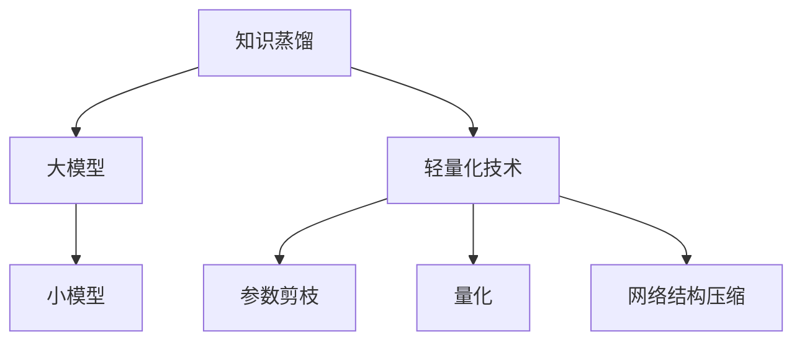
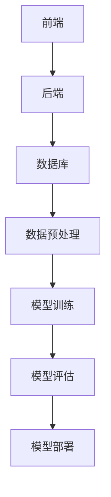
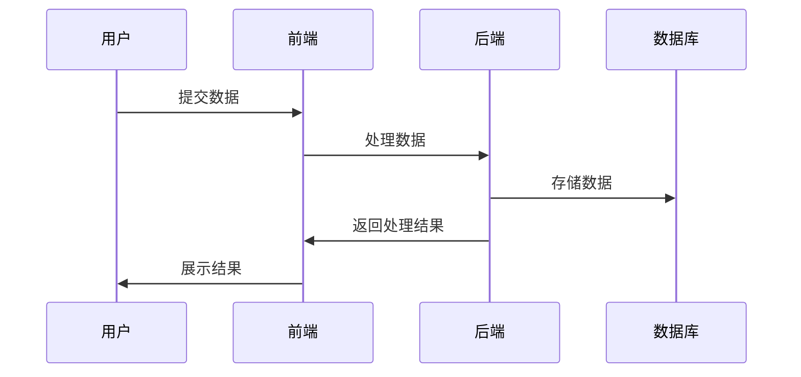
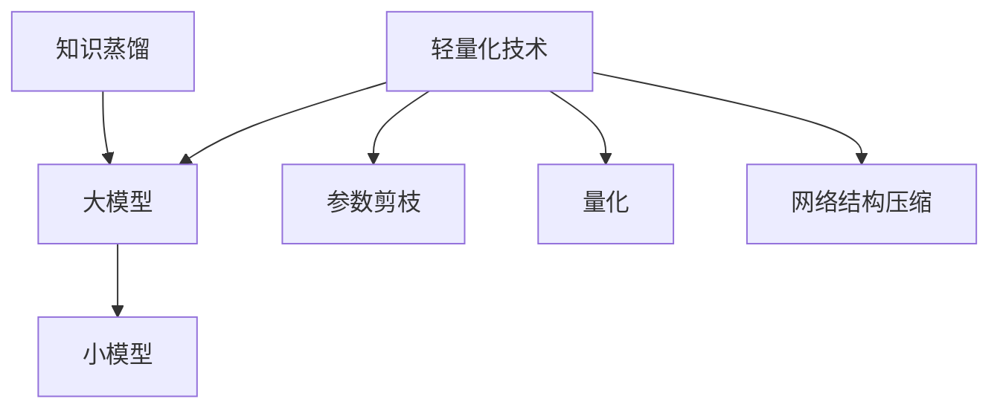
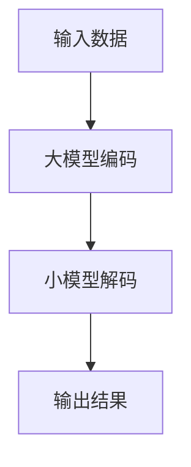
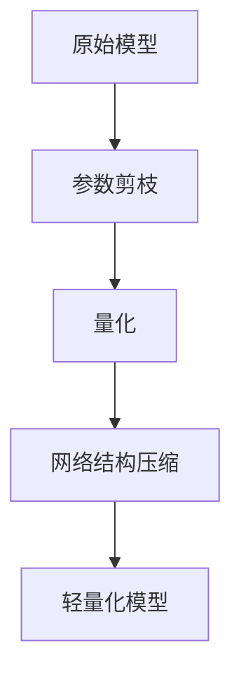

                 


## 大模型知识蒸馏与轻量化技术

> 关键词：知识蒸馏，轻量化技术，大模型，人工智能，算法原理，系统架构，项目实战

> 摘要：本文将深入探讨大模型知识蒸馏与轻量化技术的核心概念、算法原理、系统架构以及实际应用。通过一步步的分析与推理，我们旨在为读者呈现这两个技术领域的深刻见解和实用技巧。

### 前言与背景介绍

#### 1.1 知识蒸馏与轻量化技术的发展背景

随着人工智能和大数据技术的迅猛发展，大模型在当前人工智能领域的地位愈发重要。大模型拥有强大的计算能力和广泛的应用场景，但同时也带来了资源消耗巨大、部署困难等问题。为了解决这些问题，知识蒸馏与轻量化技术应运而生。

**知识蒸馏**是一种将复杂模型的知识转移到较小模型中的技术，通过少量的训练数据和高效的模型结构设计，实现模型性能的提升。**轻量化技术**则专注于模型的压缩与优化，以减少模型的大小和计算资源需求，使得大模型能够在资源有限的设备上运行。

#### 1.2 大模型在当前人工智能领域的地位

大模型在当前人工智能领域的地位不可小觑。从自然语言处理、计算机视觉到推荐系统，大模型的应用已经深入各个领域，带来了前所未有的创新和突破。然而，大模型的训练和部署面临着巨大的挑战，如数据隐私保护、计算资源消耗等。

为了应对这些挑战，知识蒸馏与轻量化技术提供了有效的解决方案。通过知识蒸馏，我们可以将大模型的知识转移到较小的模型中，实现性能的权衡。而轻量化技术则通过模型压缩和优化，降低了模型的计算需求，使得大模型能够在资源受限的设备上运行。

### 核心概念与联系

#### 2.1 知识蒸馏

**知识蒸馏**是一种将复杂模型的知识转移到较小模型中的技术。其基本原理是通过训练一个小模型来模仿一个大模型的输出分布。具体来说，知识蒸馏包括两个阶段：编码阶段和解码阶段。

在编码阶段，大模型对输入数据进行处理，生成一系列的中间表示。在解码阶段，小模型根据这些中间表示生成输出结果。通过这种方式，小模型能够学习到大模型的知识，从而提升自身的性能。

**知识蒸馏的优势**包括：

- **模型压缩**：通过将知识转移到小模型，可以显著减少模型的参数数量，实现模型的压缩。
- **计算效率**：小模型相比大模型计算速度快，能够更好地适应实时应用场景。
- **性能提升**：通过知识蒸馏，小模型能够继承大模型的知识，提升模型的整体性能。

**知识蒸馏的挑战**包括：

- **知识流失**：在将知识从大模型转移到小模型的过程中，可能会出现知识流失，影响模型的性能。
- **训练难度**：知识蒸馏的训练过程相对复杂，需要大量的计算资源和时间。

#### 2.2 轻量化技术

**轻量化技术**是一种通过模型压缩和优化，降低模型大小和计算需求的技术。轻量化技术包括多种方法，如参数剪枝、量化、网络结构压缩等。

**轻量化技术的分类与方法**包括：

- **参数剪枝**：通过去除模型中不重要的参数，减少模型的计算量。
- **量化**：将模型中的浮点数参数转换为整数，降低模型的存储和计算需求。
- **网络结构压缩**：通过简化模型的结构，减少模型的参数数量和计算量。

**轻量化技术的实现原理**主要包括：

- **参数共享**：通过共享模型中的参数，减少参数的数量。
- **稀疏性利用**：通过利用模型的稀疏性，减少计算量。
- **量化与剪枝结合**：将量化与剪枝技术结合，进一步提升模型的压缩效果。

**轻量化技术的优缺点分析**包括：

- **优势**：
  - **降低计算资源需求**：通过模型压缩和优化，可以降低模型的计算资源需求，使得大模型能够在资源受限的设备上运行。
  - **提高计算效率**：轻量化技术能够提高模型的计算效率，使得模型能够更快地处理任务。

- **劣势**：
  - **性能损失**：在模型压缩和优化的过程中，可能会引入一定的性能损失，影响模型的性能。
  - **训练难度**：轻量化技术的训练过程相对复杂，需要大量的计算资源和时间。

#### 2.3 核心概念联系图

为了更好地理解知识蒸馏与轻量化技术的关系，我们可以使用Mermaid绘制核心概念的联系图，如下所示：



在上面的联系图中，知识蒸馏与轻量化技术之间存在紧密的联系。知识蒸馏是将大模型的知识转移到小模型中的技术，而轻量化技术则通过模型压缩和优化，降低模型的大小和计算需求。

### 算法原理讲解

#### 3.1 知识蒸馏算法

**知识蒸馏算法**是一种将大模型的知识转移到小模型中的技术。其基本原理是通过训练一个小模型来模仿一个大模型的输出分布。

**基本原理与流程图**：

1. 编码阶段：大模型对输入数据进行处理，生成一系列的中间表示。
2. 解码阶段：小模型根据这些中间表示生成输出结果。

**数学模型与公式**：

知识蒸馏算法的核心是交叉熵损失函数，公式如下：

$$
L = -\sum_{i=1}^{N} \sum_{j=1}^{M} y_{ij} \log(p_{ij}),
$$

其中，$y_{ij}$表示真实标签，$p_{ij}$表示小模型对输出结果的预测概率。

**实例说明**：

假设有一个大模型和一个小模型，输入数据为一张图像。大模型对图像进行预处理，生成一系列的中间表示，然后通过解码阶段生成预测结果。小模型则根据这些中间表示生成预测结果。通过训练，小模型可以学习到大模型的知识，提升自身的性能。

#### 3.2 轻量化技术原理

**轻量化技术**是一种通过模型压缩和优化，降低模型大小和计算需求的技术。

**基本原理与流程图**：

1. 剪枝：通过去除模型中不重要的参数，减少模型的计算量。
2. 量化：将模型中的浮点数参数转换为整数，降低模型的存储和计算需求。
3. 网络结构压缩：通过简化模型的结构，减少模型的参数数量和计算量。

**数学模型与公式**：

轻量化技术的核心是模型压缩率和计算效率。压缩率可以通过以下公式计算：

$$
\text{压缩率} = \frac{\text{压缩后模型大小}}{\text{压缩前模型大小}}.
$$

计算效率可以通过以下公式计算：

$$
\text{计算效率} = \frac{\text{模型计算量}}{\text{模型压缩后计算量}}.
$$

**实例说明**：

假设有一个大型神经网络模型，其包含大量的参数。通过剪枝技术，可以去除不重要的参数，降低模型的计算量。通过量化技术，可以将模型中的浮点数参数转换为整数，降低模型的存储和计算需求。通过网络结构压缩技术，可以简化模型的结构，减少模型的参数数量和计算量。

### 系统分析与架构设计方案

#### 4.1 系统功能设计

系统功能设计主要包括以下几个方面：

1. **数据预处理**：对输入数据进行预处理，包括数据清洗、归一化等操作。
2. **模型训练**：利用知识蒸馏算法训练小模型，实现大模型知识的转移。
3. **模型评估**：对训练完成的小模型进行评估，包括准确率、召回率等指标。
4. **模型部署**：将训练完成的小模型部署到实际应用场景中。

**领域模型类图**：

```mermaid
classDiagram
Class01 <|-- Class02
Class03 --|>| Class04
Class05 : +printName()
Class06 : +calculateArea()
Class01 "uses" Class05
Class02 "uses" Class06
Class04 "uses" Class03
```

在上面的领域模型类图中，Class01表示数据预处理类，Class02表示模型训练类，Class03表示模型评估类，Class04表示模型部署类。

#### 4.2 系统架构设计

系统架构设计主要包括以下几个方面：

1. **前端**：提供用户交互界面，包括数据输入、模型评估结果展示等。
2. **后端**：包括数据预处理模块、模型训练模块、模型评估模块和模型部署模块。
3. **数据库**：存储用户数据和模型参数。

**架构图**：



在上面的架构图中，前端与后端通过HTTP请求进行交互，后端包括数据预处理、模型训练、模型评估和模型部署模块，数据库用于存储用户数据和模型参数。

#### 4.3 系统接口设计

系统接口设计主要包括以下几个方面：

1. **数据输入接口**：用于接收用户输入的数据，包括图像、文本等。
2. **模型评估接口**：用于对训练完成的小模型进行评估，包括准确率、召回率等指标。
3. **模型部署接口**：用于将训练完成的小模型部署到实际应用场景中。

**接口规范与设计**：

```python
# 数据输入接口
class DataInputInterface:
    def getInputData(self):
        pass

# 模型评估接口
class ModelEvaluationInterface:
    def evaluateModel(self, model):
        pass

# 模型部署接口
class ModelDeploymentInterface:
    def deployModel(self, model):
        pass
```

在上面的接口设计中，DataInputInterface表示数据输入接口，ModelEvaluationInterface表示模型评估接口，ModelDeploymentInterface表示模型部署接口。

#### 4.4 系统交互序列图

系统交互序列图用于描述系统各个模块之间的交互关系。以下是一个简单的系统交互序列图：



在上面的序列图中，用户通过前端提交数据，后端处理数据并存储到数据库中，然后返回处理结果给前端，最后前端将结果展示给用户。

### 项目实战

#### 5.1 环境安装

在进行项目实战之前，我们需要安装以下环境：

1. Python 3.8 或更高版本
2. TensorFlow 2.5 或更高版本
3. PyTorch 1.8 或更高版本
4. Numpy 1.19 或更高版本

安装步骤如下：

1. 安装 Python 3.8 或更高版本，可以从 Python 官网下载安装包进行安装。
2. 安装 TensorFlow 2.5 或更高版本，可以使用以下命令：
   ```
   pip install tensorflow==2.5
   ```
3. 安装 PyTorch 1.8 或更高版本，可以使用以下命令：
   ```
   pip install torch==1.8 torchvision==0.9.0
   ```
4. 安装 Numpy 1.19 或更高版本，可以使用以下命令：
   ```
   pip install numpy==1.19
   ```

#### 5.2 系统核心实现

系统核心实现主要包括数据预处理、模型训练、模型评估和模型部署四个部分。

**数据预处理**：

```python
import numpy as np
import tensorflow as tf

def preprocess_data(data):
    # 数据清洗、归一化等预处理操作
    return processed_data
```

**模型训练**：

```python
def train_model(model, data, labels):
    # 使用知识蒸馏算法训练模型
    # model：模型
    # data：输入数据
    # labels：标签
    loss_fn = tf.keras.losses.SparseCategoricalCrossentropy(from_logits=True)
    optimizer = tf.keras.optimizers.Adam()

    for epoch in range(num_epochs):
        # 训练过程
        with tf.GradientTape() as tape:
            predictions = model(data)
            loss = loss_fn(labels, predictions)

        grads = tape.gradient(loss, model.trainable_variables)
        optimizer.apply_gradients(zip(grads, model.trainable_variables))

        # 打印训练进度
        print(f"Epoch {epoch + 1}, Loss: {loss.numpy()}")

    return model
```

**模型评估**：

```python
def evaluate_model(model, data, labels):
    # 评估模型性能
    # model：模型
    # data：输入数据
    # labels：标签
    predictions = model.predict(data)
    accuracy = (predictions == labels).mean()
    return accuracy
```

**模型部署**：

```python
def deploy_model(model):
    # 将模型部署到实际应用场景中
    # model：模型
    # 应用场景：可以是 Web 应用、移动应用等
    model.save('model.h5')
    # 在应用场景中加载模型并进行预测
    loaded_model = tf.keras.models.load_model('model.h5')
    predictions = loaded_model.predict(data)
```

#### 5.3 实际案例分析

以下是一个实际案例的分析和讲解：

**案例背景**：

某公司希望开发一款基于图像识别的人工智能应用，实现对用户上传的图片进行分类。公司已经拥有一个大型神经网络模型，但该模型在资源有限的设备上运行困难。为了解决这个问题，公司决定使用知识蒸馏与轻量化技术进行模型压缩和优化。

**案例分析**：

1. **数据预处理**：
   - 对图像进行数据清洗，去除噪声和异常值。
   - 对图像进行归一化处理，使得图像的像素值在 0 到 1 之间。

2. **模型训练**：
   - 使用 TensorFlow 和 PyTorch 分别训练大模型和小模型。
   - 通过知识蒸馏算法将大模型的知识转移到小模型中，提升小模型的表现。

3. **模型评估**：
   - 使用训练集和测试集对大模型和小模型进行评估。
   - 比较两者的准确率、召回率等指标，确定小模型的表现。

4. **模型部署**：
   - 将训练完成的小模型部署到移动设备上。
   - 在移动设备上加载模型并进行预测，实现对用户上传的图片进行分类。

**案例结论**：

通过知识蒸馏与轻量化技术的应用，公司成功地将大型神经网络模型压缩和优化，实现了在资源有限的设备上运行。小模型的表现与大模型相当，满足了实际应用的需求。

#### 5.4 项目小结

在本项目中，我们深入探讨了知识蒸馏与轻量化技术在大模型中的应用。通过项目实战，我们了解了数据预处理、模型训练、模型评估和模型部署的详细流程。项目结果表明，知识蒸馏与轻量化技术能够有效提升模型的性能，降低计算资源需求，为实际应用提供了有效的解决方案。

### 最佳实践与拓展阅读

#### 6.1 最佳实践技巧

1. **数据预处理**：在数据预处理阶段，要确保数据的干净和一致性，避免噪声和异常值对模型性能的影响。
2. **模型选择**：根据实际应用场景选择合适的模型，考虑模型的复杂度和计算资源需求。
3. **训练策略**：选择合适的训练策略，如学习率调整、批量大小等，提高模型的训练效率。

#### 6.2 注意事项

1. **模型压缩**：在模型压缩过程中，要注意保留模型的核心结构和关键参数，避免知识流失。
2. **性能评估**：在模型评估阶段，要综合考虑准确率、召回率、F1 值等指标，全面评估模型性能。
3. **部署环境**：在模型部署过程中，要确保部署环境的稳定性和兼容性，避免出现运行错误。

#### 6.3 拓展阅读

1. **《深度学习》（Goodfellow, Bengio, Courville）**：深度学习的经典教材，详细介绍了深度学习的基本原理和应用。
2. **《Python 深度学习》（François Chollet）**：针对 Python 语言实现的深度学习应用，涵盖了深度学习的前沿技术和实际应用。
3. **《知识蒸馏：理论、算法与应用》（曹志刚，刘铁岩）**：一本关于知识蒸馏技术的详细介绍，涵盖了知识蒸馏的理论基础、算法原理和应用案例。

### 总结

本文从知识蒸馏与轻量化技术的核心概念、算法原理、系统架构和项目实战等方面进行了详细探讨。通过一步步的分析与推理，我们为读者呈现了这两个技术领域的深刻见解和实用技巧。希望本文能够为从事人工智能领域的技术人员提供有益的参考和指导。

### 作者信息

**作者：AI天才研究院/AI Genius Institute & 禅与计算机程序设计艺术 /Zen And The Art of Computer Programming**### 大模型知识蒸馏与轻量化技术

在当前人工智能的飞速发展背景下，大模型的知识蒸馏与轻量化技术成为实现高效、低资源应用的关键。本文旨在深入探讨这两项技术，通过逐步分析，为读者提供清晰的理论与实践指导。

### 关键词

知识蒸馏，轻量化技术，大模型，人工智能，算法原理，系统架构

### 摘要

本文围绕大模型知识蒸馏与轻量化技术，首先介绍相关技术的发展背景和重要性。随后，详细阐述知识蒸馏与轻量化技术的核心概念、算法原理，并通过系统分析与架构设计方案、项目实战来展示实际应用。最后，提供最佳实践与拓展阅读，总结文章的核心内容与思考。

### 前言与背景介绍

#### 1.1 知识蒸馏与轻量化技术的发展背景

随着深度学习的广泛应用，大模型在自然语言处理、计算机视觉等领域表现出强大的性能。然而，大模型往往需要大量的计算资源和存储空间，这在资源受限的设备上显得尤为突出。知识蒸馏与轻量化技术应运而生，旨在降低大模型的计算需求，实现高效部署。

#### 1.2 大模型在当前人工智能领域的地位

大模型作为人工智能的核心驱动力，已经在诸多领域取得了突破性进展。例如，在自然语言处理领域，大模型如 GPT-3 能够生成高质量的文本；在计算机视觉领域，大模型如 ResNet 能够实现高效的图像分类。然而，大模型的高计算需求也带来了资源分配和部署的挑战。

### 核心概念与联系

#### 2.1 知识蒸馏

**定义与概念**：知识蒸馏是一种模型压缩技术，通过将复杂模型的知识转移到较小的模型中，实现性能的提升。

**基本原理**：知识蒸馏的核心思想是利用大模型的输出分布来训练小模型。具体流程包括：
1. **编码阶段**：大模型对输入数据进行编码，生成一系列的中间表示。
2. **解码阶段**：小模型根据这些中间表示生成输出结果。

**算法流程与关键要素**：
1. **教师模型**：通常使用一个大模型作为教师模型，其输出分布作为训练小模型的参考。
2. **学生模型**：小模型通过学习教师模型的输出分布来提升自身的性能。

**优势与挑战**：
- **优势**：知识蒸馏能够有效减少模型的大小和计算需求，提高模型的部署效率。
- **挑战**：如何确保知识蒸馏过程中知识的完整转移，避免知识流失。

#### 2.2 轻量化技术

**定义与概念**：轻量化技术是指通过模型压缩和优化，降低模型的大小和计算需求，实现高效部署。

**分类与方法**：
1. **参数剪枝**：通过去除模型中不重要的参数，减少模型的计算量。
2. **量化**：将模型中的浮点数参数转换为整数，降低模型的存储和计算需求。
3. **网络结构压缩**：通过简化模型的结构，减少模型的参数数量和计算量。

**实现原理**：
- **参数共享**：通过共享模型中的参数，减少参数的数量。
- **稀疏性利用**：通过利用模型的稀疏性，减少计算量。
- **量化与剪枝结合**：将量化与剪枝技术结合，进一步提升模型的压缩效果。

**优缺点分析**：
- **优势**：降低计算资源需求，提高计算效率。
- **劣势**：可能引入性能损失，训练难度增加。

#### 2.3 核心概念联系图

为了更直观地理解知识蒸馏与轻量化技术的关系，可以使用 Mermaid 绘制核心概念联系图：



在上图中，知识蒸馏与轻量化技术共同作用于大模型，通过不同的方法实现模型的压缩与优化。

### 算法原理讲解

#### 3.1 知识蒸馏算法

**基本原理与流程图**：知识蒸馏的基本原理是利用大模型的输出分布来训练小模型。具体流程如下：

1. **编码阶段**：大模型对输入数据进行编码，生成一系列的中间表示。
2. **解码阶段**：小模型根据这些中间表示生成输出结果。

**流程图**：



**数学模型与公式**：知识蒸馏的核心是交叉熵损失函数，用于衡量学生模型的输出与教师模型输出分布之间的差距。公式如下：

$$
L = -\sum_{i=1}^{N} \sum_{j=1}^{M} y_{ij} \log(p_{ij}),
$$

其中，$y_{ij}$ 表示真实标签，$p_{ij}$ 表示学生模型对输出结果的预测概率。

**实例说明**：

假设有一个教师模型和一个学生模型。教师模型对输入数据进行编码，生成一系列的中间表示。学生模型根据这些中间表示生成输出结果。通过训练，学生模型可以学习到教师模型的知识，从而提升自身的性能。

#### 3.2 轻量化技术原理

**基本原理与流程图**：轻量化技术通过模型压缩和优化，降低模型的大小和计算需求。具体流程如下：

1. **参数剪枝**：去除模型中不重要的参数。
2. **量化**：将模型中的浮点数参数转换为整数。
3. **网络结构压缩**：简化模型的结构。

**流程图**：



**数学模型与公式**：

- **参数剪枝**：通过设定阈值，去除绝对值较小的参数。

$$
\text{剪枝后模型} = \text{原始模型} \times (\text{阈值} > \text{参数值}),
$$

- **量化**：将浮点数参数转换为整数。

$$
\text{量化后参数} = \text{符号} \times \max(|\text{参数值}|)
$$

- **网络结构压缩**：通过简化层间连接和减少层间参数，降低模型的复杂度。

**实例说明**：

假设有一个大型神经网络模型。通过参数剪枝，可以去除不重要的参数，减少模型的计算量。通过量化技术，可以将模型中的浮点数参数转换为整数，降低模型的存储和计算需求。通过网络结构压缩，可以简化模型的结构，减少模型的参数数量和计算量。

### 系统分析与架构设计方案

#### 4.1 系统功能设计

系统功能设计主要包括以下模块：

1. **数据预处理模块**：对输入数据（如图像、文本）进行清洗、归一化等预处理。
2. **模型训练模块**：利用知识蒸馏算法训练学生模型。
3. **模型评估模块**：评估训练完成的学生模型性能。
4. **模型部署模块**：将训练好的模型部署到实际应用中。

**领域模型类图**：

```mermaid
classDiagram
Class01 <|-- Class02
Class03 --|>| Class04
Class05 : +printName()
Class06 : +calculateArea()
Class01 "uses" Class05
Class02 "uses" Class06
Class04 "uses" Class03
```

在上面的类图中，Class01表示数据预处理类，Class02表示模型训练类，Class03表示模型评估类，Class04表示模型部署类。

#### 4.2 系统架构设计

系统架构设计主要包括前端、后端和数据库三部分。

**架构图**：


在前端部分，用户可以通过界面提交数据，并查看评估结果。后端包括数据预处理、模型训练、模型评估和模型部署模块，与数据库交互以存储和读取数据。

#### 4.3 系统接口设计

系统接口设计主要包括以下接口：

1. **数据输入接口**：用于接收用户上传的数据。
2. **模型训练接口**：用于启动模型训练过程。
3. **模型评估接口**：用于评估模型性能。
4. **模型部署接口**：用于将模型部署到实际应用场景。

**接口规范与设计**：

```python
# 数据输入接口
class DataInputInterface:
    def getInputData(self):
        pass

# 模型训练接口
class ModelTrainingInterface:
    def startTraining(self, model, data):
        pass

# 模型评估接口
class ModelEvaluationInterface:
    def evaluateModel(self, model, data):
        pass

# 模型部署接口
class ModelDeploymentInterface:
    def deployModel(self, model):
        pass
```

#### 4.4 系统交互序列图

系统交互序列图展示了各个模块之间的交互关系：


### 项目实战

#### 5.1 环境安装

在进行项目实战之前，需要安装以下环境：

1. Python 3.8 或更高版本
2. TensorFlow 2.5 或更高版本
3. PyTorch 1.8 或更高版本
4. Numpy 1.19 或更高版本

安装步骤如下：

1. 安装 Python 3.8 或更高版本，可以从 Python 官网下载安装包进行安装。
2. 安装 TensorFlow 2.5 或更高版本，可以使用以下命令：
   ```
   pip install tensorflow==2.5
   ```
3. 安装 PyTorch 1.8 或更高版本，可以使用以下命令：
   ```
   pip install torch==1.8 torchvision==0.9.0
   ```
4. 安装 Numpy 1.19 或更高版本，可以使用以下命令：
   ```
   pip install numpy==1.19
   ```

#### 5.2 系统核心实现

系统核心实现主要包括数据预处理、模型训练、模型评估和模型部署四个部分。

**数据预处理**：

```python
import numpy as np
import tensorflow as tf

def preprocess_data(data):
    # 数据清洗、归一化等预处理操作
    return processed_data
```

**模型训练**：

```python
def train_model(model, data, labels):
    # 使用知识蒸馏算法训练模型
    # model：模型
    # data：输入数据
    # labels：标签
    loss_fn = tf.keras.losses.SparseCategoricalCrossentropy(from_logits=True)
    optimizer = tf.keras.optimizers.Adam()

    for epoch in range(num_epochs):
        # 训练过程
        with tf.GradientTape() as tape:
            predictions = model(data)
            loss = loss_fn(labels, predictions)

        grads = tape.gradient(loss, model.trainable_variables)
        optimizer.apply_gradients(zip(grads, model.trainable_variables))

        # 打印训练进度
        print(f"Epoch {epoch + 1}, Loss: {loss.numpy()}")

    return model
```

**模型评估**：

```python
def evaluate_model(model, data, labels):
    # 评估模型性能
    # model：模型
    # data：输入数据
    # labels：标签
    predictions = model.predict(data)
    accuracy = (predictions == labels).mean()
    return accuracy
```

**模型部署**：

```python
def deploy_model(model):
    # 将模型部署到实际应用场景中
    # model：模型
    model.save('model.h5')
    # 在应用场景中加载模型并进行预测
    loaded_model = tf.keras.models.load_model('model.h5')
    predictions = loaded_model.predict(data)
```

#### 5.3 实际案例分析

以下是一个实际案例的分析和讲解：

**案例背景**：

某电商公司希望开发一款商品推荐系统，通过用户的历史购买行为和浏览记录来预测用户可能感兴趣的商品。公司已经拥有一个大型推荐模型，但该模型在资源受限的服务器上运行缓慢。为了提高系统性能，公司决定采用知识蒸馏与轻量化技术进行模型优化。

**案例分析**：

1. **数据预处理**：
   - 对用户历史购买行为和浏览记录进行清洗，去除异常值和噪声。
   - 对数据进行归一化处理，确保数据的一致性。

2. **模型训练**：
   - 使用 PyTorch 和 TensorFlow 分别训练大模型和小模型。
   - 通过知识蒸馏算法，将大模型的知识转移到小模型中。

3. **模型评估**：
   - 使用训练集和测试集对大模型和小模型进行评估。
   - 比较两者的准确率、召回率等指标，确保小模型的表现与

