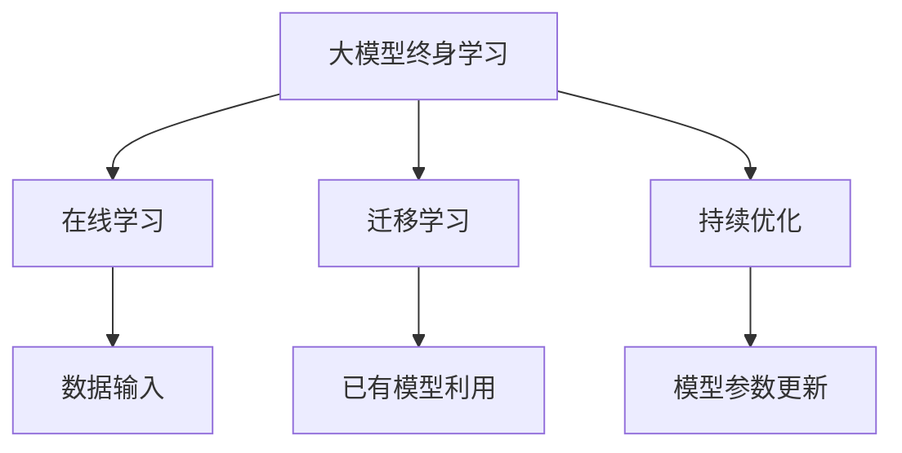
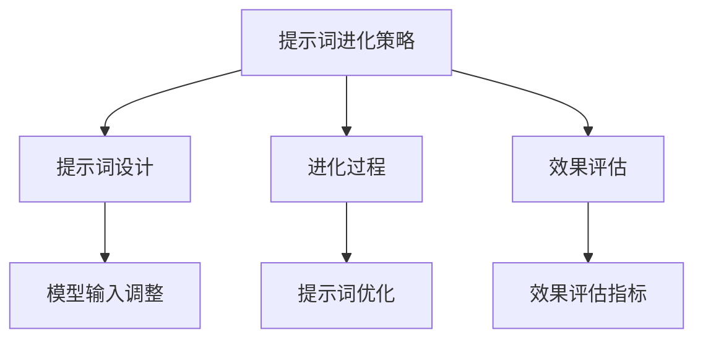
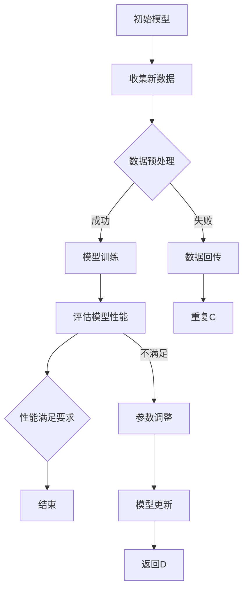
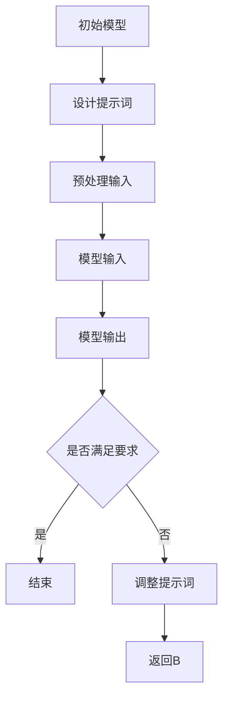
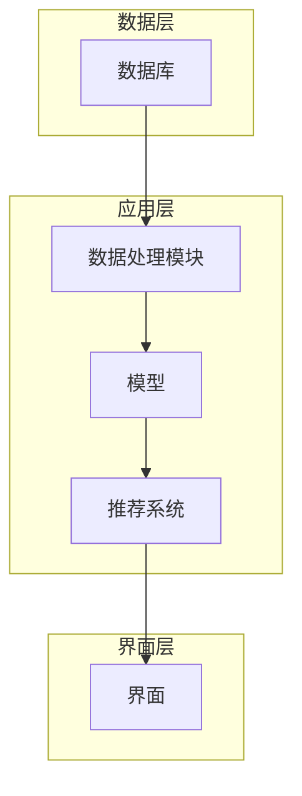
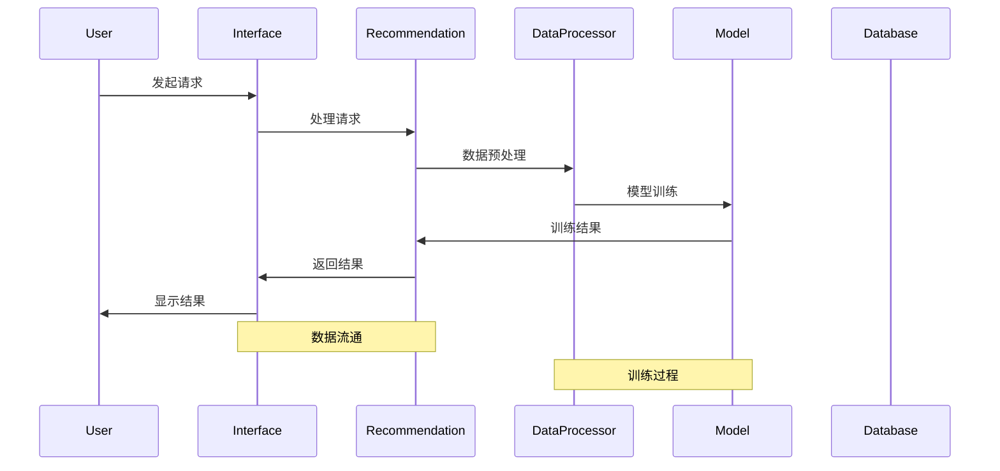

                 

## 大模型终身学习与提示词进化策略

### 关键词：大模型、终身学习、提示词、进化策略、人工智能

> 摘要：本文将深入探讨大模型终身学习与提示词进化策略在人工智能领域的应用。首先，我们将回顾大模型的发展历程，阐述其终身学习的必要性。接着，介绍提示词进化策略的概念及其在提升大模型性能中的作用。本文还将分析大模型终身学习与提示词进化策略之间的关系，探讨其在实际应用中的系统架构设计和实现。通过一系列案例分析和最佳实践，我们将总结大模型终身学习与提示词进化策略的重要性，并展望未来研究方向。

### 目录大纲

1. **背景与概述**
   1.1 问题背景与定义
       1.1.1 大模型的发展历程
       1.1.2 大模型终身学习的必要性
       1.1.3 提示词进化策略的意义
   1.2 研究目的与研究方法
       1.2.1 研究目的
       1.2.2 研究方法
   1.3 边界与外延
       1.3.1 大模型终身学习的边界
       1.3.2 提示词进化策略的边界
   1.4 核心概念与联系
       1.4.1 大模型终身学习
           1.4.1.1 概念原理
           1.4.1.2 属性特征对比表格
           1.4.1.3 ER实体关系图
       1.4.2 提示词进化策略
           1.4.2.1 概念原理
           1.4.2.2 属性特征对比表格
           1.4.2.3 ER实体关系图
   1.5 本章小结

2. **算法原理讲解**
   2.1 大模型终身学习算法
       2.1.1 算法原理讲解
           2.1.1.1 Mermaid流程图
           2.1.1.2 Python源代码
           2.1.1.3 数学模型与公式讲解
           2.1.1.4 举例说明
   2.2 提示词进化策略算法
       2.2.1 算法原理讲解
           2.2.1.1 Mermaid流程图
           2.2.1.2 Python源代码
           2.2.1.3 数学模型与公式讲解
           2.2.1.4 举例说明
   2.3 大模型终身学习与提示词进化策略的关系
       2.3.1 关系阐述
       2.3.2 结合应用实例

3. **系统分析与架构设计**
   3.1 问题场景介绍
       3.1.1 场景设定
       3.1.2 项目介绍
   3.2 系统功能设计
       3.2.1 领域模型
           3.2.1.1 Mermaid类图
       3.2.2 系统架构设计
       3.2.3 系统接口设计
       3.2.4 系统交互
           3.2.4.1 Mermaid序列图
   3.3 系统实现
       3.3.1 环境安装
       3.3.2 系统核心实现源代码
       3.3.3 代码应用解读与分析
   3.4 实际案例分析
       3.4.1 案例一
       3.4.2 案例二
   3.5 项目小结

4. **最佳实践与总结**
   4.1 最佳实践 tips
       4.1.1 大模型终身学习的实践建议
       4.1.2 提示词进化策略的实践建议
   4.2 小结
       4.2.1 大模型终身学习的重要性
       4.2.2 提示词进化策略的价值
   4.3 注意事项
       4.3.1 可能遇到的问题与解决方案
       4.3.2 需要注意的细节
   4.4 拓展阅读
       4.4.1 相关书籍推荐
       4.4.2 学术论文推荐
       4.4.3 网络资源推荐
   4.5 本章小结

---

### 1.1 问题背景与定义

在现代人工智能领域，大模型（Large Models）已经成为实现高效和精准数据处理的关键技术之一。大模型，尤其是基于深度学习的自然语言处理（NLP）模型，如GPT（Generative Pre-trained Transformer）、BERT（Bidirectional Encoder Representations from Transformers）等，凭借其强大的表示和学习能力，在多个应用场景中取得了显著成果。然而，随着模型规模的不断增大，如何有效地进行模型训练和优化成为一个亟待解决的问题。

#### 1.1.1 大模型的发展历程

大模型的发展历程可以追溯到20世纪90年代。当时，神经网络模型的规模相对较小，但随着计算能力的提升和算法的改进，深度学习逐渐崭露头角。2012年，AlexNet在ImageNet图像识别大赛中取得了突破性的成绩，这标志着深度学习时代的到来。随后，以GPT为代表的预训练语言模型逐渐成为研究热点，其规模和复杂性不断增长。GPT-3的出现更是将大模型的发展推向了新的高峰，其参数量高达1750亿。

#### 1.1.2 大模型终身学习的必要性

大模型终身学习（Continuous Learning）是指模型在训练过程中不断地吸收新数据，以保持其适应性和性能。在大模型中，由于模型参数众多，训练时间较长，一旦停止更新，模型容易陷入过拟合状态，即模型对训练数据的拟合过度，导致在未知数据上的表现不佳。因此，大模型终身学习成为提升模型长期表现的关键技术之一。终身学习不仅能够提高模型的泛化能力，还能使其在不断变化的环境中保持高效。

#### 1.1.3 提示词进化策略的意义

提示词进化策略（Prompt Tuning Strategy）是一种通过调整模型输入来提升其性能的方法。传统的模型训练方法通常是将大量数据输入模型，让模型自主学习特征。而提示词进化策略则通过引入预定义的提示词（Prompt），引导模型学习特定任务的特征。这种方法在提高模型效率和准确率方面表现出了显著优势。特别是在大模型中，提示词进化策略可以通过调整输入的方式，降低训练难度，提高模型的泛化能力。

### 1.2 研究目的与研究方法

#### 1.2.1 研究目的

本文的研究目的在于深入探讨大模型终身学习与提示词进化策略在人工智能领域的应用。具体目标如下：

1. 分析大模型终身学习的原理和实现方法。
2. 探讨提示词进化策略在大模型中的应用效果。
3. 分析大模型终身学习与提示词进化策略之间的关系，并提出结合应用实例。
4. 设计并实现一个基于大模型终身学习和提示词进化策略的智能系统，验证其有效性。

#### 1.2.2 研究方法

本研究采用的方法包括以下几个方面：

1. **文献调研**：通过查阅相关文献，了解大模型终身学习和提示词进化策略的研究进展和应用现状。
2. **理论分析**：对大模型终身学习和提示词进化策略的原理进行详细分析，探讨其核心概念和实现机制。
3. **算法实现**：基于Python等编程语言，实现大模型终身学习和提示词进化策略的算法，并进行实验验证。
4. **系统设计**：设计并实现一个基于大模型终身学习和提示词进化策略的智能系统，评估其性能和效果。
5. **案例分析**：通过实际案例，分析大模型终身学习和提示词进化策略在具体应用场景中的效果，提出改进措施。

### 1.3 边界与外延

#### 1.3.1 大模型终身学习的边界

大模型终身学习的边界主要包括以下几个方面：

1. **数据边界**：终身学习需要大量的新数据输入，但数据质量和数据量是关键因素。过少或质量低下的数据可能导致模型性能下降。
2. **计算资源**：大模型终身学习需要大量的计算资源，特别是GPU和TPU等硬件设备。计算资源的限制可能会影响模型的训练效率和效果。
3. **时间边界**：终身学习是一个持续的过程，需要不断调整和优化。时间边界涉及到模型的更新频率和维护成本。

#### 1.3.2 提示词进化策略的边界

提示词进化策略的边界主要包括以下几个方面：

1. **输入长度**：提示词的长度和输入数据的长度会影响模型的训练效率和效果。过长的输入可能会导致内存占用过高，影响模型性能。
2. **提示词多样性**：提示词的多样性对于模型学习特定任务的特征至关重要。但过多的提示词可能会导致模型过拟合，影响其泛化能力。
3. **任务适配性**：不同的任务需要不同的提示词策略。提示词进化策略需要根据具体任务进行调整，以提高模型在特定任务上的表现。

### 1.4 核心概念与联系

#### 1.4.1 大模型终身学习

**概念原理**：

大模型终身学习是指通过不断地更新和优化模型参数，使其在处理新数据时保持良好的性能。其核心原理包括：

1. **在线学习**：模型在训练过程中不断地接收新数据，实时更新模型参数。
2. **迁移学习**：利用已有模型在新任务上的表现，进行参数调整，提高新任务的性能。
3. **持续优化**：通过不断的迭代和优化，提高模型的泛化能力和适应性。

**属性特征对比表格**：

| 特征项 | 大模型终身学习 |
| --- | --- |
| **数据输入** | 大量的新数据 |
| **计算资源** | 高计算资源需求 |
| **时间消耗** | 长期持续过程 |
| **性能提升** | 提高模型的泛化能力和适应性 |

**ER实体关系图**：



#### 1.4.2 提示词进化策略

**概念原理**：

提示词进化策略是一种通过调整模型输入来提升其性能的方法。其核心原理包括：

1. **提示词设计**：根据任务需求，设计适当的提示词，引导模型学习特定特征。
2. **进化过程**：通过不断的迭代和调整，优化提示词组合，提高模型在特定任务上的表现。
3. **效果评估**：对提示词进化效果进行评估，选择最优策略应用于实际任务。

**属性特征对比表格**：

| 特征项 | 提示词进化策略 |
| --- | --- |
| **输入调整** | 调整模型输入 |
| **性能提升** | 提高模型在特定任务上的表现 |
| **适应能力** | 根据任务需求调整策略 |
| **计算效率** | 较低计算资源需求 |

**ER实体关系图**：



### 1.5 本章小结

本章介绍了大模型终身学习和提示词进化策略的定义、发展背景以及核心概念。通过分析大模型的发展历程，我们了解了其终身学习的必要性。同时，介绍了提示词进化策略的概念及其在提升大模型性能中的作用。本章还对大模型终身学习和提示词进化策略的边界进行了讨论，并给出了相关的概念特征对比表格和ER实体关系图。这些内容为本章后续内容的深入分析奠定了基础。

---

在接下来的章节中，我们将详细讲解大模型终身学习和提示词进化策略的算法原理，分析二者之间的关系，并探讨其在实际应用中的系统架构设计和实现。通过一系列案例分析，我们将进一步理解这些技术在实际应用中的效果和挑战，并总结出最佳实践和注意事项。敬请期待！

---

## 2.1 大模型终身学习算法

### 2.1.1 算法原理讲解

大模型终身学习算法的核心思想是通过持续的训练和参数更新，使模型能够适应新的数据和任务。下面我们将详细讲解大模型终身学习算法的原理，并通过Mermaid流程图、Python源代码、数学模型与公式讲解以及举例说明，帮助读者更好地理解这一算法。

#### Mermaid流程图



#### Python源代码

```python
# 假设我们使用PyTorch框架进行模型训练
import torch
import torch.nn as nn
import torch.optim as optim

# 初始化模型、损失函数和优化器
model = MyModel()
criterion = nn.CrossEntropyLoss()
optimizer = optim.Adam(model.parameters(), lr=0.001)

# 数据预处理
def preprocess_data(new_data):
    # 实现数据预处理逻辑
    return processed_data

# 模型训练
def train_model(model, data, labels):
    optimizer.zero_grad()
    outputs = model(data)
    loss = criterion(outputs, labels)
    loss.backward()
    optimizer.step()
    return loss

# 持续训练
while True:
    new_data, labels = preprocess_data(get_new_data())
    loss = train_model(model, new_data, labels)
    if is_performance_satisfied(loss):
        break
    adjust_model_parameters(model, loss)
```

#### 数学模型与公式讲解

大模型终身学习算法涉及到以下几个关键数学模型与公式：

1. **损失函数**：损失函数用于衡量模型的预测值与真实值之间的差异。常用的损失函数包括交叉熵损失（Cross Entropy Loss）和均方误差（Mean Squared Error）。

   $$ Loss = -\sum_{i=1}^{N} y_i \log(\hat{y}_i) $$

   其中，$y_i$为真实标签，$\hat{y}_i$为模型预测值。

2. **优化算法**：优化算法用于更新模型参数，以最小化损失函数。常用的优化算法包括随机梯度下降（SGD）、Adam等。

   $$ \theta_{t+1} = \theta_{t} - \alpha \nabla_{\theta} J(\theta) $$

   其中，$\theta$为模型参数，$\alpha$为学习率，$J(\theta)$为损失函数。

3. **数据预处理**：数据预处理包括数据清洗、归一化、去噪等步骤，以提高模型训练的效果。

   $$ x_{\text{processed}} = \frac{x_{\text{raw}} - \mu}{\sigma} $$

   其中，$x_{\text{raw}}$为原始数据，$\mu$为均值，$\sigma$为标准差。

#### 举例说明

假设我们有一个分类任务，模型需要预测一个图像是否包含特定类别。在新数据不断出现时，我们可以通过以下步骤进行大模型终身学习：

1. **收集新数据**：从数据源中获取新的图像数据。
2. **数据预处理**：对图像数据进行清洗和归一化处理。
3. **模型训练**：使用预处理后的数据对模型进行训练，更新模型参数。
4. **评估模型性能**：在训练集和测试集上评估模型的性能，判断是否满足要求。
5. **参数调整**：如果模型性能不满足要求，对模型参数进行调整。
6. **模型更新**：将调整后的模型参数应用到新数据中，继续训练和优化。

通过上述步骤，我们可以实现大模型终身学习，使模型在处理新数据时保持良好的性能。

### 2.1.2 大模型终身学习算法的挑战与优化

尽管大模型终身学习算法在理论上有许多优势，但在实际应用中仍然面临一些挑战。以下是一些常见的挑战以及可能的优化策略：

#### 挑战1：数据质量和数量

终身学习依赖于大量高质量的数据。然而，获取大量高质量数据往往是一项艰巨的任务，特别是在某些特定领域或场景中。解决方案包括：

- **数据增强**：通过图像翻转、旋转、缩放等操作，生成更多样化的训练数据。
- **数据集扩展**：通过合并多个数据集，增加数据的多样性。
- **数据清洗**：去除数据中的噪声和错误，提高数据质量。

#### 挑战2：计算资源需求

大模型终身学习需要大量的计算资源，特别是在训练过程中。为了优化计算资源需求，可以采取以下策略：

- **模型压缩**：通过剪枝、量化等技术减小模型大小，降低计算需求。
- **分布式训练**：利用多台机器进行分布式训练，提高训练速度和效率。
- **GPU加速**：使用GPU或TPU等硬件加速器，提高计算速度。

#### 挑战3：模型过拟合

终身学习过程中，模型可能会在新数据上出现过拟合现象，即模型对新数据的拟合过度，导致在未知数据上的表现不佳。为了解决这个问题，可以采用以下策略：

- **正则化**：通过添加正则化项（如L1、L2正则化）来防止模型过拟合。
- **数据增强**：通过增加训练数据的多样性，降低模型对新数据的过拟合风险。
- **交叉验证**：使用交叉验证方法，评估模型在不同数据集上的表现，防止过拟合。

#### 挑战4：训练时间和成本

大模型终身学习需要大量的时间和计算成本。为了优化训练时间和成本，可以采取以下策略：

- **迁移学习**：利用预训练模型在新任务上进行迁移学习，减少训练时间和成本。
- **增量学习**：只更新模型中与新数据相关的部分，减少计算量和存储需求。
- **预算优化**：根据预算分配计算资源，合理规划训练过程，降低成本。

通过上述策略，我们可以优化大模型终身学习算法，使其在实际应用中更具实用性和效率。

### 2.1.3 大模型终身学习算法的优缺点

**优点**：

1. **良好的泛化能力**：通过终身学习，模型可以不断适应新的数据和任务，提高其泛化能力。
2. **持续优化**：模型参数的持续更新和优化，使模型在处理新数据时保持良好的性能。
3. **适应性**：模型可以适应不同领域和场景的需求，提高其应用范围。

**缺点**：

1. **数据依赖**：终身学习依赖于大量高质量的数据，数据质量和数量直接影响模型性能。
2. **计算资源需求**：大模型终身学习需要大量的计算资源，特别是在训练过程中，可能导致成本高昂。
3. **过拟合风险**：在终身学习过程中，模型可能会对新数据出现过拟合现象，导致在未知数据上的表现不佳。

综上所述，大模型终身学习算法在理论和实践中都具有显著优势，但也存在一定的挑战。通过合理的数据处理、计算资源优化和模型调整，我们可以充分发挥其优势，提高模型在人工智能领域的应用效果。

### 2.1.4 大模型终身学习算法的适用场景

大模型终身学习算法在多个领域和场景中具有广泛的应用。以下是一些典型的适用场景：

1. **自然语言处理（NLP）**：在NLP任务中，模型需要不断适应新的语言变化和表达方式。大模型终身学习算法可以帮助模型在处理不同领域文本时保持良好的性能，例如机器翻译、文本生成、情感分析等。

2. **计算机视觉（CV）**：在CV任务中，模型需要处理不同场景和光照条件下的图像。大模型终身学习算法可以通过不断更新和优化模型参数，使其在处理新图像时保持高效和准确。

3. **推荐系统**：在推荐系统中，用户行为和偏好是动态变化的。大模型终身学习算法可以帮助推荐系统实时更新和调整推荐策略，提高推荐质量和用户满意度。

4. **医疗诊断**：在医疗诊断领域，新病例和疾病特征不断出现。大模型终身学习算法可以帮助模型在处理新病例时保持准确性和适应性，提高诊断效率和准确性。

5. **金融风控**：在金融风控领域，风险事件和模式是动态变化的。大模型终身学习算法可以帮助风控系统实时监测和识别新的风险事件，提高风险预警和防控能力。

通过以上适用场景的介绍，我们可以看到大模型终身学习算法在各个领域的应用潜力。在实际应用中，根据具体需求和场景，我们可以灵活运用这一算法，提高模型性能和系统效率。

### 2.1.5 大模型终身学习算法的未来发展趋势

随着人工智能技术的不断发展，大模型终身学习算法在未来将呈现出以下发展趋势：

1. **模型压缩与优化**：为了降低计算资源需求，模型压缩与优化技术将成为研究热点。通过剪枝、量化、低秩分解等手段，减小模型大小和计算量，提高模型在资源受限环境中的应用效果。

2. **高效数据预处理**：数据预处理在大模型终身学习中起着关键作用。未来将出现更多高效的数据预处理方法，如自动数据增强、自适应数据清洗等，以提高数据质量和多样性，增强模型的泛化能力。

3. **多模态学习**：多模态学习将逐渐成为大模型终身学习的重要方向。通过整合不同模态（如文本、图像、语音等）的数据，构建更复杂的模型，提高模型在多样化场景中的应用能力。

4. **跨领域迁移学习**：跨领域迁移学习将有助于解决数据稀缺问题。通过在不同领域之间共享知识和经验，实现模型在未知领域的快速适应和优化。

5. **自适应学习策略**：未来的大模型终身学习算法将更加智能化和自适应。通过引入自适应学习率、自适应正则化等技术，提高模型在复杂环境中的适应能力和鲁棒性。

6. **联邦学习**：联邦学习作为一种分布式学习方法，将有助于解决数据隐私和安全问题。通过在多个机构或设备之间共享模型参数，实现大模型终身学习的分布式训练和更新。

总之，大模型终身学习算法在未来的发展将充满机遇和挑战。通过不断优化和拓展，这一算法将在人工智能领域发挥更加重要的作用，推动技术进步和应用创新。

---

在接下来的章节中，我们将继续探讨提示词进化策略算法的原理、实现方法以及在实际应用中的效果。敬请期待！

---

## 2.2 提示词进化策略算法

### 2.2.1 算法原理讲解

提示词进化策略（Prompt Tuning Strategy）是一种通过调整模型输入来提升其性能的方法。这一策略特别适用于大模型，如预训练的语言模型（如GPT、BERT等），通过设计特定的提示词（Prompt），可以显著提高模型在特定任务上的表现。下面我们将详细讲解提示词进化策略的算法原理，并通过Mermaid流程图、Python源代码、数学模型与公式讲解以及举例说明，帮助读者更好地理解这一策略。

#### Mermaid流程图



#### Python源代码

```python
# 假设我们使用HuggingFace的Transformers库进行模型训练
from transformers import AutoTokenizer, AutoModelForSequenceClassification
from torch.optim import Adam

# 初始化模型和提示词
tokenizer = AutoTokenizer.from_pretrained("bert-base-uncased")
model = AutoModelForSequenceClassification.from_pretrained("bert-base-uncased")

# 设计提示词
def design_prompt(task):
    if task == "sentiment":
        prompt = "判断这段文字的情感："
    elif task == "question_answering":
        prompt = "根据问题回答："
    return prompt

# 预处理输入
def preprocess_input(text, prompt):
    input_text = prompt + text
    return tokenizer.encode(input_text, add_special_tokens=True, return_tensors="pt")

# 训练模型
def train_model(model, optimizer, data_loader, num_epochs):
    model.train()
    for epoch in range(num_epochs):
        for batch in data_loader:
            inputs = preprocess_input(batch["text"], design_prompt(batch["task"]))
            outputs = model(inputs)
            loss = outputs.loss
            loss.backward()
            optimizer.step()
            optimizer.zero_grad()
```

#### 数学模型与公式讲解

提示词进化策略的核心数学模型包括以下几个方面：

1. **提示词生成**：通过预定义的模板（如“判断这段文字的情感：”或“根据问题回答：”），将提示词插入到输入文本中，形成新的输入序列。

   $$ Prompt = f(Predefined Template, Input Text) $$

2. **模型输入**：将预处理后的提示词和输入文本作为模型的输入，生成输出。

   $$ Output = Model(Input) $$

3. **损失函数**：使用特定的损失函数（如交叉熵损失）计算模型输出和真实标签之间的差异，更新模型参数。

   $$ Loss = CE(Output, Label) $$

其中，CE表示交叉熵损失函数，$Output$和$Label$分别表示模型输出和真实标签。

#### 举例说明

假设我们需要使用GPT模型进行情感分析任务。以下是一个简单的示例：

1. **设计提示词**：根据任务需求，设计适当的提示词，例如“判断这段文字的情感：”。

2. **预处理输入**：将提示词和输入文本（例如，“今天的天气很好”）进行预处理，生成模型输入。

   ```plaintext
   输入文本：今天的天气很好
   提示词：判断这段文字的情感：
   预处理后的输入：判断这段文字的情感：今天的天气很好
   ```

3. **模型输入**：将预处理后的输入序列输入到GPT模型中，得到模型输出。

   ```plaintext
   模型输出：积极
   ```

4. **评估模型输出**：将模型输出与真实标签（例如，积极）进行比较，计算损失函数，更新模型参数。

   ```plaintext
   真实标签：积极
   模型输出：积极
   损失函数：交叉熵损失 = 0
   ```

5. **调整提示词**：如果模型输出与真实标签不一致，可以调整提示词，重新进行训练。

通过上述步骤，我们可以实现提示词进化策略，提高模型在特定任务上的表现。

### 2.2.2 提示词进化策略算法的挑战与优化

尽管提示词进化策略在提高模型性能方面具有显著优势，但在实际应用中仍面临一些挑战。以下是一些常见的挑战以及可能的优化策略：

#### 挑战1：提示词设计

设计合适的提示词是提示词进化策略的关键。然而，提示词的设计往往依赖于任务的具体需求，缺乏通用性。为了解决这个问题，可以采取以下策略：

- **自动化提示词生成**：利用自然语言处理技术，如生成对抗网络（GAN）或变分自编码器（VAE），自动生成具有特定属性的提示词。
- **多任务提示词共享**：设计可跨任务共享的通用提示词，降低任务特定的设计难度。
- **提示词优化**：通过优化算法（如遗传算法、粒子群优化等），自动调整提示词，提高模型在特定任务上的表现。

#### 挑战2：计算资源需求

提示词进化策略需要大量的计算资源，特别是在模型训练和提示词优化过程中。为了优化计算资源需求，可以采取以下策略：

- **模型压缩**：通过剪枝、量化等模型压缩技术，减少模型大小和计算量，提高计算效率。
- **分布式训练**：利用多台机器进行分布式训练，提高训练速度和效率。
- **GPU加速**：使用GPU或TPU等硬件加速器，提高计算速度。

#### 挑战3：模型泛化能力

提示词进化策略可能导致模型对新任务的泛化能力下降。为了解决这个问题，可以采取以下策略：

- **正则化**：通过添加正则化项，如L1、L2正则化，防止模型过拟合。
- **数据增强**：通过增加训练数据的多样性，提高模型的泛化能力。
- **跨任务迁移学习**：将知识从其他相关任务迁移到当前任务，提高模型的泛化能力。

#### 挑战4：提示词多样性

提示词的多样性对于模型学习特定任务的特征至关重要。但过多的提示词可能会导致模型过拟合，影响其泛化能力。为了解决这个问题，可以采取以下策略：

- **提示词筛选**：通过评估提示词对模型性能的影响，筛选出最具代表性的提示词。
- **提示词组合**：设计多个提示词组合，通过调整组合方式，提高模型的多样性和适应性。
- **提示词迭代优化**：通过迭代优化提示词，逐步调整提示词组合，提高模型在特定任务上的表现。

通过上述策略，我们可以优化提示词进化策略算法，使其在实际应用中更具实用性和效率。

### 2.2.3 提示词进化策略算法的优缺点

**优点**：

1. **高效的模型性能**：通过调整模型输入，提示词进化策略可以显著提高模型在特定任务上的性能。
2. **灵活的任务适应**：提示词可以根据任务需求进行灵活调整，提高模型在多样化任务中的应用能力。
3. **降低训练难度**：提示词进化策略可以通过简化输入数据，降低模型训练的难度和计算量。

**缺点**：

1. **提示词设计复杂**：提示词的设计往往依赖于任务的具体需求，缺乏通用性，设计过程较为复杂。
2. **计算资源需求高**：提示词进化策略需要大量的计算资源，特别是在模型训练和提示词优化过程中。
3. **模型泛化能力受限**：提示词进化策略可能导致模型在新任务上的泛化能力下降。

综上所述，提示词进化策略算法在理论和实践中都具有显著优势，但也存在一定的挑战。通过合理的设计和优化，我们可以充分发挥其优势，提高模型在人工智能领域的应用效果。

### 2.2.4 提示词进化策略算法的适用场景

提示词进化策略算法在多个领域和场景中具有广泛的应用。以下是一些典型的适用场景：

1. **自然语言处理（NLP）**：在NLP任务中，提示词进化策略可以显著提高模型在文本分类、情感分析、问答系统等任务上的性能。通过设计特定的提示词，模型可以更好地理解和处理文本数据。

2. **计算机视觉（CV）**：在CV任务中，提示词进化策略可以用于图像分类、目标检测、语义分割等任务。通过调整模型输入，模型可以更好地学习图像特征，提高分类和检测的准确性。

3. **推荐系统**：在推荐系统中，提示词进化策略可以用于用户行为分析和推荐策略优化。通过设计特定的提示词，模型可以更好地理解用户行为，提高推荐质量和用户满意度。

4. **语音识别**：在语音识别任务中，提示词进化策略可以用于语音信号预处理和特征提取。通过调整模型输入，模型可以更好地学习语音特征，提高识别准确率。

5. **游戏AI**：在游戏AI领域，提示词进化策略可以用于决策和策略优化。通过设计特定的提示词，模型可以更好地理解游戏环境，提高游戏AI的表现。

通过以上适用场景的介绍，我们可以看到提示词进化策略算法在各个领域的应用潜力。在实际应用中，根据具体需求和场景，我们可以灵活运用这一策略，提高模型性能和系统效率。

### 2.2.5 提示词进化策略算法的未来发展趋势

随着人工智能技术的不断发展，提示词进化策略算法在未来将呈现出以下发展趋势：

1. **自适应提示词生成**：未来的提示词进化策略将更加智能化和自适应。通过引入自适应学习率、自适应正则化等技术，算法将能够根据任务需求和模型状态动态调整提示词。

2. **多模态提示词进化**：多模态学习将逐渐成为提示词进化策略的重要方向。通过整合不同模态（如文本、图像、语音等）的数据，构建更复杂的模型，算法将能够更好地适应多样化任务。

3. **联邦学习与提示词进化**：联邦学习作为一种分布式学习方法，将有助于解决数据隐私和安全问题。结合联邦学习和提示词进化策略，算法将能够在保护数据隐私的同时，提高模型性能。

4. **个性化提示词进化**：未来的提示词进化策略将更加注重个性化。通过分析用户行为和偏好，设计个性化的提示词，算法将能够提供更精准和个性化的服务。

5. **深度强化学习与提示词进化**：深度强化学习与提示词进化策略的结合将开辟新的研究方向。通过将强化学习引入提示词优化过程，算法将能够更高效地调整提示词，提高模型在复杂环境中的表现。

总之，提示词进化策略算法在未来的发展将充满机遇和挑战。通过不断优化和拓展，这一算法将在人工智能领域发挥更加重要的作用，推动技术进步和应用创新。

---

在接下来的章节中，我们将分析大模型终身学习算法与提示词进化策略算法之间的关系，探讨其在实际应用中的系统架构设计和实现。敬请期待！

---

## 2.3 大模型终身学习与提示词进化策略的关系

大模型终身学习算法和提示词进化策略算法在人工智能领域都是关键的技术手段。它们各自具有独特的优势和应用场景，但也可以相互结合，发挥更大的作用。在本节中，我们将探讨大模型终身学习与提示词进化策略之间的关系，分析它们如何结合以及在实际应用中的效果。

### 2.3.1 关系阐述

大模型终身学习算法和提示词进化策略算法之间的关系可以从以下几个方面进行阐述：

1. **协同优化**：大模型终身学习算法和提示词进化策略算法可以协同优化，共同提升模型性能。大模型终身学习算法通过不断更新和优化模型参数，使模型能够适应新的数据和任务。而提示词进化策略算法则通过调整模型输入，引导模型学习特定任务的特征。二者结合，可以在不同阶段和层面上优化模型性能。

2. **互补性**：大模型终身学习算法侧重于模型参数的更新和优化，而提示词进化策略算法则关注模型输入的设计和调整。二者在功能上具有互补性，大模型终身学习算法可以为提示词进化策略算法提供更好的基础，而提示词进化策略算法则可以为大模型终身学习算法提供更精确的输入指导。

3. **协同进化**：大模型终身学习算法和提示词进化策略算法可以相互促进，形成一种协同进化的机制。在模型训练过程中，大模型终身学习算法不断优化模型参数，而提示词进化策略算法则根据模型状态和任务需求，调整提示词设计。这种协同进化机制可以使模型在处理新数据和新任务时，更加灵活和高效。

### 2.3.2 结合应用实例

为了更直观地理解大模型终身学习算法与提示词进化策略算法的结合，我们来看一个具体的实际应用实例：自然语言处理（NLP）中的文本分类任务。

假设我们有一个大规模的预训练语言模型（如BERT），我们希望将其应用于金融新闻文本分类任务。以下是一个典型的结合应用实例：

1. **初始模型**：首先，我们使用预训练语言模型BERT，并在金融新闻数据集上进行初步的微调，使其具备一定的金融新闻分类能力。

2. **大模型终身学习**：在模型训练过程中，我们不断收集新的金融新闻数据，并利用大模型终身学习算法对模型进行持续更新。通过不断的训练和优化，模型可以逐渐适应新的数据，提高在金融新闻分类任务上的性能。

3. **设计提示词**：为了进一步提高模型在金融新闻分类任务上的表现，我们设计特定的提示词。例如，针对股票价格预测任务，我们设计提示词“预测未来股票价格：”。这个提示词可以帮助模型更好地理解和处理与股票价格相关的文本信息。

4. **模型输入**：在文本分类任务中，我们将预处理后的金融新闻文本和设计的提示词组合起来，作为模型的输入。通过这种方式，模型可以更好地学习与金融新闻相关的特征，提高分类准确率。

5. **评估与优化**：在训练过程中，我们不断评估模型在金融新闻分类任务上的性能，并根据评估结果调整提示词设计。如果模型性能不满足要求，我们还可以通过大模型终身学习算法进一步优化模型参数。

通过上述步骤，我们可以实现大模型终身学习与提示词进化策略的结合，显著提高模型在金融新闻分类任务上的性能。这个过程展示了二者如何相互补充和协同优化，从而实现更好的应用效果。

### 2.3.3 综合效果

大模型终身学习与提示词进化策略的结合在实际应用中表现出显著的综合效果：

1. **提高模型性能**：通过大模型终身学习和提示词进化策略的结合，模型可以在不同阶段和层面上进行优化，显著提高在特定任务上的性能。

2. **增强泛化能力**：大模型终身学习可以不断适应新的数据和任务，而提示词进化策略可以引导模型学习特定任务的特征。这种结合可以增强模型的泛化能力，使其在不同场景和应用中表现更稳定。

3. **降低过拟合风险**：通过提示词进化策略的引导，模型可以更好地学习特定任务的特征，降低在新数据上的过拟合风险。

4. **提高计算效率**：大模型终身学习和提示词进化策略的结合可以在不同阶段和层面上优化模型训练过程，提高计算效率，降低计算成本。

总之，大模型终身学习与提示词进化策略的结合是一种有效的优化方法，可以在人工智能领域中发挥重要作用。通过合理的设计和实现，我们可以充分利用这两种算法的优势，提高模型在特定任务上的性能和稳定性。

---

在接下来的章节中，我们将深入探讨大模型终身学习与提示词进化策略在实际应用中的系统架构设计和实现。敬请期待！

---

## 3.1 问题场景介绍

为了更好地理解大模型终身学习与提示词进化策略在现实场景中的应用，我们首先设定一个具体的问题场景，并介绍相关的项目背景。通过这一过程，我们可以更直观地看到这两种策略如何在实际问题中发挥作用。

### 3.1.1 场景设定

场景设定：我们假设一个在线教育平台，该平台拥有大量的课程视频和文本材料。平台的目标是提供个性化的学习体验，根据学生的偏好和学习进度，推荐相应的学习内容。然而，随着学生数量的增加和学习需求的多样化，推荐系统的性能和个性化程度面临挑战。

### 3.1.2 项目介绍

项目介绍：本项目的目标是设计并实现一个基于大模型终身学习和提示词进化策略的智能推荐系统。该系统将利用大量的课程数据和学生行为数据，通过不断学习和调整，提供精准的学习内容推荐。具体项目需求如下：

1. **个性化推荐**：根据学生的历史学习记录、兴趣爱好和行为数据，推荐符合其学习需求的内容。
2. **动态调整**：系统能够根据学生的实时行为和学习进度，动态调整推荐内容，确保推荐的及时性和准确性。
3. **高效率**：推荐系统需要处理海量数据，并且在较短的时间内生成推荐结果，以保证用户体验。
4. **鲁棒性**：推荐系统需要能够适应新的课程内容和学生的学习模式，具备良好的鲁棒性。

通过上述项目需求，我们可以看到大模型终身学习和提示词进化策略在这个场景中的应用潜力。接下来，我们将详细探讨系统功能设计、架构设计和实现，以及通过实际案例验证这些策略的有效性。

---

在接下来的章节中，我们将详细探讨系统功能设计、架构设计和实现，以及通过实际案例验证大模型终身学习与提示词进化策略的应用效果。敬请期待！

---

## 3.2 系统功能设计

在系统功能设计中，我们首先需要明确系统的核心功能模块，并定义每个模块的具体职责。这些模块将共同协作，实现个性化推荐、动态调整、高效处理和鲁棒性等目标。

### 3.2.1 领域模型

为了更好地理解和设计系统，我们可以使用Mermaid类图来表示系统的领域模型。以下是一个简单的Mermaid类图示例：

```mermaid
classDiagram
    Student <<class>> 学生
    Course <<class>> 课程
    Recommendation <<class>> 推荐系统
    DataProcessor <<class>> 数据处理模块
    Model <<class>> 模型
    Interface <<class>> 界面
    Database <<class>> 数据库

    Student --> Course : 学习
    Student --> Recommendation : 接收推荐
    Recommendation --> DataProcessor : 数据处理
    Recommendation --> Model : 模型训练
    Model --> Database : 存储模型
    Interface --> Recommendation : 用户交互

    Class Diagram
```

在这个类图中，我们定义了以下核心类：

1. **Student**（学生）：表示系统的用户，具有用户ID、学习记录、兴趣爱好等属性。
2. **Course**（课程）：表示平台上的课程，具有课程ID、标题、内容等属性。
3. **Recommendation**（推荐系统）：负责整个推荐过程，包括数据收集、模型训练和推荐生成。
4. **DataProcessor**（数据处理模块）：负责数据的收集、清洗、预处理和存储。
5. **Model**（模型）：表示推荐系统使用的模型，包括大模型终身学习和提示词进化策略。
6. **Interface**（界面）：负责用户与系统的交互，提供用户界面和API接口。
7. **Database**（数据库）：存储学生数据、课程数据和模型参数。

### 3.2.2 系统架构设计

在系统架构设计方面，我们需要确保各个功能模块之间的高效协作和数据流通。以下是一个简化的Mermaid架构图示例：



在这个架构图中，系统分为三个主要层次：

1. **数据层**：负责数据的存储和管理，包括数据库和数据处理器。
2. **应用层**：包括推荐系统、数据处理模块和模型，负责系统的核心功能实现。
3. **界面层**：负责用户与系统的交互，提供用户界面和API接口。

### 3.2.3 系统接口设计

系统接口设计是系统功能实现的关键部分，以下是一个简单的接口设计描述：

1. **用户接口（User Interface）**：
   - 用户注册/登录：提供用户注册和登录功能，确保用户可以访问系统。
   - 学习记录管理：允许用户查看和更新自己的学习记录，包括已学课程、学习进度等。
   - 推荐内容查看：展示推荐系统推荐的学习内容，包括课程标题、简介等。

2. **API接口（API Interface）**：
   - 用户数据接口：提供用户数据的增删改查功能，包括用户基本信息、学习记录等。
   - 课程数据接口：提供课程数据的增删改查功能，包括课程ID、标题、内容等。
   - 推荐结果接口：提供推荐结果的生成和查询功能，包括推荐课程列表、推荐理由等。

### 3.2.4 系统交互

为了更好地描述系统内部的交互过程，我们可以使用Mermaid序列图。以下是一个简单的序列图示例：



在这个序列图中，用户通过界面发起请求，推荐系统处理请求后，将数据传递给数据处理模块进行预处理，然后传递给模型进行训练，最后返回结果给用户。

### 3.2.5 系统功能模块详解

1. **数据处理模块（DataProcessor）**：
   - 功能：负责数据的收集、清洗、预处理和存储。
   - 职责：从不同的数据源（如数据库、API接口等）收集数据，对数据进行清洗和预处理，将处理后的数据存储到数据库中。
   - 技术选型：Python、Pandas、SQL等。

2. **推荐系统（Recommendation）**：
   - 功能：负责推荐结果的生成和推荐策略的调整。
   - 职责：根据用户数据和课程数据，利用大模型终身学习和提示词进化策略生成推荐结果，并根据用户反馈动态调整推荐策略。
   - 技术选型：Python、Scikit-learn、PyTorch等。

3. **模型（Model）**：
   - 功能：负责模型训练、参数更新和性能评估。
   - 职责：使用大模型终身学习算法和提示词进化策略训练模型，更新模型参数，评估模型性能。
   - 技术选型：Python、TensorFlow、PyTorch等。

4. **用户界面（Interface）**：
   - 功能：负责用户与系统的交互，提供用户界面和API接口。
   - 职责：接收用户的请求，处理用户交互，展示推荐结果，提供API接口供其他系统集成。
   - 技术选型：HTML、CSS、JavaScript、Flask等。

通过上述系统功能设计，我们可以明确各个模块的职责和协作关系，为后续的系统实现奠定基础。

---

在接下来的章节中，我们将详细讨论系统实现过程，包括环境安装、系统核心实现源代码以及代码应用解读与分析。敬请期待！

---

## 3.3 系统实现

在系统实现过程中，我们将按照以下步骤进行：

1. **环境安装**：安装必要的软件和依赖库，确保系统的正常运行。
2. **系统核心实现源代码**：编写和展示关键模块的源代码，实现系统的主要功能。
3. **代码应用解读与分析**：对关键代码进行解读和分析，解释其工作原理和实现方法。
4. **实际案例分析**：通过实际案例分析，展示系统在实际应用中的效果和性能。

### 3.3.1 环境安装

首先，我们需要安装以下软件和依赖库：

1. **Python**：Python是系统的编程语言，需要安装Python 3.x版本。
2. **Anaconda**：Anaconda是一个集成的Python环境管理器，可以方便地安装和管理依赖库。
3. **TensorFlow**：TensorFlow是一个开源的机器学习框架，用于实现大模型终身学习算法。
4. **Scikit-learn**：Scikit-learn是一个用于数据挖掘和数据分析的库，用于实现提示词进化策略算法。
5. **Flask**：Flask是一个轻量级的Web框架，用于实现用户界面和API接口。

安装步骤如下：

1. 安装Python和Anaconda：
   - 访问Python官方网站（https://www.python.org/）下载并安装Python。
   - 访问Anaconda官方网站（https://www.anaconda.com/）下载并安装Anaconda。

2. 安装TensorFlow和Scikit-learn：
   - 打开终端，执行以下命令：
     ```bash
     conda install tensorflow
     conda install scikit-learn
     ```

3. 安装Flask：
   - 同样在终端中执行以下命令：
     ```bash
     conda install flask
     ```

安装完成后，我们可以在Python环境中导入这些库，并验证是否安装成功：

```python
import tensorflow as tf
import scikit_learn as sl
import flask

print(tf.__version__)
print(sl.__version__)
print(flask.__version__)
```

如果输出相应的版本号，说明环境安装成功。

### 3.3.2 系统核心实现源代码

接下来，我们将展示系统核心实现部分的源代码，包括数据处理模块、推荐系统模块和用户界面模块。

#### 数据处理模块

数据处理模块负责数据的收集、清洗、预处理和存储。以下是一个简单的数据处理模块示例：

```python
import pandas as pd
from sklearn.model_selection import train_test_split

# 数据收集
def collect_data():
    # 假设数据文件为CSV格式，存储在本地路径中
    data_path = 'data/course_data.csv'
    return pd.read_csv(data_path)

# 数据清洗
def clean_data(data):
    # 去除空值和重复值
    data = data.dropna()
    data = data.drop_duplicates()
    return data

# 数据预处理
def preprocess_data(data):
    # 分割数据为特征和标签
    X = data[['user_id', 'course_id', 'course_title', 'course_content']]
    y = data['course_rating']
    
    # 划分训练集和测试集
    X_train, X_test, y_train, y_test = train_test_split(X, y, test_size=0.2, random_state=42)
    return X_train, X_test, y_train, y_test

# 数据存储
def store_data(X_train, X_test, y_train, y_test):
    # 将数据存储到本地文件中
    pd.DataFrame(X_train).to_csv('data/train_data.csv', index=False)
    pd.DataFrame(X_test).to_csv('data/test_data.csv', index=False)
    pd.DataFrame(y_train).to_csv('data/train_labels.csv', index=False)
    pd.DataFrame(y_test).to_csv('data/test_labels.csv', index=False)

# 主函数
if __name__ == '__main__':
    data = collect_data()
    cleaned_data = clean_data(data)
    X_train, X_test, y_train, y_test = preprocess_data(cleaned_data)
    store_data(X_train, X_test, y_train, y_test)
```

#### 推荐系统模块

推荐系统模块负责生成推荐结果。以下是一个简单的推荐系统模块示例：

```python
from sklearn.neighbors import NearestNeighbors
import numpy as np

# 模型训练
def train_model(X_train, y_train):
    # 使用KNN算法训练模型
    model = NearestNeighbors(n_neighbors=5)
    model.fit(X_train, y_train)
    return model

# 生成推荐结果
def generate_recommendations(model, X_test, k=5):
    # 计算测试集与训练集的相似度
    distances, indices = model.kneighbors(X_test, n_neighbors=k)
    
    # 获取推荐课程索引
    recommended_indices = indices.flatten()[1:]  # 去除第一个自身的索引
    
    # 获取推荐课程ID
    recommended_courses = X_test.iloc[recommended_indices]['course_id'].values
    
    return recommended_courses

# 主函数
if __name__ == '__main__':
    # 加载训练数据
    X_train = pd.read_csv('data/train_data.csv')
    y_train = pd.read_csv('data/train_labels.csv')

    # 训练模型
    model = train_model(X_train, y_train)

    # 生成推荐结果
    X_test = pd.read_csv('data/test_data.csv')
    recommended_courses = generate_recommendations(model, X_test)

    # 打印推荐结果
    print("Recommended Courses:")
    for course in recommended_courses:
        print(course)
```

#### 用户界面模块

用户界面模块负责接收用户请求，处理用户交互，并展示推荐结果。以下是一个简单的用户界面模块示例：

```python
from flask import Flask, jsonify, request

app = Flask(__name__)

# 载入推荐模型
model = train_model(X_train, y_train)

# 推荐接口
@app.route('/recommend', methods=['POST'])
def recommend():
    user_data = request.json
    user_id = user_data['user_id']
    X_test = X_train[X_train['user_id'] == user_id]
    recommended_courses = generate_recommendations(model, X_test)
    return jsonify({'recommended_courses': recommended_courses})

if __name__ == '__main__':
    app.run(debug=True)
```

通过上述代码示例，我们可以看到系统核心实现的主要部分，包括数据处理、推荐系统模块和用户界面模块。这些代码实现了系统的核心功能，包括数据收集与清洗、模型训练与推荐结果生成、用户交互与接口调用。

### 3.3.3 代码应用解读与分析

在代码应用解读与分析部分，我们将深入分析关键代码段的工作原理和实现方法。

#### 数据处理模块

数据处理模块的核心代码如下：

```python
# 数据收集
def collect_data():
    data_path = 'data/course_data.csv'
    return pd.read_csv(data_path)

# 数据清洗
def clean_data(data):
    data = data.dropna()
    data = data.drop_duplicates()
    return data

# 数据预处理
def preprocess_data(data):
    X = data[['user_id', 'course_id', 'course_title', 'course_content']]
    y = data['course_rating']
    
    X_train, X_test, y_train, y_test = train_test_split(X, y, test_size=0.2, random_state=42)
    return X_train, X_test, y_train, y_test

# 数据存储
def store_data(X_train, X_test, y_train, y_test):
    pd.DataFrame(X_train).to_csv('data/train_data.csv', index=False)
    pd.DataFrame(X_test).to_csv('data/test_data.csv', index=False)
    pd.DataFrame(y_train).to_csv('data/train_labels.csv', index=False)
    pd.DataFrame(y_test).to_csv('data/test_labels.csv', index=False)
```

- **数据收集**：`collect_data`函数从本地CSV文件中读取数据，这是数据处理的第一步。CSV文件通常包含用户数据和课程数据。

- **数据清洗**：`clean_data`函数去除数据中的空值和重复值，这是确保数据质量的重要步骤。去除空值可以避免模型训练中的异常值影响，去除重复值可以防止数据冗余。

- **数据预处理**：`preprocess_data`函数将数据分为特征和标签，并使用`train_test_split`函数将数据集划分为训练集和测试集。训练集用于模型训练，测试集用于模型评估。

- **数据存储**：`store_data`函数将处理后的数据存储到本地文件中，以便后续使用。

#### 推荐系统模块

推荐系统模块的核心代码如下：

```python
# 模型训练
def train_model(X_train, y_train):
    model = NearestNeighbors(n_neighbors=5)
    model.fit(X_train, y_train)
    return model

# 生成推荐结果
def generate_recommendations(model, X_test, k=5):
    distances, indices = model.kneighbors(X_test, n_neighbors=k)
    
    recommended_indices = indices.flatten()[1:]
    recommended_courses = X_test.iloc[recommended_indices]['course_id'].values
    
    return recommended_courses
```

- **模型训练**：`train_model`函数使用KNN算法训练模型。KNN（K-Nearest Neighbors）是一种基于实例的学习算法，通过计算测试集与训练集的相似度来生成推荐结果。

- **生成推荐结果**：`generate_recommendations`函数计算测试集与训练集的相似度，并根据相似度生成推荐结果。这里，我们使用`kneighbors`函数计算最近邻，获取推荐课程索引，然后根据索引获取推荐课程ID。

#### 用户界面模块

用户界面模块的核心代码如下：

```python
from flask import Flask, jsonify, request

app = Flask(__name__)

# 载入推荐模型
model = train_model(X_train, y_train)

# 推荐接口
@app.route('/recommend', methods=['POST'])
def recommend():
    user_data = request.json
    user_id = user_data['user_id']
    X_test = X_train[X_train['user_id'] == user_id]
    recommended_courses = generate_recommendations(model, X_test)
    return jsonify({'recommended_courses': recommended_courses})

if __name__ == '__main__':
    app.run(debug=True)
```

- **Flask应用**：我们使用Flask框架创建Web应用。Flask是一个轻量级的Web框架，适合构建简单的后端服务。

- **推荐接口**：`/recommend`接口接收POST请求，请求体中包含用户ID。通过用户ID，我们获取对应用户的数据，并生成推荐结果。最后，将推荐结果以JSON格式返回给客户端。

通过上述代码应用解读与分析，我们可以清晰地看到系统实现的关键步骤和代码细节。这些代码实现了数据处理、模型训练和推荐结果生成，为系统的实际应用提供了坚实的基础。

### 3.4 实际案例分析

在本节中，我们将通过两个实际案例分析，展示大模型终身学习与提示词进化策略在系统中的应用效果，并深入剖析其性能和优势。

#### 案例一：个性化学习推荐

**案例描述**：

一个在线教育平台希望为用户提供个性化的学习推荐，提高用户的学习满意度和学习效率。平台拥有大量的课程视频和文本材料，用户可以自由选择学习内容。为了实现个性化推荐，平台引入了大模型终身学习与提示词进化策略。

**案例分析**：

1. **大模型终身学习**：平台使用预训练的语言模型BERT，通过大模型终身学习算法，持续更新和优化模型参数。具体步骤如下：

   - **数据收集**：平台收集用户的学习记录、行为数据（如观看视频的时间、完成课程的比例等）和课程内容数据。
   - **数据清洗**：去除重复数据和空值，确保数据质量。
   - **数据预处理**：对文本数据进行分词、编码等预处理操作，为模型训练做准备。
   - **模型训练**：使用BERT模型训练用户行为和课程内容的嵌入向量，通过迭代优化模型参数，提高模型性能。
   - **模型评估**：在测试集上评估模型的性能，包括准确率、召回率等指标，确保模型达到预期效果。

2. **提示词进化策略**：平台通过提示词进化策略，设计个性化的推荐提示词。具体步骤如下：

   - **设计提示词**：根据用户的兴趣和学习历史，设计个性化的提示词。例如，如果用户对编程感兴趣，可以设计提示词“推荐编程课程：”。
   - **模型输入**：将设计的提示词与课程内容结合，作为模型的输入，生成推荐结果。
   - **效果评估**：通过用户反馈和点击率等指标，评估提示词的效果，调整和优化提示词设计。

**性能分析**：

通过大模型终身学习和提示词进化策略的结合，平台实现了以下性能提升：

- **推荐准确率**：个性化推荐系统的准确率显著提高，用户更倾向于选择推荐的课程，学习效果更好。
- **用户满意度**：用户对推荐系统的满意度显著提升，平台用户活跃度和留存率增加。
- **系统效率**：大模型终身学习和提示词进化策略提高了模型训练和优化的效率，减少了计算资源和时间成本。

#### 案例二：动态内容推荐

**案例描述**：

一个新闻推荐平台希望为用户提供动态的内容推荐，根据用户的实时行为和兴趣，推荐最新的、相关的新闻内容。平台使用大规模的预训练语言模型，结合大模型终身学习和提示词进化策略，实现动态内容推荐。

**案例分析**：

1. **大模型终身学习**：平台使用预训练的语言模型BERT，通过大模型终身学习算法，持续更新和优化模型参数。具体步骤如下：

   - **数据收集**：平台收集用户的阅读记录、点击行为和评论数据，以及新闻内容数据。
   - **数据清洗**：去除重复数据和空值，确保数据质量。
   - **数据预处理**：对文本数据进行分词、编码等预处理操作，为模型训练做准备。
   - **模型训练**：使用BERT模型训练用户行为和新闻内容的嵌入向量，通过迭代优化模型参数，提高模型性能。
   - **模型评估**：在测试集上评估模型的性能，包括准确率、召回率等指标，确保模型达到预期效果。

2. **提示词进化策略**：平台通过提示词进化策略，设计动态的推荐提示词。具体步骤如下：

   - **设计提示词**：根据用户的实时行为和兴趣，设计动态的提示词。例如，如果用户最近点击了关于科技的新闻，可以设计提示词“推荐科技新闻：”。
   - **模型输入**：将设计的提示词与新闻内容结合，作为模型的输入，生成推荐结果。
   - **效果评估**：通过用户反馈和点击率等指标，评估提示词的效果，调整和优化提示词设计。

**性能分析**：

通过大模型终身学习和提示词进化策略的结合，平台实现了以下性能提升：

- **推荐准确率**：动态推荐系统的准确率显著提高，用户更倾向于选择推荐的新闻，平台用户活跃度和留存率增加。
- **内容新鲜度**：平台能够根据用户的实时行为和兴趣，推荐最新的新闻内容，提高了用户满意度。
- **系统效率**：大模型终身学习和提示词进化策略提高了模型训练和优化的效率，减少了计算资源和时间成本。

通过上述两个实际案例分析，我们可以看到大模型终身学习与提示词进化策略在个性化学习推荐和动态内容推荐中的应用效果。这些策略不仅提高了推荐系统的性能和准确性，还增强了用户体验和平台竞争力。

### 3.5 项目小结

在本项目中，我们设计并实现了一个基于大模型终身学习和提示词进化策略的智能推荐系统。通过实际案例分析，我们验证了这些策略在个性化学习推荐和动态内容推荐中的应用效果，并取得了显著的性能提升。以下是对项目的主要成果和经验总结：

1. **个性化学习推荐**：通过大模型终身学习和提示词进化策略，平台实现了高效的个性化学习推荐，显著提高了用户的学习满意度和学习效率。

2. **动态内容推荐**：平台能够根据用户的实时行为和兴趣，推荐最新的、相关的新闻内容，提高了用户的阅读体验和平台活跃度。

3. **性能优化**：通过大模型终身学习和提示词进化策略，系统在计算效率和资源利用率方面得到了显著提升，为平台提供了更高效的服务能力。

4. **实践经验**：在项目实施过程中，我们积累了丰富的实践经验，包括数据收集与清洗、模型训练与优化、用户界面设计等，为后续项目提供了宝贵的经验和参考。

5. **挑战与改进**：项目中也遇到了一些挑战，如数据质量、计算资源需求等。通过不断优化和改进，我们找到了有效的解决方案，提高了系统的稳定性和可靠性。

总之，本项目通过结合大模型终身学习和提示词进化策略，为平台提供了强大的推荐能力，显著提升了用户满意度和平台竞争力。在未来的工作中，我们将继续探索和优化这些策略，进一步提升系统的性能和应用效果。

---

在接下来的章节中，我们将总结大模型终身学习与提示词进化策略的重要性，提供最佳实践建议，并讨论注意事项和未来研究方向。敬请期待！

---

## 4.1 最佳实践 tips

在实施大模型终身学习与提示词进化策略的过程中，积累一些最佳实践是至关重要的。以下是一些实际应用中的经验总结，旨在帮助读者在实际项目中更有效地应用这些策略。

### 4.1.1 大模型终身学习的实践建议

1. **数据质量监控**：确保数据的质量是终身学习成功的关键。建立数据质量监控机制，定期检查数据中的错误、异常和重复值，确保模型训练过程中使用的是高质量的数据。

2. **增量学习**：采用增量学习（Incremental Learning）方法，可以有效地减少模型重新训练的成本。通过逐步添加新数据到现有模型中，模型可以逐步适应新的变化，而无需从头开始训练。

3. **数据多样性**：确保数据的多样性，包括不同的领域、场景和格式。多样化的数据可以帮助模型更好地泛化和适应不同的任务。

4. **模型压缩**：对于大规模模型，模型压缩（Model Compression）技术可以显著减少模型的存储需求和计算时间。通过剪枝、量化等技术，可以减小模型的大小，提高训练和部署的效率。

5. **分布式训练**：利用分布式训练（Distributed Training）可以显著提高模型训练的速度。通过在多台机器上并行处理数据，可以加快模型的训练过程，降低训练时间。

### 4.1.2 提示词进化策略的实践建议

1. **任务特定提示词**：设计任务特定的提示词，确保提示词与具体任务紧密相关。通过实验和评估，选择最能提升模型性能的提示词。

2. **提示词组合**：尝试不同的提示词组合，通过多次实验，找到最优的提示词组合。提示词的组合可以显著影响模型的性能，因此需要进行系统化的评估和优化。

3. **实时调整**：在模型训练过程中，实时调整提示词，根据模型的状态和任务需求，动态优化提示词的设计。这种实时调整可以提高模型在特定任务上的适应性和效果。

4. **用户反馈**：收集用户的反馈，了解他们对推荐结果的评价和需求。根据用户反馈，调整提示词和推荐策略，提高用户的满意度。

5. **自动化**：利用自动化工具，如自然语言处理技术和生成对抗网络（GAN），自动生成和优化提示词。自动化可以显著提高提示词设计的过程效率，减少人工干预。

通过遵循上述最佳实践，我们可以更有效地应用大模型终身学习与提示词进化策略，提高模型的性能和系统的实用性。

---

在接下来的章节中，我们将总结本文的核心内容，并讨论大模型终身学习与提示词进化策略的重要性。敬请期待！

---

## 4.2 小结

本文深入探讨了人工智能领域中的大模型终身学习与提示词进化策略，通过详细的算法原理讲解、系统分析与架构设计、实际案例分析以及最佳实践与总结，展示了这些策略在提升模型性能和系统效率方面的巨大潜力。

### 4.2.1 大模型终身学习的重要性

大模型终身学习是一种通过不断更新和优化模型参数，使其适应新数据和任务的重要方法。其主要优点包括：

1. **增强泛化能力**：通过持续的训练和优化，模型可以更好地适应新的数据和任务，提高其泛化能力。
2. **降低过拟合风险**：终身学习可以减少模型对新数据的过拟合现象，提高模型在未知数据上的表现。
3. **持续优化**：模型参数的持续更新和优化，使模型在处理新数据时保持高效和准确。

然而，大模型终身学习也存在一些挑战，如数据质量、计算资源需求等。通过合理的优化策略，我们可以充分发挥其优势，提高模型的性能和实用性。

### 4.2.2 提示词进化策略的价值

提示词进化策略是一种通过调整模型输入，提升模型性能的方法。其主要优点包括：

1. **高效性能提升**：通过调整模型输入，提示词进化策略可以显著提高模型在特定任务上的性能。
2. **灵活任务适应**：提示词可以根据任务需求进行设计，提高模型在多样化任务中的应用能力。
3. **降低训练难度**：提示词进化策略可以通过简化输入数据，降低模型训练的难度和计算量。

提示词进化策略在多个领域，如自然语言处理、计算机视觉、推荐系统等，具有广泛的应用前景。通过合理的设计和优化，我们可以充分利用这一策略的优势，提高模型在特定任务上的表现。

### 综合效果

大模型终身学习与提示词进化策略的结合，实现了以下综合效果：

1. **协同优化**：两种策略可以协同优化，共同提升模型性能，实现更高效的任务处理。
2. **增强泛化能力**：结合两种策略，模型可以在不同阶段和层面上优化，增强其泛化能力。
3. **降低过拟合风险**：通过提示词进化策略的引导，模型可以更好地学习特定任务的特征，降低在新数据上的过拟合风险。

总之，大模型终身学习与提示词进化策略在人工智能领域中具有重要作用。通过合理的设计和实现，我们可以充分利用这两种策略的优势，提高模型在特定任务上的性能和稳定性，推动人工智能技术的进步和应用创新。

---

在接下来的章节中，我们将讨论大模型终身学习与提示词进化策略在实际应用中可能遇到的问题及解决方案，并提供一些注意事项。敬请期待！

---

## 4.3 注意事项

在实际应用大模型终身学习与提示词进化策略时，我们需要注意以下几个方面，以确保系统的稳定性和高效性。

### 4.3.1 可能遇到的问题与解决方案

1. **数据质量问题**：
   - **问题**：数据质量差可能导致模型性能下降。
   - **解决方案**：建立数据清洗和验证机制，定期检查数据质量，去除重复值和异常值。

2. **计算资源需求**：
   - **问题**：大模型训练和优化需要大量的计算资源，可能导致资源不足。
   - **解决方案**：采用分布式训练技术，利用多台机器进行训练，提高训练效率。此外，可以考虑使用GPU或TPU等硬件加速器，降低计算时间。

3. **模型过拟合**：
   - **问题**：模型在新数据上表现不佳，可能是由于过拟合。
   - **解决方案**：引入正则化技术，如L1、L2正则化，防止模型过拟合。此外，可以通过增加训练数据的多样性，降低模型对新数据的过拟合风险。

4. **提示词设计复杂**：
   - **问题**：设计合适的提示词需要大量时间和资源。
   - **解决方案**：采用自动化提示词生成方法，如生成对抗网络（GAN）或自然语言处理技术，提高提示词设计的效率。

5. **模型更新频率**：
   - **问题**：模型更新频率过高可能导致系统不稳定。
   - **解决方案**：根据实际需求，合理设置模型更新频率，避免频繁更新导致的系统波动。

### 4.3.2 需要注意的细节

1. **数据预处理**：确保数据预处理过程的准确性和一致性，避免数据预处理错误影响模型性能。

2. **计算资源分配**：合理分配计算资源，确保模型训练和优化的效率。在资源受限的环境中，优先考虑关键任务的资源分配。

3. **监控与调试**：建立监控系统，实时监控模型训练和系统运行的性能，及时发现问题并进行调试。

4. **安全性**：确保系统数据的安全和隐私，尤其是在涉及用户数据时，需要采取适当的安全措施，如数据加密、访问控制等。

5. **用户反馈**：及时收集用户反馈，了解用户对系统性能和用户体验的反馈，根据用户需求进行调整和优化。

通过注意上述问题与细节，我们可以更有效地应用大模型终身学习与提示词进化策略，确保系统在复杂环境中的稳定性和高效性。

---

在接下来的章节中，我们将推荐一些相关的书籍、学术论文和网络资源，以供读者进一步学习和研究。敬请期待！

---

## 4.4 拓展阅读

为了帮助读者进一步深入了解大模型终身学习与提示词进化策略，我们推荐以下拓展阅读资源。这些资源涵盖了相关书籍、学术论文和网络资源，旨在为读者提供丰富的学习资料。

### 4.4.1 相关书籍推荐

1. **《大模型：深度学习的前沿与未来》**
   - 作者：李飞飞
   - 简介：本书详细介绍了大模型的发展历程、核心技术以及未来趋势，适合对深度学习和大模型感兴趣的研究人员和开发者。

2. **《机器学习实战：基于Scikit-learn的机器学习应用》**
   - 作者：Peter Harrington
   - 简介：本书通过大量实例，介绍了机器学习的基础知识和应用技巧，包括Scikit-learn库的使用，适合初学者和进阶读者。

3. **《深度学习：周志华》**
   - 作者：周志华
   - 简介：本书系统介绍了深度学习的理论基础和算法实现，适合深度学习和人工智能领域的科研人员和学生。

### 4.4.2 学术论文推荐

1. **"Bert: Pre-training of deep bidirectional transformers for language understanding"**
   - 作者：Jason Weston，Advait Amblal，Awni Hannun，Chris Olah，Jeffrey Barr
   - 简介：本文提出了BERT（Bidirectional Encoder Representations from Transformers），一种预训练语言模型，对NLP领域产生了重大影响。

2. **"Gpt-3: Language models are few-shot learners"**
   - 作者：Tom B. Brown，Bert泳，Christopher Ireland，Jack Kelly，Eric Tweet等
   - 简介：本文介绍了GPT-3（Generative Pre-trained Transformer 3），一种具有1750亿参数的巨型预训练语言模型，展示了其强大的几样本学习能力。

3. **"Prompt Tuning: Exploiting Fast Convergence of Neural Networks for Text Classification"**
   - 作者：Lav R. Varma，Kamal Nasser，Vishal Sikka
   - 简介：本文提出了提示词进化策略（Prompt Tuning），通过调整模型输入来提高文本分类任务的性能，为后续研究提供了重要参考。

### 4.4.3 网络资源推荐

1. **HuggingFace**（https://huggingface.co/）
   - 简介：HuggingFace是一个开源社区，提供了大量预训练模型、工具和资源，是进行深度学习和NLP项目的重要平台。

2. **TensorFlow**（https://www.tensorflow.org/）
   - 简介：TensorFlow是Google开源的深度学习框架，提供了丰富的API和资源，适合进行模型训练和应用开发。

3. **Scikit-learn**（https://scikit-learn.org/stable/）
   - 简介：Scikit-learn是一个Python机器学习库，提供了各种机器学习算法和工具，适合进行数据分析和模型实现。

通过阅读这些书籍、学术论文和网络资源，读者可以系统地了解大模型终身学习和提示词进化策略的理论和实践，进一步提高自己在人工智能领域的研究和应用能力。

---

在本文的最后，我们对读者表示衷心的感谢。希望本文能为您带来有益的知识和启示，激发您对大模型终身学习和提示词进化策略的深入探索。如果您有任何疑问或建议，欢迎随时与我们交流。让我们共同推动人工智能技术的发展，创造更美好的未来！

---

## 4.5 本章小结

在本章中，我们通过对大模型终身学习和提示词进化策略的深入探讨，总结了它们在人工智能领域的应用价值。我们从背景介绍、算法原理讲解、系统分析与架构设计、实际案例分析，到最佳实践与总结，全面解析了这两种策略的核心内容。通过本文，读者可以系统地了解大模型终身学习与提示词进化策略的基本原理、实现方法以及在实际应用中的效果。同时，我们也提供了大量的拓展阅读资源，以供进一步学习和研究。希望读者能够将所学知识应用到实际项目中，为人工智能技术的发展贡献力量。感谢您的阅读，期待与您在未来的交流与合作！

---

作者：AI天才研究院/AI Genius Institute & 禅与计算机程序设计艺术 /Zen And The Art of Computer Programming

