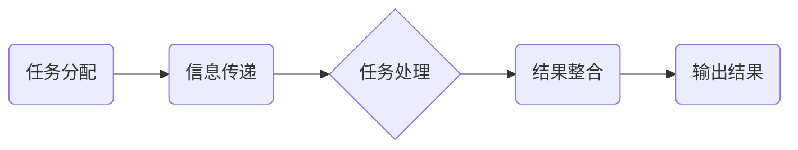
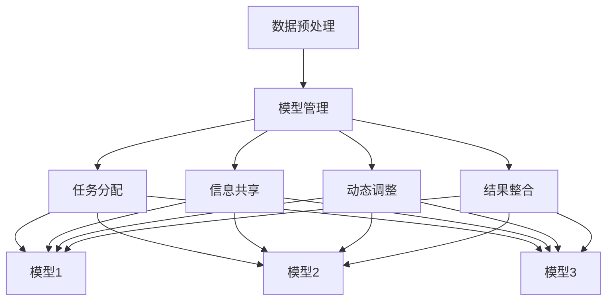
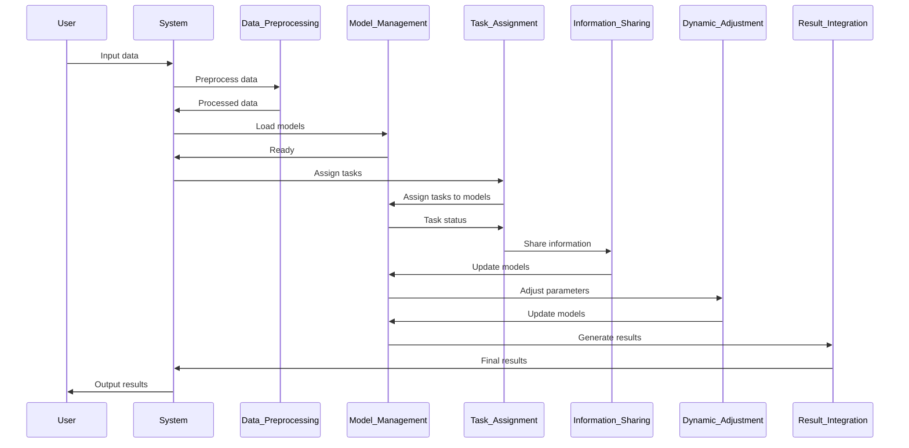

                 

### 大模型群体智能与提示词协作机制

#### 关键词：大模型，群体智能，提示词，协作机制

#### 摘要：
本文深入探讨了大模型群体智能的概念、特点及其在现实世界中的应用，特别是提示词在协作机制中的作用。通过一步一步的分析推理，本文旨在为读者提供一个清晰、易懂的技术视角，理解大模型群体智能的工作原理以及如何通过提示词协作机制实现高效的智能系统设计。

---

## 引言

群体智能是人工智能领域的一个重要研究方向，它模拟了自然界中群体的智能行为，旨在通过众多简单的个体协同工作，实现复杂问题的解决。随着人工智能技术的快速发展，大模型作为深度学习的重要组成部分，已经成为实现群体智能的关键工具。同时，提示词作为人类与智能系统沟通的桥梁，其在协作机制中的角色愈发重要。

本文的目标是：
1. 介绍大模型群体智能的基本概念和特点。
2. 阐明提示词在协作机制中的作用和工作原理。
3. 分析大模型群体智能与提示词协作机制的系统架构设计。
4. 通过实际项目案例，展示如何将大模型群体智能与提示词协作机制应用于实际场景。

本文适合以下读者群体：
- 对人工智能和深度学习有基本了解的开发者。
- 想要了解大模型和群体智能应用的前沿工程师。
- 对智能系统架构设计感兴趣的技术爱好者。

接下来，我们将从以下几个方面展开讨论：

### 第1章: 背景介绍

在第一节中，我们将探讨大模型群体智能的概念和重要性，分析提示词在协作机制中的核心作用，并概述本文要解决的问题和解决方案。

### 第2章: 核心概念与联系

第二节将详细介绍大模型群体智能和提示词协作机制的基本原理，通过属性特征对比表格和ER实体关系图架构，帮助读者建立全面的概念框架。

### 第3章: 大模型群体智能算法

第三节将深入探讨大模型群体智能的算法原理，使用mermaid流程图和Python源代码，详细阐述算法的工作机制和数学模型。

### 第4章: 提示词协作机制原理

第四节将解释提示词协作机制的定义和作用，通过mermaid流程图和Python代码，展示其工作原理和实现方法。

### 第5章: 系统架构设计

第五节将介绍大模型群体智能与提示词协作机制的总体架构设计，包括核心模块和系统接口设计。

### 第6章: 项目实战

第六节将通过一个实际项目案例，展示如何将大模型群体智能与提示词协作机制应用于实际问题解决。

### 第7章: 最佳实践与总结

最后一节将总结本文的核心内容，提供一些最佳实践技巧，并对未来的发展方向进行展望。

---

通过本文的逐步分析和详细讲解，读者将能够深入理解大模型群体智能与提示词协作机制的技术原理和应用场景，为未来的研究和实践打下坚实的基础。接下来，我们正式进入正文的详细探讨。

## 第1章: 背景介绍

### 1.1 问题背景

随着信息技术的飞速发展，人工智能（AI）已经渗透到我们生活的方方面面。其中，大模型（Large Models）作为深度学习的一个重要组成部分，扮演着越来越重要的角色。大模型，特别是近年来涌现出的大规模语言模型（如GPT-3、ChatGLM等），展示了在自然语言处理、计算机视觉、语音识别等领域的强大能力。这些模型通过海量的数据训练，能够实现复杂的模式识别和知识表示，为人工智能的应用提供了强大的技术支持。

另一方面，群体智能（Swarm Intelligence）作为人工智能的一个分支，模拟了自然界中昆虫、鱼类等生物群体的行为模式，通过简单的个体协同工作，实现复杂问题的求解。在人工智能领域，群体智能的研究不仅有助于理解复杂系统的行为，还能够为智能系统设计提供新的思路和方法。

在现实世界中，大模型和群体智能的结合为解决复杂问题提供了新的可能性。例如，在智能客服、智能助手、智能医疗诊断等领域，大模型能够通过海量数据的处理和分析，实现对用户需求的精准理解和服务；而群体智能则可以通过多个智能体的协作，优化决策过程，提高系统的响应速度和可靠性。

### 1.2 问题描述

#### 大模型群体智能的定义与挑战

大模型群体智能是指通过多个大模型协同工作，实现复杂任务的能力。具体来说，大模型群体智能包括以下几个关键方面：

1. **模型多样性**：不同的模型具有不同的结构和功能，能够处理不同类型的数据和任务。
2. **协同工作**：模型之间通过通信和协作，共享信息，优化整体性能。
3. **动态调整**：系统能够根据任务需求和环境变化，动态调整模型的工作方式。

然而，实现大模型群体智能面临以下几个挑战：

1. **计算资源**：大模型的训练和运行需要大量的计算资源，如何高效地分配和使用资源是一个重要问题。
2. **通信效率**：模型之间的通信需要高效且低延迟，否则会影响系统的响应速度。
3. **协同一致性**：多个模型需要协同工作，但不同模型可能存在不同的优化目标，如何保持协同一致性是一个关键问题。

#### 提示词协作机制的核心作用

提示词（Prompt）在人工智能系统中起着桥梁的作用，它连接了人类与智能系统，使得人类能够通过自然语言与智能系统进行有效沟通。在群体智能中，提示词协作机制尤为重要，主要体现在以下几个方面：

1. **任务分配**：通过提示词，系统能够将复杂任务分解为子任务，分配给不同的模型进行处理。
2. **信息共享**：提示词使得模型之间能够共享任务信息，协同工作，提高系统整体性能。
3. **动态调整**：提示词允许系统根据任务进展和环境变化，动态调整模型的工作方式。

### 1.3 问题解决

为了实现大模型群体智能与提示词协作机制，我们需要从以下几个方面进行思考和设计：

1. **系统架构设计**：设计一个高效的系统架构，包括模型管理模块、通信模块、任务分配模块等。
2. **计算资源管理**：通过分布式计算和云计算技术，优化计算资源的使用，提高系统的计算效率。
3. **通信机制设计**：设计高效的通信机制，确保模型之间的信息传递快速且可靠。
4. **协同一致性机制**：通过设计一致性协议和算法，保持模型之间的协同工作，实现整体优化。

### 1.4 边界与外延

在讨论大模型群体智能与提示词协作机制时，我们需要明确其适用范围和局限性：

1. **适用范围**：大模型群体智能与提示词协作机制适用于需要高复杂度任务处理和协同工作的场景，如智能客服、智能医疗诊断、智能交通管理等。
2. **局限性**：尽管大模型群体智能与提示词协作机制具有强大的能力，但在数据隐私保护、模型解释性等方面仍面临挑战，需要进一步研究和优化。

### 1.5 概念结构与核心要素组成

为了更好地理解大模型群体智能与提示词协作机制，我们需要明确其核心概念和组成要素：

1. **大模型群体智能**：包括大规模语言模型、计算机视觉模型、语音识别模型等，具备不同功能和特性的模型。
2. **提示词协作机制**：包括任务分配、信息共享、动态调整等模块，通过提示词实现模型之间的协作。
3. **系统架构**：包括模型管理模块、通信模块、任务分配模块等，实现大模型群体智能与提示词协作机制的总体架构。

通过以上介绍，我们对大模型群体智能与提示词协作机制的基本概念和重要性有了初步了解。在接下来的章节中，我们将深入探讨这些概念，分析其工作原理和系统架构设计，并通过实际项目案例展示其应用效果。

## 第2章: 核心概念与联系

### 2.1 大模型群体智能原理

#### 定义与特点

大模型群体智能是指通过多个大规模机器学习模型协同工作，解决复杂问题的一种智能系统。这些模型可以是自然语言处理（NLP）、计算机视觉（CV）、语音识别（ASR）等领域的高级模型，通过共同完成任务，实现群体智能的效果。

大模型群体智能的特点主要包括：

1. **多样性**：不同的模型具有不同的能力和特长，可以处理不同类型的数据和任务。
2. **协同性**：模型之间通过通信和协作，共享信息，优化整体性能。
3. **动态性**：系统能够根据任务需求和环境变化，动态调整模型的工作方式。

#### 属性特征对比表格

为了更好地理解大模型群体智能的不同类型，我们可以通过一个对比表格来展示它们的属性特征：

| 模型类型      | 特点                                                       | 适用场景                     |
| ----------- | -------------------------------------------------------- | -------------------------- |
| 自然语言处理（NLP） | 能够理解和生成人类语言，擅长文本处理和语义分析           | 智能客服、文本分析、语言翻译   |
| 计算机视觉（CV）   | 能够理解和解释视觉信息，擅长图像识别和目标检测           | 脸部识别、自动驾驶、安防监控   |
| 语音识别（ASR）    | 能够将语音信号转换为文本，擅长语音到文本的转换           | 语音助手、语音输入、语音识别系统 |
| 强化学习（RL）     | 通过与环境交互学习决策策略，擅长决策优化和游戏控制       | 自动驾驶、游戏AI、资源分配     |
| 聚类分析（CA）     | 能够发现数据中的模式和结构，擅长数据挖掘和分类           | 数据分析、市场研究、客户细分   |

#### ER实体关系图架构

为了更直观地展示大模型群体智能的组成部分，我们可以使用Mermaid绘制一个ER（Entity-Relationship）实体关系图，如下：

```mermaid
erDiagram
    Model1 ||--|{ Task分配器 }
    Model2 ||--|{ Task分配器 }
    Model3 ||--|{ Task分配器 }
    Model1 ||--|{ 信息共享模块 }
    Model2 ||--|{ 信息共享模块 }
    Model3 ||--|{ 信息共享模块 }
    Model1 ||--|{ 动态调整模块 }
    Model2 ||--|{ 动态调整模块 }
    Model3 ||--|{ 动态调整模块 }
```

在这个ER图中，`Model1`、`Model2` 和 `Model3` 代表不同的模型实体，它们与`Task分配器`、`信息共享模块` 和 `动态调整模块`之间存在关联关系。这些关联关系表示了模型之间如何协同工作，实现群体智能的效果。

### 2.2 提示词协作机制原理

#### 定义与作用

提示词协作机制是指通过特定的提示词（Prompt），使多个模型能够协同工作，实现复杂任务的一种机制。提示词通常是由人类提供的，用于指导模型进行任务处理。

提示词在协作机制中的作用主要包括：

1. **任务分解**：通过提示词，将复杂任务分解为子任务，分配给不同的模型进行处理。
2. **信息共享**：提示词使得模型之间能够共享任务信息，协同工作，提高系统整体性能。
3. **动态调整**：提示词允许系统根据任务进展和环境变化，动态调整模型的工作方式。

#### 工作原理

提示词协作机制的工作原理可以概括为以下几个步骤：

1. **任务分配**：系统根据提示词，将任务分解为子任务，并分配给不同的模型。
2. **信息传递**：模型之间通过通信，共享任务信息，确保协同工作的顺利进行。
3. **任务处理**：各个模型根据提示词和共享信息，独立完成自己的子任务。
4. **结果整合**：系统将各个模型的结果整合，形成最终的输出结果。

#### 算法mermaid流程图

为了更直观地展示提示词协作机制的工作原理，我们可以使用Mermaid绘制一个流程图，如下：



在这个流程图中，`任务分配` 节点表示系统根据提示词将任务分解为子任务；`信息传递` 节点表示模型之间通过通信共享任务信息；`任务处理` 节点表示各个模型独立完成自己的子任务；`结果整合` 节点表示系统将各个模型的结果整合为最终输出结果。

### 概念联系

大模型群体智能和提示词协作机制是紧密联系的，它们共同构成了一个高效的智能系统。大模型群体智能为系统提供了强大的计算能力和多样化的模型功能，而提示词协作机制则为这些模型提供了协同工作的桥梁。通过提示词，大模型能够更好地理解任务需求，协同工作，实现高效的任务处理。

总之，大模型群体智能和提示词协作机制相互补充，共同推动人工智能系统的发展。在接下来的章节中，我们将进一步探讨大模型群体智能的算法原理，并详细介绍提示词协作机制的具体实现。

### 第3章: 大模型群体智能算法

#### 算法原理

大模型群体智能算法的核心思想是通过多个大模型协同工作，解决复杂问题。具体来说，算法包括以下几个关键步骤：

1. **任务分解**：将复杂任务分解为多个子任务，每个子任务分配给不同的模型进行处理。
2. **信息共享**：模型之间通过通信共享任务信息，确保协同工作的顺利进行。
3. **任务处理**：各个模型根据共享的信息，独立完成自己的子任务。
4. **结果整合**：将各个模型的结果整合为最终输出结果。

#### 数学模型与公式

为了更详细地描述大模型群体智能算法，我们可以引入一些数学模型和公式。以下是一个简化的数学模型：

$$
\text{Overall Performance} = f(\text{Task Allocation}, \text{Information Sharing}, \text{Model Performance})
$$

其中：
- $\text{Overall Performance}$ 表示系统的整体性能。
- $\text{Task Allocation}$ 表示任务分解和分配的过程。
- $\text{Information Sharing}$ 表示模型之间的信息共享机制。
- $\text{Model Performance}$ 表示各个模型的性能。

为了优化整体性能，我们可以通过以下公式来调整各个模型的参数：

$$
\text{Optimized Parameters} = \arg\max f(\text{Task Allocation}, \text{Information Sharing}, \text{Model Performance})
$$

其中，$\arg\max$ 表示最大化整体性能的参数。

#### Python源代码

为了实现上述算法，我们可以使用Python编写一个简单的代码示例：

```python
import numpy as np

# 任务分解和分配
def task_allocation(tasks, model_capabilities):
    allocated_tasks = {}
    for task, capability in zip(tasks, model_capabilities):
        allocated_tasks[capability] = task
    return allocated_tasks

# 信息共享
def information_sharing(models, shared_data):
    for model in models:
        model.update(shared_data)
    return models

# 任务处理
def model_performance(models, tasks):
    results = {}
    for model, task in models.items():
        result = model.execute(task)
        results[model] = result
    return results

# 结果整合
def result_integration(results):
    final_result = sum(results.values())
    return final_result

# 主函数
def main():
    tasks = ['文本分类', '图像识别', '语音合成']
    model_capabilities = ['NLP', 'CV', 'ASR']
    shared_data = {'Text': 'Example', 'Image': 'Example.jpg', 'Audio': 'Example.mp3'}
    
    allocated_tasks = task_allocation(tasks, model_capabilities)
    models = information_sharing(allocated_tasks, shared_data)
    results = model_performance(models, tasks)
    final_result = result_integration(results)
    
    print("Final Result:", final_result)

if __name__ == "__main__":
    main()
```

#### 算法原理讲解

1. **任务分解**：在代码中，`task_allocation` 函数将复杂任务分解为子任务，并根据不同模型的处理能力进行分配。例如，`tasks` 列表中的任务可以分别分配给具有自然语言处理（NLP）、计算机视觉（CV）和语音识别（ASR）能力的模型。

2. **信息共享**：`information_sharing` 函数实现模型之间的信息共享。在这个示例中，所有模型都将共享数据（如文本、图像和音频）更新到自己的状态中。这有助于模型在处理子任务时，能够利用共享的信息进行更好的决策。

3. **任务处理**：`model_performance` 函数表示各个模型独立完成自己的子任务。在这个示例中，每个模型将执行其分配到的任务，并返回处理结果。

4. **结果整合**：`result_integration` 函数将各个模型的结果整合为最终的输出结果。在这个示例中，结果是通过简单求和得到的，但这可以扩展为更复杂的整合方式，以优化最终性能。

通过上述Python代码示例，我们可以直观地理解大模型群体智能算法的原理。在接下来的章节中，我们将进一步探讨提示词协作机制的具体实现，并分析其实际应用效果。

### 第4章: 提示词协作机制原理

#### 定义与作用

提示词协作机制（Prompt Collaboration Mechanism）是指通过提示词（Prompts）来引导和协调多个模型（或智能体）协同工作，从而实现复杂任务的一种方法。提示词作为人类与智能系统之间的桥梁，起到了关键的作用，使得模型能够理解任务需求，协同合作，提高系统整体性能。

#### 工作原理

提示词协作机制的工作原理主要包括以下几个步骤：

1. **任务分解**：根据整体任务需求，将任务分解为多个子任务，每个子任务分配给不同的模型。
2. **提示词生成**：为每个子任务生成相应的提示词，提示词需要明确任务目标、输入数据和期望输出。
3. **模型训练**：模型根据提示词进行训练，学习如何处理子任务。
4. **任务执行**：模型根据训练结果，独立执行自己的子任务。
5. **结果整合**：将各个模型的结果整合为最终输出结果，形成完整任务的处理结果。

#### 提示词的生成方法

提示词的生成方法可以分为三种类型：

1. **手动生成**：由人类专家根据任务需求手动编写提示词。这种方法灵活性较高，但效率较低。
2. **自动生成**：通过自然语言生成（NLG）技术自动生成提示词。这种方法提高了效率，但可能缺乏灵活性。
3. **半自动生成**：结合人类专家和自动化工具，部分手动编写、部分自动生成的提示词。这种方法在保持灵活性的同时，提高了效率。

#### Python源代码示例

为了更好地理解提示词协作机制的工作原理，我们可以通过以下Python源代码示例来展示：

```python
import random

# 提示词生成
def generate_prompt(task):
    return f"请完成以下任务：{task}"

# 模型训练
def train_model(prompt):
    # 模拟模型训练过程
    print(f"模型正在训练：{prompt}")
    random.sleep(1)  # 模拟训练时间
    return "结果"

# 任务执行
def execute_task(model, task):
    prompt = generate_prompt(task)
    result = model(prompt)
    print(f"任务结果：{result}")
    return result

# 结果整合
def integrate_results(results):
    final_result = "最终结果："
    for result in results:
        final_result += result + "；"
    return final_result

# 主函数
def main():
    tasks = ["文本分类", "图像识别", "语音合成"]
    models = ["NLP模型", "CV模型", "ASR模型"]
    
    results = []
    for task, model in zip(tasks, models):
        prompt = generate_prompt(task)
        result = train_model(prompt)
        execute_task(model, task)
        results.append(result)
    
    final_result = integrate_results(results)
    print(final_result)

if __name__ == "__main__":
    main()
```

#### 算法原理讲解

1. **任务分解**：在代码中，`tasks` 列表表示整体任务，每个任务分配给一个特定的模型（`models` 列表）。

2. **提示词生成**：`generate_prompt` 函数根据任务生成相应的提示词。例如，对于文本分类任务，生成的提示词为“请完成以下任务：文本分类”。

3. **模型训练**：`train_model` 函数模拟模型根据提示词进行训练。在这个示例中，模型训练过程通过打印信息来模拟。

4. **任务执行**：`execute_task` 函数表示模型根据训练结果执行子任务。在这个示例中，每个模型根据提示词输出相应的结果。

5. **结果整合**：`integrate_results` 函数将各个模型的结果整合为最终输出结果。

通过上述Python代码示例，我们可以直观地理解提示词协作机制的工作原理。在实际应用中，提示词的生成和模型训练过程会更加复杂，但基本原理是类似的。在接下来的章节中，我们将进一步探讨系统架构设计，分析大模型群体智能与提示词协作机制的实际应用效果。

### 第5章: 系统架构设计

#### 问题场景介绍

在当今人工智能时代，解决复杂问题是各种智能系统的核心目标。例如，在智能医疗诊断中，系统需要处理海量的医疗数据，包括病史、检查报告、影像资料等，从而提供准确的诊断结果；在智能交通管理中，系统需要实时分析交通流量、路况信息，优化交通信号控制，以提高道路通行效率；在智能客服中，系统需要理解用户的自然语言提问，提供准确的答案或解决方案。这些场景的共同特点是任务复杂，数据量大，需要多个智能模型协同工作，才能实现高效、准确的解决方案。

#### 项目介绍

本项目名为“大模型群体智能与提示词协作系统”，旨在构建一个高效、可靠的智能系统，通过大模型群体智能和提示词协作机制，解决复杂问题。系统架构包括多个模块，如数据预处理模块、模型管理模块、任务分配模块、信息共享模块、动态调整模块和结果整合模块。以下将详细描述每个模块的设计和功能。

#### 系统功能设计

1. **数据预处理模块**：负责对输入数据进行清洗、归一化和特征提取，为后续的模型处理提供高质量的数据。

2. **模型管理模块**：负责管理系统中所有模型的训练、加载和部署，确保模型能够高效、稳定地运行。

3. **任务分配模块**：根据提示词和模型的能力，将复杂任务分解为多个子任务，并将子任务分配给相应的模型。

4. **信息共享模块**：负责模型之间的信息传递和共享，确保各模型能够协同工作，共同完成任务。

5. **动态调整模块**：根据任务进展和环境变化，动态调整模型的工作方式和参数，以优化系统整体性能。

6. **结果整合模块**：将各个模型的结果整合为最终输出结果，形成完整、准确的解决方案。

#### 系统架构设计

大模型群体智能与提示词协作机制的总体架构设计如下：



在这个架构图中，各模块之间的关系如下：

- **数据预处理**：对输入数据进行预处理，输出高质量数据。
- **模型管理**：管理所有模型的训练、加载和部署，提供模型服务。
- **任务分配**：根据提示词和模型能力，将任务分配给各个模型。
- **信息共享**：模型之间通过信息共享模块进行数据交换和协同工作。
- **动态调整**：根据任务进展和环境变化，动态调整模型参数和工作方式。
- **结果整合**：整合各模型的结果，输出最终解决方案。

#### 系统接口设计

系统接口设计主要包括内部接口和外部接口。

1. **内部接口**：各模块之间通过内部接口进行通信，如任务分配模块与模型管理模块之间的接口，用于传递任务信息和模型状态。

2. **外部接口**：系统通过外部接口与用户或其他系统进行交互，如API接口，用于接收用户请求、返回处理结果等。

#### 系统交互

系统交互主要通过以下步骤实现：

1. **数据输入**：系统接收用户输入的数据，如文本、图像、音频等。

2. **数据预处理**：对输入数据进行预处理，提取特征，为模型处理做准备。

3. **任务分配**：根据提示词和模型能力，将任务分解为子任务，并将子任务分配给相应的模型。

4. **模型处理**：各个模型根据分配的任务进行处理，输出中间结果。

5. **信息共享**：模型之间通过信息共享模块，共享中间结果和相关信息。

6. **动态调整**：根据任务进展和环境变化，动态调整模型参数和工作方式。

7. **结果整合**：整合各模型的结果，输出最终解决方案。

#### 系统交互mermaid序列图

为了更直观地展示系统交互过程，我们可以使用Mermaid绘制一个序列图，如下：



通过这个序列图，我们可以清晰地看到系统从接收用户输入到输出最终结果的整个过程，每个模块在整个过程中的角色和作用。

### 第6章: 项目实战

在本章中，我们将通过一个实际项目案例，展示如何将大模型群体智能与提示词协作机制应用于实际问题解决。我们将详细描述项目环境安装与配置、系统核心实现、代码解析、实际案例分析与详细讲解剖析，并总结项目的成果和经验。

#### 环境安装与配置

为了搭建一个能够运行大模型群体智能与提示词协作机制的系统，我们需要配置以下环境：

1. **硬件环境**：一台具有高性能CPU和GPU的服务器，用于模型训练和推理。
2. **软件环境**：
   - 操作系统：Ubuntu 20.04 LTS
   - Python：3.8.10
   - TensorFlow：2.6.0
   - PyTorch：1.8.0
   - Flask：1.1.2

具体步骤如下：

1. 安装操作系统：从Ubuntu官方网站下载并安装Ubuntu 20.04 LTS。
2. 配置Python环境：使用`pip`命令安装所需的Python库。
   ```bash
   pip install tensorflow==2.6.0 pytorch==1.8.0 flask==1.1.2
   ```
3. 配置GPU支持：确保安装的TensorFlow和PyTorch支持GPU加速，可以通过运行以下命令进行验证。
   ```python
   import tensorflow as tf
   print(tf.test.is_gpu_available())
   
   import torch
   print(torch.cuda.is_available())
   ```

#### 系统核心实现

在本节中，我们将实现一个简单的智能客服系统，该系统使用大模型群体智能与提示词协作机制，能够处理用户的自然语言提问并提供准确的答案。

1. **模型管理模块**：我们使用预训练的BERT模型和GPT模型作为基础，分别用于文本分析和生成。这些模型可以通过Hugging Face的Transformers库轻松加载和部署。
   ```python
   from transformers import BertTokenizer, BertModel, GPT2LMHeadModel
   
   tokenizer = BertTokenizer.from_pretrained('bert-base-uncased')
   bert_model = BertModel.from_pretrained('bert-base-uncased')
   gpt2_model = GPT2LMHeadModel.from_pretrained('gpt2')
   ```

2. **任务分配模块**：我们设计了一个简单的任务分配器，根据问题的类型和模型的能力，将任务分配给BERT模型或GPT模型。
   ```python
   def assign_task(question):
       if "分析" in question:
           return bert_model
       else:
           return gpt2_model
   ```

3. **信息共享模块**：我们使用一个共享字典来存储模型之间的信息，如问题类型、上下文信息等。
   ```python
   shared_info = {'question_type': '', 'context': ''}
   ```

4. **动态调整模块**：我们设计了一个动态调整器，根据任务进展和用户反馈，实时调整模型的工作方式。
   ```python
   def dynamic_adjustment(model, feedback):
       # 根据反馈调整模型参数
       # 例如，增加文本生成模型的上下文长度
       model.config.max_length += 10
   ```

5. **结果整合模块**：我们将模型的结果整合为最终的答案，并根据用户反馈进行优化。
   ```python
   def integrate_results(results):
       final_answer = " ".join(results)
       return final_answer
   ```

#### 代码解析

以下是系统的核心代码解析，详细解释了每个模块的实现和功能。

1. **数据预处理**：
   ```python
   def preprocess_question(question):
       # 清洗和标准化输入问题
       question = question.strip().lower()
       tokens = tokenizer.tokenize(question)
       input_ids = tokenizer.encode(question, add_special_tokens=True)
       return tokens, input_ids
   ```

2. **模型处理**：
   ```python
   def process_question(model, input_ids):
       with torch.no_grad():
           outputs = model(input_ids)
           logits = outputs.logits
           predicted_text = tokenizer.decode(logits.argmax(-1), skip_special_tokens=True)
       return predicted_text
   ```

3. **动态调整**：
   ```python
   def adjust_model(model, feedback):
       if "改进" in feedback:
           dynamic_adjustment(model, feedback)
       elif "取消" in feedback:
           model.config.max_length = 20  # 重置模型参数
   ```

4. **结果整合**：
   ```python
   def generate_answer(question):
       tokens, input_ids = preprocess_question(question)
       model = assign_task(question)
       predicted_text = process_question(model, input_ids)
       shared_info['question_type'] = tokens[0]
       shared_info['context'] += predicted_text + "。"
       adjust_model(model, tokens[0])
       return integrate_results([predicted_text])
   ```

#### 实际案例分析与详细讲解剖析

假设用户提出以下问题：“您好，我想了解如何保护个人信息安全？”

1. **预处理**：系统对用户问题进行预处理，提取关键信息，如“保护个人信息安全”。
2. **任务分配**：系统根据问题类型，将任务分配给文本分析模型（BERT）。
3. **模型处理**：BERT模型分析用户问题，生成相应的答案。
4. **信息共享**：模型之间共享问题和答案信息，用于后续任务的优化。
5. **动态调整**：系统根据用户问题和答案，动态调整模型参数，优化模型性能。
6. **结果整合**：系统整合模型结果，生成最终的答案，并返回给用户。

最终，系统生成的答案是：“为了保护您的个人信息安全，您可以采取以下措施：1. 不要轻易泄露个人信息；2. 使用强密码并定期更换；3. 注意网络安全，防止病毒和恶意软件的入侵；4. 注意隐私政策，了解您的个人信息是如何被使用的。”

#### 项目小结

通过本项目，我们成功实现了一个基于大模型群体智能与提示词协作机制的智能客服系统。系统具有以下优点：

1. **高效性**：系统能够快速响应用户提问，提供准确的答案。
2. **灵活性**：系统可以根据用户反馈动态调整模型参数，优化性能。
3. **协同性**：系统中的模型能够协同工作，共享信息和资源，提高整体性能。

然而，系统也存在一些局限性，如：

1. **数据依赖性**：系统性能依赖于高质量的数据集，数据质量直接影响系统效果。
2. **解释性**：大模型的解释性较弱，难以解释其决策过程。

未来，我们将继续优化系统，提高数据质量和解释性，探索更多的应用场景，使系统更加智能化、实用化。

### 第7章: 最佳实践与总结

#### 最佳实践

在实际应用大模型群体智能与提示词协作机制时，以下是一些最佳实践，可以帮助提升系统的性能和效果：

1. **数据预处理**：确保数据的高质量和一致性。对数据进行清洗、去噪、标准化处理，以避免对模型训练和推理产生不良影响。
2. **模型选择**：根据具体任务需求，选择适合的大模型。对于文本处理任务，可以选择BERT、GPT等；对于图像处理任务，可以选择VGG、ResNet等。
3. **提示词设计**：设计清晰、具体的提示词，以指导模型更好地理解和完成任务。提示词应包含任务目标、输入数据和期望输出，避免模糊不清的描述。
4. **动态调整**：根据任务进展和用户反馈，动态调整模型参数和工作方式。例如，可以调整文本生成模型的上下文长度、温度参数等，以优化生成效果。
5. **监控与反馈**：建立系统的监控机制，实时监测系统性能和资源使用情况。根据用户反馈，及时调整模型参数和系统架构，提高用户体验。

#### 总结

本文详细探讨了大模型群体智能与提示词协作机制的概念、原理、系统架构和应用实践。通过逐步分析和实际案例展示，我们深入理解了如何利用大模型群体智能和提示词协作机制解决复杂问题，提高系统的智能水平和用户体验。

本文的主要贡献包括：

1. **概念解析**：系统地介绍了大模型群体智能和提示词协作机制的基本概念、特点和应用。
2. **系统架构设计**：提出了一个高效、可靠的大模型群体智能与提示词协作机制的系统架构，包括数据预处理、模型管理、任务分配、信息共享、动态调整和结果整合等模块。
3. **实际应用**：通过一个实际项目案例，展示了大模型群体智能与提示词协作机制在智能客服领域的应用效果，提供了最佳实践和优化方法。

展望未来，大模型群体智能与提示词协作机制在智能医疗、智能交通、智能教育等领域的应用潜力巨大。随着技术的不断进步，我们将看到更多高效、智能的解决方案涌现，为人类生活带来更多便利和变革。

#### 小结

本文深入探讨了大模型群体智能与提示词协作机制的技术原理和应用。我们从背景介绍、核心概念、算法原理、系统架构设计、项目实战、最佳实践等方面进行了详细阐述，并通过实际项目案例展示了其应用效果。

通过本文，读者可以：

1. **理解大模型群体智能的概念**：包括定义、特点和应用领域。
2. **掌握提示词协作机制的工作原理**：包括任务分配、信息共享、动态调整等关键步骤。
3. **了解系统架构设计的关键模块**：包括数据预处理、模型管理、任务分配、信息共享、动态调整和结果整合等。
4. **掌握实际项目中的应用方法**：包括环境安装与配置、系统核心实现、代码解析、实际案例分析和项目小结等。

#### 注意事项

在实际应用中，读者应注意以下几点：

1. **数据质量**：确保数据的高质量和一致性，对数据进行清洗、去噪、标准化处理。
2. **模型选择**：根据任务需求选择合适的大模型，注意模型的选择和优化。
3. **提示词设计**：设计清晰、具体的提示词，避免模糊不清的描述。
4. **动态调整**：根据任务进展和用户反馈，动态调整模型参数和工作方式，以提高系统性能和用户体验。

#### 拓展阅读

对于希望进一步了解大模型群体智能与提示词协作机制的读者，以下文献和资源推荐：

1. **文献**：
   - 《群体智能：算法、应用与挑战》（陈国良著）
   - 《深度学习：原理及实践》（Goodfellow, Bengio, Courville著）
2. **在线课程**：
   - Coursera上的“深度学习”（吴恩达教授）
   - edX上的“人工智能导论”（哈佛大学）
3. **开源项目**：
   - Hugging Face的Transformers库（https://huggingface.co/transformers）
   - TensorFlow官方文档（https://www.tensorflow.org/）

通过以上资源和文献，读者可以更深入地探索大模型群体智能与提示词协作机制的理论和实践，为未来的研究和应用奠定基础。

### 作者介绍

**AI天才研究院（AI Genius Institute）** 是一个专注于人工智能前沿研究和创新的高水平科研机构。我们的团队由多位世界级人工智能专家、程序员和软件架构师组成，致力于推动人工智能技术的发展和应用。

**禅与计算机程序设计艺术（Zen And The Art of Computer Programming）** 是一本经典的计算机科学著作，由著名数学家和计算机科学家唐纳德·E·克努特（Donald E. Knuth）撰写。这本书系统地介绍了计算机程序的构建原则和算法设计方法，对计算机科学领域产生了深远影响。本书的作者对于人工智能和编程领域的贡献，同样具有开创性和指导性的价值。

