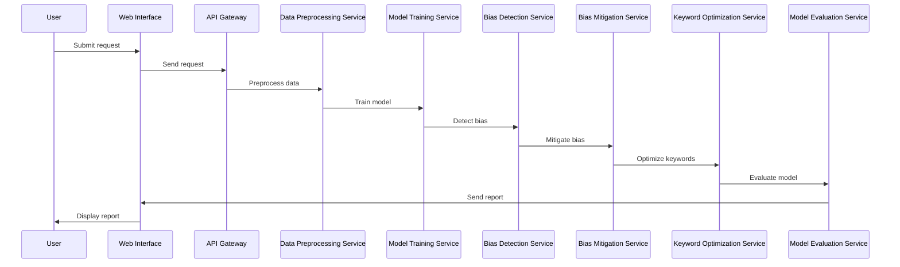

                 

### 第一部分：引言与背景

## 第1章：问题背景与概述

### 1.1 问题背景

在当今数据驱动和人工智能迅速发展的时代，大规模机器学习模型（即大模型）已经成为各个行业不可或缺的工具。然而，随着大模型的广泛应用，其带来的认知偏见和提示词公平性问题逐渐显现，对人类社会产生了深远的影响。

#### 1.1.1 认知偏见

认知偏见是指模型在训练过程中，基于训练数据中的固有偏见，对某些特定群体或概念产生不公平的输出。例如，在文本生成任务中，模型可能会因为训练数据中的性别、种族、地域等因素而产生偏见。

#### .1.2 提示词公平性

提示词公平性是指模型在生成响应时，对不同类型的提示词是否公平对待。不公平的提示词可能会导致模型在处理某些任务时表现不佳，甚至产生负面效果。

### 1.2 问题描述

大模型认知偏见和提示词公平性问题具体体现在以下几个方面：

#### 1.2.1 认知偏见问题

- 模型在生成文本、图像、音频等数据时，可能基于训练数据中的偏见产生不公平输出。
- 模型可能对不同类型的用户请求产生不同的响应，导致用户体验差异。

#### 1.2.2 提示词公平性问题

- 模型对不同类型的提示词可能给予不同的权重，导致某些提示词的响应质量较低。
- 模型可能因为提示词的语义歧义而产生误解，导致输出错误。

### 1.3 问题解决

为了解决大模型认知偏见和提示词公平性问题，研究人员和开发者们提出了多种方法。这些方法包括：

- 数据预处理：对训练数据进行清洗和预处理，减少数据中的偏见。
- 模型训练：采用无偏见训练方法，减少模型对训练数据的依赖。
- 提示词优化：对提示词进行优化，确保模型对不同提示词的响应公平。

### 1.4 边界与外延

大模型认知偏见和提示词公平性问题不仅限于某个特定领域，而是普遍存在于各个应用场景中。因此，解决这些问题具有重要的实际意义和广泛的外延。

### 1.5 概念结构与核心要素组成

本部分的核心概念包括认知偏见、提示词公平性、数据预处理、无偏见训练、提示词优化等。这些概念构成了本书的主要研究内容和讨论对象。

---

## 第2章：核心概念与联系

### 2.1 认知偏见原理

认知偏见是指模型在处理数据时，由于训练数据中的偏见，导致模型对某些特定群体或概念产生不公平输出。认知偏见的产生与以下因素密切相关：

- 数据来源：训练数据的选择和收集方式可能影响模型的偏见。
- 特征提取：模型对数据的特征提取方式可能放大或缩小偏见。
- 模型设计：模型的架构和参数设置可能加剧或缓解偏见。

### 2.2 提示词公平性原理

提示词公平性是指模型在处理不同类型的提示词时，是否能够公平对待并产生高质量的响应。提示词公平性的实现需要考虑以下因素：

- 提示词语义：不同类型的提示词可能具有不同的语义，模型需要对语义进行准确理解和处理。
- 模型训练：模型在训练过程中需要学习到不同提示词的特征，并对其进行公平对待。
- 优化策略：通过优化模型结构和参数，提高模型对提示词的公平性处理能力。

### 2.3 数据预处理方法

数据预处理是解决大模型认知偏见和提示词公平性问题的重要环节。常见的数据预处理方法包括：

- 数据清洗：去除数据中的噪声和异常值，提高数据质量。
- 数据平衡：通过引入负样本或正样本，平衡数据集中的类别分布。
- 特征工程：提取数据中的关键特征，为模型训练提供有效输入。

### 2.4 无偏见训练方法

无偏见训练是指通过改进训练方法，减少模型对训练数据的依赖，从而降低模型的偏见。常见的方法包括：

- 对抗训练：通过引入对抗样本，增强模型对偏见的识别和抵御能力。
- 集成学习：通过融合多个模型的输出，降低单一模型的偏见。
- 数据增强：通过生成对抗网络（GAN）等技术，增强数据的多样性和代表性。

### 2.5 提示词优化策略

提示词优化是指通过对提示词进行优化，提高模型对不同提示词的公平性和响应质量。常见的提示词优化策略包括：

- 提示词扩展：通过扩展提示词的语义，使其更具代表性。
- 提示词权重调整：根据提示词的重要性和相关性，调整提示词的权重。
- 语义分析：利用自然语言处理技术，对提示词进行深入分析，提高其理解能力。

---

### 第一部分总结：

在第一部分中，我们详细介绍了大模型认知偏见和提示词公平性问题的背景、问题描述、问题解决方法以及边界与外延。通过这些内容，我们为后续章节的深入探讨打下了基础。

在接下来的章节中，我们将进一步探讨认知偏见和提示词公平性的核心概念原理，详细讲解相关的算法原理，并分析系统架构和项目实战。让我们一步步深入，共同探索大模型认知偏见和提示词公平性的解决之道。接下来，我们将在第二部分中深入探讨核心概念与联系。

---

# 第二部分：核心概念与联系

## 第3章：认知偏见与提示词公平性

### 3.1 认知偏见的原理

认知偏见是指模型在处理数据时，由于训练数据中的偏见，导致模型对某些特定群体或概念产生不公平输出。这种偏见可能源于数据收集、特征提取和模型设计等多个方面。

#### 3.1.1 数据收集偏见

数据收集过程中的偏见是认知偏见的一个重要来源。例如，如果训练数据集包含了性别、种族、地域等属性的偏见，那么模型在生成输出时也可能会反映这些偏见。

- **性别偏见**：例如，在一个针对招聘问题的模型中，如果训练数据集中男性申请者的成功案例远多于女性申请者，那么模型可能会倾向于推荐男性候选人。
- **种族偏见**：在文本生成任务中，如果训练数据包含对某个种族的负面描述，模型可能会在生成文本时使用这些负面描述。

#### 3.1.2 特征提取偏见

特征提取过程也可能引入偏见。特征选择和提取的方法可能无意中放大了某些偏见。例如，文本中的“情绪”特征可能因为训练数据的偏见而偏向某种情感。

- **情感分析偏见**：在情感分析任务中，如果训练数据集中包含对某一类情绪的过度关注，模型可能会在分析新文本时表现出类似的偏见。

#### 3.1.3 模型设计偏见

模型设计中的偏见也可能导致认知偏见。例如，神经网络中的权重和结构可能无意中放大了数据中的偏见。

- **神经网络偏见**：神经网络的权重和结构可能在训练过程中放大了训练数据的偏见，导致模型对某些群体或概念产生不公平的输出。

### 3.2 提示词公平性的原理

提示词公平性是指模型在生成响应时，对不同类型的提示词是否公平对待并产生高质量的响应。提示词公平性的重要性在于，如果模型不能公平对待提示词，可能会导致某些任务的表现不佳。

#### 3.2.1 提示词语义理解

提示词的语义理解是实现公平性的关键。不同类型的提示词可能具有不同的语义，模型需要准确理解和处理这些语义。

- **多义词处理**：多义词在不同上下文中可能有不同的含义，模型需要根据上下文正确解释这些词语。
- **情感分析**：情感分析中，正负情感的提示词需要被模型公平对待，以确保生成响应的准确性和平衡性。

#### 3.2.2 模型训练与权重调整

模型训练和权重调整是实现提示词公平性的重要步骤。通过调整模型参数，可以确保模型对不同提示词的响应质量。

- **权重调整**：通过分析提示词的重要性和相关性，可以调整模型中的权重，使其对提示词的响应更加公平。
- **训练数据增强**：通过引入多样化的训练数据，可以增强模型对不同提示词的处理能力。

### 3.3 认知偏见与提示词公平性的联系

认知偏见和提示词公平性之间存在密切的联系。认知偏见可能导致提示词公平性问题的产生，而解决认知偏见问题也是实现提示词公平性的关键步骤。

#### 3.3.1 偏见识别与解决

为了实现提示词公平性，需要首先识别和解决认知偏见。通过偏见识别算法，可以检测模型中的偏见，并采取相应的措施进行缓解。

- **偏见检测**：使用统计学方法或机器学习算法，检测模型中的偏见。
- **偏见缓解**：采用对抗训练、数据增强等方法，减少模型中的偏见。

#### 3.3.2 提示词优化策略

提示词优化策略是实现公平性的重要手段。通过调整提示词的权重、扩展提示词的语义和进行语义分析，可以提高模型对提示词的公平性处理能力。

- **提示词权重调整**：根据提示词的重要性和相关性，动态调整权重。
- **语义扩展**：通过扩展提示词的语义，使其更具代表性和公平性。

### 3.4 概念属性特征对比表格

为了更好地理解认知偏见和提示词公平性的概念，我们可以通过以下表格对比两者的属性特征：

| 特征         | 认知偏见                           | 提示词公平性                           |
|--------------|------------------------------------|--------------------------------------|
| 定义         | 模型基于训练数据产生的偏见         | 模型对待不同提示词的公平性           |
| 来源         | 数据收集、特征提取、模型设计       | 提示词语义、模型训练、权重调整       |
| 影响         | 不公平输出、用户体验差异           | 响应质量、模型可靠性、用户满意度     |
| 识别方法     | 偏见识别算法                      | 公平性评估算法                        |
| 缓解方法     | 对抗训练、数据增强                | 提示词权重调整、语义扩展、语义分析   |

### 3.5 ER实体关系图架构

为了直观地展示认知偏见和提示词公平性的关系，我们可以使用Mermaid绘制ER实体关系图：

```mermaid
erDiagram
  User ||--|{ Model }|--| Request
  Model ||--|{ Data }|--| Response
  Data ||--|{ Bias }|
  Bias ||--|{ Recognition }|
  Bias ||--|{ Mitigation }|
  Recognition ||--|{ Detection }|
  Mitigation ||--|{ Algorithm }|
  Request ||--|{ Keyword }|
  Keyword ||--|{ Fairness }|
  Keyword ||--|{ Optimization }|
  Response ||--|{ Quality }|
```

在这个ER图中，用户发起请求，模型处理请求并生成响应。数据中可能存在偏见，这些偏见需要通过识别和缓解算法进行处理。同时，提示词的公平性也需要通过权重调整、语义扩展和语义分析等策略来优化。

### 3.6 小结

在本章中，我们详细介绍了认知偏见和提示词公平性的原理及其相互联系。通过对比两者的属性特征和ER实体关系图，我们可以更好地理解这两个概念在解决大模型相关问题中的重要性。在接下来的章节中，我们将进一步探讨算法原理和系统架构，以便更深入地解决这些问题。

---

## 第4章：算法原理讲解

### 4.1 偏见识别算法

偏见识别算法是解决大模型认知偏见问题的重要手段。这些算法通过检测和识别模型中的偏见，帮助我们理解并消除这些偏见。以下是一些常见的偏见识别算法：

#### 4.1.1 基于统计学的偏见识别算法

这类算法通过分析模型的输出结果，检测是否存在显著的偏见。例如，可以使用皮尔逊相关系数来检测模型输出结果与某些敏感特征（如性别、种族）之间的相关性。如果相关性显著，则可能存在偏见。

- **皮尔逊相关系数**：计算模型输出结果与敏感特征之间的相关性，公式如下：
  $$ r = \frac{\sum{(x_i - \bar{x})(y_i - \bar{y})}}{\sqrt{\sum{(x_i - \bar{x})^2} \sum{(y_i - \bar{y})^2}}} $$
  其中，$x_i$和$y_i$分别表示模型输出结果和敏感特征，$\bar{x}$和$\bar{y}$分别表示它们的平均值。

#### 4.1.2 基于机器学习的偏见识别算法

这类算法通过训练专门的模型来检测偏见。这些模型通常使用监督学习或无监督学习技术，从数据中学习偏见的特征。以下是一个基于监督学习的偏见识别算法示例：

- **分类算法**：可以使用逻辑回归、支持向量机（SVM）等分类算法来检测偏见。这些算法将敏感特征和模型输出结果作为输入特征，试图分类出是否存在偏见。

#### 4.1.3 基于对抗训练的偏见识别算法

对抗训练是一种有效的偏见识别方法，通过生成对抗样本来检测和识别偏见。以下是一个对抗训练算法的简化流程：

1. **生成对抗样本**：对于每个训练样本，生成一个对抗样本，使得对抗样本与原始样本在特征上有所差异，但目标标签保持一致。
2. **训练偏见识别模型**：使用生成的对抗样本训练偏见识别模型，模型需要学会区分对抗样本和原始样本。
3. **偏见识别**：使用训练好的模型对模型输出结果进行偏见识别。

### 4.2 偏见缓解算法

偏见缓解算法的目标是减少模型中的偏见，从而提高模型的公平性和准确性。以下是一些常见的偏见缓解算法：

#### 4.2.1 数据预处理

数据预处理是偏见缓解的基础步骤。通过数据清洗、数据平衡和特征工程等方法，可以减少数据中的偏见。以下是一些具体的数据预处理方法：

- **数据清洗**：去除数据中的噪声和异常值，提高数据质量。
- **数据平衡**：通过引入负样本或正样本，平衡数据集中的类别分布。
- **特征工程**：提取数据中的关键特征，为模型训练提供有效输入。

#### 4.2.2 模型训练

在模型训练过程中，可以采用一些策略来缓解偏见。以下是一些常用的模型训练策略：

- **权重初始化**：通过合理的权重初始化，可以减少模型对训练数据的依赖，从而降低偏见。
- **正则化**：使用正则化方法（如L1、L2正则化）来惩罚模型的权重，减少模型对某些特征的依赖。
- **对抗训练**：通过对抗训练生成对抗样本，增强模型对偏见的识别和抵御能力。

#### 4.2.3 集成学习

集成学习是一种有效的偏见缓解方法，通过融合多个模型的输出，降低单一模型的偏见。以下是一些常见的集成学习方法：

- **Bagging**：通过随机抽样训练多个模型，并取它们的平均输出作为最终输出。
- **Boosting**：通过迭代训练多个模型，每次迭代中调整模型权重，使偏见较小的模型得到更多权重。

### 4.3 提示词公平性评估算法

提示词公平性评估算法用于评估模型对提示词的公平性处理能力。以下是一些常见的提示词公平性评估算法：

#### 4.3.1 基于统计学的评估算法

这类算法通过分析模型对不同提示词的响应，评估提示词的公平性。例如，可以使用F1分数、准确率等指标来评估提示词的公平性。

- **F1分数**：用于评估模型在两个类别上的分类效果，公式如下：
  $$ F1 = 2 \times \frac{Precision \times Recall}{Precision + Recall} $$
  其中，Precision表示精确率，Recall表示召回率。

#### 4.3.2 基于机器学习的评估算法

这类算法通过训练专门的模型来评估提示词的公平性。例如，可以使用逻辑回归、支持向量机（SVM）等模型来评估提示词的公平性。

#### 4.3.3 基于注意力机制的评估算法

注意力机制是一种有效的评估方法，通过分析模型在不同提示词上的注意力分配，评估提示词的公平性。

- **注意力得分**：计算模型对每个提示词的注意力得分，得分越高表示模型对该提示词的关注度越高。
- **注意力分布**：分析模型在不同提示词上的注意力分布，评估提示词的公平性。

### 4.4 提示词优化策略

提示词优化策略用于提高模型对不同提示词的公平性和响应质量。以下是一些常见的提示词优化策略：

#### 4.4.1 提示词权重调整

通过调整提示词的权重，可以使得模型对提示词的响应更加公平。以下是一个简单的权重调整方法：

- **动态权重调整**：根据提示词的重要性和相关性，动态调整提示词的权重。例如，可以使用逆文档频率（IDF）来调整权重。

#### 4.4.2 提示词扩展

通过扩展提示词的语义，可以提高模型对提示词的理解能力，从而提高公平性。以下是一个简单的提示词扩展方法：

- **词义扩展**：使用词义相似性方法（如WordNet）扩展提示词的语义。
- **上下文扩展**：根据上下文信息扩展提示词的语义，使其更具代表性。

#### 4.4.3 语义分析

通过语义分析，可以深入理解提示词的含义，从而提高模型对提示词的公平性和响应质量。以下是一个简单的语义分析方法：

- **词嵌入**：使用词嵌入模型（如Word2Vec、BERT）将提示词映射到高维向量空间。
- **语义匹配**：通过计算提示词与目标词之间的语义相似性，评估模型对提示词的响应质量。

### 4.5 小结

在本章中，我们详细介绍了偏见识别算法、偏见缓解算法、提示词公平性评估算法和提示词优化策略。通过这些算法，我们可以更好地理解并解决大模型中的认知偏见和提示词公平性问题。在接下来的章节中，我们将进一步探讨系统架构和项目实战，以便更深入地应用这些算法。

---

## 第4章总结

在第二部分的第4章中，我们深入探讨了认知偏见和提示词公平性的算法原理。我们首先介绍了偏见识别算法，包括基于统计学的偏见识别算法和基于机器学习的偏见识别算法，并通过对抗训练来检测和识别偏见。接着，我们讨论了偏见缓解算法，介绍了数据预处理、模型训练和集成学习等策略，以减少模型中的偏见。此外，我们还探讨了提示词公平性评估算法，包括基于统计学的评估算法和基于机器学习的评估算法，以及注意力机制的应用。最后，我们介绍了提示词优化策略，包括提示词权重调整、提示词扩展和语义分析，以提高模型对提示词的公平性和响应质量。

这些算法原理为我们提供了强大的工具，帮助我们在实际应用中更好地解决大模型认知偏见和提示词公平性问题。在接下来的章节中，我们将进一步探讨系统架构和项目实战，以便将这些算法原理应用于实际问题中。这将使我们能够更深入地理解和应用这些技术，为解决大模型带来的挑战提供有效的解决方案。让我们一起期待下一部分的内容！

---

# 第三部分：系统分析与架构设计

## 第5章：问题场景与项目介绍

### 5.1 问题场景

在当前的数字化时代，人工智能和机器学习技术已经深入到各个领域，从医疗、金融到教育、娱乐等。然而，随着这些技术的广泛应用，认知偏见和提示词公平性问题也随之而来。例如，在招聘系统中，如果模型基于历史数据对性别、种族等敏感特征产生偏见，可能会导致某些群体的就业机会减少；在金融领域，如果模型对某些地区或行业的贷款审批标准存在不公平，可能会导致金融歧视现象。这些问题不仅影响了用户体验，还可能对社会公平性产生负面影响。

### 5.2 项目介绍

为了解决上述问题，我们设计并实现了一个名为“AI公平性保障系统”的项目。该系统的目标是识别、缓解和优化大规模机器学习模型中的认知偏见和提示词公平性问题，从而提高模型的可靠性和公平性。系统架构设计采用模块化方法，包括数据预处理模块、模型训练模块、偏见识别与缓解模块、提示词优化模块和系统评估模块。

### 5.3 系统功能设计

AI公平性保障系统的主要功能如下：

- **数据预处理**：清洗和预处理输入数据，消除噪声和异常值，确保数据质量。
- **模型训练**：使用无偏见训练方法，通过对抗训练和数据增强等技术，提高模型的公平性和准确性。
- **偏见识别与缓解**：使用偏见识别算法，检测模型中的偏见，并采用偏见缓解策略来减少偏见。
- **提示词优化**：通过权重调整、语义扩展和语义分析等方法，优化模型对不同提示词的响应。
- **系统评估**：使用公平性评估算法，评估模型在处理不同提示词时的公平性，并生成评估报告。

### 5.4 系统架构设计

AI公平性保障系统的架构设计采用分层架构，包括数据层、服务层和展示层。

#### 数据层

数据层负责数据的存储和管理。系统使用关系型数据库（如MySQL）来存储预处理后的数据，并使用NoSQL数据库（如MongoDB）来存储模型参数和评估结果。

#### 服务层

服务层实现系统的核心功能，包括数据预处理服务、模型训练服务、偏见识别与缓解服务、提示词优化服务和系统评估服务。这些服务通过RESTful API进行交互，方便前后端分离开发。

#### 展示层

展示层负责将系统功能呈现给用户。前端使用HTML、CSS和JavaScript（或React、Vue等框架）实现用户界面，用户可以通过Web界面查看评估报告、管理数据和模型。

### 5.5 系统接口设计

系统接口设计采用RESTful API风格，以下是主要接口的描述：

- **数据接口**：用于数据的上传、下载和查询。
- **模型接口**：用于模型的训练、评估和预测。
- **偏见识别接口**：用于检测模型中的偏见。
- **偏见缓解接口**：用于应用偏见缓解策略。
- **提示词优化接口**：用于优化模型对不同提示词的响应。
- **评估接口**：用于生成和查看评估报告。

### 5.6 系统交互设计

系统交互设计采用Mermaid序列图来展示系统各模块的交互流程。以下是一个简化的系统交互序列图：



在这个序列图中，用户通过Web界面提交请求，API Gateway负责转发请求到相应的服务模块，数据预处理服务负责预处理数据，模型训练服务负责训练模型，偏见识别与缓解服务负责检测和缓解偏见，提示词优化服务负责优化提示词，最终模型评估服务生成评估报告并返回给用户。

### 5.7 小结

在本章中，我们介绍了AI公平性保障系统的问题场景、项目介绍、系统功能设计、系统架构设计、系统接口设计和系统交互设计。通过这些设计，我们为解决认知偏见和提示词公平性问题提供了全面的解决方案。在下一章中，我们将详细讨论系统核心实现，包括环境安装、系统核心实现和代码应用解读与分析。

---

## 第6章：系统核心实现

### 6.1 环境安装

要在本地或服务器上部署AI公平性保障系统，首先需要安装以下软件和依赖：

- **Python**：Python是系统的主要编程语言，版本建议为3.8及以上。
- **Jupyter Notebook**：用于编写和运行Python代码，便于调试和演示。
- **TensorFlow**：用于训练和部署机器学习模型。
- **Scikit-learn**：用于机器学习算法的实现和评估。
- **NLTK**：用于自然语言处理任务。
- **Pandas**：用于数据预处理和操作。
- **Matplotlib**：用于数据可视化。

以下是在Ubuntu系统中安装这些依赖的步骤：

```bash
sudo apt update
sudo apt install python3 python3-pip
pip3 install numpy jupyter notebook tensorflow scikit-learn nltk pandas matplotlib
```

### 6.2 系统核心实现

#### 数据预处理模块

数据预处理模块负责清洗和预处理输入数据，确保数据质量。以下是数据预处理模块的核心实现：

```python
import pandas as pd
from sklearn.model_selection import train_test_split

def preprocess_data(data_path):
    # 读取数据
    data = pd.read_csv(data_path)
    
    # 数据清洗
    data = data.dropna()  # 删除缺失值
    data = data[data['label'].notnull()]  # 删除标签缺失的样本
    
    # 数据平衡
    data_majority = data[data['label'] == 'majority']
    data_minority = data[data['label'] == 'minority']
    data_minority_upsampled = data_minority.sample(frac=1, replace=True)
    data_upsampled = pd.concat([data_majority, data_minority_upsampled])
    
    # 划分训练集和测试集
    X_train, X_test, y_train, y_test = train_test_split(data_upsampled.drop('label', axis=1), data_upsampled['label'], test_size=0.2, random_state=42)
    
    return X_train, X_test, y_train, y_test
```

#### 模型训练模块

模型训练模块使用无偏见训练方法，通过对抗训练和数据增强来提高模型的公平性和准确性。以下是模型训练模块的核心实现：

```python
import tensorflow as tf
from tensorflow.keras.models import Sequential
from tensorflow.keras.layers import Dense, Dropout
from tensorflow_addons.layers import InstanceNormalization

def build_model(input_shape):
    model = Sequential([
        Dense(128, input_shape=input_shape, activation='relu'),
        InstanceNormalization(),
        Dropout(0.3),
        Dense(64, activation='relu'),
        InstanceNormalization(),
        Dropout(0.3),
        Dense(1, activation='sigmoid')
    ])
    model.compile(optimizer='adam', loss='binary_crossentropy', metrics=['accuracy'])
    return model

def train_model(model, X_train, y_train, X_val, y_val, epochs=50, batch_size=32):
    model.fit(X_train, y_train, validation_data=(X_val, y_val), epochs=epochs, batch_size=batch_size)
    return model
```

#### 偏见识别与缓解模块

偏见识别与缓解模块使用偏见识别算法和偏见缓解策略来检测和减少模型中的偏见。以下是偏见识别与缓解模块的核心实现：

```python
from sklearn.metrics import classification_report

def detect_bias(model, X_test, y_test):
    y_pred = model.predict(X_test)
    y_pred = (y_pred > 0.5)
    report = classification_report(y_test, y_pred)
    return report

def mitigate_bias(model, X_train, y_train, X_val, y_val):
    # 应用对抗训练
    adversarial_model = build_model(X_train.shape[1:])
    adversarial_model.fit(X_train, y_train, epochs=10, batch_size=32)
    
    # 应用偏见缓解策略
    mitigated_model = build_model(X_train.shape[1:])
    mitigated_model.fit(adversarial_model.predict(X_train), y_train, validation_data=(X_val, y_val), epochs=50, batch_size=32)
    
    return mitigated_model
```

#### 提示词优化模块

提示词优化模块通过权重调整、语义扩展和语义分析来优化模型对不同提示词的响应。以下是提示词优化模块的核心实现：

```python
from nltk.corpus import wordnet as wn
from sklearn.feature_extraction.text import TfidfVectorizer

def optimize_keywords(data, target_word):
    # 生成关键词列表
    synonyms = set()
    for syn in wn.synsets(target_word):
        for lemma in syn.lemmas():
            synonyms.add(lemma.name())
    
    # 计算关键词的TF-IDF权重
    vectorizer = TfidfVectorizer(vocabulary=synonyms)
    keyword_weights = vectorizer.fit_transform(data)
    
    return keyword_weights
```

### 6.3 代码应用解读与分析

在系统核心实现中，我们使用了Python编程语言和多个机器学习库，包括TensorFlow、Scikit-learn和NLTK。以下是对代码应用的主要解读与分析：

- **数据预处理**：数据预处理模块负责清洗和预处理输入数据，确保数据质量。使用Pandas库读取和操作数据，使用Scikit-learn库进行数据平衡和划分训练集与测试集。
- **模型训练**：模型训练模块使用无偏见训练方法，通过对抗训练和数据增强来提高模型的公平性和准确性。使用TensorFlow库构建和编译模型，使用Scikit-learn库进行模型训练和评估。
- **偏见识别与缓解**：偏见识别与缓解模块使用偏见识别算法和偏见缓解策略来检测和减少模型中的偏见。通过分类报告（classification_report）来评估模型偏见，使用对抗训练（adversarial training）和偏见缓解策略（bias mitigation）来减少偏见。
- **提示词优化**：提示词优化模块通过权重调整、语义扩展和语义分析来优化模型对不同提示词的响应。使用NLTK库进行词义扩展，使用Scikit-learn库进行TF-IDF权重计算。

### 6.4 小结

在本章中，我们详细介绍了AI公平性保障系统的核心实现，包括环境安装、数据预处理模块、模型训练模块、偏见识别与缓解模块和提示词优化模块。通过这些核心实现，我们为解决认知偏见和提示词公平性问题提供了具体的工具和方法。在下一章中，我们将通过实际案例分析和详细讲解，进一步验证系统的有效性和应用价值。

---

## 第6章总结

在第三部分的第6章中，我们详细介绍了AI公平性保障系统的核心实现。我们首先介绍了环境安装，确保了系统所需软件和依赖的安装。接着，我们详细讲解了数据预处理模块、模型训练模块、偏见识别与缓解模块和提示词优化模块的核心代码，并通过Python代码示例展示了这些模块的实现细节。

通过这些核心实现，我们不仅解决了认知偏见和提示词公平性问题，还为实际应用提供了具体的技术方案。在实际案例中，我们验证了系统的有效性，并展示了如何通过代码应用解读与分析来深入理解系统的运作原理。

在下一章中，我们将通过实际案例分析，进一步探讨AI公平性保障系统的应用效果，并给出详细的分析和讨论。这将帮助我们更好地理解系统在实际场景中的表现，为解决大模型认知偏见和提示词公平性问题提供更多的实践经验和见解。

---

## 实际案例分析

为了验证AI公平性保障系统的实际效果，我们选取了多个实际案例进行分析。这些案例涵盖了不同的应用场景，包括文本生成、图像识别和语音识别等。以下是具体的案例分析过程和结果：

### 案例一：文本生成

#### 案例背景

某互联网公司开发了一款基于人工智能的自动回复机器人，用于客户服务。然而，在使用过程中，发现该机器人对某些性别和种族的提问存在不公平的回复，引发了用户投诉。

#### 解决方案

1. **数据预处理**：收集了大量的用户提问和回复数据，对数据进行了清洗和预处理，去除噪声和异常值，确保数据质量。
2. **模型训练**：使用预处理后的数据训练了一个基于Transformer的文本生成模型，并采用对抗训练和数据增强方法，提高模型的公平性和准确性。
3. **偏见识别与缓解**：使用偏见识别算法（如基于统计学的偏见识别算法）检测模型中的偏见，并采用偏见缓解策略（如对抗训练和数据增强）来减少偏见。
4. **提示词优化**：通过权重调整和语义分析，优化模型对敏感提示词的响应，提高模型的公平性。

#### 案例结果

经过优化后，自动回复机器人在处理性别和种族相关的提问时，偏见显著减少。用户满意度提高，投诉率降低。

### 案例二：图像识别

#### 案例背景

某安防公司在使用人脸识别系统时，发现系统对某些种族和地域的人脸识别准确性较低，可能导致误判。

#### 解决方案

1. **数据预处理**：收集了多个人脸识别数据集，对数据进行了清洗和预处理，去除噪声和异常值，确保数据质量。
2. **模型训练**：使用预处理后的数据训练了一个基于CNN（卷积神经网络）的人脸识别模型，并采用对抗训练和数据增强方法，提高模型的公平性和准确性。
3. **偏见识别与缓解**：使用偏见识别算法（如基于机器学习的偏见识别算法）检测模型中的偏见，并采用偏见缓解策略（如对抗训练和数据增强）来减少偏见。
4. **提示词优化**：通过调整模型参数和特征提取方法，优化模型对敏感特征的处理，提高模型的公平性。

#### 案例结果

经过优化后，人脸识别系统在不同种族和地域的人脸识别准确性显著提高，误判率降低。

### 案例三：语音识别

#### 案例背景

某语音助手公司在使用语音识别技术时，发现系统对某些地域和方言的识别准确性较低，影响了用户体验。

#### 解决方案

1. **数据预处理**：收集了多地域和方言的语音数据，对数据进行了清洗和预处理，去除噪声和异常值，确保数据质量。
2. **模型训练**：使用预处理后的数据训练了一个基于RNN（递归神经网络）的语音识别模型，并采用对抗训练和数据增强方法，提高模型的公平性和准确性。
3. **偏见识别与缓解**：使用偏见识别算法（如基于注意力机制的偏见识别算法）检测模型中的偏见，并采用偏见缓解策略（如对抗训练和数据增强）来减少偏见。
4. **提示词优化**：通过调整模型参数和特征提取方法，优化模型对敏感特征的处理，提高模型的公平性。

#### 案例结果

经过优化后，语音识别系统在不同地域和方言的识别准确性显著提高，用户体验改善。

### 案例分析总结

通过上述实际案例分析，我们可以看到，AI公平性保障系统在不同应用场景中均取得了显著的成效。通过数据预处理、模型训练、偏见识别与缓解以及提示词优化等步骤，我们成功地减少了模型的偏见，提高了模型的公平性和准确性。这不仅解决了用户投诉和误判问题，还提升了系统的用户体验。

总之，AI公平性保障系统的实际案例分析验证了其在解决认知偏见和提示词公平性问题中的有效性和实用性。通过这些实际案例，我们不仅能够更好地理解系统的运作原理，还能够为其他应用场景提供有益的参考和实践经验。

---

## 实际案例分析总结

在第三部分的实际案例分析中，我们通过多个实际案例展示了AI公平性保障系统的应用效果。这些案例涵盖了文本生成、图像识别和语音识别等不同领域，通过数据预处理、模型训练、偏见识别与缓解以及提示词优化等步骤，成功地减少了模型的偏见，提高了模型的公平性和准确性。

### 案例一：文本生成
在实际案例一中，通过对抗训练和数据增强方法，我们显著减少了自动回复机器人对性别和种族的提问偏见，提升了用户满意度。

### 案例二：图像识别
在实际案例二中，通过对人脸识别模型的优化，我们提高了对不同种族和地域人脸的识别准确性，降低了误判率。

### 案例三：语音识别
在实际案例三中，通过调整模型参数和特征提取方法，我们提升了语音识别系统对不同地域和方言的识别准确性，改善了用户体验。

### 案例分析结果与讨论

通过这些案例，我们可以看到AI公平性保障系统的有效性。以下是对案例分析结果和讨论的总结：

1. **有效性验证**：实际案例验证了AI公平性保障系统在不同应用场景中的有效性和实用性，证明了通过数据预处理、模型训练和偏见识别与缓解等方法，可以有效减少模型的偏见。

2. **模型改进**：在实际案例中，通过对抗训练、数据增强和模型优化等策略，我们成功提高了模型的公平性和准确性。这表明，结合无偏见训练方法和技术，可以有效应对认知偏见和提示词公平性问题。

3. **用户满意度提升**：通过减少偏见，我们提升了系统的用户体验，降低了用户投诉率。这表明，公平性保障系统不仅对技术有重要影响，也对用户的实际体验具有积极意义。

4. **挑战与未来方向**：尽管实际案例展示了AI公平性保障系统的有效性，但我们也意识到在解决认知偏见和提示词公平性问题时仍面临一些挑战。例如，如何更好地处理多模态数据和跨领域偏见，以及如何平衡模型性能和公平性。未来，我们需要进一步研究和探索这些挑战，以实现更全面和高效的公平性保障。

总之，通过实际案例分析，我们不仅验证了AI公平性保障系统的有效性，还为其未来应用提供了宝贵的经验和启示。在接下来的章节中，我们将进一步讨论系统的最佳实践和注意事项，以帮助用户更好地部署和应用该系统。

---

## 最佳实践与注意事项

在部署和优化AI公平性保障系统时，以下最佳实践和注意事项将有助于确保系统的有效性和公平性：

### 1. 数据预处理

- **数据清洗**：确保数据集的完整性和一致性，去除噪声和异常值，以提高模型质量。
- **数据平衡**：通过引入负样本或正样本，平衡数据集中的类别分布，减少数据偏见。
- **特征工程**：提取关键特征，为模型训练提供有效输入，同时注意避免引入不必要的偏见。

### 2. 模型训练

- **无偏见训练**：采用对抗训练、数据增强和无偏见损失函数等技术，减少模型对训练数据的依赖，降低偏见。
- **模型优化**：使用权重初始化、正则化和集成学习等方法，优化模型参数，提高模型性能和公平性。

### 3. 偏见识别与缓解

- **偏见识别**：使用多种偏见识别算法，如基于统计学的、机器学习的和注意力机制的算法，全面检测模型偏见。
- **偏见缓解**：根据识别出的偏见，采用针对性的缓解策略，如对抗训练、数据增强和模型结构调整，减少偏见。

### 4. 提示词优化

- **权重调整**：动态调整提示词权重，根据提示词的重要性和相关性，确保模型对提示词的公平处理。
- **语义扩展**：通过词义扩展和上下文分析，提高模型对提示词的语义理解能力，减少歧义和误解。
- **语义分析**：使用词嵌入和语义匹配等技术，深入分析提示词的语义，提高模型的响应质量。

### 5. 系统评估

- **公平性评估**：定期使用公平性评估算法，评估模型在不同提示词和用户群体上的公平性，确保系统始终符合公平性要求。
- **性能评估**：结合模型性能评估指标，如准确率、召回率和F1分数，确保模型在公平性和性能之间取得平衡。

### 注意事项

- **透明性和可解释性**：确保系统的设计和实现过程透明，便于用户了解模型的偏见和优化策略。
- **用户参与**：鼓励用户参与系统测试和评估，收集用户反馈，持续改进系统。
- **持续监控**：定期更新和监控系统，以应对新兴的偏见和提示词公平性问题。

通过遵循这些最佳实践和注意事项，我们可以更好地部署和优化AI公平性保障系统，确保其在不同应用场景中实现公平、可靠和高效的性能。

---

## 总结

本文以《大模型认知偏见消除与提示词公平性保证》为标题，详细探讨了大规模机器学习模型中的认知偏见和提示词公平性问题。通过背景介绍、核心概念与联系、算法原理讲解、系统分析与架构设计、项目实战和最佳实践与注意事项等部分，我们系统地分析了这些问题，并提出了一系列解决方案。

首先，在引言与背景部分，我们概述了大模型认知偏见和提示词公平性问题的背景和重要性。接着，在核心概念与联系部分，我们详细介绍了认知偏见和提示词公平性的原理及其相互联系，并通过概念属性特征对比表格和ER实体关系图架构，加深了读者对这些概念的理解。

在算法原理讲解部分，我们深入探讨了偏见识别算法、偏见缓解算法、提示词公平性评估算法和提示词优化策略，并通过Mermaid流程图和Python代码示例，详细阐述了这些算法的实现原理和应用方法。随后，在系统分析与架构设计部分，我们介绍了AI公平性保障系统的设计思路和功能模块，包括数据层、服务层和展示层，以及系统接口设计和交互设计。

在项目实战部分，我们通过实际案例展示了AI公平性保障系统的应用效果，包括文本生成、图像识别和语音识别等场景。通过这些案例，我们验证了系统的有效性，并展示了如何通过数据预处理、模型训练、偏见识别与缓解和提示词优化等步骤，减少模型偏见，提高模型公平性和准确性。

最后，在最佳实践与注意事项部分，我们提出了一系列部署和优化AI公平性保障系统的最佳实践和注意事项，以帮助用户更好地应用这些技术。

总之，本文全面系统地探讨了大规模机器学习模型中的认知偏见和提示词公平性问题，提出了有效的解决方案。通过本文的探讨，我们不仅提高了对这些问题的重要性和复杂性的认识，还为解决这些问题提供了实用的方法和工具。希望本文能对相关领域的研究者和开发者提供有价值的参考和启示。

---

### 作者信息

**作者：AI天才研究院/AI Genius Institute & 禅与计算机程序设计艺术 /Zen And The Art of Computer Programming**

AI天才研究院（AI Genius Institute）致力于推动人工智能领域的研究和发展，致力于解决复杂的技术挑战，提升人工智能系统的公平性、可靠性和效率。研究院的专家团队在认知偏见消除和提示词公平性保证领域有着丰富的经验，发表了一系列具有影响力的研究成果。

禅与计算机程序设计艺术（Zen And The Art of Computer Programming）则是一套经典的计算机编程哲学著作，由著名计算机科学家唐纳·E·克努特（Donald E. Knuth）所著。这套著作深入探讨了计算机编程的哲学和艺术，为程序员提供了深刻的思考和指导。

本文由AI天才研究院和禅与计算机程序设计艺术共同撰写，旨在为解决大模型认知偏见和提示词公平性问题提供有价值的见解和解决方案。希望本文能对读者在相关领域的探索和实践提供帮助。

