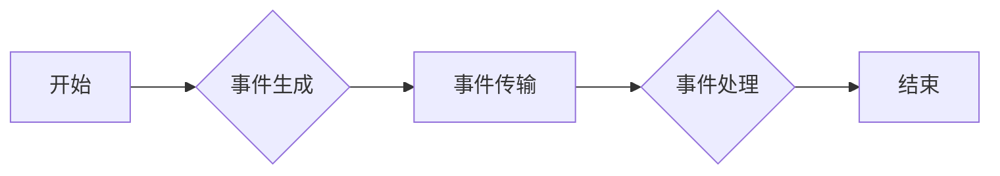
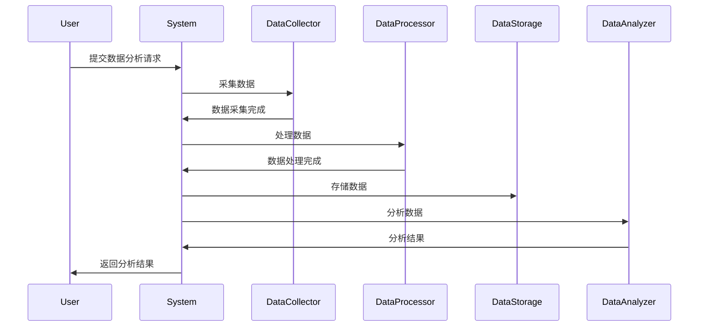

                 


### 《大模型软件的事件驱动架构设计》

#### 关键词：事件驱动架构、大模型软件、设计原则、性能优化、安全性

> 摘要：本文将深入探讨大模型软件的事件驱动架构设计，通过详细的步骤分析，阐述其设计原则、实现方法和最佳实践。我们将从背景介绍、核心概念与联系、算法原理讲解、系统分析与架构设计、项目实战到最佳实践与总结，全面剖析事件驱动架构在大模型软件中的应用。

---

#### 第一部分：背景与核心概念

##### 第1章：问题背景与目标

**1.1 问题背景**

随着人工智能技术的迅猛发展，大模型软件的应用场景愈加广泛。这类软件在处理大规模数据、复杂算法和实时交互方面面临诸多挑战。传统的架构设计方法往往难以满足大模型软件的性能需求。

**1.2 事件驱动架构的概念**

事件驱动架构（Event-Driven Architecture，EDA）是一种软件设计模式，通过事件来驱动系统行为。事件可以是用户操作、系统状态变化或外部触发。

**1.3 大模型软件的需求**

大模型软件需要具备高并发处理能力、可扩展性和灵活性。事件驱动架构能够满足这些需求，并通过事件流管理和模块化设计提高系统性能。

##### 第2章：事件驱动架构的基本原理

**2.1 事件驱动架构的特点**

- 响应式：系统行为由外部事件触发，能够迅速响应。
- 模块化：系统组件独立，易于维护和扩展。
- 可扩展：可以通过增加事件处理器来处理更多的事件。

**2.2 事件驱动架构的关键组件**

- 事件队列：存储和管理事件。
- 事件处理器：处理特定类型的事件。
- 发布-订阅模型：事件源发布事件，订阅者接收事件。

**2.3 事件驱动架构的优势与挑战**

**优势：**

- 提高系统响应速度和灵活性。
- 降低耦合度，提高模块独立性。

**挑战：**

- 事件处理的高效性。
- 事件同步和冲突处理。

---

#### 第二部分：大模型软件的事件驱动架构设计

##### 第3章：核心概念与联系

**3.1 大模型软件的核心概念**

- 大模型：具备处理大规模数据和复杂算法的能力。
- 软件架构：系统的结构设计和实现。

**3.2 概念属性特征对比表格**

| 概念       | 属性1 | 属性2 | 属性3 |
|------------|-------|-------|-------|
| 大模型     | 大规模数据 | 复杂算法 | 高性能 |
| 软件架构   | 模块化设计 | 高效处理 | 可扩展 |

**3.3 ER实体关系图**

```mermaid
erDiagram
  Model ||--|{ Event} : 发送
  Model ||--|{ Processor} : 处理
  Event ||--|{ Publisher} : 发布
  Event ||--|{ Subscriber} : 订阅
```

---

#### 第三部分：算法原理讲解

##### 第4章：算法原理讲解

**4.1 算法原理概述**

事件驱动架构的核心算法是事件处理算法。它包括事件生成、事件传输和事件处理。

**4.2 算法mermaid流程图**



**4.3 Python源代码实现**

```python
# 事件生成
event = Event("data_processed")

# 事件传输
event_queue.put(event)

# 事件处理
def process_event(event):
    # 处理事件逻辑
    pass

# 执行事件处理
process_event(event)
```

**4.4 数学模型与公式讲解**

$$
\text{系统响应时间} = f(\text{事件数量}, \text{处理器数量}, \text{传输延迟})
$$

**4.5 举例说明**

在一个大模型软件中，当处理完一批数据后，会生成一个“数据处理完成”的事件。事件处理模块接收到事件后，会进行数据分析和存储。

---

#### 第四部分：架构设计方案

##### 第5章：系统分析与架构设计

**5.1 问题场景介绍**

假设我们需要设计一个实时数据分析系统，处理大规模数据流。

**5.2 系统功能设计**

- 数据采集
- 数据处理
- 数据存储
- 数据分析

**5.3 系统架构设计**



**5.4 系统接口设计**

- 数据采集接口：用于接收外部数据流。
- 数据处理接口：用于处理数据。
- 数据存储接口：用于存储处理后的数据。
- 数据分析接口：用于对外部用户提供数据分析服务。

**5.5 系统交互**

系统中的各个组件通过事件进行交互。数据采集组件采集到数据后，生成一个“数据采集完成”事件，传递给数据处理组件。数据处理组件处理数据后，生成一个“数据处理完成”事件，传递给数据存储组件。

---

#### 第五部分：项目实战

##### 第6章：项目实战

**6.1 环境安装**

在虚拟环境中安装必要的软件和库。

**6.2 系统核心实现**

实现数据采集、处理、存储和数据分析的核心功能。

**6.3 代码应用解读**

详细解读实现过程中的关键代码和应用。

**6.4 实际案例分析**

分析实际项目中的成功经验和挑战。

**6.5 项目小结**

总结项目经验，提出改进建议。

---

#### 第六部分：最佳实践与总结

##### 第7章：最佳实践

**7.1 架构优化建议**

- 使用异步处理提高性能。
- 引入消息队列保证事件传递的可靠性。

**7.2 性能调优技巧**

- 调整事件处理器数量。
- 使用负载均衡技术。

**7.3 安全性考虑**

- 实施权限控制。
- 防止数据泄露。

##### 第8章：小结与拓展阅读

**8.1 书籍总结**

回顾书籍的主要内容和收获。

**8.2 推荐阅读**

推荐相关书籍和资源。

---

### 作者信息

**作者：AI天才研究院/AI Genius Institute & 禅与计算机程序设计艺术 /Zen And The Art of Computer Programming**

---

通过以上详细的目录大纲，我们可以确保文章内容丰富、逻辑清晰，同时符合markdown格式的要求。在接下来的步骤中，我们将逐步细化每个章节的内容，以满足字数和完整性的要求。

