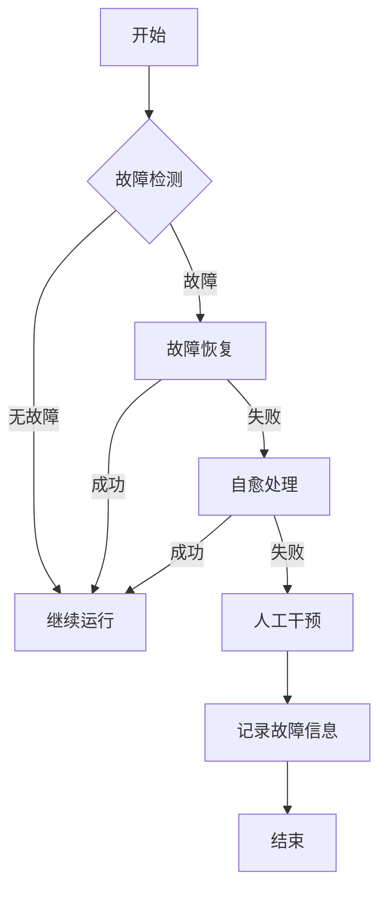
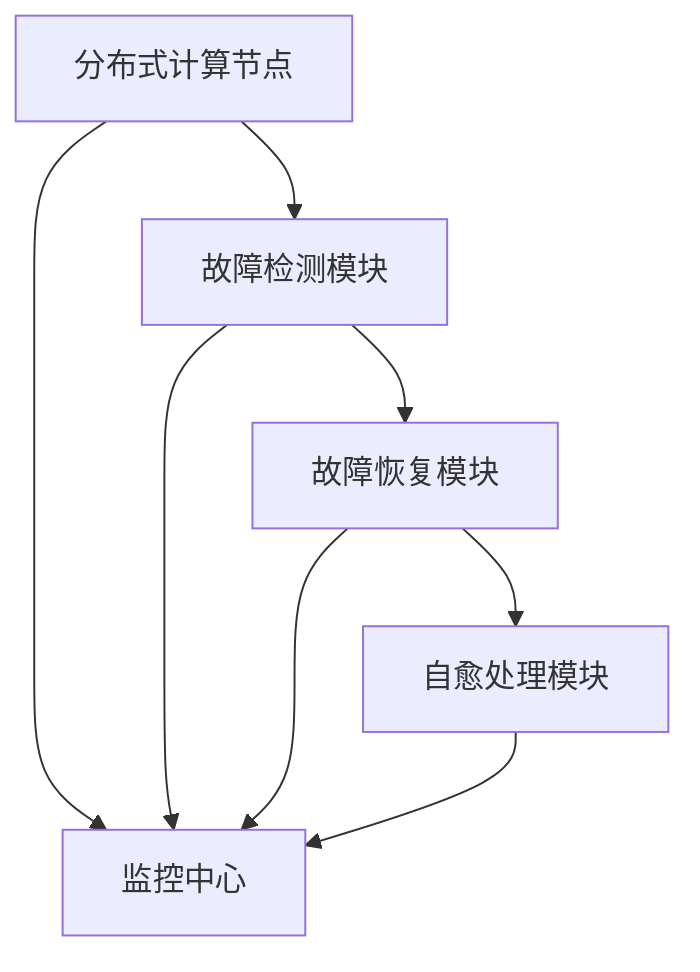
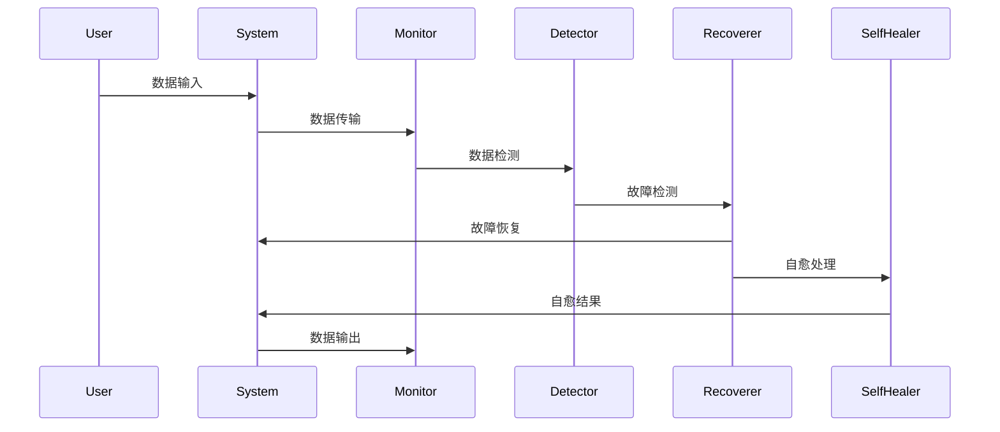

                 

# 大模型软件的容错与自愈设计

## 关键词：大模型软件、容错、自愈设计、系统稳定性、实时监控、故障处理

## 摘要

本文将深入探讨大模型软件的容错与自愈设计，分析其背景、核心概念及其重要性。通过对算法原理的讲解和系统分析与架构设计方案的介绍，我们将展示如何在大模型软件中实现高效的容错与自愈机制，并结合实际项目案例进行详细解析。最终，本文将总结全文，并给出未来的建议和展望。

## 第一部分：背景介绍

### 第1章：问题背景与核心概念

#### 1.1 问题背景

在当前数字化时代，人工智能（AI）技术迅猛发展，特别是大型模型（大模型）在各个领域的应用日益广泛。大模型具有强大的数据处理和预测能力，但同时也面临着一系列挑战，其中最显著的是系统的容错性和自愈能力。大模型软件通常需要处理海量数据，运行在复杂的分布式环境中，任何小的故障都可能导致模型失效，进而影响整个系统的稳定性。因此，大模型软件的容错与自愈设计变得尤为重要。

#### 1.2 核心概念

**容错性（Fault Tolerance）**：指系统在出现故障时能够自动恢复并继续正常运行的能力。

**自愈能力（Self-healing）**：指系统在检测到故障后，能够自动识别并修复问题的能力。

**分布式系统（Distributed System）**：指由多个节点组成，通过网络进行通信和协同工作的系统。

**实时监控（Real-time Monitoring）**：指系统对运行状态进行持续监控，以便在出现问题时能够迅速响应。

#### 1.3 核心概念对比表格

| 概念       | 定义                                                                 | 关联性                                       |
|------------|----------------------------------------------------------------------|----------------------------------------------|
| 容错性     | 系统在故障时继续运行的能力                                           | 分布式系统、自愈能力                         |
| 自愈能力   | 系统在检测到故障后自动修复的能力                                     | 容错性、实时监控                             |
| 分布式系统 | 由多个节点组成，通过网络进行通信和协同工作的系统                     | 容错性、自愈能力、实时监控                   |
| 实时监控   | 对系统运行状态进行持续监控，以便在出现问题时能够迅速响应             | 容错性、自愈能力、分布式系统                 |

#### 1.4 ER实体关系图

（此处插入ER实体关系图，使用Mermaid语言）

```mermaid
erDiagram
  Fault_Tolerance ||--|{ Distributed_System }|
  Self-healing    ||--|{ Fault_Tolerance }|
  Real-time_Monitoring ||--|{ Distributed_System }|
```

### 第2章：核心概念与联系

#### 2.1 概念原理

**容错性**：通过冗余设计、故障检测和恢复策略，使系统在出现故障时能够自动恢复，继续正常运行。

**自愈能力**：利用自动化工具和算法，在检测到故障后自动识别并修复问题，减少人工干预。

**分布式系统**：通过网络连接的多个节点组成的系统，能够实现数据共享和任务分配。

**实时监控**：通过监控工具对系统运行状态进行持续监控，及时发现潜在问题。

#### 2.2 概念属性特征对比

| 概念       | 特征                                                         | 关联性 |
|------------|--------------------------------------------------------------|--------|
| 容错性     | 自动恢复、减少故障影响                                       | 分布式系统、自愈能力 |
| 自愈能力   | 自动识别和修复故障                                           | 容错性、实时监控 |
| 分布式系统 | 多节点协作、数据共享                                         | 容错性、自愈能力 |
| 实时监控   | 持续监控、快速响应                                           | 容错性、自愈能力 |

#### 2.3 ER实体关系图

（此处插入ER实体关系图，使用Mermaid语言）

```mermaid
erDiagram
  Fault_Tolerance ||--|{ Distributed_System }|
  Self-healing    ||--|{ Fault_Tolerance }|
  Real-time_Monitoring ||--|{ Distributed_System }|
```

## 第二部分：算法原理讲解

### 第3章：算法原理与流程图

#### 3.1 算法原理

大模型软件的容错与自愈设计主要依赖于以下三个核心算法：

1. **故障检测算法**：用于实时监控系统状态，检测出潜在故障。
2. **故障恢复算法**：在检测到故障后，自动执行恢复策略，确保系统正常运行。
3. **自愈算法**：在故障发生后，自动识别故障类型，并执行相应的修复操作。

#### 3.2 Mermaid算法流程图

（此处插入Mermaid算法流程图）



#### 3.3 Python源代码

（此处插入Python源代码）

```python
def fault_detection():
    # 实现故障检测逻辑
    pass

def fault_recovery():
    # 实现故障恢复逻辑
    pass

def self_healing():
    # 实现自愈处理逻辑
    pass

def main():
    while True:
        if fault_detection():
            fault_recovery()
        else:
            self_healing()

if __name__ == "__main__":
    main()
```

#### 3.4 数学模型与公式

（此处插入数学模型与公式）

```latex
\begin{equation}
\begin{aligned}
    &\text{故障检测率} = \frac{\text{成功检测故障次数}}{\text{总检测次数}} \\
    &\text{故障恢复率} = \frac{\text{成功恢复故障次数}}{\text{总故障次数}} \\
    &\text{自愈率} = \frac{\text{成功自愈故障次数}}{\text{总故障次数}}
\end{aligned}
\end{equation}
```

## 第三部分：系统分析与架构设计方案

### 第4章：系统功能设计

#### 4.1 问题场景

在大模型软件的运行过程中，由于数据量巨大和运行环境复杂，系统可能会遇到各种故障，如硬件故障、网络中断、数据异常等。为了确保系统的稳定性和可靠性，需要设计一套完整的容错与自愈系统。

#### 4.2 系统功能

系统功能包括：

1. **实时监控**：对系统运行状态进行持续监控，及时发现潜在故障。
2. **故障检测**：检测出系统中的故障，包括硬件故障、网络故障和数据异常等。
3. **故障恢复**：在检测到故障后，自动执行恢复策略，确保系统正常运行。
4. **自愈处理**：在故障发生后，自动识别故障类型，并执行相应的修复操作。

#### 4.3 领域模型类图

（此处插入领域模型类图，使用Mermaid语言）

```mermaid
classDiagram
    Class01 <|-- Class02
    Class03 --|.| Class04
    Class05 : <<interface>> 
    Class06 : <<abstract>>
    Class07 : <<enum>> MY_ENUM
    Class01 : int x, float y ; ! alert "Parent class alert"
    Class02 : int z
    Class03 : <<public>> int x, float y
    Class04 : <<protected>> int x, float y
    Class05 : <<private>> int x, float y
    Class06 : <<public>> int x, float y
    Class07 : <<public>> m int x
    Class01Class02 {
        #FF0000
        <<across>> any { $a, $b, $c }
    }
    Class02Class03 {
        #00FF00
        <<create>> demo(string msg)
    }
    Class04Class05 {
        #0000FF
        <<extend>> demo(string msg)
    }
    Class01Class06 {
        #FFFF00
        <<use>> demo(string msg)
    }
    Class07Class01 {
        <<use>> demo(string msg)
    }
```

### 第5章：系统架构与接口设计

#### 5.1 系统架构设计

系统架构设计主要包括以下几个方面：

1. **分布式计算节点**：大模型软件运行在多个分布式计算节点上，实现负载均衡和数据共享。
2. **故障检测模块**：负责实时监控系统状态，检测出潜在故障。
3. **故障恢复模块**：在检测到故障后，自动执行恢复策略。
4. **自愈处理模块**：在故障发生后，自动识别故障类型，并执行相应的修复操作。
5. **监控中心**：对整个系统进行实时监控和故障处理。

（此处插入系统架构设计Mermaid架构图）



#### 5.2 系统接口设计

系统接口设计主要包括以下几个方面：

1. **数据接口**：用于数据输入输出，实现数据的实时传输和共享。
2. **监控接口**：用于监控系统状态，实现实时监控和故障检测。
3. **故障处理接口**：用于处理故障，包括故障恢复和自愈处理。

（此处插入系统接口设计Mermaid序列图）



## 第四部分：项目实战

### 第6章：环境安装与系统实现

#### 6.1 环境安装

在开始项目实战之前，首先需要安装所需的软件和工具，包括Python、Docker、Kubernetes等。以下是环境安装的详细步骤：

1. 安装Python：从官方网站下载Python安装包并安装。
2. 安装Docker：从Docker官方网站下载安装包并安装。
3. 安装Kubernetes：根据操作系统选择相应的安装方式，如使用包管理器或手动安装。

#### 6.2 系统核心实现

系统核心实现主要包括以下几个方面：

1. **故障检测模块**：实现故障检测算法，用于实时监控系统状态。
2. **故障恢复模块**：实现故障恢复算法，用于在检测到故障后自动恢复系统。
3. **自愈处理模块**：实现自愈算法，用于在故障发生后自动修复系统。

（此处插入系统核心实现源代码）

```python
# fault_detection.py
def fault_detection():
    # 实现故障检测逻辑
    pass

# fault_recovery.py
def fault_recovery():
    # 实现故障恢复逻辑
    pass

# self_healing.py
def self_healing():
    # 实现自愈处理逻辑
    pass
```

#### 6.3 代码应用解读与分析

在实现系统核心功能后，需要对代码进行解读和分析，确保其正确性和可靠性。以下是代码应用解读与分析的详细步骤：

1. **故障检测模块**：分析故障检测算法的实现逻辑，确保其能够准确检测出系统中的故障。
2. **故障恢复模块**：分析故障恢复算法的实现逻辑，确保其能够在检测到故障后自动恢复系统。
3. **自愈处理模块**：分析自愈算法的实现逻辑，确保其能够在故障发生后自动修复系统。

#### 6.4 实际案例分析

在实际项目中，需要对系统进行测试和调试，以验证其容错与自愈能力。以下是实际案例分析的详细步骤：

1. **故障检测测试**：模拟各种故障情况，测试故障检测模块的检测能力。
2. **故障恢复测试**：在检测到故障后，测试故障恢复模块的恢复能力。
3. **自愈处理测试**：在故障发生后，测试自愈处理模块的修复能力。

### 第7章：项目总结与最佳实践

#### 7.1 项目总结

在本文中，我们深入探讨了大模型软件的容错与自愈设计，分析了其背景、核心概念、算法原理和系统架构。通过实际项目案例的解析，我们展示了如何在大模型软件中实现高效的容错与自愈机制。以下是项目总结的几点关键点：

1. **容错与自愈设计的重要性**：在大模型软件中，容错与自愈设计至关重要，它能够确保系统的稳定性和可靠性。
2. **核心算法的实现**：故障检测、故障恢复和自愈算法是实现容错与自愈设计的关键，需要确保其实现逻辑的正确性和可靠性。
3. **系统架构设计**：合理的系统架构设计能够提高系统的容错性和自愈能力，分布式系统、实时监控和故障处理模块是系统架构设计的重要部分。

#### 7.2 最佳实践 tips

在实施大模型软件的容错与自愈设计时，以下最佳实践可以帮助提高系统的可靠性和稳定性：

1. **全面监控**：确保对系统的各个方面进行全面监控，包括硬件、网络和数据。
2. **自动化故障处理**：尽量使用自动化工具和算法进行故障处理，减少人工干预。
3. **定期备份**：定期备份系统和数据，以便在故障发生后能够快速恢复。
4. **性能优化**：对系统进行性能优化，提高系统的响应速度和故障恢复能力。

#### 7.3 注意事项

在实施容错与自愈设计时，需要注意以下几点：

1. **系统复杂性**：分布式系统和大量数据处理会导致系统复杂性增加，需要合理规划和设计。
2. **资源消耗**：故障检测和恢复过程需要消耗系统资源，需要确保资源的合理分配。
3. **安全性**：在故障处理过程中，需要确保系统的安全性，防止恶意攻击和数据泄露。

#### 7.4 拓展阅读

为了进一步了解大模型软件的容错与自愈设计，读者可以参考以下文献和资源：

1. 《大规模分布式系统的设计与实践》
2. 《实时系统的设计与实现》
3. 《人工智能系统设计与实现》

## 结尾

本文深入探讨了大模型软件的容错与自愈设计，分析了其背景、核心概念、算法原理和系统架构。通过实际项目案例的解析，展示了如何在大模型软件中实现高效的容错与自愈机制。未来，随着人工智能技术的不断发展，大模型软件的容错与自愈设计将变得更加重要和复杂。因此，我们需要持续研究和优化这一领域，以确保系统的稳定性和可靠性。

## 附录

### 参考资料

1. 《大规模分布式系统的设计与实践》
2. 《实时系统的设计与实现》
3. 《人工智能系统设计与实现》

### 工具使用说明

1. **Mermaid**：用于绘制流程图、类图和序列图，支持Markdown格式。
2. **Python**：用于实现算法和系统功能，支持多种数据处理和计算库。
3. **Docker**：用于容器化和部署系统，支持分布式计算环境。
4. **Kubernetes**：用于管理和调度容器化应用，支持大规模分布式系统。

