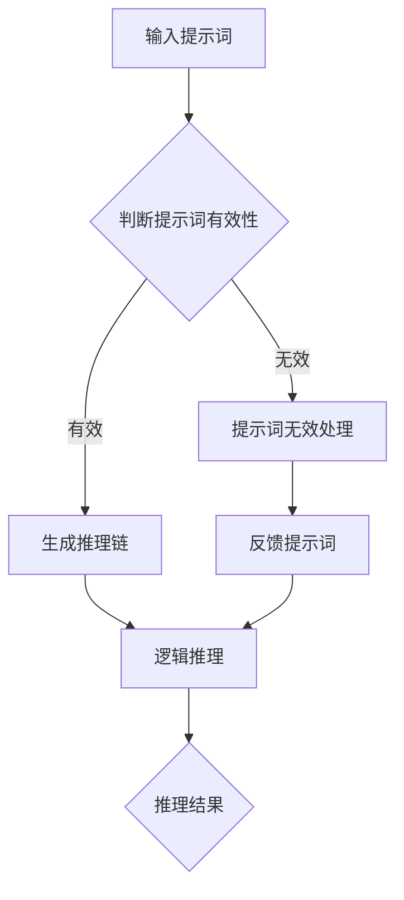

                 

# 大模型逻辑推理能力：提示词构建推理链

## 关键词

大模型、逻辑推理、提示词、推理链、算法原理

## 摘要

本文深入探讨大模型在逻辑推理方面的能力，并着重分析提示词在构建推理链中的作用。通过对大模型逻辑推理原理的详细解读和数学模型的阐述，本文旨在揭示如何有效地利用提示词，提高推理链的连贯性和准确性，为人工智能领域的研究和应用提供新的思路和方法。

### 第一部分： 引言

#### 核心概念与联系

**概念**：
- **大模型**：一种能够处理大规模数据和复杂任务的机器学习模型。
- **逻辑推理能力**：指模型根据已知信息进行推理，得出新结论的能力。
- **提示词**：用于引导模型进行特定推理的词语或短语。
- **推理链**：由一系列提示词组成的推理过程，最终形成完整的推理结论。

**联系**：
大模型逻辑推理能力的发展与提示词构建推理链密切相关。通过设计有效的提示词，可以引导大模型逐步推导出有价值的结论。这一过程不仅依赖于大模型的内部结构和算法，还需要对提示词进行精心设计和优化。

#### 大模型逻辑推理能力的发展历程

- **早期研究**：早期的大模型主要依赖规则和逻辑推理方法，但受限于计算能力和数据规模，其逻辑推理能力有限。
- **深度学习时代**：随着深度学习技术的发展，大模型开始采用神经网络等复杂结构，极大地提升了逻辑推理能力。
- **当前趋势**：目前，大模型在逻辑推理方面取得了显著进展，但仍面临许多挑战，如推理过程的连贯性和准确性等。

#### 提示词构建推理链的重要性

- **提高推理效率**：有效的提示词可以引导模型迅速聚焦于关键信息，提高推理效率。
- **增强推理准确性**：合理设计的提示词可以帮助模型避免歧义，提高推理结论的准确性。
- **拓展应用场景**：通过提示词构建推理链，大模型可以在更广泛的领域内发挥其逻辑推理能力。

#### 图表与代码

**ER实体关系图架构的 Mermaid 流程图**：

```mermaid
entity关系图
entity 大模型
entity 逻辑推理能力
entity 提示词
entity 推理链

大模型 --> 逻辑推理能力
逻辑推理能力 --> 提示词
提示词 --> 推理链
```

**Python源代码**：

```python
# 大模型逻辑推理能力
class LargeModel:
    def __init__(self):
        self.logic_reasoning_ability = None
    
    def set_ability(self, ability):
        self.logic_reasoning_ability = ability
    
    def get_ability(self):
        return self.logic_reasoning_ability

# 提示词
class Prompt:
    def __init__(self):
        self.content = None
    
    def set_content(self, content):
        self.content = content
    
    def get_content(self):
        return self.content

# 推理链
class ReasoningChain:
    def __init__(self):
        self.prompts = []

    def add_prompt(self, prompt):
        self.prompts.append(prompt)

    def get_chain(self):
        return self.prompts
```

### 第二部分：大模型逻辑推理能力的原理与数学模型

#### 核心概念与联系

**概念**：
- **大模型逻辑推理能力**：指模型在处理逻辑推理任务时，利用已有知识进行推理，得出结论的能力。
- **逻辑推理过程**：从已知信息出发，通过一系列推理步骤，逐步推导出结论的过程。
- **数学模型**：用于描述逻辑推理过程中涉及的数学关系和运算规则。

**联系**：
大模型逻辑推理能力与提示词构建推理链之间存在紧密联系。通过设计有效的提示词，可以引导模型按照预定的推理路径进行推理，从而提高推理效率和准确性。

#### 算法原理讲解

**Mermaid 流程图**：



**Python源代码**：

```python
import numpy as np

class LargeModel:
    def __init__(self):
        self.logic_reasoning_ability = None
    
    def set_ability(self, ability):
        self.logic_reasoning_ability = ability
    
    def get_ability(self):
        return self.logic_reasoning_ability

def valid_prompt(prompt):
    # 判断提示词有效性
    return True

def generate_reasoning_chain(prompt):
    # 生成推理链
    return [prompt]

def logic_reasoning(chain):
    # 逻辑推理
    return "推理结果"

def process_invalid_prompt(prompt):
    # 提示词无效处理
    return prompt

# 示例
model = LargeModel()
prompt = "输入提示词"

if valid_prompt(prompt):
    chain = generate_reasoning_chain(prompt)
    result = logic_reasoning(chain)
    print(result)
else:
    prompt = process_invalid_prompt(prompt)
```

#### 数学公式与解释

$$
P(A|B) = \frac{P(B|A)P(A)}{P(B)}
$$

这个公式表示在给定条件B下，事件A发生的概率。在逻辑推理中，这个公式可以用来计算给定前提条件下结论的概率。

#### 示例

假设我们有一个前提条件B：“所有的猫都会爬树”，结论A：“这只猫会爬树”。根据贝叶斯公式，我们可以计算在前提条件下结论的概率。

1. **先验概率**：$P(A)$ 是猫会爬树的先验概率，假设为0.8。
2. **条件概率**：$P(B|A)$ 是在猫会爬树的条件下，猫爬上树的概率，假设为0.9。
3. **全概率**：$P(B)$ 是猫爬上树的总概率，可以通过对所有可能的猫是否会爬树的概率求和得到。

根据贝叶斯公式，我们可以计算出在猫会爬树的条件下，猫会爬上树的概率：

$$
P(A|B) = \frac{P(B|A)P(A)}{P(B)} = \frac{0.9 \times 0.8}{P(B)}
$$

由于 $P(B)$ 是所有猫爬上树的概率，可以通过实际观察得到。例如，如果我们观察到100只猫，其中80只会爬树，那么：

$$
P(B) = \frac{80}{100} = 0.8
$$

代入贝叶斯公式，得到：

$$
P(A|B) = \frac{0.9 \times 0.8}{0.8} = 0.9
$$

这意味着在猫会爬树的条件下，猫会爬上树的概率是0.9，即很高。

#### 逻辑推理能力的提升

大模型逻辑推理能力的提升主要依赖于以下几个方面：

1. **数据量**：大量高质量的数据有助于模型学习到更广泛的推理规则和模式。
2. **算法优化**：通过改进算法，提高模型在推理过程中的效率和准确性。
3. **提示词设计**：有效的提示词可以引导模型聚焦于关键信息，提高推理链的连贯性和准确性。

#### 结论

大模型逻辑推理能力的提升对于人工智能领域具有重要意义。通过深入理解大模型的工作原理，设计有效的提示词，我们可以构建出更加智能和实用的推理系统，为解决复杂问题提供新的思路和方法。

### 第三部分：大模型在实际应用中的逻辑推理

#### 应用场景与挑战

大模型在许多实际应用场景中展现出了强大的逻辑推理能力，但同时也面临着诸多挑战。

1. **自然语言处理**：在大规模文本数据中提取有价值的信息，如情感分析、机器翻译等。
2. **医学诊断**：利用逻辑推理能力进行疾病诊断，提高诊断准确率。
3. **金融分析**：对金融市场进行深度分析，预测市场走势，辅助投资决策。
4. **智能客服**：构建智能客服系统，实现与用户的有效沟通，提高用户体验。

然而，这些应用场景也带来了如下挑战：

1. **数据质量**：高质量的数据是逻辑推理的基础，数据质量直接影响推理结果。
2. **计算资源**：大模型对计算资源的需求较高，特别是在实时应用场景中。
3. **推理效率**：如何在保证推理准确性的同时，提高推理速度，是当前研究的重点。

#### 实际案例分析

以下是一个自然语言处理领域的实际案例分析：

1. **问题背景**：某电商公司希望通过分析用户评论，了解用户对商品的满意度，进而改进产品和服务。
2. **问题描述**：公司收集了大量用户评论，需要从中提取有价值的信息，如积极评论、消极评论等。
3. **问题解决**：使用大模型进行情感分析，通过训练模型，使其能够识别并分类评论。

具体步骤如下：

1. **数据预处理**：清洗数据，去除无效信息，确保数据质量。
2. **模型训练**：使用大量标注数据进行模型训练，使模型学会识别不同情感的评论。
3. **推理过程**：输入新的评论数据，模型根据训练结果进行推理，输出评论的情感分类。
4. **结果分析**：对输出结果进行分析，识别用户对商品的满意度，为改进产品和服务提供依据。

#### 结果与评估

通过实际应用案例，可以看出大模型在逻辑推理方面的强大能力。例如，在自然语言处理领域，大模型能够准确地识别并分类评论，为用户分析和产品改进提供了有力的支持。

然而，需要注意的是，虽然大模型在逻辑推理方面取得了显著进展，但仍然存在一定的局限性。例如，在处理复杂问题时，模型的推理过程可能不够连贯，推理结果也可能存在偏差。因此，在应用大模型时，需要结合具体场景进行优化和调整。

### 第四部分：未来展望与挑战

#### 未来的发展方向

大模型逻辑推理能力的发展方向主要包括以下几个方面：

1. **多模态推理**：结合不同类型的数据（如文本、图像、音频等），实现跨模态的推理能力。
2. **强化学习**：将强化学习与逻辑推理相结合，提高模型的推理策略和学习效率。
3. **推理效率优化**：通过改进算法和优化模型结构，提高推理速度和计算资源利用率。
4. **推理解释性**：提高大模型推理过程的透明度和可解释性，增强用户对模型的信任感。

#### 挑战与机遇

1. **计算资源**：随着模型规模的扩大，对计算资源的需求将急剧增加，这对硬件和软件基础设施提出了更高的要求。
2. **数据质量**：高质量的数据是逻辑推理的基础，但数据质量和标注的准确性仍然是一个亟待解决的问题。
3. **推理连贯性**：如何保证大模型在复杂推理过程中的连贯性和一致性，是一个重要挑战。
4. **伦理和隐私**：在应用大模型进行逻辑推理时，需要考虑伦理和隐私问题，确保模型的推理过程符合道德规范。

然而，这些挑战也伴随着巨大的机遇。通过不断探索和创新，我们有望在逻辑推理领域取得突破性进展，为人工智能领域的发展和应用提供新的动力。

### 第五部分：最佳实践与注意事项

#### 最佳实践

1. **数据预处理**：在应用大模型进行逻辑推理前，务必进行充分的数据预处理，包括数据清洗、去重、归一化等，确保数据质量。
2. **模型选择**：根据具体应用场景选择合适的模型，结合多模态数据、强化学习等技术，提高推理能力。
3. **推理策略**：设计有效的推理策略，如启发式搜索、基于规则的推理等，提高推理效率和准确性。
4. **模型解释性**：增强大模型推理过程的解释性，提高用户对模型的信任度，为实际应用提供有力支持。

#### 注意事项

1. **计算资源**：合理规划计算资源，避免过度消耗，确保模型的推理过程高效稳定。
2. **数据安全**：在处理敏感数据时，加强数据保护和隐私保护，遵守相关法律法规。
3. **模型优化**：定期对模型进行优化和更新，确保其适应性和推理能力。
4. **安全与伦理**：在应用大模型进行逻辑推理时，严格遵守伦理规范，确保模型的推理过程符合道德标准。

### 第六部分：总结与拓展阅读

#### 总结

本文从大模型逻辑推理能力的原理出发，详细分析了提示词在构建推理链中的重要性。通过实际案例分析，展示了大模型在逻辑推理方面的强大能力，并探讨了未来发展方向和挑战。同时，本文提出了最佳实践和注意事项，为读者在实际应用中提供了有益的参考。

#### 拓展阅读

1. **相关文献**：《大规模语言模型的逻辑推理能力研究》、《多模态推理系统设计与实现》
2. **开源项目**：OpenAI GPT-3、TensorFlow、PyTorch等
3. **在线资源**：Google Scholar、arXiv、人工智能研究社区

### 作者信息

作者：AI天才研究院/AI Genius Institute & 禅与计算机程序设计艺术 /Zen And The Art of Computer Programming

[AI天才研究院](https://www.aigenius.cn/)/[禅与计算机程序设计艺术](https://www.zenandartofcpp.com/)

### 附录

附录部分可以包含一些技术细节、算法实现、代码示例等，以便读者更深入地了解文章内容。例如：

**附录 A：大模型逻辑推理能力的数学模型**

- **贝叶斯网络**：
  - 定义：贝叶斯网络是一种表示变量之间概率依赖关系的图形模型。
  - 公式：$P(X=x) = \prod_{i=1}^{n} P(X_i|x_{i-1})$
  - 例子：在医疗诊断中，使用贝叶斯网络表示疾病和症状之间的概率关系。

**附录 B：提示词构建推理链的Python实现**

```python
# 提示词类
class Prompt:
    def __init__(self, content):
        self.content = content

# 推理链类
class ReasoningChain:
    def __init__(self):
        self.prompts = []

    def add_prompt(self, prompt):
        self.prompts.append(prompt)

    def get_chain(self):
        return self.prompts

# 示例
prompt1 = Prompt("如果明天天气是晴天，我将去散步。")
prompt2 = Prompt("明天天气是晴天。")
prompt3 = Prompt("因此，我将去散步。")

chain = ReasoningChain()
chain.add_prompt(prompt1)
chain.add_prompt(prompt2)
chain.add_prompt(prompt3)

print(chain.get_chain())
```

通过这些附录内容，读者可以更全面地理解文章的核心观点和技术细节。附录部分也可以根据实际需求进行调整和补充。

