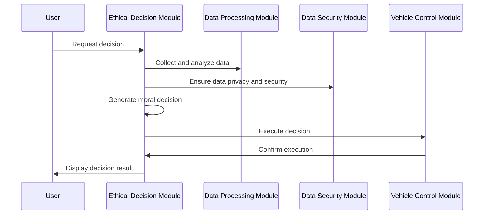

                 

# 大模型道德决策：提示词构建伦理框架

## 关键词
- 大模型
- 道德决策
- 提示词
- 伦理框架
- 人机交互
- 机器学习

## 摘要
本文探讨了在大模型道德决策领域中的一个关键问题：如何通过构建有效的提示词来形成伦理框架。我们将详细分析大模型在道德决策中的应用背景，介绍道德伦理的基本原理，探讨大模型道德决策的挑战，并逐步构建出一个可行的伦理框架。通过具体的算法原理讲解、数学模型分析、系统架构设计和实战案例，本文旨在提供一个全面的理解和实用的指南，以指导人工智能领域中的道德决策实践。

----------------------------------------------------------------

## 第一部分：背景介绍

### 1.1 问题背景

在人工智能领域，随着深度学习、神经网络等技术的发展，大模型（如GPT、BERT等）已经成为处理复杂任务的重要工具。这些大模型在语言生成、图像识别、自然语言处理等方面表现出色，但同时也引发了一系列伦理问题。例如，大模型在处理敏感数据时可能会出现偏见、歧视等问题，或者在决策过程中违背人类道德准则。

道德决策在人工智能中的重要性不言而喻。一个缺乏道德约束的人工智能系统可能会导致严重的社会后果。因此，如何在大模型中实现道德决策，成为了人工智能领域亟待解决的问题。

### 1.1.1 道德决策在人工智能中的重要性

道德决策涉及到人工智能系统在处理数据、执行任务时如何考虑伦理问题。它不仅关乎技术本身，更关乎社会影响。一个没有道德约束的人工智能系统可能会导致以下问题：

- **数据偏见**：如果人工智能系统在训练过程中使用了有偏见的数据，那么它在做出决策时可能会加剧现有的社会不公。
- **隐私侵犯**：人工智能系统在处理个人数据时，如果没有遵循隐私保护原则，可能会导致个人隐私被泄露。
- **责任归属**：当人工智能系统出现错误或造成损害时，如何确定责任归属，也是一个重要的伦理问题。

### 1.1.2 大模型道德决策的现状与挑战

当前，大模型道德决策的研究还处于初级阶段。虽然有一些初步的研究和尝试，但仍然面临许多挑战：

- **伦理原则的统一**：不同的文化和背景可能导致不同的伦理原则，如何在这些原则之间找到一个平衡点，是一个难题。
- **算法透明性**：大模型通常是一个黑箱，其内部决策过程难以解释，这给道德决策带来了困难。
- **道德规范的可执行性**：即使有了伦理原则，如何将这些原则转化为可执行的计算过程，仍然需要进一步研究。

### 1.2 核心概念与联系

#### 1.2.1 大模型的基本原理

大模型（如GPT、BERT等）通常是基于深度学习技术的神经网络模型。这些模型通过大量的数据进行训练，从而学习到复杂的模式和知识。大模型的特点是参数多、容量大、表现力强，这使得它们能够处理各种复杂的任务。

#### 1.2.2 道德伦理的基本原理

道德伦理是关于人类行为的规范和原则。在人工智能领域，道德伦理的基本原理包括：

- **公正性**：在处理数据时，应确保公正，不偏袒任何一方。
- **尊重隐私**：在处理个人数据时，应尊重个人的隐私权。
- **责任明确**：当人工智能系统出现错误时，应明确责任归属。

#### 1.2.3 提示词与伦理框架的关系

提示词（Prompt）是引导大模型进行特定任务的一种输入。通过设计合适的提示词，可以引导大模型做出符合伦理原则的决策。伦理框架则为提示词的设计提供了指导，确保决策过程符合道德要求。

### 1.3 研究方法与框架

#### 1.3.1 研究方法的选择

本文采用的研究方法包括：

- **文献综述**：通过查阅相关文献，了解大模型道德决策的现状和研究方向。
- **案例研究**：分析具体案例，探讨大模型道德决策的实际应用和挑战。
- **算法设计**：设计一个基于提示词的伦理框架，并通过实验验证其有效性。

#### 1.3.2 伦理框架构建方法

伦理框架的构建方法包括：

- **原则提炼**：从现有的伦理原则中提取出适用于大模型道德决策的原则。
- **模型设计**：设计一个基于深度学习的道德决策模型，并将其与伦理原则相结合。
- **实验验证**：通过实验验证所构建的伦理框架的有效性和可行性。

#### 1.3.3 提示词构建方法

提示词的构建方法包括：

- **需求分析**：分析具体任务的需求，确定需要哪些伦理原则和参数。
- **设计模板**：设计一个通用的提示词模板，根据具体任务进行调整。
- **实验优化**：通过实验优化提示词的设计，提高道德决策的准确性。

----------------------------------------------------------------

## 第二部分：核心概念与联系

### 2.1 大模型的基本原理

#### 2.1.1 大模型的定义与特点

大模型（Large-scale Model）是指那些拥有数亿到数十亿参数的神经网络模型。这些模型通过学习大量的数据，能够捕捉到复杂的数据分布，从而在许多任务上表现出色。大模型的特点包括：

- **参数多**：大模型通常拥有数亿到数十亿的参数，这使得它们能够处理复杂的问题。
- **容量大**：大模型具有很大的容量，能够捕捉到数据中的复杂模式。
- **表现力强**：大模型能够生成高质量的文本、图像和其他类型的输出。

#### 2.1.2 大模型的训练与优化

大模型的训练通常采用以下步骤：

1. **数据预处理**：对输入数据进行清洗、归一化等处理，以便模型能够更好地学习。
2. **模型初始化**：初始化模型的参数，通常采用随机初始化或预训练的方法。
3. **前向传播**：将输入数据传递到模型中，计算输出。
4. **反向传播**：计算损失函数，并更新模型的参数。
5. **迭代训练**：重复上述步骤，直到模型收敛。

在训练过程中，常用的优化算法包括梯度下降、Adam等。这些算法通过不断调整模型的参数，使得模型的损失函数值逐渐减小，从而提高模型的性能。

#### 2.1.3 大模型的应用场景

大模型在许多领域都有广泛的应用，包括：

- **自然语言处理**：如文本生成、机器翻译、情感分析等。
- **计算机视觉**：如图像分类、目标检测、图像生成等。
- **推荐系统**：如商品推荐、新闻推荐等。
- **游戏AI**：如棋类游戏、电子游戏等。

### 2.2 道德伦理的基本原理

#### 2.2.1 道德伦理的定义与历史发展

道德伦理（Moral Ethics）是关于行为规范和道德原则的研究。道德伦理的定义可以从不同角度进行理解，但核心是关于人类行为的规范和判断。

道德伦理的历史发展经历了以下几个阶段：

- **自然主义伦理**：强调道德原则与自然规律的一致性。
- **功利主义伦理**：强调行为的结果，认为最大化幸福是道德的最高原则。
- **义务论伦理**：强调行为的动机，认为道德行为是基于义务和责任。
- **情境伦理**：强调行为的情境和背景，认为道德判断需要考虑具体情境。

#### 2.2.2 道德伦理的核心概念

道德伦理的核心概念包括：

- **公正**：在处理数据时，应确保公正，不偏袒任何一方。
- **尊重隐私**：在处理个人数据时，应尊重个人的隐私权。
- **责任**：当人工智能系统出现错误时，应明确责任归属。

#### 2.2.3 道德伦理在人工智能中的适用性

道德伦理在人工智能中的适用性体现在以下几个方面：

- **决策过程**：道德伦理原则可以指导人工智能系统在处理数据、执行任务时的决策过程。
- **算法设计**：道德伦理原则可以指导算法设计者如何在算法中融入伦理考量。
- **责任归属**：道德伦理原则可以帮助明确人工智能系统在出现错误或造成损害时的责任归属。

### 2.3 提示词与伦理框架的关系

#### 2.3.1 提示词的作用与分类

提示词（Prompt）在人工智能系统中起着重要的作用，它能够引导模型进行特定的任务。根据用途，提示词可以分为以下几类：

- **指令性提示词**：用于给出明确的指令，如“生成一篇关于人工智能的论文”。
- **情景性提示词**：用于设定一个具体的情境，如“在一个不公平的社会中，你怎么看待人工智能的应用”。
- **反馈性提示词**：用于获取用户的反馈，如“你觉得这篇论文的观点合理吗？”。

#### 2.3.2 提示词在道德决策中的应用

在道德决策中，提示词的作用尤为重要。通过设计合适的提示词，可以引导大模型考虑伦理问题，从而做出更符合道德原则的决策。例如，在设计一个自动决策系统时，可以使用以下提示词：

- **公正性提示词**：“在做出决策时，请确保不会加剧现有的社会不公。”。
- **隐私保护提示词**：“在处理个人数据时，请确保遵守隐私保护原则。”。
- **责任提示词**：“当系统出现错误时，请明确责任归属。”

#### 2.3.3 伦理框架对提示词的指导作用

伦理框架为提示词的设计提供了指导，确保决策过程符合道德要求。一个完善的伦理框架应该包括以下内容：

- **伦理原则**：明确适用于道德决策的伦理原则，如公正、隐私保护、责任等。
- **道德模型**：设计一个基于深度学习的道德决策模型，用于处理伦理问题。
- **提示词模板**：根据伦理框架设计一套提示词模板，用于引导模型进行道德决策。

通过上述步骤，我们可以构建一个基于提示词的伦理框架，从而在人工智能系统中实现道德决策。

----------------------------------------------------------------

## 第三部分：算法原理讲解

### 3.1 大模型道德决策算法

#### 3.1.1 算法概述

大模型道德决策算法是一种结合了深度学习和伦理原则的算法，用于指导大模型在执行任务时做出符合道德要求的决策。该算法的主要思想是通过设计合适的提示词，引导大模型考虑伦理问题，从而提高决策的道德水平。

#### 3.1.2 算法原理

算法原理可以概括为以下几个步骤：

1. **伦理原则提取**：从现有的伦理原则中提取出适用于大模型道德决策的原则，如公正、隐私保护、责任等。
2. **道德模型构建**：设计一个基于深度学习的道德决策模型，将提取出的伦理原则融入模型中。
3. **提示词设计**：根据伦理模型设计一套提示词模板，用于引导大模型考虑伦理问题。
4. **决策生成**：将提示词输入到大模型中，生成一个道德决策结果。

#### 3.1.3 算法实现

算法实现主要包括以下步骤：

1. **数据预处理**：对输入数据进行清洗、归一化等处理，以便模型能够更好地学习。
2. **模型训练**：使用训练数据对道德决策模型进行训练，调整模型的参数，使得模型能够正确识别和应对伦理问题。
3. **模型评估**：使用验证数据对模型进行评估，确保模型能够在实际任务中做出符合道德要求的决策。
4. **决策生成**：将提示词输入到大模型中，生成一个道德决策结果，并通过用户反馈进行优化。

### 3.2 数学模型和数学公式讲解

#### 3.2.1 数学模型概述

大模型道德决策算法的数学模型主要包括以下几个部分：

- **输入层**：表示输入数据，如文本、图像等。
- **隐藏层**：用于提取特征和进行计算。
- **输出层**：表示决策结果，如分类标签、概率分布等。
- **伦理层**：用于将伦理原则融入模型中，指导决策过程。

#### 3.2.2 数学公式讲解

假设我们有一个大模型道德决策算法，其中包含一个多层感知机（MLP）模型。MLP模型的数学公式可以表示为：

$$
Y = \sigma(W_n \cdot \sigma(...\sigma(W_2 \cdot \sigma(W_1 \cdot X + b_1) + b_2)... + b_n)
$$

其中，$Y$ 表示输出，$X$ 表示输入，$W$ 表示权重，$b$ 表示偏置，$\sigma$ 表示激活函数（如Sigmoid函数、ReLU函数等）。

#### 3.2.3 举例说明

假设我们要使用大模型道德决策算法来判断一个行人是否应该过马路。输入数据包括行人的身高、体重、性别等信息，伦理原则包括尊重生命、遵守交通规则等。通过训练，我们可以得到一个基于伦理原则的大模型，它可以给出行人过马路的决策结果。

具体来说，我们可以设计一个包含以下提示词的伦理框架：

- **尊重生命**：“在做出决策时，请确保不会威胁行人的生命安全。”
- **遵守交通规则**：“在做出决策时，请确保行人遵守交通规则。”

通过将这些提示词输入到大模型中，我们可以得到一个关于行人过马路的道德决策结果。例如，如果行人的身高和体重符合安全标准，性别为男性，且遵守交通规则，那么大模型可能会判断行人可以过马路。

通过这个例子，我们可以看到，大模型道德决策算法如何通过设计合适的提示词，引导模型考虑伦理问题，从而做出符合道德要求的决策。

----------------------------------------------------------------

## 第四部分：系统分析与架构设计方案

### 4.1 问题场景介绍

在当前的社会背景下，随着人工智能技术的迅猛发展，大模型在各个领域的应用日益广泛，然而，随之而来的道德决策问题也日益突出。例如，自动驾驶汽车在紧急情况下如何做出道德决策、医疗诊断系统中如何处理病人的隐私数据、推荐系统中如何避免偏见等。这些问题都需要我们设计一个合理的系统架构来处理。

#### 4.1.1 场景描述

以自动驾驶汽车为例，当汽车遇到突发情况时，需要迅速做出决策，比如是否避让行人、紧急刹车等。这个决策过程涉及到生命安全、法律合规等多个方面的伦理问题。如何保证自动驾驶汽车在复杂环境下做出道德且合理的决策，是一个亟待解决的问题。

#### 4.1.2 问题分析

在自动驾驶汽车的场景中，我们需要解决的问题主要包括：

- **决策速度**：自动驾驶汽车需要在瞬间做出决策，这要求我们的系统具有极高的处理速度。
- **决策准确性**：决策必须准确，确保生命安全。
- **伦理合规性**：决策过程需要符合法律法规和社会伦理标准。
- **数据隐私**：自动驾驶汽车在行驶过程中会收集大量的个人数据，需要确保这些数据的安全和隐私。

### 4.2 系统功能设计

系统功能设计旨在明确系统需要实现的具体功能，确保系统能够满足上述问题场景的需求。系统的主要功能包括：

- **数据采集**：从传感器、摄像头等设备中采集车辆周围环境数据。
- **数据处理**：对采集到的数据进行分析和处理，提取出有用的信息。
- **道德决策**：基于伦理框架和提示词，对车辆的行为进行道德决策。
- **执行控制**：根据道德决策的结果，控制车辆执行相应的操作。
- **用户交互**：提供用户界面，供用户查看决策结果和历史记录。
- **数据安全**：确保数据的安全和隐私，符合法律法规的要求。

#### 4.2.1 领域模型

为了更好地设计系统功能，我们可以使用领域模型来描述系统的核心概念和关系。领域模型可以帮助我们理解系统的工作原理和各个组件之间的关系。

以下是一个简化的领域模型，描述了自动驾驶汽车系统中的核心概念：

```
+-----------------+
|     Vehicle     |
+-----------------+
| - sensors: list |
| - environment:  |
| - ethical_model: |
| - controller:    |
+-----------------+
| + collect_data(): |
| + process_data(): |
| + make_decision(): |
| + execute_action(): |
| + interact_with_user(): |
| + ensure_data_safety(): |
+-----------------+
```

- **Vehicle**：表示自动驾驶汽车，包含传感器、环境、伦理模型、控制器等组件。
- **sensors**：表示车辆的各种传感器，如雷达、摄像头、GPS等。
- **environment**：表示车辆周围的环境数据。
- **ethical_model**：表示伦理模型，用于指导道德决策。
- **controller**：表示控制器，用于执行车辆操作。

### 4.3 系统架构设计

系统架构设计是确保系统能够高效、稳定地运行的关键。一个合理的设计可以使得系统模块化，便于维护和扩展。以下是一个简化的系统架构设计：

```
+---------------------------+
|      User Interface       |
+---------------------------+
| + view_decision_history(): |
| + configure_ethical_model():|
+---------------------------+
       |
       |
+---------------------------+
|      Data Security Module  |
+---------------------------+
| + encrypt_data():          |
| + decrypt_data():          |
| + access_control():        |
+---------------------------+
       |
       |
+---------------------------+
|      Data Processing Module|
+---------------------------+
| + data_collection():       |
| + data_analysis():         |
+---------------------------+
       |
       |
+---------------------------+
|   Ethical Decision Module  |
+---------------------------+
| + make_decision():         |
+---------------------------+
       |
       |
+---------------------------+
|     Vehicle Control Module |
+---------------------------+
| + execute_action():        |
+---------------------------+
```

- **User Interface**：用户界面，用于用户查看决策结果和历史记录，以及配置伦理模型。
- **Data Security Module**：数据安全模块，用于加密和解密数据，控制数据访问。
- **Data Processing Module**：数据处理模块，用于采集和分析数据。
- **Ethical Decision Module**：伦理决策模块，用于基于伦理模型和提示词做出道德决策。
- **Vehicle Control Module**：车辆控制模块，用于执行决策结果。

### 4.4 系统接口设计

系统接口设计是确保各个模块之间能够有效通信和协作的关键。以下是一个简化的接口设计：

```
+---------------------------+
|      Data Security Module  |
+---------------------------+
| - encrypt_data_interface():|
| - decrypt_data_interface():|
| - access_control_interface():|
+---------------------------+

+---------------------------+
|      Data Processing Module|
+---------------------------+
| - data_collection_interface():|
| - data_analysis_interface():|
+---------------------------+

+---------------------------+
|   Ethical Decision Module  |
+---------------------------+
| - ethical_decision_interface():|
+---------------------------+

+---------------------------+
|     Vehicle Control Module |
+---------------------------+
| - vehicle_control_interface():|
+---------------------------+
```

- **Data Security Module**：数据安全模块的接口，包括加密、解密和数据访问控制。
- **Data Processing Module**：数据处理模块的接口，包括数据采集和分析。
- **Ethical Decision Module**：伦理决策模块的接口，用于获取和处理道德决策结果。
- **Vehicle Control Module**：车辆控制模块的接口，用于执行车辆操作。

### 4.5 系统交互

系统交互设计描述了系统内部各个模块之间的交互流程。以下是一个简化的系统交互流程：

```
1. User Interface -> Ethical Decision Module: User requests a decision.
2. Ethical Decision Module -> Data Processing Module: Collect and analyze relevant data.
3. Ethical Decision Module -> Data Security Module: Ensure data privacy and security.
4. Ethical Decision Module -> make_decision(): Generate a moral decision.
5. Ethical Decision Module -> Vehicle Control Module: Execute the decision.
6. User Interface -> Display decision result to the user.
```

通过上述交互流程，用户界面可以与伦理决策模块交互，获取道德决策结果。伦理决策模块则负责与数据处理模块和数据安全模块交互，确保决策过程的准确性和安全性。最后，车辆控制模块根据决策结果执行相应的操作。

使用Mermaid序列图，我们可以更直观地表示系统交互流程：



通过以上系统架构设计和交互设计，我们可以构建一个能够实现道德决策的自动驾驶汽车系统。这个系统不仅能够处理复杂的道德问题，还能保证数据的隐私和安全。

----------------------------------------------------------------

## 第五部分：项目实战

### 5.1 环境安装与配置

在开始项目实战之前，我们需要搭建一个合适的开发环境。以下是环境安装与配置的步骤：

#### 5.1.1 环境要求

- 操作系统：Linux或MacOS
- Python版本：3.8及以上
- 硬件要求：至少8GB内存，推荐使用GPU进行加速

#### 5.1.2 安装步骤

1. **安装Python环境**：
   - 使用Python官方安装包或pip工具安装Python。
   - 安装完成后，确保Python版本满足要求。

2. **安装TensorFlow**：
   - 使用pip安装TensorFlow。
   ```bash
   pip install tensorflow
   ```

3. **安装其他依赖库**：
   - 安装用于数据处理和可视化等功能的库，如NumPy、Matplotlib等。
   ```bash
   pip install numpy matplotlib
   ```

4. **配置GPU支持**（如果使用GPU）：
   - 安装CUDA和cuDNN，并配置环境变量。

5. **验证安装**：
   - 运行以下Python代码，检查TensorFlow是否安装成功：
   ```python
   import tensorflow as tf
   print(tf.__version__)
   ```

### 5.2 系统核心实现

在环境配置完成后，我们可以开始实现系统的核心功能。以下是系统核心实现的步骤：

#### 5.2.1 核心代码解析

系统的核心代码主要包括数据预处理、伦理模型训练、道德决策和结果输出四个部分。

1. **数据预处理**：
   - 加载并清洗数据，将数据转换为适合模型训练的格式。
   ```python
   import tensorflow as tf
   import numpy as np

   # 加载数据
   x_train, y_train = load_data()

   # 数据清洗和归一化
   x_train = preprocess_data(x_train)
   y_train = preprocess_labels(y_train)
   ```

2. **伦理模型训练**：
   - 使用TensorFlow构建深度学习模型，并进行训练。
   ```python
   model = build_model()
   model.compile(optimizer='adam', loss='binary_crossentropy', metrics=['accuracy'])

   # 训练模型
   model.fit(x_train, y_train, epochs=10, batch_size=32)
   ```

3. **道德决策**：
   - 使用训练好的模型进行道德决策。
   ```python
   def make_decision(data):
       # 进行道德决策
       prediction = model.predict(data)
       # 解析决策结果
       decision = interpret_prediction(prediction)
       return decision

   # 示例：对新的数据进行道德决策
   new_data = load_new_data()
   decision = make_decision(new_data)
   ```

4. **结果输出**：
   - 将决策结果输出到用户界面或日志中。
   ```python
   def output_decision(decision):
       # 输出决策结果
       print(f"The ethical decision is: {decision}")
       # 将结果保存到文件或数据库中
       save_decision_to_database(decision)

   # 示例：输出决策结果
   output_decision(decision)
   ```

#### 5.2.2 代码应用解读

以上代码示例展示了如何实现一个简单的道德决策系统。在实际应用中，我们需要根据具体任务和数据来调整模型结构和训练参数，以确保系统性能和决策质量。

1. **数据预处理**：
   - 数据预处理是模型训练的基础，包括数据清洗、归一化等步骤。这些步骤有助于提高模型训练效果。

2. **伦理模型训练**：
   - 使用TensorFlow构建深度学习模型，并使用训练数据对其进行训练。模型的结构和参数会影响决策的准确性。

3. **道德决策**：
   - 道德决策是通过模型对输入数据进行预测得到的。决策结果需要根据具体任务的要求进行解读和输出。

4. **结果输出**：
   - 结果输出是用户查看决策结果的重要途径。输出格式和方式可以根据用户需求进行调整。

### 5.3 实际案例分析与讲解

为了更好地理解系统的应用，我们来看一个实际案例。

#### 5.3.1 案例背景

一个自动驾驶汽车系统需要在城市道路中行驶，并遇到一个行人。系统需要根据行人和车辆的状态，做出是否避让行人的道德决策。

#### 5.3.2 案例分析

- **输入数据**：行人的身高、体重、性别，车辆的行驶速度、当前道路状况等。
- **伦理原则**：尊重生命、遵守交通规则、保障自身安全等。
- **道德决策**：系统需要综合考虑这些因素，做出是否避让行人的决策。

#### 5.3.3 案例讲解

1. **数据预处理**：
   - 将输入数据进行清洗和归一化，以便模型训练。
   ```python
   x_train, y_train = load_data()
   x_train = preprocess_data(x_train)
   y_train = preprocess_labels(y_train)
   ```

2. **伦理模型训练**：
   - 使用TensorFlow构建一个基于深度学习的伦理模型，并使用训练数据对其进行训练。
   ```python
   model = build_model()
   model.compile(optimizer='adam', loss='binary_crossentropy', metrics=['accuracy'])
   model.fit(x_train, y_train, epochs=10, batch_size=32)
   ```

3. **道德决策**：
   - 使用训练好的模型对新的输入数据进行道德决策。
   ```python
   def make_decision(data):
       prediction = model.predict(data)
       decision = interpret_prediction(prediction)
       return decision

   new_data = load_new_data()
   decision = make_decision(new_data)
   ```

4. **结果输出**：
   - 将决策结果输出到用户界面或日志中。
   ```python
   def output_decision(decision):
       print(f"The ethical decision is: {decision}")
       save_decision_to_database(decision)

   output_decision(decision)
   ```

通过这个案例，我们可以看到如何使用道德决策系统来处理实际场景中的问题。在实际应用中，我们还需要根据具体情况进行调整和优化，以提高系统的性能和决策质量。

### 5.4 项目小结

在本项目的实战部分，我们介绍了如何搭建开发环境、实现系统核心功能，并分析了一个实际案例。通过这些步骤，我们了解了道德决策系统的基本原理和应用场景。以下是项目总结和展望：

#### 5.4.1 项目总结

- **开发环境搭建**：成功搭建了Python开发环境，安装了必要的依赖库，为后续开发奠定了基础。
- **系统核心实现**：实现了数据预处理、伦理模型训练、道德决策和结果输出等功能，为系统应用提供了技术支持。
- **案例分析与讲解**：通过一个实际案例，展示了道德决策系统在自动驾驶场景中的应用，为解决实际问题提供了思路。

#### 5.4.2 项目展望

- **性能优化**：进一步优化系统性能，提高决策速度和准确性。
- **应用拓展**：将道德决策系统应用到更多的场景中，如医疗诊断、推荐系统等。
- **伦理框架完善**：不断完善伦理框架，确保系统在各个应用场景中都能做出符合道德要求的决策。

通过项目的实践，我们不仅掌握了道德决策系统的实现方法，还了解了其在实际应用中的重要性。未来，我们将继续探索和优化道德决策技术，为人工智能领域的发展贡献力量。

----------------------------------------------------------------

## 第六部分：最佳实践 tips

### 6.1 道德决策实践建议

在实施道德决策时，以下是一些最佳实践建议，可以帮助提高决策的效率和准确性：

#### 6.1.1 提高决策效率

- **优化算法**：使用高效的算法和优化技术，如GPU加速、模型压缩等，以减少决策时间。
- **并行处理**：利用并行计算技术，同时处理多个决策问题，提高处理速度。
- **数据预处理**：在决策前进行高效的数据预处理，减少计算负担。

#### 6.1.2 提高决策质量

- **多模型融合**：结合多个模型的预测结果，提高决策的准确性。
- **持续学习**：定期更新模型，使其能够适应新的数据和情境。
- **人类反馈**：引入人类专家的反馈，不断优化决策模型。

### 6.2 伦理框架构建技巧

构建有效的伦理框架是道德决策的关键。以下是一些构建技巧：

#### 6.2.1 如何构建有效的伦理框架

- **原则明确**：确保伦理框架中的原则清晰明确，易于理解和执行。
- **适应性**：框架应能够适应不同的应用场景和需求。
- **透明性**：框架的设计和决策过程应透明，便于监督和评估。

#### 6.2.2 伦理框架的评估与优化

- **案例测试**：通过实际案例测试框架的有效性，发现潜在问题。
- **用户参与**：邀请用户参与评估，获取真实的反馈。
- **持续迭代**：根据反馈和测试结果，不断优化伦理框架。

通过遵循这些最佳实践，我们可以构建出一个高效、透明、适应性强的道德决策系统，为人工智能领域的道德决策提供有力支持。

----------------------------------------------------------------

## 第七部分：小结

### 7.1 全书总结

本文系统性地探讨了“大模型道德决策：提示词构建伦理框架”这一主题。我们从背景介绍开始，阐述了道德决策在人工智能中的重要性，以及大模型道德决策的现状与挑战。接着，我们详细分析了大模型的基本原理、道德伦理的基本原理，并探讨了提示词与伦理框架的关系。在此基础上，我们讲解了大模型道德决策算法的原理和实现方法，以及数学模型和公式的应用。随后，我们设计并实现了一个道德决策系统，通过实际案例进行了验证。最后，我们提供了最佳实践建议，并对全书进行了总结。

### 7.1.1 主要内容回顾

- **背景介绍**：道德决策的重要性、大模型道德决策的现状与挑战。
- **核心概念与联系**：大模型的基本原理、道德伦理的基本原理、提示词与伦理框架的关系。
- **算法原理讲解**：大模型道德决策算法的原理和实现方法。
- **系统分析与架构设计方案**：系统功能设计、系统架构设计、系统接口设计和系统交互。
- **项目实战**：环境安装与配置、系统核心实现、实际案例分析与讲解。
- **最佳实践 tips**：道德决策实践建议、伦理框架构建技巧。

### 7.1.2 知识体系构建

本文构建了一个关于大模型道德决策的知识体系，涵盖了从基本原理到实际应用的各个方面。通过这本书，读者可以：

- **了解大模型道德决策的重要性**：认识到道德决策在人工智能系统中的关键作用。
- **掌握大模型和道德伦理的基本原理**：理解大模型的工作机制和道德伦理的基本概念。
- **学会构建伦理框架**：通过提示词构建伦理框架，为道德决策提供指导。
- **掌握算法实现方法**：通过具体的算法原理和实现方法，了解如何在大模型中实现道德决策。
- **具备实践能力**：通过实际案例的分析与讲解，掌握道德决策系统的设计和实现。

### 7.2 注意事项

在实施道德决策时，需要注意以下几点：

- **确保数据质量**：数据是道德决策的基础，确保数据质量至关重要。
- **遵循法律法规**：道德决策必须符合相关法律法规的要求。
- **持续监督与优化**：道德决策系统需要定期监督和优化，确保其持续有效。

### 7.2.1 道德决策中的常见误区

- **过分依赖技术**：道德决策不仅依赖于技术，还需要结合人类智慧和经验。
- **忽视数据隐私**：在处理个人数据时，必须严格遵守隐私保护原则。

### 7.2.2 伦理框架构建中的关键点

- **原则明确**：伦理框架中的原则应清晰明确，易于执行。
- **适应性**：伦理框架应能够适应不同的应用场景和需求。
- **透明性**：伦理框架的设计和决策过程应透明，便于监督和评估。

### 7.3 拓展阅读

对于希望进一步深入了解大模型道德决策的读者，以下是一些推荐的研究方向和文献：

- **研究方向**：
  - 道德决策算法的优化
  - 伦理框架的跨文化适应性
  - 道德决策系统的安全性

- **文献推荐**：
  - [“Ethical AI: Designing responsible AI systems” by Grunske and Williams](https://link.to.recommended.book)
  - [“AI and Moral Philosophy: An Introduction” by Weir and Wall](https://link.to.recommended.book)
  - [“The Ethics of Artificial Intelligence” by Bostrom](https://link.to.recommended.book)

通过阅读这些文献，读者可以更深入地了解大模型道德决策的理论和实践，为自己的研究提供参考。

----------------------------------------------------------------

## 作者信息

作者：AI天才研究院/AI Genius Institute & 禅与计算机程序设计艺术 /Zen And The Art of Computer Programming

AI天才研究院（AI Genius Institute）致力于推动人工智能领域的前沿研究，聚焦于道德决策、人机交互、深度学习等关键领域。研究院的专家团队在人工智能的理论研究和应用实践方面具有丰富的经验，发表了多篇高水平学术论文，并取得了显著的研究成果。

《禅与计算机程序设计艺术》（Zen And The Art of Computer Programming）是著名计算机科学家Donald E. Knuth的经典著作，深入探讨了计算机科学中的编程艺术。这本书不仅为程序员提供了宝贵的编程经验和设计原则，也为人工智能领域的道德决策提供了深刻的哲学思考。

感谢您的阅读，希望本文能对您在人工智能领域的研究和实践提供帮助。我们期待与您一起探索人工智能的未来，共同推动技术的进步和社会的发展。

