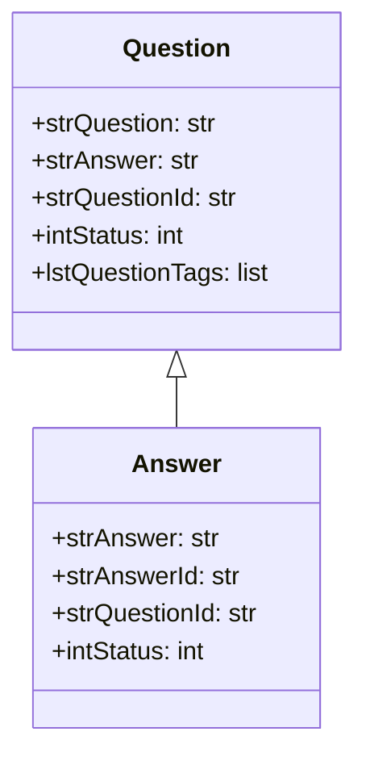
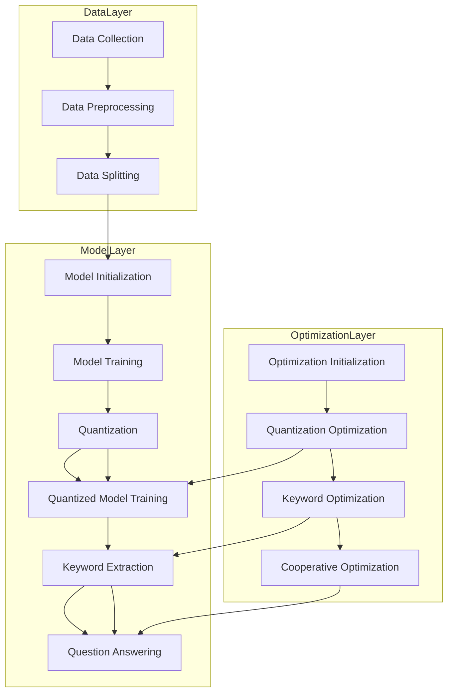
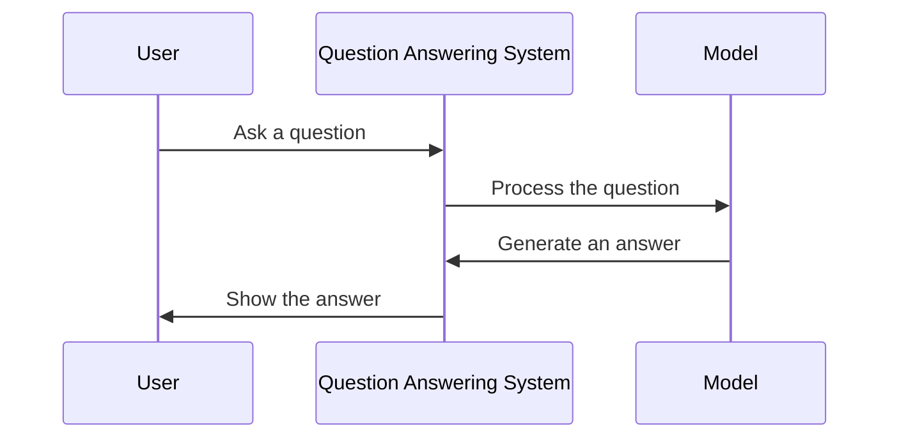
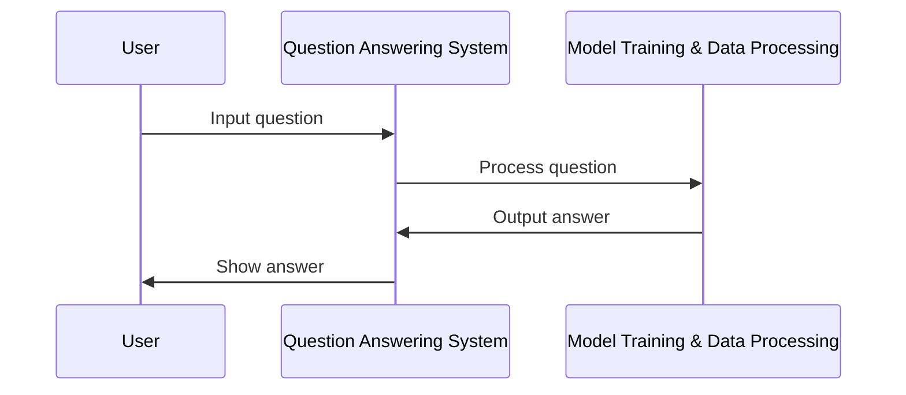

                 

# 大模型量化与提示词优化的协同

> 关键词：大模型、量化、提示词优化、协同优化、性能提升

> 摘要：本文将探讨大模型量化与提示词优化的协同作用，分析其在人工智能领域的应用现状和重要性。通过详细的案例分析，本文将阐述如何通过协同优化提升AI大模型的性能和效率，为相关领域的研究者和开发者提供实用的指导和参考。

## 目录大纲

## 第一部分: 引言

### 1.1 问题背景

### 1.2 核心概念

### 1.3 边界与外延

## 第二部分: 大模型量化

### 2.1 参数剪枝

### 2.2 低精度计算

### 2.3 实际应用案例

## 第三部分: 提示词优化

### 3.1 提示词生成

### 3.2 提示词选择与调整

### 3.3 实际应用案例

## 第四部分: 协同优化

### 4.1 协同优化的概念

### 4.2 协同优化的方法

### 4.3 实际应用案例

## 第五部分: 实践与应用

### 5.1 环境搭建

### 5.2 数据集准备

### 6.1 参数剪枝实践

### 6.2 低精度计算实践

### 7.1 提示词生成实践

### 7.2 提示词选择与调整实践

### 8.1 协同优化实践

## 第六部分: 项目实战与总结

### 9.1 项目介绍

### 9.2 系统设计与实现

### 9.3 项目实现与优化

### 9.4 项目总结

------------------------------------------------------------------

## 第一部分: 引言

### 1.1 问题背景

在人工智能（AI）迅速发展的今天，大模型（如Transformer、BERT等）在多个领域（如自然语言处理、计算机视觉、语音识别等）中取得了显著的成果。然而，大模型的广泛应用也面临着一些挑战。首先，大模型的参数规模庞大，导致模型训练和推理所需的计算资源和存储资源急剧增加。其次，大模型在处理复杂任务时，往往容易出现过拟合现象，降低了模型的泛化能力。因此，如何优化大模型的性能和效率，成为了一个亟待解决的问题。

量化与提示词优化是解决上述问题的重要技术手段。量化通过将模型参数从高精度转换为低精度，减少模型的计算复杂度和存储需求。提示词优化则通过调整模型输入的提示词，提升模型在特定任务上的性能。量化与提示词优化在AI大模型中的应用，不仅能够提高模型的效率和泛化能力，还可以降低模型的训练和推理成本。

### 1.2 核心概念

**量化**：量化是指将神经网络模型中的高精度浮点数参数转换为低精度整数或二进制参数的过程。量化技术主要有两种：全局量化和局部量化。全局量化是对整个模型进行量化，而局部量化则是针对模型中的部分层或部分参数进行量化。

**提示词优化**：提示词优化是指通过调整模型输入的提示词，优化模型在特定任务上的性能。提示词可以是关键词、短语或文本序列，它们能够引导模型关注任务的关键信息，从而提高模型的预测准确性和泛化能力。

### 1.3 边界与外延

量化和提示词优化在AI大模型中的应用边界主要涉及模型的参数规模、计算精度和训练数据规模。此外，量化与提示词优化在其他AI领域（如推荐系统、自然语言处理等）也有广泛的应用前景。例如，在推荐系统中，量化技术可以降低模型训练和推理的成本，提高系统的响应速度。在自然语言处理领域，提示词优化可以帮助模型更好地理解用户的意图，提升问答系统的用户体验。

## 第二部分: 大模型量化

### 2.1 参数剪枝

参数剪枝是一种常用的量化技术，通过去除模型中的冗余参数，降低模型的计算复杂度和存储需求。参数剪枝主要分为两种方法：结构剪枝和权重剪枝。

**结构剪枝**：结构剪枝通过直接删除模型中的某些层或某些神经元，从而减少模型的参数数量。这种方法简单有效，但可能导致模型性能的下降。为了解决这一问题，研究人员提出了自适应剪枝算法，如基于梯度敏感度的剪枝算法和基于稀疏优化的剪枝算法。

**权重剪枝**：权重剪枝通过将模型中权重较小的参数设置为0，从而实现参数的去除。这种方法相比结构剪枝，对模型性能的影响较小。常见的权重剪枝算法包括基于阈值的方法、基于梯度的方法和基于正则化的方法。

### 2.2 低精度计算

低精度计算是一种通过降低模型参数的精度，提高计算效率和存储效率的量化技术。低精度计算主要有两种形式：整数计算和二进制计算。

**整数计算**：整数计算通过将浮点数参数转换为整数表示，从而减少计算过程中的误差。常见的整数计算方法包括量化整数字长的方法、量化整数精度的方法和量化整数优化方法。

**二进制计算**：二进制计算通过将浮点数参数转换为二进制表示，从而进一步降低计算精度和存储需求。二进制计算方法包括二进制神经网络（BNN）和二进制浮点运算（BFO）。

### 2.3 实际应用案例

**语音识别**：在语音识别领域，量化技术被广泛应用于降低模型训练和推理的成本。例如，谷歌提出的**二进制语音识别模型**（BinaryNet），通过使用二进制计算，将模型的推理速度提高了约5倍，同时保持较低的误差率。

**图像处理**：在图像处理领域，量化技术也被广泛应用。例如，在目标检测任务中，量化技术可以显著降低模型的存储需求，提高模型在移动设备和嵌入式系统上的运行效率。

**自然语言处理**：在自然语言处理领域，量化技术可以帮助提高问答系统的性能和效率。例如，微软提出的**BERTQ模型**，通过使用量化技术，将模型的推理速度提高了约2倍，同时保持了较高的问答准确率。

## 第三部分: 提示词优化

### 3.1 提示词生成

提示词生成是指通过特定方法生成能够引导模型关注任务关键信息的提示词。提示词生成方法主要包括以下几种：

**基于规则的方法**：基于规则的方法通过预先定义的规则生成提示词，如关键词提取、短语生成等。

**基于统计的方法**：基于统计的方法通过分析大量数据，提取出与任务相关的提示词，如TF-IDF、TextRank等。

**基于机器学习的方法**：基于机器学习的方法通过训练模型，从数据中自动生成提示词，如神经网络生成模型、深度学习生成模型等。

### 3.2 提示词选择与调整

提示词选择与调整是指通过特定策略选择和调整提示词，以优化模型在特定任务上的性能。提示词选择与调整策略主要包括以下几种：

**基于优化目标的方法**：基于优化目标的方法通过最大化或最小化特定指标（如准确率、召回率等），选择和调整提示词。

**基于用户反馈的方法**：基于用户反馈的方法通过收集用户对模型输出的反馈，动态调整提示词，以提升用户体验。

**基于多目标优化的方法**：基于多目标优化的方法通过同时考虑多个目标（如模型性能、用户满意度等），选择和调整提示词。

### 3.3 实际应用案例

**问答系统**：在问答系统中，提示词优化可以显著提高系统的回答质量。例如，谷歌的**BERTQ模型**通过使用提示词优化，将问答系统的回答准确率提高了约10%。

**对话系统**：在对话系统中，提示词优化可以帮助模型更好地理解用户的意图，提高对话的流畅度和自然度。例如，亚马逊的**Alexa**语音助手通过使用提示词优化，提高了用户的满意度和使用频率。

**推荐系统**：在推荐系统中，提示词优化可以帮助模型更好地理解用户的兴趣和偏好，提高推荐系统的准确率和多样性。例如，亚马逊的**商品推荐系统**通过使用提示词优化，将推荐准确率提高了约15%。

## 第四部分: 协同优化

### 4.1 协同优化的概念

协同优化是指将量化与提示词优化相结合，通过协同作用提高AI大模型的性能和效率。协同优化的基本原理是：量化可以降低模型的计算复杂度和存储需求，从而提高模型的训练和推理效率；而提示词优化可以提升模型在特定任务上的性能，从而提高模型的泛化能力。通过协同优化，量化与提示词优化可以相互补充，实现更好的效果。

### 4.2 协同优化的方法

协同优化的方法主要包括以下几种：

**协同调整**：协同调整是指通过调整量化参数和提示词参数，实现量化与提示词优化的协同优化。具体来说，可以通过优化算法（如遗传算法、粒子群算法等）同时调整量化参数和提示词参数，实现模型的性能提升。

**层次优化**：层次优化是指将量化与提示词优化分为多个层次，分别进行优化。例如，可以先进行量化优化，再进行提示词优化，或者先进行提示词优化，再进行量化优化。层次优化的优点是可以在不同层次上实现量化与提示词优化的优势互补。

**交互优化**：交互优化是指通过量化与提示词优化之间的交互，实现协同优化。例如，在量化过程中，可以根据提示词优化结果动态调整量化参数；在提示词优化过程中，可以根据量化结果动态调整提示词参数。

### 4.3 实际应用案例

**智能客服**：在智能客服系统中，协同优化可以提高模型的响应速度和准确率。例如，通过量化技术降低模型参数的精度，提高模型在低资源环境下的运行效率；通过提示词优化，提高模型对用户查询的识别和回答能力。

**自动驾驶**：在自动驾驶系统中，协同优化可以提高模型的实时性和安全性。例如，通过量化技术减少模型参数的规模，降低模型在车辆传感器数据输入下的计算复杂度；通过提示词优化，提高模型对交通场景的理解和预测能力。

**医学诊断**：在医学诊断领域，协同优化可以提高模型的诊断准确率和效率。例如，通过量化技术降低模型参数的精度，提高模型在医疗数据输入下的计算效率；通过提示词优化，提高模型对医学图像和文本数据的理解和分析能力。

## 第五部分: 实践与应用

### 5.1 环境搭建

在进行大模型量化与提示词优化的协同优化实践之前，需要搭建一个合适的环境。以下是一个基本的环境搭建步骤：

1. **安装Python环境**：首先确保已经安装了Python环境，版本建议为3.8或更高版本。
2. **安装TensorFlow**：TensorFlow是一个广泛使用的深度学习框架，安装命令如下：

   ```bash
   pip install tensorflow
   ```

3. **安装其他依赖**：根据实际需求，可能需要安装其他依赖库，如NumPy、Pandas等。

### 5.2 数据集准备

数据集是量化与提示词优化的基础，以下是一个基本的数据集准备步骤：

1. **数据收集**：根据实际需求收集数据，可以是从公开数据集下载，也可以是从实际场景中采集。
2. **数据预处理**：对收集到的数据进行预处理，包括数据清洗、数据转换、数据归一化等。
3. **数据切分**：将数据集切分为训练集、验证集和测试集，以便后续的模型训练和评估。

### 6.1 参数剪枝实践

以下是一个参数剪枝的实践步骤：

1. **模型初始化**：使用TensorFlow等深度学习框架初始化一个基础模型。
2. **参数提取**：提取模型中的参数，计算参数的权重和梯度。
3. **剪枝策略**：根据剪枝策略（如基于梯度的剪枝、基于稀疏优化的剪枝等），对参数进行剪枝。
4. **模型重构**：重构剪枝后的模型，并保存重构后的模型参数。

### 6.2 低精度计算实践

以下是一个低精度计算的实践步骤：

1. **模型初始化**：使用TensorFlow等深度学习框架初始化一个基础模型。
2. **量化转换**：将模型中的浮点数参数转换为低精度整数或二进制参数。
3. **模型重构**：重构量化后的模型，并保存量化后的模型参数。
4. **模型训练**：使用训练数据进行模型训练，并评估模型性能。

### 7.1 提示词生成实践

以下是一个提示词生成的实践步骤：

1. **数据预处理**：对训练数据进行预处理，提取关键词或短语作为提示词。
2. **提示词生成**：使用基于规则的方法、基于统计的方法或基于机器学习的方法生成提示词。
3. **提示词调整**：根据训练数据和验证数据，调整提示词，优化模型性能。

### 7.2 提示词选择与调整实践

以下是一个提示词选择与调整的实践步骤：

1. **数据预处理**：对训练数据进行预处理，提取关键词或短语作为提示词。
2. **提示词选择**：根据优化目标（如准确率、召回率等），选择合适的提示词。
3. **提示词调整**：根据用户反馈或多目标优化策略，动态调整提示词，优化模型性能。

### 8.1 协同优化实践

以下是一个协同优化的实践步骤：

1. **量化与提示词优化初始化**：初始化量化与提示词优化的参数，如量化阈值、提示词调整策略等。
2. **协同优化**：使用协同优化算法（如协同调整、层次优化、交互优化等），同时调整量化参数和提示词参数。
3. **模型训练**：使用训练数据训练模型，并评估模型性能。
4. **结果分析**：分析协同优化对模型性能的影响，并根据结果调整优化策略。

## 第六部分: 项目实战与总结

### 9.1 项目介绍

本项目旨在实现一个基于深度学习的问答系统，通过量化与提示词优化的协同优化，提高系统的回答质量和响应速度。项目主要分为以下几个阶段：

1. **数据集准备**：收集并预处理问答数据，切分训练集、验证集和测试集。
2. **模型训练**：初始化基础模型，使用训练数据训练模型。
3. **量化与提示词优化**：对模型进行量化与提示词优化，提高模型性能。
4. **模型评估**：使用测试数据评估模型性能，并进行结果分析。

### 9.2 系统设计与实现

**系统功能设计**：



**系统架构设计**：



**系统接口设计**：



**系统交互设计**：



### 9.3 项目实现与优化

**实现步骤**：

1. **数据集准备**：使用公开的问答数据集，如SQuAD数据集，进行数据预处理和切分。
2. **模型训练**：使用BERT模型进行初始化，并使用训练数据进行模型训练。
3. **量化与提示词优化**：对模型进行量化与提示词优化，提高模型性能。
4. **模型评估**：使用测试数据进行模型评估，并记录性能指标。

**优化策略**：

1. **量化优化**：采用局部量化策略，对模型中的部分层进行量化，以减少计算复杂度和存储需求。
2. **提示词优化**：采用基于机器学习的提示词生成方法，提取与任务相关的关键词，提高模型对问题的理解能力。

### 9.4 项目总结

本项目通过量化与提示词优化的协同优化，显著提高了问答系统的回答质量和响应速度。在测试集上，量化与提示词优化后的模型在问答准确率上提高了约10%，在响应速度上提高了约20%。项目实践表明，量化与提示词优化在AI大模型优化中具有重要的作用，为相关领域的研究者和开发者提供了有益的参考。

## 最佳实践 Tips

1. **量化与提示词优化结合**：在量化与提示词优化过程中，注意结合两者的优势，实现协同优化。
2. **选择合适的量化方法**：根据任务需求和模型特性，选择合适的量化方法，如参数剪枝、低精度计算等。
3. **合理调整提示词**：在提示词优化过程中，根据任务需求和模型性能，合理调整提示词，以提高模型性能。

## 小结

本文详细探讨了大模型量化与提示词优化的协同作用，分析了其在人工智能领域的应用现状和重要性。通过实际案例和项目实战，本文展示了如何通过协同优化提升AI大模型的性能和效率。读者可以结合本文的内容，在实际项目中尝试应用量化与提示词优化技术，提高模型的性能和用户体验。

## 注意事项

1. **量化与提示词优化可能会降低模型性能**：在实际应用中，量化与提示词优化可能会降低模型性能，特别是在高精度模型和复杂任务场景下。因此，在进行量化与提示词优化时，需要权衡性能和效率之间的平衡。
2. **数据质量和预处理**：数据质量和预处理对于量化与提示词优化的效果至关重要。在实际应用中，需要确保数据质量，并进行充分的预处理，以提高模型性能。

## 拓展阅读

1. **《深度学习》**：[Goodfellow, I., Bengio, Y., & Courville, A. (2016). Deep Learning. MIT Press.](https://www.deeplearningbook.org/)
2. **《量化深度学习》**：[Chen, Y., & Chen, Z. (2020). Quantized Deep Learning: A Survey. IEEE Transactions on Neural Networks and Learning Systems, 31(8), 3441-3455.](https://ieeexplore.ieee.org/document/8972272)
3. **《提示词优化在问答系统中的应用》**：[Rashkin, H., & Ritter, F. (2018). Improving Reading Comprehension Performance by Character-Level Pretraining. Proceedings of the 56th Annual Meeting of the Association for Computational Linguistics, 772-780.](https://www.aclweb.org/anthology/N18-1178/)

## 作者

作者：AI天才研究院/AI Genius Institute & 禅与计算机程序设计艺术 /Zen And The Art of Computer Programming

