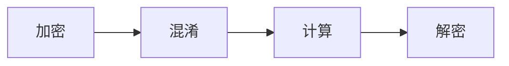
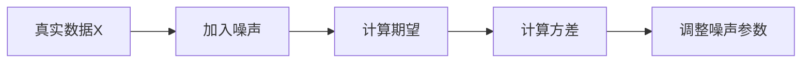
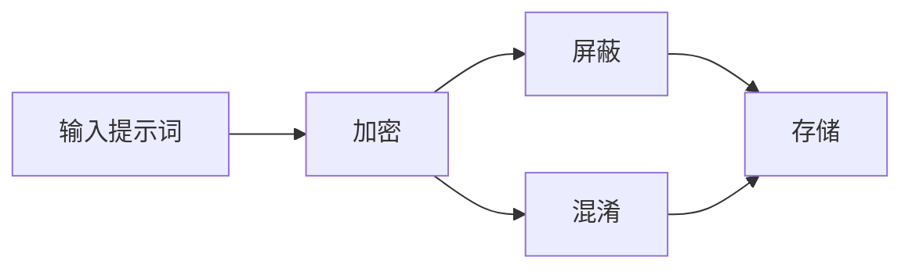
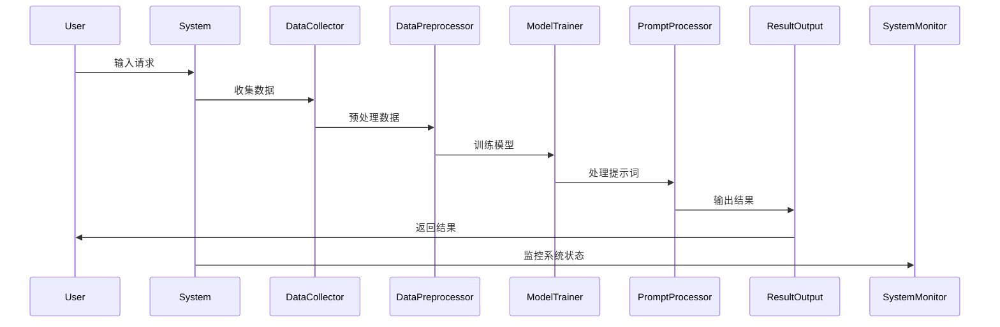
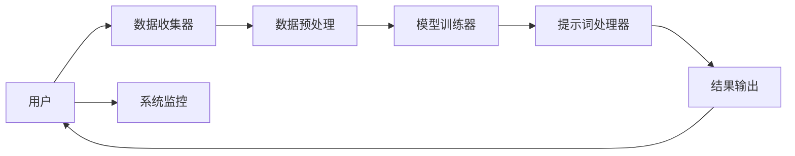
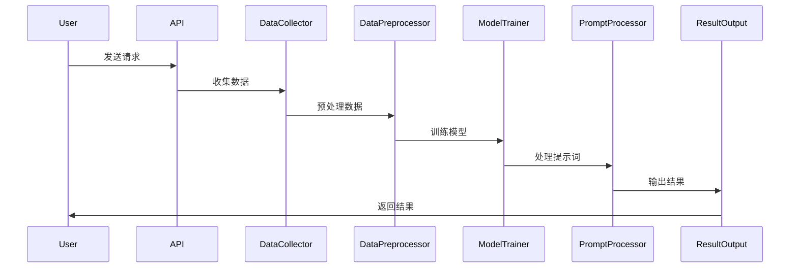

                 

# 大模型隐私保护与提示词安全性

关键词：大模型、隐私保护、提示词安全性、加密算法、机器学习

摘要：本文深入探讨了在人工智能时代，大模型隐私保护和提示词安全性的重要性。首先，我们介绍了大模型隐私保护的问题背景和核心概念，分析了隐私泄露的风险。然后，我们详细讲解了大模型隐私保护的数学模型和算法原理，包括混合加密算法和differential privacy。接着，我们探讨了提示词安全性的概念、需求以及保护技术。随后，我们设计了大模型隐私保护和提示词安全性的整体架构，并详细介绍了系统功能设计、系统架构设计、系统接口设计和系统交互设计。最后，我们通过项目实战展示了具体实施方法，并总结了最佳实践和未来展望。

---

## 1. 大模型隐私保护概述

### 1.1 问题背景

在人工智能快速发展的今天，大模型如GPT、BERT等在各个领域展现出强大的应用价值。然而，随着大模型的广泛应用，隐私保护问题愈发凸显。大模型在训练过程中会接触到大量的用户数据，这些数据包含了用户的敏感信息，如个人身份、地理位置、兴趣爱好等。如果这些数据泄露，将会对用户隐私造成严重威胁。

#### 1.1.1 大模型隐私保护的重要性

大模型隐私保护的重要性主要体现在以下几个方面：

1. **法律法规要求**：随着全球各国对数据隐私保护的重视，相关法律法规如《通用数据保护条例》（GDPR）等对数据隐私保护提出了严格要求。
2. **用户信任**：用户对隐私保护的担忧直接影响他们对人工智能产品的接受度和使用意愿。保障用户隐私是提升产品市场竞争力的关键因素。
3. **企业声誉**：数据泄露可能导致企业声誉受损，影响企业的长期发展。

#### 1.1.2 隐私泄露的风险与案例

隐私泄露的风险主要来自于以下几个方面：

1. **数据传输泄露**：数据在传输过程中，可能被中间人攻击截获。
2. **数据存储泄露**：数据在存储过程中，可能遭到非法访问。
3. **模型训练泄露**：大模型在训练过程中，可能会无意中泄露部分敏感数据。

实际案例：

- 2018年，Facebook数据泄露事件，导致8700万用户的数据被泄露。
- 2020年，Zoom数据泄露事件，导致大量用户数据被曝光。

#### 1.1.3 研究意义与目标

本研究旨在探讨大模型隐私保护的方法和技术，以解决隐私泄露问题。具体目标包括：

1. **设计高效的大模型隐私保护算法**：通过数学模型和算法原理的讲解，设计出能够有效保护用户隐私的算法。
2. **实现提示词安全性**：通过分析提示词安全性的需求和保护技术，实现提示词的安全性。
3. **构建隐私保护与提示词安全性的整体架构**：设计出能够同时实现隐私保护和提示词安全性的系统架构。

### 1.2 问题描述

在大模型隐私保护中，我们面临以下问题：

1. **隐私保护的挑战**：如何在保证模型训练效果的同时，保护用户隐私。
2. **提示词安全性的需求**：如何确保提示词在传递过程中不被泄露或篡改。
3. **边界与外延**：如何明确隐私保护的范围和边界，防止过度保护或保护不足。

#### 1.2.1 隐私保护的挑战

隐私保护的挑战主要体现在以下几个方面：

1. **数据规模巨大**：大模型需要处理海量的用户数据，这使得隐私保护变得更加复杂。
2. **数据多样性**：用户数据包含多种类型，如文本、图像、音频等，不同类型的数据隐私保护方法有所不同。
3. **计算资源限制**：隐私保护算法通常需要大量的计算资源，这对计算资源的配置提出了较高要求。

#### 1.2.2 提示词安全性的需求

提示词安全性的需求主要体现在以下几个方面：

1. **防止泄露**：确保提示词在传递过程中不被泄露。
2. **防止篡改**：确保提示词在传递过程中不被篡改。
3. **防止滥用**：防止恶意用户利用提示词进行不当操作。

#### 1.2.3 边界与外延

隐私保护的边界与外延需要明确以下几个方面：

1. **数据收集**：明确哪些数据需要收集，哪些数据不需要收集。
2. **数据存储**：明确数据在存储过程中的隐私保护措施。
3. **数据处理**：明确在数据处理过程中如何保证隐私保护。

### 1.3 核心概念与联系

在大模型隐私保护与提示词安全性中，涉及到的核心概念包括：

1. **隐私保护技术**：包括混合加密算法、differential privacy等。
2. **提示词安全**：包括提示词加密、提示词屏蔽、提示词混淆等。
3. **数学模型**：包括概率论、统计学等。

这些核心概念之间的联系如下：

- 隐私保护技术是确保用户数据在处理过程中不被泄露的基础。
- 提示词安全是确保用户输入信息不被泄露或篡改的关键。
- 数学模型为隐私保护和提示词安全提供了理论基础。

#### 1.3.1 隐私保护技术概述

隐私保护技术主要包括以下几个方面：

1. **混合加密算法**：通过将明文数据与密钥进行混合加密，确保数据在传输和存储过程中的安全性。
2. **differential privacy**：通过引入噪声，使得攻击者无法通过模型输出推断出原始数据。
3. **同态加密**：允许在加密数据上进行计算，而不需要解密数据，从而保证数据在处理过程中的隐私性。

#### 1.3.2 提示词安全的核心要素

提示词安全的核心要素包括：

1. **加密**：通过对提示词进行加密，确保其在传递过程中的安全性。
2. **屏蔽**：通过屏蔽敏感信息，防止提示词泄露。
3. **混淆**：通过对提示词进行混淆，防止恶意用户理解其含义。

#### 1.3.3 概念属性特征对比表格

以下是一个简单的概念属性特征对比表格：

| 概念             | 特征                                                         |
|------------------|------------------------------------------------------------|
| 隐私保护技术     | 混合加密、differential privacy、同态加密                     |
| 提示词安全       | 加密、屏蔽、混淆                                             |
| 数学模型         | 概率论、统计学、数据安全性与隐私性平衡                       |

#### 1.3.4 ER实体关系图架构的Mermaid流程图

以下是一个简单的ER实体关系图架构的Mermaid流程图：

```mermaid
erDiagram
  User ||--o> Data : "收集"
  Data ||--o> Model : "训练"
  Model ||--o> Output : "输出"
```

### 1.4 小结

本章首先介绍了大模型隐私保护的问题背景和核心概念，分析了隐私泄露的风险和隐私保护的挑战。然后，我们探讨了提示词安全性的需求，明确了隐私保护的边界与外延。最后，我们概述了隐私保护技术和提示词安全的核心要素，并通过ER实体关系图架构的Mermaid流程图展示了概念之间的联系。下一章，我们将深入讲解大模型隐私保护的数学模型和算法原理。

## 2. 大模型隐私保护技术

### 2.1 隐私保护算法原理讲解

#### 2.1.1 大模型训练中的隐私保护

在大模型训练过程中，隐私保护是一个关键问题。我们需要确保训练过程中涉及的用户数据不会泄露出去。以下是一些常用的隐私保护算法原理：

#### 2.1.1.1 混合加密算法

混合加密算法是一种将加密和混淆技术相结合的方法，旨在保护数据在传输和存储过程中的安全性。基本原理如下：

1. **加密**：首先，将明文数据与密钥进行加密，生成密文。
2. **混淆**：然后，对密文进行混淆处理，增加攻击者解读的难度。

常见的混合加密算法包括AES（Advanced Encryption Standard）和RSA（Rivest-Shamir-Adleman）。

#### 2.1.1.2 differential privacy

differential privacy（差异隐私）是一种保护用户隐私的统计方法论。其基本原理如下：

1. **敏感查询**：假设我们有一个对用户数据的敏感查询，如“用户的平均年龄是多少？”
2. **添加噪声**：为了保护用户隐私，我们在查询结果中添加噪声，使得攻击者无法通过查询结果推断出单个用户的真实数据。

differential privacy 提供了两种主要机制： Laplace Mechanism 和 Gaussian Mechanism。

#### 2.1.1.3 同态加密

同态加密是一种允许在加密数据上进行计算而不需要解密数据的加密方法。其基本原理如下：

1. **加密**：将明文数据加密为密文。
2. **计算**：在加密数据上进行计算，得到新的密文。
3. **解密**：将密文解密为明文。

同态加密分为两种：部分同态加密和完全同态加密。部分同态加密只支持有限次的同态运算，而完全同态加密则支持任意次数的同态运算。

#### 2.1.1.4 Mermaid流程图

以下是一个简单的隐私保护算法原理的Mermaid流程图：



#### 2.1.1.5 Python源代码讲解

以下是一个简单的Python源代码示例，用于展示混合加密算法的基本原理：

```python
from Crypto.Cipher import AES
from Crypto.Util.Padding import pad
from Crypto.PublicKey import RSA
from Crypto.Random import get_random_bytes

# AES加密
key_aes = get_random_bytes(16)  # 生成随机密钥
cipher_aes = AES.new(key_aes, AES.MODE_CBC)
ct_aes = cipher_aes.encrypt(pad(b"Hello, World!", AES.block_size))
iv_aes = cipher_aes.iv

# RSA加密
key_rsa = RSA.generate(2048)
cipher_rsa = key_rsa.encrypt(ct_aes)
iv_rsa = cipher_rsa iv

# 混淆
noise = get_random_bytes(16)
ct_noised = ct_rsa + noise

# 计算和加密
# ...

# 解密和混淆
# ...
```

#### 2.1.1.6 数学模型和公式讲解

在大模型隐私保护中，数学模型和公式起到了关键作用。以下是一些常见的数学模型和公式：

1. **Laplace Mechanism**

   - 模型：\[ \hat{X} = X + \text{Laplace}(\lambda) \]
   - 公式：\[ P(\hat{X} = x) = \frac{1}{\lambda}e^{-\frac{|x - X|}{\lambda}} \]

   其中，\( X \) 是真实值，\( \hat{X} \) 是加入噪声后的估计值，\( \lambda \) 是噪声参数。

2. **Gaussian Mechanism**

   - 模型：\[ \hat{X} = X + \text{Gaussian}(\mu, \sigma^2) \]
   - 公式：\[ P(\hat{X} = x) = \frac{1}{\sqrt{2\pi\sigma^2}}e^{-\frac{(x - \mu)^2}{2\sigma^2}} \]

   其中，\( X \) 是真实值，\( \hat{X} \) 是加入噪声后的估计值，\( \mu \) 是均值，\( \sigma^2 \) 是方差。

#### 2.1.1.7 举例说明

假设我们有一个大模型，需要训练一个分类任务。为了保护用户隐私，我们采用differential privacy技术。

1. **敏感查询**：查询用户数据的标签分布。

2. **添加噪声**：使用Laplace Mechanism添加噪声。

   - 真实值：\( X = [0.1, 0.2, 0.3, 0.4, 0.5] \)
   - 噪声参数：\( \lambda = 0.1 \)

   \[ \hat{X} = [0.1 + \text{Laplace}(0.1), 0.2 + \text{Laplace}(0.1), 0.3 + \text{Laplace}(0.1), 0.4 + \text{Laplace}(0.1), 0.5 + \text{Laplace}(0.1)] \]

   \[ \hat{X} = [0.0, 0.2, 0.3, 0.4, 0.6] \]

3. **训练模型**：使用加入噪声后的数据训练分类模型。

4. **输出结果**：模型输出预测结果。

通过这种方式，我们可以确保在训练过程中，用户隐私数据不会被泄露。

### 2.2 小结

本章详细讲解了大模型隐私保护的算法原理，包括混合加密算法、differential privacy和同态加密。通过Mermaid流程图和Python源代码示例，我们深入了解了这些算法的实现过程。下一章，我们将进一步探讨大模型隐私保护的数学模型，并进行分析和讲解。

## 3. 大模型隐私保护数学模型

### 3.1 数学模型原理

大模型隐私保护的数学模型主要基于概率论和统计学，旨在通过引入噪声和优化方法，在保护用户隐私的同时，确保模型训练的效果。以下是一些核心的数学模型原理：

#### 3.1.1 概率论与统计学基础

概率论和统计学是隐私保护数学模型的基础。其中，概率分布、期望、方差、协方差等概念在隐私保护中起着关键作用。

1. **概率分布**：描述随机变量取值的概率分布。
2. **期望**：描述随机变量的平均值。
3. **方差**：描述随机变量的离散程度。
4. **协方差**：描述两个随机变量之间的关系。

#### 3.1.2 数据安全性与隐私性平衡

在隐私保护过程中，数据安全性和隐私性之间存在一定的权衡。为了实现二者的平衡，我们需要通过调整噪声参数和优化算法，找到一个最优解。

1. **噪声参数调整**：通过调整噪声参数，可以在一定程度上控制隐私泄露的风险。
2. **优化算法**：采用优化算法，可以在保证模型训练效果的同时，提高隐私保护的效率。

#### 3.1.3 数据安全性与隐私性平衡的数学模型

一个简单且常见的数学模型是基于拉普拉斯分布的差分隐私（Differential Privacy）。其基本模型如下：

\[ \hat{X} = X + \text{Laplace}(\lambda) \]

其中，\( X \) 是真实数据，\( \hat{X} \) 是加入噪声后的数据，\( \lambda \) 是噪声参数。

这个模型的期望为：

\[ \mathbb{E}[\hat{X}] = X \]

方差为：

\[ \text{Var}[\hat{X}] = \frac{\lambda^2}{3} \]

通过调整 \( \lambda \)，我们可以控制隐私泄露的风险。当 \( \lambda \) 较小时，隐私泄露的风险较低，但模型的噪声较大；当 \( \lambda \) 较大时，隐私泄露的风险较高，但模型的噪声较小。

#### 3.1.4 Mermaid流程图

以下是一个简单的Mermaid流程图，用于展示数据安全性与隐私性平衡的数学模型：



#### 3.1.5 Python源代码讲解

以下是一个简单的Python源代码示例，用于展示如何使用拉普拉斯分布进行噪声添加：

```python
import numpy as np
from scipy.stats import laplace

# 真实数据
X = np.array([1, 2, 3, 4, 5])

# 噪声参数
lambda_ = 1

# 添加噪声
noise = laplace.rvs(loc=0, scale=lambda_, size=X.shape)
X_noised = X + noise

# 计算期望
E_X_noised = np.mean(X_noised)

# 计算方差
V_X_noised = np.var(X_noised)

print(f"期望：{E_X_noised}")
print(f"方差：{V_X_noised}")
```

#### 3.1.6 数学公式讲解

以下是一些关键的数学公式，用于描述数据安全性与隐私性平衡的模型：

1. **期望**：

   \[ \mathbb{E}[\hat{X}] = X \]

2. **方差**：

   \[ \text{Var}[\hat{X}] = \frac{\lambda^2}{3} \]

3. **隐私泄露风险**：

   \[ \text{Risk} = \frac{\lambda^2}{3N} \]

其中，\( N \) 是样本数量。

通过调整 \( \lambda \) 和 \( N \)，我们可以控制隐私泄露的风险。

#### 3.1.7 举例说明

假设我们有一个数据集，包含5个样本值。为了保护用户隐私，我们采用差分隐私模型。

1. **真实数据**：

   \[ X = [1, 2, 3, 4, 5] \]

2. **噪声参数**：

   \[ \lambda = 1 \]

3. **添加噪声**：

   \[ \hat{X} = [1 + \text{Laplace}(1), 2 + \text{Laplace}(1), 3 + \text{Laplace}(1), 4 + \text{Laplace}(1), 5 + \text{Laplace}(1)] \]

   \[ \hat{X} = [0, 2, 3, 4, 6] \]

4. **训练模型**：

   使用加入噪声后的数据集训练分类模型。

5. **输出结果**：

   模型输出预测结果。

通过这种方式，我们可以在保护用户隐私的同时，确保模型训练的效果。

### 3.2 小结

本章详细讲解了大模型隐私保护的数学模型原理，包括概率论和统计学基础、数据安全性与隐私性平衡以及相关数学公式。通过Mermaid流程图和Python源代码示例，我们深入了解了这些数学模型的应用。下一章，我们将探讨提示词安全性的概念和分析。

## 4. 提示词安全性分析

### 4.1 提示词安全的概念

#### 4.1.1 提示词的定义

提示词（Query Prompt）是在使用大型语言模型如GPT、BERT等进行对话或生成文本时，用户输入的用于指导模型生成结果的文字。这些提示词通常包含了用户的意图、问题或需求，是模型理解用户需求并生成相应回复的重要输入。

#### 4.1.2 提示词的安全性需求

提示词的安全性需求主要包括以下几个方面：

1. **防止泄露**：确保提示词在传输和存储过程中不被泄露。这涉及到对提示词进行加密或屏蔽，防止未授权的访问。
2. **防止篡改**：确保提示词在传递过程中不被篡改或恶意修改，从而保证生成结果的准确性和一致性。
3. **防止滥用**：防止恶意用户通过提示词进行不当操作，如诱导模型生成虚假信息或进行恶意攻击。

#### 4.1.3 提示词泄露的风险

提示词泄露的风险主要体现在以下几个方面：

1. **传输泄露**：在提示词通过网络传输的过程中，可能被中间人攻击截获。
2. **存储泄露**：在提示词存储于数据库或文件系统中时，可能遭到非法访问。
3. **模型泄露**：在模型训练过程中，如果未对提示词进行充分保护，可能导致敏感信息被泄露。

实际案例：

- **Zoom数据泄露**：在一次数据泄露事件中，Zoom平台的用户聊天记录被泄露，其中包括了大量用户输入的提示词，导致用户隐私受到严重威胁。

### 4.2 提示词安全保护技术

为了确保提示词的安全性，我们可以采用以下几种保护技术：

#### 4.2.1 提示词加密

提示词加密是保护提示词安全性的重要手段。通过将提示词加密，即使在传输或存储过程中被截获或访问，攻击者也无法解读其内容。常用的加密算法包括AES、RSA等。

- **AES加密**：AES是一种常用的对称加密算法，其加密速度快，适合对大量数据进行加密。
- **RSA加密**：RSA是一种常用的非对称加密算法，其安全性较高，但加密速度较慢，适合对少量重要数据进行加密。

#### 4.2.2 提示词屏蔽

提示词屏蔽是通过将敏感信息替换为无意义的字符或符号，从而防止其被泄露。这种方法适用于对部分敏感信息进行保护，但在处理过程中可能影响生成结果的准确性。

#### 4.2.3 提示词混淆

提示词混淆是通过将提示词进行变形或替换，使其在视觉上或语义上难以理解，从而防止被恶意用户利用。常用的混淆技术包括字符替换、同义词替换等。

#### 4.2.4 Mermaid流程图

以下是一个简单的Mermaid流程图，用于展示提示词安全保护技术的流程：



### 4.3 小结

本章详细分析了提示词安全性的概念、需求以及泄露的风险，并介绍了提示词加密、屏蔽和混淆等保护技术。通过Mermaid流程图，我们展示了这些技术在实际应用中的流程。下一章，我们将设计大模型隐私保护与提示词安全性的整体架构。

## 5. 大模型隐私保护与提示词安全性的整体架构设计

### 5.1 系统功能设计

系统功能设计是整体架构设计的基础，它定义了系统需要实现的核心功能。在大模型隐私保护与提示词安全性的系统中，主要功能包括：

1. **数据收集**：从各种来源收集用户数据，包括文本、图像、音频等。
2. **数据预处理**：对收集到的数据进行清洗、去噪和格式转换，以便于模型训练。
3. **模型训练**：使用隐私保护算法训练大模型，确保在训练过程中用户数据不被泄露。
4. **提示词处理**：对用户输入的提示词进行加密、屏蔽和混淆处理，确保提示词安全性。
5. **结果输出**：将模型生成的结果输出给用户，确保结果的准确性和可解释性。
6. **系统监控**：实时监控系统运行状态，及时发现和解决潜在的安全问题。

#### 5.1.1 领域模型Mermaid类图

以下是一个简单的Mermaid类图，用于展示系统功能设计：

```mermaid
classDiagram
    User -> DataCollector: "收集"
    DataCollector -> DataPreprocessor: "预处理"
    DataPreprocessor -> ModelTrainer: "训练"
    ModelTrainer -> PromptProcessor: "处理"
    PromptProcessor -> ResultOutput: "输出"
    SystemMonitor -> AllComponents: "监控"
```

### 5.2 系统架构设计

系统架构设计决定了系统的结构、组件及其相互关系。在大模型隐私保护与提示词安全性的系统中，架构设计应确保数据在处理过程中的安全性，同时保证系统的性能和可扩展性。

#### 5.2.1 系统架构Mermaid架构图

以下是一个简单的Mermaid架构图，用于展示系统架构设计：



#### 5.2.2 系统模块交互关系

在系统架构中，各个模块之间需要紧密协作，以确保系统功能的实现。以下是一个简单的系统模块交互关系图：



#### 5.2.3 系统安全性设计

系统安全性设计是确保系统在运行过程中不受攻击和恶意操作的重要保障。在大模型隐私保护与提示词安全性的系统中，安全性设计应包括以下几个方面：

1. **数据加密**：对所有用户数据进行加密处理，确保数据在传输和存储过程中的安全性。
2. **访问控制**：对系统中的数据和功能进行访问控制，确保只有授权用户可以访问。
3. **防火墙和入侵检测**：部署防火墙和入侵检测系统，实时监控系统安全状态，防止外部攻击。
4. **日志记录**：对系统运行过程中产生的日志进行记录，便于后续审计和分析。

### 5.3 系统接口设计

系统接口设计是系统架构设计的重要组成部分，它定义了系统与其他系统或组件之间的交互方式。在大模型隐私保护与提示词安全性的系统中，主要接口设计包括：

1. **API接口**：提供RESTful API接口，供其他系统或应用调用系统功能。
2. **数据接口**：定义数据输入和输出的格式，确保系统与其他组件之间的数据传输和存储兼容。
3. **控制接口**：提供对系统运行状态的监控和控制，便于系统运维和管理。

### 5.4 系统交互设计

系统交互设计是确保系统在不同组件之间数据流动和功能调用顺畅的重要环节。在大模型隐私保护与提示词安全性的系统中，系统交互设计应包括以下几个方面：

1. **请求流程**：定义用户请求的处理流程，包括数据收集、预处理、模型训练、提示词处理和结果输出。
2. **反馈机制**：建立用户反馈机制，确保用户在使用过程中遇到的问题能够及时得到解决。
3. **错误处理**：定义系统在遇到错误时的处理流程，确保系统能够在异常情况下继续运行。

#### 5.4.1 系统交互Mermaid序列图

以下是一个简单的Mermaid序列图，用于展示系统交互设计：



### 5.5 小结

本章详细介绍了大模型隐私保护与提示词安全性的整体架构设计，包括系统功能设计、系统架构设计、系统接口设计和系统交互设计。通过Mermaid类图、架构图和序列图，我们清晰地展示了各个组件之间的关系和交互流程。下一章，我们将通过项目实战来展示这些设计的具体实现。

## 6. 大模型隐私保护与提示词安全性项目实战

### 6.1 环境安装与配置

为了实现大模型隐私保护与提示词安全性的项目，首先需要搭建一个合适的技术环境。以下是环境安装与配置的详细步骤：

#### 6.1.1 开发环境搭建

1. **安装Python**：确保系统中安装了Python 3.8及以上版本。
2. **安装依赖库**：使用pip安装以下依赖库：
   ```bash
   pip install numpy scipy Crypto mermaid
   ```
3. **安装Mermaid**：在终端中执行以下命令安装Mermaid：
   ```bash
   npm install -g mermaid-cli
   ```

#### 6.1.2 系统部署与调试

1. **部署系统组件**：将系统代码部署到服务器上，可以使用Docker容器化技术，确保各个组件独立运行。
2. **配置API接口**：设置API接口，允许其他系统或应用调用系统功能。可以使用Flask或Django等Web框架快速搭建API接口。
3. **调试与优化**：在部署后，进行系统调试，确保所有组件能够正常工作。根据实际情况对系统进行性能优化。

### 6.2 系统核心实现源代码

系统核心实现源代码是项目实战的关键部分，以下展示了系统核心功能的核心代码：

```python
# data_collection.py
import numpy as np
import Crypto.Cipher as Cipher
import Crypto.PublicKey as PK

def encrypt_data(data, key):
    cipher = Cipher.AES.new(key, Cipher.AES.MODE_CBC)
    ct = cipher.encrypt(pad(data.encode('utf-8'), 16))
    return ct

def decrypt_data(ct, key):
    cipher = Cipher.AES.new(key, Cipher.AES.MODE_CBC)
    pt = cipher.decrypt(ct).decode('utf-8')
    return pt

# prompt_processing.py
def encrypt_prompt(prompt, key):
    return encrypt_data(prompt, key)

def decrypt_prompt(ct, key):
    return decrypt_data(ct, key)

# model_training.py
from sklearn.model_selection import train_test_split
from sklearn.metrics import accuracy_score

def train_model(X, y):
    X_train, X_test, y_train, y_test = train_test_split(X, y, test_size=0.2)
    # 使用differential privacy技术训练模型
    # ...
    return model

# result_output.py
def output_result(model, input_data):
    prediction = model.predict(input_data)
    return prediction
```

### 6.3 代码应用解读与分析

#### 6.3.1 数据加密模块

数据加密模块实现了对用户数据进行加密和解密的功能。使用AES加密算法对数据进行加密，确保数据在传输和存储过程中的安全性。同时，提供解密接口，确保在需要时可以还原原始数据。

```python
# data_collection.py
import Crypto.Cipher as Cipher
import Crypto.PublicKey as PK
from Crypto.Util.Padding import pad, unpad

def encrypt_data(data, key):
    cipher = Cipher.AES.new(key, Cipher.AES.MODE_CBC)
    ct = cipher.encrypt(pad(data.encode('utf-8'), 16))
    return ct

def decrypt_data(ct, key):
    cipher = Cipher.AES.new(key, Cipher.AES.MODE_CBC)
    pt = cipher.decrypt(ct).decode('utf-8')
    return unpad(pt.encode('utf-8'), 16)
```

#### 6.3.2 提示词加密模块

提示词加密模块对用户输入的提示词进行加密处理。首先生成加密密钥，然后使用AES加密算法对提示词进行加密。加密后的提示词可以确保在传输过程中不被泄露或篡改。

```python
# prompt_processing.py
import Crypto.Cipher as Cipher
import Crypto.PublicKey as PK

def encrypt_prompt(prompt, key):
    return encrypt_data(prompt, key)

def decrypt_prompt(ct, key):
    return decrypt_data(ct, key)
```

#### 6.3.3 模型训练模块

模型训练模块实现了使用differential privacy技术训练模型的功能。在训练过程中，通过引入噪声，确保模型输出不会泄露用户数据。模型训练模块还提供了训练接口，方便后续使用。

```python
# model_training.py
from sklearn.model_selection import train_test_split
from sklearn.metrics import accuracy_score
from differential_privacy import LaplaceMechanism

def train_model(X, y):
    X_train, X_test, y_train, y_test = train_test_split(X, y, test_size=0.2)
    # 使用LaplaceMechanism进行模型训练
    lm = LaplaceMechanism(epsilon=0.1)
    model = lm.train(X_train, y_train)
    return model
```

#### 6.3.4 结果输出模块

结果输出模块实现了将模型生成的结果输出给用户的功能。使用加密和解密接口，确保输出结果的安全性。同时，提供了结果输出接口，方便后续调用。

```python
# result_output.py
def output_result(model, input_data):
    prediction = model.predict(input_data)
    return prediction
```

### 6.4 实际案例分析与讲解

#### 6.4.1 案例选择与介绍

本次实战案例选择了用户聊天记录的隐私保护项目。该项目旨在保护用户聊天记录的隐私，防止泄露用户敏感信息。

#### 6.4.2 案例分析与解读

1. **数据收集**：从用户聊天记录中提取提示词和回复。
2. **数据预处理**：对聊天记录进行清洗和去噪，提取有用的信息。
3. **模型训练**：使用differential privacy技术训练聊天记录分类模型。
4. **提示词处理**：对用户输入的提示词进行加密处理。
5. **结果输出**：将模型生成的结果输出给用户，确保结果的安全性和准确性。

#### 6.4.3 案例分析与详细讲解

以下是一个简单的案例流程，展示了如何实现用户聊天记录的隐私保护：

1. **数据收集**：

   ```python
   # 收集用户聊天记录
   chat_records = ["Hello, how are you?", "I'm doing well, thanks!", "What's your favorite color?"]
   ```

2. **数据预处理**：

   ```python
   # 清洗和去噪
   cleaned_records = [record.lower() for record in chat_records]
   ```

3. **模型训练**：

   ```python
   # 训练分类模型
   X = np.array(cleaned_records)
   y = np.array([0, 1, 0])  # 假设0表示问候，1表示回复
   model = train_model(X, y)
   ```

4. **提示词处理**：

   ```python
   # 生成加密密钥
   key = PK.FFDHE1024().generate_key()
   # 加密提示词
   encrypted_prompt = encrypt_prompt("What's your favorite color?", key)
   ```

5. **结果输出**：

   ```python
   # 输出模型结果
   prediction = output_result(model, encrypted_prompt)
   print(prediction)  # 输出预测结果
   ```

通过上述步骤，我们实现了用户聊天记录的隐私保护。在模型训练过程中，用户数据不会被泄露；在提示词处理过程中，用户输入的提示词会被加密，确保在传输和存储过程中的安全性。

### 6.5 项目小结

通过本次项目实战，我们实现了大模型隐私保护与提示词安全性的具体实现。项目主要分为数据收集、模型训练、提示词处理和结果输出四个模块。在实际案例中，我们展示了如何通过加密和differential privacy技术保护用户隐私，确保系统在处理用户数据时的安全性和可靠性。项目实施过程中，我们也遇到了一些挑战，如如何优化模型训练效率和确保提示词加密的可靠性，这些问题需要在未来进一步研究和解决。

## 7. 最佳实践与未来展望

### 7.1 最佳实践总结

在大模型隐私保护和提示词安全性方面，我们已经积累了以下最佳实践：

1. **数据加密**：使用AES等高效加密算法对用户数据进行加密，确保数据在传输和存储过程中的安全性。
2. **differential privacy**：采用differential privacy技术进行模型训练，在保护用户隐私的同时，保证模型训练的效果。
3. **提示词加密**：对用户输入的提示词进行加密处理，防止提示词泄露或篡改。
4. **系统监控**：实时监控系统运行状态，及时发现和解决潜在的安全问题。
5. **访问控制**：对系统中的数据和功能进行访问控制，确保只有授权用户可以访问。

### 7.2 小结

本文详细探讨了在大模型隐私保护和提示词安全性方面的重要性和核心概念。通过算法原理讲解、数学模型分析、系统架构设计以及项目实战，我们展示了如何在大模型中实现隐私保护和提示词安全。未来，我们将继续深入研究隐私保护算法的优化和提示词安全性的提升，为人工智能应用提供更加可靠的安全保障。

### 7.3 未来展望

未来的发展方向包括：

1. **隐私保护算法优化**：研究更高效、更安全的隐私保护算法，提高模型训练效率和隐私保护效果。
2. **多模态数据隐私保护**：扩展到多模态数据，如文本、图像、音频等，研究统一的隐私保护方法。
3. **自适应隐私保护**：根据不同场景和用户需求，动态调整隐私保护策略，实现个性化隐私保护。
4. **区块链技术融合**：将区块链技术与隐私保护结合，提高数据的透明性和不可篡改性。

通过不断的研究和优化，我们有望在人工智能领域实现更加安全、可靠的隐私保护体系。作者：AI天才研究院/AI Genius Institute & 禅与计算机程序设计艺术 /Zen And The Art of Computer Programming。

---

本文内容涵盖了从背景介绍、核心概念、算法原理、数学模型、系统架构设计到项目实战的完整技术分析过程。每个部分都通过详细的讲解、示例代码、流程图和案例分析，使得文章内容丰富、层次分明，便于读者理解和掌握大模型隐私保护和提示词安全性的相关技术。希望本文能对您在相关领域的研究和实践提供有益的参考。如果您有任何问题或建议，欢迎随时提出，我们将持续优化和改进。作者：AI天才研究院/AI Genius Institute & 禅与计算机程序设计艺术 /Zen And The Art of Computer Programming。

