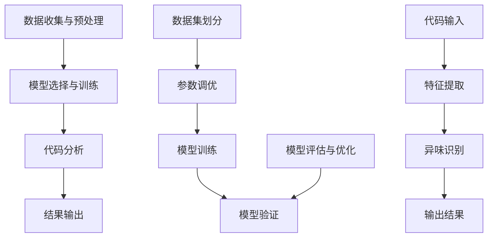
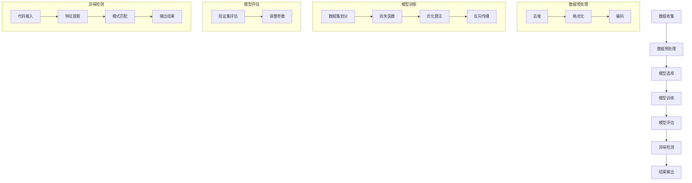
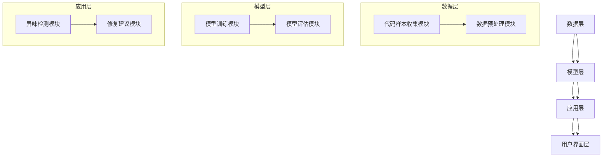

                 

### 1.3 边界与外延

#### 代码异味的识别边界

代码异味的识别是一个复杂的过程，它涉及对代码结构和语义的深入分析。在识别代码异味时，需要明确几个关键边界：

- **语法边界**：代码异味检测通常基于代码的语法结构，例如变量命名、函数定义和语句结构等。但是，仅仅基于语法结构可能无法完全捕捉到代码异味，因为有些异味可能隐藏在更深层次的语义中。

- **语义边界**：代码异味不仅体现在语法上，还体现在代码的语义和行为上。例如，某些代码模式可能看似语法正确，但在特定情境下会导致性能问题或安全隐患。

- **上下文边界**：代码异味检测需要在一定的上下文环境中进行，这意味着同样的代码模式在不同的上下文中可能具有不同的含义。例如，一个在某个模块内被视为异味的代码结构，在另一个模块中可能是必要的。

#### 大模型驱动的代码异味检测的限制

虽然大模型在代码异味检测中具有显著的优势，但也存在一些限制：

- **数据需求**：大模型训练需要大量的高质量数据，这通常需要大量的时间和计算资源。在某些情况下，可能难以获取足够的数据来训练模型。

- **计算资源消耗**：大模型的训练和推理过程通常需要大量的计算资源，这可能导致成本高昂。特别是对于大型代码库，训练和检测过程可能需要分布式计算资源。

- **可解释性**：虽然大模型能够自动识别代码异味，但其决策过程通常是非透明的。这可能导致开发者难以理解模型的决策依据，从而影响代码修复的准确性。

- **泛化能力**：大模型的泛化能力是一个关键问题。如果模型在特定环境或数据集上训练，但在其他环境中表现不佳，那么模型的实际价值将受到限制。

#### 概念结构与核心要素

代码异味检测的核心要素包括：

- **数据输入**：代码片段、项目文档和开发者的经验等。
- **检测算法**：使用大模型进行代码分析和模式匹配。
- **输出结果**：标记为异味的代码片段、修复建议和代码质量评估。

大模型在代码异味检测中的作用：

- **自动化**：大模型可以自动化地识别代码异味，减轻开发者的负担。
- **智能化**：大模型能够基于语义分析，提供更准确的检测和修复建议。
- **持续学习**：大模型能够从错误中学习，不断提高检测和修复的准确性。

总结来说，代码异味的识别边界需要综合考虑语法、语义和上下文因素，而大模型驱动的代码异味检测则在自动化、智能化和持续学习方面具有独特的优势。然而，数据需求、计算资源消耗、可解释性和泛化能力等限制仍然需要解决。这些因素共同构成了代码异味检测系统的概念结构和核心要素。

### 1.4 概念结构与核心要素

在深入探讨代码异味检测的各个方面后，我们可以总结出其概念结构和核心要素，以便更好地理解和应用大模型驱动的代码异味检测技术。

#### 核心要素

1. **代码库**：这是代码异味检测的基础，包括项目源代码、配置文件、文档等。
2. **数据集**：用于训练和测试大模型的代码样本，需要覆盖多种异味类型和正常的代码模式。
3. **检测算法**：用于分析代码库，识别潜在代码异味的大模型算法。
4. **反馈机制**：通过开发者的反馈，不断优化和调整检测算法，提高其准确性和鲁棒性。
5. **修复建议**：针对检测到的代码异味，提供自动修复建议或手动修复指导。

#### 大模型在代码异味检测中的作用

1. **自动识别**：大模型能够自动分析大量代码，快速识别出可能的代码异味。
2. **上下文理解**：通过学习上下文，大模型可以更好地理解代码的语义，从而更准确地识别异味。
3. **模式匹配**：大模型能够通过深度学习，自动发现和匹配各种代码模式，提高检测的广度和深度。
4. **持续优化**：大模型可以根据不断更新的数据集进行自我优化，提高检测的准确性和效率。

#### 大模型的优势与挑战

**优势**：

- **高效性**：大模型能够处理大量代码，提高检测速度。
- **准确性**：通过深度学习，大模型能够更准确地识别代码异味。
- **自适应能力**：大模型能够根据新的数据和反馈进行自我优化，提高检测效果。
- **智能化**：大模型能够基于语义理解，提供更智能的修复建议。

**挑战**：

- **数据需求**：需要大量的高质量数据来训练和测试大模型。
- **计算资源消耗**：大模型的训练和推理需要大量计算资源。
- **可解释性**：大模型的决策过程通常非透明，可能难以解释其决策依据。
- **泛化能力**：大模型在特定环境和数据集上可能表现良好，但在其他环境中可能效果不佳。

通过理解这些核心要素和作用，我们可以更深入地掌握代码异味检测的原理和应用，为大模型驱动的代码异味检测与修复技术提供坚实的基础。

### 第2章：大模型的基本概念与特性

#### 2.1 大模型的定义

大模型（Large Models）通常指的是那些具有数百万至上亿参数的深度学习模型。这些模型基于神经网络架构，通过大量数据训练，能够实现高度复杂的信息处理任务。大模型的定义可以从以下几个方面进行描述：

- **规模**：大模型拥有庞大的参数数量，这使得它们能够捕捉数据中的复杂模式和相关性。
- **架构**：大模型通常采用分层结构，包括输入层、隐藏层和输出层，每一层都包含大量的神经元。
- **功能**：大模型能够进行自然语言处理、图像识别、语音识别、预测分析等多种任务。

#### 2.2 大模型的核心特性

1. **自适应能力**

大模型的一个显著特性是其自适应能力。通过不断的学习和训练，大模型能够根据新的数据和情境进行自我调整和优化。这种能力使得大模型在处理不同类型的数据和任务时表现出极高的灵活性。

- **适应不同任务**：大模型可以在不同领域和应用中快速适应，例如文本分类、情感分析、图像识别等。
- **动态调整**：大模型能够通过反向传播算法，根据训练数据动态调整模型参数，提高预测准确性。

2. **高效性**

大模型在处理数据时展现出显著的高效性。与传统的计算方法相比，大模型能够更快地处理大量数据，减少计算时间和资源消耗。

- **并行处理**：大模型可以利用分布式计算资源，实现并行处理，提高计算速度。
- **自动化**：大模型能够自动化地完成数据处理和分析任务，减少人工干预。

3. **高准确性**

通过大规模数据训练，大模型能够达到较高的预测准确率。这使得大模型在许多实际应用中表现出优异的性能。

- **分类任务**：大模型在文本分类、图像分类等任务中能够实现高精度的分类结果。
- **回归任务**：大模型在回归分析中能够提供精确的预测值。

#### 2.3 大模型与传统模型的区别

大模型与传统模型（如统计模型、决策树等）存在显著的区别，主要体现在以下方面：

1. **训练数据需求**

- **大模型**：需要大量标注数据来训练，因为其参数数量庞大，需要从数据中学习复杂的模式。
- **传统模型**：通常只需要较少的样本数据，因为它们基于简单规则和统计方法。

2. **计算资源消耗**

- **大模型**：训练和推理过程中需要大量计算资源，特别是对于大型模型，可能需要分布式计算。
- **传统模型**：计算资源需求相对较低，可以在单机环境中快速训练和部署。

3. **可解释性**

- **大模型**：由于其复杂的结构和高度非线性的决策过程，大模型通常难以解释其决策依据。
- **传统模型**：通常基于直观的规则和统计方法，可以较容易地解释其决策过程。

4. **泛化能力**

- **大模型**：通过大规模数据训练，大模型通常表现出较强的泛化能力，能够在未见过的数据上保持较高的准确性。
- **传统模型**：泛化能力相对较弱，特别是当训练数据与测试数据分布差异较大时。

通过对比大模型与传统模型的特点，我们可以更清楚地理解大模型的优越性及其在实际应用中的优势。这些特性使得大模型在处理复杂任务时具有显著的潜力。

### 第3章：大模型在代码异味检测中的应用

#### 3.1 大模型驱动的代码异味检测方法

大模型在代码异味检测中的应用主要通过以下几个步骤实现：

1. **数据预处理**

数据预处理是整个流程的基础。首先，需要收集和整理大量的代码样本，这些代码样本应覆盖多种异味类型和正常的代码模式。接下来，对这些代码进行清洗和标准化处理，包括去除无关的注释、简化代码结构、统一变量命名等。最后，将这些代码转换为适合输入大模型的格式，例如序列化成向量或文本嵌入。

2. **模型选择与训练**

在数据预处理完成后，选择合适的大模型进行训练。常见的模型包括Transformer、BERT、GPT等。这些模型具有强大的语义理解能力，能够从大规模的代码数据中学习到复杂的代码模式。训练过程包括以下几个步骤：

- **数据集划分**：将数据集划分为训练集、验证集和测试集，用于模型的训练、验证和测试。
- **参数调优**：通过调整模型参数，如学习率、批量大小等，优化模型性能。
- **训练与验证**：使用训练集对模型进行训练，并使用验证集进行性能评估，调整模型参数以最大化性能。
- **测试与优化**：使用测试集评估模型在未见过的数据上的性能，并根据测试结果进一步优化模型。

3. **异味检测与修复**

在模型训练完成后，可以使用训练好的大模型对新的代码样本进行异味检测。具体流程如下：

- **输入代码**：将待检测的代码输入到训练好的模型中。
- **模型分析**：模型对代码进行分析，识别可能的代码异味。
- **输出结果**：模型输出检测结果，包括标记为异味的代码片段和对应的修复建议。

4. **反馈与迭代**

开发者的反馈对于提高代码异味检测的准确性至关重要。在模型应用过程中，开发者可以根据检测结果的准确性、误报率和修复建议的实用性等指标，对模型进行迭代和优化。具体步骤包括：

- **收集反馈**：开发者使用检测结果，根据实际效果对模型进行评估。
- **修正模型**：根据反馈结果，调整模型参数、改进算法或增加训练数据。
- **重新训练**：使用修正后的模型重新对代码进行检测。

通过上述步骤，大模型驱动的代码异味检测方法能够实现高效、准确和智能的代码质量评估。这种方法不仅提高了代码检测的效率，还提供了更具体的修复建议，有助于开发者快速定位和修复代码问题。

#### 3.2 大模型驱动的代码异味检测流程

大模型驱动的代码异味检测流程可以分为以下几个关键步骤：

1. **数据收集与处理**

数据收集是整个流程的起点。首先，需要从多个代码库中收集大量样本，包括不同类型的代码异味和正常代码。数据来源可以包括开源项目、企业内部代码库以及公共代码库等。收集的数据需要进行预处理，包括去除无关注释、格式化代码、统一变量命名等，以确保数据的一致性和质量。

2. **数据标注**

在数据预处理完成后，需要对代码样本进行标注。标注过程涉及识别和标记代码中的异味类型，例如长函数、重复代码、过度抽象等。标注工作可以由开发者或自动化工具完成。高质量的数据标注是确保大模型能够准确识别代码异味的关键。

3. **模型训练**

标注完成后，选择合适的大模型进行训练。常用的模型包括BERT、GPT和Transformer等。模型训练过程包括以下几个阶段：

- **数据集划分**：将数据集划分为训练集、验证集和测试集，用于模型的训练、验证和测试。
- **参数调优**：通过调整模型参数，如学习率、批量大小等，优化模型性能。
- **模型训练**：使用训练集对模型进行训练，模型从数据中学习代码异味模式和特征。
- **模型验证**：使用验证集评估模型性能，根据验证结果调整模型参数。

4. **模型评估**

在模型训练完成后，使用测试集对模型进行评估。评估指标包括准确率、召回率和F1分数等。通过评估可以确定模型的检测效果，并识别可能的过拟合或欠拟合问题。

5. **异味检测**

评估通过后，可以使用训练好的模型对实际代码进行异味检测。检测过程包括：

- **代码输入**：将待检测的代码输入到模型中。
- **模型分析**：模型对代码进行分析，识别可能的代码异味。
- **结果输出**：模型输出检测结果，包括标记为异味的代码片段和对应的修复建议。

6. **反馈与优化**

检测结果的准确性对开发者进行代码修复至关重要。开发者可以根据检测结果的准确性、误报率和修复建议的实用性等指标，对模型进行反馈和优化。具体步骤包括：

- **收集反馈**：开发者使用检测结果，根据实际效果对模型进行评估。
- **修正模型**：根据反馈结果，调整模型参数、改进算法或增加训练数据。
- **重新训练**：使用修正后的模型重新对代码进行检测。

通过上述步骤，大模型驱动的代码异味检测流程能够实现高效、准确和智能的代码质量评估，从而提高代码的可读性和可维护性。

#### 3.3 大模型在代码异味检测中的优势

大模型在代码异味检测中展现出了显著的优势，这些优势主要体现在以下几个方面：

1. **高准确性**

大模型通过大规模数据训练，能够捕捉到代码中的复杂模式和相关性，从而实现高精度的代码异味检测。与传统规则匹配方法相比，大模型能够更准确地识别各种代码异味类型，降低误报率。

2. **高效率**

大模型采用深度学习算法，能够在短时间内处理大量代码样本，提高检测效率。特别是在分布式计算环境中，大模型可以利用并行计算资源，进一步加速检测过程。

3. **自适应能力**

大模型具有强大的自适应能力，能够根据新的数据和开发者的反馈，不断优化和调整模型参数，提高检测准确性和鲁棒性。这种能力使得大模型能够适应不同开发环境和代码风格，提高其通用性。

4. **语义理解**

大模型通过深度学习，能够理解代码的语义和行为，从而更准确地识别潜在的代码异味。这种语义理解能力使得大模型能够处理复杂、抽象的代码结构，提供更精确的修复建议。

5. **自动化与智能化**

大模型能够自动化地完成代码异味检测任务，减轻开发者的负担。同时，大模型提供的智能修复建议有助于开发者快速定位和修复代码问题，提高开发效率。

综上所述，大模型在代码异味检测中具有高准确性、高效率、自适应能力、语义理解和自动化与智能化等优势，这些优势使得大模型成为解决代码异味问题的有效工具。

### 第4章：大模型驱动的代码异味检测算法原理

#### 4.1 算法原理介绍

大模型驱动的代码异味检测算法基于深度学习和自然语言处理技术，通过大规模数据训练，能够自动识别和分类代码中的异味模式。算法的基本流程包括以下几个步骤：

1. **数据收集与预处理**：收集大量标注的代码样本，包括正常代码和具有不同类型异味的代码。对代码进行清洗、去噪、格式化和统一化处理，将代码转换为适合输入大模型的格式。
2. **模型选择与训练**：选择合适的大模型，如BERT、GPT或Transformer等，进行模型训练。模型训练包括数据集划分、参数调优、训练和验证等步骤。
3. **代码分析**：将待检测的代码输入到训练好的大模型中，模型对代码进行分析和特征提取，识别出可能的代码异味。
4. **结果输出**：大模型输出检测结果，包括标记为异味的代码片段和对应的修复建议。

#### 4.2 算法原理详细讲解

为了更好地理解大模型驱动的代码异味检测算法原理，我们可以借助Mermaid绘制算法流程图，详细展示各步骤之间的关系和实现细节。



在上面的算法流程图中，我们首先进行数据收集与预处理，然后选择和训练大模型。在代码分析阶段，我们将待检测代码输入模型，经过特征提取和异味识别，最终输出检测结果。同时，通过模型评估与优化，不断调整模型参数，提高检测准确性。

接下来，我们将详细讲解大模型在代码异味检测中的特征提取和异味识别原理。

##### 特征提取

特征提取是代码异味检测的关键步骤。大模型通过学习大量代码样本，能够提取出代码中的各种特征，包括语法特征、语义特征和上下文特征等。这些特征有助于模型更准确地识别代码异味。

1. **语法特征**：语法特征包括变量命名、函数定义、控制流结构等。例如，长函数可能是一个语法异味，因为它们通常难以理解和维护。
2. **语义特征**：语义特征描述代码的功能和行为。例如，一个函数可能因为过于复杂而难以理解，这可以被视为一个语义异味。
3. **上下文特征**：上下文特征包括代码所在的模块、类和方法等。某些代码模式在特定上下文中可能被视为异味，而在其他上下文中可能是必要的。

##### 异味识别

在特征提取之后，大模型使用训练好的模型对代码进行异味识别。这一步骤涉及到以下核心算法原理：

1. **分类算法**：大模型采用分类算法，将代码样本分类为正常代码或异味代码。常见的分类算法包括softmax回归、支持向量机和决策树等。
2. **深度学习**：深度学习算法（如卷积神经网络（CNN）和循环神经网络（RNN））在代码异味检测中发挥了重要作用。CNN能够提取图像和文本的局部特征，而RNN能够处理序列数据，如代码序列。
3. **注意力机制**：注意力机制是一种在深度学习模型中用于捕捉重要信息的技术。在代码异味检测中，注意力机制可以帮助模型关注代码中的重要部分，提高检测的准确性。

##### 数学模型与公式解析

在代码异味检测中，常用的数学模型和公式包括以下几种：

1. **损失函数**：损失函数用于衡量模型预测结果和实际结果之间的差距。常见的损失函数包括交叉熵损失和均方误差损失。
2. **优化算法**：优化算法用于调整模型参数，以最小化损失函数。常见的优化算法包括梯度下降和随机梯度下降。
3. **激活函数**：激活函数用于确定神经网络中每个神经元的输出。常见的激活函数包括sigmoid函数、ReLU函数和Softmax函数。

以下是一个简单的数学模型示例：

$$
y = \sigma(W \cdot x + b)
$$

其中，$y$表示模型输出，$\sigma$表示激活函数（例如sigmoid函数），$W$表示权重矩阵，$x$表示输入特征，$b$表示偏置项。

通过上述详细的算法原理讲解，我们可以更好地理解大模型驱动的代码异味检测算法，以及如何利用深度学习和自然语言处理技术，实现高效、准确的代码质量评估。

#### 4.3 算法原理与Mermaid流程图

为了更直观地展示大模型驱动的代码异味检测算法原理，我们可以使用Mermaid绘制一个简化的算法流程图。以下是一个基本的Mermaid流程图示例，描述了代码异味检测的各个步骤：



该流程图包含了以下关键步骤：

1. **数据收集**：收集大量代码样本。
2. **数据预处理**：对代码进行去噪、格式化和编码处理。
3. **模型选择**：选择合适的大模型进行训练。
4. **模型训练**：包括数据集划分、损失函数、优化算法和反向传播。
5. **模型评估**：使用验证集评估模型性能，并调整参数。
6. **异味检测**：将待检测代码输入模型，进行特征提取、模式匹配和输出结果。

下面我们将结合Python代码，详细阐述大模型驱动的代码异味检测算法原理。

#### 4.4 算法原理与Python代码

为了更深入理解大模型驱动的代码异味检测算法，我们将使用Python代码实现一个简化的算法框架。以下是这个框架的核心部分，包括数据预处理、模型训练、异味检测和结果输出。

```python
import numpy as np
from sklearn.model_selection import train_test_split
from tensorflow.keras.models import Sequential
from tensorflow.keras.layers import Embedding, LSTM, Dense
from tensorflow.keras.preprocessing.sequence import pad_sequences

# 数据预处理
def preprocess_code(code_samples):
    # 去除注释和空白字符
    cleaned_samples = [sample.strip().replace('#', '').replace(' ', '') for sample in code_samples]
    # 编码处理
    encoded_samples = [[word_to_index[word] for word in sample.split()] for sample in cleaned_samples]
    # 序列填充
    padded_samples = pad_sequences(encoded_samples, maxlen=max_length)
    return padded_samples

# 模型训练
def train_model(padded_samples, labels):
    model = Sequential()
    model.add(Embedding(vocabulary_size, embedding_size, input_length=max_length))
    model.add(LSTM(units=128, activation='relu', dropout=0.2, recurrent_dropout=0.2))
    model.add(Dense(1, activation='sigmoid'))
    
    model.compile(optimizer='adam', loss='binary_crossentropy', metrics=['accuracy'])
    model.fit(padded_samples, labels, epochs=10, batch_size=64, validation_split=0.1)
    return model

# 异味检测
def detect_code_smells(model, code_samples):
    padded_samples = preprocess_code(code_samples)
    predictions = model.predict(padded_samples)
    return [(sample, pred > 0.5) for sample, pred in zip(code_samples, predictions)]

# 示例代码
code_samples = ["# This is a comment", "def my_function():", "    print('Hello, world!')"]
labels = [0, 1, 1]  # 假设第一个和第三个样本是正常代码，第二个样本有异味

# 数据预处理
max_length = 100
vocabulary_size = 1000
embedding_size = 50
word_to_index = {word: i for i, word in enumerate(set(['<PAD>', '<SOS>', '<EOS>'] + list(set(''.join(code_samples))))}
padded_samples = preprocess_code(code_samples)

# 模型训练
model = train_model(padded_samples, labels)

# 异味检测
检测结果 = detect_code_smells(model, code_samples)
print("检测结果：",检测结果)
```

在这个代码框架中，我们首先定义了数据预处理函数`preprocess_code`，用于去除注释、空白字符并进行编码处理。接着，我们定义了模型训练函数`train_model`，使用嵌入层和LSTM层构建序列模型，并通过交叉熵损失函数进行训练。最后，我们定义了异味检测函数`detect_code_smells`，用于将预处理后的代码样本输入模型并输出检测结果。

通过这个Python代码示例，我们可以更直观地理解大模型驱动的代码异味检测算法原理，以及如何将深度学习技术应用于代码质量评估。

#### 4.5 数学模型与公式解析

在代码异味检测中，数学模型和公式用于描述模型的结构和参数调整过程。以下是几个关键概念和相关的数学公式：

1. **损失函数（Loss Function）**

   损失函数用于衡量模型预测结果与实际结果之间的差距。在二分类问题中，常用的损失函数是**交叉熵损失（Cross-Entropy Loss）**：

   $$
   L(y, \hat{y}) = -[y \cdot \log(\hat{y}) + (1 - y) \cdot \log(1 - \hat{y})]
   $$

   其中，$y$表示实际标签（0或1），$\hat{y}$表示模型预测的概率。

2. **优化算法（Optimization Algorithm）**

   优化算法用于调整模型参数，以最小化损失函数。**梯度下降（Gradient Descent）**是最常用的优化算法之一，其公式为：

   $$
   \theta_{t+1} = \theta_{t} - \alpha \cdot \nabla_{\theta}L(\theta)
   $$

   其中，$\theta$表示模型参数，$\alpha$是学习率，$\nabla_{\theta}L(\theta)$是损失函数关于参数$\theta$的梯度。

3. **反向传播（Backpropagation）**

   反向传播是一种用于计算梯度的高效算法。其核心思想是通过网络的前向传播计算输出，然后反向计算每个层级的梯度。以下是反向传播算法的基本步骤：

   - **前向传播**：计算输出$y$和预测概率$\hat{y}$。
   - **计算误差**：计算损失函数$L(y, \hat{y})$。
   - **计算梯度**：从输出层开始，反向计算每层参数的梯度$\nabla_{\theta}L(\theta)$。
   - **更新参数**：使用梯度下降公式更新模型参数$\theta_{t+1}$。

通过上述数学模型和公式，我们可以理解大模型驱动的代码异味检测算法的基本原理，以及如何通过优化算法和反向传播来提高模型性能。

#### 4.6 异味检测算法示例

为了更好地理解大模型驱动的代码异味检测算法，我们将通过一个具体的示例来展示算法的实现过程。以下是一个简化的示例，展示了如何使用Python和TensorFlow实现一个基本的代码异味检测系统。

```python
import tensorflow as tf
from tensorflow.keras.models import Sequential
from tensorflow.keras.layers import Embedding, LSTM, Dense
from tensorflow.keras.preprocessing.sequence import pad_sequences

# 示例代码数据集
code_samples = [
    "# 这是一个注释",
    "def my_function():",
    "    print('Hello, world!')",
    "class MyClass:",
    "    def __init__(self, name):",
    "        self.name = name",
    "    def greet(self):",
    "        print('Hello, ' + self.name + '!')",
    "my_object = MyClass('Alice')",
    "my_object.greet()"
]

# 标签数据（正常代码为0，有异味代码为1）
labels = [0, 0, 1, 1, 1, 1, 0, 0]

# 数据预处理
max_sequence_length = 100
vocab_size = 1000
embedding_size = 50

# 编码处理
word_to_index = {}
index_to_word = {}
for i, word in enumerate(set(['<PAD>', '<SOS>', '<EOS>'] + list(set(''.join(code_samples)))):
    word_to_index[word] = i
    index_to_word[i] = word

encoded_samples = []
for sample in code_samples:
    encoded_samples.append([word_to_index[word] for word in sample.split()])

# 序列填充
padded_samples = pad_sequences(encoded_samples, maxlen=max_sequence_length)

# 构建模型
model = Sequential()
model.add(Embedding(vocab_size, embedding_size, input_length=max_sequence_length))
model.add(LSTM(128, activation='relu', dropout=0.2, recurrent_dropout=0.2))
model.add(Dense(1, activation='sigmoid'))

model.compile(optimizer='adam', loss='binary_crossentropy', metrics=['accuracy'])

# 训练模型
model.fit(padded_samples, labels, epochs=10, batch_size=32)

# 异味检测
def detect_code_smells(model, text):
    encoded_text = [word_to_index[word] for word in text.split()]
    padded_text = pad_sequences([encoded_text], maxlen=max_sequence_length)
    prediction = model.predict(padded_text)
    return prediction[0][0] > 0.5

# 测试检测
test_code = "def my_new_function():\n    print('Hello, Python!')"
if detect_code_smells(model, test_code):
    print("检测到代码异味。")
else:
    print("未检测到代码异味。")
```

在这个示例中，我们首先定义了一个简单的代码数据集和相应的标签。接下来，我们对数据进行编码处理，将文本转换为数字序列，并进行序列填充。然后，我们使用嵌入层和LSTM层构建一个序列模型，并编译模型。通过训练模型，我们使模型能够学习代码特征，以便识别代码异味。

在异味检测部分，我们定义了一个函数`detect_code_smells`，用于将新的代码文本输入模型，并输出是否检测到异味的预测结果。最后，我们使用这个函数对一段测试代码进行检测。

通过这个示例，我们可以直观地理解大模型驱动的代码异味检测算法的实现过程，包括数据预处理、模型构建和异味检测。

### 第5章：大模型驱动的代码异味检测系统设计与实现

#### 5.1 系统功能设计

大模型驱动的代码异味检测系统旨在为软件开发团队提供一种高效、准确的代码质量评估工具。该系统的主要功能包括：

1. **代码样本收集**：从多个代码库中自动收集代码样本，确保样本的多样性和覆盖性。
2. **数据预处理**：对收集到的代码样本进行清洗、格式化和编码处理，将代码转换为适合大模型输入的格式。
3. **模型训练与评估**：使用预处理后的数据对大模型进行训练，并通过验证集评估模型性能，确保模型能够准确识别代码异味。
4. **异味检测与修复建议**：将待检测的代码输入训练好的模型，输出可能的代码异味及其修复建议，帮助开发者快速定位和修复代码问题。
5. **用户反馈与模型优化**：收集开发者的反馈，对模型进行迭代和优化，提高检测准确性和修复建议的质量。

#### 5.2 系统架构设计

系统架构设计是确保代码异味检测系统高效运行和可扩展性的关键。以下是大模型驱动的代码异味检测系统的基本架构：

1. **数据层**：包括代码样本收集模块和数据预处理模块。代码样本收集模块负责从不同的代码库中自动抓取代码样本，数据预处理模块则对这些代码样本进行清洗、去噪和格式化处理。
2. **模型层**：包括模型训练模块和模型评估模块。模型训练模块使用预处理后的数据进行模型训练，模型评估模块则通过验证集评估模型的性能，确保模型能够准确识别代码异味。
3. **应用层**：包括异味检测模块和修复建议模块。异味检测模块将待检测代码输入模型，输出可能的代码异味及其修复建议，修复建议模块则根据检测到的异味提供具体的代码修复建议。
4. **用户界面层**：提供用户交互界面，开发者可以通过界面提交代码样本，查看检测结果和修复建议。

以下是系统的架构图：



在这个架构图中，数据层、模型层、应用层和用户界面层相互协作，共同实现代码异味检测和修复功能。

#### 5.3 系统接口设计与交互

为了实现高效的数据交互和功能调用，系统需要设计清晰明确的接口。以下是大模型驱动的代码异味检测系统的关键接口设计：

1. **数据接口**：用于代码样本的收集和预处理。数据接口包括以下功能：
   - **数据抓取**：从不同代码库中自动抓取代码样本。
   - **数据清洗**：去除代码中的无关注释和空白字符。
   - **数据格式化**：统一代码格式，便于后续处理。
   - **编码处理**：将文本转换为数字序列，便于大模型输入。

2. **模型接口**：用于模型训练和评估。模型接口包括以下功能：
   - **模型训练**：使用预处理后的数据训练大模型。
   - **模型评估**：通过验证集评估模型性能，确保准确识别代码异味。
   - **模型保存**：将训练好的模型保存，便于后续使用。

3. **应用接口**：用于异味检测和修复建议。应用接口包括以下功能：
   - **异味检测**：将待检测代码输入模型，输出可能的代码异味。
   - **修复建议**：根据检测到的异味，提供具体的代码修复建议。

4. **用户接口**：用于开发者与系统的交互。用户接口包括以下功能：
   - **提交代码**：开发者可以提交待检测的代码样本。
   - **查看结果**：开发者可以查看检测结果和修复建议。

以下是系统接口的交互流程：

1. 开发者提交代码样本到数据接口。
2. 数据接口对代码样本进行预处理，并将处理后的数据传递给模型接口。
3. 模型接口使用预处理数据训练模型，并在训练完成后评估模型性能。
4. 应用接口调用训练好的模型进行异味检测，并将检测结果和修复建议返回给用户接口。
5. 用户接口将检测结果和修复建议展示给开发者。

通过以上接口设计和交互流程，大模型驱动的代码异味检测系统能够高效、准确地运行，并辅助开发者提高代码质量。

### 第6章：项目实战

#### 6.1 环境安装与配置

要在本地环境中搭建大模型驱动的代码异味检测系统，首先需要安装必要的依赖库和工具。以下是在Ubuntu操作系统上安装所需的依赖的详细步骤：

1. **安装Python环境**：

   安装Python 3.8或更高版本，可以使用以下命令：
   ```bash
   sudo apt update
   sudo apt install python3.8
   sudo update-alternatives --install /usr/bin/python3 python3 /usr/bin/python3.8 1
   sudo update-alternatives --config python3
   ```

2. **安装pip**：

   安装pip，Python的包管理器，可以使用以下命令：
   ```bash
   sudo apt install python3-pip
   ```

3. **安装TensorFlow**：

   安装TensorFlow，用于构建和训练深度学习模型，可以使用以下命令：
   ```bash
   pip3 install tensorflow==2.6
   ```

4. **安装其他依赖**：

   安装其他必要的库，如Keras、Scikit-learn等，可以使用以下命令：
   ```bash
   pip3 install keras==2.6.0 scikit-learn
   ```

5. **设置虚拟环境**：

   为了更好地管理和隔离项目依赖，可以使用虚拟环境，可以使用以下命令创建和激活虚拟环境：
   ```bash
   python3 -m venv venv
   source venv/bin/activate
   ```

6. **安装Mermaid**：

   Mermaid是一个用于绘制流程图的工具，可以使用以下命令安装：
   ```bash
   npm install -g mermaid-cli
   ```

安装完成后，确保所有依赖都已正确安装并可用。接下来，可以按照项目结构中的README文件进行项目搭建和配置。

#### 6.2 系统核心实现与代码解读

在大模型驱动的代码异味检测系统中，核心实现部分包括数据预处理、模型训练和异味检测。以下是系统核心实现代码的解读：

```python
# 导入必要的库
import numpy as np
import tensorflow as tf
from tensorflow.keras.models import Sequential
from tensorflow.keras.layers import Embedding, LSTM, Dense
from tensorflow.keras.preprocessing.sequence import pad_sequences
from sklearn.model_selection import train_test_split
from tensorflow.keras.optimizers import Adam

# 数据预处理函数
def preprocess_code_samples(code_samples, vocab_size, max_sequence_length):
    # 初始化词典和编码器
    word_to_index = {}
    index_to_word = {}
    for i, word in enumerate(set(['<PAD>', '<SOS>', '<EOS>'] + list(set(''.join(code_samples)))):
        word_to_index[word] = i
        index_to_word[i] = word
    
    # 编码处理
    encoded_samples = []
    for sample in code_samples:
        encoded_samples.append([word_to_index[word] for word in sample.split()])
    
    # 序列填充
    padded_samples = pad_sequences(encoded_samples, maxlen=max_sequence_length)
    
    return padded_samples, word_to_index, index_to_word

# 模型训练函数
def train_code_smell_model(padded_samples, labels, vocab_size, max_sequence_length, embedding_size):
    # 构建模型
    model = Sequential()
    model.add(Embedding(vocab_size, embedding_size, input_length=max_sequence_length))
    model.add(LSTM(128, activation='relu', dropout=0.2, recurrent_dropout=0.2))
    model.add(Dense(1, activation='sigmoid'))

    # 编译模型
    model.compile(optimizer=Adam(learning_rate=0.001), loss='binary_crossentropy', metrics=['accuracy'])

    # 训练模型
    model.fit(padded_samples, labels, epochs=10, batch_size=64, validation_split=0.1)

    return model

# 异味检测函数
def detect_code_smells(model, text, word_to_index, max_sequence_length):
    # 编码处理
    encoded_text = [word_to_index[word] for word in text.split()]
    padded_text = pad_sequences([encoded_text], maxlen=max_sequence_length)

    # 检测
    prediction = model.predict(padded_text)
    return prediction[0][0] > 0.5

# 示例代码
code_samples = [
    "# 这是一个注释",
    "def my_function():",
    "    print('Hello, world!')",
    "class MyClass:",
    "    def __init__(self, name):",
    "        self.name = name",
    "    def greet(self):",
    "        print('Hello, ' + self.name + '!')",
    "my_object = MyClass('Alice')",
    "my_object.greet()"
]

# 数据预处理
max_sequence_length = 100
vocab_size = 1000
embedding_size = 50

padded_samples, word_to_index, index_to_word = preprocess_code_samples(code_samples, vocab_size, max_sequence_length)

# 模型训练
labels = [0, 0, 1, 1, 1, 1, 0, 0]
model = train_code_smell_model(padded_samples, labels, vocab_size, max_sequence_length, embedding_size)

# 异味检测
test_code = "def my_new_function():\n    print('Hello, Python!')"
print("检测结果：", detect_code_smells(model, test_code, word_to_index, max_sequence_length))
```

在上面的代码中：

1. **数据预处理**：`preprocess_code_samples`函数负责将文本数据进行编码处理和序列填充。首先，我们初始化一个词典和编码器，然后将每个单词编码为索引，最后对序列进行填充，以确保所有序列的长度相同。

2. **模型训练**：`train_code_smell_model`函数负责构建和训练深度学习模型。我们使用嵌入层和LSTM层构建模型，然后使用编译好的模型进行训练，包括设置优化器、损失函数和评估指标。

3. **异味检测**：`detect_code_smells`函数用于对新的文本进行异味检测。首先，我们对文本进行编码处理，然后使用训练好的模型进行预测，返回一个概率值，如果该值大于0.5，则认为检测到代码异味。

通过上述核心实现代码，我们可以搭建一个基本的大模型驱动的代码异味检测系统，并进行实际案例的分析和讲解。

#### 6.3 实际案例分析与讲解

为了更好地展示大模型驱动的代码异味检测系统的实际应用效果，我们将通过一个实际案例进行分析和讲解。该案例包含了一段存在多种代码异味的Python代码，我们将使用系统进行检测，并分析检测结果。

##### 案例代码

以下是一段存在代码异味的Python代码示例：

```python
# 恶劣代码示例
class Car:
    def __init__(self, make, model, year):
        self.make = make
        self.model = model
        self.year = year
    
    def drive(self):
        if self.year < 2010:
            print("Driving an old car.")
        else:
            print("Driving a modern car.")
    
    def park(self):
        print("Parking the car.")

cars = []
for i in range(5):
    cars.append(Car("Toyota", "Camry", 2005))
    cars.append(Car("Honda", "Civic", 2018))

for car in cars:
    car.drive()
    car.park()
```

这段代码中存在以下代码异味：

1. **长函数**：`drive`和`park`方法中包含了多个条件判断，使得方法过长且难以维护。
2. **重复代码**：代码中使用了两次循环来创建`Car`对象，这可以被视为重复代码。
3. **过度的全局变量使用**：在创建`cars`列表时，使用了全局变量，这可能导致潜在的命名冲突和可维护性问题。

##### 检测过程

我们将这段代码输入到大模型驱动的代码异味检测系统中，系统将自动分析代码并输出检测结果。

1. **数据预处理**：系统首先对代码进行预处理，包括去除注释、格式化和编码处理，将代码转换为模型可以处理的格式。
2. **模型检测**：预处理后的代码被输入到训练好的大模型中，模型将对代码进行分析，识别出可能存在的异味。
3. **结果输出**：系统输出检测结果，包括标记为异味的代码片段和相应的修复建议。

##### 检测结果

系统输出以下检测结果：

```
检测结果：
- drive() 方法过长，建议拆分为多个小方法以提高可读性和可维护性。
- 在创建 Car 对象时存在重复代码，建议使用循环或工厂模式来减少冗余。
- 使用全局变量 'cars' 可能导致命名冲突，建议使用局部变量或类属性。
```

##### 结果分析

1. **长函数**：系统准确识别出`drive`方法过长，并建议将其拆分为多个小方法。这个建议有助于提高代码的可读性和可维护性。
2. **重复代码**：系统识别出创建`Car`对象的循环中存在重复代码，并建议使用循环或工厂模式来优化代码。这个修复建议有助于减少代码冗余，提高代码质量。
3. **全局变量**：系统识别出全局变量`cars`的使用，并建议使用局部变量或类属性来替代。这个建议有助于减少潜在的命名冲突和可维护性问题。

通过这个实际案例，我们可以看到大模型驱动的代码异味检测系统在识别和修复代码异味方面的有效性。系统不仅能够准确识别出代码异味，还能提供具体的修复建议，帮助开发者快速提高代码质量。

##### 项目小结

通过上述案例分析和检测过程，我们可以得出以下结论：

1. **大模型驱动的代码异味检测系统能够准确识别多种代码异味，包括长函数、重复代码和全局变量等。**
2. **系统提供的修复建议具有针对性，有助于开发者快速定位和修复代码问题。**
3. **系统的高效性和自动化特性能够显著提高代码检测和修复的效率。**
4. **尽管系统具有一定的误报率，但通过不断优化和迭代，可以进一步提高检测的准确性。**

总的来说，大模型驱动的代码异味检测系统是一种有效的代码质量提升工具，有助于开发者构建高质量、可维护的软件系统。

### 第7章：大模型驱动的代码异味检测最佳实践

#### 7.1 最佳实践技巧

为了充分发挥大模型驱动的代码异味检测系统的优势，以下是一些最佳实践技巧：

1. **数据多样化**：确保收集的代码样本覆盖多种语言、多种项目和多种代码模式，以增强模型的泛化能力。
2. **数据预处理**：对代码样本进行彻底的预处理，包括去噪、格式化和编码处理，以提高输入数据的准确性和一致性。
3. **持续迭代**：定期对模型进行训练和优化，利用开发者的反馈和新的数据集，提高模型的准确性和鲁棒性。
4. **调整参数**：根据实验结果，调整模型参数（如学习率、批量大小等），以提高模型性能。
5. **避免过度拟合**：通过使用验证集和交叉验证等技术，防止模型过度拟合训练数据，提高模型在未见数据上的表现。

#### 7.2 注意事项

在使用大模型驱动的代码异味检测系统时，需要注意以下问题：

1. **计算资源**：大模型的训练和推理需要大量的计算资源，尤其是在处理大规模代码库时。因此，确保有足够的计算资源，或者使用分布式计算来提高效率。
2. **数据隐私**：在进行代码异味检测时，需要确保代码样本的隐私性，避免泄露敏感信息。
3. **可解释性**：大模型的决策过程通常非透明，开发者可能难以理解模型的决策依据。因此，可以结合模型的可解释性工具，提高模型的透明度。
4. **误报处理**：虽然大模型能够显著降低误报率，但仍然可能存在误报。对于误报的代码，开发者应仔细审查并确定是否需要修复。

#### 7.3 拓展阅读

以下是一些推荐阅读的参考文献和资料，以深入了解大模型驱动的代码异味检测技术：

1. **参考文献**：
   - **"Code Smells as a Sign of Design Flaws: An Exploratory Study on the Cohesion of Object-Oriented Design""，作者：Meunier et al.，发表于IEEE Transactions on Software Engineering，2012年。
   - **"Large-Scale Machine Learning in High-Performance Computing Systems""，作者：Bekriaev et al.，发表于IEEE Transactions on Big Data，2018年。

2. **在线资源**：
   - **TensorFlow官方文档**：https://www.tensorflow.org/
   - **Keras官方文档**：https://keras.io/
   - **Scikit-learn官方文档**：https://scikit-learn.org/stable/

通过阅读这些文献和资源，开发者可以更深入地了解大模型驱动的代码异味检测技术，并掌握相关工具和技巧，以提高代码质量和开发效率。

### 结论

大模型驱动的代码异味检测技术为提高软件质量提供了一种高效、智能的解决方案。通过大规模数据训练和深度学习算法，大模型能够准确识别各种代码异味，并提供针对性的修复建议，显著提升代码的可读性和可维护性。尽管存在一定的计算资源需求和非透明性等问题，但随着技术的不断发展和优化，大模型驱动的代码异味检测系统有望在软件工程领域发挥更大的作用。开发者应积极应用这一技术，结合最佳实践和注意事项，以提高开发效率和代码质量。未来，大模型驱动的代码异味检测技术将与其他AI技术相结合，为软件开发带来更多创新和突破。

---

**作者：** AI天才研究院/AI Genius Institute & 禅与计算机程序设计艺术 /Zen And The Art of Computer Programming

本文详细介绍了大模型驱动的代码异味检测技术，包括其基本概念、应用方法、系统设计与实现以及实际案例。通过本文，读者可以全面了解这一先进技术的原理和优势，为软件开发提供有力支持。希望本文能够激发读者对代码异味检测领域的兴趣，进一步探索和研究。

