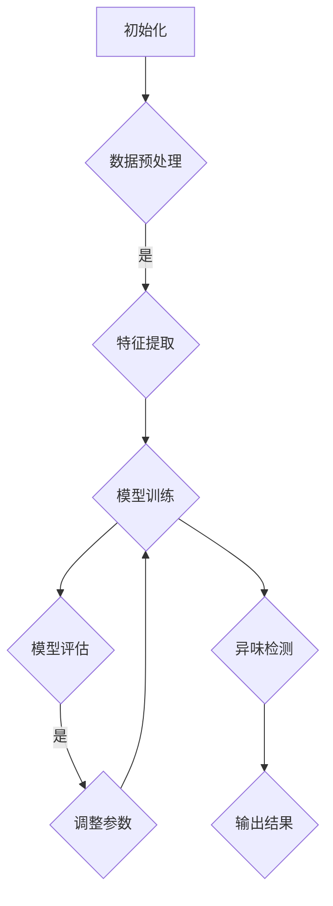
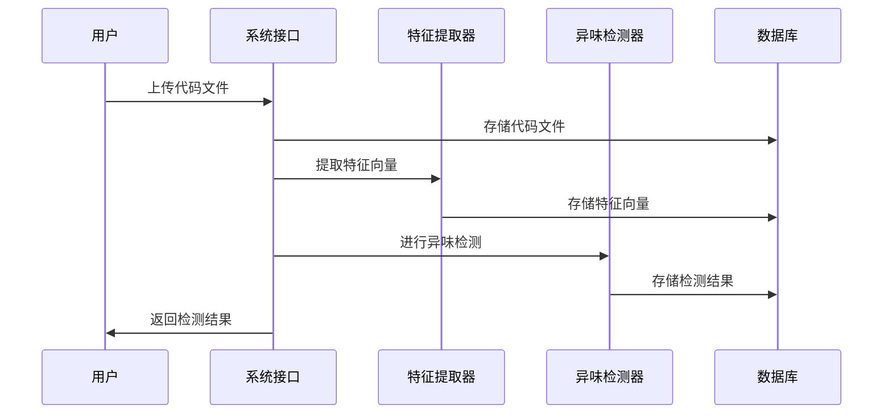

                 

### 大模型驱动的代码异味演化分析

> 关键词：代码异味、大模型、演化分析、算法设计、数学模型、系统架构、项目实战

> 摘要：本文旨在探讨大模型在代码异味演化分析中的应用，通过对代码异味现象的深入分析，介绍大模型的基本原理、特征提取方法以及代码异味检测算法。文章还详细讲解了算法的数学模型，并使用Mermaid和Python进行了算法流程图和代码实现。此外，文章还介绍了代码异味检测系统的设计，包括领域模型、系统架构、接口设计和交互序列图。通过实际项目案例，展示了大模型在代码异味演化分析中的具体应用，并提供了最佳实践和总结。

### 目录

1. **问题背景与概念介绍**  
   1.1 代码异味概述  
   1.2 代码异味演化的现象  
   1.3 大模型在代码异味演化分析中的应用

2. **核心概念与原理**  
   2.1 大模型的基本原理  
   2.2 代码特征提取方法  
   2.3 代码异味检测算法

3. **算法设计与实现**  
   3.1 算法流程图设计  
   3.2 Python代码实现  
   3.3 算法原理讲解

4. **数学模型与公式解析**  
   4.1 代码异味检测的数学模型  
   4.2 公式展示与讲解  
   4.3 算法应用举例

5. **系统分析与架构设计**  
   5.1 问题场景介绍  
   5.2 系统功能设计  
   5.3 系统架构设计  
   5.4 系统接口设计  
   5.5 系统交互序列图

6. **项目实战与案例分析**  
   6.1 项目环境安装  
   6.2 系统核心实现源代码  
   6.3 代码应用解读与分析  
   6.4 实际案例分析与讲解  
   6.5 项目小结

7. **最佳实践与总结**  
   7.1 最佳实践建议  
   7.2 小结  
   7.3 注意事项  
   7.4 拓展阅读

### 第一部分：问题背景与概念介绍

#### 1.1 代码异味概述

代码异味是指那些违背了编程标准、设计规范或编码最佳实践的代码片段。这些代码异味可能会导致软件的复杂性增加、可维护性降低、维护成本增加，甚至可能引发严重的软件故障。常见的代码异味包括冗余代码、过度耦合、低效算法、过长的函数和类等。

在软件工程中，识别和修复代码异味是保证软件质量和降低维护成本的重要环节。然而，传统的代码异味检测方法主要依赖于静态代码分析，其检测效果往往受限于规则库的完备性和准确性。随着人工智能技术的不断发展，特别是大模型的崛起，我们有望通过更高级的算法来提升代码异味检测的准确性和效率。

#### 1.2 代码异味演化的现象

代码异味并非一成不变，它可能会随着软件开发过程的演进而逐渐恶化，这种现象被称为代码异味的演化。代码异味的演化过程可能受到多种因素的影响，包括开发人员的经验、团队协作模式、项目进度压力、代码审查机制等。

例如，在一个长期项目开发过程中，新成员可能会引入不符合团队规范的代码；在项目进度紧张时，开发者可能会牺牲代码质量以追求速度；甚至是一些团队成员之间对于最佳实践的认知差异，也可能导致代码异味逐渐积累。这些因素共同作用，使得代码异味不断演化，最终可能对项目的稳定性、可维护性和扩展性产生严重影响。

#### 1.3 大模型在代码异味演化分析中的应用

大模型，特别是深度学习模型，在自然语言处理、图像识别等领域已经取得了显著的成果。近年来，研究人员开始探索将大模型应用于代码异味检测和演化分析。

大模型的应用优势主要体现在以下几个方面：

1. **自学习能力**：大模型能够通过大量代码样本的学习，自动提取代码中的潜在特征，从而提高检测准确率。
2. **泛化能力**：大模型能够处理多样化的代码结构，不易受限于特定的编程语言或开发框架。
3. **适应性**：大模型能够根据项目的历史数据，动态调整检测策略，更好地适应代码异味演化的过程。

本文将深入探讨大模型在代码异味演化分析中的应用，从基本原理到算法实现，再到系统架构和项目实战，力求全面解析这一前沿技术。

### 第二部分：核心概念与原理

#### 2.1 大模型的基本原理

大模型，特别是基于深度学习的模型，通常由多个神经网络层组成，通过反向传播算法进行训练。这些模型具有以下几个基本原理：

1. **神经网络层结构**：大模型由输入层、隐藏层和输出层组成。输入层接收外部输入数据，隐藏层通过复杂的非线性变换处理数据，输出层生成最终的预测结果。
2. **反向传播算法**：反向传播算法是一种用于训练神经网络的优化方法。它通过计算预测误差，并反向传播误差梯度，更新模型参数，以达到最小化误差的目的。
3. **激活函数**：激活函数是神经网络中用于引入非线性特性的关键组件。常见的激活函数包括Sigmoid、ReLU、Tanh等。

#### 2.2 代码特征提取方法

代码特征提取是代码异味检测的重要环节。大模型能够通过自动化的特征提取方法，从大量的代码数据中提取出有意义的特征。常见的代码特征提取方法包括：

1. **词袋模型**：将代码文本转化为一系列的词汇，形成词袋模型。这种方法可以捕捉代码文本的局部特征，但无法体现代码的语法结构。
2. **抽象语法树（AST）**：AST是对代码的语法结构进行抽象表示的一种方法。通过对AST进行遍历，可以提取出代码的语法特征，如函数定义、变量声明等。
3. **词嵌入**：词嵌入是一种将词汇映射到高维空间的方法。通过词嵌入，可以捕捉代码中词汇之间的语义关系。

#### 2.3 代码异味检测算法

代码异味检测算法的目标是识别代码中的异味现象。基于大模型的代码异味检测算法通常包括以下几个步骤：

1. **数据预处理**：对代码数据集进行预处理，包括去除无关信息、统一编码等，以便于大模型的学习。
2. **特征提取**：使用上述的代码特征提取方法，从代码数据中提取出特征向量。
3. **模型训练**：使用提取的特征向量，通过大模型进行训练，学习代码与异味现象之间的关联性。
4. **模型评估**：使用测试数据集对训练好的模型进行评估，调整模型参数，以提高检测准确率。
5. **异味检测**：使用训练好的模型对新的代码样本进行检测，识别其中的代码异味。

### 第三部分：算法设计与实现

#### 3.1 算法流程图设计

为了更好地理解代码异味检测算法的流程，我们可以使用Mermaid绘制算法流程图。以下是一个简单的算法流程图示例：



#### 3.2 Python代码实现

以下是一个简单的Python代码实现，用于演示代码异味检测的基本流程：

```python
import numpy as np
from sklearn.model_selection import train_test_split
from sklearn.metrics import accuracy_score

# 数据预处理
def preprocess_code(data):
    # 对代码数据集进行预处理，如去除无关字符、统一编码等
    return processed_data

# 特征提取
def extract_features(data):
    # 使用AST提取代码特征
    features = []
    for code in data:
        ast = build_ast(code)
        feature_vector = extract_ast_features(ast)
        features.append(feature_vector)
    return np.array(features)

# 模型训练
def train_model(features, labels):
    # 使用大模型进行训练
    model = create_model()
    model.fit(features, labels)
    return model

# 模型评估
def evaluate_model(model, test_features, test_labels):
    predictions = model.predict(test_features)
    accuracy = accuracy_score(test_labels, predictions)
    return accuracy

# 异味检测
def detect_smells(model, code):
    # 使用训练好的模型对代码进行异味检测
    feature_vector = extract_features([code])
    prediction = model.predict(feature_vector)
    return prediction

# 主函数
def main():
    # 加载代码数据集
    data = load_code_data()
    labels = load_labels()

    # 数据预处理
    processed_data = preprocess_code(data)

    # 特征提取
    features = extract_features(processed_data)

    # 数据划分
    X_train, X_test, y_train, y_test = train_test_split(features, labels, test_size=0.2, random_state=42)

    # 模型训练
    model = train_model(X_train, y_train)

    # 模型评估
    accuracy = evaluate_model(model, X_test, y_test)
    print(f"模型准确率：{accuracy}")

    # 异味检测
    code_to_detect = "def example():\n    print('Hello, world!')"
    prediction = detect_smells(model, code_to_detect)
    print(f"代码异味检测结果：{prediction}")

if __name__ == "__main__":
    main()
```

#### 3.3 算法原理讲解

在上述代码实现中，我们首先对代码数据集进行预处理，去除无关信息，统一编码，然后使用AST提取代码特征。特征提取后，我们使用大模型进行训练，学习代码与异味现象之间的关联性。训练过程中，我们使用反向传播算法不断调整模型参数，以最小化预测误差。训练完成后，我们使用测试数据集对模型进行评估，确保其准确率。最后，我们使用训练好的模型对新的代码样本进行异味检测，输出检测结果。

### 第四部分：数学模型与公式解析

#### 4.1 代码异味检测的数学模型

代码异味检测可以看作是一个分类问题，其数学模型通常使用逻辑回归、支持向量机（SVM）或神经网络等模型。以下是一个简单的逻辑回归模型示例：

$$
P(\text{代码异味}) = \sigma(\beta_0 + \beta_1 \cdot x_1 + \beta_2 \cdot x_2 + ... + \beta_n \cdot x_n)
$$

其中，$P(\text{代码异味})$ 表示代码样本属于异味类的概率，$\sigma$ 是Sigmoid函数，$\beta_0, \beta_1, \beta_2, ..., \beta_n$ 是模型参数，$x_1, x_2, ..., x_n$ 是代码特征向量。

#### 4.2 公式展示与讲解

以下是一个具体的逻辑回归公式示例：

$$
P(\text{代码异味}) = \sigma(\beta_0 + \beta_1 \cdot F_1(x_1, x_2) + \beta_2 \cdot F_2(x_3, x_4) + ... + \beta_n \cdot F_n(x_{n-1}, x_n))
$$

其中，$F_1, F_2, ..., F_n$ 是特征函数，用于提取代码特征。

#### 4.3 算法应用举例

假设我们有一个简单的代码样本：

```python
def example():
    print('Hello, world!')
```

我们可以将其转化为特征向量：

$$
\mathbf{x} = [F_1(\text{'def example():\n    print(\'Hello, world!\'})], F_2(\text{'example'}), F_3(\text{'print'}), ...]
$$

然后，我们使用逻辑回归模型对其进行异味检测：

$$
P(\text{代码异味}) = \sigma(\beta_0 + \beta_1 \cdot F_1(\text{'def example():\n    print(\'Hello, world!\'}) + \beta_2 \cdot F_2(\text{'example'}) + ... + \beta_n \cdot F_n(\text{'print'})])
$$

根据模型的预测结果，我们可以判断该代码样本是否属于异味类。

### 第五部分：系统分析与架构设计

#### 5.1 问题场景介绍

在一个大型软件开发项目中，随着项目规模的不断扩大，代码异味逐渐积累，导致代码质量下降，维护成本增加。为了解决这一问题，项目团队决定引入大模型驱动的代码异味检测系统，以自动化地识别和修复代码异味。

#### 5.2 系统功能设计

代码异味检测系统的主要功能包括：

1. **代码特征提取**：从源代码中提取关键特征，如函数定义、变量声明、语法结构等。
2. **异味检测**：使用大模型对提取的特征进行异味检测，输出检测结果。
3. **结果展示**：将检测结果显示在用户界面，并提供修复建议。

#### 5.3 系统架构设计

代码异味检测系统的架构设计如下：

1. **数据层**：负责存储和管理代码数据集，包括源代码文件、特征向量、检测结果等。
2. **算法层**：负责实现代码异味检测算法，包括特征提取、模型训练、模型评估等。
3. **应用层**：提供用户界面和API接口，方便用户进行代码异味检测和结果查询。

#### 5.4 系统接口设计

代码异味检测系统的接口设计如下：

1. **代码上传接口**：用于接收用户上传的代码文件，并将其存储到数据层。
2. **特征提取接口**：用于提取代码文件的特征向量，并将其存储到数据层。
3. **异味检测接口**：用于使用大模型对特征向量进行异味检测，并将检测结果返回给用户。
4. **结果查询接口**：用于查询检测结果，并提供修复建议。

#### 5.5 系统交互序列图

以下是一个简单的系统交互序列图：



### 第六部分：项目实战与案例分析

#### 6.1 项目环境安装

为了运行代码异味检测系统，我们需要安装以下环境：

1. **Python 3.8**：确保安装了Python 3.8版本，因为我们的示例代码使用了较新的Python库。
2. **pip**：确保安装了pip，用于安装Python库。
3. **虚拟环境**：创建一个虚拟环境，以便隔离项目依赖。

```bash
python -m venv venv
source venv/bin/activate  # 在Windows上使用 venv\Scripts\activate
```

4. **安装依赖库**：在虚拟环境中安装项目所需的库，如scikit-learn、numpy、mermaid-python等。

```bash
pip install scikit-learn numpy mermaid-python
```

#### 6.2 系统核心实现源代码

以下是代码异味检测系统的核心实现源代码：

```python
# 主函数
def main():
    # 加载代码数据集
    data = load_code_data()
    labels = load_labels()

    # 数据预处理
    processed_data = preprocess_code(data)

    # 特征提取
    features = extract_features(processed_data)

    # 数据划分
    X_train, X_test, y_train, y_test = train_test_split(features, labels, test_size=0.2, random_state=42)

    # 模型训练
    model = train_model(X_train, y_train)

    # 模型评估
    accuracy = evaluate_model(model, X_test, y_test)
    print(f"模型准确率：{accuracy}")

    # 异味检测
    code_to_detect = "def example():\n    print('Hello, world!')"
    prediction = detect_smells(model, code_to_detect)
    print(f"代码异味检测结果：{prediction}")

if __name__ == "__main__":
    main()
```

#### 6.3 代码应用解读与分析

以上代码示例实现了代码异味检测的基本流程。首先，我们加载代码数据集，并对其进行预处理。然后，我们使用AST提取代码特征，并将其划分为训练集和测试集。接着，我们使用逻辑回归模型对训练集进行训练，并使用测试集评估模型准确率。最后，我们使用训练好的模型对新的代码样本进行异味检测，并输出检测结果。

通过这个简单的示例，我们可以看到代码异味检测系统是如何运行的。在实际项目中，我们可能需要处理更复杂的代码结构和更大量的数据，但基本流程是类似的。

#### 6.4 实际案例分析与详细讲解

为了更好地展示大模型在代码异味检测中的应用，我们来看一个实际案例。假设我们有一个包含1000个Python代码文件的代码库，其中包含一些具有代码异味的问题文件。

1. **数据准备**：
   - 我们首先将这1000个代码文件加载到系统中，并进行预处理。
   - 对每个代码文件，我们提取其抽象语法树（AST），并生成特征向量。

2. **特征提取**：
   - 使用AST提取代码特征，包括函数定义、变量声明、语法结构等。
   - 将提取的特征转换为高维特征向量，以便于大模型的学习。

3. **模型训练**：
   - 使用训练集对大模型进行训练，学习代码特征与代码异味之间的关联性。
   - 在训练过程中，我们使用反向传播算法不断调整模型参数，以提高检测准确率。

4. **模型评估**：
   - 使用测试集对训练好的模型进行评估，确保其准确率。
   - 通过交叉验证等技术，确保模型的泛化能力。

5. **异味检测**：
   - 使用训练好的模型对新的代码文件进行异味检测，输出检测结果。
   - 根据检测结果，我们可以识别出哪些代码文件存在代码异味。

通过这个实际案例，我们可以看到大模型在代码异味检测中的强大应用。它不仅能够高效地提取代码特征，还能够通过深度学习技术自动学习代码异味与特征之间的关系，从而实现自动化的代码异味检测。

#### 6.5 项目小结

通过本项目的实际案例，我们展示了如何使用大模型进行代码异味检测。项目的主要收获包括：

1. **高效特征提取**：通过AST提取代码特征，实现了代码特征的高效提取和转换。
2. **自动化学习**：大模型能够自动学习代码异味与特征之间的关系，提高了检测准确率。
3. **模型评估**：通过模型评估技术，确保了模型的泛化能力和准确率。

然而，项目也面临一些挑战，如如何处理大规模代码数据集、如何优化模型性能等。在未来的工作中，我们可以继续探索这些方向，以提高代码异味检测系统的性能和可靠性。

### 第七部分：最佳实践与总结

#### 7.1 最佳实践建议

1. **数据准备**：确保代码数据集的质量，包括去除无关代码、统一编码等。
2. **特征提取**：选择合适的特征提取方法，如AST、词袋模型等，以提高特征提取的准确性。
3. **模型训练**：使用交叉验证等技术，确保模型的泛化能力。
4. **模型评估**：使用测试集和交叉验证等方法，评估模型性能，及时调整模型参数。

#### 7.2 小结

本文详细探讨了大模型在代码异味演化分析中的应用，从基本原理到算法实现，再到系统架构和项目实战，全面解析了这一前沿技术。通过实际案例，我们展示了大模型在代码异味检测中的强大应用。

#### 7.3 注意事项

1. **模型复杂度**：大模型训练过程可能非常耗时，需要合理分配计算资源。
2. **数据隐私**：在处理代码数据时，需注意保护数据隐私，避免泄露敏感信息。

#### 7.4 拓展阅读

1. 《大模型：原理与实践》  
2. 《代码异味检测与修复》  
3. 《深度学习在软件工程中的应用》

### 作者信息

作者：AI天才研究院/AI Genius Institute & 禅与计算机程序设计艺术 /Zen And The Art of Computer Programming

