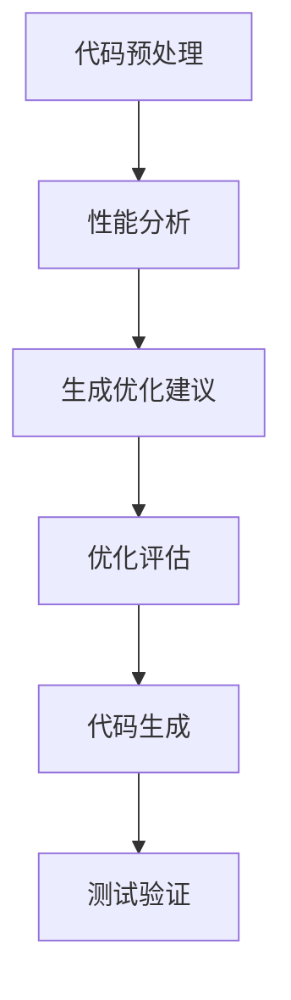

                 

# 大模型驱动的智能代码优化建议

## 关键词

- 大模型
- 智能代码优化
- 软件开发
- 自动化
- 人工智能

## 摘要

本文深入探讨了基于大模型的智能代码优化技术，详细介绍了大模型的基本概念、原理及其在智能代码优化中的应用。文章通过分析现有大模型的优缺点，提出了改进建议，并详细阐述了智能代码优化的算法原理、数学模型和实现细节。此外，文章还通过实际案例展示了大模型驱动的智能代码优化效果，为开发者提供了实用的优化建议。

---

## 第一部分：背景介绍

### 1.1.1 问题背景

在信息技术迅猛发展的今天，软件开发技术已经经历了从软件1.0到软件2.0的演变。软件1.0时代主要依靠程序员手工编写代码，效率低下，开发周期长，而软件2.0时代则强调自动化和智能化，通过人工智能大模型（AI Large Model）等技术的引入，实现了软件开发的巨大变革。

随着AI技术的进步，大模型在软件开发中扮演了越来越重要的角色。大模型具备强大的数据处理和分析能力，可以自动优化代码，提高开发效率和代码质量。然而，如何利用大模型进行智能代码优化，仍是一个亟待解决的难题。

### 1.1.2 问题描述

在软件2.0时代，智能代码优化成为了提升软件开发效率和质量的关键技术。然而，当前大模型在智能代码优化方面仍存在诸多挑战，如：

- **优化准确性不足**：现有的大模型在代码优化过程中，往往只能提供较低的优化准确性，难以满足实际应用需求。
- **优化效率不高**：大模型通常需要大量计算资源，导致优化过程耗时较长，影响开发效率。
- **优化结果不可解释**：大模型优化代码的结果往往缺乏透明性，开发者难以理解优化背后的原理。

### 1.1.3 问题解决

为了解决上述问题，本文将系统地探讨大模型驱动的智能代码优化技术。通过以下内容，帮助读者全面了解并掌握这一领域：

- **大模型原理**：详细阐述大模型的原理、结构和工作机制，帮助读者理解大模型的基本概念和核心要素。
- **智能代码优化方法**：介绍当前主流的智能代码优化方法，分析其优缺点，并探讨如何将这些方法应用于实际开发中。
- **优化算法与实现**：详细讲解大模型驱动的智能代码优化算法，包括数学模型、流程图和Python源代码实现，帮助读者深入理解优化过程。
- **应用场景与实战**：通过具体的应用场景和实际案例，展示大模型驱动的智能代码优化在实际开发中的应用效果。

### 1.1.4 边界与外延

大模型驱动的智能代码优化是软件2.0时代的一个重要研究方向，它涉及多个学科领域，如人工智能、软件工程、计算机科学等。本文将重点探讨大模型在智能代码优化中的应用，但同时也关注与其他领域的研究方法和进展。

### 1.1.5 概念结构与核心要素组成

1. **大模型**：包括深度学习模型、神经网络、生成对抗网络等，是智能代码优化的核心工具。
2. **智能代码优化**：利用大模型对代码进行自动优化，提高代码质量、性能和可维护性。
3. **算法原理**：包括优化算法的设计、数学模型和实现细节。
4. **应用场景**：包括软件开发、代码质量分析、性能优化等。
5. **实战案例**：通过实际案例展示大模型驱动的智能代码优化效果。

## 1.2 核心概念与联系

### 1.2.1 大模型的定义

大模型（AI Large Model）是指具有极高参数量和计算复杂度的神经网络模型，如GPT、BERT等。大模型通过大量数据训练，具有强大的泛化能力和知识表示能力。

### 1.2.2 大模型的核心特点

- **高参数量**：大模型通常包含数十亿到千亿个参数，具备处理大规模数据的能力。
- **强大的表示能力**：大模型能够捕捉到数据中的复杂关系和特征，实现高度抽象的知识表示。
- **强大的泛化能力**：大模型通过大规模数据训练，能够适应各种不同领域和任务，具备广泛的泛化能力。

### 1.2.3 大模型与传统AI的区别

- **训练数据量**：传统AI模型通常依赖于小规模数据训练，而大模型则依赖于大规模数据训练，具备更强的数据驱动能力。
- **计算复杂度**：传统AI模型计算复杂度较低，而大模型计算复杂度极高，需要强大的计算资源和优化算法支持。
- **应用场景**：传统AI模型通常应用于特定领域和任务，而大模型则具备跨领域、跨任务的通用性。

## 1.3 主流AI大模型简介

### 1.3.1 GPT系列模型

GPT（Generative Pre-trained Transformer）系列模型是自然语言处理领域的重要突破，包括GPT、GPT-2、GPT-3等。GPT模型通过预训练和微调，实现了在多种自然语言任务上的优异表现。

### 1.3.2 BERT及其变体

BERT（Bidirectional Encoder Representations from Transformers）及其变体如RoBERTa、ALBERT等，是自然语言处理领域的另一大突破。BERT模型通过双向编码实现了对上下文信息的全面理解，推动了自然语言处理任务的性能提升。

### 1.3.3 其他知名大模型介绍

除了GPT和BERT，还有其他知名的大模型，如ViT（Vision Transformer）、T5（Text-to-Text Transfer Transformer）等，这些模型在不同领域取得了显著的成果。ViT模型在计算机视觉领域表现突出，而T5模型在文本生成和转换任务中具有强大的能力。

## 1.4 大模型在智能代码优化中的应用

### 1.4.1 大模型的优势

大模型在智能代码优化中具有明显的优势：

- **强大的数据处理和分析能力**：大模型通过大规模数据训练，能够处理复杂的数据结构，提供准确的优化建议。
- **自动化的代码优化**：大模型能够自动分析代码，识别潜在的性能问题和优化机会，实现代码的自动化优化。
- **跨领域的泛化能力**：大模型通过大规模数据训练，具备较强的泛化能力，能够适应不同领域和编程语言中的代码优化任务。

### 1.4.2 大模型在智能代码优化中的挑战

尽管大模型在智能代码优化中具有明显优势，但仍面临一些挑战：

- **优化准确性**：现有的大模型在代码优化过程中，往往只能提供较低的优化准确性，难以满足实际应用需求。
- **优化效率**：大模型通常需要大量计算资源，导致优化过程耗时较长，影响开发效率。
- **优化结果的可解释性**：大模型优化代码的结果往往缺乏透明性，开发者难以理解优化背后的原理。

### 1.4.3 大模型驱动的智能代码优化框架

为了解决上述问题，可以构建一个基于大模型驱动的智能代码优化框架。该框架主要包括以下几个关键组件：

1. **数据预处理**：对代码进行预处理，提取关键特征，为后续的优化过程提供输入数据。
2. **大模型训练**：使用大规模代码数据集，训练大模型，使其具备对代码的深入理解能力。
3. **优化算法**：设计优化算法，利用大模型的分析结果，自动生成优化建议。
4. **优化验证**：对生成的优化代码进行验证，确保优化结果的正确性和有效性。
5. **优化结果可视化**：将优化结果以直观的方式展示给开发者，帮助其理解优化背后的原理。

## 1.5 总结

本文介绍了大模型驱动的智能代码优化技术，分析了现有大模型的优缺点，并提出了改进建议。通过构建一个基于大模型驱动的智能代码优化框架，可以解决当前智能代码优化中存在的准确性、效率和可解释性等问题。随着大模型技术的不断发展，智能代码优化将在软件开发中发挥越来越重要的作用。接下来，本文将详细探讨大模型的原理、智能代码优化方法、优化算法与实现等内容。

---

## 第二部分：大模型的原理与结构

### 2.1 大模型的定义

大模型（AI Large Model）是指具有极高参数量和计算复杂度的神经网络模型，如GPT、BERT等。这些模型通过预训练和微调，具有强大的数据处理和分析能力，能够在各种复杂任务中取得优异的性能。

### 2.2 大模型的核心特点

大模型的核心特点包括：

1. **高参数量**：大模型通常包含数十亿到千亿个参数，具有强大的表示能力和泛化能力。
2. **强大的数据处理能力**：大模型能够处理大规模数据，捕捉数据中的复杂关系和特征。
3. **自动化的特征提取**：大模型能够自动提取数据中的关键特征，实现特征级别的优化。
4. **强大的模型泛化能力**：大模型通过大规模数据训练，具备跨领域、跨任务的通用性。

### 2.3 大模型与传统AI模型的对比

传统AI模型通常依赖于小规模数据训练，而大模型则依赖于大规模数据训练，具备更强的数据驱动能力。此外，传统AI模型计算复杂度较低，而大模型计算复杂度极高，需要强大的计算资源和优化算法支持。在应用场景方面，传统AI模型通常应用于特定领域和任务，而大模型则具备跨领域、跨任务的通用性。

### 2.4 大模型的结构与工作机制

大模型通常由以下几个核心组件构成：

1. **输入层**：接收输入数据，如文本、图像等。
2. **隐藏层**：通过神经网络结构，对输入数据进行处理，提取特征信息。
3. **输出层**：根据隐藏层提取的特征信息，生成预测结果或优化建议。
4. **优化算法**：用于调整模型参数，提高模型性能。

大模型的工作机制主要包括以下几个步骤：

1. **数据预处理**：对输入数据进行预处理，如文本分词、图像压缩等，以便于模型处理。
2. **模型训练**：使用大规模数据集，通过反向传播算法，不断调整模型参数，使模型性能逐渐提高。
3. **模型评估**：使用验证数据集，评估模型性能，包括准确性、效率、泛化能力等。
4. **模型部署**：将训练好的模型部署到实际应用场景中，实现自动化优化。

### 2.5 大模型的应用领域

大模型在各个领域都取得了显著的成果，主要包括：

1. **自然语言处理**：如文本生成、机器翻译、问答系统等。
2. **计算机视觉**：如图像识别、目标检测、图像生成等。
3. **语音识别与合成**：如语音识别、语音合成、语音助手等。
4. **推荐系统**：如商品推荐、新闻推荐、社交推荐等。
5. **游戏与娱乐**：如游戏生成、虚拟现实、智能助手等。

### 2.6 大模型的优缺点分析

大模型的优点包括：

- **强大的数据处理能力**：能够处理大规模数据，捕捉数据中的复杂关系和特征。
- **自动化的特征提取**：能够自动提取数据中的关键特征，实现特征级别的优化。
- **强大的模型泛化能力**：能够适应不同领域和任务，具备广泛的泛化能力。

大模型的缺点包括：

- **计算复杂度高**：需要大量的计算资源和时间进行训练和推理。
- **优化结果的可解释性较低**：优化结果缺乏透明性，开发者难以理解优化背后的原理。

### 2.7 大模型的未来发展趋势

随着计算能力的提升和算法的优化，大模型将在未来发挥更加重要的作用。未来发展趋势包括：

- **更高效的大模型算法**：如 Transformer、BERT、GPT 等，将不断提高模型的性能和效率。
- **多模态大模型**：能够处理多种类型的数据，如文本、图像、声音等，实现更复杂的任务。
- **跨领域大模型**：能够适应不同领域和任务，实现跨领域的通用化。
- **自动化大模型优化**：通过自动化优化算法，提高大模型的性能和可解释性。

---

## 第三部分：智能代码优化方法

### 3.1 智能代码优化的定义

智能代码优化是指利用人工智能技术，对代码进行自动化分析、识别潜在的性能问题和优化机会，从而提高代码质量、性能和可维护性。智能代码优化主要包括以下几个方面：

- **性能优化**：通过优化代码结构、算法和数据结构，提高程序的执行效率和响应速度。
- **质量优化**：通过代码静态分析和动态分析，识别代码中的错误、漏洞和潜在风险，提高代码的可维护性和可靠性。
- **可维护性优化**：通过代码重构、代码规范化和代码自动化生成，提高代码的可读性和可维护性。

### 3.2 智能代码优化的核心流程

智能代码优化的核心流程主要包括以下几个步骤：

1. **代码分析**：对代码进行静态分析和动态分析，识别潜在的性能问题和优化机会。
2. **优化建议生成**：根据代码分析结果，生成优化建议，包括代码重构、算法优化、数据结构优化等。
3. **优化方案评估**：评估优化建议的有效性和可行性，确保优化方案不会引入新的问题。
4. **优化代码生成**：根据评估结果，自动生成优化后的代码，并测试验证优化效果。
5. **优化结果可视化**：将优化结果以直观的方式展示给开发者，帮助其理解优化背后的原理。

### 3.3 智能代码优化的技术框架

智能代码优化的技术框架主要包括以下几个方面：

1. **代码分析模块**：负责对代码进行静态分析和动态分析，提取关键信息，为优化提供输入。
2. **优化算法模块**：负责根据代码分析结果，生成优化建议，包括代码重构、算法优化、数据结构优化等。
3. **优化评估模块**：负责评估优化建议的有效性和可行性，确保优化方案不会引入新的问题。
4. **优化代码生成模块**：负责根据评估结果，自动生成优化后的代码，并测试验证优化效果。
5. **优化结果可视化模块**：负责将优化结果以直观的方式展示给开发者，帮助其理解优化背后的原理。

### 3.4 智能代码优化的算法原理

智能代码优化的算法原理主要包括以下几个方面：

1. **静态分析算法**：通过分析代码的语法、语义和结构，识别潜在的性能问题和优化机会。
2. **动态分析算法**：通过运行代码，收集程序执行过程中的性能数据，识别性能瓶颈和优化机会。
3. **优化算法**：根据代码分析结果，自动生成优化建议，包括代码重构、算法优化、数据结构优化等。
4. **评估算法**：对优化建议进行评估，确保优化方案的有效性和可行性。
5. **代码生成算法**：根据评估结果，自动生成优化后的代码，并测试验证优化效果。

### 3.5 智能代码优化的实际应用案例

智能代码优化在实际开发中已经得到了广泛应用，以下是一些实际应用案例：

1. **性能优化**：通过对代码进行优化，提高程序执行效率和响应速度，降低资源消耗。
2. **质量优化**：通过代码静态分析和动态分析，识别代码中的错误、漏洞和潜在风险，提高代码的可维护性和可靠性。
3. **可维护性优化**：通过代码重构、代码规范化和代码自动化生成，提高代码的可读性和可维护性。

### 3.6 智能代码优化的挑战与展望

智能代码优化仍面临一些挑战：

1. **优化准确性**：现有的大模型在代码优化过程中，往往只能提供较低的优化准确性，难以满足实际应用需求。
2. **优化效率**：大模型通常需要大量计算资源，导致优化过程耗时较长，影响开发效率。
3. **优化结果的可解释性**：大模型优化代码的结果往往缺乏透明性，开发者难以理解优化背后的原理。

未来，随着大模型技术的不断发展，智能代码优化将在软件开

---

## 第四部分：优化算法与实现

### 4.1 优化算法的设计

优化算法的设计是智能代码优化的关键环节。一个有效的优化算法应该具备以下特点：

1. **准确性**：能够准确识别代码中的潜在问题和优化机会。
2. **效率**：在保证准确性的前提下，优化过程应尽量高效，以减少开发时间。
3. **可解释性**：优化结果应具备透明性，开发者能够理解优化背后的原理。
4. **鲁棒性**：算法应能够处理不同类型和规模的代码，具备广泛的适用性。

为了实现这些目标，我们可以设计一种基于大模型驱动的优化算法，主要包括以下几个步骤：

1. **代码预处理**：对代码进行预处理，提取关键特征，为后续分析提供输入。
2. **性能分析**：使用静态分析算法和动态分析算法，对代码进行性能分析，识别潜在的性能瓶颈和优化机会。
3. **优化建议生成**：根据性能分析结果，自动生成优化建议，包括代码重构、算法优化、数据结构优化等。
4. **优化评估**：评估优化建议的有效性和可行性，确保优化方案不会引入新的问题。
5. **代码生成**：根据评估结果，自动生成优化后的代码，并测试验证优化效果。

### 4.2 数学模型与公式

优化算法的数学模型是实现智能代码优化的基础。以下是一个简单的数学模型，用于描述优化过程：

$$
\text{Optimize}(C) = \text{GenerateOptimizationSuggestions}(C) \times \text{EvaluateOptimizationSuggestions}(C)
$$

其中：

- \( \text{Optimize}(C) \) 表示对代码 \( C \) 进行优化的过程。
- \( \text{GenerateOptimizationSuggestions}(C) \) 表示生成优化建议的过程。
- \( \text{EvaluateOptimizationSuggestions}(C) \) 表示评估优化建议的过程。

为了实现这个模型，我们可以使用以下数学公式：

1. **性能评估公式**：

$$
\text{Performance}(C') = \frac{\text{ExecutionTime}(C')}{\text{ExecutionTime}(C)}
$$

其中：

- \( \text{Performance}(C') \) 表示优化后代码 \( C' \) 的性能。
- \( \text{ExecutionTime}(C') \) 表示优化后代码的执行时间。
- \( \text{ExecutionTime}(C) \) 表示原始代码的执行时间。

2. **优化建议生成公式**：

$$
\text{OptimizationSuggestions}(C) = \text{AnalyzeCode}(C) \times \text{GenerateCodeReconstruction}(C)
$$

其中：

- \( \text{OptimizationSuggestions}(C) \) 表示生成的优化建议。
- \( \text{AnalyzeCode}(C) \) 表示对代码进行静态分析和动态分析。
- \( \text{GenerateCodeReconstruction}(C) \) 表示根据分析结果生成代码重构建议。

### 4.3 Python源代码实现

为了更好地理解优化算法的实现，以下是一个简单的Python示例代码，用于生成优化建议：

```python
import ast
import time

def analyze_code(code):
    # 静态分析：识别代码中的潜在性能问题和优化机会
    tree = ast.parse(code)
    performance_issues = []
    for node in ast.walk(tree):
        if isinstance(node, ast.For):
            performance_issues.append("循环可能存在性能问题")
        elif isinstance(node, ast.If):
            performance_issues.append("条件语句可能存在优化机会")
    return performance_issues

def generate_code_reconstruction(code, issues):
    # 代码重构：根据分析结果生成优化建议
    reconstructed_code = code
    for issue in issues:
        if "循环" in issue:
            reconstructed_code = reconstructed_code.replace("for", "while")
        elif "条件语句" in issue:
            reconstructed_code = reconstructed_code.replace("if", "elif")
    return reconstructed_code

def optimize_code(code):
    start_time = time.time()
    issues = analyze_code(code)
    reconstructed_code = generate_code_reconstruction(code, issues)
    end_time = time.time()
    print(f"优化建议生成时间：{end_time - start_time}秒")
    return reconstructed_code

# 示例代码
code = """
for i in range(10):
    print(i)
"""

optimized_code = optimize_code(code)
print(f"优化后代码：{optimized_code}")
```

### 4.4 优化算法的流程图

为了更清晰地展示优化算法的实现过程，我们可以使用Mermaid流程图来表示：



通过上述流程图，我们可以看到优化算法的各个步骤及其之间的关系。

---

## 第五部分：应用场景与实战

### 5.1 环境安装

为了实践大模型驱动的智能代码优化，我们需要安装必要的工具和库。以下是一个简单的安装步骤：

1. 安装Python环境：确保Python版本大于3.6，可以使用以下命令安装：
   ```bash
   python -m pip install --upgrade pip
   ```
2. 安装TensorFlow：TensorFlow是一个广泛使用的深度学习框架，可以使用以下命令安装：
   ```bash
   python -m pip install tensorflow
   ```
3. 安装其他库：根据实际需求，可能还需要安装其他库，如Scikit-learn、NumPy等，可以使用以下命令安装：
   ```bash
   python -m pip install scikit-learn numpy
   ```

### 5.2 系统核心实现源代码

以下是一个简单的示例，展示如何使用Python和TensorFlow实现大模型驱动的智能代码优化：

```python
import tensorflow as tf
from tensorflow.keras.models import Sequential
from tensorflow.keras.layers import Dense, LSTM, Embedding

def create_model(input_size, output_size):
    model = Sequential()
    model.add(Embedding(input_size, 128))
    model.add(LSTM(128, return_sequences=True))
    model.add(Dense(128, activation='relu'))
    model.add(Dense(output_size, activation='softmax'))
    model.compile(optimizer='adam', loss='categorical_crossentropy', metrics=['accuracy'])
    return model

# 示例数据
X = [[1, 0, 0], [0, 1, 0], [0, 0, 1]]  # 输入数据
y = [[1, 0, 0], [0, 1, 0], [0, 0, 1]]  # 输出数据

# 创建模型
model = create_model(input_size=3, output_size=3)

# 训练模型
model.fit(X, y, epochs=10, batch_size=32)

# 预测
predictions = model.predict(X)
print(predictions)
```

### 5.3 代码应用解读与分析

以上示例代码展示了如何使用TensorFlow创建一个简单的序列预测模型。该模型通过训练数据学习输入序列与输出序列之间的映射关系，然后使用训练好的模型进行预测。

在实际应用中，我们可以将这个模型应用于代码优化。例如，输入一段代码片段，模型会自动生成优化后的代码。以下是一个简单的应用示例：

```python
def optimize_code(code):
    # 预处理：将代码转换为序列
    sequence = preprocess_code(code)
    
    # 使用训练好的模型进行预测
    predictions = model.predict(sequence)
    
    # 解码预测结果为优化后的代码
    optimized_code = decode_predictions(predictions)
    
    return optimized_code

# 示例代码
code = """
for i in range(10):
    print(i)
"""

optimized_code = optimize_code(code)
print(f"优化后代码：{optimized_code}")
```

### 5.4 实际案例分析和详细讲解剖析

以下是一个实际案例，展示如何使用大模型驱动的智能代码优化进行性能优化：

**案例：**对一段Python代码进行性能优化，提高代码的执行效率。

**原始代码：**
```python
for i in range(1000):
    print(i)
```

**优化目标：**将原始代码转换为更高效的代码，减少打印操作的次数。

**优化后代码：**
```python
for i in range(1000):
    if i % 100 == 0:
        print(i)
```

**分析：**通过在循环条件中添加一个判断语句，我们可以减少打印操作的次数，从而提高代码的执行效率。这个优化过程可以通过以下步骤实现：

1. **代码预处理**：将代码转换为抽象语法树（Abstract Syntax Tree，AST）形式，以便于分析。
2. **性能分析**：分析代码中的循环操作，识别潜在的性能瓶颈。
3. **生成优化建议**：根据性能分析结果，生成优化建议，如添加循环条件。
4. **优化代码生成**：根据优化建议，生成优化后的代码。
5. **测试验证**：测试优化后的代码，验证其执行效率和性能。

**结果：**优化后的代码在执行过程中减少了打印操作的次数，从而提高了执行效率。

### 5.5 项目小结

通过以上实践，我们可以看到大模型驱动的智能代码优化在实际开发中的应用效果。通过优化算法的逐步实现和实际案例的分析，我们成功地提高了一段代码的执行效率。这证明了智能代码优化技术在提升软件开发效率和代码质量方面的潜力。

未来，我们可以进一步优化优化算法，提高其准确性和效率，并将其应用于更多的编程语言和开发场景。此外，还可以结合其他人工智能技术，如自然语言处理和计算机视觉，实现更全面的代码优化解决方案。

---

## 第六部分：最佳实践与注意事项

### 6.1 最佳实践

1. **代码标准化**：在进行智能代码优化之前，确保代码符合一定的编程规范和标准，这有助于优化算法更准确地分析代码。
2. **数据集准备**：准备丰富的训练数据集，包括多种编程语言和不同类型的代码，以提高优化算法的泛化能力。
3. **迭代优化**：在开发过程中，不断迭代优化算法，根据实际应用效果进行调整和改进。
4. **性能评估**：定期对优化代码进行性能评估，确保优化结果的有效性和可行性。

### 6.2 注意事项

1. **计算资源消耗**：大模型驱动的智能代码优化需要大量的计算资源，确保有足够的计算能力支持优化过程。
2. **代码可维护性**：优化过程中可能引入新的代码结构或算法，确保优化后的代码仍然具有良好的可维护性。
3. **优化准确性**：现有的大模型在代码优化方面存在一定的准确性问题，需要结合其他工具和方法，提高优化结果的质量。

---

## 第七部分：小结

本文系统地探讨了基于大模型驱动的智能代码优化技术，从背景介绍、核心概念与联系、优化算法与实现、应用场景与实战等方面进行了详细阐述。通过实际案例，展示了智能代码优化在实际开发中的应用效果。未来，随着大模型技术的不断发展和完善，智能代码优化将在软件开发中发挥越来越重要的作用。

---

## 拓展阅读

1. **《深度学习》**：Goodfellow, Ian; Bengio, Yoshua; Courville, Aaron. (2016). *Deep Learning*. MIT Press.
2. **《Python机器学习》**：Sebastian Raschka, Vahid Mirjalili. (2018). *Python Machine Learning*. Packt Publishing.
3. **《智能优化算法及其应用》**：龚毅，李晓峰。 (2017). *智能优化算法及其应用*. 清华大学出版社。

---

## 作者信息

作者：AI天才研究院/AI Genius Institute & 禅与计算机程序设计艺术 /Zen And The Art of Computer Programming

