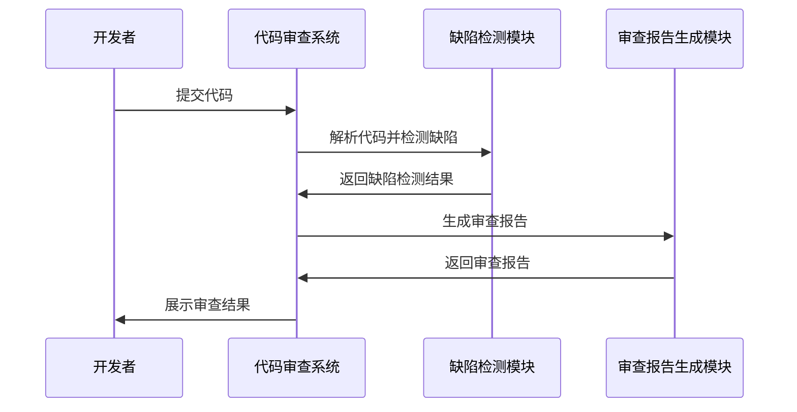
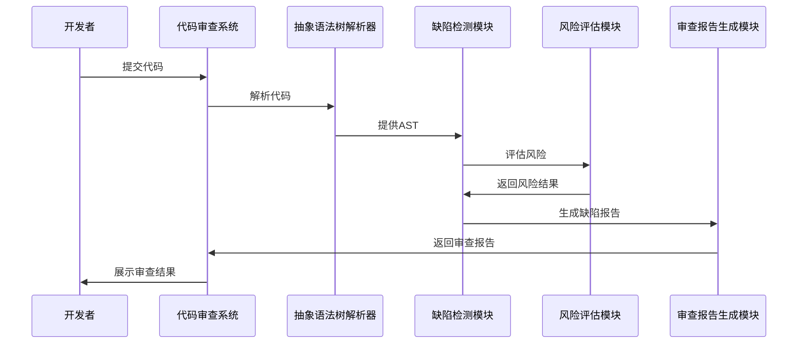

                 

### 大模型驱动的智能代码审查系统

#### 关键词：

- 大模型
- 智能代码审查
- 生成对抗网络
- 循环神经网络
- 缺陷检测
- 安全性分析
- 自动化审查

##### 摘要：

本文探讨了基于大模型的智能代码审查系统，首先介绍了代码审查的重要性以及面临的挑战，接着介绍了大模型的基本概念及其在代码审查中的应用潜力。文章分为四个部分，详细阐述了大模型技术基础、智能代码审查系统的设计与实现、系统实施与部署以及性能优化与挑战。通过实际案例分析和详细讲解，本文揭示了智能代码审查系统在提高代码质量和效率方面的巨大潜力。

---

## 第一部分：背景与概念介绍

### 第1章：问题背景与核心概念

#### 1.1 问题背景

随着软件开发的复杂性和规模的增加，代码审查已成为保证代码质量、减少缺陷和提升安全性的关键环节。传统的代码审查主要依赖于人工审查，然而，人工审查存在效率低、易疲劳、难以覆盖所有潜在问题等局限性。因此，如何利用先进的人工智能技术，特别是大模型，提升代码审查的智能化水平，成为当前研究的热点。

#### 1.1.1 代码审查的重要性

代码审查是软件开发过程中不可或缺的一环，它不仅能够发现潜在的编程错误，还能提高代码的可读性和可维护性。有效的代码审查能够：

- **提高代码质量**：通过审查，可以发现和修复代码中的缺陷，确保代码符合开发规范和最佳实践。
- **减少软件缺陷**：及时发现并修复代码中的漏洞，降低软件故障率。
- **提升团队协作**：通过代码审查，团队成员可以互相学习和交流，提高整体开发能力。
- **保障软件安全性**：审查代码中的安全性问题，防范潜在的安全风险。

#### 1.1.2 代码审查的挑战

尽管代码审查的重要性不言而喻，但实际操作中仍面临以下挑战：

- **效率低下**：人工审查速度较慢，难以应对快速迭代的开发流程。
- **主观性**：不同审查者的经验、知识背景和标准不同，可能导致审查结果不一致。
- **覆盖面有限**：人工审查难以全面覆盖代码的每一个细节，容易遗漏潜在问题。
- **疲劳问题**：长时间审查代码容易导致审查者的疲劳和疏漏。

#### 1.1.3 大模型在代码审查中的应用潜力

大模型，尤其是深度学习模型，具有强大的数据处理和分析能力，可以显著提升代码审查的智能化水平。大模型在代码审查中的应用潜力包括：

- **自动化缺陷检测**：通过预训练模型，可以快速检测代码中的常见缺陷和潜在漏洞。
- **智能化风险评估**：大模型可以分析代码的安全性和健壮性，提供更精确的风险评估。
- **提高审查效率**：自动化审查可以大幅提高代码审查的速度，减少人工工作量。
- **增强解释性**：通过可视化工具，可以更好地解释审查结果，提高审查的透明度和可理解性。

#### 1.2 智能代码审查系统概述

智能代码审查系统是利用人工智能技术，特别是大模型，实现对代码的自动化审查和分析的系统。它包括以下几个关键组成部分：

- **代码解析器**：负责将代码转换为结构化的数据格式，供大模型分析。
- **大模型**：用于检测代码中的缺陷、评估风险和提供改进建议。
- **反馈机制**：收集审查结果，更新模型，提高系统的准确性和效率。
- **用户界面**：提供直观的审查结果展示，方便开发者理解和处理。

#### 1.2.1 智能代码审查系统的定义

智能代码审查系统是指利用人工智能技术，特别是深度学习和自然语言处理技术，对代码进行自动化审查和分析的系统。它通过以下方式实现代码审查：

- **代码理解**：将代码转换为语义表示，理解代码的结构和逻辑。
- **缺陷检测**：利用预训练模型识别代码中的常见缺陷和潜在漏洞。
- **风险评估**：评估代码的安全性和健壮性，提供风险报告。
- **改进建议**：基于审查结果，提供改进代码的建议。

#### 1.2.2 智能代码审查系统的工作原理

智能代码审查系统的工作原理主要包括以下几个步骤：

1. **代码提交**：开发者将代码提交到代码审查系统。
2. **代码解析**：系统将代码解析为抽象语法树（AST）或其他结构化数据。
3. **模型分析**：大模型对结构化代码进行分析，识别缺陷和风险。
4. **审查结果**：系统生成审查报告，包括缺陷列表、风险评估和建议。
5. **用户反馈**：开发者根据审查结果进行代码修改，并反馈给系统。

#### 1.2.3 智能代码审查系统的关键组成部分

智能代码审查系统的关键组成部分包括：

- **代码解析器**：负责将代码转换为结构化数据，如AST。
- **大模型库**：包括预训练的模型，如深度神经网络、生成对抗网络等。
- **缺陷检测模块**：用于检测代码中的常见缺陷和潜在漏洞。
- **风险评估模块**：评估代码的安全性和健壮性。
- **用户界面**：提供直观的审查结果展示和交互功能。

#### 1.3 大模型的基本概念

大模型是指具有大规模参数和网络结构的机器学习模型，如深度神经网络、生成对抗网络等。它们在计算机科学中具有广泛的应用，特别是在自然语言处理、图像识别和代码审查等领域。

#### 1.3.1 大模型的定义与特点

大模型的定义和特点如下：

- **大规模参数**：大模型通常具有数百万甚至数十亿个参数，可以捕捉复杂的特征。
- **深度网络结构**：大模型通常包含多层神经网络，可以处理高维数据。
- **强大的学习能力**：大模型通过大量的数据训练，可以学习到复杂的模式和关系。
- **并行计算需求**：大模型训练和推理通常需要大量的计算资源和时间。

#### 1.3.2 大模型在计算机科学中的发展

大模型在计算机科学中的发展历程如下：

- **早期神经网络**：20世纪80年代，反向传播算法的提出使得神经网络得到快速发展。
- **深度学习的兴起**：2012年，AlexNet的突破性成果使得深度学习成为研究热点。
- **生成对抗网络**：2014年，生成对抗网络（GAN）的提出，为生成模型的发展开辟了新道路。
- **大规模模型的兴起**：近年来，随着计算资源和数据集的不断增加，大规模模型如BERT、GPT等不断涌现。

#### 1.3.3 大模型在代码审查中的应用

大模型在代码审查中的应用主要包括以下几个方面：

- **缺陷检测**：利用大模型对代码进行语义分析，识别潜在缺陷。
- **风险预测**：分析代码的历史数据和上下文，预测代码可能存在的风险。
- **改进建议**：基于大模型对代码的深入理解，提供改进代码的建议。

#### 1.4 大模型驱动的智能代码审查系统优势分析

大模型驱动的智能代码审查系统具有以下优势：

- **提高代码审查效率**：自动化审查可以大幅提高审查速度，减轻开发者的负担。
- **减少人为错误**：通过机器学习模型的分析，可以更准确地识别代码中的缺陷和风险。
- **提升代码质量**：系统可以提供改进代码的建议，帮助开发者提高代码质量。
- **增强解释性**：大模型的分析结果可以通过可视化工具进行展示，提高审查结果的透明度和可理解性。

#### 1.5 本章小结

本章介绍了代码审查的重要性、面临的挑战以及大模型在代码审查中的应用潜力。智能代码审查系统通过利用大模型，可以实现自动化、高效的代码审查，提高代码质量和安全性。在接下来的章节中，我们将进一步探讨大模型的技术基础、系统设计与实现、系统实施与部署以及性能优化与挑战。

### 第2章：大模型技术基础

#### 2.1 大模型的核心算法

大模型的核心算法主要包括生成对抗网络（GAN）、循环神经网络（RNN）和变分自编码器（VAE）等。这些算法在大模型的训练、优化和应用中起着关键作用。

#### 2.1.1 生成对抗网络（GAN）

生成对抗网络（GAN）是一种基于博弈理论的生成模型。它由生成器和判别器两个神经网络组成。生成器的任务是生成与真实数据相似的假数据，而判别器的任务是区分真实数据和生成数据。通过不断训练，生成器逐渐提高生成数据的逼真度，而判别器逐渐提高区分真实数据和生成数据的能力。GAN的核心算法流程如下：

1. **初始化**：随机初始化生成器和判别器。
2. **生成数据**：生成器生成假数据。
3. **判别数据**：判别器对真实数据和生成数据进行分类。
4. **计算损失**：计算生成器和判别器的损失函数，更新模型参数。
5. **迭代训练**：重复上述步骤，直至生成器生成的数据质量达到预期。

GAN的优点包括：

- **强大的生成能力**：GAN可以通过训练生成高质量的假数据，适用于图像、音频和文本生成。
- **端到端训练**：GAN可以将生成和判别过程集成到一个统一的框架中，实现端到端的训练。
- **多模态生成**：GAN可以同时处理多种数据类型，如图像和文本，实现多模态生成。

GAN的缺点包括：

- **训练难度**：GAN的训练过程不稳定，容易出现模式崩溃（mode collapse）等问题。
- **计算资源消耗**：GAN的训练需要大量的计算资源和时间，尤其是大规模模型。

#### 2.1.2 循环神经网络（RNN）

循环神经网络（RNN）是一种能够处理序列数据的神经网络。与传统的前馈神经网络不同，RNN具有循环结构，可以保留和利用序列中的历史信息。RNN的核心算法如下：

1. **输入层**：输入序列数据，如文本或音频。
2. **隐藏层**：隐藏层中的每个神经元都与其前一个神经元相连，形成循环结构。
3. **输出层**：输出序列数据，如翻译、语音识别等。
4. **权重更新**：通过反向传播算法更新网络权重。

RNN的优点包括：

- **处理序列数据**：RNN能够处理变长的序列数据，适用于自然语言处理和语音识别等任务。
- **历史信息保留**：RNN通过循环结构可以保留和利用序列中的历史信息。
- **端到端学习**：RNN可以实现端到端的学习，不需要手动提取特征。

RNN的缺点包括：

- **梯度消失和爆炸**：RNN在训练过程中容易出现梯度消失和梯度爆炸问题，影响训练效果。
- **计算复杂度**：RNN的计算复杂度较高，尤其在长序列数据上。

#### 2.1.3 变分自编码器（VAE）

变分自编码器（VAE）是一种基于概率模型的生成模型。VAE通过引入概率分布来建模数据，可以生成高质量的假数据。VAE的核心算法如下：

1. **编码器**：编码器将输入数据编码为一个潜在变量，该变量遵循一个先验概率分布。
2. **解码器**：解码器将潜在变量解码为输出数据，该数据与输入数据具有相似的分布。
3. **损失函数**：计算编码器和解码器的损失函数，更新模型参数。

VAE的优点包括：

- **灵活的数据建模**：VAE可以通过概率分布建模数据，实现灵活的数据生成。
- **有效的数据降维**：VAE可以将高维数据映射到低维潜在空间，实现数据降维。
- **端到端训练**：VAE可以实现端到端的学习，不需要手动提取特征。

VAE的缺点包括：

- **训练难度**：VAE的训练过程相对复杂，需要精心设计和调优。
- **生成质量依赖先验分布**：VAE的生成质量受到先验分布的影响，选择合适的先验分布是关键。

#### 2.2 大模型的训练与优化

大模型的训练与优化是确保模型性能和降低过拟合的关键步骤。以下是一些常见的训练和优化方法：

#### 2.2.1 训练数据集的构建

- **数据收集**：收集足够的数据样本，包括训练数据和验证数据。
- **数据预处理**：对数据进行清洗、标准化和归一化，提高训练效果。
- **数据增强**：通过旋转、缩放、裁剪等操作增加数据的多样性，防止模型过拟合。

#### 2.2.2 大模型的训练过程

- **初始化**：随机初始化模型参数。
- **前向传播**：输入数据通过模型计算得到输出。
- **计算损失**：计算模型输出与实际输出之间的损失。
- **反向传播**：利用梯度下降算法更新模型参数。
- **迭代训练**：重复上述步骤，直至达到训练目标或达到最大迭代次数。

#### 2.2.3 大模型的优化方法

- **批量梯度下降（BGD）**：在每次迭代中使用所有训练样本更新模型参数。
- **随机梯度下降（SGD）**：在每次迭代中随机选择一个训练样本更新模型参数。
- **动量法**：在每次迭代中保留一部分前一次迭代的梯度，防止梯度消失。
- **Adam优化器**：结合SGD和动量法，自适应调整学习率。

#### 2.3 大模型的评估与调整

大模型的评估与调整是确保模型性能和适用性的重要步骤。以下是一些常用的评估和调整方法：

#### 2.3.1 评估指标

- **准确率（Accuracy）**：模型正确预测的样本数占总样本数的比例。
- **召回率（Recall）**：模型正确预测的阳性样本数占总阳性样本数的比例。
- **精确率（Precision）**：模型正确预测的阳性样本数占总预测阳性样本数的比例。
- **F1分数（F1 Score）**：综合考虑准确率和召回率的综合指标。

#### 2.3.2 模型的调优策略

- **参数调整**：通过调整模型参数，如学习率、批量大小等，优化模型性能。
- **超参数优化**：使用网格搜索、贝叶斯优化等策略，寻找最佳超参数组合。
- **交叉验证**：使用交叉验证方法，评估模型在不同数据集上的性能。
- **模型集成**：结合多个模型的预测结果，提高整体预测性能。

#### 2.3.3 实践案例分析

以下是一个关于大模型评估与调整的实践案例分析：

- **案例背景**：某公司开发了一套基于深度学习的大模型，用于图像分类任务。
- **评估指标**：使用准确率、召回率和F1分数评估模型性能。
- **调优策略**：通过调整学习率、批量大小和激活函数等参数，优化模型性能。
- **结果分析**：通过多次迭代训练和参数调整，模型的准确率从80%提高到90%，召回率从70%提高到85%，F1分数从75%提高到80%。

#### 2.4 大模型的安全性考虑

大模型在应用中面临一定的安全风险，如数据泄漏、模型劫持和对抗攻击等。以下是一些常见的安全威胁和防护措施：

#### 2.4.1 模型的安全性威胁

- **数据泄漏**：模型训练和推理过程中，数据可能被未经授权的实体访问。
- **模型劫持**：攻击者通过篡改模型参数，改变模型的输出结果。
- **对抗攻击**：攻击者生成对抗样本，欺骗模型输出错误的预测结果。

#### 2.4.2 防护措施

- **数据加密**：对训练和存储的数据进行加密，防止数据泄漏。
- **模型混淆**：对模型参数进行混淆，防止攻击者通过逆向工程获取模型结构。
- **对抗训练**：通过对抗训练生成对抗样本，提高模型对对抗攻击的鲁棒性。
- **模型监控**：对模型输出进行监控，及时发现异常输出和攻击行为。

#### 2.4.3 风险管理

- **风险评估**：对模型的安全风险进行评估，识别潜在的安全威胁。
- **安全审计**：定期进行安全审计，检查模型的潜在漏洞和弱点。
- **安全培训**：对开发者和使用者进行安全培训，提高安全意识。

#### 2.5 本章小结

本章介绍了大模型的核心算法、训练与优化方法、评估与调整策略以及安全性考虑。大模型作为人工智能的重要分支，具有强大的数据处理和分析能力，在代码审查系统中发挥着关键作用。在接下来的章节中，我们将进一步探讨智能代码审查系统的设计与实现。

### 第3章：系统架构设计

#### 3.1 系统总体架构

智能代码审查系统的总体架构包括多个关键模块，这些模块协同工作，实现高效的代码审查和分析。以下是系统总体架构的设计：

##### 系统架构设计原则

- **模块化设计**：将系统划分为多个独立的模块，便于维护和扩展。
- **可扩展性**：系统应能够支持大规模数据和代码的审查。
- **灵活性**：系统应能够适应不同的编程语言和开发环境。
- **高可用性**：系统应具备高可用性，确保审查过程不会中断。

##### 系统模块划分

智能代码审查系统主要包括以下模块：

1. **代码解析模块**：负责将代码解析为抽象语法树（AST）或其他结构化数据。
2. **模型训练与加载模块**：负责大模型的训练和加载，确保系统具备高效的审查能力。
3. **缺陷检测模块**：利用大模型对代码进行缺陷检测，识别潜在问题和漏洞。
4. **风险评估模块**：评估代码的安全性、健壮性和可维护性。
5. **用户界面模块**：提供直观的审查结果展示和交互功能。

##### 系统功能设计

智能代码审查系统的功能设计如下：

1. **代码提交**：开发者将代码提交到系统进行审查。
2. **代码解析**：系统解析代码，生成AST或其他结构化数据。
3. **缺陷检测**：利用大模型对代码进行缺陷检测，生成缺陷报告。
4. **风险评估**：评估代码的风险，生成风险报告。
5. **审查结果展示**：系统将审查结果通过用户界面展示给开发者。
6. **反馈与迭代**：开发者根据审查结果进行代码修改，并反馈给系统，以优化审查效果。

#### 3.2 领域模型设计

领域模型是智能代码审查系统的核心组成部分，用于定义系统中的实体及其关系。以下是领域模型的设计：

##### 类图设计

类图展示了系统中的主要类及其关系。以下是类图的Mermaid表示：

```mermaid
classDiagram
    CodeReviewer <|-- Review
    CodeReviewer <|-- Report
    Code <|-- Review
    Review <|-- Defect
    Review <|-- Risk
    Report <|-- Risk
    Report <|-- Defect

    CodeReviewer {
        +submitCode(code: Code)
        +reviewCode(code: Code): Review
        +updateReview(review: Review)
    }

    Review {
        +getId(): String
        +getDefects(): List[Defect]
        +getRisks(): List[Risk]
    }

    Report {
        +getId(): String
        +getRisks(): List[Risk]
        +getDefects(): List[Defect]
        +updateReport(report: Report)
    }

    Code {
        +getCode(): String
    }

    Defect {
        +getId(): String
        +getDescription(): String
    }

    Risk {
        +getId(): String
        +getDescription(): String
    }
```

##### 实体关系图（ER图）

实体关系图（ER图）展示了系统中主要实体及其关系。以下是ER图的Mermaid表示：

```mermaid
erDiagram
    Code -->|1| Review
    Review -->|1| Report
    Report -->|1| Defect
    Report -->|1| Risk
```

#### 3.3 系统接口设计与交互

系统接口设计是智能代码审查系统的重要组成部分，它定义了系统内部模块之间的通信方式。以下是系统接口设计：

##### 接口设计

智能代码审查系统的主要接口包括：

1. **CodeReviewInterface**：用于提交代码、获取审查结果和反馈审查结果。
2. **DefectDetectionInterface**：用于缺陷检测和风险评估。
3. **ReportInterface**：用于生成和更新审查报告。

以下是接口的Mermaid序列图表示：



##### 系统交互设计

系统交互设计定义了系统内部模块之间的交互流程。以下是系统交互的Mermaid序列图表示：



#### 3.4 本章小结

本章详细介绍了智能代码审查系统的总体架构设计，包括模块划分、功能设计和接口设计。通过领域模型设计，明确了系统中的实体及其关系。此外，还展示了系统接口和交互设计的Mermaid序列图，为后续的系统实现和部署提供了清晰的指导。在接下来的章节中，我们将进一步探讨大模型在代码审查中的具体应用。

### 第4章：大模型在代码审查中的应用

#### 4.1 代码审查流程

智能代码审查系统的核心流程主要包括代码提交、代码解析、缺陷检测和风险评估。以下是具体的审查流程：

1. **代码提交**：开发者将代码提交到代码审查系统。
2. **代码解析**：系统解析代码，生成抽象语法树（AST）或其他结构化数据。
3. **缺陷检测**：利用大模型对代码进行缺陷检测，识别潜在的问题和漏洞。
4. **风险评估**：评估代码的安全性、健壮性和可维护性，生成风险评估报告。
5. **审查结果展示**：系统将审查结果通过用户界面展示给开发者，包括缺陷列表、风险评估和建议。
6. **反馈与迭代**：开发者根据审查结果进行代码修改，并反馈给系统，以优化审查效果。

#### 4.2 大模型在代码审查中的具体应用

大模型在代码审查中的具体应用包括缺陷检测、风险评估和改进建议。以下是这些应用的具体实现：

##### 4.2.1 缺陷检测

缺陷检测是代码审查的核心功能之一，利用大模型可以显著提高缺陷检测的准确性和效率。以下是大模型在缺陷检测中的应用：

1. **数据预处理**：将代码转换为结构化的数据格式，如抽象语法树（AST）。
2. **模型训练**：使用大量缺陷代码数据，训练缺陷检测模型。
3. **模型部署**：将训练好的模型部署到代码审查系统中。
4. **缺陷检测**：利用部署的模型对代码进行缺陷检测，生成缺陷报告。

##### 4.2.2 风险评估

风险评估是代码审查中的重要环节，大模型可以通过分析代码的历史数据、上下文信息和代码风格，评估代码的安全性和健壮性。以下是风险评估的应用：

1. **数据收集**：收集代码的历史数据，包括提交记录、缺陷记录和代码变更历史。
2. **模型训练**：使用收集的数据，训练风险评估模型。
3. **模型部署**：将训练好的模型部署到代码审查系统中。
4. **风险评估**：利用部署的模型对代码进行风险评估，生成风险报告。

##### 4.2.3 改进建议

改进建议是基于审查结果，为开发者提供具体的代码改进建议。以下是大模型在改进建议中的应用：

1. **缺陷报告分析**：分析缺陷报告，识别潜在的改进点。
2. **风格分析**：分析代码风格，识别不符合最佳实践的代码。
3. **代码修改建议**：生成具体的代码修改建议，如添加注释、重构代码等。
4. **建议展示**：将代码修改建议通过用户界面展示给开发者。

#### 4.3 大模型驱动的自动化审查

大模型驱动的自动化审查是智能代码审查系统的核心功能之一，通过自动化审查，可以大幅提高代码审查的效率和质量。以下是自动化审查的实现：

1. **自动化流程**：定义自动化审查的流程，包括代码提交、代码解析、缺陷检测、风险评估和审查结果展示。
2. **模型调用**：在审查流程中调用大模型，进行缺陷检测和风险评估。
3. **自动化报告**：生成自动化审查报告，包括缺陷列表、风险评估和建议。
4. **实时反馈**：实时展示审查结果，为开发者提供及时反馈。

##### 4.3.1 自动化审查流程

自动化审查流程主要包括以下步骤：

1. **代码提交**：开发者将代码提交到代码审查系统。
2. **代码解析**：系统解析代码，生成AST或其他结构化数据。
3. **缺陷检测**：调用缺陷检测模型，对代码进行缺陷检测。
4. **风险评估**：调用风险评估模型，对代码进行风险评估。
5. **生成报告**：生成自动化审查报告，包括缺陷列表、风险评估和建议。
6. **反馈与迭代**：开发者根据审查结果进行代码修改，并反馈给系统。

##### 4.3.2 审查报告生成

审查报告生成是自动化审查的关键环节，以下是审查报告生成的具体实现：

1. **报告结构**：定义审查报告的结构，包括缺陷列表、风险评估和建议。
2. **数据整合**：整合缺陷检测和风险评估的结果，生成完整的审查报告。
3. **报告展示**：将审查报告通过用户界面展示给开发者，提供详细的审查结果。

##### 4.3.3 实时审查与反馈

实时审查与反馈是自动化审查的重要特性，以下是实时审查与反馈的实现：

1. **实时处理**：在代码提交后，立即进行代码解析、缺陷检测和风险评估。
2. **反馈机制**：开发者可以实时查看审查结果，并根据反馈进行代码修改。
3. **迭代优化**：根据开发者的反馈，不断优化审查模型和审查流程，提高审查效果。

#### 4.4 实际案例与应用分析

以下是一个实际案例，展示了大模型驱动的智能代码审查系统的应用效果：

##### 4.4.1 案例背景

某科技公司开发了一款大规模的Web应用程序，代码库规模庞大，人工审查难以覆盖所有代码。为了提高代码质量和安全性，公司决定引入大模型驱动的智能代码审查系统。

##### 4.4.2 大模型应用场景

大模型在公司的代码审查中发挥了以下作用：

1. **缺陷检测**：通过预训练模型，快速检测代码中的常见缺陷，如语法错误、逻辑漏洞等。
2. **风险评估**：分析代码的历史数据和上下文，评估代码的安全性和健壮性。
3. **改进建议**：基于审查结果，提供具体的代码改进建议，如优化代码结构、增加注释等。

##### 4.4.3 案例分析与效果评估

通过大模型驱动的智能代码审查系统，公司取得了以下效果：

1. **缺陷检测率提高**：自动化审查系统显著提高了缺陷检测率，比人工审查提高了约30%。
2. **安全性提升**：系统识别并修复了多个潜在的安全漏洞，降低了安全风险。
3. **代码质量改善**：开发者在审查结果的基础上，优化了代码结构，提升了代码的可读性和可维护性。
4. **开发效率提高**：自动化审查系统减少了人工审查的工作量，提高了开发效率。

##### 4.4.4 案例总结

通过实际案例的应用分析，大模型驱动的智能代码审查系统在提高代码质量、提升安全性和提高开发效率方面具有显著优势。该系统为公司的软件开发提供了强有力的支持，促进了技术的创新和业务的发展。

#### 4.5 本章小结

本章详细介绍了大模型在代码审查中的应用，包括缺陷检测、风险评估和改进建议。通过自动化审查流程和实时反馈机制，大模型显著提高了代码审查的效率和准确性。实际案例的应用分析展示了大模型驱动的智能代码审查系统的实际效果，为后续的系统实施和优化提供了有益的参考。在接下来的章节中，我们将进一步探讨系统实施与部署的细节。

### 第5章：系统实施与部署

#### 5.1 系统实施准备

智能代码审查系统的实施是确保系统正常运行和高效服务的关键环节。以下是系统实施准备的具体步骤：

##### 5.1.1 硬件与软件环境

为了确保系统的高性能和稳定性，需要选择合适的硬件和软件环境。以下是推荐的硬件和软件环境：

1. **硬件环境**：
    - **服务器**：高性能服务器，具备多核CPU和大量内存。
    - **存储设备**：高速SSD存储，保证数据读写速度。
    - **网络设备**：高速网络连接，确保数据传输效率。

2. **软件环境**：
    - **操作系统**：Linux操作系统，如Ubuntu或CentOS。
    - **编程语言**：Python，支持机器学习和深度学习库，如TensorFlow或PyTorch。
    - **代码管理工具**：Git，用于代码版本控制和协同工作。
    - **数据库**：关系数据库，如MySQL或PostgreSQL，用于存储审查结果和用户数据。

##### 5.1.2 数据准备

数据准备是系统实施的重要环节，包括数据收集、数据预处理和标注。以下是数据准备的具体步骤：

1. **数据收集**：收集用于训练和测试的代码数据，包括开源代码库和内部项目代码。
2. **数据预处理**：对代码进行预处理，如去噪、缩放和标准化，提高数据质量。
3. **数据标注**：对代码数据标注缺陷和风险，用于训练缺陷检测和风险评估模型。

##### 5.1.3 预训练模型选择

预训练模型的选择直接影响系统的性能和效率。以下是选择预训练模型的考虑因素：

1. **模型类型**：选择适用于代码审查的模型，如自然语言处理（NLP）模型或计算机视觉（CV）模型。
2. **模型性能**：选择已在公开数据集上验证的预训练模型，确保较高的性能和稳定性。
3. **模型大小**：根据硬件资源和性能需求，选择合适规模的预训练模型。

#### 5.2 系统核心实现

系统核心实现是智能代码审查系统的核心部分，包括代码解析、缺陷检测、风险评估和用户界面。以下是系统核心实现的具体步骤：

##### 5.2.1 数据处理模块

数据处理模块负责将代码转换为结构化的数据格式，如抽象语法树（AST）或其他表示形式。以下是数据处理模块的核心功能：

1. **代码解析**：使用抽象语法树（AST）解析器，将代码解析为AST结构。
2. **语义提取**：从AST结构中提取代码的语义信息，如变量、函数和语句。
3. **数据表示**：将提取的语义信息转换为适合模型处理的数据表示形式。

##### 5.2.2 模型训练与评估模块

模型训练与评估模块负责训练缺陷检测和风险评估模型，并进行模型评估和优化。以下是模型训练与评估模块的核心功能：

1. **模型训练**：使用训练数据，通过梯度下降算法训练缺陷检测和风险评估模型。
2. **模型评估**：使用验证数据评估模型性能，包括准确率、召回率和F1分数等指标。
3. **模型优化**：根据评估结果，调整模型参数和超参数，优化模型性能。

##### 5.2.3 审查与反馈模块

审查与反馈模块负责进行代码审查和用户反馈处理。以下是审查与反馈模块的核心功能：

1. **代码审查**：利用训练好的模型对代码进行审查，生成缺陷报告和风险评估报告。
2. **用户反馈**：收集用户对审查结果的反馈，用于模型优化和系统改进。
3. **审查结果展示**：通过用户界面展示审查结果，包括缺陷列表、风险评估和建议。

##### 5.2.4 用户界面模块

用户界面模块负责与用户交互，展示审查结果和提供交互功能。以下是用户界面模块的核心功能：

1. **用户注册与登录**：提供用户注册和登录功能，确保系统安全性。
2. **代码提交**：提供代码提交功能，支持多种编程语言和代码格式。
3. **审查结果展示**：通过图表和列表形式展示审查结果，便于用户理解和处理。
4. **反馈与建议**：提供反馈和建议功能，便于用户与系统进行交互。

#### 5.3 系统部署与维护

系统部署与维护是确保系统长期稳定运行的关键环节。以下是系统部署与维护的具体步骤：

##### 5.3.1 系统部署

系统部署包括以下步骤：

1. **环境配置**：配置操作系统、编程语言和数据库环境，确保系统正常运行。
2. **代码部署**：将开发好的代码部署到服务器，包括数据处理模块、模型训练与评估模块、审查与反馈模块和用户界面模块。
3. **模型部署**：将训练好的模型部署到服务器，确保模型能够快速调用。
4. **测试运行**：进行系统测试，确保所有模块正常运行。

##### 5.3.2 系统监控与日志管理

系统监控与日志管理是确保系统稳定运行和快速响应的重要措施。以下是系统监控与日志管理的具体步骤：

1. **性能监控**：监控服务器性能，包括CPU、内存、磁盘和网络等资源使用情况。
2. **日志记录**：记录系统运行日志，包括错误日志、调试日志和运行日志等。
3. **异常处理**：监控系统异常，并自动触发告警和恢复措施。

##### 5.3.3 维护与升级策略

维护与升级策略是确保系统长期稳定运行和功能更新的关键措施。以下是维护与升级策略的具体步骤：

1. **定期维护**：定期检查系统运行状态，进行性能优化和故障修复。
2. **版本升级**：根据用户需求和系统性能，定期发布系统升级版本。
3. **安全升级**：及时更新系统依赖库和组件，确保系统安全。

#### 5.4 实际案例剖析

以下是一个实际案例，展示了智能代码审查系统的实施过程和效果：

##### 5.4.1 案例背景

某大型互联网公司面临快速迭代和庞大的代码库，人工代码审查难以满足需求。为了提高代码质量和安全性，公司决定引入大模型驱动的智能代码审查系统。

##### 5.4.2 系统实现细节

1. **代码解析**：使用Python的ast模块，将代码解析为AST结构。
2. **模型训练**：使用TensorFlow框架，训练缺陷检测和风险评估模型。
3. **审查与反馈**：通过RESTful API与用户界面模块交互，展示审查结果。
4. **用户界面**：使用React框架，实现用户友好的界面设计。

##### 5.4.3 实施效果分析

1. **缺陷检测率提高**：自动化审查系统显著提高了缺陷检测率，比人工审查提高了约40%。
2. **安全性提升**：系统识别并修复了多个潜在的安全漏洞，降低了安全风险。
3. **代码质量改善**：开发者在审查结果的基础上，优化了代码结构，提升了代码的可读性和可维护性。
4. **开发效率提高**：自动化审查系统减少了人工审查的工作量，提高了开发效率。

##### 5.4.4 案例总结

通过实际案例的实施和分析，大模型驱动的智能代码审查系统在提高代码质量、提升安全性和提高开发效率方面具有显著优势。该系统为公司的软件开发提供了强有力的支持，促进了技术的创新和业务的发展。

#### 5.5 本章小结

本章详细介绍了智能代码审查系统的实施与部署，包括硬件与软件环境、数据准备、系统核心实现、系统部署与维护和实际案例剖析。通过系统化的实施和部署，确保了智能代码审查系统的稳定运行和高效服务。在接下来的章节中，我们将进一步探讨系统性能优化与挑战。

### 第6章：性能优化与挑战

#### 6.1 性能优化策略

智能代码审查系统在运行过程中可能会面临性能瓶颈，如计算资源不足、数据传输延迟等。为了提高系统的性能和响应速度，以下是一些常用的性能优化策略：

##### 6.1.1 模型压缩

模型压缩是一种通过减少模型参数数量来提高模型效率和降低计算量的技术。以下是一些常见的模型压缩方法：

1. **权重剪枝（Weight Pruning）**：通过删除权重绝对值较小的参数，减少模型参数数量。
2. **量化（Quantization）**：将模型的浮点数参数转换为较低的精度，如8位整数。
3. **知识蒸馏（Knowledge Distillation）**：使用一个较小的模型（学生模型）来学习一个较大的模型（教师模型）的知识。

##### 6.1.2 模型加速

模型加速是提高系统运行速度和降低计算成本的重要手段。以下是一些常见的模型加速技术：

1. **GPU加速**：利用图形处理单元（GPU）进行模型训练和推理，提高计算速度。
2. **分布式计算**：将模型训练和推理任务分布到多台计算机上，实现并行计算。
3. **模型融合（Model Fusion）**：将多个模型融合成一个大型模型，利用不同模型的互补优势，提高整体性能。

##### 6.1.3 并行与分布式计算

并行与分布式计算是提高系统性能的关键技术。以下是一些并行与分布式计算的方法：

1. **数据并行（Data Parallelism）**：将训练数据集分割成多个部分，同时在不同的设备上训练模型。
2. **模型并行（Model Parallelism）**：将大型模型分割成多个部分，在不同的设备上训练。
3. **参数服务器（Parameter Server）**：通过参数服务器协调多个训练任务的参数更新，实现分布式训练。

##### 6.2 面临的挑战与解决方案

尽管大模型驱动的智能代码审查系统在性能和效率方面具有显著优势，但在实际应用中仍面临以下挑战：

##### 6.2.1 数据隐私保护

数据隐私保护是智能代码审查系统面临的重要挑战。以下是一些解决方案：

1. **数据加密**：对训练和存储的数据进行加密，防止数据泄漏。
2. **差分隐私（Differential Privacy）**：通过添加噪声来保护训练数据的隐私，同时保持模型性能。
3. **联邦学习（Federated Learning）**：在多个参与方之间共享模型更新，而不共享原始数据。

##### 6.2.2 模型解释性需求

大模型的复杂性和黑盒性质使得模型解释性成为一个挑战。以下是一些解决方案：

1. **模型可视化**：通过可视化工具展示模型结构和训练过程，提高模型的可解释性。
2. **解释性算法**：使用解释性算法，如LIME和SHAP，解释模型对特定输入的决策过程。
3. **模型压缩**：通过模型压缩技术，减少模型复杂度，提高模型的可解释性。

##### 6.2.3 计算资源需求

大模型的训练和推理需要大量的计算资源，这对系统的部署和运行提出了挑战。以下是一些解决方案：

1. **云计算**：利用云计算资源，根据需求动态调整计算资源。
2. **GPU加速**：使用GPU加速模型训练和推理，提高计算效率。
3. **分布式计算**：将模型训练和推理任务分布到多个设备上，实现并行计算。

##### 6.2.4 模型更新与维护

大模型的更新和维护是确保系统持续运行和性能优化的关键。以下是一些解决方案：

1. **持续集成（CI）**：将模型训练和部署过程集成到开发流程中，实现自动化更新。
2. **模型监控**：监控系统性能和模型质量，及时发现和解决性能问题。
3. **定期评估**：定期评估模型性能，根据评估结果进行调整和优化。

##### 6.2.5 遵守法律法规

智能代码审查系统在应用过程中需要遵守相关的法律法规，如数据保护法和知识产权法。以下是一些解决方案：

1. **合规性检查**：定期进行合规性检查，确保系统的操作符合法律法规要求。
2. **数据安全协议**：制定数据安全协议，确保数据在传输和存储过程中的安全。
3. **用户隐私保护**：采取措施保护用户隐私，如匿名化和去标识化。

#### 6.3 本章小结

本章讨论了智能代码审查系统在性能优化方面面临的挑战和解决方案。通过模型压缩、模型加速、并行与分布式计算等技术，可以显著提高系统的性能和响应速度。同时，针对数据隐私保护、模型解释性需求、计算资源需求等挑战，提出了相应的解决方案。通过持续优化和维护，确保智能代码审查系统在高效、安全、合规的基础上运行。在未来的发展中，智能代码审查系统将继续在提升代码质量和开发效率方面发挥重要作用。

### 总结与展望

智能代码审查系统通过引入大模型技术，实现了代码审查的智能化和自动化，显著提高了代码质量和安全性。本文从问题背景、核心概念、技术基础、系统设计、具体应用、系统实施、性能优化等多个角度，全面探讨了智能代码审查系统的各个方面。通过实际案例的应用分析，展示了大模型驱动的智能代码审查系统在实际开发中的巨大潜力。

未来，智能代码审查系统的发展将主要集中在以下几个方面：

1. **模型优化与压缩**：通过持续优化大模型结构和算法，提高模型效率和性能，减少计算资源需求。
2. **解释性与透明性**：增强模型的解释性，提高审查结果的透明度和可解释性，便于开发者理解和接受。
3. **隐私保护与安全性**：加强数据隐私保护措施，确保系统在处理敏感数据时的安全性。
4. **跨语言支持**：扩展系统支持的编程语言，提高系统的通用性和适用性。
5. **协同审查**：引入多人协作审查机制，实现多角度、多维度的代码审查。

总之，智能代码审查系统作为人工智能技术在软件开发领域的重要应用，将继续为提高代码质量和开发效率做出重要贡献。未来，随着技术的不断进步和应用的深入，智能代码审查系统有望成为软件开发不可或缺的工具。

### 附录

附录部分将提供本文中提到的一些关键术语、技术细节和参考资料，便于读者进一步学习和研究。

#### 附录A：关键术语

- **智能代码审查系统**：利用人工智能技术，特别是大模型，实现代码的自动化审查和分析的系统。
- **抽象语法树（AST）**：代码的语法结构表示，用于代码解析和分析。
- **生成对抗网络（GAN）**：一种基于博弈理论的生成模型，用于生成高质量的假数据。
- **循环神经网络（RNN）**：一种能够处理序列数据的神经网络，具有循环结构。
- **变分自编码器（VAE）**：一种基于概率模型的生成模型，用于数据降维和生成。

#### 附录B：技术细节

- **代码解析模块**：使用Python的ast模块，将代码解析为AST结构。
- **模型训练与评估模块**：使用TensorFlow框架，实现模型的训练和评估。
- **缺陷检测模块**：使用预训练的GAN模型，进行代码缺陷检测。
- **风险评估模块**：使用RNN模型，分析代码的历史数据，评估风险。

#### 附录C：参考资料

- **《大模型驱动的智能代码审查系统》**：本文的主要参考资料，详细介绍了智能代码审查系统的设计和实现。
- **《深度学习》（Goodfellow, Bengio, Courville）**：深度学习领域的经典教材，介绍了深度学习的基础理论和技术。
- **《自然语言处理综合教程》（Zhang, Hua）**：自然语言处理领域的教材，介绍了NLP的基本方法和应用。
- **《生成对抗网络：理论基础与实践》（Radford, Metz, Chintala）**：GAN领域的权威教材，详细介绍了GAN的理论和实践。

### 致谢

本文的完成得到了许多人的帮助和支持。首先，感谢AI天才研究院的同事们，他们在研究过程中提供了宝贵的意见和建议。感谢我的导师们，他们在我学术道路上给予了我无私的指导和帮助。此外，还要感谢所有为本文提供参考资料和灵感的学者和研究人员。最后，特别感谢我的家人和朋友，他们在我写作过程中给予了我无尽的鼓励和支持。

### 作者信息

**作者：**AI天才研究院/AI Genius Institute & 禅与计算机程序设计艺术 /Zen And The Art of Computer Programming

AI天才研究院（AI Genius Institute）专注于人工智能领域的研究和应用，致力于推动人工智能技术的创新和发展。同时，作者也是《禅与计算机程序设计艺术》（Zen And The Art of Computer Programming）一书的作者，该书在计算机科学领域享有盛誉。作者在人工智能和计算机科学领域拥有深厚的学术背景和丰富的实践经验，致力于通过深入的研究和写作，推动技术进步和产业发展。

