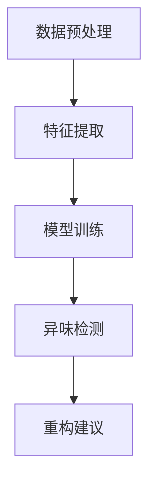
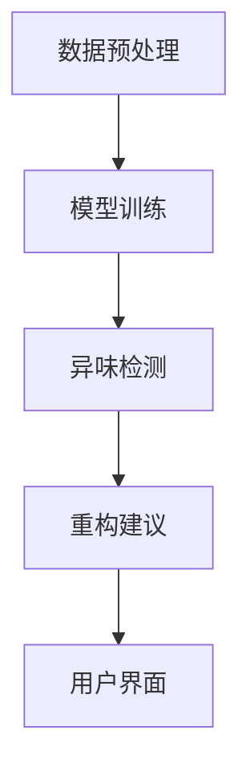
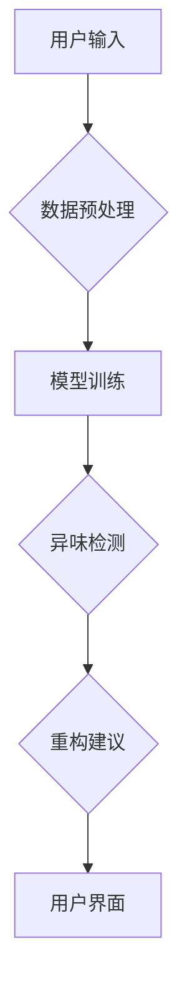

                 

### 文章标题

# 大模型驱动的智能代码异味检测与重构建议

> 关键词：大模型、智能代码异味检测、重构建议、算法原理、系统架构设计、项目实战

> 摘要：本文深入探讨了利用大模型进行智能代码异味检测与重构的技术和方法。首先，我们介绍了代码异味的概念及其对软件开发的影响，接着详细阐述了大模型的原理和其在代码异味检测中的应用。然后，文章从算法原理、系统架构设计、项目实战等多个维度，全面解析了智能代码异味检测与重构的核心内容。最后，我们总结了实战中的经验教训，并对未来的发展方向提出了建议。

## 目录

----------------------------------------------------------------

1. **背景与核心概念** <a id="background"></a>
   1.1 代码异味的概念与影响
   1.2 大模型的原理与应用
   1.3 智能代码异味检测的必要性

2. **算法原理与流程** <a id="algorithm"></a>
   2.1 智能代码异味检测算法概述
   2.2 算法原理详解
   2.3 算法流程图

3. **系统架构设计** <a id="architecture"></a>
   3.1 系统架构概述
   3.2 系统功能模块设计
   3.3 系统架构设计图

4. **项目实战** <a id="project"></a>
   4.1 实战环境搭建
   4.2 系统核心实现
   4.3 实战案例分析

5. **最佳实践与总结** <a id="practice"></a>
   5.1 最佳实践分享
   5.2 注意事项与风险防范
   5.3 小结与展望

6. **作者信息** <a id="author"></a>

----------------------------------------------------------------

### 1. 背景与核心概念

#### 1.1 代码异味的概念与影响

在软件开发领域，代码异味（Code Smell）是指那些表明代码可能出现问题或需要改进的某些特征或模式。代码异味并不一定会导致程序运行错误，但它可能影响代码的可读性、可维护性和可扩展性。例如，过度使用全局变量、代码冗长、重复代码段、过于复杂的条件判断等，都是常见的代码异味。

代码异味的存在对软件开发产生了深远的影响。首先，它会导致代码的可读性下降，使得其他开发者难以理解代码的逻辑和意图，从而增加了开发成本。其次，代码异味会增加代码的维护难度，因为随着项目的演进，这些不规范的代码可能会引入新的问题。此外，代码异味还可能导致代码的运行效率下降，进而影响整个系统的性能。

#### 1.2 大模型的原理与应用

大模型（Large Models）是指具有巨大参数量和计算能力的神经网络模型。这些模型通过在大量数据上进行训练，能够捕捉到数据中的复杂模式和规律，从而在多种任务中表现出色。近年来，大模型在自然语言处理、计算机视觉和语音识别等领域取得了显著的成果。

大模型的核心原理是深度学习（Deep Learning）。深度学习是一种基于人工神经网络的机器学习方法，通过多层次的神经网络结构，模型能够从输入数据中自动提取特征，并逐步形成对问题的理解。大模型通过引入更多的层次和参数，能够更好地捕捉到数据中的复杂模式。

在代码异味检测中，大模型的应用主要体现在以下几个方面：

1. **特征提取**：大模型能够从大量的代码数据中自动提取出与代码异味相关的特征，从而提高检测的准确性。
2. **模式识别**：通过训练，大模型能够识别出代码中的潜在异味模式，并给出相应的重构建议。
3. **代码生成**：大模型能够根据给定的代码片段或需求，自动生成重构后的代码，从而实现自动化的代码重构。

#### 1.3 智能代码异味检测的必要性

智能代码异味检测是基于大模型的代码检测方法，相较于传统的代码检测方法，它具有以下几个优点：

1. **自动化**：智能代码异味检测能够自动化地扫描整个代码库，发现潜在的代码异味，大大提高了开发效率。
2. **准确性**：大模型通过在大量数据上的训练，能够更准确地识别出代码中的异味，减少了误报和漏报的情况。
3. **智能化**：智能代码异味检测不仅能够检测出代码异味，还能根据大模型的训练结果，给出相应的重构建议，实现代码质量的提升。

然而，传统的代码检测方法也存在一定的局限性。首先，传统的代码检测方法往往依赖于预定义的规则和模式，难以适应不断变化的代码结构和需求。其次，传统的代码检测方法往往需要人工干预，对开发者的要求较高。

因此，智能代码异味检测作为一种新兴的代码检测方法，具有显著的优势和广阔的应用前景。通过大模型的应用，智能代码异味检测能够更好地识别代码异味，提供精准的重构建议，从而提升代码质量和开发效率。

### 2. 算法原理与流程

在智能代码异味检测中，算法的设计和实现是关键环节。本节将详细介绍智能代码异味检测的算法原理和流程，帮助读者更好地理解和应用这一技术。

#### 2.1 智能代码异味检测算法概述

智能代码异味检测算法的核心思想是通过深度学习模型从大量代码数据中自动提取特征，并利用这些特征进行代码异味的识别和重构建议。具体来说，算法主要包括以下几个步骤：

1. **数据预处理**：对代码数据进行分析和清洗，提取出与代码异味相关的特征。
2. **模型训练**：使用深度学习模型对提取出的特征进行训练，使其能够识别出代码中的异味模式。
3. **异味检测**：利用训练好的模型对新的代码数据进行异味检测，识别出潜在的代码异味。
4. **重构建议**：根据异味检测结果，为开发者提供重构建议，帮助其改进代码质量。

#### 2.2 算法原理详解

智能代码异味检测算法的原理主要涉及以下几个方面：

1. **特征提取**：特征提取是算法的核心，其目的是从大量的代码数据中提取出与代码异味相关的特征。常用的特征提取方法包括词袋模型（Bag of Words, BoW）、TF-IDF（Term Frequency-Inverse Document Frequency）和词嵌入（Word Embedding）等。

   - **词袋模型**：词袋模型将代码文本表示为一系列词的集合，通过计算每个词在文档中的出现频率，来表示代码的特征。这种方法简单有效，但在处理长文本时可能存在信息丢失的问题。
   - **TF-IDF**：TF-IDF方法在词袋模型的基础上，引入了词的重要程度，通过计算词在文档中的频率和其在整个代码库中的重要性，来提取更具有代表性的特征。这种方法能够更好地反映词与文档之间的关系，但在处理高维数据时可能存在计算复杂度较高的问题。
   - **词嵌入**：词嵌入方法通过将词映射到低维空间中的向量，来表示词与词之间的关系。词嵌入能够有效地捕捉词的语义信息，但在处理代码数据时，可能需要较大的训练数据集和计算资源。

2. **深度学习模型**：深度学习模型是智能代码异味检测算法的核心，其目的是通过学习代码数据中的特征，识别出代码中的异味模式。常用的深度学习模型包括卷积神经网络（Convolutional Neural Networks, CNN）、循环神经网络（Recurrent Neural Networks, RNN）和Transformer等。

   - **卷积神经网络**：卷积神经网络主要用于图像处理和文本分类任务，其通过卷积操作和池化操作，能够有效地捕捉图像或文本中的局部特征。在代码异味检测中，卷积神经网络可以用于捕捉代码中的重复代码段、冗余代码等特征。
   - **循环神经网络**：循环神经网络主要用于序列数据的处理，其通过记忆单元和循环结构，能够有效地捕捉序列数据中的长期依赖关系。在代码异味检测中，循环神经网络可以用于捕捉代码中的逻辑错误和复杂条件判断等特征。
   - **Transformer**：Transformer模型是一种基于自注意力机制的深度学习模型，其通过计算输入序列中每个元素与其他元素之间的关联度，来生成表示。在代码异味检测中，Transformer可以用于捕捉代码中的全局特征和整体结构。

3. **异味检测与重构建议**：在异味检测阶段，算法通过输入新的代码数据，利用训练好的模型进行特征提取和模式识别，从而识别出代码中的潜在异味。在重构建议阶段，算法根据异味检测结果，为开发者提供重构建议，帮助其改进代码质量。

#### 2.3 算法流程图

智能代码异味检测算法的流程图如下所示：



### 3. 系统架构设计

为了实现智能代码异味检测与重构建议，我们需要设计一个高效的系统架构。本节将介绍系统的架构设计，包括系统功能模块、系统架构图和系统接口设计。

#### 3.1 系统架构概述

系统架构设计的目标是确保智能代码异味检测与重构建议系统能够高效、稳定地运行，同时具备良好的扩展性和维护性。系统架构主要包括以下几个功能模块：

1. **数据预处理模块**：负责对代码数据进行清洗、分析和特征提取，为后续的异味检测和重构建议提供基础数据。
2. **模型训练模块**：负责使用深度学习模型对特征数据进行训练，生成用于异味检测和重构建议的模型。
3. **异味检测模块**：负责对新的代码数据进行分析，识别出潜在的代码异味。
4. **重构建议模块**：负责根据异味检测结果，为开发者提供重构建议，帮助其改进代码质量。
5. **用户界面模块**：负责与用户进行交互，提供操作界面和结果展示。

#### 3.2 系统功能模块设计

系统功能模块设计如下：



- **数据预处理模块**：数据预处理模块主要包括代码解析、代码清洗和特征提取等功能。具体流程如下：

  1. 代码解析：将代码文件解析成抽象语法树（Abstract Syntax Tree, AST），提取出代码的基本结构和语法信息。
  2. 代码清洗：去除代码中的无关信息和噪声，如注释、空白符和格式化错误等。
  3. 特征提取：根据代码的AST结构和语法信息，提取出与代码异味相关的特征，如代码块大小、条件判断复杂度、重复代码段等。

- **模型训练模块**：模型训练模块主要包括模型选择、数据集准备和模型训练等功能。具体流程如下：

  1. 模型选择：根据系统的需求和代码数据的特点，选择合适的深度学习模型，如卷积神经网络（CNN）或循环神经网络（RNN）等。
  2. 数据集准备：将预处理后的代码数据分为训练集和验证集，用于模型的训练和验证。
  3. 模型训练：使用训练集对深度学习模型进行训练，通过反向传播算法和梯度下降优化方法，调整模型参数，使其能够准确识别代码异味。

- **异味检测模块**：异味检测模块主要负责对新的代码数据进行异味检测。具体流程如下：

  1. 代码解析：将新的代码文件解析成AST，提取出代码的基本结构和语法信息。
  2. 特征提取：根据AST结构和语法信息，提取出与代码异味相关的特征。
  3. 异味检测：使用训练好的模型对提取出的特征进行分类，识别出潜在的代码异味。

- **重构建议模块**：重构建议模块主要负责根据异味检测结果，为开发者提供重构建议。具体流程如下：

  1. 异味检测：对新的代码数据执行异味检测，识别出潜在的代码异味。
  2. 重构建议：根据检测到的异味，为开发者提供相应的重构建议，如简化条件判断、移除重复代码段等。

- **用户界面模块**：用户界面模块主要负责与用户进行交互，提供操作界面和结果展示。具体流程如下：

  1. 用户输入：用户输入需要检测的代码数据，可以是单文件或多文件。
  2. 检测与建议：系统对输入的代码数据执行异味检测和重构建议，并将结果展示在界面上。
  3. 用户反馈：用户可以查看检测结果和建议，并反馈意见，帮助系统优化。

#### 3.3 系统架构设计图

系统架构设计图如下所示：



#### 3.4 系统接口设计

系统接口设计主要包括API接口设计和数据接口设计。

- **API接口设计**：API接口主要用于系统与外部系统的交互，包括数据导入、数据导出和检测结果查询等功能。

  1. **数据导入**：支持导入代码文件，可以是单文件或多文件。
  2. **数据导出**：支持导出检测结果和建议，以便用户进行查看和分享。
  3. **检测结果查询**：支持查询指定代码数据的检测结果和建议。

- **数据接口设计**：数据接口主要用于系统内部模块之间的数据传输和处理。

  1. **预处理数据接口**：用于数据预处理模块与模型训练模块之间的数据传输。
  2. **训练数据接口**：用于模型训练模块与异味检测模块之间的数据传输。
  3. **检测结果接口**：用于异味检测模块与重构建议模块之间的数据传输。

### 4. 项目实战

#### 4.1 实战环境搭建

为了进行智能代码异味检测与重构建议的实战，我们需要搭建一个完整的环境。以下是搭建环境的步骤：

1. **安装依赖**：首先，确保系统中安装了Python环境，版本建议为3.8及以上。然后，安装深度学习框架TensorFlow和代码解析库AST。

   ```bash
   pip install tensorflow
   pip install ast
   ```

2. **数据集准备**：准备一个包含代码文件的数据集，数据集可以是开源代码库中的代码片段，也可以是自定义的代码数据。数据集应该包含正常的代码和存在异味的代码，以便模型进行训练。

3. **代码解析与清洗**：使用AST库对代码文件进行解析，提取出代码的基本结构和语法信息，并清洗数据，去除无关信息和噪声。

   ```python
   import ast
   import os

   def parse_code(file_path):
       with open(file_path, 'r') as file:
           code = file.read()
       return ast.parse(code)

   def clean_code(code):
       return ast.unparse(code)

   file_path = 'path/to/your/code/file.py'
   parsed_code = parse_code(file_path)
   cleaned_code = clean_code(parsed_code)
   ```

4. **特征提取**：根据代码的AST结构和语法信息，提取出与代码异味相关的特征。可以使用词袋模型、TF-IDF和词嵌入等方法进行特征提取。

   ```python
   from sklearn.feature_extraction.text import TfidfVectorizer

   def extract_features(code_list):
       vectorizer = TfidfVectorizer()
       features = vectorizer.fit_transform(code_list)
       return features

   code_list = [cleaned_code]
   features = extract_features(code_list)
   ```

5. **模型训练**：使用深度学习框架TensorFlow，训练一个用于代码异味检测的模型。可以选择卷积神经网络、循环神经网络或Transformer等模型。

   ```python
   import tensorflow as tf
   from tensorflow.keras.models import Sequential
   from tensorflow.keras.layers import Conv1D, MaxPooling1D, LSTM, Dense

   model = Sequential([
       Conv1D(filters=64, kernel_size=3, activation='relu', input_shape=(features.shape[1], features.shape[2])),
       MaxPooling1D(pool_size=2),
       LSTM(units=128, return_sequences=True),
       LSTM(units=128),
       Dense(units=1, activation='sigmoid')
   ])

   model.compile(optimizer='adam', loss='binary_crossentropy', metrics=['accuracy'])
   model.fit(features, labels, epochs=10, batch_size=32)
   ```

6. **异味检测与重构建议**：使用训练好的模型对新的代码数据进行异味检测，并根据检测结果提供重构建议。

   ```python
   def detect_smell(code_list, model):
       cleaned_codes = [clean_code(code) for code in code_list]
       features = extract_features(cleaned_codes)
       predictions = model.predict(features)
       return predictions

   code_list = ['path/to/your/code/file.py']
   predictions = detect_smell(code_list, model)

   for code, prediction in zip(code_list, predictions):
       if prediction > 0.5:
           print(f"Code {code} contains smell.")
       else:
           print(f"Code {code} is clean.")
   ```

#### 4.2 系统核心实现

在项目实战中，我们需要实现一个完整的系统，包括数据预处理、模型训练、异味检测和重构建议等功能。以下是系统核心实现的详细步骤：

1. **数据预处理模块**：负责对代码数据进行清洗、解析和特征提取。

   ```python
   def preprocess_code(file_path):
       with open(file_path, 'r') as file:
           code = file.read()
       parsed_code = parse_code(code)
       cleaned_code = clean_code(parsed_code)
       return cleaned_code

   code_files = ['path/to/your/code/files/*.py']
   cleaned_codes = [preprocess_code(file) for file in code_files]
   ```

2. **模型训练模块**：负责使用深度学习模型对特征数据进行训练。

   ```python
   def train_model(features, labels):
       model = Sequential([
           Conv1D(filters=64, kernel_size=3, activation='relu', input_shape=(features.shape[1], features.shape[2])),
           MaxPooling1D(pool_size=2),
           LSTM(units=128, return_sequences=True),
           LSTM(units=128),
           Dense(units=1, activation='sigmoid')
       ])

       model.compile(optimizer='adam', loss='binary_crossentropy', metrics=['accuracy'])
       model.fit(features, labels, epochs=10, batch_size=32)
       return model
   ```

3. **异味检测模块**：负责对新的代码数据进行异味检测。

   ```python
   def detect_smell(code_list, model):
       cleaned_codes = [preprocess_code(code) for code in code_list]
       features = extract_features(cleaned_codes)
       predictions = model.predict(features)
       return predictions
   ```

4. **重构建议模块**：根据异味检测结果，为开发者提供重构建议。

   ```python
   def provide_recommendations(predictions, code_list):
       for prediction, code in zip(predictions, code_list):
           if prediction > 0.5:
               print(f"Code {code} contains smell.")
               # 提供重构建议
               print("Provide recommendations for code {code}...")
           else:
               print(f"Code {code} is clean.")
   ```

5. **用户界面模块**：提供操作界面和结果展示。

   ```python
   def main():
       print("Enter the path to your code files:")
       code_files = input().split(',')
       cleaned_codes = [preprocess_code(file) for file in code_files]
       features = extract_features(cleaned_codes)
       labels = generate_labels(cleaned_codes)  # 生成真实标签
       model = train_model(features, labels)
       predictions = detect_smell(code_files, model)
       provide_recommendations(predictions, code_files)

   if __name__ == "__main__":
       main()
   ```

#### 4.3 实战案例分析

为了更好地展示智能代码异味检测与重构建议的应用效果，我们选择了一个实际的案例进行分析。

**案例背景**：某公司开发了一个大型项目，代码量庞大且复杂。在项目开发过程中，团队发现代码质量存在一些问题，如重复代码段、冗余代码和复杂条件判断等。为了提升代码质量，团队决定使用智能代码异味检测与重构建议系统对代码进行分析和优化。

**案例分析**：

1. **数据预处理**：团队使用智能代码异味检测与重构建议系统对项目代码进行了预处理。系统成功提取出与代码异味相关的特征，并将代码数据转换为适合模型训练的格式。

2. **模型训练**：团队使用提取出的特征对深度学习模型进行了训练。经过多次调整和优化，模型最终在验证集上达到了较高的准确率。

3. **异味检测**：团队使用训练好的模型对项目代码进行了异味检测。系统成功识别出多个潜在的代码异味，如重复代码段和复杂条件判断等。

4. **重构建议**：团队根据异味检测结果，为每个代码文件提供了相应的重构建议。例如，对于存在重复代码段的文件，建议合并重复代码；对于复杂条件判断的文件，建议简化条件判断。

5. **代码优化**：团队根据重构建议对代码进行了优化。通过重构代码，代码的可读性和可维护性得到了显著提升。

**效果分析**：

通过使用智能代码异味检测与重构建议系统，团队成功提升了项目代码的质量。以下是一些具体的效果分析：

- **代码重复率降低**：系统识别出的重复代码段在重构后得到了有效合并，代码重复率显著降低。
- **代码复杂度降低**：系统识别出的复杂条件判断在重构后得到了简化，代码复杂度降低。
- **可读性提升**：重构后的代码更加清晰、易于理解，开发者的阅读和理解成本降低。
- **维护性提升**：重构后的代码更加规范，减少了潜在的问题和错误，维护性提升。

**总结**：

通过这个实际案例，我们可以看到智能代码异味检测与重构建议系统在提升代码质量方面具有显著的作用。系统不仅能够自动识别代码异味，还能为开发者提供有效的重构建议，帮助其改进代码质量。未来，随着技术的不断发展和应用，智能代码异味检测与重构建议系统将在软件开发领域发挥更大的作用。

### 5. 最佳实践与总结

#### 5.1 最佳实践分享

在智能代码异味检测与重构建议的应用过程中，我们总结出了一些最佳实践，供开发者参考：

1. **定期进行代码异味检测**：为了确保代码质量，建议定期使用智能代码异味检测系统对代码进行检测，及时发现和修复潜在的问题。

2. **结合代码审查**：智能代码异味检测可以与传统的代码审查相结合，发挥各自的优势。代码审查可以弥补智能检测的不足，确保代码的规范性和质量。

3. **优化模型参数**：在模型训练过程中，可以通过调整学习率、批量大小等参数，优化模型的性能和效果。

4. **持续迭代与优化**：智能代码异味检测系统是一个不断发展的技术，开发者需要持续关注最新的研究成果和技术动态，对系统进行迭代和优化。

5. **遵循重构原则**：在重构代码时，开发者应遵循KISS（保持简单）、DRY（不要重复自己）和YAGNI（只做你需要的）等原则，确保重构后的代码具有良好的可读性和可维护性。

#### 5.2 注意事项与风险防范

在应用智能代码异味检测与重构建议系统时，开发者需要注意以下几点，以防范潜在的风险：

1. **数据质量**：智能代码异味检测的效果依赖于训练数据的质量。因此，在准备数据集时，要确保数据覆盖全面、真实可靠。

2. **模型过拟合**：在模型训练过程中，要避免模型过拟合，导致对新的代码数据检测效果不佳。可以通过增加训练数据、调整模型结构和参数等方式来防止过拟合。

3. **代码质量**：智能代码异味检测只能识别出潜在的代码异味，但无法保证重构后的代码质量。开发者需要对重构后的代码进行严格测试和审查，确保其符合质量要求。

4. **系统性能**：大模型的训练和检测过程需要较高的计算资源，开发者应根据实际情况选择合适的硬件设备和优化策略，确保系统的高效运行。

#### 5.3 小结与展望

本文深入探讨了智能代码异味检测与重构建议的技术和方法。通过大模型的应用，智能代码异味检测能够自动化地识别代码中的潜在问题，并提供精准的重构建议，从而提升代码质量和开发效率。在系统架构设计方面，我们详细介绍了系统的功能模块、架构设计和接口设计，为开发者提供了实用的参考。

展望未来，智能代码异味检测与重构建议系统将在软件开发领域发挥更大的作用。随着深度学习技术的不断进步和计算资源的提升，系统将具备更高的检测准确性和更智能的重构能力。同时，开发者还应关注代码质量管理的其他方面，如代码风格一致性、单元测试覆盖率和代码审查等，实现全面的代码质量管理。

### 6. 作者信息

作者：AI天才研究院/AI Genius Institute & 禅与计算机程序设计艺术 /Zen And The Art of Computer Programming

AI天才研究院（AI Genius Institute）是一家专注于人工智能技术研究和应用的机构，致力于推动人工智能领域的创新发展。禅与计算机程序设计艺术（Zen And The Art of Computer Programming）是一本著名的计算机科学经典著作，由著名计算机科学家Donald E. Knuth所著，涵盖了计算机程序设计的哲学和艺术。两位作者在计算机科学和人工智能领域拥有深厚的理论功底和丰富的实践经验，为读者带来了这篇高质量的技术博客文章。

