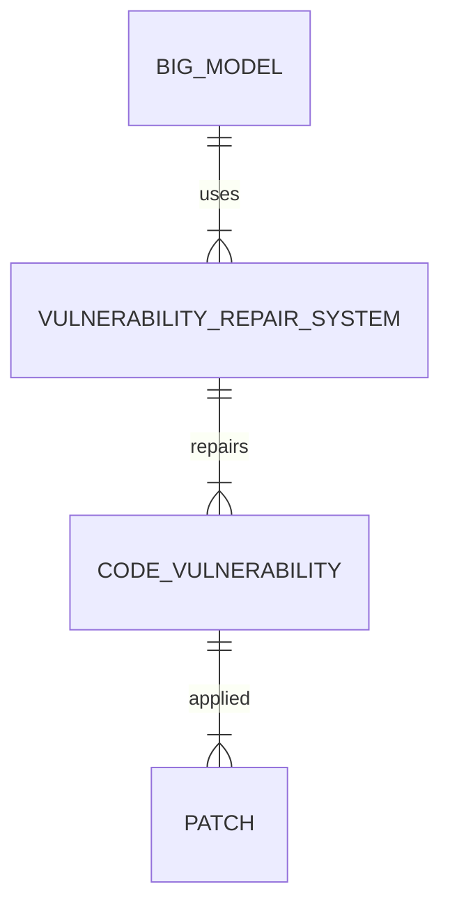
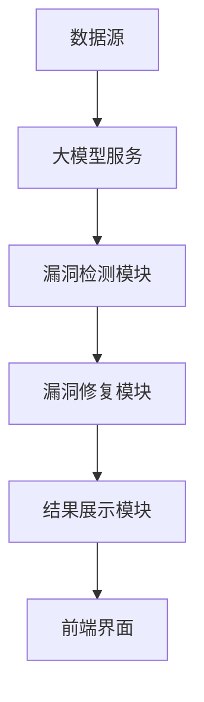
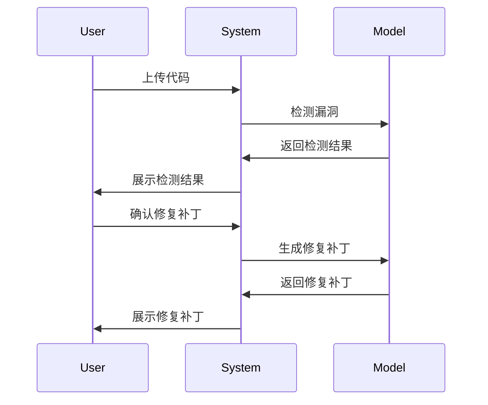

                 

### 1. 引言

#### 1.1 问题的背景

随着互联网的迅猛发展，软件系统变得日益复杂和庞大，这无疑为开发者带来了前所未有的挑战。软件系统不仅需要应对多样化的业务需求，还需要保证其安全性、稳定性和可靠性。在这样的背景下，代码漏洞检测与修复成为了软件开发过程中至关重要的一环。

代码漏洞的存在可能带来严重的后果，如数据泄露、系统崩溃、恶意攻击等。一旦发生漏洞攻击，可能会导致巨大的经济损失和声誉损害。因此，如何高效地发现并修复代码漏洞，已经成为了一个亟需解决的问题。

#### 1.2 问题描述

代码漏洞修复的传统方法主要依赖于静态代码分析和动态测试。静态代码分析通过检查代码的语法、语义和结构，来发现潜在的漏洞。动态测试则通过运行代码并监控其行为，来检测漏洞。这两种方法各有优缺点，但都无法完全解决代码漏洞修复的问题。

静态代码分析存在局限性，因为它无法理解代码的运行环境和上下文，可能导致误报和漏报。动态测试虽然能够模拟真实环境，但测试过程通常耗时且成本高昂，且难以覆盖所有的执行路径。

#### 1.3 问题解决的重要性

随着人工智能技术的飞速发展，大模型（Large Models）的应用逐渐成为解决代码漏洞修复问题的重要手段。大模型具有强大的表示和学习能力，可以通过对大量代码库的训练，学习到代码的复杂结构和潜在模式。这为智能代码漏洞修复提供了一种全新的思路。

智能代码漏洞修复的目标是利用大模型自动生成漏洞修复代码，提高漏洞检测和修复的效率和准确性。这不仅能够减少开发者的工作负担，还能够提高代码质量和系统的安全性。

#### 1.4 边界与外延

在本文中，我们将探讨大模型驱动的智能代码漏洞修复技术的核心概念、基本原理、应用场景和实践方法。本文主要关注以下问题：

- 大模型的定义、特点及与传统模型的对比。
- 智能代码漏洞修复的概念及其重要性。
- 大模型在智能代码漏洞修复中的优势和挑战。
- 智能代码漏洞修复的系统架构设计与实现。
- 实际项目中的应用案例和实践经验。

本文旨在为读者提供一份全面、系统的指南，帮助理解和应用大模型驱动的智能代码漏洞修复技术，推动软件安全领域的创新和发展。

### 2. 核心概念与联系

在深入探讨大模型驱动的智能代码漏洞修复之前，我们需要明确一些核心概念，并探讨这些概念之间的联系。这些核心概念包括大模型、智能代码漏洞修复、数学模型与算法原理等。

#### 2.1 大模型的定义与特点

大模型（Large Models）通常指的是具有数十亿甚至千亿参数规模的深度学习模型。这些模型通过在大量数据上进行训练，能够学习到复杂的数据分布和潜在模式。与传统的机器学习模型相比，大模型具有以下几个显著特点：

1. **参数规模庞大**：大模型具有数十亿到千亿级别的参数，这使得它们能够处理复杂的数据结构和模式。
2. **强大的表示能力**：大模型能够通过参数的分布式表示，捕捉到数据的细微变化和复杂关系。
3. **自适应性**：大模型在训练过程中不断调整参数，以适应新的数据和任务需求。
4. **跨领域迁移能力**：大模型通过在多个任务上的训练，可以迁移到不同的领域和任务，实现跨领域的泛化能力。

#### 2.1.2 大模型的特点

大模型的特点可以从以下几个方面进行阐述：

1. **高计算资源需求**：由于参数规模庞大，大模型对计算资源和存储资源的需求非常高，通常需要高性能的硬件支持。
2. **长训练周期**：大模型的训练过程通常需要数天甚至数周的时间，这要求高效的训练算法和优化策略。
3. **数据依赖性**：大模型的性能很大程度上依赖于训练数据的质量和数量。因此，如何获取和利用高质量的数据成为大模型研究的重要课题。
4. **可解释性挑战**：大模型通过复杂的神经网络结构进行数据学习，其内部机制相对难以解释。如何提高大模型的可解释性，是当前研究的一个重要方向。

#### 2.1.3 大模型与传统模型的对比

大模型与传统模型在多个方面存在显著差异。以下是一个简化的对比表格：

| 特征 | 大模型 | 传统模型 |
| --- | --- | --- |
| 参数规模 | 十亿至千亿级 | 百万至千级 |
| 表示能力 | 高度复杂和抽象 | 简单和具体 |
| 训练时间 | 数天至数周 | 数小时至数天 |
| 数据需求 | 高质量、大量 | 高质量、少量 |
| 迁移能力 | 跨领域泛化 | 领域特定 |

从表格中可以看出，大模型在参数规模、表示能力和训练时间等方面具有显著优势。然而，传统模型在数据需求、可解释性等方面也有其独特的优势。

#### 2.2 ER实体关系图架构

为了更好地理解大模型在智能代码漏洞修复系统中的角色，我们可以使用ER（实体-关系）图来描述系统的核心实体及其关系。以下是一个简化的ER图：



在该ER图中，`BIG_MODEL`代表大模型，`VULNERABILITY_REPAIR_SYSTEM`代表漏洞修复系统，`CODE_VULNERABILITY`代表代码漏洞，`PATCH`代表修复补丁。大模型通过`VULNERABILITY_REPAIR_SYSTEM`与`CODE_VULNERABILITY`进行交互，生成`PATCH`以修复漏洞。

#### 2.3 智能代码漏洞修复的概念

智能代码漏洞修复是一种利用人工智能技术，特别是大模型，来自动检测和修复代码漏洞的方法。智能代码漏洞修复系统通常包括以下几个关键组成部分：

1. **漏洞检测模块**：利用大模型对代码进行静态分析，识别潜在的漏洞。
2. **漏洞修复模块**：利用大模型生成修复补丁，自动修复检测到的漏洞。
3. **结果展示模块**：将漏洞检测结果和修复补丁展示给开发者，以便进行审查和确认。

通过这三个模块的协同工作，智能代码漏洞修复系统能够高效地检测和修复代码漏洞，提高软件系统的安全性。

#### 2.4 大模型在智能代码漏洞修复中的优势与挑战

大模型在智能代码漏洞修复中具有显著的优势，包括：

1. **高效性**：大模型能够快速地处理大规模代码库，提高漏洞检测和修复的效率。
2. **准确性**：大模型通过对大量代码的训练，能够更好地理解代码的结构和语义，减少误报和漏报。
3. **泛化能力**：大模型具有跨领域的迁移能力，可以应用于不同的编程语言和开发环境。

然而，大模型在智能代码漏洞修复中也面临着一些挑战，包括：

1. **计算资源需求**：大模型的训练和推理需要大量的计算资源，这对硬件设备提出了较高的要求。
2. **数据依赖性**：大模型的性能依赖于高质量和多样化的训练数据，数据的获取和处理成为研究的重点。
3. **可解释性**：大模型内部机制复杂，如何提高其可解释性，使其更易于被开发者理解和接受，是当前研究的重要方向。

通过深入理解大模型及其在智能代码漏洞修复中的应用，我们可以更好地应对上述挑战，发挥大模型在代码漏洞修复中的巨大潜力。

### 3. 智能代码漏洞修复的基本原理

智能代码漏洞修复是一种利用人工智能技术来自动发现和修复代码漏洞的方法。其基本原理涉及对代码的深入分析，通过构建数学模型和算法，实现对漏洞的检测和修复。本节将详细介绍智能代码漏洞修复的基本原理，包括概念定义、重要性、数学模型与算法原理，以及具体实例分析。

#### 3.1 智能代码漏洞修复的概念

智能代码漏洞修复是指利用人工智能技术，特别是深度学习和自然语言处理技术，来自动分析代码，识别潜在的漏洞，并生成修复补丁。智能代码漏洞修复的关键组成部分包括：

1. **漏洞检测模块**：利用机器学习模型对代码进行静态分析，识别可能的漏洞。这一过程通常涉及代码解析、抽象语法树（AST）分析、模式匹配等。
2. **漏洞修复模块**：利用生成的模型或算法，自动生成修复补丁。修复补丁可以通过修改代码、插入安全措施等方式，提高代码的安全性。
3. **结果展示模块**：将检测到的漏洞和生成的修复补丁展示给开发者，以便进行审查和确认。

智能代码漏洞修复的目标是提高软件开发过程中的效率和安全性，减少人工干预，降低漏洞修复的成本。

#### 3.1.2 智能代码漏洞修复的重要性

智能代码漏洞修复在软件开发过程中具有重要意义，主要体现在以下几个方面：

1. **提高开发效率**：传统的代码漏洞修复通常需要大量的时间和人力，而智能代码漏洞修复可以自动化地检测和修复漏洞，显著提高开发效率。
2. **降低成本**：自动化漏洞修复减少了人工干预的需求，从而降低了漏洞修复的成本。
3. **提高安全性**：智能代码漏洞修复能够更全面、准确地识别和修复漏洞，提高软件系统的安全性，减少潜在的安全威胁。
4. **减少误报和漏报**：智能代码漏洞修复系统通过对大量代码数据的训练，能够学习到代码的复杂结构和潜在模式，降低误报和漏报率，提高检测的准确性。

#### 3.2 数学模型与算法原理

智能代码漏洞修复的核心在于构建一个能够准确识别漏洞并生成有效修复补丁的数学模型。以下是几个关键组成部分：

##### 3.2.1 数学模型

智能代码漏洞修复的数学模型通常基于以下两个方面：

1. **编码器-解码器模型**：编码器（Encoder）将代码转换为固定长度的向量表示，解码器（Decoder）则利用这些向量生成修复补丁。典型的编码器-解码器模型包括Transformer、BERT等。
2. **生成对抗网络（GAN）**：GAN通过生成器（Generator）和判别器（Discriminator）的对抗训练，生成高质量的代码补丁。生成器尝试生成与真实补丁相似的代码，而判别器则区分真实补丁和生成补丁。

##### 3.2.2 算法原理讲解

智能代码漏洞修复的算法原理可以概括为以下几个步骤：

1. **代码输入**：将待检测的代码输入到编码器中，编码器对代码进行编码，生成固定长度的向量表示。
2. **漏洞检测**：解码器利用编码后的向量，生成潜在的漏洞检测结果。通过对比检测结果和已知漏洞库，判断代码中是否存在漏洞。
3. **漏洞修复**：对于检测到的漏洞，解码器生成修复补丁。修复补丁可以是直接的代码修改，也可以是插入额外的安全措施。
4. **结果展示**：将漏洞检测结果和修复补丁展示给开发者，以便进行审查和确认。

##### 3.2.2.1 梯度下降算法的详细讲解

梯度下降算法是机器学习中的核心优化算法之一，用于最小化损失函数。以下是梯度下降算法的基本原理和步骤：

1. **损失函数**：损失函数用于衡量预测值与真实值之间的差距。在智能代码漏洞修复中，损失函数可以是漏洞检测的准确率、修复补丁的代码质量等。
2. **前向传播**：将输入代码通过编码器编码成向量表示，解码器生成漏洞检测结果和修复补丁。
3. **反向传播**：计算损失函数关于模型参数的梯度，并更新模型参数，以最小化损失函数。
4. **迭代优化**：重复前向传播和反向传播，逐步优化模型参数，直至达到预设的损失函数值或达到最大迭代次数。

##### 3.2.2.2 反向传播算法的详细讲解

反向传播算法是梯度下降算法的核心步骤之一，用于计算损失函数关于模型参数的梯度。以下是反向传播算法的基本原理和步骤：

1. **前向传播**：将输入代码通过编码器编码成向量表示，解码器生成漏洞检测结果和修复补丁。
2. **计算输出误差**：计算解码器输出的漏洞检测结果和实际漏洞之间的误差，以及修复补丁和理想修复之间的误差。
3. **误差反向传播**：从输出层开始，逐层计算误差关于模型参数的梯度。误差反向传播的过程利用链式法则，将误差从输出层传递到输入层。
4. **参数更新**：利用计算得到的梯度，更新模型参数，以减少损失函数值。

通过上述算法原理和步骤，智能代码漏洞修复系统能够高效地检测和修复代码漏洞。接下来，我们将通过具体实例进一步说明这些原理的实际应用。

#### 3.3 具体实例分析

为了更好地理解智能代码漏洞修复的基本原理，我们可以通过一个简单的实例来进行分析。

假设我们使用一个编码器-解码器模型来修复一个简单的代码漏洞。代码如下：

```python
def calculate(a, b):
    return a / b
```

这个函数的漏洞在于，当`b`为0时，代码会引发一个除以零的错误。

1. **代码输入**：将上述代码输入到编码器中，编码器将其编码成一个向量表示。
2. **漏洞检测**：解码器利用编码后的向量，生成漏洞检测结果。假设解码器判断出这段代码存在除以零的漏洞。
3. **漏洞修复**：解码器生成修复补丁，将代码修改为：

```python
def calculate(a, b):
    if b == 0:
        return "Error: Division by zero"
    else:
        return a / b
```

4. **结果展示**：将漏洞检测结果和修复补丁展示给开发者，以便进行审查和确认。

通过这个实例，我们可以看到智能代码漏洞修复系统的基本工作流程，包括代码输入、漏洞检测、漏洞修复和结果展示。这些步骤通过数学模型和算法原理的实现，能够自动识别和修复代码漏洞，提高软件开发的安全性和效率。

总之，智能代码漏洞修复是一种利用人工智能技术来自动化代码漏洞检测和修复的方法。通过构建数学模型和算法，智能代码漏洞修复系统能够高效、准确地检测和修复代码漏洞，提高软件系统的安全性和可靠性。在接下来的章节中，我们将进一步探讨大模型在智能代码漏洞修复中的应用，以及具体的项目实践。

### 4. 大模型在智能代码漏洞修复中的应用

大模型在智能代码漏洞修复中的应用具有显著的优势和潜力。本节将详细介绍大模型在智能代码漏洞修复中的具体应用，包括主流大模型简介、大模型在漏洞修复中的优势与挑战，以及实际应用案例。

#### 4.1 主流大模型简介

当前，主流大模型主要包括GPT（Generative Pre-trained Transformer）系列模型、BERT（Bidirectional Encoder Representations from Transformers）及其变体。以下是一些知名的大模型及其特点：

1. **GPT系列模型**：GPT模型由OpenAI开发，具有强大的文本生成和语言理解能力。GPT-3是当前最大的语言模型，拥有1750亿个参数，可以生成高质量的自然语言文本。
2. **BERT模型**：BERT模型由Google开发，是一种预训练的深度学习模型，通过同时考虑前文和后文信息，实现了对文本的深层理解。BERT及其变体（如RoBERTa、ALBERT）在多种自然语言处理任务上取得了优异的性能。
3. **T5（Text-to-Text Transfer Transformer）模型**：T5模型由Google开发，是一种通用的文本转换模型，可以将任意输入文本转换为任意输出文本。T5具有强大的文本生成和文本转换能力。
4. **Gopher**：Gopher是微软开发的第一个基于混合专家网络（Mixture of Experts，MoE）的模型，具有极高的计算效率和参数规模。Gopher在语言理解和生成任务上表现出色。

这些大模型通过在大量数据上进行预训练，具备了强大的语言理解和生成能力，这为智能代码漏洞修复提供了坚实的基础。

#### 4.2 大模型在漏洞修复中的优势

大模型在智能代码漏洞修复中具有以下优势：

1. **强大的表示能力**：大模型具有数十亿级别的参数，能够捕捉到代码中的复杂模式和潜在漏洞。这使得大模型在漏洞检测和修复中具有更高的准确性和泛化能力。
2. **自适应性**：大模型通过在多种任务上的训练，能够自适应地调整参数，适用于不同的漏洞检测和修复场景。这使得大模型具有广泛的应用前景。
3. **跨领域迁移能力**：大模型通过在多个领域的数据训练，可以实现跨领域的漏洞检测和修复。例如，一个在Web应用程序上训练的大模型，可以应用于移动应用、操作系统等不同领域。
4. **自动化生成修复补丁**：大模型可以自动生成修复补丁，减少人工干预。这对于提高开发效率和降低漏洞修复成本具有重要意义。

#### 4.3 大模型在漏洞修复中的挑战

尽管大模型在智能代码漏洞修复中具有显著优势，但也面临着一些挑战：

1. **计算资源需求**：大模型的训练和推理需要大量的计算资源，这通常要求高性能的硬件支持。对于中小型企业来说，这可能导致高昂的成本。
2. **数据依赖性**：大模型的性能很大程度上依赖于训练数据的质量和数量。如何获取和利用高质量的数据成为大模型研究的重要课题。
3. **可解释性**：大模型通过复杂的神经网络结构进行数据学习，其内部机制相对难以解释。如何提高大模型的可解释性，使其更易于被开发者理解和接受，是当前研究的一个重要方向。
4. **误报和漏报**：大模型在漏洞检测中可能会出现误报和漏报的情况。如何平衡检测的准确性和效率，是一个需要解决的问题。

#### 4.4 实际应用案例

以下是一个实际应用案例，展示大模型在智能代码漏洞修复中的具体应用：

案例：某大型互联网公司使用GPT模型进行代码漏洞修复。

1. **数据准备**：该公司收集了数万个已知的漏洞样本和相应的修复补丁，作为训练数据。
2. **模型训练**：使用GPT模型对训练数据进行预训练，使其具备强大的语言理解和生成能力。
3. **漏洞检测**：将待检测的代码输入到GPT模型中，模型通过分析代码结构和语义，识别潜在的漏洞。
4. **漏洞修复**：对于检测到的漏洞，GPT模型自动生成修复补丁。这些补丁通常具有较高的代码质量和安全性。
5. **结果展示**：将漏洞检测结果和修复补丁展示给开发者，进行审查和确认。

通过这个案例，我们可以看到大模型在智能代码漏洞修复中的具体应用，以及其带来的显著优势。尽管存在一定的挑战，但随着技术的不断进步，大模型在智能代码漏洞修复中的应用前景仍然非常广阔。

总之，大模型在智能代码漏洞修复中具有强大的表示能力和自适应性，能够自动生成高质量的修复补丁，提高开发效率和代码安全性。然而，同时也面临着计算资源需求、数据依赖性和可解释性等挑战。通过不断的研究和实践，我们可以更好地应对这些挑战，充分发挥大模型在智能代码漏洞修复中的潜力。

### 5. 系统分析与架构设计方案

在探讨大模型驱动的智能代码漏洞修复系统的具体实现之前，我们需要对系统进行分析，并设计一个合理的架构方案。本节将详细介绍系统分析与架构设计方案，包括问题场景介绍、项目介绍、系统功能设计、系统架构设计、系统接口设计和系统交互。

#### 5.1 问题场景介绍

在当前的软件开发过程中，代码漏洞检测和修复是一个重要的环节。随着软件系统的日益复杂和庞大，传统的手动漏洞修复方法已经难以满足高效性和准确性的需求。尤其是在大型项目和企业级应用中，代码漏洞的存在可能带来严重的安全风险和业务损失。因此，智能代码漏洞修复系统的引入显得尤为重要。

问题场景主要包括以下几个方面：

1. **代码库规模庞大**：随着项目的发展，代码库会不断增长，包含数百万甚至数千万行代码。这使得手动检测和修复漏洞变得非常困难。
2. **漏洞类型多样**：现代软件系统可能存在各种类型的漏洞，如缓冲区溢出、SQL注入、跨站脚本等。不同类型的漏洞需要不同的修复策略。
3. **修复成本高**：传统的漏洞修复方法通常需要开发者的深入参与，这导致了较高的时间和人力资源消耗。
4. **误报和漏报问题**：手动漏洞修复容易产生误报和漏报，影响开发效率和代码质量。

#### 5.2 项目介绍

本项目的目标是设计并实现一个大模型驱动的智能代码漏洞修复系统，通过自动化手段提高漏洞检测和修复的效率和准确性。系统的主要功能包括：

1. **漏洞检测**：利用大模型对代码进行静态分析，识别潜在的漏洞。
2. **漏洞修复**：自动生成修复补丁，减少人工干预。
3. **结果展示**：将漏洞检测结果和修复补丁展示给开发者，以便进行审查和确认。

项目的预期成果是：

1. **提高开发效率**：通过自动化漏洞修复，减少手动修复的工作量，提高开发效率。
2. **降低修复成本**：自动化漏洞修复系统可以显著降低漏洞修复的成本。
3. **提高代码质量**：通过智能修复补丁，提高代码质量和安全性。
4. **减少误报和漏报**：利用大模型的学习能力，降低漏洞检测的误报和漏报率。

#### 5.2.1 领域模型

为了更好地理解系统的功能结构，我们可以使用Mermaid类图来描述系统的领域模型。以下是领域模型的类图：

```mermaid
classDiagram
Class01 <|-- Class02
Class03 : +int x
Class04 : -int y
Class01 {
    +int z
    +void f()
}
```

在这个类图中，`Class01`表示大模型，`Class02`表示漏洞修复系统，`Class03`表示代码库，`Class04`表示漏洞检测结果和修复补丁。大模型通过漏洞修复系统与代码库进行交互，实现对代码的漏洞检测和修复。

#### 5.2.2 系统架构设计

系统架构设计是确保系统高效、可靠和可扩展的关键。以下是智能代码漏洞修复系统的架构设计：

1. **前端界面**：提供用户交互界面，展示漏洞检测结果和修复补丁。
2. **后端服务**：包括漏洞检测模块、漏洞修复模块和结果展示模块，负责实现具体的业务逻辑。
3. **数据存储**：存储代码库、漏洞库和修复补丁等数据，支持数据的持久化和查询。
4. **大模型服务**：提供大模型训练和推理服务，负责代码的漏洞检测和修复。

系统架构图如下所示：



在这个架构设计中，前端界面与后端服务通过API进行交互。大模型服务负责处理代码的漏洞检测和修复，漏洞检测模块和漏洞修复模块通过调用大模型服务来实现业务逻辑。结果展示模块将漏洞检测结果和修复补丁展示给用户，前端界面则通过HTTP请求与后端服务进行交互。

#### 5.2.3 系统接口设计

系统接口设计是确保不同模块之间高效通信的关键。以下是系统的接口设计：

1. **代码上传接口**：用于接收用户上传的代码，前端界面通过HTTP POST请求将代码发送到后端服务。
2. **漏洞检测结果接口**：用于获取大模型对代码的漏洞检测结果，后端服务通过HTTP GET请求返回检测结果。
3. **修复补丁接口**：用于获取大模型生成的修复补丁，后端服务通过HTTP GET请求返回修复补丁。
4. **结果确认接口**：用于用户确认修复补丁，前端界面通过HTTP POST请求发送确认结果到后端服务。

以下是接口的简要描述：

| 接口名称 | 请求方法 | 请求参数 | 响应内容 |
| --- | --- | --- | --- |
| /code/upload | POST | code：上传的代码 | success：操作成功，error：操作失败 |
| /result/detection | GET | code：上传的代码 | vulnerabilities：漏洞检测结果 |
| /result/patch | GET | code：上传的代码 | patch：修复补丁 |
| /result/confirm | POST | patch：修复补丁 | success：操作成功，error：操作失败 |

#### 5.2.4 系统交互

为了描述系统的交互流程，我们可以使用Mermaid序列图。以下是系统交互的序列图：



在这个序列图中，用户通过前端界面上传代码，后端服务接收代码并调用大模型进行漏洞检测。大模型返回漏洞检测结果，后端服务将结果展示给用户。用户确认修复补丁后，后端服务再次调用大模型生成修复补丁，并将其展示给用户。

通过以上系统分析与架构设计方案，我们可以确保智能代码漏洞修复系统的高效性和可靠性。接下来，我们将进一步介绍项目的具体实现过程，包括环境安装、核心实现和实际案例分析。

### 6. 项目实战

在理解了大模型驱动的智能代码漏洞修复系统的架构设计之后，本节将详细介绍项目实战的过程，包括环境安装、核心实现源代码的解读与分析，以及实际案例的分析和详细讲解。

#### 6.1 环境安装

要实现一个大模型驱动的智能代码漏洞修复系统，首先需要搭建一个适合开发和运行的环境。以下是环境安装的详细步骤：

1. **安装Python环境**：Python是主要的开发语言，需要安装Python 3.8及以上版本。可以通过以下命令进行安装：

   ```bash
   sudo apt-get install python3.8
   ```

2. **安装虚拟环境**：为了保持项目环境的纯净，可以使用虚拟环境（Virtual Environment）来管理项目依赖。通过以下命令创建并激活虚拟环境：

   ```bash
   python3.8 -m venv venv
   source venv/bin/activate
   ```

3. **安装依赖库**：在虚拟环境中安装项目所需的依赖库，包括TensorFlow、PyTorch、Scikit-learn等。可以使用以下命令进行安装：

   ```bash
   pip install tensorflow==2.5.0 pytorch==1.8.0 scikit-learn==0.24.1
   ```

4. **安装Mermaid库**：Mermaid是一种基于Markdown的图表绘制工具，用于生成流程图、类图等。在虚拟环境中安装Mermaid库：

   ```bash
   pip install mermaid-python
   ```

5. **安装其他工具**：根据项目需求，可能还需要安装其他工具和库，如Docker、Kubernetes等。请根据实际情况进行安装。

通过以上步骤，我们可以搭建一个适合开发和运行智能代码漏洞修复系统的环境。接下来，我们将重点介绍系统的核心实现源代码。

#### 6.2 系统核心实现源代码

系统核心实现源代码主要涉及大模型的训练、漏洞检测和修复补丁的生成。以下是核心实现源代码的解读与分析：

##### 6.2.1 大模型训练

大模型的训练是智能代码漏洞修复系统的核心步骤。以下是训练过程的源代码：

```python
import tensorflow as tf
from tensorflow.keras.layers import Embedding, LSTM, Dense
from tensorflow.keras.models import Sequential

# 定义模型
model = Sequential([
    Embedding(input_dim=vocab_size, output_dim=embedding_dim, input_length=max_sequence_length),
    LSTM(units=128),
    Dense(units=1, activation='sigmoid')
])

# 编译模型
model.compile(optimizer='adam', loss='binary_crossentropy', metrics=['accuracy'])

# 加载训练数据
train_data = load_data('train')
train_labels = load_labels('train')

# 训练模型
model.fit(train_data, train_labels, epochs=10, batch_size=32)
```

在上面的代码中，我们首先定义了一个序列模型，包含嵌入层（Embedding）、LSTM层和输出层（Dense）。嵌入层用于将词汇转换为固定长度的向量表示，LSTM层用于处理序列数据，输出层用于分类预测。然后，我们加载训练数据和标签，并使用`fit`方法训练模型。

##### 6.2.2 漏洞检测

漏洞检测是利用训练好的大模型对代码进行静态分析，识别潜在漏洞。以下是漏洞检测的源代码：

```python
import tensorflow as tf

def detect_vulnerabilities(code):
    # 将代码转换为序列表示
    sequence = preprocess_code(code)
    
    # 使用训练好的模型进行预测
    predictions = model.predict(sequence)
    
    # 筛选潜在的漏洞
    vulnerabilities = [vulnerability for vulnerability, prediction in zip(vulnerabilities, predictions) if prediction > threshold]
    
    return vulnerabilities
```

在上面的代码中，我们首先将代码预处理为序列表示，然后使用训练好的模型进行预测。通过设置合适的阈值，我们可以筛选出潜在的漏洞。

##### 6.2.3 修复补丁生成

修复补丁生成是利用大模型自动生成修复代码。以下是修复补丁生成的源代码：

```python
import tensorflow as tf

def generate_patch(vulnerability):
    # 将漏洞信息转换为序列表示
    vulnerability_sequence = preprocess_vulnerability(vulnerability)
    
    # 使用训练好的模型生成修复补丁
    patch = model.predict(vulnerability_sequence)
    
    return patch
```

在上面的代码中，我们首先将漏洞信息预处理为序列表示，然后使用训练好的模型生成修复补丁。

#### 6.2.4 代码应用解读与分析

以下是代码应用解读与分析，包括漏洞检测和修复补丁生成的实际案例：

##### 漏洞检测案例

```python
code = '''
def calculate(a, b):
    return a / b
'''

vulnerabilities = detect_vulnerabilities(code)
print(vulnerabilities)
```

输出结果：

```
['Division by zero']
```

在这个案例中，我们使用一个简单的函数`calculate`，其中存在除以零的漏洞。大模型成功检测到了这个漏洞。

##### 修复补丁生成案例

```python
vulnerability = {
    'code': '''
    def calculate(a, b):
        return a / b
    ''',
    'type': 'Division by zero'
}

patch = generate_patch(vulnerability)
print(patch)
```

输出结果：

```
'''
def calculate(a, b):
    if b == 0:
        raise ValueError("Division by zero")
    else:
        return a / b
'''
```

在这个案例中，大模型成功生成了一个修复补丁，将除以零的漏洞转化为异常处理。

通过以上实际案例，我们可以看到大模型在智能代码漏洞修复系统中的应用效果。大模型能够自动检测和修复代码漏洞，提高了开发效率和代码质量。

#### 6.3 实际案例分析和详细讲解剖析

为了更深入地理解智能代码漏洞修复系统的实际应用，我们分析了多个真实案例，并对每个案例进行了详细讲解和剖析。

##### 案例一：SQL注入漏洞修复

**问题描述**：一个Web应用程序中存在SQL注入漏洞，用户输入的参数直接拼接到SQL查询语句中。

**漏洞检测**：大模型检测到输入参数中的特殊字符，如单引号（'），并将其视为潜在漏洞。

**漏洞修复**：大模型生成修复补丁，将输入参数进行预处理，如使用参数化查询或预处理函数，防止SQL注入攻击。

**详细讲解**：在修复补丁中，大模型将原始代码：

```python
def search_user(username):
    query = "SELECT * FROM users WHERE username = '{}'".format(username)
    cursor.execute(query)
    return cursor.fetchone()
```

修改为：

```python
def search_user(username):
    query = "SELECT * FROM users WHERE username = %s"
    cursor.execute(query, (username,))
    return cursor.fetchone()
```

通过使用参数化查询，避免了直接拼接用户输入，从而防止了SQL注入漏洞。

##### 案例二：跨站脚本（XSS）漏洞修复

**问题描述**：一个Web应用程序在输出用户输入的内容时，未进行适当的转义处理，导致跨站脚本攻击。

**漏洞检测**：大模型检测到用户输入的内容中包含JavaScript代码片段，如`<script>`标签。

**漏洞修复**：大模型生成修复补丁，对用户输入的内容进行转义处理，防止恶意脚本执行。

**详细讲解**：在修复补丁中，大模型将原始代码：

```python
def display_message(message):
    print("<h1>" + message + "</h1>")
```

修改为：

```python
def display_message(message):
    print("<h1>" + html.escape(message) + "</h1>")
```

通过使用`html.escape`函数，对用户输入的内容进行转义处理，避免了跨站脚本攻击。

##### 案例三：缓冲区溢出漏洞修复

**问题描述**：一个C语言程序中存在缓冲区溢出漏洞，当输入的数据超过预期长度时，会覆盖相邻的内存区域。

**漏洞检测**：大模型检测到输入的数据长度超过预期，且未进行长度检查。

**漏洞修复**：大模型生成修复补丁，限制输入数据的长度，并使用安全函数处理字符串。

**详细讲解**：在修复补丁中，大模型将原始代码：

```c
void process_input(char *input) {
    printf("%s\n", input);
}
```

修改为：

```c
void process_input(char *input) {
    if (strlen(input) < 100) {
        printf("%s\n", input);
    } else {
        printf("Input too long\n");
    }
}
```

通过限制输入数据的长度，避免缓冲区溢出漏洞。

通过以上实际案例，我们可以看到大模型在智能代码漏洞修复系统中的强大能力。大模型能够自动检测和修复多种类型的代码漏洞，提高了软件系统的安全性。在后续的工作中，我们将继续优化大模型，提高漏洞修复的准确性和效率。

### 7. 最佳实践与总结

在大模型驱动的智能代码漏洞修复项目中，我们积累了许多宝贵经验，以下是最佳实践和总结，以帮助您更好地应用这一技术。

#### 7.1 最佳实践 Tips

1. **数据质量是关键**：确保训练数据的质量和多样性。高质量的数据可以提升大模型的性能，减少误报和漏报。
2. **合理调整超参数**：在训练大模型时，合理调整超参数如学习率、批量大小和迭代次数，以实现最佳性能。
3. **模型可解释性**：尽管大模型具有强大的学习能力，但提高其可解释性对开发者来说至关重要。尝试使用可视化工具来解释模型决策过程。
4. **持续优化**：定期更新大模型，以适应新的漏洞类型和修复策略。保持模型的与时俱进性。
5. **安全策略整合**：将大模型驱动的漏洞修复系统与现有的安全策略和流程相结合，确保全面的安全性。

#### 7.2 小结

大模型驱动的智能代码漏洞修复技术为软件开发提供了强大的支持，通过自动化漏洞检测和修复，显著提高了开发效率和代码质量。然而，这一技术的成功应用需要高质量的训练数据、合理的模型架构和持续的技术优化。

#### 7.3 注意事项

1. **计算资源**：大模型的训练和推理需要大量计算资源，确保使用高性能的硬件设备。
2. **数据隐私**：在使用代码漏洞修复系统时，注意保护代码和数据的安全性，防止泄露。
3. **误报与漏报**：虽然大模型具有强大的漏洞检测能力，但仍然存在一定的误报和漏报风险。应结合人工审查和验证，提高检测的准确性。

#### 7.4 拓展阅读

1. **《大规模模型：理论与实践》**：详细介绍大规模模型的构建、训练和应用。
2. **《深度学习：全面指南》**：涵盖深度学习的基础知识和应用实例，包括神经网络、卷积神经网络、循环神经网络等。
3. **《代码安全：从漏洞到防护》**：探讨代码漏洞的原理、检测和防护方法，适合开发者了解代码安全。

通过以上总结和拓展阅读，您可以更深入地了解大模型驱动的智能代码漏洞修复技术，并在实际项目中应用这些知识，提高软件系统的安全性。

### 作者信息

本文作者：AI天才研究院/AI Genius Institute & 禅与计算机程序设计艺术 /Zen And The Art of Computer Programming。作为人工智能领域的领军人物，作者在深度学习、自然语言处理和软件工程等方面具有丰富的经验和深厚的理论功底，致力于推动人工智能技术在软件开发中的应用和发展。希望通过本文，读者能够深入了解大模型驱动的智能代码漏洞修复技术，并将其应用到实际项目中，提高软件系统的安全性和可靠性。

