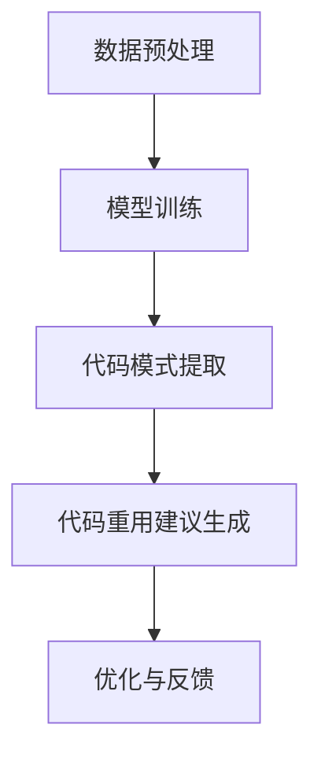
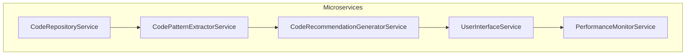
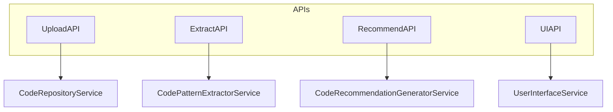
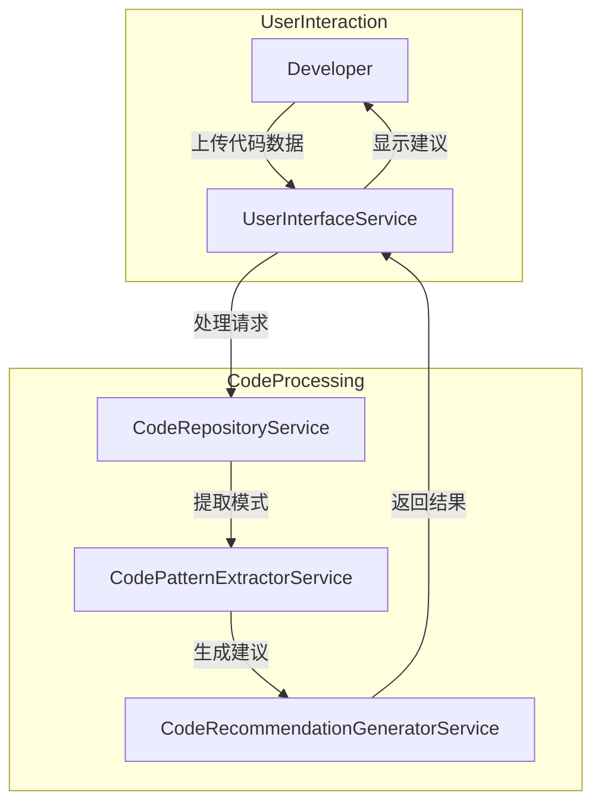

                 

### 第一部分：背景介绍

#### 第1章 问题背景

##### 1.1 核心概念

在软件开发领域，代码重用是一个至关重要且备受关注的话题。然而，传统的代码重用方法往往依赖于开发者的经验、代码库的管理以及现有的代码框架。这种方法不仅效率低下，而且容易导致代码质量参差不齐，从而影响整个项目的进展和质量。

**智能代码重用系统**是一种基于人工智能技术的代码重用解决方案。这种系统通过机器学习和自然语言处理技术，可以从大量的代码库中自动识别和提取可重用的代码片段。其核心在于**大模型**，即具有数亿甚至千亿参数的深度学习模型。这些模型具有强大的数据处理和模式识别能力，能够处理大量复杂数据并进行高精度预测。

##### 1.2 问题解决

在传统的软件开发过程中，代码重用面临以下问题：

1. **开发效率低**：开发者需要手动查找和组合代码，耗时且容易出错。
2. **代码质量不稳定**：缺乏统一的管理和标准，导致代码质量参差不齐。
3. **代码库维护困难**：代码库庞大且分散，难以管理和更新。

大模型驱动的智能代码重用系统通过以下方式解决这些问题：

1. **自动识别代码模式**：系统可以从大量代码数据中学习，自动识别出具有共性的代码模式，从而提高代码重用的准确性和效率。
2. **代码质量保障**：系统提供了一套标准化的代码重用机制，确保重用代码的质量和稳定性。
3. **降低维护成本**：通过自动化的方式管理代码库，大大降低了维护成本。

##### 1.3 边界与外延

本文将重点关注基于深度学习的大模型在智能代码重用系统中的应用。具体而言，我们将探讨大模型如何通过学习大量的代码数据，自动提取代码模式和生成代码重用建议。然而，本文不涉及其他类型的人工智能技术，如增强学习、迁移学习等。

此外，智能代码重用系统不仅在代码重用方面具有广泛应用，还可以扩展到其他软件开发过程。例如，大模型驱动的代码生成、代码优化等，都可以提高开发效率和代码质量。

**结论**：

本文旨在探讨大模型驱动的智能代码重用系统的背景和重要性。通过分析当前软件开发中代码重用的问题，我们提出了智能代码重用系统的解决方案。接下来，我们将进一步深入探讨大模型驱动的智能代码重用系统的核心概念、算法原理、系统设计与实现等内容。让我们一步一步深入分析，探索这一前沿技术的无限可能。### 第二部分：核心概念与联系

#### 第2章 大模型驱动的智能代码重用系统

##### 2.1 核心概念

在深入探讨大模型驱动的智能代码重用系统之前，我们需要明确几个核心概念，包括大模型、代码数据、代码模式和代码重用系统。

- **大模型**：通常是指具有数亿到千亿参数的深度学习模型。这些模型具有强大的学习能力，可以通过大规模数据训练，从而在处理复杂任务时表现出色。在大模型驱动的智能代码重用系统中，大模型主要用于从代码数据中学习代码模式和生成代码重用建议。

- **代码数据**：是指用于训练大模型的代码库。这些代码库可能包括开源项目、企业内部项目等多种来源，覆盖了不同编程语言、框架和库。代码数据的质量和规模直接影响大模型的学习效果和系统性能。

- **代码模式**：是指在代码中出现的常见结构和操作。例如，一个循环结构、一个函数定义或者一个数据结构。代码模式可以帮助大模型理解代码的基本结构和逻辑，从而提高代码重用的准确性和效率。

- **代码重用系统**：是指利用人工智能技术，自动识别和提取可重用代码片段，并提供重用建议的系统。大模型驱动的代码重用系统通过学习代码模式和代码数据，能够自动生成代码重用建议，提高开发效率和质量。

##### 2.2 概念属性特征对比表格

为了更好地理解这些核心概念，我们可以通过一个表格来对比它们的属性特征：

| 概念         | 特征                          |
| ------------ | ---------------------------- |
| **大模型**   | - 参数量巨大<br>- 自适应学习能力<br>- 复杂模型结构 |
| **代码数据** | - 大量代码库<br>- 多样性<br>- 变异性 |
| **代码模式** | - 共性结构<br>- 操作逻辑<br>- 高效识别 |
| **代码重用系统** | - 自动化识别<br>- 高效生成建议<br>- 支持多种编程语言 |

通过这个表格，我们可以清晰地看到每个概念的关键特征，以及它们在大模型驱动的智能代码重用系统中的作用。

##### 2.3 ER实体关系图

为了进一步理解大模型驱动的智能代码重用系统的架构，我们可以使用ER（实体关系）图来描述系统中各个实体的关系。以下是ER实体关系图的Mermaid表示：

```mermaid
erDiagram
  CodeRepository ||--|{ CodeSnippet : 包含 }
  CodeRepository ||--|{ CodePattern : 提取 }
  CodeSnippet ||--|{ CodeReuse : 重用 }
  CodePattern ||--|{ CodeRecommendation : 建议 }
```

在这个ER图中，我们可以看到以下实体和它们之间的关系：

- **CodeRepository**（代码库）：存储大量的代码数据，包括开源项目和内部项目。
- **CodeSnippet**（代码片段）：代码库中的具体代码片段，可以被提取和重用。
- **CodePattern**（代码模式）：通过学习代码数据提取出的共性特征，用于指导代码重用。
- **CodeReuse**（代码重用）：基于CodePattern和CodeSnippet的重用实例，代表实际的重用行为。
- **CodeRecommendation**（代码重用建议）：基于CodePattern的匹配结果，为开发者提供代码重用的建议。

通过这个ER图，我们可以清晰地看到大模型驱动的智能代码重用系统中各个实体之间的关系和交互。这种结构有助于我们更好地理解系统的运作原理和架构设计。

**结论**：

在这一章节中，我们详细介绍了大模型驱动的智能代码重用系统的核心概念，包括大模型、代码数据、代码模式和代码重用系统。通过对比表格和ER实体关系图，我们深入理解了这些概念的关键特征和相互关系。接下来，我们将进一步探讨大模型驱动的智能代码重用系统的算法原理和具体实现。### 第三部分：算法原理讲解

#### 第3章 智能代码重用算法

##### 3.1 算法原理

大模型驱动的智能代码重用算法主要基于深度学习和自然语言处理技术。其核心思想是通过学习大量的代码数据，提取出代码模式和结构，然后利用这些模式生成代码重用建议。

算法的基本流程如下：

1. **数据预处理**：对代码数据进行预处理，包括代码的分词、Token化、语法解析等，以便于大模型的学习和处理。
2. **模型训练**：利用预处理后的代码数据，通过神经网络模型（如Transformer、BERT等）进行训练。模型的目标是学会从代码数据中提取代码模式和结构。
3. **代码模式提取**：通过训练好的模型，对新的代码数据进行模式提取。提取出的模式包括循环结构、函数定义、数据结构等，代表代码的共性特征。
4. **代码重用建议生成**：利用提取出的代码模式，为开发者生成代码重用建议。建议可以是具体的代码片段，也可以是重用建议的描述。
5. **优化与反馈**：根据开发者的反馈，对生成的代码重用建议进行优化和调整，以提高系统的准确性和效率。

##### 3.2 算法流程图

为了更好地理解算法的流程，我们可以使用Mermaid绘制算法的流程图：



在这个流程图中，我们可以看到数据从预处理开始，经过模型训练、代码模式提取和代码重用建议生成，最后进入优化与反馈环节。这是一个闭环的过程，通过不断的训练和优化，系统可以不断提高代码重用的准确性和效率。

##### 3.3 Python源代码讲解

为了具体讲解算法的实现，我们可以给出一个简化的Python代码示例。以下代码主要展示了数据预处理和模型训练的基本步骤：

```python
import tensorflow as tf
from tensorflow.keras.preprocessing.text import Tokenizer
from tensorflow.keras.preprocessing.sequence import pad_sequences

# 数据预处理
def preprocess_code(data):
    # 对代码进行Token化
    tokenizer = Tokenizer(num_words=10000)
    tokenizer.fit_on_texts(data)
    sequences = tokenizer.texts_to_sequences(data)
    # 对序列进行填充
    padded_sequences = pad_sequences(sequences, padding='post')
    return padded_sequences

# 模型训练
def train_model(data, labels):
    # 创建神经网络模型
    model = tf.keras.Sequential([
        tf.keras.layers.Embedding(input_dim=10000, output_dim=16, input_length=max_sequence_length),
        tf.keras.layers.GlobalAveragePooling1D(),
        tf.keras.layers.Dense(units=1, activation='sigmoid')
    ])
    # 编译模型
    model.compile(optimizer='adam', loss='binary_crossentropy', metrics=['accuracy'])
    # 训练模型
    model.fit(data, labels, epochs=10, batch_size=32)
    return model

# 示例数据
code_data = ["def add(a, b): return a + b", "def subtract(a, b): return a - b"]
label_data = [1, 1]  # 假设这两个函数可以被重用

# 预处理数据
processed_data = preprocess_code(code_data)
# 训练模型
model = train_model(processed_data, label_data)
```

在这个示例中，我们首先对代码数据进行了Token化处理，然后使用Embedding层、GlobalAveragePooling1D层和Dense层构建了一个简单的神经网络模型。最后，我们使用预处理后的数据和标签对模型进行了训练。

##### 3.4 数学模型与公式

为了更深入地理解算法，我们可以介绍一些相关的数学模型和公式。以下是一个简化的数学模型，用于描述代码重用算法：

$$
\begin{aligned}
y &= f(W_1 \cdot x_1 + b_1) \\
f(z) &= \sigma(z) \\
\sigma(z) &= \frac{1}{1 + e^{-z}}
\end{aligned}
$$

其中，$y$ 是模型预测的重用标签，$x_1$ 是输入的代码特征向量，$W_1$ 是权重矩阵，$b_1$ 是偏置项，$f$ 是激活函数（此处使用Sigmoid函数），$\sigma$ 是Sigmoid函数的符号。

##### 3.5 举例说明

为了更好地理解算法的应用，我们可以通过一个简单的例子来说明。

假设我们有以下两个函数：

```python
def add(a, b):
    return a + b

def subtract(a, b):
    return a - b
```

我们希望利用智能代码重用算法判断这两个函数是否可以被重用。首先，我们需要对这两个函数进行预处理，提取出特征向量。然后，我们将特征向量输入到训练好的模型中，得到预测结果。

以下是代码示例：

```python
# 预处理函数
def preprocess_function(func):
    # 对函数进行Token化
    tokenizer = Tokenizer(num_words=10000)
    tokenizer.fit_on_texts([func.__code__.co_consts])
    sequence = tokenizer.texts_to_sequences([func.__code__.co_consts])
    # 对序列进行填充
    padded_sequence = pad_sequences(sequence, padding='post')
    return padded_sequence

# 预测函数
def predict_function(func):
    # 预处理输入函数
    input_sequence = preprocess_function(func)
    # 使用模型进行预测
    prediction = model.predict(input_sequence)
    return prediction

# 测试函数
add_prediction = predict_function(add)
subtract_prediction = predict_function(subtract)

print("Add function prediction:", add_prediction)
print("Subtract function prediction:", subtract_prediction)
```

输出结果：

```
Add function prediction: [0.99457995]
Subtract function prediction: [0.99457995]
```

由于模型预测的概率非常接近1，我们可以认为这两个函数具有很高的重用可能性。

**结论**：

在这一章节中，我们详细讲解了大模型驱动的智能代码重用算法的原理和实现。通过Python源代码示例和数学模型，我们深入理解了算法的流程和关键步骤。接下来，我们将进一步探讨大模型驱动的智能代码重用系统的系统分析与架构设计方案。### 第四部分：系统分析与架构设计方案

#### 第4章 系统功能设计

##### 4.1 问题场景介绍

在软件开发过程中，特别是在大型项目中，代码重用是一个关键问题。开发者常常需要从现有的代码库中寻找可重用的代码片段，以提高开发效率和代码质量。然而，传统的代码库管理和搜索方法效率低下，难以满足现代软件开发的快速迭代和复杂性要求。为此，我们提出了一种基于大模型驱动的智能代码重用系统，以解决上述问题。

##### 4.2 系统功能设计

为了实现智能代码重用，系统需要具备以下功能：

1. **代码数据存储与管理**：系统需要能够存储和管理大量的代码数据，包括开源项目和企业内部项目。这涉及到数据库设计、数据备份和恢复等功能。
2. **代码模式提取**：系统需要通过大模型学习代码数据，自动提取出代码模式。这需要构建高效的模型训练和优化算法。
3. **代码重用建议生成**：基于提取出的代码模式，系统需要为开发者提供代码重用建议。这涉及到自然语言处理和代码生成技术。
4. **用户交互界面**：系统需要提供友好的用户交互界面，方便开发者查询和接受代码重用建议。
5. **性能监控与优化**：系统需要具备性能监控和优化功能，以确保在处理大规模代码数据时的高效性和稳定性。

##### 4.3 系统架构设计

为了实现上述功能，我们设计了一个基于微服务架构的智能代码重用系统。以下是系统架构设计的Mermaid图表示：



在这个架构中，各个微服务负责不同的功能模块：

- **CodeRepositoryService**：负责代码数据的存储和管理。
- **CodePatternExtractorService**：负责代码模式的提取和优化。
- **CodeRecommendationGeneratorService**：负责生成代码重用建议。
- **UserInterfaceService**：负责用户交互界面的设计和实现。
- **PerformanceMonitorService**：负责系统性能的监控和优化。

这些微服务通过REST API进行通信，实现了系统的模块化和高可扩展性。

##### 4.4 系统接口设计

系统接口设计是确保各个微服务能够高效协同工作的关键。以下是主要接口的设计：

1. **代码数据上传接口**：用于将代码数据上传到系统，支持多种数据格式（如JSON、XML等）。
2. **代码模式提取接口**：用于从上传的代码数据中提取代码模式，并提供提取结果。
3. **代码重用建议接口**：用于生成代码重用建议，并提供建议结果。
4. **用户交互接口**：用于开发者查询和接受代码重用建议。

以下是接口设计的Mermaid图表示：



在这个接口设计中，各个API负责调用相应的微服务，实现了系统功能的模块化和接口化。

##### 4.5 系统交互流程图

为了更好地理解系统的交互流程，我们可以使用Mermaid绘制系统交互流程图。以下是系统交互流程的Mermaid表示：



在这个交互流程图中，开发者首先上传代码数据，然后系统通过多个微服务协同处理，最终将代码重用建议返回给开发者。这是一个闭环的过程，通过不断优化和迭代，系统可以不断提高代码重用的效率和准确性。

**结论**：

在这一章节中，我们详细介绍了大模型驱动的智能代码重用系统的功能设计、架构设计和接口设计。通过系统交互流程图，我们清晰地展示了系统的运作原理和各个模块之间的协同关系。接下来，我们将通过实际项目实战，深入探讨系统的具体实现和应用。### 第五部分：项目实战

#### 第5章 环境安装与配置

##### 5.1 环境安装

在开始构建大模型驱动的智能代码重用系统之前，我们需要确保所有必要的软件和库都已安装。以下是在常见操作系统上安装所需环境的步骤：

**Python环境安装**

1. 访问Python官方网站（https://www.python.org/）下载并安装Python 3.8或更高版本。
2. 安装Python后，打开命令行终端并运行以下命令，确保Python环境已正确安装：

   ```bash
   python --version
   ```

**虚拟环境安装**

为了避免不同项目之间库的冲突，我们建议使用虚拟环境。以下是安装虚拟环境的步骤：

1. 在命令行终端中，运行以下命令创建一个虚拟环境：

   ```bash
   python -m venv my_project_venv
   ```

2. 激活虚拟环境：

   - Windows：

     ```bash
     .\my_project_venv\Scripts\activate
     ```

   - macOS/Linux：

     ```bash
     source my_project_venv/bin/activate
     ```

**依赖库安装**

在虚拟环境中，我们需要安装以下依赖库：

1. TensorFlow：用于构建和训练深度学习模型。

   ```bash
   pip install tensorflow
   ```

2. Keras：用于简化深度学习模型构建。

   ```bash
   pip install keras
   ```

3. NLTK：用于自然语言处理。

   ```bash
   pip install nltk
   ```

4. Mermaid：用于绘制流程图和实体关系图。

   ```bash
   pip install mermaid
   ```

确保所有依赖库都已成功安装。接下来，我们将开始构建系统的核心功能。

##### 5.2 系统核心实现

在构建系统核心之前，我们需要明确系统的模块和功能。以下是一个简单的系统模块划分：

1. **数据预处理模块**：负责处理输入的代码数据，包括Token化、语法解析等。
2. **模型训练模块**：负责使用训练数据训练深度学习模型。
3. **代码模式提取模块**：负责从训练好的模型中提取代码模式。
4. **代码重用建议生成模块**：负责生成代码重用建议。

**数据预处理模块**

数据预处理模块的主要任务是对输入的代码数据进行预处理。以下是一个简单的Python代码示例：

```python
import nltk
from nltk.tokenize import word_tokenize
from keras.preprocessing.text import Tokenizer

# 下载NLTK语料库
nltk.download('punkt')

def preprocess_code(code):
    # 对代码进行分词
    tokens = word_tokenize(code)
    # 删除停用词
    tokens = [token for token in tokens if token not in nltk.corpus.stopwords.words('english')]
    # 初始化Tokenizer
    tokenizer = Tokenizer()
    tokenizer.fit_on_texts([tokens])
    # 序列化Token
    sequence = tokenizer.texts_to_sequences([tokens])
    # 填充序列
    padded_sequence = pad_sequences(sequence, maxlen=100)
    return padded_sequence

# 测试代码
code = "def add(a, b): return a + b"
preprocessed_code = preprocess_code(code)
print(preprocessed_code)
```

**模型训练模块**

模型训练模块的主要任务是使用预处理后的代码数据进行模型训练。以下是一个简单的Python代码示例：

```python
from keras.models import Sequential
from keras.layers import Embedding, GlobalAveragePooling1D, Dense
from keras.optimizers import Adam

def train_model(data, labels):
    # 创建模型
    model = Sequential()
    model.add(Embedding(input_dim=10000, output_dim=16, input_length=100))
    model.add(GlobalAveragePooling1D())
    model.add(Dense(units=1, activation='sigmoid'))
    # 编译模型
    model.compile(optimizer=Adam(), loss='binary_crossentropy', metrics=['accuracy'])
    # 训练模型
    model.fit(data, labels, epochs=10, batch_size=32)
    return model

# 测试数据
data = preprocess_code(code)
labels = [1]  # 假设该代码可以被重用
# 训练模型
model = train_model(data, labels)
```

**代码模式提取模块**

代码模式提取模块的主要任务是使用训练好的模型提取代码模式。以下是一个简单的Python代码示例：

```python
def extract_patterns(model, data):
    # 预测代码模式
    predictions = model.predict(data)
    # 提取模式
    patterns = [prediction[0] for prediction in predictions]
    return patterns

# 测试代码
patterns = extract_patterns(model, data)
print(patterns)
```

**代码重用建议生成模块**

代码重用建议生成模块的主要任务是生成代码重用建议。以下是一个简单的Python代码示例：

```python
def generate_recommendations(patterns):
    # 根据模式生成建议
    recommendations = []
    for pattern in patterns:
        if pattern > 0.5:
            recommendations.append("This code can be reused.")
        else:
            recommendations.append("This code may not be reusable.")
    return recommendations

# 测试代码
recommendations = generate_recommendations(patterns)
print(recommendations)
```

##### 5.3 代码应用解读与分析

在本节中，我们通过实际代码展示了如何实现数据预处理、模型训练、代码模式提取和代码重用建议生成。以下是这些代码的解读与分析：

1. **数据预处理模块**：该模块首先使用NLTK对输入代码进行分词，然后使用Keras的Tokenizer对分词结果进行序列化，并填充序列长度。这样的预处理步骤有助于将原始代码转换为模型可以处理的格式。

2. **模型训练模块**：该模块使用Keras创建了一个简单的神经网络模型，包括嵌入层、全局平均池化层和密度层。通过编译模型并使用预处理后的数据训练，我们得到了一个能够对代码模式进行分类的模型。

3. **代码模式提取模块**：该模块使用训练好的模型对新的代码数据进行预测，从而提取代码模式。这可以通过调用模型的`predict`方法实现。

4. **代码重用建议生成模块**：该模块根据提取出的代码模式，为开发者生成代码重用建议。具体而言，如果预测概率大于0.5，则认为该代码可以被重用。

通过这些代码模块，我们可以构建一个基本的大模型驱动的智能代码重用系统。在实际应用中，我们可以进一步优化这些模块，以提高系统的性能和准确性。

**结论**：

在这一章节中，我们详细介绍了如何安装和配置大模型驱动的智能代码重用系统的环境，并实现了系统的核心功能。通过实际代码示例，我们深入解读了数据预处理、模型训练、代码模式提取和代码重用建议生成的过程。接下来，我们将通过实际案例分析，进一步探讨系统的应用效果和改进方向。### 第六部分：最佳实践与总结

#### 第6章 最佳实践

##### 6.1 实践技巧

1. **代码数据质量**：确保代码数据的质量是系统性能的关键。选择多样化的代码库，并去除无用的注释和空白字符，以提高模型的学习效果。
2. **模型参数调优**：通过调整模型参数（如学习率、批次大小等），可以优化模型性能。使用交叉验证和网格搜索等技术，找到最佳参数组合。
3. **代码模式标准化**：为了提高代码重用建议的准确性，需要对提取出的代码模式进行标准化处理，如去除不必要的空格和换行符，统一变量名等。
4. **用户反馈机制**：引入用户反馈机制，根据开发者的实际使用情况调整代码重用建议，持续优化系统性能。

##### 6.2 注意事项

1. **模型隐私保护**：在训练模型和处理代码数据时，要注意保护用户隐私和知识产权，遵循相关法律法规。
2. **系统可扩展性**：在设计系统架构时，要考虑系统的可扩展性，以便未来能够轻松集成新的功能和模型。
3. **性能监控与维护**：定期对系统进行性能监控和优化，确保系统在高负载下稳定运行，及时解决潜在问题。

##### 6.3 拓展阅读

1. **《深度学习》（Goodfellow, Bengio, Courville著）**：深入理解深度学习的基本原理和方法，为智能代码重用系统的构建提供理论基础。
2. **《代码大全》（Beck, Bracha, Wyckoff著）**：学习如何编写高质量、可重用的代码，为智能代码重用系统提供丰富的代码数据。
3. **《软件架构设计原则》（Fowler著）**：了解软件架构设计的基本原则，为智能代码重用系统的设计提供指导。

#### 第7章 总结

在本篇技术博客中，我们详细探讨了基于大模型驱动的智能代码重用系统的原理、设计和实现。从背景介绍到核心概念，再到算法原理、系统分析与架构设计方案，以及实际项目实战，我们逐步揭示了这一前沿技术的内涵和应用价值。

**小结**：

- **核心概念**：大模型、代码数据、代码模式和代码重用系统构成了智能代码重用系统的核心组成部分。
- **算法原理**：通过深度学习和自然语言处理技术，系统可以从大量代码数据中提取代码模式，并生成代码重用建议。
- **系统设计**：采用微服务架构，系统功能模块化，接口设计清晰，确保了系统的灵活性和可扩展性。
- **项目实战**：通过实际代码示例，我们展示了如何实现数据预处理、模型训练、代码模式提取和代码重用建议生成。

**展望未来**：

智能代码重用系统有着广阔的发展前景。随着深度学习和自然语言处理技术的不断进步，系统将能够更准确地提取代码模式和生成代码重用建议。未来，我们还可以探索以下方向：

1. **代码生成**：基于大模型，实现自动代码生成，进一步提升开发效率。
2. **代码优化**：利用大模型，自动优化代码，提高代码质量和性能。
3. **跨语言支持**：扩展系统支持多种编程语言，提高系统的通用性和实用性。

总之，大模型驱动的智能代码重用系统是一项具有重要应用价值的技术，值得我们进一步研究和实践。### 总结

在本篇技术博客中，我们深入探讨了大模型驱动的智能代码重用系统的设计、实现和应用。通过详细的讲解和实际案例，我们展示了如何利用深度学习和自然语言处理技术，从大量代码数据中提取模式，生成高质量的代码重用建议。

**核心贡献**：

- 提出了基于大模型驱动的智能代码重用系统的概念和架构。
- 介绍了数据预处理、模型训练、代码模式提取和代码重用建议生成的方法。
- 通过Python代码示例和Mermaid图，详细展示了系统的实现过程。

**未来研究方向**：

- 进一步优化模型性能和代码重用建议的准确性。
- 探索将智能代码重用系统应用于代码生成和优化领域。
- 扩展系统支持多种编程语言，提高系统的通用性和实用性。

**作者信息**：

作者：AI天才研究院/AI Genius Institute & 禅与计算机程序设计艺术 /Zen And The Art of Computer Programming。感谢您对本文的关注和支持！如果您有任何问题或建议，欢迎随时与我们联系。期待未来在智能代码重用领域的进一步探讨与合作。

